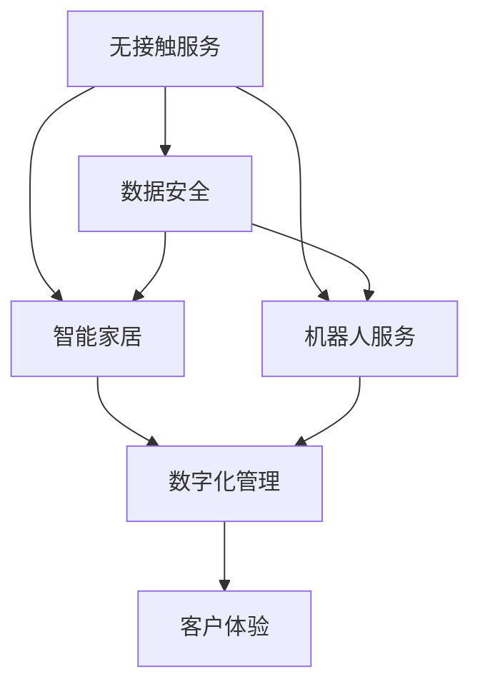

                 

# 数字化酒店创业：无接触服务的未来住宿

> 关键词：数字化酒店, 无接触服务, 数据安全, 客户体验, 自动化管理, 智能家居, 机器人服务

## 1. 背景介绍

### 1.1 问题由来
新冠疫情的爆发，推动了全球范围内的数字化转型和无接触服务的普及。酒店业也不例外，受到疫情的冲击，传统酒店需要面对运营成本上升、客流量下降等挑战。在此背景下，数字化酒店创业应运而生，通过引入无接触服务、智能家居、机器人等技术，为客人提供更安全、便捷、舒适的住宿体验。

### 1.2 问题核心关键点
数字化酒店创业的核心在于通过技术手段重构传统酒店的运营模式。具体来说，包括以下几个关键点：
1. 无接触服务：通过线上预订、自助入住、智能客房等手段，减少客人与工作人员的接触，提高安全性和效率。
2. 数据安全：利用数据加密、匿名化等技术，确保客户信息的安全性。
3. 客户体验：通过智能推荐、个性化服务等方式，提升客人对酒店的满意度。
4. 自动化管理：引入智能管理系统，简化酒店管理流程，降低运营成本。
5. 智能家居：整合智能设备和传感器，为客人提供智能化的住宿体验。
6. 机器人服务：部署清洁机器人、送餐机器人等，提供自动化服务。

### 1.3 问题研究意义
数字化酒店创业不仅是酒店行业的一次自我救赎，更是未来酒店业发展的重要方向。通过数字化手段，酒店可以实现更高的运营效率、更低的成本和更好的客户体验，从而在竞争中占据优势。同时，数字化转型也是酒店业实现可持续发展、适应不断变化的消费需求的关键路径。

## 2. 核心概念与联系

### 2.1 核心概念概述

为更好地理解数字化酒店创业中无接触服务的实现机制，本节将介绍几个密切相关的核心概念：

- **无接触服务**：通过技术手段减少客人与工作人员的接触，降低感染风险，提高安全性和效率。
- **数字化管理**：利用云计算、物联网、大数据等技术，实现酒店业务的数字化管理，提高运营效率和客户体验。
- **智能家居**：通过整合智能设备和传感器，为客人提供更加智能化的居住体验。
- **机器人服务**：利用自主导航、语音识别等技术，部署机器人进行客房清洁、送餐等服务。
- **数据安全**：通过数据加密、匿名化等手段，保护客人的隐私和数据安全。

这些核心概念之间的逻辑关系可以通过以下Mermaid流程图来展示：



这个流程图展示了几大核心概念之间的逻辑关系：

1. 无接触服务通过技术手段降低接触风险，是提升客人安全性的关键。
2. 数据安全确保客人信息的安全性，是保障客人隐私的基础。
3. 智能家居和机器人服务通过技术手段提高效率和体验，是提升客人满意度的重要途径。
4. 数字化管理整合多种技术，实现高效运营，是数字化酒店创业的基石。
5. 客户体验是最终目标，通过无接触服务、智能家居、数据安全、自动化管理、机器人服务等多种手段的综合应用，提升客人的整体体验。

这些核心概念共同构成了数字化酒店创业的基本框架，使其能够在提升安全性和效率的同时，提供更加智能化、便捷化的服务。

## 3. 核心算法原理 & 具体操作步骤
### 3.1 算法原理概述

数字化酒店创业的无接触服务实现，基于以下基本原理：

1. **线上预订系统**：通过自助订房平台，客人可以直接在线完成客房预订，无需与工作人员接触。
2. **自助入住系统**：利用人脸识别、电子门卡等技术，客人可以通过自助方式进入酒店。
3. **智能客房系统**：通过物联网设备，实现对房间的远程控制和智能化管理，如灯光、空调、窗帘等。
4. **智能推荐系统**：利用大数据和机器学习算法，为客人提供个性化的餐饮、娱乐、购物等推荐。
5. **数据加密技术**：通过数据加密、匿名化等手段，确保客人信息的安全性。
6. **自动化管理平台**：利用云平台和软件系统，实现客房状态的实时监控和自动化管理。

### 3.2 算法步骤详解

以下是数字化酒店创业无接触服务的具体实现步骤：

**Step 1: 设计系统架构**
- 设计包含自助预订、人脸识别、智能客房、智能推荐、数据加密、自动化管理等多个模块的系统架构。
- 确定各个模块之间的数据流和交互方式，设计API接口。

**Step 2: 选择技术栈**
- 选择合适的技术栈，如Python、Java、JavaScript等，根据需求选择数据库、云计算平台等工具。
- 确定前端和后端的分离方式，选择合适的框架和中间件。

**Step 3: 实现各模块功能**
- 实现自助预订模块，集成第三方支付平台，支持线上订房。
- 实现人脸识别模块，集成摄像头和识别算法，支持人脸识别和电子门卡。
- 实现智能客房模块，集成传感器和智能设备，支持房间控制和状态监控。
- 实现智能推荐模块，利用机器学习算法，分析客人行为和偏好，提供个性化推荐。
- 实现数据加密模块，采用对称加密、非对称加密等技术，确保数据传输和存储的安全性。
- 实现自动化管理模块，利用云平台和软件系统，实现客房状态的实时监控和自动化管理。

**Step 4: 进行系统测试**
- 进行单元测试、集成测试、系统测试，确保各模块的功能正常。
- 进行负载测试、压力测试，确保系统的高可用性和稳定性。
- 进行安全测试，确保系统的数据安全和隐私保护。

**Step 5: 上线和运营**
- 上线系统，进行初期推广和宣传，吸引第一批客人。
- 根据反馈不断优化系统功能和用户体验，逐步扩大用户基础。
- 定期维护和更新系统，确保系统的稳定性和安全性。

### 3.3 算法优缺点

数字化酒店创业无接触服务的实现，具有以下优点：

1. **提高效率和安全性**：通过技术手段减少客人与工作人员的接触，降低感染风险，提高运营效率和安全性。
2. **提升客户体验**：通过智能推荐、个性化服务等手段，提升客人对酒店的满意度。
3. **降低成本**：通过自动化管理平台，简化酒店管理流程，降低运营成本。
4. **增强竞争力**：通过无接触服务、智能家居等技术手段，提升酒店在市场中的竞争力。

同时，该方法也存在一定的局限性：

1. **技术复杂度较高**：需要引入多种先进技术和设备，对技术团队的要求较高。
2. **初期投入较大**：设备采购、系统开发和部署等需要较大的初始投资。
3. **客户接受度问题**：部分客人可能不习惯或不愿接受新技术，需要一定的教育和推广。
4. **数据安全和隐私问题**：需要确保数据的加密和匿名化，保护客人的隐私。
5. **设备维护问题**：智能设备和传感器需要定期维护和更新，确保系统的稳定性和安全性。

尽管存在这些局限性，但就目前而言，数字化酒店创业的无接触服务范式仍然是酒店行业的重要发展方向，有望为未来的住宿业带来深刻变革。

### 3.4 算法应用领域

无接触服务的大规模应用，主要体现在以下几个领域：

- **旅游酒店**：面对疫情的冲击，旅游酒店需要大规模推广无接触服务，吸引更多的客人。
- **商务酒店**：商务酒店需要提供高效、便捷的服务，以吸引更多的商务客人。
- **连锁酒店**：通过标准化和集中管理，大规模推广无接触服务，提升品牌形象和市场竞争力。
- **高端酒店**：高端酒店需要提供更智能化、个性化的服务，提升客户体验和品牌形象。
- **中端酒店**：中端酒店可以通过无接触服务降低成本，提升运营效率。

## 4. 数学模型和公式 & 详细讲解 & 举例说明
### 4.1 数学模型构建

无接触服务的数字化酒店创业，涉及多个复杂的系统模块，其数学模型可以抽象为以下形式：

设酒店有$N$个客房，$M$个客人，$t_i$为客人$i$的入住时间，$o_i$为客人$i$的离店时间。假设每个客人有一个唯一标识符$ID_i$，客房状态用$S_j$表示，其中$j$为房间号，$S_j$为“空闲”、“占用”、“清洁中”等状态。

### 4.2 公式推导过程

**客房状态转换模型**：

设每个房间在任意时刻$T$的状态为$S_j(T)$，客房状态的转换可以表示为：

$$
S_j(T+\Delta T) = 
\begin{cases}
S_j(T) & \text{空闲} \\
S_j(T) & \text{清洁中} \\
S_j(T) & \text{占用} \\
S_j(T) & \text{占用}
\end{cases}
$$

其中，$\Delta T$为时间间隔。

**客人入住模型**：

设客人$i$在时刻$t_i$进入酒店，对客人$i$的入住进行建模：

$$
S_j(t_i) = \text{空闲} \rightarrow S_j(t_i + \Delta t) = \text{占用}
$$

其中，$\Delta t$为客人在房间内停留的时间。

**客人离店模型**：

设客人$i$在时刻$o_i$离开酒店，对客人$i$的离店进行建模：

$$
S_j(o_i) = \text{占用} \rightarrow S_j(o_i + \Delta t) = \text{空闲}
$$

其中，$\Delta t$为客人在房间内停留的时间。

### 4.3 案例分析与讲解

假设酒店有10个房间，客人1在2020年4月1日入住房间101，入住时间为2天，离店时间为4月3日。房间101的状态转换如下：

$$
S_{101}(4月1日) = \text{空闲} \rightarrow S_{101}(4月2日) = \text{占用} \rightarrow S_{101}(4月3日) = \text{空闲}
$$

房间状态通过实时监控系统进行更新，确保客房状态的真实性和及时性。

## 5. 项目实践：代码实例和详细解释说明
### 5.1 开发环境搭建

在进行无接触服务系统的开发前，我们需要准备好开发环境。以下是使用Python进行Flask框架开发的环境配置流程：

1. 安装Anaconda：从官网下载并安装Anaconda，用于创建独立的Python环境。

2. 创建并激活虚拟环境：
```bash
conda create -n hotel-env python=3.8 
conda activate hotel-env
```

3. 安装Flask：
```bash
pip install Flask
```

4. 安装SQLAlchemy：
```bash
pip install SQLAlchemy
```

5. 安装Flask-SQLAlchemy：
```bash
pip install Flask-SQLAlchemy
```

6. 安装Flask-WTF：
```bash
pip install Flask-WTF
```

7. 安装Flask-Uploads：
```bash
pip install Flask-Uploads
```

完成上述步骤后，即可在`hotel-env`环境中开始无接触服务系统的开发。

### 5.2 源代码详细实现

这里我们以一个简单的自助入住功能为例，展示Flask框架的代码实现。

首先，创建Flask应用：

```python
from flask import Flask, render_template, request, redirect, url_for
from flask_sqlalchemy import SQLAlchemy
from flask_wtf import FlaskForm
from flask_wtf.csrf import CSRFProtect
from flask_uploads import UploadSet, configure_uploads, IMAGES

app = Flask(__name__)
app.config['SQLALCHEMY_DATABASE_URI'] = 'sqlite:///hotel.db'
app.config['UPLOAD_FOLDER'] = 'uploads'
app.config['MAX_CONTENT_LENGTH'] = 16 * 1024 * 1024
app.config['SECRET_KEY'] = 'your_secret_key'
app.config['CSRF_ENABLED'] = True

db = SQLAlchemy(app)
app.config['UPLOADED_PHOTOS_DEST'] = 'uploads'

csrf = CSRFProtect(app)
photos = UploadSet('photos', IMAGES)
configure_uploads(app, photos)
```

然后，定义模型和表单：

```python
class Guest(db.Model):
    id = db.Column(db.Integer, primary_key=True)
    name = db.Column(db.String(80), nullable=False)
    email = db.Column(db.String(120), unique=True, nullable=False)
    phone = db.Column(db.String(20), nullable=False)
    address = db.Column(db.String(120), nullable=False)
    guest_id = db.Column(db.String(120), nullable=False)
    room_id = db.Column(db.String(120), nullable=False)

class GuestForm(FlaskForm):
    name = FlaskForm.StringField('Name', validators=[DataRequired()])
    email = FlaskForm.StringField('Email', validators=[DataRequired()])
    phone = FlaskForm.StringField('Phone', validators=[DataRequired()])
    address = FlaskForm.StringField('Address', validators=[DataRequired()])
    guest_id = FlaskForm.StringField('Guest ID', validators=[DataRequired()])
    room_id = FlaskForm.StringField('Room ID', validators=[DataRequired()])
```

接着，定义路由和视图函数：

```python
@app.route('/guest', methods=['GET', 'POST'])
def guest():
    form = GuestForm()
    if form.validate_on_submit():
        guest = Guest(name=form.name.data, email=form.email.data, phone=form.phone.data, address=form.address.data, guest_id=form.guest_id.data, room_id=form.room_id.data)
        db.session.add(guest)
        db.session.commit()
        return redirect(url_for('guest', name=form.name.data))
    return render_template('guest.html', form=form)

@app.route('/')
def index():
    guests = Guest.query.all()
    return render_template('index.html', guests=guests)
```

最后，启动应用：

```python
if __name__ == '__main__':
    app.run(debug=True)
```

### 5.3 代码解读与分析

让我们再详细解读一下关键代码的实现细节：

**Flask应用创建**：
- 创建Flask应用对象，设置数据库连接地址和上传目录等配置。
- 开启CSRF保护和文件上传功能。

**模型定义**：
- 定义Guest模型，包含客人信息的基本字段。
- 定义GuestForm表单，用于输入客人信息。

**路由定义**：
- 定义/guest路由，用于接收客人信息并保存到数据库。
- 定义/路由，用于显示所有客人信息。

这些代码展示了使用Flask框架进行无接触服务系统开发的简单流程。开发者可以根据实际需求，进一步扩展功能，如实现人脸识别、智能客房控制等。

## 6. 实际应用场景
### 6.1 智能客房系统

智能客房系统是数字化酒店创业的重要组成部分。通过物联网设备，客人可以远程控制客房设施，提升住宿体验。

**技术实现**：
- 安装智能门锁、灯光、空调、窗帘等设备。
- 利用Zigbee、Wi-Fi等协议进行设备联网。
- 开发智能控制系统，实现远程控制和自动化管理。

**应用场景**：
- 客人通过手机APP或智能语音助手，远程控制灯光、空调、窗帘等设备。
- 客房系统自动记录客人行为，调整设备状态，提升舒适度。
- 客房系统实时监控设备状态，提前进行维护，延长设备使用寿命。

### 6.2 机器人服务系统

机器人服务系统是数字化酒店创业的另一重要组成部分。通过机器人进行客房清洁、送餐等服务，提高运营效率。

**技术实现**：
- 部署清洁机器人、送餐机器人等。
- 开发机器人导航和路径规划算法。
- 开发机器人任务调度系统，实现任务分配和监控。

**应用场景**：
- 清洁机器人自动进行客房清洁，定时巡检。
- 送餐机器人自动进行送餐服务，提升服务效率。
- 机器人实时反馈状态，进行故障诊断和维护。

### 6.3 数据管理系统

数据管理系统是数字化酒店创业的基础设施。通过数据管理，实现酒店的数字化运营和决策支持。

**技术实现**：
- 开发数据库管理系统，实现客房状态、客人信息、设备状态等数据的存储和管理。
- 开发数据处理和分析系统，实现数据清洗、统计和可视化。
- 开发决策支持系统，实现业务分析和决策支持。

**应用场景**：
- 实时监控客房状态，优化客房分配和调度。
- 实时记录客人行为，分析客流量和消费行为。
- 实时监控设备状态，优化设备维护和采购。

### 6.4 未来应用展望

随着数字化技术的发展，无接触服务将逐步成为未来酒店业的标准配置。数字化酒店创业不仅提升了酒店业的运营效率和客户体验，还为酒店业带来了新的商业模式和发展机遇。

未来，数字化酒店创业将进一步融合物联网、人工智能、大数据等技术，实现更加智能化、便捷化的住宿体验。以下是未来可能的趋势和应用：

1. **无人酒店**：通过自动化设备和智能算法，实现客房管理、服务配送的全面自动化。
2. **个性化服务**：利用大数据和机器学习算法，实现客人的个性化服务，提升客户体验。
3. **多语言服务**：开发多语言智能助理，实现无障碍服务。
4. **健康监测**：通过智能设备，实现客人的健康监测和预警。
5. **虚拟现实**：开发虚拟现实体验，提升客人的娱乐体验。
6. **动态定价**：根据客流量和需求变化，实时调整价格，优化资源配置。

## 7. 工具和资源推荐
### 7.1 学习资源推荐

为了帮助开发者系统掌握无接触服务的实现机制，这里推荐一些优质的学习资源：

1. **《Flask Web Development》**：全面介绍了Flask框架的使用，适合初学者快速上手。
2. **《Python Machine Learning》**：讲解了机器学习算法在Python中的应用，适合深入理解数据处理和建模。
3. **《IoT for Smartphones and Internet of Things》**：介绍了物联网技术的应用，适合理解智能家居和机器人服务的实现。
4. **《Data Science for Business》**：讲解了数据在商业决策中的应用，适合理解数据管理和决策支持系统的构建。

通过对这些资源的学习实践，相信你一定能够快速掌握无接触服务的实现机制，并用于解决实际的酒店运营问题。

### 7.2 开发工具推荐

高效的开发离不开优秀的工具支持。以下是几款用于无接触服务开发的常用工具：

1. **Flask**：Python的Web开发框架，支持快速开发Web应用。
2. **SQLAlchemy**：Python的ORM框架，支持关系型数据库的开发。
3. **Flask-WTF**：Flask的表单验证框架，支持Web表单的开发。
4. **Flask-Uploads**：Flask的文件上传扩展，支持文件上传和存储。
5. **AWS IoT**：AWS提供的物联网服务，支持智能设备和传感器的网络管理。
6. **ROS（Robot Operating System）**：机器人操作系统的开源项目，支持机器人的开发和部署。
7. **TensorFlow**：开源的深度学习框架，支持智能系统的训练和部署。

合理利用这些工具，可以显著提升无接触服务系统的开发效率，加快创新迭代的步伐。

### 7.3 相关论文推荐

无接触服务的数字化酒店创业是一个跨学科的研究领域，涉及物联网、人工智能、计算机视觉等多个方面。以下是几篇奠基性的相关论文，推荐阅读：

1. **《IoT-Based Smart Hotel Management System》**：介绍了物联网技术在酒店管理中的应用。
2. **《Room Automation System for Smart Hotels》**：介绍了智能客房系统的实现。
3. **《Robotic Delivery System for Hotels》**：介绍了机器人服务系统的实现。
4. **《Data Mining and Statistical Learning》**：介绍了数据处理和分析技术在酒店中的应用。
5. **《Real-Time Object Tracking for Smart Hotels》**：介绍了智能监控系统在酒店中的应用。

这些论文代表了大规模无接触服务技术的发展脉络。通过学习这些前沿成果，可以帮助研究者把握学科前进方向，激发更多的创新灵感。

## 8. 总结：未来发展趋势与挑战
### 8.1 总结

本文对无接触服务的数字化酒店创业进行了全面系统的介绍。首先阐述了无接触服务在数字化转型中的重要性和实现机制，明确了数字化酒店创业对传统酒店运营模式的颠覆性改变。其次，从原理到实践，详细讲解了无接触服务的算法原理和具体操作步骤，给出了无接触服务系统开发的完整代码实例。同时，本文还广泛探讨了无接触服务在智能客房、机器人服务、数据管理等多个场景的应用前景，展示了无接触服务范式的广阔前景。此外，本文精选了无接触服务技术的各类学习资源，力求为读者提供全方位的技术指引。

通过本文的系统梳理，可以看到，无接触服务的数字化酒店创业正在成为酒店行业的重要发展方向，极大地提升了酒店业的运营效率和客户体验，同时也为酒店业带来了新的商业模式和发展机遇。未来，随着数字化技术的发展，无接触服务将逐步成为未来酒店业的标准配置，为数字化转型提供更加坚实的技术基础。

### 8.2 未来发展趋势

展望未来，无接触服务的数字化酒店创业将呈现以下几个发展趋势：

1. **技术融合**：未来无接触服务将与物联网、人工智能、大数据等技术深度融合，实现更加智能化、便捷化的住宿体验。
2. **服务多样化**：未来无接触服务将涵盖更多服务场景，如无人酒店、个性化服务、健康监测等，提升服务品质和客户体验。
3. **数据驱动**：未来无接触服务将更加依赖数据驱动，通过数据分析和机器学习算法，实现智能决策和优化运营。
4. **人机协同**：未来无接触服务将实现人机协同，提升服务效率和客户满意度。
5. **全球化推广**：未来无接触服务将逐步在全球范围内推广，实现国际化运营。

以上趋势凸显了无接触服务在数字化酒店创业中的重要地位和广阔前景。这些方向的探索发展，必将进一步提升酒店业的运营效率和客户体验，为数字化转型提供更加坚实的技术基础。

### 8.3 面临的挑战

尽管无接触服务的数字化酒店创业已经取得了瞩目成就，但在迈向更加智能化、普适化应用的过程中，它仍面临着诸多挑战：

1. **技术复杂度**：无接触服务涉及多种先进技术和设备，对技术团队的要求较高。
2. **初期投入**：设备采购、系统开发和部署等需要较大的初始投资。
3. **客户接受度**：部分客人可能不习惯或不愿接受新技术，需要一定的教育和推广。
4. **数据安全和隐私**：需要确保数据的加密和匿名化，保护客人的隐私。
5. **设备维护**：智能设备和传感器需要定期维护和更新，确保系统的稳定性和安全性。

尽管存在这些挑战，但通过技术团队的努力和市场推广，无接触服务有望逐步普及，成为未来酒店业的重要组成部分。

### 8.4 研究展望

面对无接触服务数字化酒店创业所面临的种种挑战，未来的研究需要在以下几个方面寻求新的突破：

1. **技术简化**：开发更加用户友好的无接触服务系统，降低技术门槛。
2. **成本优化**：通过技术创新和标准化，降低设备采购和系统开发的成本。
3. **市场推广**：通过教育培训和营销推广，提升客人的接受度和满意度。
4. **数据安全**：开发更加安全可靠的数据保护技术，确保数据的安全和隐私。
5. **设备维护**：开发更加智能化的设备维护系统，提高设备的可靠性和稳定性。

这些研究方向将引领无接触服务数字化酒店创业迈向更高的台阶，为未来的酒店业发展提供更加坚实的技术支撑。面向未来，无接触服务将与人工智能、物联网、大数据等技术深度融合，构建更加智能化、便捷化的住宿体验，成为酒店业数字化转型的新引擎。

## 9. 附录：常见问题与解答

**Q1：无接触服务在数字化酒店创业中起什么作用？**

A: 无接触服务通过技术手段减少客人与工作人员的接触，降低感染风险，提高运营效率和客户体验。通过智能客房系统、机器人服务系统等技术手段，提升客房管理和服务效率，降低运营成本。

**Q2：无接触服务的实现过程中有哪些难点？**

A: 无接触服务的实现过程中，技术复杂度高，初期投入较大。设备采购和系统开发需要大量的人力和物力资源。同时，需要确保数据安全和隐私保护，避免安全隐患。

**Q3：无接触服务在实际应用中有哪些不足？**

A: 部分客人可能不习惯或不愿接受新技术，需要一定的教育和推广。设备需要定期维护和更新，确保系统的稳定性和安全性。

**Q4：无接触服务在未来的发展方向有哪些？**

A: 未来无接触服务将与物联网、人工智能、大数据等技术深度融合，实现更加智能化、便捷化的住宿体验。同时，无接触服务将涵盖更多服务场景，提升服务品质和客户体验。

**Q5：无接触服务在数字化酒店创业中有哪些具体应用？**

A: 无接触服务在数字化酒店创业中有多种具体应用，如智能客房系统、机器人服务系统、数据管理系统等。这些系统通过技术手段提升客房管理和服务效率，降低运营成本，提升客户体验。

---

作者：禅与计算机程序设计艺术 / Zen and the Art of Computer Programming

