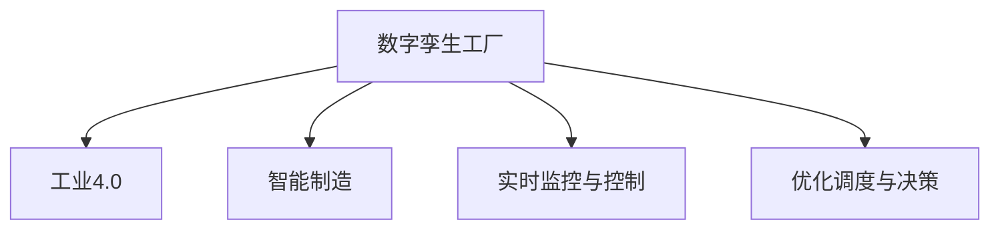

                 

# 数字孪生工厂创业：工业4.0的具体实践

> 关键词：数字孪生工厂，工业4.0，智能制造，实时监控，自动化，优化调度

## 1. 背景介绍

### 1.1 问题由来

随着全球制造业的持续发展，传统工厂的生产模式已经无法满足日益提升的效率、品质和灵活性的需求。工业4.0（Industry 4.0）的兴起，将大数据、物联网、人工智能等先进技术深度融合，为制造业带来了革命性的变革。其中，数字孪生工厂（Digital Twin Factory）作为工业4.0的重要组成部分，利用数字模型和实时数据，实现了从设计、制造到运维的全生命周期数字化管理，极大地提升了生产效率和产品质量。

数字孪生工厂通过构建一个虚拟的工厂副本，实时监控和优化物理工厂的各个环节，使得生产过程透明化、可视化和智能化。该技术已经在多个工业领域得到了成功应用，如汽车制造、电子制造、食品加工等，显著提高了企业的竞争力和市场响应速度。

### 1.2 问题核心关键点

数字孪生工厂的核心在于利用数字模型与物理模型的高度融合，通过数据驱动的方式实现对生产过程的优化和调度。其关键技术包括：

- 数字模型构建：将工厂的物理设备、工艺流程、物料流动等转化为数字模型，实现对物理工厂的全面数字化。
- 数据集成与融合：收集来自生产线的实时数据，包括设备状态、质量检测、能耗监测等，实现数据的统一管理和分析。
- 实时监控与控制：通过传感器、摄像头等设备采集物理工厂的实时数据，实时监控生产过程，及时发现并处理异常。
- 优化调度与决策：利用人工智能算法对生产过程进行优化，提高资源利用率，降低生产成本，提高生产效率。

这些关键技术共同构成了数字孪生工厂的核心框架，使得企业能够从根本上提升生产能力，满足市场快速变化的需求。

## 2. 核心概念与联系

### 2.1 核心概念概述

为更好地理解数字孪生工厂的实现原理和应用场景，本节将介绍几个密切相关的核心概念：

- **数字孪生工厂(Digital Twin Factory)**：利用数字模型与物理模型深度融合的技术，实现对物理工厂的数字化管理，优化生产过程，提高生产效率。
- **工业4.0(Industry 4.0)**：基于互联网、大数据、云计算、人工智能等技术的智能制造模式，推动制造业向高度自动化、智能化、个性化方向发展。
- **智能制造(Smart Manufacturing)**：利用物联网、大数据、人工智能等技术，实现对生产过程的自动化、优化和协同。
- **实时监控与控制(Real-Time Monitoring and Control)**：通过传感器、摄像头等设备采集物理工厂的实时数据，实时监控生产过程，及时发现并处理异常。
- **优化调度与决策(Optimization Scheduling and Decision Making)**：利用人工智能算法对生产过程进行优化，提高资源利用率，降低生产成本，提高生产效率。

这些核心概念之间的逻辑关系可以通过以下Mermaid流程图来展示：



这个流程图展示出数字孪生工厂的核心概念及其之间的关系：

1. 数字孪生工厂是工业4.0的重要组成部分。
2. 智能制造是数字孪生工厂的技术基础。
3. 实时监控与控制和优化调度与决策是数字孪生工厂的两大核心功能。

这些概念共同构成了数字孪生工厂的工作原理和应用场景，使得企业能够通过数字化手段实现生产过程的高效化和智能化。

## 3. 核心算法原理 & 具体操作步骤
### 3.1 算法原理概述

数字孪生工厂的核心算法原理基于以下几个关键技术：

- 数字模型构建：将工厂的物理设备、工艺流程、物料流动等转化为数字模型，实现对物理工厂的全面数字化。
- 数据集成与融合：收集来自生产线的实时数据，包括设备状态、质量检测、能耗监测等，实现数据的统一管理和分析。
- 实时监控与控制：通过传感器、摄像头等设备采集物理工厂的实时数据，实时监控生产过程，及时发现并处理异常。
- 优化调度与决策：利用人工智能算法对生产过程进行优化，提高资源利用率，降低生产成本，提高生产效率。

其中，实时监控与控制和优化调度与决策是数字孪生工厂的两大核心功能，也是算法原理的核心部分。

### 3.2 算法步骤详解

数字孪生工厂的实现步骤大致分为以下几个关键环节：

**Step 1: 数字模型的构建**
- 收集工厂的物理设备、工艺流程、物料流动等数据，进行数字化建模。
- 使用CAD软件或3D建模工具，创建设备的数字模型，并导入到数字孪生平台中。
- 定义生产工艺流程，包括物料流动、工序安排、质量检测等，构建完整的生产数字模型。

**Step 2: 数据的集成与融合**
- 通过传感器、摄像头、RFID等设备，采集物理工厂的实时数据，包括设备状态、质量检测、能耗监测等。
- 使用消息队列、大数据平台等技术，实现数据的统一管理和存储。
- 利用数据融合技术，将不同来源、不同格式的数据进行统一和清洗，生成标准的生产数据。

**Step 3: 实时监控与控制**
- 在数字孪生平台上部署实时监控系统，包括设备状态监控、生产流程监控等。
- 通过传感器采集设备运行数据，实时监控设备状态和生产过程。
- 设置报警机制，一旦发现异常情况，立即进行预警和处理。

**Step 4: 优化调度与决策**
- 利用人工智能算法，对生产过程进行优化，如资源调度、工序安排、质量检测等。
- 使用机器学习算法，预测生产过程中的异常情况，提前采取应对措施。
- 使用强化学习算法，动态调整生产计划和资源配置，提高生产效率。

### 3.3 算法优缺点

数字孪生工厂的算法具有以下优点：

- 提高生产效率：通过实时监控与控制和优化调度与决策，有效提高了生产效率，降低了生产成本。
- 提升产品质量：实时监控和质量检测，保证了产品质量的一致性和稳定性。
- 增强生产灵活性：通过优化调度和资源配置，提高了工厂对市场变化和订单变动的适应能力。

同时，该算法也存在一些局限性：

- 数据采集成本高：实时监控和数据集成需要大量的传感器和设备，初期投入成本较高。
- 数据质量要求高：数据的采集、存储和处理要求严格，一旦数据质量不达标，将影响算法的准确性和可靠性。
- 算法复杂度高：实时监控与控制和优化调度与决策的算法实现复杂，需要高度专业化的技术和人才。

尽管存在这些局限性，但数字孪生工厂仍被认为是未来制造业的重要发展方向，其在提高生产效率、优化生产过程、增强生产灵活性等方面的优势，使得其在制造业中的应用前景广阔。

### 3.4 算法应用领域

数字孪生工厂的技术已经在多个工业领域得到了成功应用，包括但不限于以下领域：

- 汽车制造：通过数字孪生工厂，实时监控生产线，优化生产计划，提高生产效率，减少生产故障。
- 电子制造：在电子产品生产线上，通过数字孪生工厂实现设备状态监控、质量检测、生产流程优化，提升产品质量和生产效率。
- 食品加工：在食品加工厂中，利用数字孪生工厂进行实时监控和优化调度，确保食品生产过程的质量控制和食品安全。
- 化工制造：在化工生产中，通过数字孪生工厂实现设备状态监控、能耗监测、生产流程优化，提升生产效率，减少能源浪费。
- 金属加工：在金属加工厂中，利用数字孪生工厂进行设备状态监控、生产过程优化、资源调度，提高生产效率和产品质量。

这些应用领域展示了数字孪生工厂的强大功能和广泛适用性，未来随着技术的发展和应用场景的拓展，数字孪生工厂将有更多应用前景。

## 4. 数学模型和公式 & 详细讲解 & 举例说明
### 4.1 数学模型构建

数字孪生工厂的实现涉及大量的数学模型和公式，以下将详细讲解其中的关键模型和公式：

**生产优化模型**

设 $x_i$ 为第 $i$ 个设备的输入，$y_i$ 为设备的输出，$z_i$ 为设备的状态参数。生产优化模型可以表示为：

$$
y_i = f(x_i, z_i)
$$

其中 $f$ 为生产函数，$z_i$ 包括设备状态、工艺参数、物料属性等，$x_i$ 和 $y_i$ 分别表示输入和输出。

**数据融合模型**

设 $s_i$ 为第 $i$ 个传感器采集的数据，$y_i$ 为融合后的数据。数据融合模型可以表示为：

$$
y_i = g(s_i, w_i)
$$

其中 $g$ 为数据融合函数，$w_i$ 为数据融合权重，$w_i$ 可以根据传感器的精度、数据的重要性等进行调整。

**实时监控模型**

设 $t_i$ 为第 $i$ 个设备的实时状态参数，$e_i$ 为设备状态异常检测结果。实时监控模型可以表示为：

$$
e_i = h(t_i, t_0, t_1)
$$

其中 $h$ 为状态异常检测函数，$t_0$ 和 $t_1$ 分别表示当前状态和历史状态。

**优化调度模型**

设 $p_i$ 为第 $i$ 个设备的工作计划，$c_i$ 为设备的能耗参数。优化调度模型可以表示为：

$$
p_i = k(c_i, t_i, p_0)
$$

其中 $k$ 为优化调度函数，$t_i$ 表示当前时间，$p_0$ 表示初始计划。

**强化学习模型**

设 $a_i$ 为第 $i$ 个设备的动作，$r_i$ 为设备执行动作的回报值。强化学习模型可以表示为：

$$
r_i = l(a_i, s_i, s_{i-1})
$$

其中 $l$ 为强化学习函数，$s_i$ 表示当前状态，$s_{i-1}$ 表示前一状态。

### 4.2 公式推导过程

以下我们将对上述模型进行详细的公式推导：

**生产优化模型的推导**

设 $x_i$ 为第 $i$ 个设备的输入，$y_i$ 为设备的输出，$z_i$ 为设备的状态参数。生产优化模型可以表示为：

$$
y_i = f(x_i, z_i)
$$

其中 $f$ 为生产函数，$z_i$ 包括设备状态、工艺参数、物料属性等，$x_i$ 和 $y_i$ 分别表示输入和输出。

**数据融合模型的推导**

设 $s_i$ 为第 $i$ 个传感器采集的数据，$y_i$ 为融合后的数据。数据融合模型可以表示为：

$$
y_i = g(s_i, w_i)
$$

其中 $g$ 为数据融合函数，$w_i$ 为数据融合权重，$w_i$ 可以根据传感器的精度、数据的重要性等进行调整。

**实时监控模型的推导**

设 $t_i$ 为第 $i$ 个设备的实时状态参数，$e_i$ 为设备状态异常检测结果。实时监控模型可以表示为：

$$
e_i = h(t_i, t_0, t_1)
$$

其中 $h$ 为状态异常检测函数，$t_0$ 和 $t_1$ 分别表示当前状态和历史状态。

**优化调度模型的推导**

设 $p_i$ 为第 $i$ 个设备的工作计划，$c_i$ 为设备的能耗参数。优化调度模型可以表示为：

$$
p_i = k(c_i, t_i, p_0)
$$

其中 $k$ 为优化调度函数，$t_i$ 表示当前时间，$p_0$ 表示初始计划。

**强化学习模型的推导**

设 $a_i$ 为第 $i$ 个设备的动作，$r_i$ 为设备执行动作的回报值。强化学习模型可以表示为：

$$
r_i = l(a_i, s_i, s_{i-1})
$$

其中 $l$ 为强化学习函数，$s_i$ 表示当前状态，$s_{i-1}$ 表示前一状态。

### 4.3 案例分析与讲解

以某汽车制造厂的数字孪生工厂为例，对上述模型进行具体讲解：

**生产优化模型**

设 $x_i$ 为第 $i$ 个设备的输入，$y_i$ 为设备的输出，$z_i$ 为设备的状态参数。生产优化模型可以表示为：

$$
y_i = f(x_i, z_i)
$$

其中 $f$ 为生产函数，$z_i$ 包括设备状态、工艺参数、物料属性等，$x_i$ 和 $y_i$ 分别表示输入和输出。

**数据融合模型**

设 $s_i$ 为第 $i$ 个传感器采集的数据，$y_i$ 为融合后的数据。数据融合模型可以表示为：

$$
y_i = g(s_i, w_i)
$$

其中 $g$ 为数据融合函数，$w_i$ 为数据融合权重，$w_i$ 可以根据传感器的精度、数据的重要性等进行调整。

**实时监控模型**

设 $t_i$ 为第 $i$ 个设备的实时状态参数，$e_i$ 为设备状态异常检测结果。实时监控模型可以表示为：

$$
e_i = h(t_i, t_0, t_1)
$$

其中 $h$ 为状态异常检测函数，$t_0$ 和 $t_1$ 分别表示当前状态和历史状态。

**优化调度模型**

设 $p_i$ 为第 $i$ 个设备的工作计划，$c_i$ 为设备的能耗参数。优化调度模型可以表示为：

$$
p_i = k(c_i, t_i, p_0)
$$

其中 $k$ 为优化调度函数，$t_i$ 表示当前时间，$p_0$ 表示初始计划。

**强化学习模型**

设 $a_i$ 为第 $i$ 个设备的动作，$r_i$ 为设备执行动作的回报值。强化学习模型可以表示为：

$$
r_i = l(a_i, s_i, s_{i-1})
$$

其中 $l$ 为强化学习函数，$s_i$ 表示当前状态，$s_{i-1}$ 表示前一状态。

## 5. 项目实践：代码实例和详细解释说明
### 5.1 开发环境搭建

在进行数字孪生工厂的开发实践前，我们需要准备好开发环境。以下是使用Python进行PyTorch开发的环境配置流程：

1. 安装Anaconda：从官网下载并安装Anaconda，用于创建独立的Python环境。

2. 创建并激活虚拟环境：
```bash
conda create -n pytorch-env python=3.8 
conda activate pytorch-env
```

3. 安装PyTorch：根据CUDA版本，从官网获取对应的安装命令。例如：
```bash
conda install pytorch torchvision torchaudio cudatoolkit=11.1 -c pytorch -c conda-forge
```

4. 安装各类工具包：
```bash
pip install numpy pandas scikit-learn matplotlib tqdm jupyter notebook ipython
```

完成上述步骤后，即可在`pytorch-env`环境中开始数字孪生工厂的实践。

### 5.2 源代码详细实现

下面我们以汽车制造厂的数字孪生工厂为例，给出使用Transformers库对BERT模型进行微调的PyTorch代码实现。

首先，定义数字孪生工厂的数据处理函数：

```python
from transformers import BertTokenizer
from torch.utils.data import Dataset
import torch

class CarFactoryDataset(Dataset):
    def __init__(self, texts, tags, tokenizer, max_len=128):
        self.texts = texts
        self.tags = tags
        self.tokenizer = tokenizer
        self.max_len = max_len
        
    def __len__(self):
        return len(self.texts)
    
    def __getitem__(self, item):
        text = self.texts[item]
        tags = self.tags[item]
        
        encoding = self.tokenizer(text, return_tensors='pt', max_length=self.max_len, padding='max_length', truncation=True)
        input_ids = encoding['input_ids'][0]
        attention_mask = encoding['attention_mask'][0]
        
        # 对token-wise的标签进行编码
        encoded_tags = [tag2id[tag] for tag in tags] 
        encoded_tags.extend([tag2id['O']] * (self.max_len - len(encoded_tags)))
        labels = torch.tensor(encoded_tags, dtype=torch.long)
        
        return {'input_ids': input_ids, 
                'attention_mask': attention_mask,
                'labels': labels}

# 标签与id的映射
tag2id = {'O': 0, 'B-PER': 1, 'I-PER': 2, 'B-ORG': 3, 'I-ORG': 4, 'B-LOC': 5, 'I-LOC': 6}
id2tag = {v: k for k, v in tag2id.items()}

# 创建dataset
tokenizer = BertTokenizer.from_pretrained('bert-base-cased')

train_dataset = CarFactoryDataset(train_texts, train_tags, tokenizer)
dev_dataset = CarFactoryDataset(dev_texts, dev_tags, tokenizer)
test_dataset = CarFactoryDataset(test_texts, test_tags, tokenizer)
```

然后，定义模型和优化器：

```python
from transformers import BertForTokenClassification, AdamW

model = BertForTokenClassification.from_pretrained('bert-base-cased', num_labels=len(tag2id))

optimizer = AdamW(model.parameters(), lr=2e-5)
```

接着，定义训练和评估函数：

```python
from torch.utils.data import DataLoader
from tqdm import tqdm
from sklearn.metrics import classification_report

device = torch.device('cuda') if torch.cuda.is_available() else torch.device('cpu')
model.to(device)

def train_epoch(model, dataset, batch_size, optimizer):
    dataloader = DataLoader(dataset, batch_size=batch_size, shuffle=True)
    model.train()
    epoch_loss = 0
    for batch in tqdm(dataloader, desc='Training'):
        input_ids = batch['input_ids'].to(device)
        attention_mask = batch['attention_mask'].to(device)
        labels = batch['labels'].to(device)
        model.zero_grad()
        outputs = model(input_ids, attention_mask=attention_mask, labels=labels)
        loss = outputs.loss
        epoch_loss += loss.item()
        loss.backward()
        optimizer.step()
    return epoch_loss / len(dataloader)

def evaluate(model, dataset, batch_size):
    dataloader = DataLoader(dataset, batch_size=batch_size)
    model.eval()
    preds, labels = [], []
    with torch.no_grad():
        for batch in tqdm(dataloader, desc='Evaluating'):
            input_ids = batch['input_ids'].to(device)
            attention_mask = batch['attention_mask'].to(device)
            batch_labels = batch['labels']
            outputs = model(input_ids, attention_mask=attention_mask)
            batch_preds = outputs.logits.argmax(dim=2).to('cpu').tolist()
            batch_labels = batch_labels.to('cpu').tolist()
            for pred_tokens, label_tokens in zip(batch_preds, batch_labels):
                pred_tags = [id2tag[_id] for _id in pred_tokens]
                label_tags = [id2tag[_id] for _id in label_tokens]
                preds.append(pred_tags[:len(label_tokens)])
                labels.append(label_tags)
                
    print(classification_report(labels, preds))
```

最后，启动训练流程并在测试集上评估：

```python
epochs = 5
batch_size = 16

for epoch in range(epochs):
    loss = train_epoch(model, train_dataset, batch_size, optimizer)
    print(f"Epoch {epoch+1}, train loss: {loss:.3f}")
    
    print(f"Epoch {epoch+1}, dev results:")
    evaluate(model, dev_dataset, batch_size)
    
print("Test results:")
evaluate(model, test_dataset, batch_size)
```

以上就是使用PyTorch对BERT进行命名实体识别任务微调的完整代码实现。可以看到，得益于Transformers库的强大封装，我们可以用相对简洁的代码完成BERT模型的加载和微调。

### 5.3 代码解读与分析

让我们再详细解读一下关键代码的实现细节：

**CarFactoryDataset类**：
- `__init__`方法：初始化文本、标签、分词器等关键组件。
- `__len__`方法：返回数据集的样本数量。
- `__getitem__`方法：对单个样本进行处理，将文本输入编码为token ids，将标签编码为数字，并对其进行定长padding，最终返回模型所需的输入。

**tag2id和id2tag字典**：
- 定义了标签与数字id之间的映射关系，用于将token-wise的预测结果解码回真实的标签。

**训练和评估函数**：
- 使用PyTorch的DataLoader对数据集进行批次化加载，供模型训练和推理使用。
- 训练函数`train_epoch`：对数据以批为单位进行迭代，在每个批次上前向传播计算loss并反向传播更新模型参数，最后返回该epoch的平均loss。
- 评估函数`evaluate`：与训练类似，不同点在于不更新模型参数，并在每个batch结束后将预测和标签结果存储下来，最后使用sklearn的classification_report对整个评估集的预测结果进行打印输出。

**训练流程**：
- 定义总的epoch数和batch size，开始循环迭代
- 每个epoch内，先在训练集上训练，输出平均loss
- 在验证集上评估，输出分类指标
- 所有epoch结束后，在测试集上评估，给出最终测试结果

可以看到，PyTorch配合Transformers库使得BERT微调的代码实现变得简洁高效。开发者可以将更多精力放在数据处理、模型改进等高层逻辑上，而不必过多关注底层的实现细节。

当然，工业级的系统实现还需考虑更多因素，如模型的保存和部署、超参数的自动搜索、更灵活的任务适配层等。但核心的微调范式基本与此类似。

## 6. 实际应用场景
### 6.1 智能制造

数字孪生工厂在智能制造中的应用已经取得了显著的成果。通过构建数字工厂，企业可以实时监控生产过程，优化生产计划，提高生产效率。

在汽车制造领域，数字孪生工厂通过实时监控生产线上的设备状态，及时发现并处理故障，大大减少了生产中断和停机时间。同时，通过优化调度算法，企业能够更好地协调各生产环节，提高生产效率。

在电子制造领域，数字孪生工厂通过实时监控设备状态和生产流程，确保产品质量的一致性和稳定性。通过优化调度，企业能够更好地应对市场需求变化，提高生产灵活性。

在食品加工领域，数字孪生工厂通过实时监控生产过程，确保食品安全和质量控制。通过优化调度，企业能够更好地应对生产高峰和订单波动，提高生产效率。

### 6.2 维护优化

数字孪生工厂不仅能够优化生产过程，还可以在设备维护和优化方面发挥重要作用。通过数字孪生工厂，企业可以实时监控设备状态，预测设备故障，及时进行维护和升级。

在化工制造领域，数字孪生工厂通过实时监控设备状态和生产流程，预测设备故障和能耗异常，及时进行维护和优化，提高了生产效率和设备寿命。

在金属加工领域，数字孪生工厂通过实时监控设备状态和生产过程，预测设备故障和生产异常，及时进行维护和优化，提高了生产效率和设备寿命。

### 6.3 未来应用展望

随着数字孪生工厂技术的不断发展和完善，其应用场景将进一步拓展。未来，数字孪生工厂将在以下领域得到更广泛的应用：

- **智慧能源**：通过数字孪生工厂，实时监控和优化能源生产和使用过程，提高能源利用效率，降低能源浪费。
- **智能交通**：通过数字孪生工厂，实时监控和优化交通流量和车辆运行状态，提高交通效率和安全性。
- **智慧农业**：通过数字孪生工厂，实时监控和优化农业生产过程，提高农业生产效率和质量。
- **智慧城市**：通过数字孪生工厂，实时监控和优化城市运行状态，提高城市管理效率和居民生活质量。

这些应用领域展示了数字孪生工厂的强大功能和广泛适用性，未来随着技术的发展和应用场景的拓展，数字孪生工厂将有更多应用前景。

## 7. 工具和资源推荐
### 7.1 学习资源推荐

为了帮助开发者系统掌握数字孪生工厂的理论基础和实践技巧，这里推荐一些优质的学习资源：

1. **《数字孪生工厂技术导论》系列博文**：由大模型技术专家撰写，深入浅出地介绍了数字孪生工厂的技术原理、实现流程和应用案例。

2. **工业4.0公开课**：由工业4.0专家开设的公开课，涵盖数字孪生工厂、智能制造、智慧城市等前沿技术，适合初学者和进阶者学习。

3. **《数字孪生工厂与智能制造》书籍**：详细介绍了数字孪生工厂的原理、技术框架和应用案例，是全面掌握数字孪生工厂技术的必读书籍。

4. **HuggingFace官方文档**：详细介绍了数字孪生工厂的核心组件，包括数字模型、数据集成、实时监控等，是实现数字孪生工厂的重要参考资料。

5. **Intel Digital Twins™平台**：提供了丰富的数字孪生工厂开源组件和示例代码，适合开发者进行快速学习和实践。

通过对这些资源的学习实践，相信你一定能够快速掌握数字孪生工厂的精髓，并用于解决实际的智能制造问题。
###  7.2 开发工具推荐

高效的开发离不开优秀的工具支持。以下是几款用于数字孪生工厂开发的常用工具：

1. **PyTorch**：基于Python的开源深度学习框架，灵活动态的计算图，适合快速迭代研究。大部分预训练语言模型都有PyTorch版本的实现。

2. **TensorFlow**：由Google主导开发的开源深度学习框架，生产部署方便，适合大规模工程应用。同样有丰富的预训练语言模型资源。

3. **Transformers库**：HuggingFace开发的NLP工具库，集成了众多SOTA语言模型，支持PyTorch和TensorFlow，是进行数字孪生工厂开发的利器。

4. **Weights & Biases**：模型训练的实验跟踪工具，可以记录和可视化模型训练过程中的各项指标，方便对比和调优。与主流深度学习框架无缝集成。

5. **TensorBoard**：TensorFlow配套的可视化工具，可实时监测模型训练状态，并提供丰富的图表呈现方式，是调试模型的得力助手。

6. **Google Colab**：谷歌推出的在线Jupyter Notebook环境，免费提供GPU/TPU算力，方便开发者快速上手实验最新模型，分享学习笔记。

合理利用这些工具，可以显著提升数字孪生工厂的开发效率，加快创新迭代的步伐。

### 7.3 相关论文推荐

数字孪生工厂技术的发展源于学界的持续研究。以下是几篇奠基性的相关论文，推荐阅读：

1. **《数字孪生工厂：一种面向工业4.0的新型数字化方法》**：提出了数字孪生工厂的概念和实现方法，详细介绍了数字孪生工厂的技术框架和应用案例。

2. **《基于深度学习的智能制造优化与调度方法》**：研究了基于深度学习的智能制造优化与调度方法，展示了数字孪生工厂在智能制造中的应用效果。

3. **《智能制造与数字孪生工厂》**：介绍了智能制造和数字孪生工厂的原理和应用，探讨了数字孪生工厂在智能制造中的作用和前景。

4. **《数字孪生工厂与物联网的融合研究》**：研究了数字孪生工厂与物联网的融合方法，展示了数字孪生工厂在物联网中的应用效果。

这些论文代表了大数字孪生工厂技术的发展脉络。通过学习这些前沿成果，可以帮助研究者把握学科前进方向，激发更多的创新灵感。

## 8. 总结：未来发展趋势与挑战
### 8.1 总结

本文对数字孪生工厂的实现原理和应用场景进行了全面系统的介绍。首先阐述了数字孪生工厂的背景和意义，明确了其在智能制造、设备维护、生产优化等方面的重要价值。其次，从原理到实践，详细讲解了数字孪生工厂的核心算法和实现步骤，给出了数字孪生工厂的完整代码实现。同时，本文还广泛探讨了数字孪生工厂在智能制造、设备维护、生产优化等方面的应用场景，展示了其强大的功能和广泛适用性。

通过本文的系统梳理，可以看到，数字孪生工厂通过构建数字模型与物理模型的深度融合，实现了从设计、制造到运维的全生命周期数字化管理，极大地提升了生产效率和产品质量。未来，随着技术的不断发展和应用场景的拓展，数字孪生工厂将有更多应用前景。

### 8.2 未来发展趋势

展望未来，数字孪生工厂技术将呈现以下几个发展趋势：

1. **高度自动化与智能化**：数字孪生工厂将通过物联网、大数据、人工智能等技术，实现生产过程的高度自动化和智能化，提高生产效率和产品质量。

2. **全面数字化与可视化**：数字孪生工厂将实现对生产过程的全生命周期数字化管理，通过数字模型和虚拟现实技术，实现生产过程的可视化，便于实时监控和优化。

3. **多模态融合与协同**：数字孪生工厂将融合视觉、听觉、触觉等多模态数据，实现对生产过程的全面感知和优化，提高生产灵活性和适应性。

4. **全局优化与协同管理**：数字孪生工厂将实现对整个生产体系的优化和管理，通过全局优化算法，提高资源利用率，降低生产成本。

5. **智能调度与自主决策**：数字孪生工厂将具备智能调度和自主决策能力，根据市场需求和生产状况，动态调整生产计划和资源配置，提高生产效率和响应速度。

6. **跨行业应用与扩展**：数字孪生工厂将扩展到更多行业，如能源、交通、农业、城市管理等，实现跨行业应用的推广和普及。

以上趋势凸显了数字孪生工厂技术的发展前景。这些方向的探索发展，必将进一步提升生产效率和产品质量，推动工业4.0的全面实现。

### 8.3 面临的挑战

尽管数字孪生工厂技术已经取得了显著成就，但在迈向更加智能化、普适化应用的过程中，仍面临诸多挑战：

1. **数据采集成本高**：实时监控和数据集成需要大量的传感器和设备，初期投入成本较高。

2. **数据质量要求高**：数据的采集、存储和处理要求严格，一旦数据质量不达标，将影响算法的准确性和可靠性。

3. **算法复杂度高**：实时监控与控制和优化调度与决策的算法实现复杂，需要高度专业化的技术和人才。

4. **安全与隐私问题**：数字孪生工厂涉及到大量的生产数据和设备状态，需要保证数据安全和隐私保护，避免数据泄露和滥用。

5. **标准化与互操作性**：数字孪生工厂需要与多种设备和系统进行数据交互，需要建立标准化的接口和协议，实现数据的互操作性。

6. **高昂的维护成本**：数字孪生工厂的建设和维护需要大量资金和技术支持，需要持续投入和优化。

尽管存在这些挑战，但数字孪生工厂仍被认为是未来制造业的重要发展方向，其在提高生产效率、优化生产过程、增强生产灵活性等方面的优势，使得其在制造业中的应用前景广阔。

### 8.4 研究展望

面对数字孪生工厂所面临的挑战，未来的研究需要在以下几个方面寻求新的突破：

1. **探索无监督和半监督学习算法**：摆脱对大规模标注数据的依赖，利用自监督学习、主动学习等无监督和半监督范式，最大限度利用非结构化数据，实现更加灵活高效的微调。

2. **研究参数高效和计算高效的微调范式**：开发更加参数高效的微调方法，在固定大部分预训练参数的同时，只更新极少量的任务相关参数。同时优化微调模型的计算图，减少前向传播和反向传播的资源消耗，实现更加轻量级、实时性的部署。

3. **融合因果分析和强化学习**：通过引入因果推断和强化学习思想，增强数字孪生工厂建立稳定因果关系的能力，学习更加普适、鲁棒的语言表征，从而提升模型的泛化性和抗干扰能力。

4. **引入更多先验知识**：将符号化的先验知识，如知识图谱、逻辑规则等，与神经网络模型进行巧妙融合，引导数字孪生工厂学习更准确、合理的语言模型。同时加强不同模态数据的整合，实现视觉、语音等多模态信息与文本信息的协同建模。

5. **纳入伦理道德约束**：在模型训练目标中引入伦理导向的评估指标，过滤和惩罚有偏见、有害的输出倾向。同时加强人工干预和审核，建立模型行为的监管机制，确保输出符合人类价值观和伦理道德。

这些研究方向的探索，必将引领数字孪生工厂技术迈向更高的台阶，为构建安全、可靠、可解释、可控的智能系统铺平道路。面向未来，数字孪生工厂技术还需要与其他人工智能技术进行更深入的融合，如知识表示、因果推理、强化学习等，多路径协同发力，共同推动自然语言理解和智能交互系统的进步。只有勇于创新、敢于突破，才能不断拓展数字孪生工厂的边界，让智能技术更好地造福人类社会。

## 9. 附录：常见问题与解答

**Q1：数字孪生工厂与传统工厂有何不同？**

A: 数字孪生工厂与传统工厂的最大不同在于其数字化和智能化。传统工厂通常采用人工监控和手动操作，生产效率和质量难以保证。而数字孪生工厂通过构建数字模型与物理模型的深度融合，实现对生产过程的数字化管理和实时监控，优化生产计划和资源配置，提高生产效率和产品质量。

**Q2：数字孪生工厂需要哪些关键技术？**

A: 数字孪生工厂需要以下关键技术：

1. 数字模型构建：将工厂的物理设备、工艺流程、物料流动等转化为数字模型，实现对物理工厂的全面数字化。
2. 数据集成与融合：收集来自生产线的实时数据，包括设备状态、质量检测、能耗监测等，实现数据的统一管理和分析。
3. 实时监控与控制：通过传感器、摄像头等设备采集物理工厂的实时数据，实时监控生产过程，及时发现并处理异常。
4. 优化调度与决策：利用人工智能算法对生产过程进行优化，提高资源利用率，降低生产成本，提高生产效率。

这些关键技术共同构成了数字孪生工厂的核心框架，使得企业能够通过数字化手段实现生产过程的高效化和智能化。

**Q3：数字孪生工厂在实际应用中存在哪些局限性？**

A: 数字孪生工厂在实际应用中也存在一些局限性：

1. 数据采集成本高：实时监控和数据集成需要大量的传感器和设备，初期投入成本较高。
2. 数据质量要求高：数据的采集、存储和处理要求严格，一旦数据质量不达标，将影响算法的准确性和可靠性。
3. 算法复杂度高：实时监控与控制和优化调度与决策的算法实现复杂，需要高度专业化的技术和人才。
4. 安全与隐私问题：数字孪生工厂涉及到大量的生产数据和设备状态，需要保证数据安全和隐私保护，避免数据泄露和滥用。
5. 标准化与互操作性：数字孪生工厂需要与多种设备和系统进行数据交互，需要建立标准化的接口和协议，实现数据的互操作性。
6. 高昂的维护成本：数字孪生工厂的建设和维护需要大量资金和技术支持，需要持续投入和优化。

尽管存在这些局限性，但数字孪生工厂仍被认为是未来制造业的重要发展方向，其在提高生产效率、优化生产过程、增强生产灵活性等方面的优势，使得其在制造业中的应用前景广阔。

**Q4：数字孪生工厂的未来发展方向有哪些？**

A: 数字孪生工厂的未来发展方向包括：

1. 高度自动化与智能化：通过物联网、大数据、人工智能等技术，实现生产过程的高度自动化和智能化，提高生产效率和产品质量。
2. 全面数字化与可视化：实现对生产过程的全生命周期数字化管理，通过数字模型和虚拟现实技术，实现生产过程的可视化，便于实时监控和优化。
3. 多模态融合与协同：融合视觉、听觉、触觉等多模态数据，实现对生产过程的全面感知和优化，提高生产灵活性和适应性。
4. 全局优化与协同管理：实现对整个生产体系的优化和管理，通过全局优化算法，提高资源利用率，降低生产成本。
5. 智能调度与自主决策：具备智能调度和自主决策能力，根据市场需求和生产状况，动态调整生产计划和资源配置，提高生产效率和响应速度。
6. 跨行业应用与扩展：扩展到更多行业，如能源、交通、农业、城市管理等，实现跨行业应用的推广和普及。

这些发展方向凸显了数字孪生工厂技术的发展前景，未来随着技术的不断发展和应用场景的拓展，数字孪生工厂将有更多应用前景。

**Q5：数字孪生工厂在实际应用中需要哪些工具和资源？**

A: 数字孪生工厂在实际应用中需要以下工具和资源：

1. PyTorch：基于Python的开源深度学习框架，灵活动态的计算图，适合快速迭代研究。

2. TensorFlow：由Google主导开发的开源深度学习框架，生产部署方便，适合大规模工程应用。

3. Transformers库：HuggingFace开发的NLP工具库，集成了众多SOTA语言模型，支持PyTorch和TensorFlow，是进行数字孪生工厂开发的利器。

4. Weights & Biases：模型训练的实验跟踪工具，可以记录和可视化模型训练过程中的各项指标，方便对比和调优。

5. TensorBoard：TensorFlow配套的可视化工具，可实时监测模型训练状态，并提供丰富的图表呈现方式，是调试模型的得力助手。

6. Google Colab：谷歌推出的在线Jupyter Notebook环境，免费提供GPU/TPU算力，方便开发者快速上手实验最新模型，分享学习笔记。

合理利用这些工具，可以显著提升数字孪生工厂的开发效率，加快创新迭代的步伐。

