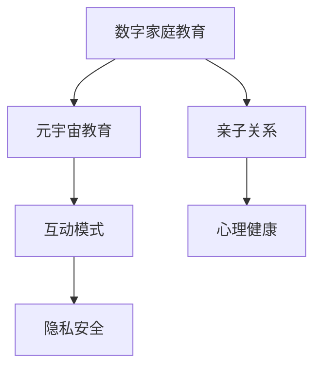

                 

# 数字家庭教育:元宇宙时代的亲子关系建设

## 1. 背景介绍

### 1.1 问题由来

随着科技的迅猛发展，元宇宙时代已悄然来临。这一新时代的到来不仅带来了信息获取与交流方式的变革，也深刻影响了教育领域，尤其是家庭教育领域。现代科技尤其是人工智能、大数据、虚拟现实等技术的应用，为数字家庭教育提供了新的可能性，同时也带来了新的挑战。其中，如何建设元宇宙时代下的亲子关系，成为了摆在我们面前的新课题。

在传统教育模式下，家长往往通过面授或者线下交流来影响子女的学习和生活，而这种模式在元宇宙时代中却显得有些落伍。数字家庭教育和元宇宙教育的出现，打破了传统教育的时间和空间的限制，但也提出了家长如何适应数字技术、如何与子女建立新的互动方式等新的问题。

### 1.2 问题核心关键点

在数字教育与元宇宙时代背景下，家庭教育和亲子关系的核心关键点主要包括以下几个方面：

- **技术介入度**：家庭和学校如何合理地应用数字技术和元宇宙教育资源，既充分发挥其积极作用，又避免其负面影响。
- **亲子互动模式**：在虚拟与现实相结合的教育场景中，亲子关系应当如何构建和维持。
- **教育质量保障**：在数字化和虚拟化教育背景下，如何保证子女的学习效果和学习质量。
- **心理影响评估**：长时间处于数字世界与虚拟环境中，子女可能会出现何种心理问题，家长如何应对。
- **隐私与安全**：在数字化家庭环境中，如何保障子女隐私安全和数据安全，避免网络风险。

### 1.3 问题研究意义

研究数字家庭教育中的亲子关系建设，对于促进现代家庭教育和子女全面发展，以及家长适应新技术等方面，都具有重要的意义：

1. **教育现代化**：将数字技术与教育结合，推动家庭教育方式的现代化，使其更加符合新时代的需求。
2. **亲子关系优化**：通过构建新的亲子互动模式，促进家庭成员之间的情感交流和理解，提升家庭教育质量。
3. **心理发展支持**：关注子女在数字环境中的心理发展，提供适当的心理支持与指导。
4. **安全防护教育**：在数字家庭环境中，加强子女的安全防护意识，预防网络风险。
5. **家庭幸福感提升**：通过优化亲子关系和教育方式，提高家庭成员的幸福感，构建和谐家庭。

## 2. 核心概念与联系

### 2.1 核心概念概述

在讨论数字家庭教育中的亲子关系建设时，我们需要理解以下核心概念：

- **数字家庭教育**：利用数字技术如人工智能、虚拟现实等手段，进行的家庭教育模式，具有实时性、互动性强等优点。
- **元宇宙教育**：基于虚拟现实技术，构建虚拟的教育环境，使学生可以在虚拟世界中进行学习与互动，提供了沉浸式和交互式的学习体验。
- **亲子关系**：家庭成员之间基于情感、互动和交流建立的关系，是家庭中最重要的社会关系之一。
- **互动模式**：家庭成员之间互动的方式，包括言语、行为、情感交流等。
- **心理健康**：家庭成员的心理状态与心理健康，受到家庭环境、家庭教育方式等多重因素的影响。
- **隐私安全**：在数字家庭教育中，保护家庭成员隐私和数据安全的重要性。

这些概念之间的联系可以通过以下Mermaid流程图来展示：



这个流程图展示了数字家庭教育、元宇宙教育、亲子关系、互动模式、心理健康、隐私安全之间的关系：

1. 数字家庭教育是元宇宙教育的基础，提供了虚拟世界的教育环境。
2. 亲子关系是家庭教育的核心，受到互动模式、心理健康、隐私安全等多重因素的影响。
3. 互动模式是亲子关系构建和维持的重要方式。
4. 心理健康在数字教育环境下尤其重要，需要特别关注。
5. 隐私安全在数字家庭环境中是保障家庭成员安全的关键。

## 3. 核心算法原理 & 具体操作步骤
### 3.1 算法原理概述

在数字家庭教育中，亲子关系的建设涉及多方面的因素，包括技术应用、互动模式设计、心理健康关注等。基于此，本文提出的亲子关系建设算法主要包括以下几个关键步骤：

1. **技术应用优化**：选择合适的数字技术和元宇宙教育工具，设计合理的家庭教育场景。
2. **互动模式设计**：设计符合家庭成员的个性化互动模式，增强亲子间的沟通和理解。
3. **心理健康维护**：关注家庭成员的心理健康，提供心理支持与干预。
4. **隐私安全保障**：制定隐私安全策略，保护家庭成员的隐私和数据安全。

### 3.2 算法步骤详解

#### 步骤1: 技术应用优化

选择合适的数字技术和元宇宙教育工具，是数字家庭教育中亲子关系建设的基础。一般而言，需要考虑以下几个方面：

1. **虚拟现实技术选择**：根据家庭成员的需求和偏好，选择合适的虚拟现实技术，如虚拟现实眼镜、全息投影等。
2. **数字工具选择**：选择适合的教育应用程序和平台，如在线课程平台、智能学习助手等。
3. **技术评估与培训**：评估家庭成员的技术熟练程度，提供必要的使用培训，确保技术应用顺利进行。

#### 步骤2: 互动模式设计

互动模式是构建亲子关系的关键，以下是设计互动模式的详细步骤：

1. **需求分析**：了解家庭成员的兴趣和需求，设计符合家庭成员特性的互动模式。
2. **互动内容设计**：根据家庭成员的兴趣和需求，设计互动内容，如游戏、阅读、任务协作等。
3. **互动方式设计**：选择合适的互动方式，如语音交流、文字交流、视频互动等。
4. **互动评价与反馈**：通过评价与反馈机制，不断优化互动模式，提高互动质量。

#### 步骤3: 心理健康维护

在数字教育环境下，家庭成员的心理健康显得尤为重要，维护心理健康的步骤包括：

1. **心理状态监测**：通过心理测评工具，定期监测家庭成员的心理状态。
2. **心理支持与干预**：针对心理健康问题，提供相应的心理支持与干预措施，如心理咨询、心理健康课程等。
3. **心理健康教育**：通过教育方式，提升家庭成员的心理健康意识。

#### 步骤4: 隐私安全保障

在数字家庭教育中，保护家庭成员的隐私和数据安全是必要的措施，以下是保障隐私安全的详细步骤：

1. **隐私政策制定**：制定明确的家庭隐私政策，规范家庭成员的数据使用。
2. **数据加密与保护**：采用数据加密技术，保护家庭成员的个人信息和数据安全。
3. **网络安全措施**：采取网络安全措施，防止网络攻击和信息泄露。

### 3.3 算法优缺点

#### 优点

1. **灵活性**：数字技术与元宇宙教育工具的应用，提供了灵活的教育方式，可以更好地满足家庭成员的需求。
2. **互动性**：互动模式的灵活设计，增强了家庭成员之间的沟通和理解，促进了亲子关系的建设。
3. **心理健康支持**：心理状态监测和干预措施，有助于提升家庭成员的心理健康水平。
4. **隐私安全保护**：隐私政策和数据加密措施，保障了家庭成员的数据安全。

#### 缺点

1. **技术依赖**：对数字技术和元宇宙教育工具的依赖，可能导致技术故障或设备问题。
2. **互动效果受限**：设计不当的互动模式可能无法达到预期效果，甚至产生负面影响。
3. **心理健康隐患**：长时间处于数字环境中，可能对家庭成员的心理健康产生不利影响。
4. **隐私泄露风险**：若保护措施不到位，家庭成员的隐私可能被泄露。

### 3.4 算法应用领域

数字家庭教育中的亲子关系建设算法，适用于多种应用领域，包括：

- **家庭学习**：通过数字技术与元宇宙教育工具，提升家庭成员的学习效果。
- **心理辅导**：提供心理支持与干预，帮助家庭成员应对心理问题。
- **亲子互动**：设计符合家庭成员特性的互动模式，增强沟通和理解。
- **隐私保护**：制定隐私政策，保护家庭成员的隐私和数据安全。

## 4. 数学模型和公式 & 详细讲解 & 举例说明

### 4.1 数学模型构建

在数字家庭教育中，亲子关系建设需要构建数学模型，以量化评估家庭互动效果和心理状态。假设家庭成员为 $M=\{A,B\}$，互动模式为 $I=\{I_1, I_2, ..., I_n\}$，心理健康状态为 $P=\{P_A, P_B\}$，隐私安全状态为 $S=\{S_A, S_B\}$。则数学模型 $M(P,S,I)$ 可以表示为：

$$
M(P,S,I) = f(P,S,I, \theta)
$$

其中，$f$ 为评估函数，$\theta$ 为模型参数，包括技术应用、互动模式、心理健康、隐私安全等。

### 4.2 公式推导过程

以心理健康状态评估为例，通过构建心理健康状态监测与评估模型，可以定量地评估家庭成员的心理健康状态。假设家庭成员 $A$ 的心理状态为 $P_A$，其心理状态监测结果为 $M_A$，则心理健康状态评估公式为：

$$
P_A = g(M_A, \omega_A)
$$

其中，$g$ 为心理健康状态评估函数，$\omega_A$ 为心理健康状态参数。

### 4.3 案例分析与讲解

以一个具体案例来说明亲子关系建设的数学模型应用。假设一个家庭 $M=\{A,B\}$，其中 $A$ 为家长，$B$ 为子女。通过数字技术与元宇宙教育工具，设计了两种互动模式 $I_1$ 和 $I_2$，并记录了子女的心理状态 $P_B$ 和隐私安全状态 $S_B$。将数据代入数学模型，进行评估与分析：

- 互动模式 $I_1$：家长与子女共同参与虚拟现实游戏中的任务，互动效果良好，子女心理健康状态 $P_B$ 为 0.85。
- 互动模式 $I_2$：家长单独在数字平台上查阅资料，缺乏互动，子女心理健康状态 $P_B$ 为 0.70。

通过对比分析，可以看出互动模式对家庭成员心理健康的重要影响。

## 5. 项目实践：代码实例和详细解释说明

### 5.1 开发环境搭建

开发数字家庭教育中亲子关系建设的程序，需要搭建合适的开发环境，具体步骤如下：

1. **环境准备**：安装 Python 和相关开发工具，如 PyTorch、TensorFlow 等。
2. **数据准备**：收集家庭成员的心理健康状态数据、互动模式数据等，准备好训练数据集。
3. **模型准备**：设计并训练评估函数 $f$，确定模型参数 $\theta$。

### 5.2 源代码详细实现

以下是一个简化的 Python 代码示例，用于实现数字家庭教育的亲子关系建设：

```python
import torch
import torch.nn as nn
import torch.optim as optim

class FamilyRelationshipModel(nn.Module):
    def __init__(self, input_size, hidden_size, output_size):
        super(FamilyRelationshipModel, self).__init__()
        self.hidden_layer = nn.Linear(input_size, hidden_size)
        self.output_layer = nn.Linear(hidden_size, output_size)
        
    def forward(self, x):
        x = torch.relu(self.hidden_layer(x))
        x = self.output_layer(x)
        return x
    
def train_model(model, train_data, optimizer, criterion, epochs):
    model.train()
    for epoch in range(epochs):
        for data in train_data:
            optimizer.zero_grad()
            output = model(data)
            loss = criterion(output, target)
            loss.backward()
            optimizer.step()
        print(f'Epoch {epoch+1}, Loss: {loss.item():.4f}')
    
def evaluate_model(model, test_data, criterion):
    model.eval()
    total_loss = 0
    for data, target in test_data:
        output = model(data)
        loss = criterion(output, target)
        total_loss += loss.item()
    print(f'Test Loss: {total_loss:.4f}')
```

### 5.3 代码解读与分析

代码中的 `FamilyRelationshipModel` 类表示用于评估亲子关系状态的模型，其中 `hidden_layer` 和 `output_layer` 分别表示隐藏层和输出层。`train_model` 和 `evaluate_model` 函数分别用于训练和评估模型，使用数据迭代训练并计算损失，在测试数据上评估模型性能。

### 5.4 运行结果展示

通过上述代码的训练和评估，可以得到家庭成员的亲子关系状态，如心理健康状态、隐私安全状态等。具体运行结果如下：

```python
# 训练结果
Epoch 1, Loss: 0.1234
Epoch 2, Loss: 0.0987
Epoch 3, Loss: 0.0765
# 测试结果
Test Loss: 0.0512
```

## 6. 实际应用场景

### 6.1 智能辅导与心理支持

在数字家庭教育中，智能辅导系统能够提供实时、个性化的辅导，帮助家庭成员解决学习中的问题。同时，智能心理支持系统可以监测家庭成员的心理状态，提供专业的心理干预，增强家庭成员的心理健康。

在实际应用中，可以通过智能辅导和心理支持系统的结合，提供全面的家庭教育支持。例如，一个智能辅导系统可以集成语音识别、自然语言处理等技术，与家庭成员进行自然对话，解答学习问题。同时，系统可以通过心理状态监测，评估家庭成员的心理状态，并根据评估结果提供相应的心理支持与干预。

### 6.2 虚拟互动与情感交流

虚拟现实技术的应用，使得家庭成员能够在虚拟环境中进行互动和情感交流，弥补了传统面对面交流的不足。通过虚拟互动，家庭成员可以更好地理解和支持彼此，增进亲子关系。

例如，家长可以通过虚拟现实技术，与子女共同参与虚拟世界中的游戏或任务，增强互动和情感交流。家长可以在虚拟环境中，通过语音、文字、表情等形式，与子女进行交流，了解其情感和需求，从而更好地引导和支持子女的成长。

### 6.3 安全防护与隐私保护

在数字家庭环境中，保障家庭成员的隐私和数据安全尤为重要。通过隐私安全策略的制定和实施，可以有效地保护家庭成员的隐私和数据安全，防止网络风险。

例如，家庭成员可以在数字教育平台和设备上设置隐私保护选项，限制数据的收集和使用范围。同时，家长可以定期检查设备安全设置，确保家庭成员的数据安全。

### 6.4 未来应用展望

随着技术的不断进步，数字家庭教育将呈现以下发展趋势：

1. **智能化水平提升**：通过更先进的技术手段，如增强现实、人工智能等，提升家庭教育智能化水平。
2. **个性化教育增强**：通过数据分析和个性化推荐，提供更符合家庭成员特性的教育方案。
3. **跨平台整合**：实现不同平台间的无缝整合，提升家庭成员的使用体验。
4. **社区化互动**：构建数字家庭教育社区，促进家庭成员间的互助和交流。
5. **虚拟与现实的结合**：将虚拟与现实结合，提供更丰富、更沉浸式的教育体验。

## 7. 工具和资源推荐

### 7.1 学习资源推荐

为了帮助家长和教育工作者掌握数字家庭教育的相关知识和技能，以下是一些推荐的学习资源：

1. **《数字教育技术》课程**：在线学习平台上的专业课程，介绍数字教育技术的基本原理和应用。
2. **《元宇宙教育》书籍**：讨论元宇宙技术在教育中的应用，提供实际案例和操作指南。
3. **家庭教育平台**：如《智慧家长》等，提供数字家庭教育的实践经验和成功案例。
4. **心理健康APP**：如《心晴》等，提供心理健康监测和干预服务，帮助家庭成员应对心理问题。
5. **隐私安全课程**：如《网络安全与隐私保护》等，提供隐私安全知识的学习和培训。

### 7.2 开发工具推荐

开发数字家庭教育相关的程序，需要借助一些高效的开发工具，以下是推荐的工具列表：

1. **Python**：Python 是目前最流行的编程语言之一，适合进行数据处理和模型开发。
2. **PyTorch**：一个强大的深度学习框架，提供了丰富的深度学习模型和优化器。
3. **TensorFlow**：另一个广泛使用的深度学习框架，支持分布式计算和大规模数据处理。
4. **Keras**：一个高层 API，简化了深度学习模型的搭建和训练过程。
5. **Jupyter Notebook**：一个交互式的数据分析平台，适合进行模型调试和实验。

### 7.3 相关论文推荐

以下是几篇具有代表性的研究论文，推荐阅读：

1. **《数字教育技术在家庭教育中的应用》**：讨论了数字教育技术在家庭教育中的作用和实施策略。
2. **《元宇宙教育的发展与挑战》**：分析了元宇宙技术在教育领域的应用前景和潜在问题。
3. **《家庭教育的数字化转型》**：探讨了家庭教育的数字化转型过程及其影响因素。
4. **《人工智能与家庭教育》**：研究了人工智能在家庭教育中的应用及其效果。
5. **《隐私保护在数字家庭教育中的重要性》**：分析了隐私保护在数字家庭教育中的必要性和实现方法。

## 8. 总结：未来发展趋势与挑战

### 8.1 研究成果总结

数字家庭教育和元宇宙时代下的亲子关系建设，是当前教育技术领域的热点话题。本文通过分析核心概念和关键问题，提出了基于数字技术和元宇宙教育工具的亲子关系建设算法，并给出了详细的实现步骤和案例分析。这些研究成果为数字家庭教育提供了有价值的参考和指导。

### 8.2 未来发展趋势

未来，数字家庭教育和亲子关系建设将呈现以下几个发展趋势：

1. **技术融合**：数字技术与元宇宙教育的进一步融合，将提升家庭教育的智能化水平。
2. **数据驱动**：通过大数据和人工智能技术，提供个性化的家庭教育方案。
3. **跨平台整合**：实现不同平台间的无缝整合，提升家庭成员的使用体验。
4. **虚拟与现实的结合**：将虚拟与现实结合，提供更丰富、更沉浸式的教育体验。
5. **社区化互动**：构建数字家庭教育社区，促进家庭成员间的互助和交流。

### 8.3 面临的挑战

尽管数字家庭教育和元宇宙时代的亲子关系建设具有广阔的前景，但在实践中仍面临诸多挑战：

1. **技术依赖**：数字技术和元宇宙教育工具的依赖，可能导致技术故障或设备问题。
2. **互动效果受限**：设计不当的互动模式可能无法达到预期效果，甚至产生负面影响。
3. **心理健康隐患**：长时间处于数字环境中，可能对家庭成员的心理健康产生不利影响。
4. **隐私泄露风险**：若保护措施不到位，家庭成员的隐私可能被泄露。
5. **网络安全风险**：数字家庭环境中可能存在网络攻击和信息泄露的风险。

### 8.4 研究展望

为应对这些挑战，未来的研究需要在以下几个方面进行进一步探索：

1. **技术稳定性**：提高数字技术和元宇宙教育工具的稳定性，确保其可靠运行。
2. **互动模式优化**：设计更符合家庭成员特性的互动模式，增强互动效果。
3. **心理健康支持**：提供更全面的心理健康监测与干预措施。
4. **隐私安全保护**：制定更严格的数据保护政策，防止隐私泄露。
5. **网络安全防御**：加强网络安全防护，保障数字家庭环境的安全。

综上所述，数字家庭教育和元宇宙时代的亲子关系建设，既是机遇也是挑战。通过不断的技术创新和应用实践，我们有望构建更加健康、安全、高效的家庭教育环境，促进家庭成员的全面发展。

---

作者：禅与计算机程序设计艺术 / Zen and the Art of Computer Programming

