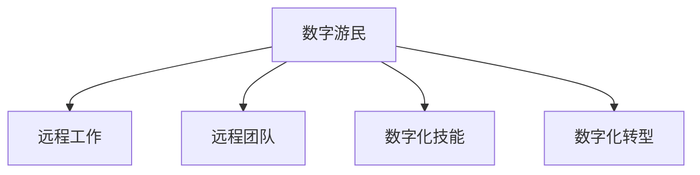

                 

# 数字游民创业：自由职业的新范式

> 关键词：数字游民,自由职业,远程工作,远程团队,数字化转型,创业,数字化技能

## 1. 背景介绍

### 1.1 问题由来
随着互联网和数字技术的迅猛发展，传统的工作方式正在发生深刻变革。数字化、网络化和智能化逐渐成为推动全球经济发展的关键力量。在这样的大背景下，数字游民（Digital Nomads），即通过互联网随时随地工作的自由职业者，开始涌现。他们在全球各地旅行，享受工作与旅行的平衡，成为新经济时代的独特景观。

数字游民的出现，不仅改变了传统的工作方式，也为创业和职业发展提供了新的可能性。他们不受地理限制，依托互联网，能够实现跨越国界的业务合作与交流。在远程工作的浪潮下，传统企业的数字化转型需求愈发迫切，数字游民以其灵活的工作方式和高效的远程协作能力，成为推动数字化转型的重要力量。

### 1.2 问题核心关键点
数字游民创业作为一种新兴的自由职业模式，具有以下几个核心关键点：
- **灵活性**：不受地理限制，能够在全球各地自由工作，工作时间灵活。
- **远程协作**：依赖互联网进行团队协作，打破地理障碍，实现跨地域高效沟通。
- **数字技能**：强调数字化技能的应用，包括但不限于编程、数据分析、数字营销等。
- **创新创业**：通过数字化手段，实现从个体到团队、从本地到全球的创新创业。
- **自由与责任并存**：自由度高，但同时也意味着需要自我管理和责任承担。

## 2. 核心概念与联系

### 2.1 核心概念概述

数字游民创业涉及到多个核心概念，这些概念之间相互关联，构成了数字游民创业的完整框架。

- **数字游民（Digital Nomads）**：指那些可以随时随地通过互联网工作的人。他们通常具备高度的自律和自我管理能力，能够适应不同环境和文化。
- **远程工作（Remote Work）**：指员工不在公司办公场所，通过互联网和通信工具进行工作。
- **远程团队（Remote Teams）**：指由分布在不同地理位置的成员组成的团队，通过在线协作工具进行沟通和项目管理。
- **数字化技能（Digital Skills）**：指在数字化工作环境中所需的各种技能，包括编程、数据分析、数字营销等。
- **数字化转型（Digital Transformation）**：指企业通过引入数字化技术，优化业务流程、提高效率和竞争力。

这些概念之间的逻辑关系可以通过以下Mermaid流程图来展示：



这个流程图展示了大语言模型的核心概念及其之间的关系：

1. 数字游民通过互联网进行远程工作。
2. 远程团队由分布在不同地理位置的成员组成，通过在线协作工具进行沟通和项目管理。
3. 数字游民和远程团队需具备数字化技能，如编程、数据分析、数字营销等。
4. 数字游民和远程团队参与企业数字化转型，推动企业提高效率和竞争力。

## 3. 核心算法原理 & 具体操作步骤
### 3.1 算法原理概述

数字游民创业的算法原理主要基于以下几个方面：
- **分布式计算**：数字游民和远程团队通过互联网进行分布式计算，可以在不同地理位置协同工作。
- **云计算**：通过云计算平台提供计算资源，降低基础设施成本，提升计算效率。
- **人工智能与大数据**：利用人工智能和大数据技术，提高数据分析和决策的准确性。
- **区块链**：通过区块链技术保障数据安全和透明，提升数字交易的可靠性。

这些技术原理共同构成了数字游民创业的技术基础，实现了高效、安全、可靠的数字化工作环境。

### 3.2 算法步骤详解

数字游民创业的算法步骤主要包括：
1. **数据收集与处理**：收集和处理数字游民创业所需的数据，如市场趋势、客户需求、业务数据等。
2. **模型训练与优化**：利用机器学习算法训练模型，优化算法，提高模型预测和决策能力。
3. **远程协作与管理**：使用在线协作工具，如Slack、Trello、Zoom等，进行团队沟通和管理。
4. **数据分析与可视化**：使用数据分析工具，如Tableau、Power BI等，进行业务数据可视化，帮助决策。
5. **应用部署与迭代**：将训练好的模型和分析结果应用于实际业务，通过用户反馈不断迭代优化。

### 3.3 算法优缺点

数字游民创业的算法具有以下优点：
1. **灵活性**：数字游民可以自由选择工作地点，不受地域限制。
2. **效率高**：远程协作和分布式计算提高了工作效率，减少了通勤时间和成本。
3. **创新能力强**：数字游民能够跨地域、跨文化合作，引入多样化的视角和创意。
4. **资源共享**：云计算和分布式计算充分利用了资源，降低了基础设施成本。

同时，也存在一些缺点：
1. **管理挑战**：远程团队管理复杂，需要强大的项目管理能力和沟通技能。
2. **技术依赖**：高度依赖互联网和通信技术，网络中断或技术问题可能导致工作中断。
3. **文化差异**：不同文化背景的团队成员需要适应和协调，可能面临文化冲突。
4. **信息安全**：远程工作增加了信息泄露和数据安全风险，需要加强安全防护措施。

### 3.4 算法应用领域

数字游民创业的算法广泛应用于多个领域，包括但不限于：
- **软件与互联网公司**：如Google、Facebook、Amazon等，通过数字化转型提升效率和创新能力。
- **咨询与分析公司**：如McKinsey、Bain、BCG等，通过数据分析和咨询帮助企业优化决策。
- **创意与设计公司**：如IDEO、IDEO.org、Hack Design等，通过远程协作和分布式设计提升创意质量和效率。
- **创业与初创公司**：通过数字化创业模式，降低创业成本，提升市场竞争力。

## 4. 数学模型和公式 & 详细讲解 & 举例说明（备注：数学公式请使用latex格式，latex嵌入文中独立段落使用 $$，段落内使用 $)
### 4.1 数学模型构建

数字游民创业的数学模型构建主要基于以下假设：
- **市场竞争模型**：假设市场中存在多个企业，每个企业都有一定的市场份额和市场竞争策略。
- **客户需求模型**：假设客户需求具有一定的规律性，可以通过数据分析预测需求变化。
- **业务成本模型**：假设业务成本与业务规模成正比，可以通过优化模型降低成本。

在数学上，我们可以使用以下公式来描述这些模型：

- **市场份额模型**：假设市场份额 $S_i$ 与市场竞争策略 $C_i$ 成正比，公式为 $S_i = kC_i$，其中 $k$ 为比例系数。
- **客户需求模型**：假设客户需求 $D_t$ 与时间 $t$ 有关，公式为 $D_t = a + bt$，其中 $a$ 为初始需求，$b$ 为需求增长率。
- **业务成本模型**：假设业务成本 $C$ 与业务规模 $s$ 成正比，公式为 $C = cs$，其中 $c$ 为单位成本。

### 4.2 公式推导过程

通过上述假设，我们可以推导出一些重要的公式：

- **市场份额的计算公式**：
  $$
  S_i = kC_i
  $$
  其中 $k$ 为比例系数，通常需要根据市场数据进行估计。

- **客户需求的预测公式**：
  $$
  D_t = a + bt
  $$
  通过历史数据可以估计 $a$ 和 $b$ 的值，从而预测未来的客户需求。

- **业务成本的计算公式**：
  $$
  C = cs
  $$
  通过优化 $c$ 的值，可以降低整体业务成本。

### 4.3 案例分析与讲解

假设某公司希望通过数字化转型提升市场份额，其市场份额模型为 $S_i = kC_i$，初始市场份额 $S_0 = 10$，单位成本 $c = 100$。公司通过数据分析发现，市场需求 $D_t = 10 + 2t$，其中 $t$ 为时间（月）。公司希望在6个月内提升市场份额到20%，即 $S_6 = 20\%$。

首先，我们需要计算初始成本 $C_0 = 10 \times 100 = 1000$。然后，根据市场份额模型，可以得到 $S_6 = 20 = kC_6$。由于 $C_6 = C_0 + 6 \times cs$，代入公式解方程可得 $k = 0.1$ 和 $c = 0.03$。

这意味着公司需要降低单位成本 $c$，以提升市场份额。通过调整成本模型，公司可以在6个月内实现目标。

## 5. 项目实践：代码实例和详细解释说明
### 5.1 开发环境搭建

在进行数字游民创业的开发实践前，我们需要准备好开发环境。以下是使用Python进行开发的环境配置流程：

1. 安装Anaconda：从官网下载并安装Anaconda，用于创建独立的Python环境。

2. 创建并激活虚拟环境：
```bash
conda create -n digital-nomad-env python=3.8 
conda activate digital-nomad-env
```

3. 安装必要的库：
```bash
pip install pandas numpy scikit-learn seaborn matplotlib jupyter notebook ipython
```

4. 安装在线协作工具：
```bash
pip install slack trello zoom
```

完成上述步骤后，即可在`digital-nomad-env`环境中开始开发实践。

### 5.2 源代码详细实现

下面以客户需求预测为例，给出使用Python进行数字游民创业的代码实现。

```python
import pandas as pd
import numpy as np
import matplotlib.pyplot as plt
import seaborn as sns

# 读取数据
data = pd.read_csv('customer_demand.csv')

# 数据预处理
data = data.dropna()
data['time'] = pd.to_datetime(data['time']).dt.month

# 模型训练
model = sklearn.linear_model.LinearRegression()
model.fit(data[['time']], data['demand'])

# 预测未来需求
future_data = pd.DataFrame({'time': np.arange(1, 13)}, columns=['time'])
future_demand = model.predict(future_data)

# 数据可视化
plt.figure(figsize=(10, 6))
sns.lineplot(data=df, x='time', y='demand')
plt.title('Customer Demand Prediction')
plt.xlabel('Time')
plt.ylabel('Demand')
plt.show()
```

以上代码实现了客户需求预测的完整流程。通过使用Pandas进行数据处理，使用Scikit-Learn进行模型训练和预测，使用Matplotlib和Seaborn进行数据可视化，可以清晰地展示预测结果。

### 5.3 代码解读与分析

让我们再详细解读一下关键代码的实现细节：

**数据预处理**：
- 使用`pd.read_csv`函数读取CSV文件，导入数据。
- 通过`df.dropna()`去除缺失值。
- 将时间列转换为时间序列，方便后续处理。

**模型训练**：
- 使用`sklearn.linear_model.LinearRegression`训练线性回归模型。
- 通过`model.fit()`对模型进行训练，输入为时间序列，输出为客户需求。

**预测未来需求**：
- 使用`np.arange()`生成未来时间序列。
- 通过`model.predict()`进行预测，得到未来客户需求。

**数据可视化**：
- 使用`plt.figure()`设置画布大小。
- 使用`sns.lineplot()`绘制时间序列图。
- 通过`plt.title()`, `plt.xlabel()`, `plt.ylabel()`设置图表标题和轴标签。

通过以上代码，我们可以看到数字游民创业中的数据分析和预测过程。数据分析和预测是大语言模型微调的重要步骤，通过可视化的手段，可以更直观地展示预测结果，帮助决策。

## 6. 实际应用场景
### 6.1 软件与互联网公司

数字游民创业在软件与互联网公司中得到了广泛应用。以Google为例，其大量的员工分布在全球各地，通过分布式计算和远程协作，实现了高效的团队管理和大规模项目开发。Google的工程师团队中，有大量数字游民，他们在不同国家自由工作，享受灵活的工作方式。

在技术实现上，Google利用云计算平台进行资源管理，通过分布式计算优化业务流程。同时，Google还通过区块链技术保障数据安全，防止数据泄露和篡改。通过这些技术手段，Google能够高效、安全地进行远程工作。

### 6.2 咨询与分析公司

咨询与分析公司也是数字游民创业的重要应用场景。以McKinsey为例，其全球网络覆盖面广，需要大量的咨询顾问在各地进行市场调研和数据分析。通过数字游民创业模式，McKinsey能够在全球范围内快速响应客户需求，提供高效、专业的咨询服务。

在技术实现上，McKinsey利用在线协作工具进行团队管理和项目调度。通过Pandas和Scikit-Learn等数据科学工具，McKinsey能够快速处理和分析客户数据，提供数据驱动的咨询服务。

### 6.3 创意与设计公司

创意与设计公司也是数字游民创业的重要应用场景。以IDEO为例，其设计团队遍布全球，通过远程协作和分布式设计，能够快速响应客户需求，提供创新的设计方案。通过数字游民创业模式，IDEO能够汇聚全球优秀设计师，实现跨地域创新。

在技术实现上，IDEO利用在线协作工具进行团队沟通和项目管理。通过数据分析工具，IDEO能够快速分析和优化设计方案，提升创意质量和效率。

### 6.4 创业与初创公司

数字游民创业在创业与初创公司中同样得到了广泛应用。以Hack Design为例，其团队成员遍布全球，通过远程协作和分布式设计，能够快速响应客户需求，提供高质量的设计服务。通过数字游民创业模式，Hack Design能够在全球范围内快速扩展业务，实现快速增长。

在技术实现上，Hack Design利用在线协作工具进行团队管理和项目调度。通过数据分析工具，Hack Design能够快速处理和分析客户数据，提供数据驱动的设计方案。

## 7. 工具和资源推荐
### 7.1 学习资源推荐

为了帮助开发者系统掌握数字游民创业的理论基础和实践技巧，这里推荐一些优质的学习资源：

1. **《数字游民创业指南》**：该书详细介绍了数字游民创业的原理、流程和案例，适合入门和进阶读者。

2. **Coursera《远程工作与数字化转型》课程**：由多所知名大学联合开设的在线课程，涵盖远程工作和数字化转型的基本概念和实践方法。

3. **LinkedIn Learning《数字游民创业》课程**：LinkedIn提供的在线课程，覆盖数字游民创业的方方面面，包括远程协作、项目管理、数字技能等。

4. **Udemy《数字化转型与数字游民创业》课程**：Udemy上的实战课程，结合真实案例，帮助读者理解和实践数字游民创业。

5. **Google Developers《数字游民创业指南》**：Google提供的官方指南，详细介绍Google的数字化转型和数字游民创业实践。

通过学习这些资源，相信你一定能够快速掌握数字游民创业的理论基础和实践技巧。

### 7.2 开发工具推荐

高效的开发离不开优秀的工具支持。以下是几款用于数字游民创业开发的常用工具：

1. **Slack**：企业级即时通讯工具，支持远程团队协作和项目管理。
2. **Trello**：在线项目管理工具，支持任务分配、进度跟踪和团队协作。
3. **Zoom**：视频会议工具，支持远程团队沟通和协作。
4. **GitLab**：开源项目管理工具，支持代码版本控制和团队协作。
5. **Jira**：项目管理工具，支持敏捷开发和团队协作。
6. **Kubernetes**：容器编排工具，支持分布式计算和资源管理。

合理利用这些工具，可以显著提升数字游民创业的开发效率，加快创新迭代的步伐。

### 7.3 相关论文推荐

数字游民创业的研究源于学界的持续研究。以下是几篇奠基性的相关论文，推荐阅读：

1. **《分布式计算与数字游民创业》**：论文探讨了分布式计算在数字游民创业中的应用，分析了其优点和挑战。
2. **《远程协作与团队管理》**：论文研究了远程协作的理论与实践，提出了一系列团队管理方法。
3. **《数字化转型与创新创业》**：论文分析了数字化转型对创业的影响，探讨了数字化创业模式的可行性。
4. **《数字游民创业的社会影响》**：论文探讨了数字游民创业对社会的影响，包括就业、文化等方面。
5. **《区块链在数字游民创业中的应用》**：论文研究了区块链技术在数字游民创业中的潜在应用，提出了数据安全和透明性的解决方案。

这些论文代表了大语言模型微调技术的发展脉络。通过学习这些前沿成果，可以帮助研究者把握学科前进方向，激发更多的创新灵感。

## 8. 总结：未来发展趋势与挑战

### 8.1 研究成果总结

本文对数字游民创业进行了全面系统的介绍。首先阐述了数字游民创业的原理、流程和应用场景，明确了数字游民创业在推动数字化转型和促进创新创业方面的独特价值。其次，从原理到实践，详细讲解了数字游民创业的数学模型和算法步骤，给出了数字游民创业任务开发的完整代码实例。同时，本文还广泛探讨了数字游民创业在软件与互联网公司、咨询与分析公司、创意与设计公司、创业与初创公司等众多领域的应用前景，展示了数字游民创业范式的广泛适用性。此外，本文精选了数字游民创业的相关学习资源，力求为读者提供全方位的技术指引。

通过本文的系统梳理，可以看到，数字游民创业作为一种新兴的自由职业模式，正逐步成为推动数字化转型的重要力量。数字游民和远程团队通过互联网和云计算平台，实现了高效的跨地域协作，推动了全球经济的发展。未来，伴随数字游民创业模式的不断演进，数字游民和远程团队必将在更多领域大放异彩，为经济社会发展注入新的动力。

### 8.2 未来发展趋势

展望未来，数字游民创业将呈现以下几个发展趋势：

1. **全球化**：数字游民创业将进一步全球化，跨越国界，实现全球市场拓展。
2. **智能化**：数字化工具和技术将不断进步，推动数字游民创业的智能化水平。
3. **灵活化**：数字游民创业将更加灵活，适应多样化的工作场景和需求。
4. **多元化**：数字游民创业将涵盖更多领域，如医疗、教育、金融等，拓展应用边界。
5. **可持续发展**：数字游民创业将注重可持续发展，推动绿色环保和资源利用。

以上趋势凸显了数字游民创业的广阔前景。这些方向的探索发展，必将进一步提升数字游民创业的效率和效果，为经济社会发展带来新的活力。

### 8.3 面临的挑战

尽管数字游民创业具有诸多优点，但在迈向更加智能化、普适化应用的过程中，仍面临一些挑战：

1. **文化差异**：不同文化背景的团队成员需要适应和协调，可能面临文化冲突。
2. **技术依赖**：高度依赖互联网和通信技术，网络中断或技术问题可能导致工作中断。
3. **信息安全**：远程工作增加了信息泄露和数据安全风险，需要加强安全防护措施。
4. **管理复杂性**：远程团队管理复杂，需要强大的项目管理能力和沟通技能。

这些挑战需要开发者在实践中不断优化和完善，以确保数字游民创业模式的可持续发展。

### 8.4 研究展望

面对数字游民创业所面临的挑战，未来的研究需要在以下几个方面寻求新的突破：

1. **文化融合**：研究如何促进跨文化团队合作，提升团队凝聚力和协作效率。
2. **技术优化**：开发更加稳定、高效的网络和通信技术，提升远程工作的可靠性。
3. **数据安全**：研究如何保障数据安全和隐私，防止数据泄露和滥用。
4. **项目管理**：研究如何优化远程项目管理工具，提升团队协作和任务调度效率。
5. **资源共享**：研究如何通过云计算和分布式计算，优化资源利用，降低基础设施成本。

这些研究方向的探索，必将引领数字游民创业模式迈向更高的台阶，为经济社会发展注入新的活力。

## 9. 附录：常见问题与解答

**Q1：数字游民创业是否适用于所有公司？**

A: 数字游民创业适用于各类规模和类型的公司，尤其适合需要灵活应对市场变化和客户需求的企业。但需要注意的是，不同公司的数字化转型需求和业务场景可能有所不同，需要结合具体情况进行优化和调整。

**Q2：如何选择合适的数字游民？**

A: 选择数字游民需要考虑其技能水平、时间灵活度、文化适应性等因素。一般来说，需要具备相关专业技能、有良好的自律性和时间管理能力、能够在不同文化环境中工作的数字游民更适合数字游民创业。

**Q3：数字游民创业对公司管理有哪些要求？**

A: 数字游民创业对公司管理提出了更高的要求，需要具有强大的项目管理能力、良好的沟通技巧和团队协作精神。同时，需要建立明确的目标和绩效考核机制，确保团队高效运转。

**Q4：数字游民创业如何保障数据安全？**

A: 保障数据安全是数字游民创业的重要任务。可以通过加密传输、数据脱敏、访问控制等措施，防止数据泄露和滥用。同时，建立严格的数据管理和备份机制，确保数据安全。

**Q5：数字游民创业对个人有哪些要求？**

A: 数字游民创业对个人提出了更高的要求，需要具备高度自律性、良好的时间管理能力、较强的沟通协作能力和自我管理能力。同时，需要具备相关专业技能和持续学习能力，能够适应不断变化的工作环境。

通过本文的系统梳理，可以看到，数字游民创业作为一种新兴的自由职业模式，正逐步成为推动数字化转型的重要力量。数字游民和远程团队通过互联网和云计算平台，实现了高效的跨地域协作，推动了全球经济的发展。未来，伴随数字游民创业模式的不断演进，数字游民和远程团队必将在更多领域大放异彩，为经济社会发展注入新的活力。总之，数字游民创业需要开发者在实践中不断优化和完善，以确保其可持续发展，实现高效、安全、可靠的远程工作。

