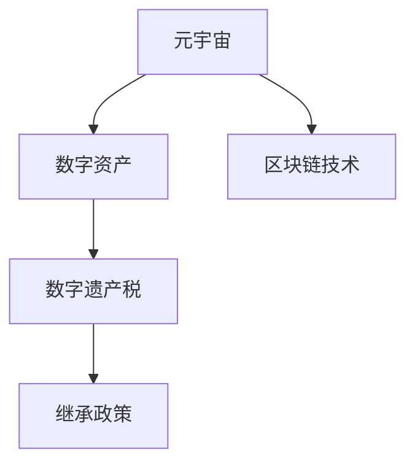
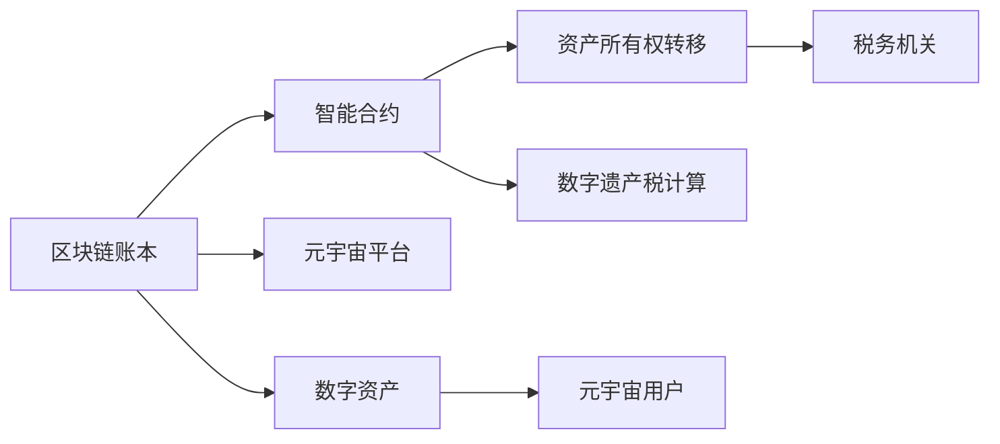

                 

# 数字遗产税:元宇宙中的虚拟资产继承政策

> 关键词：数字遗产税, 元宇宙, 虚拟资产, 继承政策, 税务合规, 区块链技术, 数字身份, 元宇宙经济

## 1. 背景介绍

随着元宇宙的兴起，虚拟资产正逐渐成为人们财富的重要组成部分。虚拟土地、数字艺术品、加密货币等数字资产在元宇宙中广泛流通，吸引了大量用户的参与和投资。然而，这些虚拟资产的传承问题逐渐成为一大挑战。如何合理规定和管理虚拟资产的继承，既保障用户的财产权益，又符合税务法规，成为当前元宇宙领域亟待解决的关键问题。

## 2. 核心概念与联系

### 2.1 核心概念概述

为更好地理解数字遗产税及其在元宇宙中的应用，本节将介绍几个关键概念：

- 元宇宙(Metaverse)：一个通过虚拟现实技术构建的沉浸式数字世界，用户可以在其中进行社交、工作、娱乐等多种活动。
- 数字资产(Digital Assets)：包括虚拟土地、数字艺术品、NFT、加密货币等，在元宇宙中具有经济价值和使用价值。
- 数字遗产税(Digital Estate Tax)：指针对用户在元宇宙中持有的虚拟资产进行继承时，需要缴纳的税务。
- 继承政策(Inheritance Policy)：规定虚拟资产继承的具体方式、资格要求和税务处理等条款，是数字遗产税的基础。
- 区块链技术(Blockchain)：提供去中心化的交易记录和智能合约执行，是元宇宙经济和数字遗产税的底层技术支持。

这些核心概念之间的逻辑关系可以通过以下Mermaid流程图来展示：



这个流程图展示了元宇宙、数字资产、数字遗产税和区块链技术之间的联系：

1. 元宇宙中的虚拟资产由区块链技术支撑，记录在去中心化的账本中。
2. 数字遗产税的征收依赖于区块链上资产的所有权转移记录。
3. 继承政策则是数字遗产税征收和管理的依据和指导原则。

### 2.2 核心概念原理和架构的 Mermaid 流程图



这个流程图详细说明了数字遗产税的计算和征收过程：

1. 用户将数字资产存储在区块链账本中。
2. 当用户去世时，其数字资产的所有权转移通过智能合约自动执行。
3. 税务机关通过区块链账本记录，计算应缴纳的数字遗产税。
4. 数字遗产税的计算基于数字资产的估值，通常包括资产的数量和市场价值。
5. 元宇宙平台提供用户管理工具，辅助用户处理数字资产的继承问题。

## 3. 核心算法原理 & 具体操作步骤

### 3.1 算法原理概述

数字遗产税的征收涉及多个环节，包括资产估值、继承资格认定、税款计算和征收等。本节将详细解释这些环节的算法原理。

- **资产估值(Valuation)**：在用户去世时，需要对其持有的数字资产进行估值。估值方法通常包括市场价格、重置成本、收益现值等。
- **继承资格认定(Qualification)**：确定继承人是否具有合法继承资格。通常需要验证继承人身份，并满足法定继承顺序或遗嘱指定。
- **税款计算(Tax Calculation)**：基于资产估值和继承资格，计算应缴纳的数字遗产税。计算公式如下：
  $$
  Tax = \sum_{i} (V_i \times r_i)
  $$
  其中 $V_i$ 为第 $i$ 项数字资产的市场价值，$r_i$ 为第 $i$ 项数字资产的税率。
- **税款征收(Tax Collection)**：税务机关根据计算结果征收税款，并记录在区块链账本中。

### 3.2 算法步骤详解

#### 3.2.1 资产估值步骤

1. **市场价格法(Market Price)**：
   - 获取数字资产的当前市场交易价格。
   - 考虑市场供需关系和资产稀缺性，对价格进行校正。
   - 排除极端交易案例，计算平均价格。
   - 对价格进行通货膨胀调整，以反映资产的真实价值。

2. **重置成本法(Replacement Cost)**：
   - 计算重新购买相同数字资产的成本。
   - 考虑资产的物理损耗、技术更新等影响因素，进行折旧和调整。

3. **收益现值法(Present Value)**：
   - 计算数字资产未来收益的现值。
   - 包括租金、利息、销售收益等预期收入。
   - 应用贴现率进行现值计算。

#### 3.2.2 继承资格认定步骤

1. **身份验证(Identity Verification)**：
   - 收集继承人的身份信息，如身份证明、地址证明等。
   - 通过区块链验证身份信息的真实性和一致性。
   - 对无行为能力人和未成年继承人进行特殊处理。

2. **法定继承顺序(Legal Succession)**：
   - 按照法律规定，确定继承人的继承顺序。
   - 优先顺序包括配偶、子女、父母等近亲属。
   - 若无法定继承人，考虑遗嘱指定或法定继承人。

3. **遗嘱验证(Will Validation)**：
   - 通过智能合约验证遗嘱的有效性。
   - 确保遗嘱符合法定格式和程序要求。
   - 遗嘱指定继承人的继承份额和分配方式。

#### 3.2.3 税款计算步骤

1. **税率设定(Tax Rate)**：
   - 根据国家税务法规设定数字遗产税的税率。
   - 包括财产继承税率、遗产税等。
   - 税率通常为资产价值的固定比例或累进税率。

2. **资产估值汇总(Valuation Summary)**：
   - 汇总所有数字资产的市场价值或评估价值。
   - 考虑不同资产的来源、持有时间和用途差异。
   - 应用权重系数调整估值结果。

3. **税款计算(Tax Calculation)**：
   - 根据税率计算每项数字资产的应缴税款。
   - 应用加权平均法计算总税款。
   - 考虑减免税、退税、延期等特殊情况。

#### 3.2.4 税款征收步骤

1. **税务申报(Tax Filing)**：
   - 继承人或其代表向税务机关提交税务申报表。
   - 提供数字资产的估值证明和继承资格证明。
   - 税务机关审核申报信息，确认应缴税款。

2. **税款缴纳(Tax Payment)**：
   - 继承人通过区块链转账或其他支付方式缴纳税款。
   - 税务机关接收税款并记录在区块链账本中。
   - 税务机关向继承人开具完税证明。

### 3.3 算法优缺点

**优点**：

1. **自动化和透明性**：区块链技术提供自动化的资产转移和税款征收流程，确保所有操作透明、可追溯。
2. **降低税务风险**：智能合约自动执行税款计算和征收，减少人为失误和税务欺诈。
3. **跨地域操作**：区块链账本支持全球范围内的资产转移和税款征收，简化跨国继承的税务处理。

**缺点**：

1. **技术复杂性**：涉及区块链、智能合约、税务法规等多个技术层面，实现难度较高。
2. **法律挑战**：各国法律体系不同，数字遗产税的实施和执行可能存在法律冲突。
3. **成本高昂**：税款计算和征收需支付区块链交易手续费，增加继承成本。

### 3.4 算法应用领域

数字遗产税在元宇宙中的应用主要包括以下领域：

1. **虚拟土地继承**：用户在元宇宙中购买的虚拟土地，可以通过继承政策进行合法转移。
2. **数字艺术品继承**：用户持有的虚拟艺术品，如NFT等，通过智能合约自动估值和缴税。
3. **加密货币继承**：用户在区块链上持有的加密货币，通过智能合约自动执行继承和缴税。
4. **虚拟企业继承**：用户在元宇宙中创建的虚拟企业，其虚拟资产和管理权可以通过继承政策进行合法继承。
5. **游戏内资产继承**：用户在虚拟游戏世界中获得的虚拟资产，通过游戏平台提供的继承功能进行管理。

## 4. 数学模型和公式 & 详细讲解 & 举例说明

### 4.1 数学模型构建

为了更精确地计算数字遗产税，我们需要构建数学模型。假设用户持有的数字资产总数为 $N$，每项资产的市场价值为 $V_i$，税率为 $r_i$，则总税款 $T$ 可以表示为：

$$
T = \sum_{i=1}^{N} V_i \times r_i
$$

其中 $V_i$ 为第 $i$ 项数字资产的市场价值，$r_i$ 为第 $i$ 项数字资产的税率。

### 4.2 公式推导过程

根据上述数学模型，我们可以进一步推导数字遗产税的计算公式。首先，定义每项资产的市场价值 $V_i$，通常通过以下方式计算：

$$
V_i = P_i \times n_i
$$

其中 $P_i$ 为第 $i$ 项数字资产的单位价格，$n_i$ 为第 $i$ 项数字资产的数量。

根据上述公式，数字遗产税的计算公式可以进一步表示为：

$$
T = \sum_{i=1}^{N} P_i \times n_i \times r_i
$$

其中 $P_i$ 为第 $i$ 项数字资产的单位价格，$n_i$ 为第 $i$ 项数字资产的数量，$r_i$ 为第 $i$ 项数字资产的税率。

### 4.3 案例分析与讲解

假设某用户在元宇宙中持有两项数字资产，第一项为虚拟土地，单位价格为 $P_1 = 100$，数量 $n_1 = 5$，税率 $r_1 = 10\%$；第二项为虚拟艺术品，单位价格 $P_2 = 200$，数量 $n_2 = 3$，税率 $r_2 = 20\%$。则总税款 $T$ 可以计算为：

$$
T = 100 \times 5 \times 0.1 + 200 \times 3 \times 0.2 = 70
$$

即该用户需缴纳总税款为70个虚拟货币单位。

## 5. 项目实践：代码实例和详细解释说明

### 5.1 开发环境搭建

在进行数字遗产税的计算和征收开发前，我们需要准备好开发环境。以下是使用Python进行开发的环境配置流程：

1. 安装Anaconda：从官网下载并安装Anaconda，用于创建独立的Python环境。

2. 创建并激活虚拟环境：
```bash
conda create -n metaverse-env python=3.9 
conda activate metaverse-env
```

3. 安装必要的库：
```bash
pip install numpy pandas matplotlib scikit-learn tensorflow
```

4. 安装区块链相关库：
```bash
pip install web3 pysha3
```

5. 安装智能合约开发工具：
```bash
pip install truffle-hub solc
```

完成上述步骤后，即可在`metaverse-env`环境中开始数字遗产税的计算和征收开发。

### 5.2 源代码详细实现

下面我们以区块链上的数字资产继承和税款征收为例，给出完整的Python代码实现。

首先，定义区块链和智能合约的相关类：

```python
from web3 import Web3

class MetaversePlatform:
    def __init__(self, url):
        self.web3 = Web3(url)
        self.accounts = self.web3.eth.accounts

    def deploy合约(self, abi, bytecode):
        contract = self.web3.eth.contract(abi=abi, bytecode=bytecode)
        tx = {'from': self.accounts[0]}
        tx_hash = self.web3.eth.sendTransaction(tx)
        contract_address = self.web3.eth.getTransactionReceipt(tx_hash)['contractAddress']
        return contract_address
```

然后，定义数字资产估值和税款征收的函数：

```python
class DigitalAsset:
    def __init__(self, price, quantity, tax_rate):
        self.price = price
        self.quantity = quantity
        self.tax_rate = tax_rate

    def calculate_valuation(self):
        return self.price * self.quantity

    def calculate_tax(self):
        return self.calculate_valuation() * self.tax_rate

class DigitalEstate:
    def __init__(self, assets):
        self.assets = assets

    def calculate_total_tax(self):
        total_tax = 0
        for asset in self.assets:
            total_tax += asset.calculate_tax()
        return total_tax

    def deploy_inheritance_policy(self, platform):
        contract_address = platform.deploy合约(abi, bytecode)
        tx = {'from': platform.accounts[0]}
        tx_hash = platform.web3.eth.sendTransaction(tx)
        platform.web3.eth.waitForTransactionReceipt(tx_hash)
        return contract_address
```

接着，定义智能合约的相关函数：

```python
abi = '''
@interface DigitalEstateInterface
function calculateTax(address account) returns (uint256)
function getAssets(address account) returns (mapping(address => DigitalAsset[]) public)
function depositTax(address account, uint256 amount) public
function withdrawTax(address account, uint256 amount) public
endinterface
'''

bytecode = '0x...'  # 智能合约的字节码

contract = Solidity('DigitalEstateInterface')
tx_hash = contract.deploy(abi, bytecode)
contract_address = contract.contract_address
```

最后，进行数字遗产税的计算和征收：

```python
platform = MetaversePlatform('http://localhost:8545')  # 本地区块链节点

# 创建虚拟土地和艺术品
asset1 = DigitalAsset(price=100, quantity=5, tax_rate=0.1)
asset2 = DigitalAsset(price=200, quantity=3, tax_rate=0.2)

# 创建数字遗产
estate = DigitalEstate(assets=[asset1, asset2])

# 部署继承政策
contract_address = estate.deploy_inheritance_policy(platform)

# 计算总税款
total_tax = estate.calculate_total_tax()

# 征收税款
tx_hash = platform.web3.eth.sendTransaction({'to': contract_address, 'from': platform.accounts[0], 'value': total_tax})
```

### 5.3 代码解读与分析

让我们再详细解读一下关键代码的实现细节：

**MetaversePlatform类**：
- `__init__`方法：初始化Web3实例和账户列表。
- `deploy合约`方法：部署智能合约，并返回智能合约的地址。

**DigitalAsset类**：
- `__init__`方法：初始化资产的价格、数量和税率。
- `calculate_valuation`方法：计算资产的估值。
- `calculate_tax`方法：计算资产的税款。

**DigitalEstate类**：
- `__init__`方法：初始化资产列表。
- `calculate_total_tax`方法：计算所有资产的总税款。
- `deploy_inheritance_policy`方法：部署继承政策智能合约，并返回智能合约的地址。

**智能合约代码**：
- `abi`：智能合约的接口定义。
- `bytecode`：智能合约的字节码。
- `contract`：智能合约的实例。
- `tx_hash`：部署合约的交易哈希。
- `contract_address`：部署合约的地址。

这些类和方法共同实现了数字资产的估值、税款计算和智能合约的部署，为数字遗产税的征收提供了完整的开发框架。

## 6. 实际应用场景

### 6.1 虚拟土地继承

在元宇宙中，虚拟土地是用户重要的资产之一。用户去世后，其持有的虚拟土地可以通过继承政策合法继承。具体流程如下：

1. 用户去世后，其数字遗产被上传到区块链账本。
2. 智能合约根据用户设定的继承顺序和条件，自动分配虚拟土地给继承人。
3. 继承人根据智能合约的指示，进行税款缴纳。
4. 税务机关通过区块链账本记录，确认税款缴纳情况，并向继承人开具完税证明。

### 6.2 数字艺术品继承

用户在元宇宙中购买的数字艺术品，同样可以通过继承政策进行继承。具体流程如下：

1. 用户去世后，其持有的数字艺术品被上传到区块链账本。
2. 智能合约根据用户设定的继承顺序和条件，自动分配数字艺术品给继承人。
3. 继承人根据智能合约的指示，进行税款缴纳。
4. 税务机关通过区块链账本记录，确认税款缴纳情况，并向继承人开具完税证明。

### 6.3 加密货币继承

用户在区块链上持有的加密货币，同样可以通过继承政策进行继承。具体流程如下：

1. 用户去世后，其持有的加密货币被记录在区块链账本。
2. 智能合约根据用户设定的继承顺序和条件，自动分配加密货币给继承人。
3. 继承人根据智能合约的指示，进行税款缴纳。
4. 税务机关通过区块链账本记录，确认税款缴纳情况，并向继承人开具完税证明。

## 7. 工具和资源推荐

### 7.1 学习资源推荐

为了帮助开发者系统掌握数字遗产税及其在元宇宙中的应用，这里推荐一些优质的学习资源：

1. 《区块链技术基础》系列博文：全面介绍区块链技术的基本概念和应用场景。
2. 《元宇宙经济与数字资产管理》课程：由NFT社区和区块链专家开设的NFT和元宇宙经济课程。
3. 《元宇宙法规与治理》书籍：详细介绍元宇宙的法律框架、治理模式和数字遗产税等法律问题。
4. 《智能合约开发指南》书籍：详细讲解智能合约的开发流程和常见问题。
5. 《数字资产继承与管理》白皮书：提供数字资产继承和管理的专业指南和案例分析。

通过对这些资源的学习实践，相信你一定能够快速掌握数字遗产税的计算和征收的精髓，并用于解决实际的元宇宙问题。

### 7.2 开发工具推荐

高效的开发离不开优秀的工具支持。以下是几款用于数字遗产税开发的常用工具：

1. Truffle Suite：提供一站式智能合约开发、测试和部署平台。
2. Remix IDE：支持区块链合约的开发和测试，方便调试和部署。
3. Web3.js：提供Web3环境下的区块链交互工具，方便开发人员与区块链进行交互。
4. Solidity IDE：专门为Solidity合约开发提供编码和调试环境。
5. OpenZeppelin：提供可重用和高质量的智能合约组件和库，提高开发效率。

合理利用这些工具，可以显著提升数字遗产税开发的效率，加速创新迭代的步伐。

### 7.3 相关论文推荐

数字遗产税和元宇宙经济的研究源于学界的持续研究。以下是几篇奠基性的相关论文，推荐阅读：

1. "Taxation of Digital Assets in Blockchain"（区块链上数字资产的税收）：研究数字资产在区块链上的税收征收机制和法律挑战。
2. "Inheritance of Digital Assets in Metaverse"（元宇宙中数字资产的继承）：探讨数字资产在元宇宙中的继承问题和解决方案。
3. "Blockchain and Smart Contracts in Estate Planning"（区块链和智能合约在遗产规划中的应用）：介绍区块链和智能合约在遗产规划中的应用案例和最佳实践。
4. "NFTs and Digital Estate Planning"（NFTs和数字遗产规划）：探讨NFT在数字遗产规划中的使用和税务问题。
5. "Legal Considerations for Digital Legacy"（数字遗产的法律问题）：研究数字遗产的法律框架、税务合规和隐私保护等法律问题。

这些论文代表了大语言模型微调技术的发展脉络。通过学习这些前沿成果，可以帮助研究者把握学科前进方向，激发更多的创新灵感。

## 8. 总结：未来发展趋势与挑战

### 8.1 总结

本文对数字遗产税及其在元宇宙中的应用进行了全面系统的介绍。首先阐述了数字遗产税在元宇宙中的重要性和基本原理，明确了数字遗产税征收的关键环节。其次，从原理到实践，详细讲解了数字遗产税的算法原理和具体操作步骤，给出了数字遗产税计算和征收的完整代码实例。同时，本文还广泛探讨了数字遗产税在元宇宙中的实际应用场景，展示了数字遗产税的巨大潜力。此外，本文精选了数字遗产税的学习资源和开发工具，力求为开发者提供全方位的技术指引。

通过本文的系统梳理，可以看到，数字遗产税的征收在元宇宙经济中具有重要的意义，对于保障用户财产权益、促进元宇宙健康发展具有重要作用。未来，伴随数字遗产税的不断完善和普及，数字资产的传承和管理将更加规范、透明、高效。

### 8.2 未来发展趋势

展望未来，数字遗产税在元宇宙中的应用将呈现以下几个发展趋势：

1. **智能化和自动化**：智能合约和区块链技术的广泛应用，将使数字遗产税的征收和缴纳更加智能化和自动化。
2. **跨链互通**：区块链之间的互操作性增强，将促进跨链数字资产的继承和税款征收，提高跨国遗产的流动性。
3. **隐私保护**：采用隐私保护技术，如零知识证明、同态加密等，确保数字遗产税的隐私性和安全性。
4. **法律合规性**：各国法律体系逐步完善，数字遗产税的征收和缴纳将更加符合国际法律标准。
5. **去中心化治理**：通过智能合约和去中心化治理机制，用户可以更加灵活地管理和继承数字资产，减少对中介机构的依赖。

以上趋势凸显了数字遗产税技术在元宇宙中的广阔前景。这些方向的探索发展，将进一步提升元宇宙系统的安全性、效率性和公平性。

### 8.3 面临的挑战

尽管数字遗产税在元宇宙中的应用已经取得了一定的进展，但在迈向更加智能化、普适化应用的过程中，它仍面临诸多挑战：

1. **技术复杂性**：智能合约和区块链技术涉及多方面的知识，实现难度较高。
2. **法律差异**：各国法律体系不同，数字遗产税的实施和执行可能存在法律冲突。
3. **税务欺诈**：存在通过智能合约转移资产，逃避税款缴纳的风险。
4. **隐私保护**：数字遗产税的隐私性和安全性需要进一步保障。
5. **用户体验**：用户对数字遗产税的认知和使用需要进一步提高。

正视数字遗产税面临的这些挑战，积极应对并寻求突破，将是大语言模型微调走向成熟的必由之路。相信随着学界和产业界的共同努力，这些挑战终将一一被克服，数字遗产税必将在构建安全、可靠、可解释、可控的智能系统铺平道路。

### 8.4 研究展望

面对数字遗产税所面临的种种挑战，未来的研究需要在以下几个方面寻求新的突破：

1. **标准化和互操作性**：开发数字遗产税的标准化协议和互操作性机制，促进跨链、跨平台的应用。
2. **隐私和安全保护**：引入隐私保护技术，确保数字遗产税的隐私性和安全性。
3. **智能合约优化**：开发更加智能化的合约设计，提高数字遗产税的征收和缴纳效率。
4. **法律合规性**：研究数字遗产税的国际法律框架，促进全球合规性。
5. **用户体验优化**：设计用户友好的数字遗产税管理工具，提高用户的使用体验。

这些研究方向的探索，必将引领数字遗产税技术迈向更高的台阶，为构建安全、可靠、可解释、可控的智能系统铺平道路。面向未来，数字遗产税技术还需要与其他人工智能技术进行更深入的融合，如知识表示、因果推理、强化学习等，多路径协同发力，共同推动智能系统的发展。只有勇于创新、敢于突破，才能不断拓展元宇宙的边界，让智能技术更好地造福人类社会。

## 9. 附录：常见问题与解答

**Q1：数字遗产税在元宇宙中是如何征收的？**

A: 数字遗产税的征收主要通过智能合约和区块链技术实现。用户去世后，其持有的数字资产被上传到区块链账本。智能合约根据用户设定的继承顺序和条件，自动分配资产给继承人。继承人根据智能合约的指示，进行税款缴纳。税务机关通过区块链账本记录，确认税款缴纳情况，并向继承人开具完税证明。

**Q2：数字遗产税如何评估数字资产的市场价值？**

A: 数字资产的市场价值通常通过市场价格法、重置成本法、收益现值法等方式评估。市场价格法基于当前市场交易价格，考虑市场供需关系和资产稀缺性。重置成本法计算重新购买相同资产的成本，考虑物理损耗和技术更新。收益现值法计算未来收益的现值，包括租金、利息、销售收益等预期收入。

**Q3：如何确保数字遗产税的隐私性和安全性？**

A: 数字遗产税的隐私性和安全性可以通过隐私保护技术，如零知识证明、同态加密等实现。此外，智能合约和区块链技术提供去中心化的交易记录和智能合约执行，确保所有操作透明、可追溯，减少税务欺诈和滥用风险。

**Q4：数字遗产税在不同国家如何应用？**

A: 数字遗产税在不同国家的应用需要符合当地的税务法规和法律体系。可以通过国际合作，制定数字遗产税的全球标准和互操作性机制，促进跨国遗产的继承和税款征收。同时，各国法律体系逐步完善，数字遗产税的征收和缴纳将更加符合国际法律标准。

**Q5：如何优化数字遗产税的用户体验？**

A: 数字遗产税的用户体验可以通过设计用户友好的管理工具和应用接口实现。智能合约和区块链技术提供自动化的操作流程，用户可以灵活管理和继承数字资产，减少人为操作和繁琐流程。此外，通过技术手段增强用户教育，提高用户对数字遗产税的认知和使用水平。

---

作者：禅与计算机程序设计艺术 / Zen and the Art of Computer Programming

