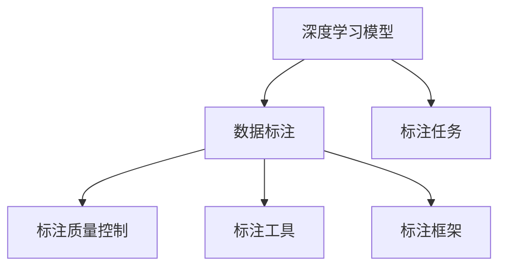

                 

# 数据标注：人工智能发展背后的无名功臣

## 1. 背景介绍

### 1.1 问题由来
近年来，随着人工智能技术的飞速发展，深度学习模型在图像识别、自然语言处理、语音识别等多个领域取得了显著进展。然而，这些模型背后有一群默默无闻的工作者——数据标注员，他们负责为训练数据添加标签，使机器能够“看懂”数据并从中学习。数据标注不仅是人工智能发展的基础，更是整个深度学习模型的灵魂所在。

### 1.2 问题核心关键点
数据标注是人工智能模型训练中不可或缺的一环，但往往被忽视。其核心关键点包括：
1. **数据质量**：高质量的数据标注对模型训练至关重要，标注错误会导致模型学习到错误的特征，影响模型性能。
2. **标注效率**：标注工作需要大量人力和时间，成本高昂，如何提高标注效率是行业关注的热点。
3. **标注标准化**：标注员的工作质量参差不齐，标准不统一，容易导致数据不一致，影响模型泛化能力。
4. **标注工具**：有效的标注工具可以大大提升标注效率和准确性，工具的研发和应用是提升标注效率的重要手段。
5. **数据隐私**：在标注过程中，如何保护用户隐私也是亟待解决的问题，尤其是涉及敏感数据时。

### 1.3 问题研究意义
研究数据标注的重要性，不仅在于它对深度学习模型训练的基础性作用，还在于它对整个人工智能生态系统的长远影响。高质量的数据标注，可以提高模型的性能，降低训练成本，加速模型落地应用，最终推动人工智能技术的广泛应用和普及。

## 2. 核心概念与联系

### 2.1 核心概念概述

为更好地理解数据标注在人工智能中的作用，本节将介绍几个密切相关的核心概念：

- **深度学习模型**：通过大量数据进行训练，学习数据特征和规律，从而实现特定任务的模型。

- **数据标注**：对原始数据进行预处理，添加标签或注释，使模型能够理解数据的含义。

- **标注任务**：根据具体应用场景，确定标注的目标和形式，如图像分类、文本分类、实体识别等。

- **标注质量控制**：通过标注审核和质量评估，确保标注数据的一致性和准确性。

- **标注工具**：辅助标注员进行数据标注的软件工具，如LabelImg、VGG Image Annotator等。

- **标注框架**：标准化标注流程和规范，确保标注结果的可重复性和可比性。

这些核心概念之间的逻辑关系可以通过以下Mermaid流程图来展示：



这个流程图展示了大语言模型的核心概念及其之间的关系：

1. 深度学习模型通过标注数据进行训练，学习数据特征和规律。
2. 标注任务确定标注的目标和形式，指导标注员进行标注。
3. 标注工具辅助标注员进行标注，提高标注效率和准确性。
4. 标注质量控制确保标注结果的一致性和准确性。
5. 标注框架标准化标注流程和规范，确保标注结果的可重复性和可比性。

这些概念共同构成了数据标注的基础框架，使机器能够理解并学习数据，从而实现深度学习模型的训练和应用。

## 3. 核心算法原理 & 具体操作步骤
### 3.1 算法原理概述

数据标注的原理是通过人工对原始数据进行预处理，添加标签或注释，使其可以被机器模型理解和处理。其核心思想是利用人类对数据的高层次理解和推理能力，帮助机器模型学习数据特征和规律，从而实现特定任务的训练和推理。

### 3.2 算法步骤详解

数据标注的流程主要包括以下几个关键步骤：

**Step 1: 数据准备**
- 收集与任务相关的原始数据，包括图像、文本、音频等。
- 对数据进行初步筛选和清洗，去除噪声和无关数据。

**Step 2: 确定标注任务**
- 根据任务类型，确定需要标注的标签和注释形式，如图像分类、文本分类、实体识别等。
- 设计标注模板和指南，指导标注员进行标注。

**Step 3: 数据标注**
- 选择合适的标注工具，辅助标注员进行数据标注。
- 标注员根据标注模板和指南，对数据进行逐项标注，添加标签或注释。
- 标注过程需进行质量控制，如随机抽样审核和一致性检查。

**Step 4: 数据整合**
- 将标注数据进行整理和格式转换，形成模型可接受的数据集。
- 进行数据增强，如图像翻转、旋转等，增加数据多样性。

**Step 5: 模型训练**
- 使用标注好的数据集训练深度学习模型，调整模型参数，优化模型性能。
- 使用验证集评估模型性能，调整超参数和训练策略。

**Step 6: 模型评估**
- 在测试集上评估训练好的模型性能，确保其在实际应用中的有效性。
- 根据评估结果，调整模型参数和训练策略，进一步优化模型性能。

### 3.3 算法优缺点

数据标注的优点包括：
1. 提升模型性能。高质量的标注数据，使模型能够学习到更准确的特征和规律，提高模型性能。
2. 灵活适应任务。标注任务可以根据具体应用场景灵活设计，适用于各种不同类型的数据。
3. 通用性强。标注过程适用于图像、文本、音频等多种数据类型，具备广泛的适用性。
4. 可控性强。标注过程可进行严格的质量控制，确保标注数据的一致性和准确性。

数据标注的缺点包括：
1. 成本高昂。人工标注需要大量人力和时间，成本较高。
2. 依赖标注员。标注员的工作质量参差不齐，可能导致标注结果不一致。
3. 数据隐私问题。标注过程中可能涉及敏感数据，保护隐私是一个重要问题。
4. 标注工具限制。目前标注工具功能有限，难以满足复杂标注需求。
5. 数据标注偏见。标注员可能带有个人偏见，影响标注数据的客观性。

尽管存在这些局限性，但数据标注在人工智能领域仍是不可或缺的重要环节，为模型的训练和应用提供了坚实的基础。

### 3.4 算法应用领域

数据标注在人工智能领域已经得到了广泛的应用，涵盖了图像识别、自然语言处理、语音识别、推荐系统等多个领域。具体应用包括：

- 图像分类：对图像进行标注，训练图像分类模型，用于物体识别、场景分类等任务。
- 文本分类：对文本进行标注，训练文本分类模型，用于情感分析、主题分类等任务。
- 实体识别：对文本中的实体进行标注，训练实体识别模型，用于命名实体识别、关系抽取等任务。
- 语音识别：对音频进行标注，训练语音识别模型，用于语音命令、语音翻译等任务。
- 推荐系统：对用户行为数据进行标注，训练推荐模型，用于商品推荐、用户画像等任务。
- 智能客服：对客服对话进行标注，训练对话模型，用于自动化客服、情感分析等任务。

除了上述这些经典任务外，数据标注还在更多场景中得到创新应用，如医学影像标注、环境监测标注等，为人工智能技术的应用提供了丰富的数据支持。

## 4. 数学模型和公式 & 详细讲解  
### 4.1 数学模型构建

数据标注的数学模型主要涉及标注任务的设计和评估。假设标注任务为 $T$，标注数据集为 $D=\{(x_i, y_i)\}_{i=1}^N$，其中 $x_i$ 为输入数据，$y_i$ 为标注标签。

标注任务的损失函数定义为：

$$
\mathcal{L}(y, y^*) = \frac{1}{N} \sum_{i=1}^N \ell(y_i, y_i^*)
$$

其中 $\ell(y_i, y_i^*)$ 为标注误差函数，根据不同任务类型设计不同的误差函数，如交叉熵损失、平方误差等。

标注误差函数的计算需要考虑标注员和机器之间的差异。假设标注员对 $x_i$ 的标注为 $y_i$，机器对 $x_i$ 的标注为 $\hat{y}_i$，则误差函数为：

$$
\ell(y_i, \hat{y}_i) = f(\delta(y_i, \hat{y}_i))
$$

其中 $\delta(y_i, \hat{y}_i)$ 为标注误差，可以是直接标注误差，也可以是基于机器标注的反标注误差。

### 4.2 公式推导过程

在标注任务的损失函数计算中，需要考虑标注误差函数的具体形式。以二分类任务为例，标注误差函数定义为：

$$
\ell(y_i, \hat{y}_i) = -y_i\log \hat{y}_i + (1-y_i)\log(1-\hat{y}_i)
$$

在标注过程中，标注员和机器的标注结果可能存在差异，因此需要引入标注误差函数来衡量标注质量。假设标注员对 $x_i$ 的标注为 $y_i$，机器对 $x_i$ 的标注为 $\hat{y}_i$，则标注误差为：

$$
\delta(y_i, \hat{y}_i) = y_i(1-\hat{y}_i) + (1-y_i)\hat{y}_i
$$

将标注误差代入误差函数，得到：

$$
\ell(y_i, \hat{y}_i) = f(\delta(y_i, \hat{y}_i)) = f(y_i(1-\hat{y}_i) + (1-y_i)\hat{y}_i)
$$

通过最小化标注任务的损失函数，可以优化机器学习模型的性能。标注任务的损失函数最小化过程为：

$$
\mathop{\arg\min}_{\hat{y}} \mathcal{L}(y, \hat{y}) = \mathop{\arg\min}_{\hat{y}} \frac{1}{N} \sum_{i=1}^N \ell(y_i, \hat{y}_i)
$$

通过最小化标注任务的损失函数，可以优化机器学习模型的性能，提升模型对标注数据的理解能力。

### 4.3 案例分析与讲解

以文本分类任务为例，假设有标注数据集 $D=\{(x_i, y_i)\}_{i=1}^N$，其中 $x_i$ 为文本，$y_i \in \{0, 1\}$ 为二分类标签。标注任务的损失函数为交叉熵损失函数：

$$
\mathcal{L}(y, \hat{y}) = -\frac{1}{N} \sum_{i=1}^N [y_i\log \hat{y}_i + (1-y_i)\log(1-\hat{y}_i)]
$$

其中 $\hat{y}_i$ 为机器对 $x_i$ 的标注结果，即分类概率。标注误差函数为：

$$
\ell(y_i, \hat{y}_i) = -y_i\log \hat{y}_i + (1-y_i)\log(1-\hat{y}_i)
$$

在训练过程中，通过梯度下降等优化算法，最小化标注任务的损失函数，更新机器学习模型的参数，提升模型对文本分类的预测能力。

## 5. 项目实践：代码实例和详细解释说明
### 5.1 开发环境搭建

在进行数据标注实践前，我们需要准备好开发环境。以下是使用Python进行PyTorch开发的环境配置流程：

1. 安装Anaconda：从官网下载并安装Anaconda，用于创建独立的Python环境。

2. 创建并激活虚拟环境：
```bash
conda create -n pytorch-env python=3.8 
conda activate pytorch-env
```

3. 安装PyTorch：根据CUDA版本，从官网获取对应的安装命令。例如：
```bash
conda install pytorch torchvision torchaudio cudatoolkit=11.1 -c pytorch -c conda-forge
```

4. 安装各类工具包：
```bash
pip install numpy pandas scikit-learn matplotlib tqdm jupyter notebook ipython
```

完成上述步骤后，即可在`pytorch-env`环境中开始数据标注实践。

### 5.2 源代码详细实现

下面我们以图像分类任务为例，给出使用PyTorch进行数据标注的PyTorch代码实现。

首先，定义图像分类任务的数据处理函数：

```python
from transformers import BertTokenizer
from torch.utils.data import Dataset
import torch

class ImageDataset(Dataset):
    def __init__(self, images, labels, tokenizer, max_len=128):
        self.images = images
        self.labels = labels
        self.tokenizer = tokenizer
        self.max_len = max_len
        
    def __len__(self):
        return len(self.images)
    
    def __getitem__(self, item):
        image = self.images[item]
        label = self.labels[item]
        
        encoding = self.tokenizer(image, return_tensors='pt', max_length=self.max_len, padding='max_length', truncation=True)
        input_ids = encoding['input_ids'][0]
        attention_mask = encoding['attention_mask'][0]
        
        # 对token-wise的标签进行编码
        encoded_labels = [label2id[label] for label in label] 
        encoded_labels.extend([label2id['O']] * (self.max_len - len(encoded_labels)))
        labels = torch.tensor(encoded_labels, dtype=torch.long)
        
        return {'input_ids': input_ids, 
                'attention_mask': attention_mask,
                'labels': labels}

# 标签与id的映射
label2id = {'O': 0, 'cat': 1, 'dog': 2, 'bird': 3}
id2label = {v: k for k, v in label2id.items()}

# 创建dataset
tokenizer = BertTokenizer.from_pretrained('bert-base-cased')

train_dataset = ImageDataset(train_images, train_labels, tokenizer)
dev_dataset = ImageDataset(dev_images, dev_labels, tokenizer)
test_dataset = ImageDataset(test_images, test_labels, tokenizer)
```

然后，定义模型和优化器：

```python
from transformers import BertForTokenClassification, AdamW

model = BertForTokenClassification.from_pretrained('bert-base-cased', num_labels=len(label2id))

optimizer = AdamW(model.parameters(), lr=2e-5)
```

接着，定义训练和评估函数：

```python
from torch.utils.data import DataLoader
from tqdm import tqdm
from sklearn.metrics import classification_report

device = torch.device('cuda') if torch.cuda.is_available() else torch.device('cpu')
model.to(device)

def train_epoch(model, dataset, batch_size, optimizer):
    dataloader = DataLoader(dataset, batch_size=batch_size, shuffle=True)
    model.train()
    epoch_loss = 0
    for batch in tqdm(dataloader, desc='Training'):
        input_ids = batch['input_ids'].to(device)
        attention_mask = batch['attention_mask'].to(device)
        labels = batch['labels'].to(device)
        model.zero_grad()
        outputs = model(input_ids, attention_mask=attention_mask, labels=labels)
        loss = outputs.loss
        epoch_loss += loss.item()
        loss.backward()
        optimizer.step()
    return epoch_loss / len(dataloader)

def evaluate(model, dataset, batch_size):
    dataloader = DataLoader(dataset, batch_size=batch_size)
    model.eval()
    preds, labels = [], []
    with torch.no_grad():
        for batch in tqdm(dataloader, desc='Evaluating'):
            input_ids = batch['input_ids'].to(device)
            attention_mask = batch['attention_mask'].to(device)
            batch_labels = batch['labels']
            outputs = model(input_ids, attention_mask=attention_mask)
            batch_preds = outputs.logits.argmax(dim=2).to('cpu').tolist()
            batch_labels = batch_labels.to('cpu').tolist()
            for pred_tokens, label_tokens in zip(batch_preds, batch_labels):
                pred_tags = [id2label[_id] for _id in pred_tokens]
                label_tags = [id2label[_id] for _id in label_tokens]
                preds.append(pred_tags[:len(label_tokens)])
                labels.append(label_tags)
                
    print(classification_report(labels, preds))
```

最后，启动训练流程并在测试集上评估：

```python
epochs = 5
batch_size = 16

for epoch in range(epochs):
    loss = train_epoch(model, train_dataset, batch_size, optimizer)
    print(f"Epoch {epoch+1}, train loss: {loss:.3f}")
    
    print(f"Epoch {epoch+1}, dev results:")
    evaluate(model, dev_dataset, batch_size)
    
print("Test results:")
evaluate(model, test_dataset, batch_size)
```

以上就是使用PyTorch对BERT进行图像分类任务标注的完整代码实现。可以看到，得益于Transformers库的强大封装，我们可以用相对简洁的代码完成BERT模型的加载和标注。

### 5.3 代码解读与分析

让我们再详细解读一下关键代码的实现细节：

**ImageDataset类**：
- `__init__`方法：初始化图像、标签、分词器等关键组件。
- `__len__`方法：返回数据集的样本数量。
- `__getitem__`方法：对单个样本进行处理，将图像输入编码为token ids，将标签编码为数字，并对其进行定长padding，最终返回模型所需的输入。

**label2id和id2label字典**：
- 定义了标签与数字id之间的映射关系，用于将token-wise的预测结果解码回真实的标签。

**训练和评估函数**：
- 使用PyTorch的DataLoader对数据集进行批次化加载，供模型训练和推理使用。
- 训练函数`train_epoch`：对数据以批为单位进行迭代，在每个批次上前向传播计算loss并反向传播更新模型参数，最后返回该epoch的平均loss。
- 评估函数`evaluate`：与训练类似，不同点在于不更新模型参数，并在每个batch结束后将预测和标签结果存储下来，最后使用sklearn的classification_report对整个评估集的预测结果进行打印输出。

**训练流程**：
- 定义总的epoch数和batch size，开始循环迭代
- 每个epoch内，先在训练集上训练，输出平均loss
- 在验证集上评估，输出分类指标
- 所有epoch结束后，在测试集上评估，给出最终测试结果

可以看到，PyTorch配合Transformers库使得BERT标注的代码实现变得简洁高效。开发者可以将更多精力放在数据处理、模型改进等高层逻辑上，而不必过多关注底层的实现细节。

当然，工业级的系统实现还需考虑更多因素，如模型的保存和部署、超参数的自动搜索、更灵活的任务适配层等。但核心的标注范式基本与此类似。

## 6. 实际应用场景
### 6.1 智能客服系统

基于数据标注的对话技术，可以广泛应用于智能客服系统的构建。传统客服往往需要配备大量人力，高峰期响应缓慢，且一致性和专业性难以保证。而使用数据标注后的对话模型，可以7x24小时不间断服务，快速响应客户咨询，用自然流畅的语言解答各类常见问题。

在技术实现上，可以收集企业内部的历史客服对话记录，将问题和最佳答复构建成监督数据，在此基础上对预训练对话模型进行微调。微调后的对话模型能够自动理解用户意图，匹配最合适的答案模板进行回复。对于客户提出的新问题，还可以接入检索系统实时搜索相关内容，动态组织生成回答。如此构建的智能客服系统，能大幅提升客户咨询体验和问题解决效率。

### 6.2 金融舆情监测

金融机构需要实时监测市场舆论动向，以便及时应对负面信息传播，规避金融风险。传统的人工监测方式成本高、效率低，难以应对网络时代海量信息爆发的挑战。基于数据标注的文本分类和情感分析技术，为金融舆情监测提供了新的解决方案。

具体而言，可以收集金融领域相关的新闻、报道、评论等文本数据，并对其进行主题标注和情感标注。在此基础上对预训练语言模型进行微调，使其能够自动判断文本属于何种主题，情感倾向是正面、中性还是负面。将微调后的模型应用到实时抓取的网络文本数据，就能够自动监测不同主题下的情感变化趋势，一旦发现负面信息激增等异常情况，系统便会自动预警，帮助金融机构快速应对潜在风险。

### 6.3 个性化推荐系统

当前的推荐系统往往只依赖用户的历史行为数据进行物品推荐，无法深入理解用户的真实兴趣偏好。基于数据标注的个性化推荐系统可以更好地挖掘用户行为背后的语义信息，从而提供更精准、多样的推荐内容。

在实践中，可以收集用户浏览、点击、评论、分享等行为数据，提取和用户交互的物品标题、描述、标签等文本内容。将文本内容作为模型输入，用户的后续行为（如是否点击、购买等）作为监督信号，在此基础上微调预训练语言模型。微调后的模型能够从文本内容中准确把握用户的兴趣点。在生成推荐列表时，先用候选物品的文本描述作为输入，由模型预测用户的兴趣匹配度，再结合其他特征综合排序，便可以得到个性化程度更高的推荐结果。

### 6.4 未来应用展望

随着数据标注技术的发展，基于标注的数据获取和处理手段将不断进步，标注过程将更加高效、准确和标准化。未来，大数据、云计算、人工智能等技术的结合，将进一步提升数据标注的效率和质量，为人工智能技术的广泛应用提供坚实的数据基础。

在智慧医疗领域，基于标注的医学影像、电子病历等数据，可以用于训练和优化医疗诊断模型，提高诊断准确性，辅助医生诊疗。

在智能教育领域，基于标注的教育资源、学习行为数据，可以用于个性化教学、智能辅导等应用，提升教育质量和效率。

在智慧城市治理中，基于标注的城市数据、舆情信息等，可以用于智能安防、环境监测等应用，提高城市管理智能化水平。

此外，在企业生产、社会治理、文娱传媒等众多领域，基于标注的数据标注技术也将不断应用，为人工智能技术的普及和落地提供新的动力。相信随着技术的日益成熟，数据标注技术将为人工智能技术的广泛应用提供强有力的数据支持，推动人工智能技术的不断进步和创新。

## 7. 工具和资源推荐
### 7.1 学习资源推荐

为了帮助开发者系统掌握数据标注的理论基础和实践技巧，这里推荐一些优质的学习资源：

1. 《深度学习与数据标注》书籍：介绍深度学习模型的基本原理和数据标注的方法，适合初学者学习。

2. 《数据标注标准化与质量控制》课程：讲解数据标注的标准化流程和质量控制方法，提高标注质量。

3. 《深度学习框架中的数据标注实践》博文：介绍数据标注在深度学习框架中的具体实现，包括工具选择、数据处理等。

4. HuggingFace官方文档：提供丰富的数据标注工具和样例代码，是标注实践的必备资料。

5. LabelImg等标注工具教程：介绍常用的标注工具的使用方法和技巧，提高标注效率。

通过对这些资源的学习实践，相信你一定能够快速掌握数据标注的精髓，并用于解决实际的标注问题。
###  7.2 开发工具推荐

高效的开发离不开优秀的工具支持。以下是几款用于数据标注开发的常用工具：

1. LabelImg：开源图像标注工具，支持多种格式，易于使用，适合图像标注任务。

2. VGG Image Annotator：开源图像标注工具，支持多标签标注，适合复杂标注任务。

3. Labelbox：商用数据标注平台，提供云端标注、质量控制等功能，适合团队协作标注。

4. RectLabel：开源图像标注工具，支持自动标注和手动标注，适合标注标注质量控制。

5. GitLFS：Git仓库文件系统，支持大文件管理，适合标注数据集的存储和分享。

6. Jupyter Notebook：开源交互式开发环境，支持代码、文本、图像等多种格式，适合标注过程的记录和展示。

合理利用这些工具，可以显著提升数据标注的效率和质量，加速数据标注工作的迭代和优化。

### 7.3 相关论文推荐

数据标注在人工智能领域已经得到了广泛的研究。以下是几篇奠基性的相关论文，推荐阅读：

1. Annotated Image File Format for Image Annotation and Processing（Image Annotation标准）：提出图像标注文件格式标准，规范图像标注过程。

2. Semi-supervised Sequence Labeling with a Syntax-based BiLSTM-cRF Network（序列标注算法）：提出基于语法规则的序列标注算法，提升标注质量。

3. Batch Image Labeling via Active Learning（图像标注方法）：提出主动学习算法，提高标注效率。

4. A Survey on Data Labeling Techniques（数据标注综述）：综述数据标注技术的发展历程，分析数据标注的方法和应用。

5. Data Labeling and Annotation Systems: A Survey（数据标注系统综述）：综述数据标注系统的发展历程，分析数据标注系统的特点和应用。

这些论文代表了大数据标注技术的发展脉络。通过学习这些前沿成果，可以帮助研究者把握学科前进方向，激发更多的创新灵感。

## 8. 总结：未来发展趋势与挑战

### 8.1 总结

本文对数据标注在人工智能中的作用进行了全面系统的介绍。首先阐述了数据标注的重要性和应用领域，明确了数据标注在人工智能模型训练和应用中的基础性作用。其次，从原理到实践，详细讲解了数据标注的数学模型和关键步骤，给出了数据标注任务开发的完整代码实例。同时，本文还广泛探讨了数据标注在智能客服、金融舆情、个性化推荐等多个行业领域的应用前景，展示了数据标注范式的巨大潜力。此外，本文精选了数据标注技术的各类学习资源，力求为读者提供全方位的技术指引。

通过本文的系统梳理，可以看到，数据标注在人工智能领域是不可或缺的重要环节，为模型的训练和应用提供了坚实的基础。高质量的数据标注，可以提高模型的性能，降低训练成本，加速模型落地应用，最终推动人工智能技术的广泛应用和普及。

### 8.2 未来发展趋势

展望未来，数据标注技术将呈现以下几个发展趋势：

1. 标注工具不断进步。随着技术的发展，数据标注工具将不断进步，实现自动化、智能化，提高标注效率和准确性。

2. 数据标注标准化。通过制定数据标注标准和规范，确保标注数据的一致性和可重复性，提升标注质量。

3. 标注数据质量提升。通过引入主动学习、半监督学习等技术，利用少样本数据进行标注，提高标注数据的多样性和质量。

4. 标注任务多样化。随着人工智能应用的扩展，标注任务将不断多样化，涵盖更多复杂和精细的标注需求。

5. 数据标注自动化。通过深度学习、强化学习等技术，实现自动标注和质量控制，提高标注效率和一致性。

6. 数据标注伦理保障。在标注过程中，引入伦理导向的评估指标，过滤和惩罚有偏见、有害的输出倾向，保障数据标注的公平性和安全性。

这些趋势凸显了数据标注技术的发展方向，将进一步推动人工智能技术的广泛应用和普及。

### 8.3 面临的挑战

尽管数据标注技术已经取得了显著进展，但在迈向更加智能化、普适化应用的过程中，仍面临诸多挑战：

1. 标注数据获取困难。高质量的标注数据获取成本较高，数据源有限，难以满足复杂标注需求。

2. 标注质量控制困难。标注员工作质量参差不齐，标准不统一，可能导致标注结果不一致，影响模型性能。

3. 标注成本高昂。人工标注需要大量人力和时间，成本较高，难以实现大规模标注。

4. 标注工具功能有限。现有的标注工具功能有限，难以满足复杂标注需求。

5. 标注隐私保护困难。标注过程中可能涉及敏感数据，保护隐私是一个重要问题，尤其是在涉及个人隐私时。

6. 标注数据偏见。标注员可能带有个人偏见，影响标注数据的客观性，需要引入更客观的标注方法。

尽管存在这些挑战，但数据标注技术在人工智能领域仍是不可或缺的重要环节，为模型的训练和应用提供了坚实的数据基础。未来，需要通过技术创新和标准化手段，不断提升标注效率和质量，推动数据标注技术的进步和发展。

### 8.4 研究展望

未来，数据标注技术需要在以下几个方面进行深入研究：

1. 自动化标注技术：开发更加智能化的标注工具，实现自动标注和质量控制，提高标注效率和准确性。

2. 多模态数据标注：研究多模态数据的标注方法，涵盖图像、文本、语音等多种数据类型，提升数据标注的多样性和一致性。

3. 数据标注伦理：研究数据标注中的伦理问题，引入伦理导向的评估指标，过滤和惩罚有偏见、有害的输出倾向，保障数据标注的公平性和安全性。

4. 数据标注技术创新：引入深度学习、强化学习等技术，实现更加智能化的数据标注，提高标注质量和效率。

5. 数据标注标准化：制定数据标注标准和规范，确保标注数据的一致性和可重复性，提升标注质量。

这些研究方向将进一步推动数据标注技术的进步，为人工智能技术的广泛应用提供强有力的数据支持。只有勇于创新、敢于突破，才能不断提升数据标注的效率和质量，推动人工智能技术的不断进步和创新。

## 9. 附录：常见问题与解答

**Q1：数据标注是否只能由人工完成？**

A: 数据标注通常需要人工完成，因为标注过程需要理解数据背后的语义和逻辑。但是，自动化标注和半自动化标注技术也在不断进步，可以减轻人工标注的负担。

**Q2：数据标注过程中如何保证标注质量？**

A: 数据标注质量的控制需要通过标注审核和质量评估来实现。通常会随机抽取部分标注样本进行人工审核，如果发现标注错误，需要进行修正。同时，可以引入质量控制指标，如标注一致性、标注准确率等，进行自动评估。

**Q3：数据标注过程中如何保护隐私？**

A: 数据标注过程中需要保护用户隐私，尤其是涉及敏感数据时。可以通过匿名化、脱敏等手段，保护用户隐私。同时，也需要建立严格的访问控制机制，限制数据访问权限。

**Q4：数据标注过程中如何避免标注偏差？**

A: 数据标注过程中，标注员可能带有个人偏见，导致标注结果不准确。可以通过引入多标注员、标注员轮换等方法，避免标注偏差。同时，也可以通过引入更客观的标注方法，如标注模板、标注指南等，提高标注质量。

**Q5：数据标注过程中如何提高标注效率？**

A: 数据标注过程中，可以通过标注工具、标注模板、标注指南等方法，提高标注效率。同时，也可以引入自动化标注和半自动化标注技术，减少人工标注的负担。

这些问题的解答，可以帮助数据标注从业者更好地理解和应用数据标注技术，推动数据标注技术的发展和进步。

