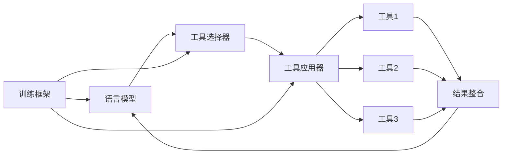

# 大语言模型应用指南：Toolformer

## 1. 背景介绍
### 1.1 问题的由来
近年来，随着深度学习技术的快速发展，大语言模型（Large Language Models, LLMs）在自然语言处理领域取得了突破性的进展。这些模型在文本生成、问答、对话等任务上展现出了接近甚至超越人类的性能，引起了学术界和工业界的广泛关注。然而，如何将这些强大的语言模型应用到实际场景中，仍然面临着诸多挑战。
### 1.2 研究现状
目前，业界主流的做法是针对特定任务对预训练的语言模型进行微调（fine-tuning），以适应不同的应用场景。这种方法虽然取得了不错的效果，但存在着模型适应性差、难以迁移等问题。最近，一种名为Toolformer的新范式被提出，旨在赋予语言模型使用外部工具的能力，从而提高其在实际应用中的灵活性和适应性。
### 1.3 研究意义
Toolformer的提出为大语言模型的应用开辟了新的思路。通过与外部工具的交互，语言模型可以突破自身的限制，解决更加复杂和多样化的任务。这不仅拓展了语言模型的应用范围，也为其他领域的研究者和开发者提供了新的灵感和方向。
### 1.4 本文结构
本文将围绕Toolformer展开深入探讨。首先，我们将介绍Toolformer的核心概念和基本原理。然后，重点阐述Toolformer的算法细节和实现步骤。接着，通过数学模型和代码实例，帮助读者更好地理解和掌握这一技术。最后，我们将讨论Toolformer的实际应用场景、未来发展趋势以及面临的挑战。

## 2. 核心概念与联系
Toolformer的核心思想是将语言模型与外部工具相结合，使其能够根据任务需求动态调用和使用这些工具。这里的"工具"可以是各种类型的软件程序、API接口、知识库等。通过这种方式，语言模型可以突破自身知识和计算能力的限制，利用外部资源来完成更加复杂的任务。

具体来说，Toolformer主要包含以下几个关键概念：

- **语言模型**：即预训练的大规模语言模型，如GPT、BERT等，是Toolformer的基础。
- **工具集**：由各种外部工具组成，如搜索引擎、计算器、数据库等，为语言模型提供额外的知识和能力。
- **工具选择器**：根据任务需求和上下文信息，决定调用哪些工具，并将其与语言模型的输出进行整合。
- **工具应用器**：负责具体执行工具调用，并将结果返回给语言模型。
- **训练框架**：用于端到端地训练Toolformer，使语言模型学会如何与工具进行交互。

下图展示了Toolformer的整体架构和各组件之间的关系：



## 3. 核心算法原理 & 具体操作步骤
### 3.1 算法原理概述
Toolformer的核心算法可以分为两个主要部分：工具选择和工具应用。

在工具选择阶段，模型需要根据当前的输入和任务目标，决定是否需要使用工具，以及具体调用哪些工具。这一过程可以通过训练一个分类器来实现，即将输入文本映射到对应的工具类别。

在工具应用阶段，模型需要将选择的工具与自身的输出进行整合，形成最终的任务结果。这里的关键是如何设计一个有效的整合机制，既能充分利用工具的输出信息，又不会过度干扰语言模型原本的生成过程。常见的做法包括将工具输出作为额外的输入提供给语言模型，或者将其用于对语言模型输出的后处理和修正。

### 3.2 算法步骤详解
下面我们将Toolformer的算法流程细化为以下步骤：

1. **编码输入**：将用户输入的文本转化为语言模型可以处理的向量表示。
2. **工具选择**：通过分类器判断是否需要调用工具，如果是，则进一步决定具体使用哪些工具。
3. **工具应用**：调用选定的工具，并将其输出结果保存备用。
4. **模型推断**：语言模型根据编码后的输入和工具输出，生成相应的任务结果。
5. **结果整合**：将语言模型的输出与工具的输出进行整合，形成最终的任务结果。
6. **输出解码**：将整合后的结果转化为人类可读的文本格式，并返回给用户。

算法伪代码如下：

```python
def toolformer(input_text):
    # 编码输入
    input_vector = encode(input_text)
    
    # 工具选择
    tool_ids = tool_selector(input_vector)
    
    # 工具应用
    tool_outputs = []
    for tool_id in tool_ids:
        output = apply_tool(tool_id, input_text)
        tool_outputs.append(output)
    
    # 模型推断
    model_output = language_model(input_vector, tool_outputs)
    
    # 结果整合
    final_output = integrate(model_output, tool_outputs)
    
    # 输出解码
    result_text = decode(final_output)
    
    return result_text
```

### 3.3 算法优缺点
Toolformer的主要优点包括：

- 扩展了语言模型的能力边界，使其能够处理更加复杂和多样化的任务。
- 通过引入外部工具，减轻了语言模型自身的学习和存储负担。
- 提高了语言模型在实际应用中的灵活性和适应性。

同时，Toolformer也存在一些局限性：

- 对工具的选择和使用有较强的依赖，工具的质量和适用性直接影响模型性能。
- 工具与语言模型的交互机制设计难度较大，需要权衡效果和效率。
- 引入外部工具可能带来额外的计算开销和响应延迟。

### 3.4 算法应用领域
Toolformer可以应用于多个自然语言处理领域，包括但不限于：

- 问答系统：通过调用知识库、搜索引擎等工具，提高问答的准确性和覆盖范围。
- 对话系统：利用外部工具实现多轮对话、上下文理解等功能，增强交互体验。
- 文本生成：结合文本编辑、翻译等工具，提高生成文本的可控性和多样性。
- 信息抽取：使用命名实体识别、关系抽取等工具，辅助语言模型完成结构化信息提取。

## 4. 数学模型和公式 & 详细讲解 & 举例说明
### 4.1 数学模型构建
我们可以将Toolformer formalize为一个条件概率模型。给定输入文本$x$和工具集合$T$，Toolformer的目标是生成一个输出文本$y$，使得条件概率$P(y|x,T)$最大化。

形式化地，我们有：

$$\hat{y} = \arg\max_y P(y|x,T)$$

其中，$\hat{y}$表示模型生成的最优输出。

为了计算这个条件概率，我们引入一个隐变量$z$来表示工具的选择和使用情况。于是，上述公式可以进一步写作：

$$P(y|x,T) = \sum_z P(y,z|x,T) = \sum_z P(y|z,x,T)P(z|x,T)$$

这里，$P(z|x,T)$表示给定输入$x$和工具集$T$时，选择工具组合$z$的概率；$P(y|z,x,T)$表示在选定工具组合$z$的情况下，生成输出$y$的概率。

### 4.2 公式推导过程
根据贝叶斯公式，我们可以将$P(z|x,T)$进一步分解为：

$$P(z|x,T) = \frac{P(x|z,T)P(z|T)}{P(x|T)}$$

其中，$P(x|z,T)$表示在选定工具组合$z$的情况下，生成输入$x$的概率；$P(z|T)$表示在工具集$T$中选择工具组合$z$的先验概率；$P(x|T)$表示在工具集$T$的条件下，生成输入$x$的概率，可以视为一个归一化因子。

将上述公式代入，我们得到：

$$P(y|x,T) = \sum_z P(y|z,x,T)\frac{P(x|z,T)P(z|T)}{P(x|T)}$$

为了简化模型，我们做以下假设：

1. 给定工具组合$z$，输出$y$的生成过程与输入$x$无关，即$P(y|z,x,T)=P(y|z,T)$。
2. 工具组合$z$的选择只依赖于输入$x$，与工具集$T$无关，即$P(z|x,T)=P(z|x)$。

基于这些假设，我们可以将模型简化为：

$$P(y|x,T) = \sum_z P(y|z,T)P(z|x)$$

这就是Toolformer的基本数学模型。

### 4.3 案例分析与讲解
下面我们以一个简单的例子来说明Toolformer的工作原理。

假设我们有一个输入文本$x$="What is the capital of France?"，以及一个包含两个工具的集合$T=\{Search, Calculator\}$。

首先，模型需要根据输入$x$决定选择哪些工具。在这个例子中，显然应该选择搜索引擎$Search$来查询法国的首都。于是，我们有$P(z=\{Search\}|x)=0.9$，$P(z=\{Calculator\}|x)=0.1$。

接下来，模型利用选定的工具$Search$进行查询，得到结果"Paris"。然后，它将这个结果与自身的语言知识相结合，生成最终的输出$y$="The capital of France is Paris."。这里，$P(y|z=\{Search\},T)=0.95$，$P(y|z=\{Calculator\},T)=0.05$。

最终，我们可以计算出：

$$\begin{aligned}
P(y|x,T) &= P(y|z=\{Search\},T)P(z=\{Search\}|x) \
&+ P(y|z=\{Calculator\},T)P(z=\{Calculator\}|x) \
&= 0.95 \times 0.9 + 0.05 \times 0.1 \
&= 0.86
\end{aligned}$$

这表明，对于给定的输入"What is the capital of France?"，Toolformer有86%的概率生成正确的输出"The capital of France is Paris."。

### 4.4 常见问题解答
Q1: Toolformer能否处理多个工具的组合使用？

A1: 理论上是可以的。在上述数学模型中，我们引入了工具组合$z$这一隐变量，它可以表示任意数量工具的组合。当然，实际实现时需要权衡模型的复杂度和效率。

Q2: 如何训练Toolformer的工具选择器和语言模型？

A2: 工具选择器可以看作一个分类问题，通过监督学习的方式进行训练。具体来说，我们可以准备一批(输入,工具组合)的标注数据，然后训练一个神经网络模型来拟合$P(z|x)$。语言模型的训练则可以采用传统的自回归式语言模型训练方法，如最大似然估计等。

Q3: Toolformer是否适用于非自然语言处理领域？

A3: 从原理上讲，Toolformer的思想是通用的，即利用外部工具来扩展模型的能力边界。因此，它有望被应用到其他领域，如计算机视觉、语音识别等。当然，这需要针对具体任务设计合适的工具集和交互机制。

## 5. 项目实践：代码实例和详细解释说明
### 5.1 开发环境搭建
首先，我们需要准备一个基本的Python开发环境。这里我们使用PyTorch作为深度学习框架，安装方式如下：

```bash
pip install torch
```

此外，我们