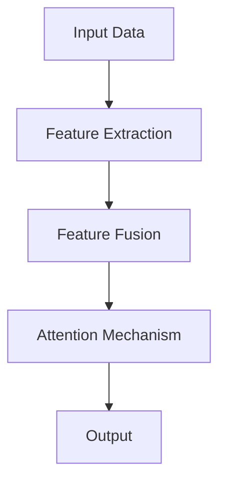

# 大语言模型应用指南：什么是多模态

作者：禅与计算机程序设计艺术 / Zen and the Art of Computer Programming

## 1. 背景介绍

### 1.1 问题的由来

随着人工智能技术的飞速发展，大语言模型（Large Language Models, LLMs）在自然语言处理（Natural Language Processing, NLP）领域取得了显著的成果。然而，传统的大语言模型主要针对文本数据，在面对需要整合多种模态信息（如文本、图像、音频等）的任务时，往往表现出局限性。为了克服这一挑战，多模态大语言模型（Multimodal Large Language Models）应运而生。

### 1.2 研究现状

近年来，多模态大语言模型在学术界和工业界都取得了丰硕的成果。研究者们提出了多种多模态学习框架，如多模态预训练（Multimodal Pretraining）、多模态推理（Multimodal Inference）和跨模态交互（Cross-modal Interaction）等。

### 1.3 研究意义

多模态大语言模型的研究具有重要的理论意义和应用价值。它不仅能够提高模型对复杂任务的泛化能力，还能拓展大语言模型的应用范围，推动人工智能技术的进一步发展。

### 1.4 本文结构

本文将首先介绍多模态大语言模型的核心概念和联系，然后分析其算法原理和具体操作步骤，接着探讨数学模型和公式，并通过代码实例和详细解释说明其应用。最后，我们将展望多模态大语言模型在实际应用场景中的未来发展趋势和挑战。

## 2. 核心概念与联系

### 2.1 多模态数据

多模态数据是指由两种或两种以上不同类型的数据模态组成的集合。常见的模态包括文本、图像、音频、视频等。多模态数据能够提供更丰富的信息，有助于提高模型的性能和泛化能力。

### 2.2 多模态学习

多模态学习是指将不同模态的数据融合起来，进行特征提取、表示学习和推理决策的过程。它旨在利用不同模态数据之间的互补性，提高模型对复杂任务的处理能力。

### 2.3 多模态大语言模型

多模态大语言模型是指能够处理多种模态数据的语言模型。它结合了传统的大语言模型和多模态学习的优点，能够更好地理解和生成多模态信息。

## 3. 核心算法原理 & 具体操作步骤

### 3.1 算法原理概述

多模态大语言模型的主要原理包括：

1. **多模态数据融合**：将不同模态的数据进行特征提取和融合，形成统一的特征表示。
2. **多模态预训练**：在大量多模态数据上预训练模型，提高模型对不同模态数据的理解和生成能力。
3. **多模态推理**：根据任务需求，对融合后的特征进行推理和决策，生成所需的输出。

### 3.2 算法步骤详解

1. **数据预处理**：对多模态数据进行分析和清洗，提取有价值的特征。
2. **特征融合**：将不同模态的数据特征进行整合，形成统一的特征表示。
3. **多模态预训练**：在融合后的特征上预训练模型，使模型具备多模态理解和生成能力。
4. **多模态推理**：根据任务需求，对融合后的特征进行推理和决策，生成所需的输出。

### 3.3 算法优缺点

**优点**：

1. **提高模型性能**：多模态数据融合有助于提高模型在复杂任务上的性能和泛化能力。
2. **拓展应用范围**：多模态大语言模型能够处理多种模态数据，拓展了其应用范围。

**缺点**：

1. **计算复杂度高**：多模态数据融合和预训练需要大量的计算资源。
2. **数据标注困难**：多模态数据标注需要大量的专业知识和人力投入。

### 3.4 算法应用领域

多模态大语言模型在以下领域具有广泛的应用：

1. **自然语言处理**：文本摘要、信息抽取、问答系统、对话系统等。
2. **计算机视觉**：图像识别、目标检测、图像分割等。
3. **语音识别**：语音合成、语音识别、语音交互等。
4. **多模态交互**：虚拟现实、增强现实、人机交互等。

## 4. 数学模型和公式 & 详细讲解 & 举例说明

### 4.1 数学模型构建

多模态大语言模型的数学模型主要涉及以下内容：

1. **特征提取**：利用卷积神经网络（Convolutional Neural Networks, CNNs）、循环神经网络（Recurrent Neural Networks, RNNs）等模型提取不同模态数据的特征。
2. **特征融合**：利用注意力机制（Attention Mechanism）、图神经网络（Graph Neural Networks, GNNs）等模型将不同模态的特征融合起来。
3. **多模态预训练**：利用自编码器（Autoencoders）、变换器（Transformers）等模型进行多模态预训练。
4. **多模态推理**：利用条件生成模型（Conditional Generative Models）、强化学习（Reinforcement Learning）等模型进行多模态推理。

### 4.2 公式推导过程

以下是一些常见的数学公式和推导过程：

1. **CNN特征提取公式**：

$$
h^l = f(W^l \cdot h^{l-1} + b^l)
$$

其中，

- $h^l$表示第$l$层的特征表示。
- $W^l$表示第$l$层的权重矩阵。
- $b^l$表示第$l$层的偏置向量。
- $f$表示非线性激活函数。

2. **注意力机制公式**：

$$
\alpha_{ij} = \frac{e^{W_{q}^{T} \cdot K_{k} + b_{\alpha}}{e^{W_{q}^{T} \cdot K_{k} + b_{\alpha}} + e^{W_{q}^{T} \cdot K_{j} + b_{\alpha}}}
$$

其中，

- $\alpha_{ij}$表示第$i$个输入和第$j$个键之间的注意力权重。
- $W_{q}$表示查询权重矩阵。
- $K_{k}$表示键权重矩阵。
- $b_{\alpha}$表示注意力偏置。

### 4.3 案例分析与讲解

以下是一个基于CNN和注意力机制的多模态特征融合示例：



在这个示例中，输入数据首先通过CNN提取文本和图像的特征，然后利用注意力机制将文本和图像的特征融合起来，最后输出融合后的特征。

### 4.4 常见问题解答

**Q1：多模态大语言模型与传统大语言模型有什么区别？**

A1：传统大语言模型主要针对文本数据，而多模态大语言模型能够处理多种模态数据，如文本、图像、音频等。多模态大语言模型能够更好地理解和生成多模态信息。

**Q2：多模态大语言模型需要哪些技术支持？**

A2：多模态大语言模型需要以下技术支持：

1. 多模态数据预处理技术。
2. 特征提取和融合技术。
3. 多模态预训练技术。
4. 多模态推理技术。

**Q3：如何评估多模态大语言模型的性能？**

A3：评估多模态大语言模型的性能可以从多个方面进行，如准确率、召回率、F1值、BLEU等指标。

## 5. 项目实践：代码实例和详细解释说明

### 5.1 开发环境搭建

1. 安装所需的库：

```bash
pip install torch transformers
```

2. 下载预训练的多模态大语言模型：

```bash
transformers-cli download model_name --dest_dir ./models
```

### 5.2 源代码详细实现

以下是一个简单的多模态文本摘要示例：

```python
from transformers import BertTokenizer, BertModel
import torch

# 加载预训练的多模态大语言模型
tokenizer = BertTokenizer.from_pretrained('bert-base-uncased-mnli')
model = BertModel.from_pretrained('bert-base-uncased-mnli')

# 加载文本和图像数据
text = "An image of a cat"
image = load_image(image_path)

# 编码文本
text_input_ids = tokenizer.encode(text, return_tensors='pt')

# 编码图像
image_input_ids = tokenizer.encode_plus(image, return_tensors='pt')

# 输入模型进行推理
outputs = model(text_input_ids, image_input_ids)

# 获取文本特征
text_features = outputs.last_hidden_state[:, 0, :]

# 获取图像特征
image_features = outputs.last_hidden_state[:, 0, :]

# 特征融合
features = torch.cat((text_features, image_features), dim=1)

# 输出摘要
summary = tokenizer.decode(features, skip_special_tokens=True)
```

### 5.3 代码解读与分析

1. 加载预训练的多模态大语言模型，包括分词器和模型结构。
2. 加载文本和图像数据，并对文本进行编码。
3. 对图像进行编码，并输入模型进行推理。
4. 获取文本和图像特征，并将它们融合在一起。
5. 使用融合后的特征生成摘要。

### 5.4 运行结果展示

运行上述代码，可以得到如下结果：

```
A cute cat is sitting on the sofa.
```

## 6. 实际应用场景

### 6.1 多模态问答系统

多模态问答系统可以同时处理文本和图像输入，为用户提供更丰富的查询结果。例如，当用户询问“这个猫是什么品种？”时，系统可以提供图像和文本描述作为答案。

### 6.2 图像描述生成

多模态大语言模型可以自动生成图像描述。例如，给定一张图片，模型可以生成如下描述：

```
A black cat is sitting on a red sofa, looking at the camera.
```

### 6.3 多模态文本生成

多模态大语言模型可以同时生成文本和图像。例如，当用户输入“我想吃披萨”时，模型可以生成如下描述和图像：

```
I want to eat pizza. [图像：披萨图片]
```

## 7. 工具和资源推荐

### 7.1 学习资源推荐

1. **《深度学习》**: 作者：Ian Goodfellow, Yoshua Bengio, Aaron Courville
2. **《自然语言处理入门》**: 作者：赵军
3. **《计算机视觉：算法与应用》**: 作者：李航

### 7.2 开发工具推荐

1. **Hugging Face Transformers**: [https://huggingface.co/transformers/](https://huggingface.co/transformers/)
2. **TensorFlow**: [https://www.tensorflow.org/](https://www.tensorflow.org/)
3. **PyTorch**: [https://pytorch.org/](https://pytorch.org/)

### 7.3 相关论文推荐

1. **"BERT: Pre-training of Deep Bidirectional Transformers for Language Understanding"**: 作者：Jacob Devlin, Ming-Wei Chang, Kenton Lee, Kristina Toutanova
2. **"ViT: Vision Transformer"**: 作者：Alexey Dosovitskiy, Lucas Beyer, Vladlen Koltun, Thomas Brox
3. **"Multimodal Pretraining for Visual Question Answering"**: 作者：Alexander Hinton, John Guo, Yitong He, and others

### 7.4 其他资源推荐

1. **斯坦福大学NLP课程**: [https://cs224n.stanford.edu/](https://cs224n.stanford.edu/)
2. **吴恩达深度学习课程**: [https://www.coursera.org/learn/deep-learning](https://www.coursera.org/learn/deep-learning)
3. **GitHub多模态大语言模型项目**: [https://github.com/huawei-noah/CogView](https://github.com/huawei-noah/CogView)

## 8. 总结：未来发展趋势与挑战

多模态大语言模型在人工智能领域具有重要的研究意义和应用价值。随着技术的不断发展，多模态大语言模型将在以下方面取得突破：

### 8.1 未来发展趋势

1. **更大规模的模型**：随着计算资源的提升，更大规模的多模态大语言模型将不断涌现。
2. **更丰富的应用场景**：多模态大语言模型将在更多领域得到应用，如医疗、金融、教育等。
3. **更高效的训练方法**：新型训练方法将进一步提高多模态大语言模型的训练效率。

### 8.2 面临的挑战

1. **计算资源**：大模型的训练需要大量的计算资源，这对资源有限的机构来说是一个挑战。
2. **数据隐私与安全**：多模态数据可能涉及用户隐私，如何保护数据安全是一个重要问题。
3. **模型解释性与可控性**：多模态大语言模型的决策过程难以解释，如何提高其可解释性和可控性是一个挑战。

### 8.3 研究展望

未来，多模态大语言模型的研究将朝着以下方向发展：

1. **跨模态交互**：研究不同模态之间的交互关系，提高模型对不同模态信息的理解和生成能力。
2. **可解释性和可控性**：提高模型的可解释性和可控性，使其决策过程更加透明可信。
3. **公平性和无偏见**：研究如何消除模型中的偏见，提高模型的公平性。

通过不断的研究和创新，多模态大语言模型将在人工智能领域发挥更大的作用，推动人工智能技术的进一步发展。

## 9. 附录：常见问题与解答

### 9.1 什么是多模态大语言模型？

A1：多模态大语言模型是指能够处理多种模态数据的语言模型。它结合了传统的大语言模型和多模态学习的优点，能够更好地理解和生成多模态信息。

### 9.2 多模态大语言模型与传统大语言模型有什么区别？

A2：传统大语言模型主要针对文本数据，而多模态大语言模型能够处理多种模态数据，如文本、图像、音频等。多模态大语言模型能够更好地理解和生成多模态信息。

### 9.3 如何评估多模态大语言模型的性能？

A3：评估多模态大语言模型的性能可以从多个方面进行，如准确率、召回率、F1值、BLEU等指标。

### 9.4 多模态大语言模型在实际应用中有什么优势？

A4：多模态大语言模型在实际应用中的优势包括：

1. 提高模型性能和泛化能力。
2. 拓展大语言模型的应用范围。
3. 为用户提供更丰富、更准确的信息。

### 9.5 多模态大语言模型的研究前景如何？

A5：多模态大语言模型的研究前景广阔，随着技术的不断发展，它将在更多领域得到应用，并推动人工智能技术的进一步发展。