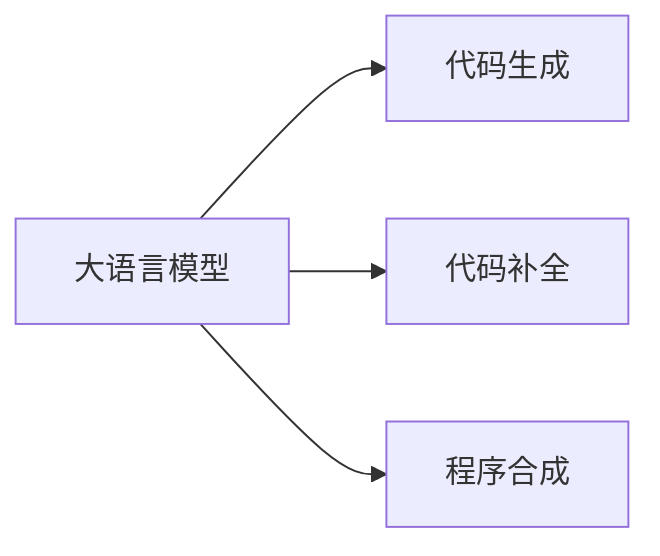

# 大语言模型应用指南：执行Python代码

## 1. 背景介绍
### 1.1 问题的由来
随着人工智能技术的飞速发展，大语言模型（Large Language Models，LLMs）已经成为自然语言处理领域的研究热点。大语言模型具有强大的语言理解和生成能力，能够完成多种自然语言处理任务，如文本分类、问答、摘要、翻译等。然而，大语言模型在执行代码方面的能力还有待进一步探索和提升。

### 1.2 研究现状 
目前，已经有一些研究尝试通过大语言模型来执行代码。比如，OpenAI的Codex模型[1]可以根据自然语言描述生成对应的Python代码。DeepMind的AlphaCode[2]可以自动编写竞赛级别的Python和C++代码。微软的InCoder[3]可以根据代码上下文自动补全代码。这些研究表明，大语言模型在代码生成和补全方面已经取得了一定的进展。

### 1.3 研究意义
探索大语言模型执行Python代码的能力，对于推动人工智能在编程领域的应用具有重要意义：

1. 提高编程效率：大语言模型可以根据自然语言描述自动生成代码，减少程序员的编码工作量，提高开发效率。
2. 降低编程门槛：通过自然语言与大语言模型交互，非专业人士也能编写简单的程序，降低编程学习门槛。  
3. 辅助程序调试：大语言模型可以理解代码逻辑并给出修改建议，辅助程序员快速定位和修复bug。
4. 支持智能编程：大语言模型与集成开发环境（IDE）结合，可以实现代码自动补全、错误提示等智能编程辅助功能。

### 1.4 本文结构
本文将围绕大语言模型执行Python代码这一主题，介绍相关的核心概念、算法原理、数学模型、代码实例以及实际应用场景。全文结构安排如下：

第2部分：核心概念与联系  
第3部分：核心算法原理与具体操作步骤  
第4部分：数学模型和公式详细讲解与举例说明  
第5部分：项目实践 - 代码实例和详细解释说明  
第6部分：实际应用场景  
第7部分：工具和资源推荐  
第8部分：总结 - 未来发展趋势与挑战  
第9部分：附录 - 常见问题与解答

## 2. 核心概念与联系

在探讨大语言模型执行Python代码之前，我们需要了解几个核心概念：

- 大语言模型（Large Language Models）：是一类基于海量文本数据训练的神经网络模型，能够学习语言的统计规律和语义信息，具备语言理解和生成能力。代表模型有GPT系列[4]、BERT[5]、T5[6]等。

- 代码生成（Code Generation）：是指根据自然语言描述或其他形式的输入，自动生成对应的可执行代码。传统的代码生成方法主要基于模板和规则，而基于大语言模型的方法可以端到端地生成代码。

- 代码补全（Code Completion）：是指根据已有的代码上下文，自动推荐下一个合适的代码片段。代码补全可以加速编码过程，减少错误。传统的代码补全方法主要基于静态分析和启发式规则，而基于大语言模型的方法可以理解代码语义并给出更准确的补全建议。

- 程序合成（Program Synthesis）：是指根据输入输出示例或逻辑规范，自动合成满足要求的程序。大语言模型可以作为程序合成的一种实现方式，通过学习大量代码示例来掌握编程模式。

这些概念之间的联系可以用下图表示：

## 3. 核心算法原理 & 具体操作步骤
### 3.1 算法原理概述
基于大语言模型执行Python代码的核心思想是：将代码看作一种特殊的自然语言，通过在大量代码上预训练语言模型，使其学会代码的语法、语义和编程模式，从而具备代码生成和理解的能力。

具体来说，主要采用了以下技术方法：

1. 基于Transformer的语言模型：Transformer[7]是一种基于自注意力机制的神经网络结构，擅长捕捉长距离依赖关系。将Transformer用于建模代码序列，可以学习代码的上下文信息和结构特征。

2. 预训练+微调范式：先在大规模的代码数据集上预训练语言模型，学习通用的代码表示；然后在下游任务（如代码生成）的数据集上微调模型，使其适应特定任务。这种范式可以显著提升模型的泛化能力和样本效率。

3. 自回归生成：将代码生成看作一个条件语言模型问题，通过最大化当前token在给定上文下的条件概率来逐token生成代码。生成过程可以通过beam search、top-k sampling等策略来控制。 

4. 编辑器融合：将预训练的代码语言模型与代码编辑器相结合，实现代码补全、错误诊断、代码搜索等功能，打造智能编程助手。

### 3.2 算法步骤详解
下面以代码生成任务为例，详细介绍基于大语言模型执行Python代码的步骤。

输入：自然语言描述 $x$，目标代码长度 $n$
输出：生成的Python代码 $y=(y_1,\cdots,y_n)$

1. 模型选择：选择一个预训练的代码语言模型，如GPT-Neo[8]、CodeGen[9]等。

2. 输入编码：将自然语言描述 $x$ 编码为模型可以接受的输入表示 $\boldsymbol{x}=(x_1,\cdots,x_m)$，其中 $x_i$ 为第 $i$ 个token的嵌入向量。

3. 代码生成：
   
   设当前已生成的代码为 $\boldsymbol{y}_{<t}=(y_1,\cdots,y_{t-1})$，下一个token $y_t$ 的生成概率为：
   $$P(y_t|\boldsymbol{y}_{<t},\boldsymbol{x})=\text{softmax}(\boldsymbol{h}_t^\top \boldsymbol{W}_o)$$
   其中 $\boldsymbol{h}_t$ 是模型在第 $t$ 步的隐状态，$\boldsymbol{W}_o$ 是输出层的权重矩阵。

   重复以下步骤直到生成结束：
   - 根据 $P(y_t|\boldsymbol{y}_{<t},\boldsymbol{x})$ 采样或选择 $y_t$
   - 将 $y_t$ 添加到已生成的代码中，更新 $\boldsymbol{y}_{<t+1}$
   - 将 $y_t$ 输入模型，更新隐状态到 $\boldsymbol{h}_{t+1}$

4. 后处理：对生成的代码 $y$ 进行必要的后处理，如缩进、语法纠错等，得到最终的可执行Python代码。

### 3.3 算法优缺点
基于大语言模型执行Python代码的优点包括：

- 端到端生成，无需人工定义复杂的规则和模板
- 可以处理多种形式的输入，如自然语言、代码片段、输入输出示例等
- 通过在大规模数据上预训练，具有较好的泛化能力，可以生成新颖的代码
- 与编辑器结合后，可以提供智能编程辅助功能，提高开发效率

但该方法也存在一些局限性：

- 生成的代码可能存在语法错误、逻辑错误等，需要人工检查和修改
- 对于复杂的算法和系统，生成的代码质量和正确性难以保证  
- 模型训练需要大量的计算资源和高质量的代码数据，门槛较高
- 在推理阶段，生成较长的代码序列开销较大，实时性有待提高

### 3.4 算法应用领域
基于大语言模型执行Python代码的算法可以应用于以下领域：

- 智能编程助手：辅助程序员编写代码、调试程序、优化性能等
- 编程教育：初学者可以通过自然语言描述来学习编程，降低学习门槛
- 软件开发自动化：自动将需求文档转化为可执行代码，加速软件开发流程
- 代码搜索与推荐：根据代码的功能和语义，实现精准的代码搜索和推荐
- 程序修复：自动诊断和修复代码中的错误，提高软件质量

## 4. 数学模型和公式 & 详细讲解 & 举例说明
### 4.1 数学模型构建
大语言模型执行Python代码的核心是将代码建模为一个条件语言模型。给定自然语言描述 $x$，代码 $y=(y_1,\cdots,y_n)$ 的生成概率可以表示为：

$$P(y|x)=\prod_{t=1}^n P(y_t|y_{<t},x)$$

其中 $y_{<t}=(y_1,\cdots,y_{t-1})$ 表示已生成的代码序列。

条件概率 $P(y_t|y_{<t},x)$ 可以通过神经网络模型来参数化，常用的模型包括：

1. GPT模型：
$$\begin{aligned}
\boldsymbol{h}_0 &= \text{Embedding}([\boldsymbol{x};\boldsymbol{y}_{<t}]) \
\boldsymbol{h}_l &= \text{TransformerBlock}_l(\boldsymbol{h}_{l-1}), l=1,\cdots,L \  
P(y_t|\boldsymbol{y}_{<t},\boldsymbol{x}) &= \text{softmax}(\boldsymbol{h}_L^\top \boldsymbol{W}_o)
\end{aligned}$$

其中 $[\cdot;\cdot]$ 表示拼接操作，$\text{Embedding}$ 将token映射为向量，$\text{TransformerBlock}$ 为Transformer的编码器块，$L$ 为编码器层数。

2. Seq2Seq模型：
$$\begin{aligned}
\boldsymbol{h}_t &= \text{Encoder}(\boldsymbol{x},\boldsymbol{y}_{<t}) \
P(y_t|\boldsymbol{y}_{<t},\boldsymbol{x}) &= \text{Decoder}(\boldsymbol{h}_t)
\end{aligned}$$

其中 $\text{Encoder}$ 对输入进行编码，$\text{Decoder}$ 根据编码结果生成下一个token。Encoder和Decoder可以基于RNN、Transformer等结构实现。

### 4.2 公式推导过程
以GPT模型为例，详细推导生成第 $t$ 个token $y_t$ 的条件概率 $P(y_t|y_{<t},x)$ 的计算过程。

首先，将自然语言描述 $x$ 和已生成的代码 $y_{<t}$ 拼接并编码为向量序列：

$$\boldsymbol{h}_0=\text{Embedding}([x_1,\cdots,x_m;y_1,\cdots,y_{t-1}])$$

然后，向量序列经过 $L$ 层Transformer编码器的处理：

$$\boldsymbol{h}_l=\text{TransformerBlock}_l(\boldsymbol{h}_{l-1}), l=1,\cdots,L$$

其中每个Transformer块包含多头自注意力（Multi-head Self-attention）和前馈网络（Feed-forward Network）两个子层：

$$
\begin{aligned}
\text{MultiHead}(\boldsymbol{Q},\boldsymbol{K},\boldsymbol{V}) &= \text{Concat}(\text{head}_1,\cdots,\text{head}_h)\boldsymbol{W}^O \
\text{head}_i &= \text{Attention}(\boldsymbol{Q}\boldsymbol{W}_i^Q, \boldsymbol{K}\boldsymbol{W}_i^K, \boldsymbol{V}\boldsymbol{W}_i^V) \
\text{Attention}(\boldsymbol{Q},\boldsymbol{K},\boldsymbol{V}) &= \text{softmax}(\frac{\boldsymbol{Q}\boldsymbol{K}^\top}{\sqrt{d_k}})\boldsymbol{V} \
\text{FFN}(\boldsymbol{x}) &= \max(0, \boldsymbol{x}\boldsymbol{W}_1 + \boldsymbol{b}_1)\boldsymbol{W}_2 + \boldsymbol{b}_2