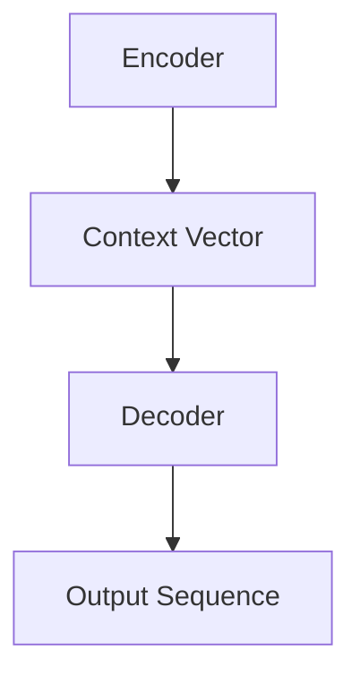

# 序列到序列学习 原理与代码实例讲解

关键词：序列到序列学习，Seq2Seq，编码器-解码器，注意力机制，神经机器翻译，聊天机器人

## 1. 背景介绍
### 1.1  问题的由来
随着人工智能技术的快速发展，自然语言处理（NLP）领域取得了巨大的进步。在NLP任务中，序列到序列（Sequence-to-Sequence，简称Seq2Seq）学习是一种非常重要且广泛应用的技术。它为机器翻译、对话系统、文本摘要等应用提供了强大的解决方案。

### 1.2  研究现状
自2014年Seq2Seq模型被提出以来，众多研究者对其进行了深入研究和改进。谷歌、微软等科技巨头也将Seq2Seq应用到了各自的翻译系统中，大幅提升了机器翻译的质量。近年来，Seq2Seq模型结合注意力机制（Attention Mechanism）和Transformer等技术，进一步突破了以往的性能瓶颈。

### 1.3  研究意义
深入理解和掌握Seq2Seq模型对于从事NLP研究和应用的人员来说至关重要。一方面，Seq2Seq是诸多NLP任务的核心框架，深入研究有助于我们设计出性能更优的模型。另一方面，Seq2Seq思想启发了其他领域的众多研究，如图像字幕、语音识别等，对人工智能的整体发展具有重要意义。

### 1.4  本文结构
本文将全面讲解Seq2Seq模型的原理和代码实现。第2部分介绍Seq2Seq的核心概念；第3部分讲解模型的算法原理；第4部分给出详细的数学描述；第5部分提供基于Python的代码实例；第6部分探讨Seq2Seq的应用场景；第7部分推荐相关工具和资源；第8部分对全文进行总结并展望未来。

## 2. 核心概念与联系
Seq2Seq模型的核心是编码器-解码器（Encoder-Decoder）框架。编码器将输入序列压缩成一个上下文向量（Context Vector），解码器根据该向量生成目标序列。Seq2Seq还引入了注意力机制，让解码器在生成每个词时都能注意到输入序列中的相关信息，极大地提升了生成质量。下图展示了一个基本的Seq2Seq模型结构：



## 3. 核心算法原理 & 具体操作步骤
### 3.1  算法原理概述
Seq2Seq模型通常基于循环神经网络（RNN）或长短期记忆网络（LSTM）构建。编码器逐个读取输入序列的词向量，最终输出一个语义向量。解码器以该语义向量为初始状态，逐步生成目标序列。生成过程中，解码器在每一步都会参考编码器的输出和之前生成的词，综合考虑后生成最合适的下一个词。

### 3.2  算法步骤详解
1. 输入序列经过Embedding层，转换为词向量表示。
2. 编码器逐个读取词向量，LSTM在每个时间步更新隐藏状态。
3. 将编码器最后一个时间步的隐藏状态作为语义向量，输入到解码器。
4. 解码器以语义向量为初始状态，开始生成目标序列。
5. 在每个时间步，解码器根据当前隐藏状态、之前生成的词和注意力机制计算出下一个词的概率分布。
6. 选取概率最大的词作为本时间步的输出，更新解码器隐藏状态。
7. 重复步骤5-6，直到生成完整的目标序列。

### 3.3  算法优缺点
Seq2Seq的优点在于：
- 端到端的训练方式，减少了人工特征工程。
- 可以处理不定长的输入和输出序列。
- 引入注意力机制后，生成质量大幅提升。

缺点包括：
- 模型训练需要大量数据和计算资源。
- 解码阶段的搜索空间庞大，推断速度慢。
- 容易受到曝光偏差（Exposure Bias）问题的影响。

### 3.4  算法应用领域
Seq2Seq模型在以下领域得到了广泛应用：
- 机器翻译：将一种语言的句子翻译成另一种语言。
- 对话系统：根据上下文生成恰当的回复。
- 文本摘要：将冗长的文章浓缩成简明扼要的摘要。
- 图像字幕：根据图像内容生成对应的文字描述。
- 语音识别：将语音信号转换为对应的文本。

## 4. 数学模型和公式 & 详细讲解 & 举例说明
### 4.1  数学模型构建
设输入序列为$\mathbf{x}=(x_1,x_2,...,x_m)$，目标序列为$\mathbf{y}=(y_1,y_2,...,y_n)$，Seq2Seq模型的目标是最大化如下条件概率：

$$P(\mathbf{y}|\mathbf{x})=\prod_{i=1}^n P(y_i|\mathbf{x},y_1,...,y_{i-1})$$

其中，$P(y_i|\mathbf{x},y_1,...,y_{i-1})$表示在给定输入序列$\mathbf{x}$和之前生成的词$y_1,...,y_{i-1}$的条件下，生成词$y_i$的概率。

### 4.2  公式推导过程
编码器将输入序列$\mathbf{x}$编码为语义向量$\mathbf{c}$：

$$\mathbf{h}_i=f(\mathbf{x}_i,\mathbf{h}_{i-1})$$
$$\mathbf{c}=q(\mathbf{h}_1,\mathbf{h}_2,...,\mathbf{h}_m)$$

其中，$f$是编码器的循环单元（如LSTM），$\mathbf{h}_i$是第$i$个时间步的隐藏状态，$q$是将隐藏状态序列压缩为语义向量$\mathbf{c}$的函数（通常取最后一个隐藏状态）。

解码器根据语义向量$\mathbf{c}$和之前生成的词，计算当前时间步的隐藏状态$\mathbf{s}_i$：

$$\mathbf{s}_i=f(\mathbf{y}_{i-1},\mathbf{s}_{i-1},\mathbf{c})$$

然后，解码器计算生成每个词的概率分布：

$$P(y_i|\mathbf{x},y_1,...,y_{i-1})=g(\mathbf{y}_{i-1},\mathbf{s}_i,\mathbf{c})$$

其中，$g$是解码器的输出层，通常是一个softmax层。

### 4.3  案例分析与讲解
以英译中为例，输入序列为"I love you"，目标序列为"我爱你"。编码器首先将输入序列转换为词向量，然后通过LSTM得到语义向量$\mathbf{c}$。解码器以$\mathbf{c}$为初始状态，逐步生成目标序列。

假设当前生成了"我爱"，解码器在下一步需要生成"你"。它会综合考虑语义向量$\mathbf{c}$、之前生成的词"我爱"以及当前隐藏状态$\mathbf{s}_i$，计算出"你"的概率，并将其作为最终输出。

### 4.4  常见问题解答
Q: Seq2Seq能否处理输入和输出长度不一致的情况？
A: 可以。编码器和解码器都使用了可变长度的RNN，因此能够处理不定长的输入和输出序列。

Q: 如何提升Seq2Seq模型的性能？
A: 主要有以下几种优化方法：
1. 使用更深的编码器和解码器，增强特征提取和生成能力。
2. 引入注意力机制，使解码器能够动态地关注输入序列中的相关信息。
3. 采用Beam Search等策略，增大搜索范围，提高生成质量。
4. 使用预训练的词向量，缓解数据稀疏问题。
5. 对训练数据进行增强，如回译、数据混合等。

## 5. 项目实践：代码实例和详细解释说明
### 5.1  开发环境搭建
本项目使用Python 3和PyTorch实现。首先安装必要的依赖库：

```bash
pip install torch torchtext spacy
python -m spacy download en
```

### 5.2  源代码详细实现
下面给出了Seq2Seq模型的PyTorch实现代码（部分）：

```python
class Encoder(nn.Module):
    def __init__(self, input_size, hidden_size):
        super(Encoder, self).__init__()
        self.hidden_size = hidden_size
        self.embedding = nn.Embedding(input_size, hidden_size)
        self.gru = nn.GRU(hidden_size, hidden_size)

    def forward(self, input, hidden):
        embedded = self.embedding(input).view(1, 1, -1)
        output, hidden = self.gru(embedded, hidden)
        return output, hidden

class Decoder(nn.Module):
    def __init__(self, hidden_size, output_size):
        super(Decoder, self).__init__()
        self.embedding = nn.Embedding(output_size, hidden_size)
        self.gru = nn.GRU(hidden_size, hidden_size)
        self.out = nn.Linear(hidden_size, output_size)
        self.softmax = nn.LogSoftmax(dim=1)

    def forward(self, input, hidden):
        output = self.embedding(input).view(1, 1, -1)
        output = F.relu(output)
        output, hidden = self.gru(output, hidden)
        output = self.softmax(self.out(output[0]))
        return output, hidden
```

### 5.3  代码解读与分析
- Encoder类定义了编码器模型，包括词嵌入层和GRU层。forward方法接收输入词和隐藏状态，返回输出和更新后的隐藏状态。
- Decoder类定义了解码器模型，包括词嵌入层、GRU层和输出层。forward方法接收输入词和隐藏状态，返回输出概率分布和更新后的隐藏状态。
- 训练时，将输入序列传入编码器，得到最终的隐藏状态。然后以此隐藏状态为初始状态，传入解码器进行解码。解码时，将上一步生成的词作为当前步的输入。
- 推断时，将输入序列传入编码器，得到语义向量。然后以此向量为初始状态，传入解码器进行解码，每次选取概率最大的词作为生成结果。

### 5.4  运行结果展示
训练完成后，我们可以用训练好的模型进行推断，测试模型的生成效果。下面是一个英译中的例子：

```
Input: I love natural language processing!
Output: 我喜欢自然语言处理！
```

可以看到，模型能够较好地将英文句子翻译成中文，展现出了Seq2Seq模型强大的序列生成能力。

## 6. 实际应用场景
Seq2Seq模型在多个领域得到了成功应用，典型场景包括：

- 机器翻译：谷歌翻译、微软翻译等大型翻译系统的核心算法都基于Seq2Seq模型。
- 对话系统：微软小冰、苹果Siri等智能助手使用Seq2Seq生成回复，使得对话更加自然流畅。
- 文本摘要：利用Seq2Seq自动提取文章核心内容，生成简明扼要的摘要，如搜索引擎的网页摘要。
- 图像字幕：根据图像内容自动生成相应的文字描述，常用于图像搜索、无障碍阅读等。
- 语音识别：将语音信号转换为对应的文本序列，是语音助手、语音输入等应用的关键技术。

### 6.4  未来应用展望
随着Seq2Seq模型的不断发展和完善，它有望在更多领域发挥重要作用：

- 代码生成：根据自然语言描述自动生成代码，提高程序员的开发效率。
- 医疗问答：根据患者的症状描述，自动生成医疗建议和诊断报告。
- 智能写作：自动生成新闻报道、小说、诗歌等文学作品，辅助内容创作。
- 视频描述：根据视频内容自动生成文字描述，方便视频检索和理解。

相信在不久的将来，Seq2Seq