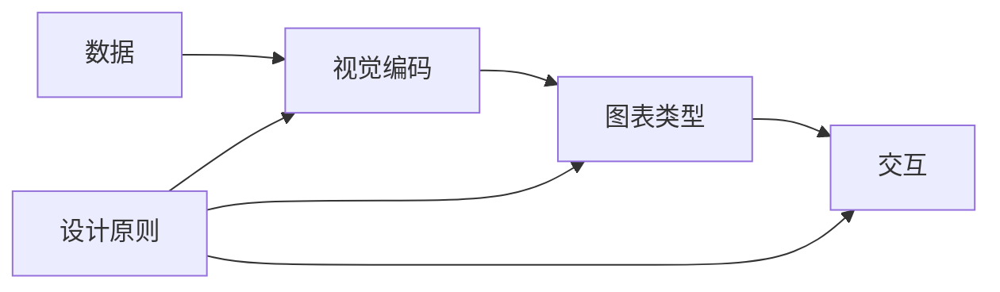

# 数据可视化 原理与代码实例讲解

作者：禅与计算机程序设计艺术 / Zen and the Art of Computer Programming

## 1. 背景介绍

### 1.1 问题的由来

在当今大数据时代,我们每天都在产生和接收海量的数据信息。然而,以表格、文本等形式呈现的原始数据往往难以被人们快速理解和洞察其内在规律。数据可视化应运而生,它通过图形化的方式将数据转化为直观、易于理解的可视化图表,帮助人们更好地分析和洞察数据。

### 1.2 研究现状

数据可视化已成为大数据分析领域的重要分支。目前业界和学界都在数据可视化技术和应用上投入了大量研究。各种数据可视化工具和库层出不穷,如D3.js、Echarts、Tableau等。同时,数据可视化在商业智能、科学研究、新闻传媒、数字营销等领域得到广泛应用。

### 1.3 研究意义

研究数据可视化有助于我们从海量复杂数据中快速提取有价值的信息和洞见,为数据驱动的科学决策提供支持。此外,通过对数据可视化原理和实现方法的深入剖析,我们可以设计开发出更加高效、美观、创新的可视化作品,推动数据可视化技术的发展。

### 1.4 本文结构

本文将从以下几个方面展开探讨数据可视化:

1. 介绍数据可视化的核心概念与关键技术
2. 剖析数据可视化的算法原理和具体实现步骤
3. 讲解数据可视化常用的数学模型和公式
4. 通过代码实例和项目实践演示可视化方案
5. 总结数据可视化的应用场景和发展趋势
6. 分享数据可视化的学习资源和开发工具

## 2. 核心概念与联系

数据可视化的核心概念包括:

- 数据:可视化的原材料,包括结构化、非结构化数据
- 视觉编码:将数据映射为视觉元素(位置、大小、颜色、形状等)的过程
- 图表类型:根据数据特点和分析目的选择合适的图表表达,如折线图、散点图、饼图、地图等
- 交互:允许用户与可视化图表进行交互操作,如缩放、平移、筛选、高亮等
- 设计原则:遵循一定的设计原则,如清晰、准确、美观、创新等,增强可视化的表达力和有效性

下图展示了数据可视化各个核心概念之间的关联:



## 3. 核心算法原理 & 具体操作步骤

### 3.1 算法原理概述

数据可视化常用的算法包括布局算法、图形绘制算法、数据处理算法等。

- 布局算法:将数据映射到二维或三维空间的位置上,如力导向布局、树形布局、圆形布局等
- 图形绘制算法:将数据点连接成线、绘制成多边形等图形,如线段绘制、B样条曲线、Voronoi图等
- 数据处理算法:对原始数据进行加工处理,如排序、聚类、降维、异常检测等

### 3.2 算法步骤详解

以力导向布局算法为例,其具体步骤如下:

1. 为数据点初始化随机位置
2. 计算数据点之间的斥力(用库仑公式)
3. 计算相连数据点之间的引力(用胡克定律)
4. 每个点受到的合力=所有斥力+所有引力
5. 根据合力的方向和大小更新点的位置
6. 重复2-5直到达到平衡状态(合力趋于0)或达到最大迭代次数

### 3.3 算法优缺点

力导向布局的优点是:
- 能展示数据内在结构和聚类关系
- 可以处理复杂网络数据
- 布局灵活,可加入更多约束

缺点是:
- 计算量大,复杂度高
- 初始状态影响收敛效果
- 难以精准控制节点位置

### 3.4 算法应用领域

力导向布局在关系网络可视化中应用广泛,如社交网络、企业关系网、知识图谱等。

## 4. 数学模型和公式 & 详细讲解 & 举例说明

### 4.1 数学模型构建

数据可视化常用的数学模型有:

- 向量/矩阵模型:将数据表示为高维向量或矩阵,如文档-词频矩阵
- 图模型:用节点表示对象,边表示关系,如关系网络
- 流形模型:假设高维数据分布在低维流形上,如瑞士卷

### 4.2 公式推导过程

以t-SNE降维算法为例,其核心公式为:

$$
p_{j|i} = \frac{\exp(-\|x_i-x_j\|^2/2\sigma_i^2)}{\sum_{k\neq i} \exp(-\|x_i-x_k\|^2/2\sigma_i^2)}
$$

$$
q_{ij} = \frac{(1+\|y_i-y_j\|^2)^{-1}}{\sum_{k\neq l}(1+\|y_k-y_l\|^2)^{-1}}
$$

其中,$p_{j|i}$表示数据点$x_j$在给定$x_i$的条件下的条件概率,$q_{ij}$是低维空间中点$y_i$和$y_j$的相似度。

t-SNE通过最小化两个分布的KL散度来寻找最优的低维映射:

$$
\min KL(P||Q) = \sum_i \sum_j p_{ij} \log \frac{p_{ij}}{q_{ij}}
$$

### 4.3 案例分析与讲解

下图展示了用t-SNE对手写数字数据集进行降维可视化的效果:


可以看出,t-SNE很好地保持了数据的内在结构,将不同类别的数字分离开来,同类数字聚集在一起。这为我们直观理解高维数据提供了便利。

### 4.4 常见问题解答

1. t-SNE的优缺点是什么?
- 优点:非线性映射,更好还原数据内在结构;可视化效果直观
- 缺点:计算复杂度高;需要调参;只适合少量数据

2. t-SNE如何选择perplexity参数?
- perplexity可理解为t-SNE关注的近邻数
- 建议取值在5到50之间,可以多尝试几个值,对比效果

## 5. 项目实践：代码实例和详细解释说明

### 5.1 开发环境搭建

本项目使用D3.js进行数据可视化开发,需要准备以下环境:

- 浏览器:Chrome、Firefox等现代浏览器
- 代码编辑器:VSCode、Sublime等
- Web服务器:http-server、live-server等
- D3.js:https://d3js.org/

### 5.2 源代码详细实现

下面以一个简单的力导向图为例,展示D3.js实现数据可视化的代码:

```html
<!DOCTYPE html>
<html>
<head>
  <title>力导向图</title>
  <script src="https://d3js.org/d3.v6.min.js"></script>
</head>
<body>
  <svg width="500" height="400"></svg>
  <script>
    const svg = d3.select("svg");
    const width = svg.attr("width");
    const height = svg.attr("height");

    const data = {
      nodes: [
        {id: 1, name: "A"},
        {id: 2, name: "B"},
        {id: 3, name: "C"},
        {id: 4, name: "D"}
      ],
      links: [
        {source: 1, target: 2},
        {source: 1, target: 3},
        {source: 2, target: 4}
      ]
    };

    const simulation = d3.forceSimulation(data.nodes)
      .force("link", d3.forceLink(data.links).id(d => d.id))
      .force("charge", d3.forceManyBody())
      .force("center", d3.forceCenter(width/2, height/2));

    const link = svg.append("g")
      .selectAll("line")
      .data(data.links)
      .join("line")
      .attr("stroke", "#999")
      .attr("stroke-width", 1);

    const node = svg.append("g")
      .selectAll("circle")
      .data(data.nodes)
      .join("circle")
      .attr("r", 10)
      .attr("fill", "steelblue")
      .call(drag(simulation));

    const label = svg.append("g")
      .selectAll("text")
      .data(data.nodes)
      .join("text")
      .text(d => d.name)
      .attr("text-anchor", "middle")
      .attr("fill", "white")
      .attr("dy", 4);

    simulation.on("tick", () => {
      link
        .attr("x1", d => d.source.x)
        .attr("y1", d => d.source.y)
        .attr("x2", d => d.target.x)
        .attr("y2", d => d.target.y);

      node
        .attr("cx", d => d.x)
        .attr("cy", d => d.y);

      label
        .attr("x", d => d.x)
        .attr("y", d => d.y);
    });

    function drag(simulation){
      function dragstarted(event, d) {
        if (!event.active) simulation.alphaTarget(0.3).restart();
        d.fx = d.x;
        d.fy = d.y;
      }

      function dragged(event, d) {
        d.fx = event.x;
        d.fy = event.y;
      }

      function dragended(event, d) {
        if (!event.active) simulation.alphaTarget(0);
        d.fx = null;
        d.fy = null;
      }

      return d3.drag()
        .on("start", dragstarted)
        .on("drag", dragged)
        .on("end", dragended);
    }
  </script>
</body>
</html>
```

### 5.3 代码解读与分析

上述代码主要步骤如下:

1. 创建一个SVG画布
2. 准备节点和边数据
3. 创建力仿真器,设置各种力
4. 绘制边、节点、标签
5. 监听仿真器的tick事件,更新元素位置
6. 实现交互功能,允许拖拽节点

D3.js的数据驱动思想贯穿始终,通过将数据绑定到DOM元素,再使用D3提供的丰富的图形语法和布局算法,即可快速实现数据可视化。

### 5.4 运行结果展示

在浏览器中打开上述HTML文件,可以看到一个简单的力导向图,支持节点拖拽交互:


## 6. 实际应用场景

数据可视化在各行各业中都有广泛应用,例如:

- 商业智能:销售数据分析、用户行为分析等
- 金融风控:股票走势、风险预警等
- 城市管理:交通流量监测、人口分布统计等
- 医疗健康:疾病趋势、药物研发等
- 社交媒体:话题传播、情感分析等

### 6.4 未来应用展望

随着大数据、人工智能技术的发展,数据可视化也面临新的机遇和挑战:

- 实时动态可视化:应对快速变化的流数据
- 智能可视分析:利用机器学习自动生成洞见
- 沉浸式可视化:通过VR/AR等技术增强体验
- 个性化可视化:根据用户特点生成定制视图

## 7. 工具和资源推荐

### 7.1 学习资源推荐

- 《数据可视化实战》:系统讲解可视化理论和实践
- "D3 in Depth"系列教程:由浅入深学习D3.js
- 《Visualization Analysis and Design》:可视化设计的理论基础
- 《The Visual Display of Quantitative Information》:数据可视化经典之作

### 7.2 开发工具推荐

- D3.js:最流行的JavaScript可视化库
- Echarts:百度出品的开源可视化库
- Tableau:商业分析和可视化软件
- Processing:可视化艺