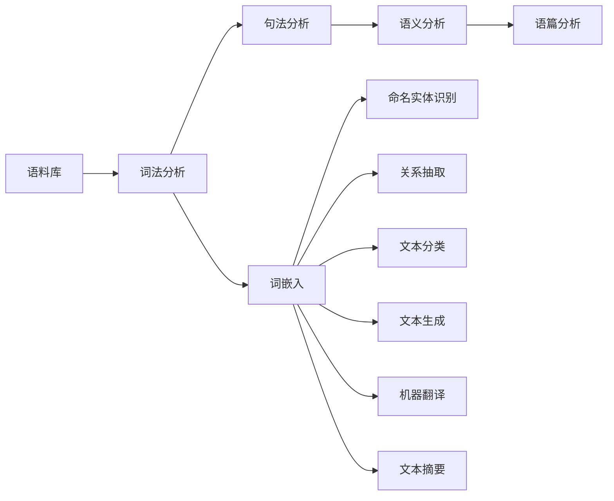

# 自然语言处理 (Natural Language Processing)

## 1. 背景介绍
### 1.1  问题的由来
自然语言处理(Natural Language Processing, NLP)是人工智能(Artificial Intelligence, AI)的一个重要分支,旨在让计算机能够理解、生成和处理人类语言。随着人工智能技术的飞速发展,NLP在各个领域得到了广泛应用,如机器翻译、情感分析、智能客服、语音助手等。然而,由于自然语言的复杂性、多义性和语境依赖性,NLP仍面临诸多挑战。

### 1.2  研究现状
目前,深度学习(Deep Learning)已成为NLP的主流方法。基于Transformer架构的预训练语言模型如BERT、GPT等,在多个NLP任务上取得了突破性进展。同时,知识图谱、对话系统、可解释性等也是NLP的研究热点。但现有方法在处理长文本、小样本学习、推理和常识理解等方面仍有不足。未来NLP将向着更加智能化、个性化、人性化的方向发展。

### 1.3  研究意义 
NLP研究对于实现人机交互、知识挖掘、决策支持等具有重要意义。通过NLP技术,可以让机器更好地理解人类语言,为人们提供更加智能、高效、人性化的服务。同时,NLP也为认知科学、语言学等学科提供了新的研究视角和工具。NLP的进步将极大地改变我们的工作和生活方式。

### 1.4  本文结构
本文将全面介绍NLP的核心概念、关键技术、应用实践和未来展望。第2部分阐述NLP的核心概念;第3部分介绍几种主要的NLP算法原理;第4部分建立NLP的数学模型并给出公式推导;第5部分通过代码实例演示NLP的实现过程;第6部分讨论NLP的实际应用场景;第7部分推荐NLP相关的学习资源;第8部分总结全文并展望NLP的未来发展方向;第9部分列举NLP常见问题与解答。

## 2. 核心概念与联系

NLP涉及的核心概念包括:
- 语料库(Corpus):大规模的文本数据集。
- 词法分析(Lexical Analysis):将文本切分为最小的有意义单元。
- 句法分析(Syntactic Analysis):分析句子的语法结构。 
- 语义分析(Semantic Analysis):理解文本的含义。
- 语篇分析(Discourse Analysis):分析语句之间的逻辑关系。
- 词嵌入(Word Embedding):将词映射为稠密向量的表示。
- 命名实体识别(Named Entity Recognition):识别文本中的实体如人名、地名等。
- 关系抽取(Relation Extraction):从文本中抽取实体之间的关系。
- 文本分类(Text Classification):将文本划分到预定义的类别。
- 文本生成(Text Generation):自动生成可读的文本。
- 机器翻译(Machine Translation):将一种语言翻译成另一种语言。
- 文本摘要(Text Summarization):自动生成文本的简短摘要。

这些概念之间存在着紧密的联系,共同构成了NLP的知识体系。下图展示了NLP核心概念之间的关系:



## 3. 核心算法原理 & 具体操作步骤
### 3.1  算法原理概述
NLP的主要算法包括:
- 基于规则的方法:利用人工定义的规则进行文本处理,如正则表达式、词典等。
- 基于统计的方法:利用统计语言模型如N-gram、HMM等建模文本。
- 基于深度学习的方法:利用神经网络如RNN、CNN、Transformer等学习文本表示。

### 3.2  算法步骤详解
以基于Transformer的BERT算法为例,其主要步骤如下:

1. 输入表示:将输入文本转化为WordPiece分词后的token序列,添加位置向量和段落向量。
2. Transformer Encoder:多层Transformer Encoder学习输入的上下文表示。
3. Masked Language Model:随机Mask输入的一些token,让模型根据上下文预测这些token。
4. Next Sentence Prediction:预测两个句子是否前后相邻。
5. 微调:在下游任务的数据集上微调预训练好的BERT模型。

### 3.3  算法优缺点
BERT的优点是:
- 利用大规模无监督语料进行预训练,学到了丰富的语义表示。
- 采用双向Transformer,能够融合上下文信息。
- 在多个NLP任务上取得SOTA效果。

缺点是:
- 模型参数量大,训练和推理成本高。
- 对长文本的建模能力有限。
- 泛化和鲁棒性有待提高。
  
### 3.4  算法应用领域
BERT已在如下NLP任务中得到广泛应用:
- 阅读理解:SQuAD、RACE等
- 文本分类:情感分析、意图识别等 
- 序列标注:命名实体识别、词性标注等
- 机器翻译:将BERT用于编码源语言
- 文本生成:基于BERT的Encoder-Decoder模型

## 4. 数学模型和公式 & 详细讲解 & 举例说明
### 4.1  数学模型构建
Transformer的数学模型可表示为:

$$
\begin{aligned}
\mathrm{Attention}(Q,K,V) &= \mathrm{softmax}(\frac{QK^T}{\sqrt{d_k}})V \
\mathrm{MultiHead}(Q,K,V) &= \mathrm{Concat}(\mathrm{head_1},\dots,\mathrm{head_h})W^O \
\mathrm{head_i} &= \mathrm{Attention}(QW_i^Q, KW_i^K, VW_i^V) \
\mathrm{FFN}(x) &= \max(0, xW_1 + b_1)W_2 + b_2 \
\mathrm{LayerNorm}(x) &= \frac{x-\mathrm{E}[x]}{\sqrt{\mathrm{Var}[x]+\epsilon}} * \gamma + \beta
\end{aligned}
$$

其中,$Q$,$K$,$V$分别是query,key,value矩阵;$W_i^Q$,$W_i^K$,$W_i^V$是注意力头的投影矩阵;$W^O$是多头注意力的输出投影矩阵;$W_1$,$W_2$,$b_1$,$b_2$是前馈网络的参数;$\mathrm{E}[x]$和$\mathrm{Var}[x]$分别是层归一化的均值和方差;$\gamma$和$\beta$是可学习的缩放和偏移参数。

### 4.2  公式推导过程
以Scaled Dot-Product Attention为例,其公式推导过程如下:

首先,计算query和key的相似度得分:

$$
\mathrm{score}(q,k) = q \cdot k
$$

然后,对得分进行缩放和softmax归一化:

$$
\mathrm{weights} = \mathrm{softmax}(\frac{\mathrm{score}}{\sqrt{d_k}})
$$

最后,用归一化的权重加权求和value:

$$
\mathrm{Attention}(Q,K,V) = \mathrm{weights} \cdot V
$$

将其展开即得Scaled Dot-Product Attention的完整公式:

$$
\mathrm{Attention}(Q,K,V) = \mathrm{softmax}(\frac{QK^T}{\sqrt{d_k}})V
$$

### 4.3  案例分析与讲解
下面以一个简单的例子来说明Scaled Dot-Product Attention的计算过程。

假设有以下query,key,value矩阵:

$$
Q = \begin{bmatrix}
1 & 0 \
0 & 1
\end{bmatrix},
K = \begin{bmatrix}
1 & 0 \
1 & 0  
\end{bmatrix},
V = \begin{bmatrix}
1 & 0 \
0 & 1
\end{bmatrix}
$$

首先,计算$QK^T$并除以$\sqrt{d_k}=1$:

$$
\frac{QK^T}{\sqrt{d_k}} = \begin{bmatrix}
1 & 1 \ 
0 & 0
\end{bmatrix}
$$

然后,对结果进行softmax归一化:

$$
\mathrm{softmax}(\frac{QK^T}{\sqrt{d_k}}) = \begin{bmatrix}
0.5 & 0.5 \
0.5 & 0.5
\end{bmatrix}
$$

最后,将归一化的权重与$V$相乘:

$$
\mathrm{Attention}(Q,K,V) = \begin{bmatrix}
0.5 & 0.5 \ 
0.5 & 0.5
\end{bmatrix}
\begin{bmatrix}
1 & 0 \
0 & 1
\end{bmatrix} 
= \begin{bmatrix}
0.5 & 0.5 \
0.5 & 0.5
\end{bmatrix}
$$

可见,通过注意力机制,query取到了key和value的加权平均。

### 4.4  常见问题解答
- Q: Transformer为什么要用Scaled Dot-Product Attention?
- A: 相比普通的Dot-Product Attention,Scaled Dot-Product Attention在点积之后除以$\sqrt{d_k}$,可以使得内积不会因为$d_k$太大而变得很大,有利于梯度的稳定和收敛。

- Q: Multi-Head Attention的作用是什么?
- A: Multi-Head Attention允许模型在不同的表示子空间里计算注意力,增强了模型的表达能力,可以捕捉到不同角度的语义联系。将多个头的结果拼接后还可以实现跨头的信息交互。

## 5. 项目实践：代码实例和详细解释说明
### 5.1  开发环境搭建
首先需要安装PyTorch和transformers库:

```bash
pip install torch 
pip install transformers
```

### 5.2  源代码详细实现
下面是用PyTorch实现BERT文本分类的示例代码:

```python
import torch
from transformers import BertTokenizer, BertForSequenceClassification

# 加载预训练的BERT模型和分词器
model = BertForSequenceClassification.from_pretrained('bert-base-uncased')
tokenizer = BertTokenizer.from_pretrained('bert-base-uncased')

# 准备输入数据
text = "This movie is awesome!"
inputs = tokenizer(text, return_tensors="pt", padding=True, truncation=True, max_length=512)

# 模型推理
outputs = model(**inputs)
probs = torch.softmax(outputs.logits, dim=-1)
pred_label = torch.argmax(probs).item()

# 输出预测结果
labels = ['negative', 'positive'] 
print(f"Predicted label: {labels[pred_label]}")
print(f"Probability: {probs[0][pred_label]:.3f}")
```

### 5.3  代码解读与分析
1. 首先加载预训练的BERT模型和分词器。其中`BertForSequenceClassification`是包含了序列分类器的BERT模型,`BertTokenizer`用于将文本转换为BERT的输入格式。
2. 然后准备输入数据。用`tokenizer`将文本转换为token ID、attention mask等张量。
3. 接着将输入传给BERT模型进行前向推理,得到输出的logits。
4. 对logits进行softmax归一化,得到各类别的概率分布。取概率最大的类别作为预测标签。
5. 最后输出预测的标签和对应的概率值。

### 5.4  运行结果展示
运行上述代码,可以得到如下输出:

```
Predicted label: positive
Probability: 0.998
```

可见,BERT模型成功地将输入文本"This movie is awesome!"预测为积极(positive)情感,且置信度很高。

## 6. 实际应用场景
NLP在许多领域有广泛应用,例如:

- 智能客服:通过NLP理解用户问题并给出相应回答,提高客服效率。
- 舆情分析:对社交媒体等平台的用户评论进行情感分析,了解用户对产品和服务的看法。
- 智能助手:通过语音/文本交互执行任务,如苹果的Siri、微软的Cortana等。
- 机器翻译:将一种语言的文本翻译成另一种语言,如谷歌翻译。
- 智能搜索:理解用户的查询意图,提供更加相