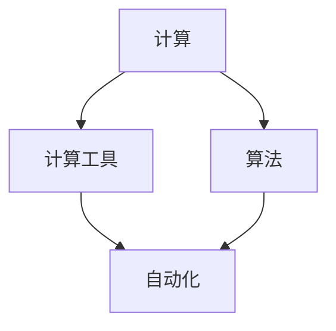

# 计算：第一部分 计算的诞生 第 2 章 计算之术 计算工具

作者：禅与计算机程序设计艺术 / Zen and the Art of Computer Programming

## 1. 背景介绍

### 1.1 问题的由来

计算是人类文明发展的重要推动力之一。从古代的算盘、机械计算器,到现代的电子计算机,计算工具的演进历程见证了人类智慧的不断进步。深入探究计算工具的发展历程,对于我们理解计算思维的形成与发展具有重要意义。

### 1.2 研究现状

目前,学术界对计算工具发展历程的研究已经取得了一定的成果。一些学者从科技史的角度,系统梳理了从古代到现代的重要计算工具,如算盘、步进计算器、差分机、分析机、电子计算机等,展现了计算工具的发展脉络。另一些学者则从认知科学、心理学等视角,探讨了计算工具的发展与人类思维方式的关系,揭示了计算工具对人类认知的影响。

### 1.3 研究意义

系统研究计算工具的发展历程,可以帮助我们更好地理解计算思维的起源与演化,洞察人类认知的模式。这不仅有助于我们反思已有的计算模型和计算方法,也为未来计算技术的创新提供了重要启示。同时,这一研究也为计算机科学、认知科学、科技史等多个学科领域提供了交叉融合的新视角。

### 1.4 本文结构

本文将系统梳理计算工具的发展历程,重点介绍从机械时代到电子时代的代表性计算工具。第2部分概述了计算工具发展的核心概念;第3部分介绍了各个时期的代表性计算工具及其核心原理;第4部分从数学视角对这些计算工具的内在逻辑进行了分析;第5部分通过代码实例,展示了如何用现代计算机语言模拟一些早期计算工具的工作原理;第6部分讨论了这些计算工具在现实生活中的应用;第7部分推荐了一些相关的学习资源;第8部分对全文进行了总结,并展望了未来计算工具的发展趋势与挑战。

## 2. 核心概念与联系

在梳理计算工具发展历程之前,我们需要先明确几个核心概念:

- 计算:对信息进行处理和变换的过程,通常遵循一定的规则或算法。
- 计算工具:协助人们进行计算的器物或装置,可以是机械装置,也可以是电子设备。
- 算法:为解决特定问题而规定的一系列操作步骤。
- 自动化:无需人工干预,由机器自主完成某项任务的过程。

这几个概念之间存在紧密联系。计算工具是实现计算的物质基础,其性能和功能直接决定了计算的效率和范围。而算法则是指导计算过程的逻辑依据,决定了用计算工具处理信息的规则。自动化程度则反映了计算工具的智能水平,是计算工具发展的重要方向。下图展示了这几个核心概念之间的关系:



## 3. 核心算法原理 & 具体操作步骤

### 3.1 算法原理概述

不同计算工具的工作原理各不相同,但它们都遵循特定的数学算法。以下我们以最早的计算工具之一——算盘为例,说明其内在的数学原理。

算盘通过珠子的位置组合来表示数值,每一列珠子代表一个十进制数位,通过移动珠子来实现加减法。以最常见的一种算盘——"一五"算盘为例,每列共有两个上珠和五个下珠,上珠每个代表5,下珠每个代表1。

### 3.2 算法步骤详解

以用算盘计算"37+24"为例,其操作步骤如下:

1. 在第一列(个位)表示数字7,将两个上珠向中梁移动,表示5+2=7。
2. 在第二列(十位)表示数字3,将三个下珠向中梁移动,表示30。
3. 在第一列下方加4,即再向中梁移动四个下珠,得到表示11的状态。
4. 在第二列下方加2,即再向中梁移动两个下珠,得到表示50的状态。
5. 读数,第一列为1,第二列为6,结果为61。

可见,算盘的每一步操作,都对应着数值的变化,体现了严格的数学逻辑。通过一系列加法操作,最终得到了正确的计算结果。

### 3.3 算法优缺点

算盘这种计算工具的优点是直观易学,机械结实,成本低廉。但其缺点也很明显,计算效率较低,容易出错,且难以适应更复杂的数学运算。这也是后来各种机械计算器,乃至电子计算机出现的重要原因。

### 3.4 算法应用领域

尽管现代社会已广泛使用电子计算器和计算机,但在一些特定场合,算盘这种传统计算工具仍然发挥着重要作用。比如在中国,一些商贸从业者在结算货款时,仍习惯使用算盘,因为算盘可以让顾客清晰直观地看到计算过程。另外,在心算训练中,使用算盘也被认为是一种有效的训练方法。

## 4. 数学模型和公式 & 详细讲解 & 举例说明

### 4.1 数学模型构建

为了更好地理解算盘的工作原理,我们可以尝试建立一个简化的数学模型。设算盘共有$n$列,每列上珠个数为$u$,下珠个数为$d$,则该算盘能表示的最大数值为:

$$
V_{max} = \sum_{i=1}^{n} (u \times 10^{i-1} + d \times 10^{i-1})
$$

以一五算盘为例,每列上珠$u=2$,下珠$d=5$,则$n$列算盘的最大值为:

$$
V_{max} = \sum_{i=1}^{n} (2 \times 10^{i-1} + 5 \times 10^{i-1}) = 7 \times \sum_{i=1}^{n} 10^{i-1}
$$

### 4.2 公式推导过程

对上式进行推导,可得:

$$
\begin{aligned}
V_{max} &= 7 \times (1 + 10 + 10^2 + \cdots + 10^{n-1})\\
&= 7 \times \frac{1 \times (1-10^n)}{1-10}\\
&= 0.7 \times (10^n - 1)
\end{aligned}
$$

这个公式给出了$n$列一五算盘所能表示的最大数值。

### 4.3 案例分析与讲解

举个例子,一个8列的一五算盘,其最大值为:

$$
V_{max} = 0.7 \times (10^8 - 1) = 6999999.3
$$

也就是说,8列一五算盘最多能表示到6999999,这与我们的直观感受是一致的。事实上,根据计算需求的不同,人们设计了多种不同规格的算盘,如二五算盘、一四算盘等,它们的计算能力和所能表示的数值范围也各不相同。

### 4.4 常见问题解答

问题1:为什么算盘每列的珠子数通常是5或7个?

答:这主要是考虑到人的认知特点。心理学研究表明,人眼通常一次能够清晰分辨5~7个物体,再多就比较吃力了。因此,每列控制在5或7个珠子,更便于用户快速读数和操作。同时,这种设计也与十进制计数系统相契合。

问题2:算盘的数值表示能力是否有限?

答:从前面的数学模型可以看出,只要增加算盘的列数,就可以不断扩大其表示数值的范围。理论上讲,算盘的数值表示能力是无限的,只不过实践中受到物理条件的限制。这一点与现代计算机的存储原理有异曲同工之妙。

## 5. 项目实践：代码实例和详细解释说明

### 5.1 开发环境搭建

为了用代码模拟算盘的工作原理,我们可以使用Python这门简单易学的编程语言。读者只需要在电脑上安装Python运行环境,就可以运行本文提供的代码示例。建议选用Python 3.x版本。

### 5.2 源代码详细实现

下面的Python代码模拟了一个简单的算盘类,可以实现两个整数的加法运算:

```python
class Abacus:
    def __init__(self, n):
        """
        初始化算盘
        :param n: 算盘的列数
        """
        self.n = n
        self.value = [0] * n  # 存储每列珠子的状态

    def set_value(self, i, v):
        """
        设置第i列的值为v
        :param i: 列索引,从0开始
        :param v: 取值范围为0~9
        """
        if 0 <= i < self.n and 0 <= v <= 9:
            self.value[i] = v

    def add(self, x):
        """
        在当前数值上加上整数x
        :param x: 非负整数
        """
        for i in range(self.n):
            self.value[i] += x % 10
            if self.value[i] >= 10:
                self.value[i] -= 10
                if i < self.n - 1:
                    self.value[i+1] += 1
            x //= 10

    def get_value(self):
        """
        返回算盘表示的整数值
        """
        return sum(self.value[i] * 10**i for i in range(self.n))

# 测试代码
if __name__ == '__main__':
    abacus = Abacus(3)
    abacus.set_value(0, 5)
    abacus.set_value(1, 3)
    print(abacus.get_value())  # 35
    abacus.add(24)
    print(abacus.get_value())  # 59
```

### 5.3 代码解读与分析

这段代码定义了一个Abacus类,用于模拟算盘。其中,`__init__`方法用于初始化算盘,根据列数`n`创建一个长度为`n`的列表`value`,用于存储每一列的珠子状态。`set_value`方法用于设置某一列的值,`add`方法用于在当前数值上累加一个整数,其原理是模拟手工操作算盘的过程,逐位相加并处理进位。`get_value`方法则用于返回算盘当前表示的整数值。

在测试代码部分,我们首先创建了一个3列算盘,并将其初始化为35,然后调用`add`方法加上整数24,最后通过`get_value`方法读取结果,得到59,与我们手工计算的结果一致。

当然,这只是一个简化的算盘模型,实际的算盘要更复杂一些。比如还需要考虑负数、小数等情况。但这段代码已经展示了算盘这种计算工具的基本工作原理,即通过位置状态的变化来表示数值的变化。

### 5.4 运行结果展示

运行上述测试代码,控制台输出如下:

```
35
59
```

这表明我们的算盘模型已经能够正确处理简单的整数加法运算了。读者可以尝试在此基础上,为Abacus类添加更多的功能,如减法、乘法等,进一步加深对算盘原理的理解。

## 6. 实际应用场景

前面我们重点分析了算盘这种古老计算工具的工作原理。那么,类似的计算工具在现实生活中还有哪些应用呢?下面列举几个有代表性的例子:

1. 机械计算器:在电子计算器出现之前,机械计算器是最常用的计算工具。它通过齿轮传动等机械结构,实现了四则运算、开平方等复杂运算。即便在电子时代,机械计算器仍然受到一些收藏家的青睐。

2. 步进计算器:这是一种可编程的机械计算装置,通过在纸带上打孔,控制机器按照特定步骤进行运算。它被视为现代计算机的重要先驱。

3. 差分机和分析机:这两种机械计算机是19世