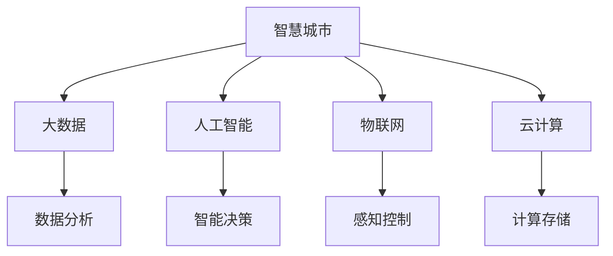

                 

# 智慧城市创业：打造未来宜居环境

## 1. 背景介绍

### 1.1 问题由来

随着科技的不断进步，智慧城市逐渐成为现代社会的重要发展方向。智慧城市指的是通过物联网、云计算、大数据、人工智能等先进技术，全面提升城市管理和服务水平，提高城市运行效率和居民生活质量。智慧城市不仅关注城市建设、管理，更着眼于城市生态环境、民生服务、公共安全等多方面，为实现宜居城市提供技术保障。

智慧城市的发展离不开技术创新和应用实践，智慧城市创业便是这场技术革命的重要推动力。创业者在智慧城市建设中，可以利用前沿技术进行城市管理和服务优化，提升城市运行效率，为居民提供更好的生活体验。从智能交通到智能安防，从智慧医疗到智慧教育，智慧城市创业的机会广泛而深入，吸引了许多创新者和投资者的目光。

### 1.2 问题核心关键点

智慧城市创业的核心关键点主要包括以下几个方面：

- 技术创新：如何利用先进技术，如人工智能、大数据、物联网等，实现城市管理和服务智能化。
- 数据整合：如何高效整合、分析和利用城市中的海量数据，提高城市管理的决策水平。
- 用户需求：如何洞察并满足城市居民多样化的需求，提升居民的幸福感和满意度。
- 商业模式：如何探索和创新商业模式，实现智慧城市的可持续发展和商业化运营。
- 跨领域合作：如何促进政府、企业、科研机构等不同领域间的合作，共同推动智慧城市建设。

### 1.3 问题研究意义

智慧城市创业对于推动智慧城市建设，具有重要意义：

1. **促进城市数字化转型**：通过智慧城市技术的应用，提升城市运行效率，优化城市资源配置，推动城市向数字化、智能化方向发展。
2. **提升居民生活质量**：通过智慧城市服务，如智能交通、智慧医疗、智能安防等，提升居民的生活便利性、安全性、健康度。
3. **促进产业创新发展**：智慧城市创业为新兴产业的发展提供了新的机遇，推动传统产业与智慧技术的融合，促进技术创新和产业升级。
4. **助力城市可持续发展**：通过智慧城市技术，优化资源使用，减少环境污染，实现绿色发展。

## 2. 核心概念与联系

### 2.1 核心概念概述

智慧城市创业的核心概念包括：

- **智慧城市**：通过物联网、云计算、大数据、人工智能等技术，提升城市管理、服务水平，实现城市智能化和信息化。
- **大数据**：指城市中产生的海量数据，包括城市基础设施、交通、公共服务、环境等数据。
- **人工智能**：通过机器学习、深度学习等技术，实现城市管理和服务智能化。
- **物联网**：通过传感器、智能设备等，实现城市各要素的互联互通。
- **云计算**：提供基础设施和平台，支持智慧城市的数据存储、计算和应用。

这些概念之间的逻辑关系可以通过以下Mermaid流程图来展示：



这个流程图展示了大智慧城市的基本架构和主要组件：

1. 智慧城市构建在数据、人工智能、物联网和云计算之上。
2. 大数据通过数据分析支持智能决策，物联网通过感知控制实现智能化管理，云计算提供计算和存储支持。

## 3. 核心算法原理 & 具体操作步骤

### 3.1 算法原理概述

智慧城市创业的算法原理主要涉及以下几个方面：

- **数据采集与处理**：通过物联网设备、智能传感器等，采集城市中的各类数据。
- **数据存储与计算**：利用云计算平台，进行数据存储和计算处理。
- **数据挖掘与分析**：通过大数据分析技术，挖掘城市数据中的有用信息，支持智能决策。
- **模型训练与预测**：利用机器学习和深度学习模型，对城市数据进行训练，进行预测和决策。

智慧城市创业的技术核心是大数据和人工智能的深度融合，其基本流程包括数据采集与处理、数据存储与计算、数据挖掘与分析和模型训练与预测。

### 3.2 算法步骤详解

智慧城市创业的算法步骤主要包括以下几个环节：

**Step 1: 数据采集与处理**
- 部署物联网设备、智能传感器，采集城市中的各类数据，如交通流量、环境污染、公共服务使用情况等。
- 对采集的数据进行预处理，包括去噪、归一化、缺失值填充等，确保数据的质量和可用性。
- 使用数据清洗工具，如Pandas、Apache Spark等，对数据进行清洗和整理。

**Step 2: 数据存储与计算**
- 利用云计算平台，如AWS、阿里云等，进行数据存储和计算处理。
- 使用分布式存储系统，如Hadoop、Ceph等，构建可靠的数据仓库，支持大规模数据存储。
- 利用分布式计算框架，如Hadoop MapReduce、Spark等，进行大规模数据处理和计算。

**Step 3: 数据挖掘与分析**
- 使用大数据分析工具，如Apache Hive、Spark、Python的Pandas库等，进行数据挖掘和分析。
- 利用机器学习算法，如K-means、决策树、随机森林等，对数据进行分类和预测。
- 使用深度学习框架，如TensorFlow、PyTorch等，构建复杂的神经网络模型，进行更深入的数据分析。

**Step 4: 模型训练与预测**
- 将处理后的数据输入到深度学习模型中进行训练，如卷积神经网络(CNN)、循环神经网络(RNN)、注意力机制模型等。
- 使用GPU/TPU等高性能计算设备，加速模型训练过程。
- 通过模型评估指标，如准确率、召回率、F1值等，评估模型性能，进行参数调优。

### 3.3 算法优缺点

智慧城市创业的算法具有以下优点：

- **智能化决策**：利用大数据和人工智能，实现城市管理的智能化决策，提高城市运行效率。
- **数据驱动**：依托于大数据分析，支持精准的城市管理和服务。
- **动态优化**：通过模型训练和预测，实现城市系统的动态优化和调整。

但同时，也存在一些缺点：

- **数据质量问题**：城市数据可能存在噪声、缺失、异构等问题，影响数据的可用性。
- **模型复杂度**：深度学习模型通常具有较高的复杂度，训练和推理成本较高。
- **安全性问题**：城市数据涉及隐私和敏感信息，需要考虑数据安全性和隐私保护。

### 3.4 算法应用领域

智慧城市创业的算法应用领域广泛，涵盖多个方面：

- **智能交通**：通过数据分析和机器学习，实现交通流量预测、智能信号灯控制、公交调度优化等。
- **智能安防**：利用视频分析、人脸识别、智能监控等技术，提升城市安防水平。
- **智慧医疗**：通过大数据分析和人工智能，实现疾病预测、智能诊疗、健康管理等。
- **智能环境监测**：利用传感器和大数据分析，监测城市环境质量，优化城市绿化和污染控制。
- **智慧教育**：通过大数据和人工智能，实现个性化教育、智能评估、在线学习等。

## 4. 数学模型和公式 & 详细讲解 & 举例说明

### 4.1 数学模型构建

智慧城市创业中的数学模型主要涉及以下几个方面：

- **线性回归模型**：用于处理连续型数据的预测问题，如交通流量预测。
- **逻辑回归模型**：用于处理分类问题的预测，如交通违规预测。
- **决策树模型**：用于处理分类和回归问题，支持特征选择和模型解释。
- **随机森林模型**：通过集成多个决策树，提升模型的稳定性和准确性。
- **卷积神经网络(CNN)**：用于图像识别和分类问题，如图像监控中的人脸识别。
- **循环神经网络(RNN)**：用于序列数据的处理和预测，如自然语言处理中的情感分析。
- **注意力机制模型**：用于处理多模态数据的融合和分析，如语音-文本交互。

### 4.2 公式推导过程

以线性回归模型为例，其基本公式为：

$$ y = \beta_0 + \beta_1x_1 + \beta_2x_2 + ... + \beta_nx_n + \epsilon $$

其中，$y$为预测值，$x_i$为特征值，$\beta_i$为特征系数，$\epsilon$为误差项。在线性回归中，模型的目标是最小化误差项$\epsilon$，即：

$$ \min_{\beta_0,\beta_1,...,\beta_n} \sum_{i=1}^N (y_i - \hat{y}_i)^2 $$

通过求解上述最小化问题，得到最优的特征系数$\beta_i$。

### 4.3 案例分析与讲解

假设我们要预测某城市中心区段的交通流量，可以收集该区域的交通数据，包括每天的车辆数量、交通拥堵程度、天气情况等。将这些数据作为特征输入到线性回归模型中，利用最小二乘法求解模型参数，得到交通流量的预测值。

## 5. 项目实践：代码实例和详细解释说明

### 5.1 开发环境搭建

在智慧城市创业中，开发环境搭建是项目成功的基础。以下是一些关键组件和工具：

- **Python**：作为智慧城市项目开发的主要编程语言，Python生态系统提供了丰富的科学计算和数据处理工具。
- **Jupyter Notebook**：用于交互式数据处理和模型验证，支持代码和数据分析的展示和分享。
- **Apache Spark**：用于大数据处理和分析，支持分布式计算和数据流处理。
- **TensorFlow**：用于深度学习模型的构建和训练，支持GPU/TPU加速。
- **AWS、阿里云等云平台**：提供云存储、云计算和云服务，支持大规模智慧城市项目开发。

### 5.2 源代码详细实现

以下是一个简单的智慧城市交通流量预测项目示例，使用Python和TensorFlow进行实现：

```python
import tensorflow as tf
import pandas as pd
from sklearn.model_selection import train_test_split
from tensorflow.keras.models import Sequential
from tensorflow.keras.layers import Dense

# 读取交通数据
data = pd.read_csv('traffic_data.csv')

# 数据预处理
X = data[['vehicle_count', 'weather_condition', 'time_of_day']]
y = data['traffic_flow']
X_train, X_test, y_train, y_test = train_test_split(X, y, test_size=0.2)

# 构建线性回归模型
model = Sequential()
model.add(Dense(64, input_dim=X_train.shape[1], activation='relu'))
model.add(Dense(32, activation='relu'))
model.add(Dense(1, activation='linear'))

# 编译和训练模型
model.compile(loss='mse', optimizer='adam')
model.fit(X_train, y_train, epochs=100, batch_size=32)

# 模型评估
loss = model.evaluate(X_test, y_test)
print('Test loss:', loss)

# 模型预测
y_pred = model.predict(X_test)
print(y_pred)
```

### 5.3 代码解读与分析

这段代码展示了使用TensorFlow构建线性回归模型并进行交通流量预测的基本步骤：

1. **数据读取与预处理**：使用Pandas读取交通数据，并使用train_test_split对数据进行划分，得到训练集和测试集。
2. **模型构建**：使用Sequential模型构建线性回归模型，包含两个隐藏层和一个输出层。
3. **模型编译与训练**：使用compile方法编译模型，选择均方误差损失函数和Adam优化器，进行100个epoch的训练。
4. **模型评估与预测**：使用evaluate方法评估模型性能，并使用predict方法进行交通流量预测。

## 6. 实际应用场景

### 6.1 智能交通系统

智能交通系统是智慧城市的重要组成部分，通过数据分析和机器学习，可以实现交通流量预测、智能信号灯控制、公交调度优化等。

- **交通流量预测**：利用历史交通数据，预测未来交通流量，优化交通信号灯控制，减少交通拥堵。
- **智能信号灯控制**：通过实时交通数据分析，动态调整信号灯配时，提高道路通行效率。
- **公交调度优化**：利用公交GPS数据和乘客需求数据，优化公交线路和班次安排，提升公交服务质量。

### 6.2 智能安防系统

智能安防系统通过视频分析、人脸识别、智能监控等技术，提升城市安防水平，保障公共安全。

- **视频监控分析**：利用计算机视觉技术，对视频监控数据进行智能分析，检测异常行为。
- **人脸识别**：利用人脸识别技术，实现人脸门禁、身份认证等功能，提升公共场所的安全性。
- **智能预警**：通过数据分析，预测潜在安全风险，提前预警，防止安全事故发生。

### 6.3 智慧医疗系统

智慧医疗系统通过大数据分析和人工智能，实现疾病预测、智能诊疗、健康管理等功能，提升医疗服务的质量和效率。

- **疾病预测**：利用历史医疗数据，预测疾病发生概率，提前进行预防和治疗。
- **智能诊疗**：通过自然语言处理技术，分析患者病历和症状，提供智能诊断建议。
- **健康管理**：利用智能穿戴设备，监测患者健康数据，实现个性化健康管理。

### 6.4 未来应用展望

智慧城市创业的未来应用展望主要包括以下几个方面：

1. **城市综合管理**：通过大数据和人工智能，实现城市综合管理，提升城市运行效率和治理能力。
2. **智慧公共服务**：通过智慧医疗、智慧教育、智慧环保等，提升居民生活质量和幸福感。
3. **智慧基础设施**：通过智能交通、智能电网、智能建筑等，实现城市基础设施的智慧化。
4. **智能应急响应**：通过数据分析和预测，实现灾害预警、应急响应和救援调度，保障城市安全。

## 7. 工具和资源推荐

### 7.1 学习资源推荐

为了帮助创业者掌握智慧城市创业所需的知识技能，以下是一些优质的学习资源：

1. **《Python数据科学手册》**：由Jake VanderPlas编写，介绍了Python在数据科学中的应用，适合初学者学习。
2. **《深度学习入门》**：由斋藤康毅编写，详细讲解了深度学习的基本原理和应用，适合进阶学习。
3. **《智慧城市导论》**：由智慧城市联盟编写，介绍了智慧城市的基本概念和应用，适合了解智慧城市创业方向。
4. **Coursera智慧城市课程**：由斯坦福大学提供，介绍了智慧城市的技术和管理知识，适合系统学习。
5. **Kaggle智慧城市数据集**：提供了大量智慧城市相关数据集，适合数据挖掘和模型训练。

### 7.2 开发工具推荐

在智慧城市创业中，选择合适的开发工具是成功的关键。以下是一些推荐的开发工具：

1. **Python**：作为智慧城市项目开发的主要编程语言，Python生态系统提供了丰富的科学计算和数据处理工具。
2. **Jupyter Notebook**：用于交互式数据处理和模型验证，支持代码和数据分析的展示和分享。
3. **Apache Spark**：用于大数据处理和分析，支持分布式计算和数据流处理。
4. **TensorFlow**：用于深度学习模型的构建和训练，支持GPU/TPU加速。
5. **AWS、阿里云等云平台**：提供云存储、云计算和云服务，支持大规模智慧城市项目开发。

### 7.3 相关论文推荐

智慧城市创业的研究涉及多个领域，以下是一些推荐的经典论文：

1. **《智能城市：大数据和人工智能驱动的智慧城市建设》**：介绍了智慧城市的概念和应用，强调了大数据和人工智能的重要性。
2. **《基于机器学习的城市交通流量预测》**：研究了交通流量预测的机器学习算法，提出了多种模型，如线性回归、随机森林等。
3. **《智慧医疗系统中的深度学习应用》**：探讨了深度学习在智慧医疗系统中的各种应用，如疾病预测、智能诊疗等。
4. **《智能安防系统中的计算机视觉技术》**：介绍了计算机视觉技术在智能安防系统中的应用，如视频监控分析、人脸识别等。
5. **《智慧城市中的大数据分析技术》**：研究了大数据分析在智慧城市中的应用，如数据整合、数据挖掘等。

## 8. 总结：未来发展趋势与挑战

### 8.1 总结

本文对智慧城市创业进行了系统介绍，通过分析智慧城市创业的核心概念和关键技术，明确了智慧城市创业的重要意义和应用方向。智慧城市创业不仅是技术创新的过程，更是城市管理和服务升级的变革之路。通过技术手段实现智慧城市的目标，将为城市的可持续发展注入新的动力。

### 8.2 未来发展趋势

智慧城市创业的未来发展趋势主要包括以下几个方面：

1. **数据驱动**：随着大数据和人工智能技术的不断发展，智慧城市创业将更加依赖于数据的收集、处理和分析。
2. **跨领域融合**：智慧城市创业将进一步融合多学科知识，如物联网、云计算、人工智能等，实现技术的多样化应用。
3. **智能化升级**：通过大数据分析和人工智能，智慧城市创业将推动城市基础设施和公共服务的智能化升级，提升城市运行效率和居民生活质量。
4. **商业化发展**：智慧城市创业的商业化应用将成为重要的发展方向，推动智慧城市的可持续发展。

### 8.3 面临的挑战

智慧城市创业在发展过程中，也面临诸多挑战：

1. **数据质量问题**：城市数据可能存在噪声、缺失、异构等问题，影响数据的可用性。
2. **模型复杂度**：深度学习模型通常具有较高的复杂度，训练和推理成本较高。
3. **数据安全问题**：智慧城市涉及大量敏感信息，数据安全性和隐私保护成为重要问题。
4. **技术标准化**：智慧城市建设涉及多种技术，缺乏统一标准和规范，技术整合和协同面临挑战。
5. **成本问题**：智慧城市建设需要大规模资金投入，成本问题成为重要制约因素。

### 8.4 研究展望

面对智慧城市创业面临的挑战，未来的研究需要在以下几个方面寻求新的突破：

1. **数据质量提升**：通过数据清洗、数据增强等方法，提升数据的质量和可用性，确保数据分析的准确性和可靠性。
2. **模型高效化**：通过模型压缩、剪枝、量化等技术，降低模型的复杂度和计算成本，提高模型的推理速度和效率。
3. **数据安全保障**：通过数据加密、访问控制、隐私保护等技术，保障数据的安全性和隐私性。
4. **技术标准化**：制定智慧城市技术标准和规范，促进不同技术间的协同和整合。
5. **商业模式创新**：探索智慧城市的商业化应用模式，推动智慧城市的可持续发展。

## 9. 附录：常见问题与解答

**Q1：如何构建智慧城市项目的技术架构？**

A: 智慧城市项目的技术架构主要包括以下几个部分：

- **数据层**：包括数据采集、数据存储、数据清洗等，支持数据的完整性和可用性。
- **计算层**：利用云计算平台，实现数据的分布式存储和计算处理。
- **应用层**：通过数据分析和机器学习模型，实现智慧城市应用，如智能交通、智慧安防等。

**Q2：智慧城市创业需要哪些关键技术？**

A: 智慧城市创业需要以下关键技术：

- **大数据技术**：用于数据收集、存储和处理，支持数据分析和模型训练。
- **人工智能技术**：用于模型训练和预测，提升智慧城市应用的智能化水平。
- **物联网技术**：用于传感器和智能设备的部署，实现数据的实时采集和传输。
- **云计算技术**：用于提供计算资源和平台支持，支持大规模智慧城市项目的开发。

**Q3：智慧城市创业的商业模式有哪些？**

A: 智慧城市创业的商业模式主要包括以下几种：

- **订阅模式**：通过向用户收取订阅费用，实现商业盈利。
- **服务模式**：提供智慧城市相关的技术咨询、系统集成和运维服务。
- **数据增值服务**：通过智慧城市数据的分析和使用，实现数据增值服务。

**Q4：如何评估智慧城市应用的性能？**

A: 智慧城市应用的性能评估主要包括以下几个方面：

- **准确率**：评估模型的预测准确度，如交通流量预测的误差率。
- **召回率**：评估模型的召回能力，如智能安防系统中的异常行为检测率。
- **F1值**：综合考虑准确率和召回率，评估模型的综合性能。

**Q5：智慧城市创业如何获得融资支持？**

A: 智慧城市创业获得融资支持的主要途径包括：

- **政府项目**：申请政府智慧城市建设项目，获得政府资金支持。
- **风险投资**：通过风险投资公司，获得资金和资源支持。
- **众筹平台**：利用众筹平台，通过用户众筹获得资金支持。

---

作者：禅与计算机程序设计艺术 / Zen and the Art of Computer Programming

