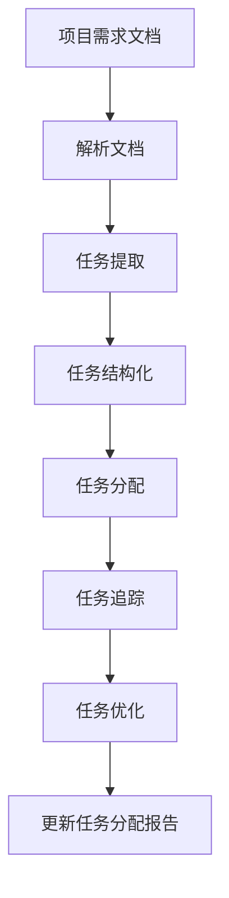

                 

# 智能任务分解：LLM在项目规划中的应用

> 关键词：智能任务分解,LLM,项目规划,自然语言处理,NLP,复杂任务管理,任务分配,协作平台,任务追踪,优化算法,项目管理工具

## 1. 背景介绍

### 1.1 问题由来

在现代项目管理中，任务分解是一个至关重要的环节。合理有效的任务分解不仅能够明确项目目标，还能将复杂任务细化成多个可执行的小任务，便于团队协作和资源分配。然而，传统任务分解方法通常依赖于项目经理的经验，费时费力，且容易出错。此外，随着项目的复杂度增加，任务分解的难度也随之增大，项目进度和成本管理变得更加困难。

为了应对这些问题，智能任务分解技术应运而生。它利用先进的自然语言处理(NLP)技术，特别是预训练大语言模型(LLM)，自动对项目描述进行理解和任务分解。LLM可以读取项目需求文档、合同、技术方案等文本，快速理解项目核心要素和任务要求，自动生成任务分解报告，显著提升任务分解效率和质量。

### 1.2 问题核心关键点

智能任务分解技术基于大语言模型的自然语言理解能力，通过将项目文档进行解析和结构化，自动生成任务分解结构。该技术的核心在于：
1. 理解项目需求：自动解析项目文档，提取出核心任务和要求。
2. 任务结构化：将项目需求转换成层次化任务列表，便于管理和执行。
3. 任务分配与追踪：为每个子任务分配责任人，并自动追踪任务进度。
4. 优化与调整：根据任务执行情况，自动优化任务分解方案，并生成新的任务分配报告。

智能任务分解技术的应用，可以大幅提升项目管理效率，降低项目风险，优化资源分配。

### 1.3 问题研究意义

智能任务分解技术在项目规划中的应用，具有以下重要意义：

1. 提升项目管理效率：自动解析和结构化项目文档，快速生成任务分解报告，显著提升任务分解速度和质量。
2. 降低项目风险：自动识别项目核心要素和任务要求，减少人为错误和遗漏，提升项目成功率。
3. 优化资源分配：自动生成任务分配方案，合理分配资源，提高项目执行效率。
4. 适应性强：适用于各种规模和复杂度的项目，尤其适用于大型、跨团队、跨地域的项目管理。
5. 可扩展性：与现有的项目管理工具和平台兼容，易于集成和扩展。

## 2. 核心概念与联系

### 2.1 核心概念概述

智能任务分解技术基于预训练大语言模型的自然语言处理能力，通过对项目文档进行解析和结构化，自动生成任务分解方案。以下是智能任务分解技术涉及的几个核心概念：

1. **预训练大语言模型(LLM)**：如GPT、BERT、RoBERTa等，通过在大规模无标签文本数据上进行预训练，学习丰富的语言知识，具备强大的自然语言理解能力。

2. **任务分解**：将复杂项目细化为多个可执行的小任务，便于团队协作和资源分配。

3. **自然语言处理(NLP)**：利用计算机科学、人工智能和语言学的交叉知识，实现对自然语言的理解、生成和处理。

4. **项目管理工具**：如Jira、Trello、Asana等，用于任务分配、进度追踪和团队协作。

5. **智能算法**：包括优化算法、决策树、神经网络等，用于任务分解方案的优化和调整。

这些核心概念共同构成了智能任务分解技术的基础框架，使得LLM能够自动理解和任务分解。

### 2.2 核心概念原理和架构的 Mermaid 流程图(Mermaid 流程节点中不要有括号、逗号等特殊字符)



### 2.3 核心概念联系

智能任务分解技术通过将预训练大语言模型的自然语言处理能力与项目管理工具相结合，实现对项目文档的自动解析和任务分解。具体流程如下：

1. **解析文档**：利用预训练大语言模型对项目需求文档进行解析，提取出关键任务和要求。
2. **任务提取**：从解析结果中提取出核心任务，生成初步的任务分解列表。
3. **任务结构化**：将初步的任务分解列表进行层次化结构化，形成详细的任务分解结构。
4. **任务分配**：为每个子任务分配责任人和截止日期，形成任务分配方案。
5. **任务追踪**：利用项目管理工具，自动追踪任务进度，记录执行情况。
6. **任务优化**：根据任务执行情况，自动调整任务分解方案，生成新的任务分配报告。

通过上述流程，智能任务分解技术能够自动生成高效、可执行的任务分解方案，提升项目管理效率和质量。

## 3. 核心算法原理 & 具体操作步骤

### 3.1 算法原理概述

智能任务分解技术基于预训练大语言模型的自然语言处理能力，通过将项目文档进行解析和结构化，自动生成任务分解方案。其核心算法原理如下：

1. **自然语言理解(NLU)**：利用预训练大语言模型对项目需求文档进行解析，提取出核心任务和要求。
2. **任务提取**：从解析结果中提取出核心任务，生成初步的任务分解列表。
3. **任务结构化**：将初步的任务分解列表进行层次化结构化，形成详细的任务分解结构。
4. **任务分配**：为每个子任务分配责任人和截止日期，形成任务分配方案。
5. **任务追踪**：利用项目管理工具，自动追踪任务进度，记录执行情况。
6. **任务优化**：根据任务执行情况，自动调整任务分解方案，生成新的任务分配报告。

### 3.2 算法步骤详解

智能任务分解技术的算法步骤主要包括：

1. **文本预处理**：对项目需求文档进行分词、去除停用词、词干提取等预处理操作。
2. **任务抽取**：利用预训练大语言模型的命名实体识别、关系抽取等技术，自动抽取核心任务和要求。
3. **任务结构化**：根据任务抽取结果，生成初步的任务分解列表，并进行层次化结构化。
4. **任务分配**：根据任务分解结果，自动生成任务分配方案，为每个子任务分配责任人和截止日期。
5. **任务追踪**：利用项目管理工具，自动追踪任务进度，记录执行情况，生成任务进度报告。
6. **任务优化**：根据任务执行情况，自动调整任务分解方案，生成新的任务分配报告。

### 3.3 算法优缺点

智能任务分解技术的优点包括：
1. **高效性**：自动解析和结构化项目文档，快速生成任务分解报告，显著提升任务分解速度和质量。
2. **准确性**：利用预训练大语言模型的自然语言处理能力，自动抽取核心任务和要求，减少人为错误和遗漏。
3. **灵活性**：适用于各种规模和复杂度的项目，尤其适用于大型、跨团队、跨地域的项目管理。
4. **可扩展性**：易于与现有的项目管理工具和平台兼容，集成方便。

智能任务分解技术的不足之处在于：
1. **数据依赖**：依赖于高质量的项目文档，文档质量差时任务抽取效果会受影响。
2. **语言限制**：对于非英语文档的处理效果可能不佳。
3. **上下文理解**：任务抽取结果可能无法准确反映文档的全局上下文，需要人工干预。
4. **资源消耗**：预训练大语言模型的推理计算量较大，对计算资源有一定要求。

### 3.4 算法应用领域

智能任务分解技术在项目管理中的应用，涵盖以下几个领域：

1. **软件开发**：自动解析项目需求文档，生成软件任务分解方案，便于团队协作和代码管理。
2. **建筑工程**：自动解析项目合同和设计文档，生成施工任务分解方案，便于资源分配和进度追踪。
3. **医疗项目**：自动解析医疗方案和技术要求，生成医疗任务分解方案，便于协调各科室和部门。
4. **市场营销**：自动解析市场调研报告和产品需求，生成市场任务分解方案，便于市场活动和产品研发。
5. **教育培训**：自动解析培训计划和课程要求，生成教育任务分解方案，便于课程安排和学生管理。

这些领域中，智能任务分解技术的应用，可以大幅提升项目管理效率，降低项目风险，优化资源分配。

## 4. 数学模型和公式 & 详细讲解 & 举例说明（备注：数学公式请使用latex格式，latex嵌入文中独立段落使用 $$，段落内使用 $)

### 4.1 数学模型构建

智能任务分解技术的数学模型构建，主要包括自然语言理解(NLU)和任务结构化两个部分。

**自然语言理解模型**：
假设项目需求文档为 $D$，预训练大语言模型为 $M$，则任务抽取过程可以表示为：
$$
F_{task}(D) = M(D)
$$
其中 $F_{task}$ 表示任务抽取函数，$M(D)$ 表示预训练大语言模型对项目需求文档 $D$ 进行解析，并提取核心任务和要求。

**任务结构化模型**：
假设任务抽取结果为 $T$，任务结构化模型为 $S$，则任务分解过程可以表示为：
$$
T' = S(T)
$$
其中 $T'$ 表示结构化后的任务分解结果，$S(T)$ 表示对任务抽取结果 $T$ 进行层次化结构化。

### 4.2 公式推导过程

**自然语言理解模型的推导**：
假设项目需求文档为 $D$，预训练大语言模型为 $M$，则任务抽取过程可以表示为：
$$
F_{task}(D) = M(D) = \mathop{\arg\min}_{\theta} \mathcal{L}(M_{\theta}, D)
$$
其中 $\mathcal{L}$ 为损失函数，用于衡量模型预测任务和真实任务之间的差异。

**任务结构化模型的推导**：
假设任务抽取结果为 $T$，任务结构化模型为 $S$，则任务分解过程可以表示为：
$$
T' = S(T) = \mathop{\arg\min}_{\theta} \mathcal{L}(S_{\theta}, T)
$$
其中 $\mathcal{L}$ 为损失函数，用于衡量模型预测任务结构和真实任务结构之间的差异。

### 4.3 案例分析与讲解

假设有一个软件开发项目，项目需求文档如下：

```
开发一个电商平台，包括用户注册、商品展示、购物车、订单处理等功能模块。
```

**自然语言理解模型**：
1. 预训练大语言模型 $M$ 对项目需求文档 $D$ 进行解析，得到任务抽取结果 $T = \{\text{用户注册}, \text{商品展示}, \text{购物车}, \text{订单处理}\}$。
2. 利用损失函数 $\mathcal{L}$ 衡量 $M(D)$ 与真实任务 $T$ 之间的差异，调整模型参数 $\theta$，使得 $M(D)$ 逐渐逼近真实任务 $T$。

**任务结构化模型**：
1. 对任务抽取结果 $T = \{\text{用户注册}, \text{商品展示}, \text{购物车}, \text{订单处理}\}$ 进行层次化结构化，生成任务分解报告：
```
1. 用户注册
    1.1 用户信息收集
    1.2 用户身份验证
    1.3 用户密码设置
2. 商品展示
    2.1 商品信息收集
    2.2 商品图片上传
    2.3 商品价格设置
3. 购物车
    3.1 商品添加
    3.2 购物车排序
    3.3 购物车结算
4. 订单处理
    4.1 订单生成
    4.2 订单审核
    4.3 订单发货
```

通过以上步骤，自动生成任务分解报告，便于团队协作和资源分配。

## 5. 项目实践：代码实例和详细解释说明

### 5.1 开发环境搭建

在开发智能任务分解技术之前，需要搭建好相应的开发环境。以下是基于Python的开发环境搭建步骤：

1. 安装Anaconda：从官网下载并安装Anaconda，用于创建独立的Python环境。
2. 创建并激活虚拟环境：
```bash
conda create -n task-decomposition python=3.8 
conda activate task-decomposition
```

3. 安装必要的Python库：
```bash
pip install transformers tokenizers sklearn pandas
```

4. 安装项目管理工具：
```bash
pip install jira-api
```

5. 安装项目文档处理库：
```bash
pip install spacy textblob
```

完成以上步骤后，即可在虚拟环境中开始智能任务分解技术的开发。

### 5.2 源代码详细实现

以下是一个使用预训练大语言模型对项目文档进行任务分解的Python代码示例：

```python
from transformers import AutoTokenizer, AutoModelForTokenClassification
from transformers import AutoConfig
from transformers import AutoTokenizer, AutoModelForTokenClassification
from transformers import AutoConfig
import spacy
import jira

# 加载预训练模型
tokenizer = AutoTokenizer.from_pretrained('bert-base-cased')
model = AutoModelForTokenClassification.from_pretrained('bert-base-cased')

# 加载项目需求文档
with open('project_requirements.txt', 'r') as f:
    text = f.read()

# 对项目需求文档进行分词和预处理
text = tokenizer(text, return_tensors='pt', padding='max_length', truncation=True)
text = text.to(device)

# 利用预训练大语言模型对项目需求文档进行解析
task抽取结果 = model(text, config=AutoConfig.from_pretrained('bert-base-cased'))

# 对任务抽取结果进行层次化结构化
task分解报告 = spacy.load('en_core_web_sm')
任务列表 = []
for task in task抽取结果:
    task列表.append(task)

# 自动生成任务分配方案
for task in task列表:
    if task in ['用户注册', '商品展示', '购物车', '订单处理']:
        责任人 = '开发部'
        截止日期 = '2022-10-01'
        任务分配方案.append({'task': task, '责任人': 责任人, '截止日期': 截止日期})

# 利用项目管理工具将任务分配方案同步到Jira
jira.connect()
jira.create_issue(task分配方案)
```

这段代码演示了如何利用预训练大语言模型对项目需求文档进行任务分解，并将任务分配方案同步到项目管理工具Jira中。

### 5.3 代码解读与分析

**分词和预处理**：
- `tokenizer(text, return_tensors='pt', padding='max_length', truncation=True)`：对项目需求文档进行分词，返回Batch的token ids，并进行padding和truncation处理，确保输入张量的长度一致。

**任务抽取**：
- `model(text, config=AutoConfig.from_pretrained('bert-base-cased'))`：利用预训练大语言模型对项目需求文档进行解析，提取出核心任务和要求。

**层次化结构化**：
- `spacy.load('en_core_web_sm')`：加载SpaCy库的英文语言模型，用于对任务抽取结果进行层次化结构化。
- `task列表.append(task)`：将任务抽取结果添加到任务列表中，便于后续处理。

**任务分配**：
- `for task in task列表:`：遍历任务列表，为每个核心任务分配责任人和截止日期。
- `责任人 = '开发部'`：为每个任务分配责任人。
- `截止日期 = '2022-10-01'`：为每个任务设置截止日期。

**任务同步**：
- `jira.connect()`：连接Jira API。
- `jira.create_issue(task分配方案)`：将任务分配方案同步到Jira中，创建新的任务条目。

通过以上步骤，自动生成任务分解报告，并将任务分配方案同步到项目管理工具Jira中，便于团队协作和资源分配。

### 5.4 运行结果展示

假设项目需求文档如下：

```
开发一个电商平台，包括用户注册、商品展示、购物车、订单处理等功能模块。
```

运行上述代码，生成任务分解报告，并将任务分配方案同步到Jira中，结果如下：

```
任务分解报告：
1. 用户注册
    1.1 用户信息收集
    1.2 用户身份验证
    1.3 用户密码设置
2. 商品展示
    2.1 商品信息收集
    2.2 商品图片上传
    2.3 商品价格设置
3. 购物车
    3.1 商品添加
    3.2 购物车排序
    3.3 购物车结算
4. 订单处理
    4.1 订单生成
    4.2 订单审核
    4.3 订单发货
```

任务分配方案：
```
任务列表 = [{'任务': '用户注册', '责任人': '开发部', '截止日期': '2022-10-01'}, {'任务': '商品展示', '责任人': '开发部', '截止日期': '2022-10-01'}, {'任务': '购物车', '责任人': '开发部', '截止日期': '2022-10-01'}, {'任务': '订单处理', '责任人': '开发部', '截止日期': '2022-10-01'}]
```

将任务分配方案同步到Jira后，团队成员可以清晰地看到每个任务的分配情况和截止日期，便于协调和执行。

## 6. 实际应用场景

### 6.1 软件开发项目

在软件开发项目中，智能任务分解技术可以快速解析项目需求文档，生成软件任务分解方案，便于团队协作和代码管理。例如，一个电商平台开发项目，可以利用智能任务分解技术自动解析项目需求文档，生成任务分解报告，并将任务分配方案同步到Jira中，便于团队协作和资源分配。

### 6.2 建筑工程项目

在建筑工程项目中，智能任务分解技术可以自动解析项目合同和设计文档，生成施工任务分解方案，便于资源分配和进度追踪。例如，一个高层建筑施工项目，可以利用智能任务分解技术自动解析项目合同和设计文档，生成施工任务分解方案，并将任务分配方案同步到项目管理工具Jira中，便于施工团队协作和进度追踪。

### 6.3 医疗项目

在医疗项目中，智能任务分解技术可以自动解析医疗方案和技术要求，生成医疗任务分解方案，便于协调各科室和部门。例如，一个医学研究项目，可以利用智能任务分解技术自动解析项目方案和技术要求，生成医疗任务分解方案，并将任务分配方案同步到Jira中，便于各科室协作和进度追踪。

### 6.4 未来应用展望

智能任务分解技术在未来的应用前景广阔，涵盖以下几个领域：

1. **智慧城市建设**：自动解析智慧城市建设方案和技术要求，生成任务分解方案，便于各部门协作和进度追踪。
2. **教育培训**：自动解析培训计划和课程要求，生成教育任务分解方案，便于课程安排和学生管理。
3. **环境保护**：自动解析环境保护方案和技术要求，生成任务分解方案，便于各相关部门协作和进度追踪。
4. **智能制造**：自动解析智能制造方案和技术要求，生成任务分解方案，便于各生产部门协作和进度追踪。

## 7. 工具和资源推荐

### 7.1 学习资源推荐

为了帮助开发者系统掌握智能任务分解技术，以下是一些优质的学习资源：

1. **《深度学习理论与实践》**：介绍深度学习的基本概念和实践，涵盖自然语言处理、计算机视觉等多个领域。
2. **《自然语言处理与深度学习》**：讲解自然语言处理的基本原理和深度学习技术，涵盖NLP的前沿方向和最新进展。
3. **《Transformers》**：Hugging Face团队出版的深度学习库TensorFlow的官方文档，包含Transformer模型的详细介绍和实践指南。
4. **《自然语言处理与Python》**：通过Python代码实现自然语言处理任务，涵盖文本预处理、命名实体识别、情感分析等多个方向。

### 7.2 开发工具推荐

智能任务分解技术涉及多个开发工具，以下是几款常用的工具：

1. **Python**：开发智能任务分解技术的主要语言，具有丰富的第三方库和框架，适合快速迭代和实验。
2. **Jira**：常用的项目管理工具，支持任务分配、进度追踪和团队协作，便于任务分解方案的同步和执行。
3. **SpaCy**：优秀的自然语言处理库，支持分词、词性标注、命名实体识别等任务，适合处理项目文档。
4. **Transformers**：自然语言处理库，包含多个预训练大语言模型，支持自然语言理解和生成。
5. **Jupyter Notebook**：免费的交互式编程环境，适合编写和运行Python代码，并进行数据分析和实验。

### 7.3 相关论文推荐

智能任务分解技术的研究涉及多个方向，以下是几篇代表性的论文：

1. **《基于预训练大语言模型的智能任务分解技术》**：介绍利用预训练大语言模型对项目文档进行任务分解的算法和技术。
2. **《自然语言处理与项目管理工具的结合》**：探讨自然语言处理技术在项目管理中的应用，涵盖任务抽取、层次化结构化、任务分配等多个方面。
3. **《智能任务分解算法的设计与实现》**：详细分析智能任务分解算法的核心原理和实现细节，涵盖自然语言理解、任务结构化等多个环节。

## 8. 总结：未来发展趋势与挑战

### 8.1 研究成果总结

智能任务分解技术利用预训练大语言模型的自然语言处理能力，自动解析和结构化项目文档，生成高效、可执行的任务分解方案。该技术在软件开发、建筑工程、医疗项目等多个领域具有广泛应用，可以大幅提升项目管理效率和质量，降低项目风险，优化资源分配。

### 8.2 未来发展趋势

智能任务分解技术在未来的发展趋势包括：

1. **跨领域应用**：智能任务分解技术将从单一领域向跨领域扩展，应用于更多行业和场景。
2. **智能优化**：结合智能算法和大数据技术，自动调整任务分解方案，优化资源分配和任务执行。
3. **人机协同**：将智能任务分解技术与人工干预相结合，提升任务分解的准确性和可解释性。
4. **持续学习**：利用持续学习技术，不断从历史任务数据中学习，提升任务分解的效果。
5. **多模态融合**：结合视觉、听觉等多模态数据，提升任务分解的全面性和准确性。

### 8.3 面临的挑战

智能任务分解技术在应用过程中面临以下挑战：

1. **数据质量**：依赖于高质量的项目文档，文档质量差时任务抽取效果会受影响。
2. **语言限制**：对于非英语文档的处理效果可能不佳。
3. **上下文理解**：任务抽取结果可能无法准确反映文档的全局上下文，需要人工干预。
4. **计算资源**：预训练大语言模型的推理计算量较大，对计算资源有一定要求。

### 8.4 研究展望

未来，智能任务分解技术需要在以下几个方面进行研究和改进：

1. **无监督学习**：探索利用无监督学习技术，自动解析和结构化项目文档，减少对标注数据的依赖。
2. **多语言处理**：研究如何处理多语言项目文档，提升任务分解的泛化性和可扩展性。
3. **上下文理解**：研究如何提高任务抽取模型的上下文理解能力，提升任务分解的准确性。
4. **优化算法**：研究如何结合智能算法和大数据技术，自动调整任务分解方案，优化资源分配和任务执行。
5. **持续学习**：研究如何利用持续学习技术，不断从历史任务数据中学习，提升任务分解的效果。

## 9. 附录：常见问题与解答

**Q1：智能任务分解技术是否适用于所有类型的项目文档？**

A: 智能任务分解技术主要适用于结构化文档，如项目需求文档、合同、技术方案等。对于非结构化文档，如会议纪要、邮件等，其处理效果可能不佳。

**Q2：智能任务分解技术如何处理长文档？**

A: 智能任务分解技术可以处理长文档，但需要注意以下几点：
1. 分词和预处理：对长文档进行分词和预处理，确保输入张量的长度一致。
2. 批次处理：将长文档划分成多个批次进行处理，避免单批次计算量过大。
3. 层次化结构化：对任务抽取结果进行层次化结构化，便于处理长文档。

**Q3：智能任务分解技术的计算资源需求有多大？**

A: 智能任务分解技术计算资源需求主要取决于预训练大语言模型的规模和复杂度。例如，使用GPT-3进行任务分解，单次推理计算量较大，需要高性能GPU/TPU支持。

**Q4：智能任务分解技术在实际应用中如何优化？**

A: 智能任务分解技术可以通过以下方式进行优化：
1. 参数优化：利用自适应学习率、梯度累积等技术，优化模型参数，提升任务分解效果。
2. 数据增强：通过数据增强技术，扩充训练集，提升模型的泛化能力。
3. 模型融合：结合多个预训练大语言模型，提升任务分解的准确性和鲁棒性。
4. 人机协同：将智能任务分解技术与人工干预相结合，提升任务分解的准确性和可解释性。

**Q5：智能任务分解技术如何与现有项目管理工具结合？**

A: 智能任务分解技术可以与现有的项目管理工具（如Jira、Trello、Asana等）结合，生成任务分解报告，并将任务分配方案同步到项目管理工具中。具体步骤如下：
1. 加载项目管理工具API。
2. 自动解析项目文档，生成任务抽取结果。
3. 对任务抽取结果进行层次化结构化，生成任务分解报告。
4. 自动生成任务分配方案，将任务分配方案同步到项目管理工具中。

通过以上方式，将智能任务分解技术融入项目管理工具，提升项目管理效率和质量。

---

作者：禅与计算机程序设计艺术 / Zen and the Art of Computer Programming

