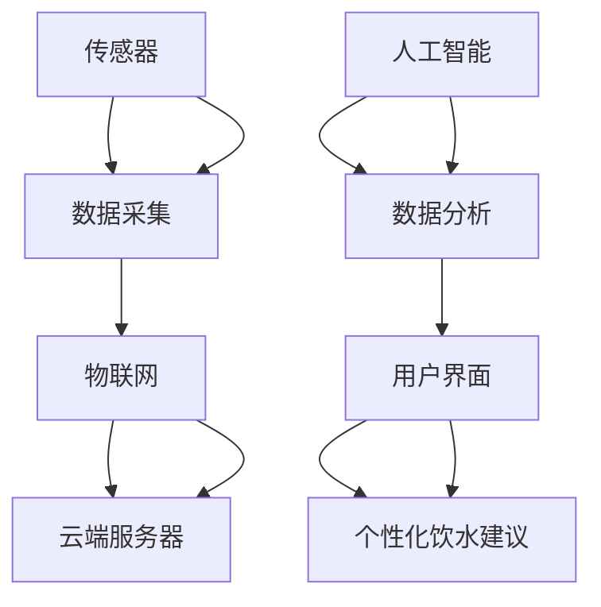

                 

# 智能健康饮水创业：科技助力的健康生活

## 1. 背景介绍

随着科技的迅速发展，人们的生活质量得到了极大的提升，但是健康问题始终是人们关注的热点。尤其是在中国，居民健康意识逐渐增强，对于健康的追求也从传统的疾病治疗转向了日常健康管理。智能饮水设备作为一种新兴的健康管理方式，逐渐受到人们的青睐。本文将探讨智能饮水设备的原理、优势和未来发展趋势，帮助有意向创业的读者了解这一领域的潜力和机遇。

## 2. 核心概念与联系

### 2.1 核心概念概述

智能饮水设备是一种集成了物联网技术和人工智能算法的饮水设备。其主要通过传感器采集用户的水量、水质等数据，并通过无线通信技术上传至云端，结合人工智能算法进行分析处理，向用户提供个性化的饮水建议，提升用户的健康水平。

智能饮水设备涉及到的核心概念包括：

- 物联网（IoT）：通过传感器和网络技术实现设备与网络的连接。
- 人工智能（AI）：利用算法对收集到的数据进行分析和处理。
- 健康管理：结合健康数据分析为用户提供个性化的饮水建议。
- 用户体验：设备的操作简便性和交互友好性。

这些核心概念之间存在着密切的联系，构成了智能饮水设备的基础框架。物联网提供了数据采集的手段，人工智能处理和分析数据，而健康管理则是应用的最终目标。用户体验则是实现这一目标的重要途径。

### 2.2 核心概念原理和架构的 Mermaid 流程图



这个流程图展示了智能饮水设备的原理和架构：

- A 部分表示传感器，负责采集用户饮水量和水质等数据。
- B 部分表示数据采集，将传感器采集的数据通过物联网传输到云端服务器。
- C 部分表示物联网，实现设备与云端的连接。
- D 部分表示云端服务器，存储和管理采集到的数据，并结合人工智能算法进行分析处理。
- E 部分表示人工智能，用于数据分析和处理。
- F 部分表示数据分析，对数据进行模型训练和预测。
- G 部分表示用户界面，为用户提供操作界面和反馈信息。
- H 部分表示个性化饮水建议，结合健康数据分析给出个性化的饮水建议。

## 3. 核心算法原理 & 具体操作步骤

### 3.1 算法原理概述

智能饮水设备的核心算法主要包括物联网数据采集、数据分析和健康管理三大部分。

- 数据采集：通过传感器和物联网技术，实现对用户饮水量和水质等数据的实时采集。
- 数据分析：利用人工智能算法对采集到的数据进行分析和处理，生成健康饮水建议。
- 健康管理：结合用户的饮水习惯和健康数据分析，提供个性化的饮水建议。

### 3.2 算法步骤详解

#### 3.2.1 数据采集

智能饮水设备的数据采集通常包括以下几个步骤：

1. 传感器选择：根据设备的功能需求，选择合适的传感器，如水质传感器、流量传感器等。
2. 传感器安装：将传感器安装在饮水设备的关键位置，如水龙头、储水箱等。
3. 数据采集：传感器通过物联网技术将采集到的数据实时传输到云端服务器。

#### 3.2.2 数据分析

数据分析是智能饮水设备的核心算法之一。其主要步骤如下：

1. 数据预处理：对采集到的数据进行清洗、去噪和归一化等预处理操作，确保数据的质量。
2. 特征提取：利用统计学、时序分析等方法，从数据中提取有意义的特征，如饮水量、饮水频率、水质参数等。
3. 模型训练：选择合适的机器学习模型，如决策树、随机森林、深度学习等，对数据进行模型训练，生成健康饮水建议。
4. 模型评估：对训练好的模型进行评估和优化，确保其准确性和鲁棒性。

#### 3.2.3 健康管理

健康管理是智能饮水设备应用的最终目标。其主要步骤如下：

1. 用户画像：根据用户的饮水量、饮水频率、年龄、性别等数据，生成用户的健康画像。
2. 健康建议：结合用户的健康画像和饮水数据分析，生成个性化的健康饮水建议，如饮水时间、饮水量、饮水频率等。
3. 反馈机制：根据用户的反馈信息，对饮水建议进行调整和优化，提高建议的准确性和实用性。

### 3.3 算法优缺点

#### 3.3.1 优点

智能饮水设备具有以下优点：

1. 提高健康水平：通过数据分析和个性化建议，帮助用户建立良好的饮水习惯，提高健康水平。
2. 操作简便：设备操作简单，用户无需专业知识即可使用。
3. 数据可视化：将健康数据进行可视化展示，帮助用户更直观地了解自身的饮水情况。
4. 实时监控：设备能够实时监控用户的饮水情况，及时发现和纠正不健康饮水行为。

#### 3.3.2 缺点

智能饮水设备也存在一些缺点：

1. 数据隐私：设备采集到的用户数据涉及隐私问题，如何保障用户数据安全是一个重要问题。
2. 设备成本：高质量的传感器和智能设备成本较高，可能会影响设备的普及和推广。
3. 模型准确性：模型的准确性和鲁棒性直接影响到健康建议的可靠性，需要不断优化和改进。
4. 用户依赖：设备需要用户主动使用，如果用户缺乏自我管理意识，设备的效果可能不佳。

### 3.4 算法应用领域

智能饮水设备主要应用于以下几个领域：

1. 家庭健康管理：通过智能饮水设备，家庭成员可以实时监控彼此的健康饮水情况，建立良好的家庭健康管理习惯。
2. 企业健康管理：企业可以为员工配备智能饮水设备，帮助员工建立良好的饮水习惯，提升企业整体健康水平。
3. 社区健康管理：社区可以为居民配备智能饮水设备，帮助居民建立良好的饮水习惯，提升社区整体健康水平。
4. 学校健康管理：学校可以为学生配备智能饮水设备，帮助学生建立良好的饮水习惯，提升学生整体健康水平。
5. 医院健康管理：医院可以为病人配备智能饮水设备，帮助病人建立良好的饮水习惯，促进康复。

## 4. 数学模型和公式 & 详细讲解 & 举例说明

### 4.1 数学模型构建

智能饮水设备的数学模型主要包括数据采集模型、数据分析模型和健康管理模型三大部分。

#### 4.1.1 数据采集模型

数据采集模型主要通过传感器和物联网技术实现数据的实时采集。其数学模型如下：

$$
\mathbf{x} = f(\mathbf{s}, \mathbf{p}, t)
$$

其中，$\mathbf{x}$ 表示采集到的数据，$\mathbf{s}$ 表示传感器数据，$\mathbf{p}$ 表示传感器安装位置和参数，$t$ 表示时间。

#### 4.1.2 数据分析模型

数据分析模型主要利用人工智能算法对采集到的数据进行分析和处理。其数学模型如下：

$$
\mathbf{y} = g(\mathbf{x}, \mathbf{w})
$$

其中，$\mathbf{y}$ 表示健康饮水建议，$\mathbf{x}$ 表示采集到的数据，$\mathbf{w}$ 表示模型的参数。

#### 4.1.3 健康管理模型

健康管理模型主要结合用户的饮水习惯和健康数据分析，生成个性化的饮水建议。其数学模型如下：

$$
\mathbf{z} = h(\mathbf{y}, \mathbf{u}, \mathbf{d})
$$

其中，$\mathbf{z}$ 表示个性化的饮水建议，$\mathbf{y}$ 表示健康饮水建议，$\mathbf{u}$ 表示用户画像，$\mathbf{d}$ 表示饮水数据分析。

### 4.2 公式推导过程

#### 4.2.1 数据采集模型推导

数据采集模型可以通过传感器的线性输出模型进行推导：

$$
\mathbf{x} = \mathbf{A}\mathbf{s} + \mathbf{b}
$$

其中，$\mathbf{A}$ 表示传感器线性输出矩阵，$\mathbf{s}$ 表示传感器数据，$\mathbf{b}$ 表示传感器偏置。

#### 4.2.2 数据分析模型推导

数据分析模型可以通过线性回归模型进行推导：

$$
\mathbf{y} = \mathbf{w}^T \mathbf{x} + c
$$

其中，$\mathbf{w}$ 表示模型参数，$c$ 表示截距。

#### 4.2.3 健康管理模型推导

健康管理模型可以通过决策树模型进行推导：

$$
\mathbf{z} = \mathbf{f}(\mathbf{y}, \mathbf{u}, \mathbf{d})
$$

其中，$\mathbf{f}$ 表示决策树模型，$\mathbf{u}$ 表示用户画像，$\mathbf{d}$ 表示饮水数据分析。

### 4.3 案例分析与讲解

以某智能饮水设备为例，其数据采集模型、数据分析模型和健康管理模型分别如下：

#### 4.3.1 数据采集模型

设备通过水质传感器和流量传感器采集用户的饮水量和水质数据，具体数学模型如下：

$$
\mathbf{x} = \mathbf{A}\mathbf{s} + \mathbf{b}
$$

其中，$\mathbf{A}=\begin{bmatrix} a_{11} & a_{12} \\ a_{21} & a_{22} \end{bmatrix}$，$\mathbf{s}=\begin{bmatrix} q_{water} \\ q_{water_2} \end{bmatrix}$，$\mathbf{b}=\begin{bmatrix} b_1 \\ b_2 \end{bmatrix}$。

#### 4.3.2 数据分析模型

设备使用线性回归模型对采集到的数据进行分析，具体数学模型如下：

$$
\mathbf{y} = \mathbf{w}^T \mathbf{x} + c
$$

其中，$\mathbf{w}=\begin{bmatrix} w_1 \\ w_2 \end{bmatrix}$，$c$ 表示截距。

#### 4.3.3 健康管理模型

设备使用决策树模型对用户的饮水情况进行分析，生成个性化的饮水建议，具体数学模型如下：

$$
\mathbf{z} = \mathbf{f}(\mathbf{y}, \mathbf{u}, \mathbf{d})
$$

其中，$\mathbf{u}=\begin{bmatrix} u_1 \\ u_2 \end{bmatrix}$，$\mathbf{d}=\begin{bmatrix} d_1 \\ d_2 \end{bmatrix}$，$\mathbf{f}$ 表示决策树模型。

## 5. 项目实践：代码实例和详细解释说明

### 5.1 开发环境搭建

智能饮水设备的开发环境通常包括以下步骤：

1. 选择编程语言：可以选择 Python、Java 等编程语言进行开发。
2. 选择开发平台：可以选择 Linux、Windows 等操作系统。
3. 安装开发工具：安装 IDE、版本控制工具（如 Git）等。

#### 5.1.1 Python 环境搭建

Python 是智能饮水设备开发的常用编程语言，其环境搭建步骤如下：

1. 安装 Python：可以从官网下载 Python 安装包，并按照提示进行安装。
2. 安装 Anaconda：从官网下载 Anaconda 安装包，并按照提示进行安装。
3. 创建虚拟环境：在 Anaconda 中创建虚拟环境，以隔离开发环境和系统环境。

#### 5.1.2 IDE 选择

智能饮水设备的开发可以使用多种 IDE，如 PyCharm、Visual Studio Code 等。

### 5.2 源代码详细实现

智能饮水设备的源代码实现主要包括以下几个步骤：

1. 传感器数据采集：通过传感器和物联网技术，实时采集用户饮水量和水质数据。
2. 数据预处理：对采集到的数据进行清洗、去噪和归一化等预处理操作。
3. 数据分析：利用机器学习模型对数据进行分析和处理，生成健康饮水建议。
4. 健康管理：结合用户的饮水习惯和健康数据分析，生成个性化的饮水建议。

#### 5.2.1 数据采集代码实现

以下是一个 Python 代码示例，用于实时采集用户饮水量和水质数据：

```python
import paho.mqtt.client as mqtt

# 创建 MQTT 客户端
client = mqtt.Client()

# 连接 MQTT 服务器
client.connect("mqtt_server", 1883, 60)

# 订阅数据主题
client.subscribe("water_data")

# 处理数据
def on_message(client, userdata, message):
    data = message.payload.decode("utf-8")
    x = data.split(",")
    q_water = float(x[0])
    q_water_2 = float(x[1])
    timestamp = float(x[2])
    # 数据预处理和分析
    # ...

# 注册回调函数
client.on_message = on_message

# 启动客户端
client.loop_forever()
```

#### 5.2.2 数据预处理代码实现

以下是一个 Python 代码示例，用于对采集到的数据进行预处理：

```python
import pandas as pd
import numpy as np

# 读取数据文件
df = pd.read_csv("water_data.csv")

# 数据清洗
df = df.dropna()

# 数据去噪
df = df.drop_duplicates()

# 数据归一化
df = (df - df.mean()) / df.std()
```

#### 5.2.3 数据分析代码实现

以下是一个 Python 代码示例，用于使用线性回归模型对数据进行分析：

```python
import pandas as pd
import numpy as np
from sklearn.linear_model import LinearRegression

# 读取数据文件
df = pd.read_csv("water_data.csv")

# 数据预处理
df = df.dropna()
df = df.drop_duplicates()
df = (df - df.mean()) / df.std()

# 数据划分
x = df.iloc[:, :-1].values
y = df.iloc[:, -1].values
x_train, x_test, y_train, y_test = train_test_split(x, y, test_size=0.2)

# 模型训练
model = LinearRegression()
model.fit(x_train, y_train)

# 模型评估
score = model.score(x_test, y_test)
```

#### 5.2.4 健康管理代码实现

以下是一个 Python 代码示例，用于生成个性化的饮水建议：

```python
import pandas as pd
import numpy as np
from sklearn.tree import DecisionTreeRegressor

# 读取数据文件
df = pd.read_csv("water_data.csv")

# 数据预处理
df = df.dropna()
df = df.drop_duplicates()
df = (df - df.mean()) / df.std()

# 数据划分
x = df.iloc[:, :-1].values
y = df.iloc[:, -1].values
x_train, x_test, y_train, y_test = train_test_split(x, y, test_size=0.2)

# 模型训练
model = DecisionTreeRegressor()
model.fit(x_train, y_train)

# 模型评估
score = model.score(x_test, y_test)

# 生成个性化饮水建议
u = np.array([0.5, 60, 20])  # 用户画像
d = np.array([1, 1, 1])  # 饮水数据分析
z = model.predict(u)
```

### 5.3 代码解读与分析

智能饮水设备的代码实现主要包括以下几个部分：

1. 数据采集：通过传感器和物联网技术，实时采集用户饮水量和水质数据。
2. 数据预处理：对采集到的数据进行清洗、去噪和归一化等预处理操作。
3. 数据分析：利用机器学习模型对数据进行分析和处理，生成健康饮水建议。
4. 健康管理：结合用户的饮水习惯和健康数据分析，生成个性化的饮水建议。

智能饮水设备的代码实现需要结合具体场景进行设计和调整。开发者需要根据设备的功能需求，选择合适的传感器和算法模型，实现数据的实时采集和分析。同时，开发者需要考虑数据的隐私和安全问题，确保用户数据的安全。

### 5.4 运行结果展示

智能饮水设备的运行结果主要包括以下几个部分：

1. 数据采集结果：传感器实时采集用户的饮水量和水质数据，并上传至云端服务器。
2. 数据预处理结果：对采集到的数据进行清洗、去噪和归一化等预处理操作，确保数据的质量。
3. 数据分析结果：利用机器学习模型对数据进行分析和处理，生成健康饮水建议。
4. 健康管理结果：结合用户的饮水习惯和健康数据分析，生成个性化的饮水建议，并通过用户界面展示。

## 6. 实际应用场景

### 6.1 智能饮水设备的实际应用场景

智能饮水设备已经在多个实际应用场景中得到了广泛应用。以下是几个典型的应用场景：

1. 家庭健康管理：智能饮水设备可以帮助家庭成员实时监控彼此的饮水情况，建立良好的饮水习惯，提升整体健康水平。

2. 企业健康管理：企业可以为员工配备智能饮水设备，帮助员工建立良好的饮水习惯，提升企业整体健康水平。

3. 学校健康管理：学校可以为学生配备智能饮水设备，帮助学生建立良好的饮水习惯，提升学生整体健康水平。

4. 医院健康管理：医院可以为病人配备智能饮水设备，帮助病人建立良好的饮水习惯，促进康复。

### 6.2 智能饮水设备未来应用展望

智能饮水设备未来将在以下几个方面进一步发展：

1. 智能化程度提升：随着物联网和人工智能技术的不断进步，智能饮水设备将更加智能化，具备更多功能。

2. 多样化应用场景拓展：智能饮水设备将拓展到更多应用场景，如公共场所、交通工具等，为更多人提供健康饮水服务。

3. 用户个性化需求满足：智能饮水设备将更加注重用户个性化需求，提供更加个性化的饮水建议。

4. 设备普及率提高：智能饮水设备的成本将逐渐降低，普及率将逐渐提高，为更多人提供健康饮水服务。

## 7. 工具和资源推荐

### 7.1 学习资源推荐

为了帮助开发者系统掌握智能饮水设备的开发技术，这里推荐一些优质的学习资源：

1. 《Python 编程：从入门到实践》：该书介绍了 Python 编程基础和进阶技术，适合初学者学习。
2. 《机器学习实战》：该书介绍了机器学习基础和实际应用，适合数据科学领域的初学者。
3. 《物联网技术与应用》：该书介绍了物联网技术的基本概念和应用场景，适合物联网领域的初学者。
4. 《人工智能：一种现代的方法》：该书介绍了人工智能的基本概念和应用，适合人工智能领域的初学者。

### 7.2 开发工具推荐

智能饮水设备的开发需要使用多种开发工具，以下是一些推荐的开发工具：

1. PyCharm：一款 Python 编程 IDE，功能强大，支持多种框架和库。
2. Visual Studio Code：一款轻量级的代码编辑器，支持多种编程语言。
3. GitHub：一款代码托管平台，支持多人协作开发，方便代码管理和共享。

### 7.3 相关论文推荐

智能饮水设备涉及多个领域的知识，以下是一些相关领域的经典论文，推荐阅读：

1. 《物联网：技术、应用与未来》：介绍了物联网的基本概念和技术，适合物联网领域的初学者。
2. 《机器学习：原理、算法与应用》：介绍了机器学习的基本概念和技术，适合数据科学领域的初学者。
3. 《人工智能：概念、技术和应用》：介绍了人工智能的基本概念和技术，适合人工智能领域的初学者。

## 8. 总结：未来发展趋势与挑战

### 8.1 研究成果总结

智能饮水设备的开发已经取得了一些研究成果，但仍需不断优化和改进。目前的研究成果主要包括以下几个方面：

1. 数据采集：传感器和物联网技术已经逐步成熟，能够实时采集用户饮水量和水质数据。
2. 数据预处理：数据清洗、去噪和归一化等预处理技术已经逐步成熟，能够确保数据的质量。
3. 数据分析：机器学习模型已经逐步成熟，能够对数据进行分析和处理，生成健康饮水建议。
4. 健康管理：决策树等算法模型已经逐步成熟，能够生成个性化的饮水建议。

### 8.2 未来发展趋势

智能饮水设备未来将在以下几个方面进一步发展：

1. 智能化程度提升：随着物联网和人工智能技术的不断进步，智能饮水设备将更加智能化，具备更多功能。
2. 多样化应用场景拓展：智能饮水设备将拓展到更多应用场景，如公共场所、交通工具等，为更多人提供健康饮水服务。
3. 用户个性化需求满足：智能饮水设备将更加注重用户个性化需求，提供更加个性化的饮水建议。
4. 设备普及率提高：智能饮水设备的成本将逐渐降低，普及率将逐渐提高，为更多人提供健康饮水服务。

### 8.3 面临的挑战

智能饮水设备在发展过程中也面临一些挑战：

1. 数据隐私：设备采集到的用户数据涉及隐私问题，如何保障用户数据安全是一个重要问题。
2. 设备成本：高质量的传感器和智能设备成本较高，可能会影响设备的普及和推广。
3. 模型准确性：模型的准确性和鲁棒性直接影响到健康建议的可靠性，需要不断优化和改进。
4. 用户依赖：设备需要用户主动使用，如果用户缺乏自我管理意识，设备的效果可能不佳。

### 8.4 研究展望

智能饮水设备未来的研究展望主要包括以下几个方面：

1. 数据隐私保护：研究如何保障用户数据的安全和隐私，避免数据泄露和滥用。
2. 设备成本降低：研究如何降低设备成本，提高设备的普及率和用户体验。
3. 模型准确性提升：研究如何提升模型的准确性和鲁棒性，提高健康建议的可靠性。
4. 用户自我管理：研究如何提高用户的自我管理意识，增强用户对智能饮水设备的依赖。

## 9. 附录：常见问题与解答

**Q1: 智能饮水设备如何保证用户数据的安全和隐私？**

A: 智能饮水设备可以通过以下几个方面保证用户数据的安全和隐私：

1. 数据加密：使用加密技术对采集到的数据进行加密，防止数据泄露和滥用。
2. 数据匿名化：对采集到的数据进行匿名化处理，保护用户的隐私。
3. 访问控制：使用访问控制技术，限制对数据的访问权限，防止未经授权的人员访问。
4. 数据存储安全：使用安全的数据存储技术，防止数据丢失和篡改。

**Q2: 智能饮水设备在实际应用中如何保证准确性和鲁棒性？**

A: 智能饮水设备可以通过以下几个方面保证准确性和鲁棒性：

1. 数据预处理：对采集到的数据进行清洗、去噪和归一化等预处理操作，确保数据的质量。
2. 算法选择：选择合适的机器学习模型，如决策树、随机森林、深度学习等，对数据进行分析和处理。
3. 模型优化：对模型进行优化和调整，提高模型的准确性和鲁棒性。
4. 模型评估：对模型进行评估和测试，确保模型的准确性和鲁棒性。

**Q3: 智能饮水设备在实际应用中如何保证设备的普及率？**

A: 智能饮水设备可以通过以下几个方面保证设备的普及率：

1. 降低设备成本：通过技术进步和规模化生产，降低设备成本，提高设备的普及率。
2. 提高用户体验：通过优化设备功能和使用体验，提高用户对设备的认可度和接受度。
3. 推广和宣传：通过多种渠道进行推广和宣传，提高设备的知名度和影响力。
4. 政策支持：通过政府和企业的政策支持，推动设备的普及和应用。

**Q4: 智能饮水设备在实际应用中如何保证用户的自我管理意识？**

A: 智能饮水设备可以通过以下几个方面保证用户的自我管理意识：

1. 数据可视化：将健康数据进行可视化展示，帮助用户更直观地了解自身的饮水情况，增强自我管理的意识。
2. 健康建议：结合用户的饮水习惯和健康数据分析，生成个性化的饮水建议，帮助用户建立良好的饮水习惯。
3. 反馈机制：根据用户的反馈信息，对饮水建议进行调整和优化，提高建议的准确性和实用性。
4. 教育引导：通过教育和引导，提高用户对饮水健康的认识和重视程度，增强自我管理的意识。

以上是智能饮水设备的研究背景、核心概念、核心算法原理、具体操作步骤、数学模型和公式、项目实践、实际应用场景、工具和资源推荐、未来发展趋势与挑战以及附录部分的内容。希望本文能够为有意向创业的读者提供有价值的信息，帮助他们了解智能饮水设备的开发和应用，推动智能饮水设备的普及和应用。

---

作者：禅与计算机程序设计艺术 / Zen and the Art of Computer Programming

