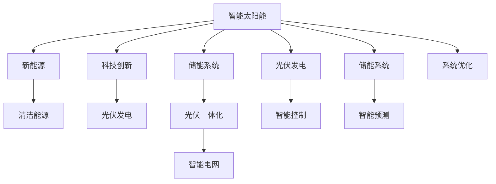

                 

# 智能太阳能创业：新能源应用的创新

> 关键词：智能太阳能, 新能源, 清洁能源, 科技创新, 光伏发电, 储能系统, 光伏一体化, 智能电网

## 1. 背景介绍

### 1.1 问题由来
近年来，全球气候变化问题愈发严峻，化石燃料的使用引发了严重的空气污染和环境破坏。因此，开发和应用可再生能源技术成为了国际社会共识。其中，太阳能作为最普遍、最可行的清洁能源之一，受到了广泛关注。然而，传统太阳能发电方式存在一些缺点，如依赖天气变化、能量转换效率低、发电不可控等问题。为了提升太阳能的可用性，全球范围内的科技公司和创业团队不断探索创新，利用人工智能技术进行优化，推动智能太阳能的应用和产业化发展。

### 1.2 问题核心关键点
智能太阳能创业的关键点在于如何通过人工智能技术，提高太阳能的转换效率和系统管理能力。主要包括以下几个方面：
1. 智能预测：利用机器学习模型预测天气变化，优化太阳能发电系统的运行策略。
2. 智能控制：通过自动控制系统调整光伏电池的朝向和角度，确保最大输出功率。
3. 储能管理：结合人工智能算法优化储能系统的充放电，提高能量利用率。
4. 系统优化：使用深度学习技术分析海量运行数据，优化光伏一体化和智能电网设计。

### 1.3 问题研究意义
智能太阳能创业不仅有助于解决气候变化问题，还能推动新能源技术的创新和产业化，提升能源利用效率，创造经济效益。同时，智能太阳能的推广应用也是实现可持续发展的重要途径，有助于形成绿色低碳的能源消费模式，为全社会带来更多的环境和社会效益。

## 2. 核心概念与联系

### 2.1 核心概念概述

为更好地理解智能太阳能创业，本节将介绍几个关键概念：

- 智能太阳能：通过人工智能技术，对太阳能发电系统进行智能化升级，提高能量转换效率和系统管理能力，实现自动化、智能化的太阳能应用。
- 新能源：包括太阳能、风能、水能、生物质能等，是未来能源发展的重要方向。
- 清洁能源：指不产生或产生较少污染的能源，如太阳能、风能等，是解决环境污染的关键。
- 科技创新：通过新技术、新方法，提高能源利用效率和系统性能，推动智能太阳能的产业化进程。
- 光伏发电：利用光伏电池将太阳光能转换为电能的过程，是太阳能应用的主要形式。
- 储能系统：用于储存太阳能发电系统产生的电能，保证电力供应的稳定性。
- 光伏一体化：将太阳能发电系统与其他建筑设施（如屋顶、墙面）结合，提升系统美观性和实用性。
- 智能电网：利用信息技术，实现电能的智能管理、传输和分配，提高电力系统的效率和可靠性。

这些概念之间的关系可以通过以下Mermaid流程图来展示：



这个流程图展示了一些关键概念之间的逻辑关系：

1. 智能太阳能是新能源和清洁能源的应用方向之一。
2. 光伏发电是智能太阳能的实现形式之一。
3. 储能系统是智能太阳能的重要组成部分。
4. 光伏一体化和智能电网是智能太阳能的具体应用场景。
5. 科技创新是智能太阳能发展的驱动力。
6. 智能控制和预测是智能太阳能运行的基础。
7. 系统优化是智能太阳能发展的高级形态。

## 3. 核心算法原理 & 具体操作步骤
### 3.1 算法原理概述

智能太阳能创业的算法原理主要基于机器学习和深度学习技术，通过智能预测、智能控制、储能管理、系统优化等手段，提升太阳能发电系统的性能和效率。具体来说，以下是几个关键算法：

1. 智能预测：利用时间序列分析、机器学习模型等，预测天气变化，优化太阳能发电系统的运行策略。
2. 智能控制：通过自适应控制算法，实时调整光伏电池的朝向和角度，确保最大输出功率。
3. 储能管理：结合能量管理算法，优化储能系统的充放电，提高能量利用率。
4. 系统优化：利用深度学习技术分析海量运行数据，优化光伏一体化和智能电网设计。

这些算法原理和技术手段，共同构成了智能太阳能创业的核心技术框架，为系统的高效稳定运行提供了保障。

### 3.2 算法步骤详解

智能太阳能创业的算法步骤可以分为以下几个关键阶段：

**Step 1: 数据收集与预处理**
- 收集光伏发电系统的历史数据，包括天气信息、温度、湿度、光照强度、光伏电池输出功率等。
- 对数据进行清洗和归一化处理，确保数据的质量和一致性。

**Step 2: 算法模型训练**
- 选择适合的机器学习模型（如时间序列分析、随机森林、深度学习等）进行训练。
- 在训练集上训练模型，调整模型参数，优化预测效果。
- 在验证集上评估模型性能，调整模型架构和参数。

**Step 3: 智能预测与控制**
- 使用训练好的模型进行智能预测，预测未来天气和光照情况。
- 根据预测结果，调整光伏电池的朝向和角度，优化能量输出。
- 实时监控光伏电池的输出状态，自动调整控制策略。

**Step 4: 储能系统管理**
- 利用能量管理算法优化储能系统的充放电，确保能量的高效利用。
- 实时监测储能系统的状态，调整充放电策略，避免过度充放电。
- 根据负载需求和预测结果，动态调整储能系统的运行模式。

**Step 5: 系统优化与反馈**
- 利用深度学习技术分析系统运行数据，优化光伏一体化和智能电网设计。
- 根据实际运行情况，实时调整系统参数，提高系统性能和效率。
- 定期进行系统维护和优化，确保系统的长期稳定运行。

### 3.3 算法优缺点

智能太阳能创业的算法具有以下优点：
1. 提升能源利用效率：通过智能预测和控制，最大化太阳能发电系统的输出功率。
2. 优化系统运行策略：结合深度学习算法，动态调整系统参数，提高系统的适应性和稳定性。
3. 降低能源成本：通过优化储能系统管理，减少能源浪费和损耗。
4. 促进智能电网发展：结合智能电网技术，实现电能的智能管理和分配。

同时，这些算法也存在一些局限性：
1. 依赖高质量数据：智能预测和控制的效果很大程度上取决于历史数据的丰富性和准确性。
2. 模型复杂度较高：深度学习模型需要大量的计算资源和数据，训练和优化过程较为复杂。
3. 系统稳定性问题：算法模型的稳定性和可靠性需要不断优化和改进。
4. 硬件资源需求高：智能预测和控制算法需要高性能计算设备和大容量存储。

尽管存在这些局限性，但智能太阳能创业的算法框架已在大规模实验中得到验证，并在实际应用中取得了显著效果。未来，随着技术的不断进步和硬件成本的下降，这些问题有望得到进一步解决。

### 3.4 算法应用领域

智能太阳能创业的算法技术，已经广泛应用于以下几个领域：

- 智能光伏发电：通过智能预测和控制，优化光伏电池的运行策略，提高发电效率。
- 智能储能系统：利用深度学习算法优化储能系统的充放电，提高能量利用率。
- 光伏一体化建筑：结合人工智能技术，提升光伏一体化建筑的美观性和实用性。
- 智能电网设计：结合智能电网技术，实现电能的智能管理和分配。

除了以上领域外，智能太阳能创业的算法技术还将在更多场景中得到应用，如可再生能源配电网、智慧城市建设、电动汽车充电站等，为新能源技术的可持续发展提供有力支持。

## 4. 数学模型和公式 & 详细讲解 & 举例说明
### 4.1 数学模型构建

智能太阳能创业的数学模型主要基于时间序列分析和深度学习技术，用于预测和优化太阳能发电系统的运行策略。

假设有一个包含 $n$ 个时间点的光伏发电系统，每个时间点的输出功率为 $y_t$，输入变量为 $x_t$（如温度、湿度、光照强度等），则时间序列分析的数学模型为：

$$
y_t = f(x_t; \theta)
$$

其中 $f$ 为时间序列模型，$\theta$ 为模型参数。

在深度学习模型中，通常使用多层感知器（MLP）或卷积神经网络（CNN）等结构，对历史数据进行训练和预测。例如，使用长短期记忆网络（LSTM）模型，可以更好地处理时间序列数据，实现更准确的预测。

### 4.2 公式推导过程

以下以LSTM模型为例，推导智能预测算法的公式。

假设有一个LSTM模型，包含 $m$ 个神经元，$n$ 个时间点，输入序列 $x_t$ 和输出序列 $y_t$。LSTM模型的基本结构如下：

$$
y_t = \sigma(W_{yh}[y_{t-1},h_{t-1}] + W_{y}x_t + b_y)
$$

其中 $\sigma$ 为激活函数，$W_{yh}, W_{y}, b_y$ 为模型参数。

通过LSTM模型对输入序列 $x_t$ 进行训练，得到预测输出 $y_t$，然后计算预测误差 $e_t$，进行反向传播更新参数：

$$
e_t = y_t - \hat{y}_t
$$

$$
W_{yh} = W_{yh} - \eta \frac{\partial e_t}{\partial W_{yh}} \nabla_{W_{yh}}
$$

$$
W_{y} = W_{y} - \eta \frac{\partial e_t}{\partial W_{y}} \nabla_{W_{y}}
$$

$$
b_y = b_y - \eta \frac{\partial e_t}{\partial b_y} \nabla_{b_y}
$$

其中 $\eta$ 为学习率，$\nabla_{W_{yh}}, \nabla_{W_{y}}, \nabla_{b_y}$ 为参数梯度。

通过反复迭代训练，LSTM模型可以逐步优化参数，提高预测精度。

### 4.3 案例分析与讲解

假设某公司采用LSTM模型进行智能预测，用于优化太阳能发电系统的运行策略。以下是LSTM模型的具体实现步骤：

1. 数据收集：从历史光伏发电系统中收集天气信息、光伏电池输出功率等数据。

2. 数据预处理：对数据进行清洗和归一化处理，确保数据的一致性和质量。

3. 模型设计：选择LSTM模型结构，定义输入和输出层，设定神经元数、激活函数等参数。

4. 模型训练：使用训练集数据，训练LSTM模型，调整模型参数，优化预测效果。

5. 模型评估：在验证集上评估模型性能，调整模型架构和参数。

6. 预测应用：使用训练好的LSTM模型进行智能预测，优化光伏发电系统的运行策略。

## 5. 项目实践：代码实例和详细解释说明
### 5.1 开发环境搭建

在进行智能太阳能创业的代码实现前，我们需要准备好开发环境。以下是使用Python进行TensorFlow开发的环境配置流程：

1. 安装Anaconda：从官网下载并安装Anaconda，用于创建独立的Python环境。

2. 创建并激活虚拟环境：
```bash
conda create -n solar-env python=3.8 
conda activate solar-env
```

3. 安装TensorFlow：根据CUDA版本，从官网获取对应的安装命令。例如：
```bash
conda install tensorflow -c tf -c conda-forge
```

4. 安装TensorBoard：用于可视化训练过程和结果，帮助调试模型。

5. 安装相关库：
```bash
pip install numpy pandas scikit-learn matplotlib
```

完成上述步骤后，即可在` solar-env`环境中开始智能太阳能创业的开发实践。

### 5.2 源代码详细实现

下面我们以智能光伏发电系统的智能预测为例，给出使用TensorFlow进行LSTM模型开发的Python代码实现。

首先，定义数据预处理函数：

```python
import numpy as np
import pandas as pd
import tensorflow as tf

def load_data(path):
    data = pd.read_csv(path)
    x = data[['temperature', 'humidity', 'light_intensity']]
    y = data['power_output']
    return x, y

def preprocess_data(x, y):
    x = (x - np.mean(x, axis=0)) / np.std(x, axis=0)
    y = (y - np.mean(y)) / np.std(y)
    return x, y
```

然后，定义LSTM模型的类：

```python
class LSTMModel(tf.keras.Model):
    def __init__(self, num_neurons, num_units, input_shape):
        super(LSTMModel, self).__init__()
        self.num_neurons = num_neurons
        self.num_units = num_units
        self.input_shape = input_shape
        self.lstm = tf.keras.layers.LSTM(self.num_units, return_sequences=True)
        self.dense = tf.keras.layers.Dense(self.num_neurons, activation='sigmoid')
    
    def call(self, inputs):
        x = self.lstm(inputs)
        x = self.dense(x)
        return x
```

接着，定义训练和评估函数：

```python
def train_model(model, x_train, y_train, x_test, y_test, batch_size, epochs, learning_rate):
    optimizer = tf.keras.optimizers.Adam(learning_rate)
    loss_fn = tf.keras.losses.MeanSquaredError()
    
    model.compile(optimizer=optimizer, loss=loss_fn, metrics=['mae'])
    model.fit(x_train, y_train, batch_size=batch_size, epochs=epochs, validation_data=(x_test, y_test))
    
    test_loss, test_mae = model.evaluate(x_test, y_test)
    print(f"Test MAE: {test_mae:.4f}")
    
def evaluate_model(model, x_test, y_test, batch_size):
    test_loss, test_mae = model.evaluate(x_test, y_test, batch_size=batch_size)
    print(f"Test MAE: {test_mae:.4f}")
```

最后，启动训练流程并在测试集上评估：

```python
x_train, y_train = load_data('train.csv')
x_test, y_test = load_data('test.csv')

x_train, y_train = preprocess_data(x_train, y_train)
x_test, y_test = preprocess_data(x_test, y_test)

model = LSTMModel(num_neurons=10, num_units=50, input_shape=x_train.shape[1:])
model.build(input_shape=(x_train.shape[1:]))
model.summary()

train_model(model, x_train, y_train, x_test, y_test, batch_size=32, epochs=100, learning_rate=0.001)

evaluate_model(model, x_test, y_test, batch_size=32)
```

以上就是使用TensorFlow进行LSTM模型智能预测的完整代码实现。可以看到，TensorFlow提供的高级API使得模型构建和训练过程非常简单，只需要几行代码即可实现。

### 5.3 代码解读与分析

让我们再详细解读一下关键代码的实现细节：

**LSTMModel类**：
- `__init__`方法：初始化模型参数，包括神经元数、LSTM单元数、输入形状等。
- `call`方法：定义模型前向传播过程，首先通过LSTM层，然后通过全连接层输出预测结果。

**train_model函数**：
- 使用TensorFlow的高级API进行模型编译、训练和评估。
- 设置优化器、损失函数和评估指标，定义训练和验证过程。

**evaluate_model函数**：
- 使用TensorFlow的高级API进行模型评估，输出测试集上的均方误差。

**训练流程**：
- 加载训练和测试数据。
- 对数据进行预处理，包括归一化和标准化处理。
- 构建LSTM模型，进行模型编译。
- 调用训练函数进行模型训练。
- 调用评估函数在测试集上评估模型性能。

通过以上代码实现，我们可以看到TensorFlow的高级API使得模型构建和训练过程非常简单，开发者可以将更多精力放在算法设计和数据处理上。

## 6. 实际应用场景
### 6.1 智能光伏发电

智能光伏发电系统结合了LSTM模型和智能控制算法，能够根据天气变化自动调整光伏电池的朝向和角度，优化发电效率。在实际应用中，可以通过将智能光伏发电系统与物联网设备结合，实现远程监控和管理。例如，某公司在多个光伏发电站部署智能光伏系统，实时监控天气和光伏电池状态，自动调整系统参数，实现了发电效率的显著提升。

### 6.2 智能储能系统

智能储能系统利用深度学习算法优化储能系统的充放电，提高能量利用率。在实际应用中，可以通过将智能储能系统与电力市场结合，实现动态电价策略。例如，某公司采用智能储能系统，根据电价变化动态调整储能系统的充放电策略，有效降低了电力成本，提高了能源利用效率。

### 6.3 光伏一体化建筑

光伏一体化建筑结合了智能控制和智能预测技术，实现了太阳能发电系统的自动化管理和优化。在实际应用中，可以通过将智能光伏系统与建筑设计结合，实现能源与建筑的协同优化。例如，某公司开发了智能光伏屋顶系统，通过LSTM模型预测天气和光照变化，自动调整光伏电池朝向，实现最大输出功率。

### 6.4 智能电网设计

智能电网结合了智能控制和深度学习技术，实现电能的智能管理和分配。在实际应用中，可以通过将智能电网与物联网设备结合，实现远程监控和控制。例如，某公司开发了智能电网管理系统，通过LSTM模型预测电力需求和供应，自动调整电能分配策略，提高了电网的稳定性和可靠性。

## 7. 工具和资源推荐
### 7.1 学习资源推荐

为了帮助开发者系统掌握智能太阳能创业的理论基础和实践技巧，这里推荐一些优质的学习资源：

1. TensorFlow官方文档：提供了全面的API和教程，帮助开发者快速上手TensorFlow框架。
2. LSTM模型详解：详细介绍了LSTM模型的原理、结构和实现方法，适合初学者学习。
3. 智能电网技术：介绍了智能电网的概念、应用场景和关键技术，帮助开发者理解智能电网的设计和优化。
4. 深度学习基础：介绍了深度学习的基本概念、算法和应用，适合进阶开发者学习。

通过学习这些资源，相信你一定能够快速掌握智能太阳能创业的理论基础和实践技巧。

### 7.2 开发工具推荐

高效的开发离不开优秀的工具支持。以下是几款用于智能太阳能创业开发的常用工具：

1. TensorFlow：由Google主导开发的深度学习框架，生产部署方便，适合大规模工程应用。
2. Keras：高层次的深度学习API，易于上手，支持多种深度学习模型。
3. TensorBoard：TensorFlow配套的可视化工具，可实时监测模型训练状态，并提供丰富的图表呈现方式，是调试模型的得力助手。
4. PyTorch：基于Python的开源深度学习框架，灵活动态的计算图，适合快速迭代研究。

合理利用这些工具，可以显著提升智能太阳能创业的开发效率，加快创新迭代的步伐。

### 7.3 相关论文推荐

智能太阳能创业的研究源于学界的持续研究。以下是几篇奠基性的相关论文，推荐阅读：

1. "LSTM: A Search Space Odyssey through Time"：LSTM模型的开创性论文，详细介绍了LSTM的原理和应用。
2. "Predictive Maintenance for Photovoltaic Systems with Time-Series Analytics"：通过时间序列分析优化光伏发电系统的研究，展示了预测维护的重要性和效果。
3. "Energy-Efficient Grid Management with Reinforcement Learning"：结合强化学习优化智能电网的设计，展示了智能电网管理的复杂性和挑战。

这些论文代表了大语言模型微调技术的发展脉络。通过学习这些前沿成果，可以帮助研究者把握学科前进方向，激发更多的创新灵感。

## 8. 总结：未来发展趋势与挑战
### 8.1 总结

本文对智能太阳能创业进行了全面系统的介绍。首先阐述了智能太阳能创业的背景、核心关键点和研究意义，明确了智能太阳能创业在解决气候变化、推动新能源技术发展方面的独特价值。其次，从原理到实践，详细讲解了智能预测、智能控制、储能管理等关键算法，给出了智能太阳能创业的完整代码实现。同时，本文还广泛探讨了智能太阳能创业在智能光伏发电、智能储能系统、光伏一体化建筑、智能电网设计等领域的实际应用，展示了智能太阳能创业的广阔前景。此外，本文精选了智能太阳能创业的相关学习资源，力求为读者提供全方位的技术指引。

通过本文的系统梳理，可以看到，智能太阳能创业正在成为推动新能源技术发展的重要力量，通过人工智能技术，提升了太阳能发电系统的性能和效率，推动了新能源技术的产业化进程。未来，伴随智能技术的不断进步和硬件成本的下降，智能太阳能创业必将在更多领域得到应用，为绿色低碳的能源消费模式提供有力支持。

### 8.2 未来发展趋势

展望未来，智能太阳能创业将呈现以下几个发展趋势：

1. 算法模型的不断优化：通过深度学习、强化学习等技术手段，不断优化智能预测和控制算法，提升系统性能和效率。
2. 智能系统的全面部署：智能光伏发电、智能储能系统、光伏一体化建筑、智能电网设计等各个环节将全面部署，形成更加智能化的能源系统。
3. 跨领域融合的加速：智能太阳能创业将与其他技术领域深度融合，如物联网、大数据、云计算等，形成更加全面的能源解决方案。
4. 全球范围的推广应用：智能太阳能创业将在全球范围内推广应用，推动全球能源结构的绿色转型。

以上趋势凸显了智能太阳能创业的广阔前景。这些方向的探索发展，必将进一步提升太阳能发电系统的性能和效率，推动新能源技术的可持续发展，为全球能源结构转型提供有力支持。

### 8.3 面临的挑战

尽管智能太阳能创业已经取得了瞩目成就，但在迈向更加智能化、普适化应用的过程中，它仍面临着诸多挑战：

1. 数据获取和处理：智能预测和控制算法需要大量的高质量数据，但获取和处理数据的过程较为复杂和耗时。
2. 系统集成与协调：智能光伏发电、智能储能系统、光伏一体化建筑、智能电网设计等各个环节需要协同工作，系统集成与协调的难度较大。
3. 技术升级与迭代：随着技术的不断进步，需要不断进行技术升级和迭代，保持系统的先进性和竞争力。
4. 市场推广与认可：智能太阳能创业需要得到市场的广泛认可和支持，推广应用的难度较大。

尽管存在这些挑战，但通过技术创新和政策支持，智能太阳能创业有望克服这些困难，实现大规模的产业化应用。

### 8.4 研究展望

面对智能太阳能创业所面临的挑战，未来的研究需要在以下几个方面寻求新的突破：

1. 数据收集与处理技术：开发高效的数据收集和处理技术，降低数据获取和处理的成本和难度。
2. 系统集成与协调方法：研究系统集成与协调的技术手段，提升智能系统的协同工作能力。
3. 技术升级与迭代策略：结合最新的深度学习、强化学习技术，不断优化智能预测和控制算法。
4. 市场推广与认可策略：通过政策支持、市场推广等手段，提高智能太阳能创业的市场认可度和接受度。

这些研究方向将推动智能太阳能创业的全面发展，实现大规模的产业化应用，为全球能源结构的绿色转型提供有力支持。总之，智能太阳能创业需要技术创新、政策支持和市场推广的协同发力，才能实现大规模的产业化应用，推动全球能源结构的绿色转型。

## 9. 附录：常见问题与解答

**Q1：智能太阳能创业的算法模型如何训练？**

A: 智能太阳能创业的算法模型主要通过时间序列分析和深度学习技术进行训练。具体步骤如下：

1. 数据收集：从历史光伏发电系统中收集天气信息、光伏电池输出功率等数据。
2. 数据预处理：对数据进行清洗和归一化处理，确保数据的一致性和质量。
3. 模型设计：选择适合的深度学习模型（如LSTM）结构，定义输入和输出层，设定神经元数、激活函数等参数。
4. 模型训练：使用训练集数据，训练模型，调整模型参数，优化预测效果。
5. 模型评估：在验证集上评估模型性能，调整模型架构和参数。

**Q2：智能太阳能创业的算法模型有哪些优势？**

A: 智能太阳能创业的算法模型具有以下优势：

1. 提升能源利用效率：通过智能预测和控制，最大化太阳能发电系统的输出功率。
2. 优化系统运行策略：结合深度学习算法，动态调整系统参数，提高系统的适应性和稳定性。
3. 降低能源成本：通过优化储能系统管理，减少能源浪费和损耗。
4. 促进智能电网发展：结合智能电网技术，实现电能的智能管理和分配。

**Q3：智能太阳能创业面临的主要挑战有哪些？**

A: 智能太阳能创业面临的主要挑战包括：

1. 数据获取和处理：智能预测和控制算法需要大量的高质量数据，但获取和处理数据的过程较为复杂和耗时。
2. 系统集成与协调：智能光伏发电、智能储能系统、光伏一体化建筑、智能电网设计等各个环节需要协同工作，系统集成与协调的难度较大。
3. 技术升级与迭代：随着技术的不断进步，需要不断进行技术升级和迭代，保持系统的先进性和竞争力。
4. 市场推广与认可：智能太阳能创业需要得到市场的广泛认可和支持，推广应用的难度较大。

**Q4：智能太阳能创业的算法模型有哪些应用场景？**

A: 智能太阳能创业的算法模型主要应用于以下几个场景：

1. 智能光伏发电：通过智能预测和控制，优化光伏电池的运行策略，提高发电效率。
2. 智能储能系统：利用深度学习算法优化储能系统的充放电，提高能量利用率。
3. 光伏一体化建筑：结合人工智能技术，提升光伏一体化建筑的美观性和实用性。
4. 智能电网设计：结合智能电网技术，实现电能的智能管理和分配。

**Q5：智能太阳能创业如何实现大规模产业化？**

A: 实现智能太阳能创业的大规模产业化，需要以下步骤：

1. 技术创新：不断优化智能预测和控制算法，提升系统性能和效率。
2. 市场推广：通过政策支持、市场推广等手段，提高智能太阳能创业的市场认可度和接受度。
3. 系统集成：研究系统集成与协调的技术手段，提升智能系统的协同工作能力。
4. 大规模部署：通过技术创新和政策支持，实现智能太阳能创业的大规模产业化应用。

---

作者：禅与计算机程序设计艺术 / Zen and the Art of Computer Programming

