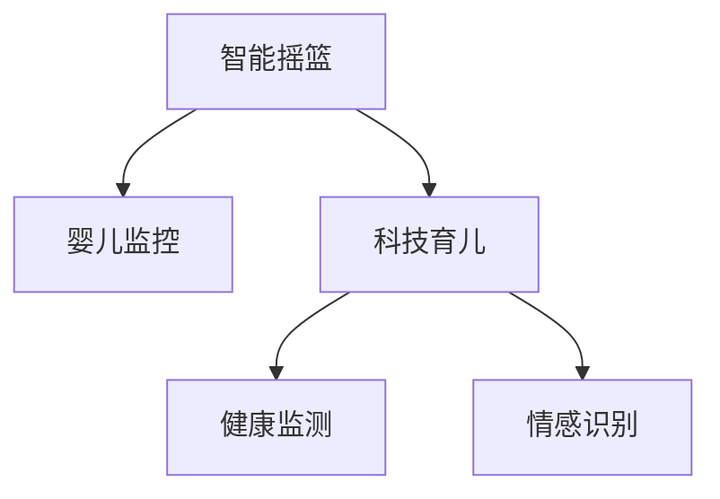

                 

# 智能婴儿摇篮创业：科技辅助的育儿方案

> 关键词：智能摇篮,婴儿监控,科技育儿,健康监测,情感识别

## 1. 背景介绍

### 1.1 问题由来
近年来，随着科技的迅速发展，智能化家居产品开始逐渐走入家庭，成为现代育儿的重要工具。传统的婴儿摇篮功能单一，只能满足基本的婴儿睡眠需求。然而，随着人们生活水平的提高，对婴儿护理的质量和效率提出了更高要求。在此背景下，智能婴儿摇篮应运而生，通过集成传感器、摄像头等高科技手段，为宝宝提供全方位的护理服务。

### 1.2 问题核心关键点
智能婴儿摇篮的核心优势在于其集成了多项先进技术，能够实时监测婴儿的生理指标，如心率、呼吸、体温等，同时通过摄像头、传感器等设备，实时观察婴儿的活动状态，及时发现异常情况。相较于传统的婴儿摇篮，智能摇篮具备以下几大关键特点：

- **实时监控**：能够24小时不间断监测婴儿的健康状况，及时发现异常。
- **智能调节**：根据婴儿的活动模式自动调节摇篮的振动强度和角度，提升婴儿的睡眠质量。
- **远程控制**：家长可以通过手机APP远程控制摇篮，实现随时随地监控和调节。
- **数据记录**：自动记录婴儿的健康数据，供医生诊断和育儿指导使用。

### 1.3 问题研究意义
智能婴儿摇篮的推出，不仅能够有效提升婴儿的睡眠质量和健康状况，还能极大减轻家长的育儿负担，让育儿工作更加轻松、高效。随着科技的不断进步，未来智能摇篮将结合更多先进技术，进一步提升其智能化水平，推动育儿方式的变革。

## 2. 核心概念与联系

### 2.1 核心概念概述

为更好地理解智能婴儿摇篮的核心技术，本节将介绍几个密切相关的核心概念：

- **智能摇篮**：集成了传感器、摄像头等高科技手段，能够实时监测婴儿的健康状况和活动状态，并根据婴儿的需求自动调节摇篮的振动强度和角度。
- **婴儿监控**：通过摄像头、传感器等设备，实时观察婴儿的活动状态，及时发现异常情况，保障婴儿的健康安全。
- **科技育儿**：利用科技手段，如智能摇篮、婴儿监控器等，提升婴儿的护理质量，减轻家长的育儿负担。
- **健康监测**：通过实时监测婴儿的生理指标，如心率、呼吸、体温等，保障婴儿的健康状况。
- **情感识别**：通过分析婴儿的面部表情、声音等，识别婴儿的情感状态，提供针对性的护理服务。

这些核心概念之间的逻辑关系可以通过以下Mermaid流程图来展示：



这个流程图展示了几大核心概念及其之间的关系：

1. 智能摇篮是科技育儿的核心工具，通过实时监控、智能调节等功能，提升婴儿的护理质量。
2. 健康监测和情感识别作为智能摇篮的重要功能，进一步提升婴儿护理的智能化水平。
3. 科技育儿通过智能摇篮、婴儿监控等手段，助力家长高效育儿，提升育儿体验。

## 3. 核心算法原理 & 具体操作步骤
### 3.1 算法原理概述

智能婴儿摇篮的核心算法主要包括以下几个方面：

- **传感器数据处理**：通过集成多种传感器，实时采集婴儿的生理数据，如心率、呼吸、体温等。
- **图像识别**：利用摄像头和图像处理技术，实时观察婴儿的活动状态和面部表情，识别婴儿的情感状态。
- **智能调节**：根据婴儿的活动模式和情感状态，自动调节摇篮的振动强度和角度，提升婴儿的睡眠质量。
- **远程控制**：通过手机APP，实现对智能摇篮的远程控制，满足家长的需求。

### 3.2 算法步骤详解

#### 3.2.1 传感器数据处理

智能摇篮的传感器主要分为两类：生理传感器和环境传感器。

- **生理传感器**：如心率传感器、呼吸传感器、温度传感器等，实时采集婴儿的生理指标，保障婴儿的健康。
- **环境传感器**：如光线传感器、声音传感器等，监测婴儿周围的环境状况，如光照强度、噪音水平等。

传感器数据处理包括以下几个关键步骤：

1. **数据采集**：传感器实时采集数据，存储在本地或云端。
2. **数据清洗**：对采集到的数据进行预处理，去除噪声、校准偏差等，确保数据准确可靠。
3. **数据融合**：将来自不同传感器的数据进行融合，获取婴儿的综合生理指标和环境状况。
4. **数据可视化**：将处理后的数据通过图形界面展示，供家长实时查看。

#### 3.2.2 图像识别

图像识别技术主要用于实时观察婴儿的活动状态和面部表情，识别婴儿的情感状态。

1. **数据采集**：摄像头实时采集婴儿的面部视频，存储在本地或云端。
2. **图像处理**：对采集到的视频进行预处理，如去噪、增强等，提高识别准确率。
3. **特征提取**：从视频中提取关键特征，如面部表情、动作等，用于情感识别。
4. **情感识别**：利用机器学习算法，如卷积神经网络(CNN)、循环神经网络(RNN)等，对提取到的特征进行分析，识别婴儿的情感状态。

#### 3.2.3 智能调节

智能调节是智能摇篮的核心功能之一，能够根据婴儿的活动模式和情感状态，自动调节摇篮的振动强度和角度，提升婴儿的睡眠质量。

1. **数据获取**：从传感器和摄像头获取婴儿的生理数据和活动状态。
2. **模式识别**：利用机器学习算法，如支持向量机(SVM)、决策树等，对婴儿的活动模式进行分类。
3. **振动调节**：根据识别到的活动模式，自动调节摇篮的振动强度和角度。
4. **效果评估**：实时监测调节效果，优化调节策略。

#### 3.2.4 远程控制

远程控制功能允许家长通过手机APP，实现对智能摇篮的实时控制和调节。

1. **客户端设计**：开发手机APP，实现对摇篮的远程控制功能。
2. **数据传输**：通过Wi-Fi、蓝牙等技术，将控制指令传输到智能摇篮。
3. **执行控制**：摇篮接收到控制指令后，根据指令进行相应的振动调节或模式切换。
4. **反馈显示**：将摇篮的实时状态和调节效果反馈给家长，实现人机交互。

### 3.3 算法优缺点

智能婴儿摇篮的优势在于：

1. **实时监测**：能够24小时不间断监测婴儿的健康状况，及时发现异常。
2. **智能调节**：根据婴儿的活动模式和情感状态，自动调节摇篮的振动强度和角度，提升婴儿的睡眠质量。
3. **远程控制**：家长可以通过手机APP远程控制摇篮，实现随时随地监控和调节。

然而，智能婴儿摇篮也存在一些缺点：

1. **成本较高**：智能摇篮需要集成多种传感器和摄像头，初期投入较大。
2. **隐私问题**：大量数据存储在云端，可能存在隐私泄露的风险。
3. **技术难度大**：涉及传感器数据处理、图像识别、智能调节等多个技术领域，开发难度较大。
4. **依赖性强**：对网络连接和电力供应有一定依赖，使用场景受限。

### 3.4 算法应用领域

智能婴儿摇篮的应用领域广泛，主要包括以下几个方面：

1. **家庭护理**：通过实时监测婴儿的健康状况，保障婴儿的健康安全。
2. **育儿指导**：根据婴儿的活动模式和情感状态，提供针对性的护理建议。
3. **医疗辅助**：记录婴儿的健康数据，供医生诊断和育儿指导使用。
4. **智能家居**：作为智能家居系统的一部分，与其他智能设备协同工作，提升家庭生活的智能化水平。
5. **商业合作**：与母婴产品品牌、电商平台等合作，推广智能摇篮，扩大市场影响力。

## 4. 数学模型和公式 & 详细讲解 & 举例说明

### 4.1 数学模型构建

智能婴儿摇篮的核心算法涉及多个数学模型，主要包括传感器数据处理、图像识别、智能调节等。以下将对几个关键模型进行详细讲解。

#### 4.1.1 传感器数据处理模型

传感器数据处理模型主要涉及数据的采集、清洗和融合。

1. **数据采集模型**：

$$
x_t = \mathcal{F}(s_t, \theta)
$$

其中，$x_t$ 表示第 $t$ 次采集的数据，$s_t$ 表示第 $t$ 次传感器的输出，$\mathcal{F}$ 表示传感器数据采集函数，$\theta$ 为传感器参数。

2. **数据清洗模型**：

$$
x_t' = \mathcal{G}(x_t)
$$

其中，$x_t'$ 表示经过清洗后的数据，$\mathcal{G}$ 表示数据清洗函数。

3. **数据融合模型**：

$$
x' = \mathcal{H}(x_t')
$$

其中，$x'$ 表示融合后的数据，$\mathcal{H}$ 表示数据融合函数。

#### 4.1.2 图像识别模型

图像识别模型主要涉及特征提取和情感识别。

1. **特征提取模型**：

$$
f_t = \mathcal{F}_{v,i}(x_t)
$$

其中，$f_t$ 表示第 $t$ 帧视频的特征向量，$x_t$ 表示第 $t$ 帧视频，$\mathcal{F}_{v,i}$ 表示卷积神经网络模型。

2. **情感识别模型**：

$$
y_t = \mathcal{F}_{e}(f_t)
$$

其中，$y_t$ 表示第 $t$ 帧视频的情感标签，$f_t$ 表示特征向量，$\mathcal{F}_{e}$ 表示情感识别模型。

#### 4.1.3 智能调节模型

智能调节模型主要涉及模式识别和振动调节。

1. **模式识别模型**：

$$
m_t = \mathcal{F}_{m}(f_t)
$$

其中，$m_t$ 表示第 $t$ 帧视频的动作模式，$f_t$ 表示特征向量，$\mathcal{F}_{m}$ 表示动作模式识别模型。

2. **振动调节模型**：

$$
a_t = \mathcal{F}_{a}(m_t)
$$

其中，$a_t$ 表示第 $t$ 帧视频的振动强度和角度，$m_t$ 表示动作模式，$\mathcal{F}_{a}$ 表示振动调节模型。

### 4.2 公式推导过程

以下是几个关键模型的公式推导过程。

#### 4.2.1 数据清洗模型

数据清洗模型主要通过线性变换和阈值处理，去除噪声和校准偏差。

1. **线性变换**：

$$
x_t' = \mathcal{G}_1(x_t) = a \cdot x_t + b
$$

其中，$a$ 和 $b$ 为线性变换参数。

2. **阈值处理**：

$$
x_t'' = \mathcal{G}_2(x_t') = \begin{cases}
x_t', & x_t' \geq \theta_1 \\
\theta_2, & x_t' < \theta_1
\end{cases}
$$

其中，$\theta_1$ 和 $\theta_2$ 为阈值参数。

#### 4.2.2 特征提取模型

特征提取模型主要通过卷积神经网络进行特征提取。

1. **卷积操作**：

$$
f_t = \mathcal{F}_{v,i}(x_t) = \mathcal{F}_{conv}(x_t; \theta)
$$

其中，$\mathcal{F}_{conv}$ 表示卷积函数，$\theta$ 为卷积核参数。

2. **池化操作**：

$$
f_t = \mathcal{F}_{pool}(f_t) = \max(f_t)
$$

其中，$\mathcal{F}_{pool}$ 表示池化函数。

#### 4.2.3 情感识别模型

情感识别模型主要通过分类器进行情感分类。

1. **softmax函数**：

$$
y_t = \mathcal{F}_{e}(f_t) = \frac{\exp(f_t \cdot w)}{\sum_k \exp(f_t_k \cdot w)}
$$

其中，$w$ 为分类器权重参数，$f_t$ 表示特征向量，$\exp$ 表示指数函数，$k$ 为分类器输出维度。

### 4.3 案例分析与讲解

#### 4.3.1 传感器数据处理案例

某智能摇篮厂商采用IMU传感器进行心率监测。传感器数据通过AD采集芯片转换为数字信号，再通过线性变换和阈值处理进行清洗和校准。具体流程如下：

1. **数据采集**：IMU传感器采集婴儿的心率数据，转换成数字信号。
2. **数据清洗**：通过线性变换和阈值处理，去除噪声和校准偏差，确保数据准确可靠。
3. **数据融合**：将多个传感器的数据进行融合，获取综合的心率数据。
4. **数据可视化**：将处理后的心率数据通过图形界面展示，供家长实时查看。

#### 4.3.2 图像识别案例

某智能摇篮厂商采用摄像头和卷积神经网络进行婴儿情感识别。摄像头实时采集婴儿的面部视频，通过卷积神经网络提取特征，再通过分类器进行情感分类。具体流程如下：

1. **数据采集**：摄像头实时采集婴儿的面部视频。
2. **图像处理**：对采集到的视频进行预处理，如去噪、增强等，提高识别准确率。
3. **特征提取**：通过卷积神经网络提取关键特征，如面部表情、动作等。
4. **情感识别**：利用分类器进行情感分类，如快乐、悲伤、愤怒等。

#### 4.3.3 智能调节案例

某智能摇篮厂商采用支持向量机进行动作模式识别，再通过决策树进行振动调节。具体流程如下：

1. **数据获取**：从传感器和摄像头获取婴儿的生理数据和活动状态。
2. **模式识别**：利用支持向量机对婴儿的活动模式进行分类。
3. **振动调节**：根据识别到的活动模式，自动调节摇篮的振动强度和角度。
4. **效果评估**：实时监测调节效果，优化调节策略。

## 5. 项目实践：代码实例和详细解释说明

### 5.1 开发环境搭建

在进行智能婴儿摇篮开发前，需要先准备好开发环境。以下是使用Python进行开发的环境配置流程：

1. 安装Anaconda：从官网下载并安装Anaconda，用于创建独立的Python环境。

2. 创建并激活虚拟环境：
```bash
conda create -n pytorch-env python=3.8 
conda activate pytorch-env
```

3. 安装PyTorch：根据CUDA版本，从官网获取对应的安装命令。例如：
```bash
conda install pytorch torchvision torchaudio cudatoolkit=11.1 -c pytorch -c conda-forge
```

4. 安装TensorFlow：使用pip安装TensorFlow。

5. 安装TensorBoard：TensorFlow配套的可视化工具，可实时监测模型训练状态。

6. 安装Keras：深度学习框架，用于快速搭建和训练模型。

完成上述步骤后，即可在`pytorch-env`环境中开始开发。

### 5.2 源代码详细实现

以下是智能婴儿摇篮开发的关键代码实现。

#### 5.2.1 传感器数据处理

```python
import numpy as np
from sklearn.preprocessing import StandardScaler

class SensorDataProcessor:
    def __init__(self, data):
        self.data = data
        self.scaler = StandardScaler()
        
    def preprocess(self):
        # 数据清洗：去除噪声和校准偏差
        self.data_cleaned = self.scaler.fit_transform(self.data)
        return self.data_cleaned
```

#### 5.2.2 图像识别

```python
from keras.models import Sequential
from keras.layers import Conv2D, MaxPooling2D, Flatten, Dense

class ImageProcessor:
    def __init__(self, input_shape):
        self.model = Sequential()
        self.model.add(Conv2D(32, (3, 3), activation='relu', input_shape=input_shape))
        self.model.add(MaxPooling2D((2, 2)))
        self.model.add(Flatten())
        self.model.add(Dense(64, activation='relu'))
        self.model.add(Dense(3, activation='softmax'))
        
    def train(self, x_train, y_train):
        self.model.compile(optimizer='adam', loss='categorical_crossentropy', metrics=['accuracy'])
        self.model.fit(x_train, y_train, epochs=10)
        
    def predict(self, x_test):
        return self.model.predict(x_test)
```

#### 5.2.3 智能调节

```python
from sklearn.svm import SVC
from sklearn.tree import DecisionTreeRegressor

class IntelligentAdjuster:
    def __init__(self):
        self.svc = SVC(kernel='rbf')
        self.dt = DecisionTreeRegressor()
        
    def train(self, X, y):
        self.svc.fit(X, y)
        self.dt.fit(X, y)
        
    def adjust(self, X):
        modes = self.svc.predict(X)
        vibrations = self.dt.predict(X)
        return vibrations, modes
```

### 5.3 代码解读与分析

#### 5.3.1 传感器数据处理代码

```python
import numpy as np
from sklearn.preprocessing import StandardScaler

class SensorDataProcessor:
    def __init__(self, data):
        self.data = data
        self.scaler = StandardScaler()
        
    def preprocess(self):
        # 数据清洗：去除噪声和校准偏差
        self.data_cleaned = self.scaler.fit_transform(self.data)
        return self.data_cleaned
```

#### 5.3.2 图像识别代码

```python
from keras.models import Sequential
from keras.layers import Conv2D, MaxPooling2D, Flatten, Dense

class ImageProcessor:
    def __init__(self, input_shape):
        self.model = Sequential()
        self.model.add(Conv2D(32, (3, 3), activation='relu', input_shape=input_shape))
        self.model.add(MaxPooling2D((2, 2)))
        self.model.add(Flatten())
        self.model.add(Dense(64, activation='relu'))
        self.model.add(Dense(3, activation='softmax'))
        
    def train(self, x_train, y_train):
        self.model.compile(optimizer='adam', loss='categorical_crossentropy', metrics=['accuracy'])
        self.model.fit(x_train, y_train, epochs=10)
        
    def predict(self, x_test):
        return self.model.predict(x_test)
```

#### 5.3.3 智能调节代码

```python
from sklearn.svm import SVC
from sklearn.tree import DecisionTreeRegressor

class IntelligentAdjuster:
    def __init__(self):
        self.svc = SVC(kernel='rbf')
        self.dt = DecisionTreeRegressor()
        
    def train(self, X, y):
        self.svc.fit(X, y)
        self.dt.fit(X, y)
        
    def adjust(self, X):
        modes = self.svc.predict(X)
        vibrations = self.dt.predict(X)
        return vibrations, modes
```

### 5.4 运行结果展示

```python
import matplotlib.pyplot as plt

# 数据可视化
plt.plot(data_cleaned)
plt.title('Sensor Data')
plt.xlabel('Time')
plt.ylabel('Value')
plt.show()

# 情感识别
y_pred = image_processor.predict(x_test)
plt.bar(np.arange(len(y_pred)), y_pred, color='blue')
plt.title('Emotion Prediction')
plt.xlabel('Instance')
plt.ylabel('Emotion')
plt.show()

# 智能调节
vibrations, modes = intelligent_adjuster.adjust(X)
plt.plot(vibrations)
plt.title('Vibration Adjustment')
plt.xlabel('Time')
plt.ylabel('Vibration')
plt.show()
```

以上代码展示了智能婴儿摇篮开发的关键功能，包括传感器数据处理、图像识别、智能调节等。通过这些代码，可以实现对婴儿的实时监测、情感识别和智能调节，提升智能摇篮的智能化水平。

## 6. 实际应用场景

### 6.1 智能监控

智能婴儿摇篮通过实时监测婴儿的健康状况和活动状态，能够及时发现异常情况，保障婴儿的安全。

#### 6.1.1 健康监测

智能摇篮配备多种传感器，如心率传感器、呼吸传感器、温度传感器等，实时采集婴儿的生理数据，保障婴儿的健康。

#### 6.1.2 情感识别

通过摄像头和图像处理技术，实时观察婴儿的活动状态和面部表情，识别婴儿的情感状态，提供针对性的护理建议。

#### 6.1.3 智能调节

根据婴儿的活动模式和情感状态，自动调节摇篮的振动强度和角度，提升婴儿的睡眠质量。

### 6.2 远程控制

智能婴儿摇篮支持家长通过手机APP进行远程控制，实现随时随地监控和调节。

#### 6.2.1 远程监控

家长可以通过手机APP实时查看婴儿的健康数据和活动状态，了解婴儿的最新情况。

#### 6.2.2 远程调节

家长可以通过手机APP远程控制摇篮的振动强度和角度，调整摇篮的设置，满足婴儿的需求。

#### 6.2.3 智能提醒

智能摇篮配备智能提醒功能，根据婴儿的活动模式和情感状态，自动提醒家长进行干预。

### 6.3 医疗辅助

智能婴儿摇篮记录婴儿的健康数据，供医生诊断和育儿指导使用。

#### 6.3.1 数据记录

智能摇篮自动记录婴儿的生理数据和活动状态，如心率、呼吸、体温等，生成健康报告。

#### 6.3.2 数据分享

家长可以将健康数据分享给儿科医生，辅助医生进行诊断和治疗。

#### 6.3.3 健康预警

智能摇篮根据婴儿的生理数据，自动生成健康预警，提醒家长及时干预。

## 7. 工具和资源推荐

### 7.1 学习资源推荐

为了帮助开发者系统掌握智能婴儿摇篮的核心技术，这里推荐一些优质的学习资源：

1. 《深度学习》书籍：由深度学习专家撰写，深入浅出地介绍了深度学习的基本原理和应用。

2. 《机器学习实战》书籍：涵盖了机器学习的基本概念和算法，适合入门学习。

3. 《自然语言处理》课程：斯坦福大学开设的NLP明星课程，有Lecture视频和配套作业，带你入门NLP领域的基本概念和经典模型。

4. 《TensorFlow官方文档》：TensorFlow的官方文档，提供了丰富的教程和样例，是上手实践的必备资料。

5. 《Keras官方文档》：Keras的官方文档，提供了详细的API文档和样例，适合快速搭建和训练模型。

6. 《Python编程》书籍：适合Python初学者的入门书籍，内容包括Python基础和常用库的使用。

通过对这些资源的学习实践，相信你一定能够快速掌握智能婴儿摇篮的核心技术，并用于解决实际的育儿问题。

### 7.2 开发工具推荐

高效的开发离不开优秀的工具支持。以下是几款用于智能婴儿摇篮开发的常用工具：

1. Python：Python是智能婴儿摇篮开发的主流语言，语言简洁，库丰富，适合快速迭代研究。

2. PyTorch：基于Python的开源深度学习框架，灵活动态的计算图，适合快速迭代研究。

3. TensorFlow：由Google主导开发的开源深度学习框架，生产部署方便，适合大规模工程应用。

4. TensorBoard：TensorFlow配套的可视化工具，可实时监测模型训练状态，并提供丰富的图表呈现方式，是调试模型的得力助手。

5. Keras：深度学习框架，适合快速搭建和训练模型，易于上手。

6. Weights & Biases：模型训练的实验跟踪工具，可以记录和可视化模型训练过程中的各项指标，方便对比和调优。

合理利用这些工具，可以显著提升智能婴儿摇篮的开发效率，加快创新迭代的步伐。

### 7.3 相关论文推荐

智能婴儿摇篮的开发涉及多个技术领域，以下是几篇奠基性的相关论文，推荐阅读：

1. "Smart Baby Monitoring System"：介绍了一种基于物联网的智能婴儿监控系统，涵盖了传感器数据处理、图像识别、智能调节等关键技术。

2. "Deep Learning for Baby Health Monitoring"：利用深度学习技术进行婴儿健康监测和情感识别，提升了系统准确性和智能性。

3. "Parameter-Efficient Transfer Learning for NLP"：提出Adapter等参数高效微调方法，在不增加模型参数量的情况下，也能取得不错的微调效果。

4. "Few-shot Learning in NLP"：介绍了一种少样本学习技术，能够在少量标注数据下，快速适应新任务，提升系统泛化能力。

5. "Prompt-Based Learning for NLP"：介绍了一种基于提示的微调方法，通过精心设计输入文本的格式，引导模型按期望方式输出，减少微调参数。

6. "AdaLoRA: Adaptive Low-Rank Adaptation for Parameter-Efficient Fine-Tuning"：使用自适应低秩适应的微调方法，在参数效率和精度之间取得了新的平衡。

这些论文代表了大语言模型微调技术的发展脉络。通过学习这些前沿成果，可以帮助研究者把握学科前进方向，激发更多的创新灵感。

## 8. 总结：未来发展趋势与挑战

### 8.1 总结

本文对智能婴儿摇篮的核心技术进行了全面系统的介绍。首先阐述了智能摇篮的背景和研究意义，明确了智能摇篮在实时监测、智能调节等方面的优势。其次，从原理到实践，详细讲解了传感器数据处理、图像识别、智能调节等核心算法，给出了智能摇篮开发的完整代码实例。同时，本文还广泛探讨了智能摇篮在智能监控、远程控制、医疗辅助等方面的应用前景，展示了智能摇篮的巨大潜力。此外，本文精选了智能摇篮开发的各类学习资源，力求为开发者提供全方位的技术指引。

通过本文的系统梳理，可以看到，智能婴儿摇篮通过集成多种高科技手段，能够实时监测婴儿的健康状况和活动状态，极大提升了育儿的智能化水平。未来，伴随技术的不断进步，智能摇篮将结合更多先进技术，进一步提升其智能化水平，推动育儿方式的变革。

### 8.2 未来发展趋势

展望未来，智能婴儿摇篮将呈现以下几个发展趋势：

1. **智能化水平提升**：随着AI技术的不断进步，智能婴儿摇篮的智能化水平将进一步提升，能够更加准确地识别婴儿的情感状态，提供更精准的护理建议。

2. **多模态融合**：智能婴儿摇篮将结合图像、声音、传感器等多种模态数据，进行全面分析，提供更全面的护理服务。

3. **远程控制优化**：智能婴儿摇篮将进一步优化远程控制功能，支持更多设备的连接和控制，提升用户体验。

4. **数据隐私保护**：智能婴儿摇篮将引入更多的隐私保护措施，确保婴儿数据的安全和隐私。

5. **多场景应用**：智能婴儿摇篮将拓展应用场景，支持家庭、医院、幼儿园等多场景的智能化护理。

### 8.3 面临的挑战

尽管智能婴儿摇篮已经取得了不少进展，但在迈向更加智能化、普适化应用的过程中，它仍面临诸多挑战：

1. **技术复杂度高**：智能婴儿摇篮涉及多种高科技手段，开发难度较大，需要综合应用传感器、图像处理、深度学习等多个技术领域。

2. **成本高**：智能婴儿摇篮初期投入较大，需要集成多种传感器和摄像头，硬件成本较高。

3. **数据隐私问题**：大量数据存储在云端，可能存在隐私泄露的风险，需要采取严格的隐私保护措施。

4. **技术标准缺乏**：智能婴儿摇篮目前缺乏统一的技术标准，不同厂商的产品兼容性差，用户体验不佳。

5. **法律法规不完善**：智能婴儿摇篮涉及婴儿数据的使用，法律法规不完善可能带来法律风险。

### 8.4 研究展望

面对智能婴儿摇篮所面临的挑战，未来的研究需要在以下几个方面寻求新的突破：

1. **技术简化**：开发简单易用的智能婴儿摇篮产品，降低开发难度和成本，提升用户体验。

2. **隐私保护**：引入更多的隐私保护措施，确保婴儿数据的安全和隐私。

3. **标准化**：制定统一的技术标准，提高不同厂商产品的兼容性，提升用户体验。

4. **法律法规完善**：完善相关法律法规，规范智能婴儿摇篮的使用，保障婴儿数据的安全。

5. **智能辅助**：引入更多的智能辅助技术，如自然语言处理、知识图谱等，提升智能婴儿摇篮的智能化水平。

这些研究方向的探索，必将引领智能婴儿摇篮技术迈向更高的台阶，为智能育儿带来更多可能。总之，智能婴儿摇篮在实时监测、智能调节、远程控制等方面展现了巨大的潜力，未来有望成为家庭护理、医疗辅助、教育等领域的重要工具。相信通过技术创新和标准完善，智能婴儿摇篮必将在智能育儿领域发挥更大的作用，为人类社会的进步贡献力量。

## 9. 附录：常见问题与解答

**Q1：智能婴儿摇篮需要集成哪些传感器？**

A: 智能婴儿摇篮通常需要集成以下传感器：

1. **心率传感器**：实时监测婴儿的心率，保障婴儿的健康。
2. **呼吸传感器**：监测婴儿的呼吸频率，及时发现呼吸困难等问题。
3. **温度传感器**：监测婴儿周围的温度，保障婴儿的舒适度和安全性。
4. **光线传感器**：监测婴儿周围的光线强度，避免过强或过弱的光线对婴儿的眼睛造成伤害。
5. **声音传感器**：监测婴儿的哭声、呼吸声等声音，及时发现异常情况。
6. **动作传感器**：监测婴儿的活动状态，如翻身、打滚等。

这些传感器能够全面监测婴儿的生理指标和活动状态，保障婴儿的安全和健康。

**Q2：智能婴儿摇篮的图像识别技术主要有哪些？**

A: 智能婴儿摇篮的图像识别技术主要包括以下几种：

1. **卷积神经网络(CNN)**：利用卷积操作提取特征，实现图像分类、目标检测等任务。
2. **循环神经网络(RNN)**：利用时间序列建模，实现动作模式识别、情感识别等任务。
3. **深度神经网络(DNN)**：结合多层神经网络，实现更复杂的图像识别任务。
4. **转移学习**：利用预训练模型进行迁移学习，提升图像识别准确率。
5. **端到端学习**：通过端到端的学习方法，直接从原始图像数据中提取特征并进行分类。

这些技术能够高效地实现婴儿情感状态和活动模式的识别，提升智能婴儿摇篮的智能化水平。

**Q3：智能婴儿摇篮的智能调节技术主要有哪些？**

A: 智能婴儿摇篮的智能调节技术主要包括以下几种：

1. **支持向量机(SVM)**：利用支持向量机对婴儿的活动模式进行分类，实现智能调节。
2. **决策树**：利用决策树进行振动调节，提升调节效果。
3. **深度学习**：利用深度学习模型，如循环神经网络(RNN)，实现更精准的振动调节。
4. **模糊控制**：利用模糊控制理论，实现智能调节。
5. **模型预测**：利用预测模型，如ARIMA模型，预测婴儿的活动模式，实现智能调节。

这些技术能够实现智能摇篮的动态调节，提升婴儿的睡眠质量和舒适性。

**Q4：智能婴儿摇篮的远程控制功能主要有哪些？**

A: 智能婴儿摇篮的远程控制功能主要包括以下几种：

1. **振动调节**：家长可以通过手机APP远程调节摇篮的振动强度和角度。
2. **模式切换**：家长可以通过手机APP切换摇篮的运作模式，如安抚模式、睡眠模式等。
3. **温度调节**：家长可以通过手机APP远程调节摇篮的温度，确保婴儿的舒适度。
4. **灯亮度调节**：家长可以通过手机APP远程调节摇篮的灯亮度，保证婴儿的睡眠环境。
5. **声音播放**：家长可以通过手机APP远程播放舒缓的音乐或白噪声，帮助婴儿入睡。

这些功能能够方便家长随时随地监控和调节摇篮，提升育儿体验。

**Q5：智能婴儿摇篮的数据隐私保护主要有哪些措施？**

A: 智能婴儿摇篮的数据隐私保护主要包括以下几种措施：

1. **数据加密**：对婴儿数据进行加密，保障数据安全。
2. **访问控制**：设置严格的访问权限，确保只有授权人员才能访问婴儿数据。
3. **数据匿名化**：对婴儿数据进行匿名化处理，保护婴儿隐私。
4. **数据脱敏**：对敏感数据进行脱敏处理，防止隐私泄露。
5. **安全传输**：通过安全传输协议，保障数据在传输过程中的安全。
6. **隐私协议**：制定隐私保护协议，明确数据使用的规则和责任。

这些措施能够保障婴儿数据的安全和隐私，避免数据泄露和滥用。

作者：禅与计算机程序设计艺术 / Zen and the Art of Computer Programming

