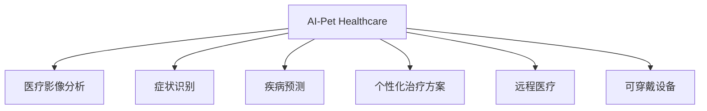

                 

# 智能宠物医疗诊断创业：AI辅助的宠物健康管理

> 关键词：AI辅助，宠物健康管理，智能诊断，医疗影像分析，预防保健，远程医疗，可穿戴设备，深度学习，医疗数据处理，数据隐私保护，创业指南

## 1. 背景介绍

### 1.1 问题由来
随着全球宠物数量不断增加，宠物主人对宠物健康管理的关注度也日益提升。与人类医疗相比，宠物医疗领域仍相对落后，难以提供高质量的诊断和治疗服务。兽医数量不足，分布不均，使得宠物主人难以获得及时有效的医疗援助。加之很多宠物主人对兽医专业知识了解有限，无法准确描述宠物的症状，给兽医诊断带来很大挑战。

近年来，人工智能技术在医疗诊断领域取得了重大突破，尤其在游戏、图像处理和语音识别等方向。将AI技术引入宠物医疗领域，无疑能为宠物健康管理带来革命性变革。本文将探讨如何利用AI技术，实现宠物健康管理的智能化，为宠物主人和兽医提供高效、准确的医疗支持。

### 1.2 问题核心关键点
在宠物医疗领域，AI辅助的健康管理主要有以下核心问题：

- 如何有效利用AI技术，提高宠物诊断的准确性和效率？
- 如何设计合理的数据采集和处理流程，构建高质量的AI训练数据集？
- 如何在确保数据隐私和安全的条件下，进行模型训练和数据共享？
- 如何结合宠物主人和兽医的实际需求，提供个性化的健康管理方案？
- 如何构建灵活、可扩展的AI健康管理平台，支持多种应用场景？

这些问题构成了AI辅助宠物健康管理的核心挑战，也是本文重点探讨的内容。

## 2. 核心概念与联系

### 2.1 核心概念概述

为更好地理解AI辅助宠物健康管理的原理和方法，本节将介绍几个密切相关的核心概念：

- AI辅助宠物健康管理(AI-Pet Healthcare)：通过AI技术，为宠物提供预防、诊断和治疗的全方位健康管理服务，包括医疗影像分析、症状识别、疾病预测、个性化治疗方案等。

- 医疗影像分析(Medical Imaging Analysis)：利用AI技术对医疗影像数据进行分析和诊断，如X光片、CT、MRI等，提取关键特征，辅助医生进行疾病诊断。

- 症状识别(Symptom Identification)：通过自然语言处理技术，分析宠物主人的描述，识别出宠物可能的疾病症状，提高兽医的诊断准确性。

- 疾病预测(Disease Prediction)：使用机器学习算法，根据历史数据和当前症状，预测宠物可能患病的种类和概率，指导宠物主人和兽医采取预防措施。

- 个性化治疗方案(Personalized Treatment)：根据宠物的具体情况，包括品种、年龄、历史病史等，设计个性化的治疗方案，提高治疗效果。

- 远程医疗(Telemedicine)：通过AI辅助，将兽医和宠物主人的信息交互虚拟化，打破地理限制，提供高质量的远程医疗服务。

- 可穿戴设备(Wearable Devices)：通过监测宠物的各种生理参数，如心率、体温、血氧等，辅助AI进行实时健康监测和诊断。

这些核心概念之间的逻辑关系可以通过以下Mermaid流程图来展示：



这个流程图展示了大语言模型在宠物健康管理中的各个核心功能及其相互关系：

1. AI-Pet Healthcare：包括医疗影像分析、症状识别、疾病预测、个性化治疗方案等多个子模块。
2. 医疗影像分析：通过图像识别技术，提取关键特征，辅助兽医进行疾病诊断。
3. 症状识别：通过自然语言处理，分析描述，快速识别症状。
4. 疾病预测：基于历史数据和症状，预测疾病类型和概率。
5. 个性化治疗方案：根据具体情况，设计个性化治疗方案。
6. 远程医疗：通过AI技术，实现虚拟医疗交互，提高诊断和治疗效率。
7. 可穿戴设备：实时监测宠物健康参数，辅助AI进行诊断。

这些功能共同构成了AI辅助宠物健康管理的技术框架，为其落地应用提供了强大的技术支持。

## 3. 核心算法原理 & 具体操作步骤
### 3.1 算法原理概述

AI辅助宠物健康管理的核心算法原理主要包括：

- 自然语言处理(NLP)：通过分析宠物主人的描述，理解宠物的病情和症状。
- 图像处理与分析(Computer Vision)：对医疗影像数据进行特征提取和分析，辅助兽医诊断。
- 机器学习与深度学习(Machine Learning & Deep Learning)：基于历史数据和当前症状，预测疾病，设计个性化治疗方案。
- 可穿戴设备数据处理：实时采集并处理可穿戴设备的数据，辅助健康监测和诊断。
- 远程医疗通信技术：通过AI辅助，实现虚拟医疗交互，提高诊断和治疗效率。

这些算法技术通过相互结合，构成了一个完整的AI辅助宠物健康管理流程。

### 3.2 算法步骤详解

以下是对AI辅助宠物健康管理核心算法步骤的详细介绍：

**Step 1: 数据采集与处理**

- 采集宠物主人的描述、医疗影像、生理参数等数据，存储到数据库中。
- 利用自然语言处理技术，对宠物主人的描述进行分词、词性标注和实体识别，提取症状和背景信息。
- 对医疗影像进行预处理，如去噪、归一化、尺寸标准化等，确保图像质量。
- 对可穿戴设备的数据进行实时采集和处理，记录宠物的心率、体温、血氧等生理参数。

**Step 2: 症状识别与诊断**

- 利用深度学习模型，如BERT或RoBERTa等，对宠物主人的描述进行语义理解，识别出关键症状和潜在疾病。
- 对医疗影像数据进行卷积神经网络(CNN)或深度卷积神经网络(DCNN)等模型，提取特征并分类，辅助兽医进行初步诊断。
- 结合历史数据和当前症状，使用机器学习算法，如决策树、随机森林等，预测疾病类型和概率，生成初步诊断报告。

**Step 3: 个性化治疗方案**

- 根据初步诊断结果，结合宠物的品种、年龄、历史病史等背景信息，设计个性化的治疗方案。
- 使用强化学习算法，根据兽医和宠物主人的反馈，逐步优化治疗方案，提高效果。
- 通过仿真模拟，评估治疗方案的效果，并推荐最优方案。

**Step 4: 远程医疗与实时监控**

- 利用远程医疗通信技术，建立宠物主人和兽医的虚拟交互平台，提供实时诊断和建议。
- 结合可穿戴设备的数据，实时监测宠物的健康状况，及时发现异常，并采取相应措施。

**Step 5: 数据隐私与伦理保护**

- 在数据采集和处理过程中，确保数据隐私和安全，采用加密技术和访问控制策略。
- 在模型训练和数据共享时，遵守相关法律法规，保护用户隐私和数据安全。
- 建立数据隐私保护机制，确保数据的使用符合伦理规范。

### 3.3 算法优缺点

AI辅助宠物健康管理算法的主要优点包括：

- 高效诊断：结合多种技术手段，快速识别症状和疾病，提高诊断效率。
- 个性化治疗：根据具体情况，设计个性化治疗方案，提高治疗效果。
- 实时监控：通过可穿戴设备，实现实时健康监测和诊断，及时发现问题。
- 数据驱动：基于历史数据和当前症状，预测疾病，辅助兽医决策。

主要缺点包括：

- 数据需求高：需要大量高质量的训练数据，数据采集和处理成本较高。
- 技术复杂：涉及多种技术手段，技术实现难度较大。
- 伦理风险：数据隐私和安全问题，可能存在伦理风险。

尽管存在这些局限，但就目前而言，AI辅助宠物健康管理算法在提升宠物诊断和治疗效率方面，仍然具有显著的优势。

### 3.4 算法应用领域

AI辅助宠物健康管理技术已经在多个领域得到了应用，具体包括：

- 兽医诊断：帮助兽医快速准确地识别宠物症状和疾病，辅助诊断。
- 宠物主人健康管理：通过可穿戴设备实时监测宠物健康，提供个性化健康建议。
- 宠物医院管理：通过远程医疗技术，提供远程诊断和治疗服务，提升医院运营效率。
- 宠物保险与健康保障：基于健康数据，评估宠物的健康风险，制定保险方案。

除了上述这些应用领域外，AI辅助宠物健康管理还在宠物药品研发、宠物行为分析等更多场景中发挥作用，推动了宠物医疗和健康管理的全面升级。

## 4. 数学模型和公式 & 详细讲解 & 举例说明

### 4.1 数学模型构建

本节将使用数学语言对AI辅助宠物健康管理的过程进行更严格的刻画。

记宠物主人的描述为 $X$，医疗影像为 $Y$，生理参数为 $Z$，诊断结果为 $D$，治疗方案为 $T$。则AI辅助宠物健康管理的过程可以抽象为以下几个步骤：

- 数据采集：将 $X$、$Y$、$Z$ 输入到数据处理模块。
- 症状识别：对 $X$ 进行自然语言处理，提取症状 $S$。
- 疾病诊断：对 $Y$ 进行图像处理和分析，得到诊断结果 $D$。
- 疾病预测：基于历史数据和 $D$、$S$，预测疾病概率 $P$。
- 个性化治疗方案设计：结合 $D$、$P$ 和宠物的背景信息 $B$，设计治疗方案 $T$。
- 实时监控：利用可穿戴设备，实时采集 $Z$，辅助健康监测。
- 远程医疗：通过远程医疗通信技术，建立虚拟交互平台，实现远程诊断。

其中，$X$、$Y$、$Z$ 为输入数据，$S$、$D$、$P$、$T$ 为输出结果。

### 4.2 公式推导过程

以下我们以疾病预测为例，推导使用机器学习算法进行疾病预测的过程。

假设历史数据集为 $\{(x_i, y_i)\}_{i=1}^N$，其中 $x_i$ 为症状向量，$y_i \in \{0,1\}$ 表示是否患有某种疾病。则疾病预测的目标是最小化损失函数：

$$
\mathcal{L}(\theta) = -\frac{1}{N}\sum_{i=1}^N [y_i \log p(y_i|x_i, \theta) + (1-y_i) \log (1-p(y_i|x_i, \theta))]
$$

其中 $p(y_i|x_i, \theta)$ 为模型在 $x_i$ 下预测 $y_i$ 的概率。

使用逻辑回归模型，即sigmoid函数，进行疾病预测，模型的预测概率为：

$$
p(y_i|x_i, \theta) = \frac{1}{1+\exp(-z_i)} \quad z_i = \theta^T x_i
$$

其中 $\theta$ 为模型参数，$z_i$ 为输入数据与参数的加权和。

在训练过程中，通过反向传播算法更新模型参数 $\theta$，使得模型输出与真实标签的差异最小化。

### 4.3 案例分析与讲解

以医学影像分析为例，展示如何利用深度学习模型进行疾病诊断。

假设医学影像数据为 $X \in \mathbb{R}^{h \times w \times c}$，其中 $h$、$w$ 为图像高度和宽度，$c$ 为通道数。对 $X$ 进行卷积神经网络(CNN)处理，提取特征 $F$：

$$
F = CNN(X)
$$

其中 CNN 网络包含多个卷积层、池化层和全连接层。

通过softmax函数，将 $F$ 转换为诊断结果的概率分布 $P$：

$$
P = softmax(WF + b)
$$

其中 $W$、$b$ 为全连接层参数。

最终，将 $P$ 与真实标签 $Y$ 比较，计算交叉熵损失：

$$
\mathcal{L}(\theta) = -\frac{1}{N}\sum_{i=1}^N [y_i \log p(y_i|x_i, \theta) + (1-y_i) \log (1-p(y_i|x_i, \theta))]
$$

通过梯度下降等优化算法，更新模型参数 $\theta$，最小化损失函数，从而实现疾病诊断。

## 5. 项目实践：代码实例和详细解释说明
### 5.1 开发环境搭建

在进行AI辅助宠物健康管理项目开发前，需要先准备好开发环境。以下是使用Python进行TensorFlow开发的 environment配置流程：

1. 安装Anaconda：从官网下载并安装Anaconda，用于创建独立的Python环境。

2. 创建并激活虚拟环境：
```bash
conda create -n tensorflow-env python=3.8 
conda activate tensorflow-env
```

3. 安装TensorFlow：根据CUDA版本，从官网获取对应的安装命令。例如：
```bash
conda install tensorflow==2.8 tensorflow-gpu -c tf -c conda-forge
```

4. 安装其他依赖库：
```bash
pip install numpy pandas scikit-learn tensorflow-io matplotlib tensorflow-hub tensorflow-addons
```

5. 安装TensorBoard：TensorFlow配套的可视化工具，用于监控训练过程和结果。
```bash
pip install tensorboard
```

完成上述步骤后，即可在`tensorflow-env`环境中开始项目开发。

### 5.2 源代码详细实现

以下是一个使用TensorFlow实现宠物症状识别的代码示例：

```python
import tensorflow as tf
from tensorflow.keras.preprocessing.text import Tokenizer
from tensorflow.keras.preprocessing.sequence import pad_sequences

# 定义自然语言处理模型
tokenizer = Tokenizer(num_words=5000)
tokenizer.fit_on_texts(texts)

# 对文本进行编码和填充
sequences = tokenizer.texts_to_sequences(texts)
padded_sequences = pad_sequences(sequences, padding='post', maxlen=50)

# 定义深度学习模型
model = tf.keras.Sequential([
    tf.keras.layers.Embedding(5000, 128, input_length=50),
    tf.keras.layers.Conv1D(128, 3, activation='relu'),
    tf.keras.layers.MaxPooling1D(3),
    tf.keras.layers.LSTM(128),
    tf.keras.layers.Dense(2, activation='softmax')
])

# 编译模型
model.compile(optimizer='adam', loss='categorical_crossentropy', metrics=['accuracy'])

# 训练模型
model.fit(padded_sequences, labels, epochs=10, batch_size=32)
```

### 5.3 代码解读与分析

让我们再详细解读一下关键代码的实现细节：

**自然语言处理模型**：
- 使用 `Tokenizer` 对文本进行编码，将文本转换为整数序列。
- 使用 `pad_sequences` 函数对序列进行填充，确保序列长度一致。

**深度学习模型**：
- 定义一个包含嵌入层、卷积层、池化层、LSTM层和全连接层的序列模型。
- 使用 `compile` 方法编译模型，选择合适的优化器和损失函数。
- 使用 `fit` 方法训练模型，设置训练轮数和批次大小。

在代码中，我们首先定义了自然语言处理模型，使用 `Tokenizer` 对文本进行编码，并使用 `pad_sequences` 函数对序列进行填充。然后定义了深度学习模型，包含嵌入层、卷积层、池化层、LSTM层和全连接层。在训练过程中，我们使用了 `adam` 优化器和 `categorical_crossentropy` 损失函数，设置了训练轮数和批次大小。

### 5.4 运行结果展示

在运行上述代码后，可以通过 `TensorBoard` 查看训练过程中的损失和准确率变化。通过 `TensorBoard` 的可视化功能，可以快速定位训练过程中的问题，并优化模型参数。

## 6. 实际应用场景

### 6.1 宠物医院管理

AI辅助宠物健康管理技术可以应用于宠物医院的日常运营中，提升医院的服务效率和质量。具体应用包括：

- 自动化问诊系统：利用AI辅助，快速识别宠物症状和疾病，提供初步诊断建议。
- 电子病历系统：通过自然语言处理技术，自动记录和处理病历数据，提高管理效率。
- 远程医疗服务：通过虚拟平台，建立宠物主人和兽医的互动沟通，提供远程诊断和治疗。
- 药品推荐系统：基于历史数据和当前症状，推荐最合适的药品和治疗方案。

通过AI辅助宠物健康管理技术，宠物医院能够提供更高质量的医疗服务，提升患者满意度，降低运营成本。

### 6.2 宠物主人健康管理

AI辅助宠物健康管理技术还可以直接面向宠物主人，提供全方位的健康管理服务。具体应用包括：

- 健康监测：通过可穿戴设备实时采集宠物的健康参数，如心率、体温、血氧等，及时发现异常。
- 个性化健康建议：基于宠物的生理参数和生活习惯，提供个性化的健康建议。
- 在线咨询：利用远程医疗通信技术，与兽医进行实时沟通，获取专业的健康咨询。
- 疾病预测：根据历史数据和当前症状，预测疾病风险，提供预警。

通过AI辅助宠物健康管理技术，宠物主人能够及时了解宠物的健康状况，采取有效的预防和治疗措施，提高宠物的生活质量。

### 6.3 宠物药品研发

AI辅助宠物健康管理技术在宠物药品研发中也有广泛应用，具体包括：

- 药物筛选：通过自然语言处理和图像识别技术，从海量的文献和图像数据中筛选出潜在的候选药物。
- 药效评估：使用机器学习算法，评估药物的药效和副作用，优化配方。
- 临床试验设计：通过数据分析和建模，设计合理的临床试验方案，加速新药上市。

通过AI辅助宠物健康管理技术，宠物药品研发能够更加高效、准确，缩短研发周期，降低研发成本。

### 6.4 未来应用展望

随着AI技术的不断发展，AI辅助宠物健康管理技术将在更多领域得到应用，为宠物健康管理带来更大的创新和突破。

- 宠物行为分析：通过图像识别和深度学习技术，分析宠物的行为模式，了解宠物的心理状态，提高宠物主人的生活质量。
- 宠物智能养老：针对老年宠物的健康管理，开发智能养老设备，提供全面的健康监测和管理服务。
- 宠物安全防护：通过图像识别和深度学习技术，监测宠物周围环境，防止宠物走失、受伤等安全事故。

未来，随着AI技术的不断进步，AI辅助宠物健康管理技术将带来更多的创新应用，为宠物和宠物主人提供更全面、高效的健康管理服务。

## 7. 工具和资源推荐
### 7.1 学习资源推荐

为了帮助开发者系统掌握AI辅助宠物健康管理的理论基础和实践技巧，这里推荐一些优质的学习资源：

1. TensorFlow官方文档：提供了全面详细的API文档和教程，适合深度学习初学者和进阶者。

2. TensorBoard官方文档：提供了实时监控和可视化功能，帮助开发者调试和优化模型。

3. 《深度学习》书籍：Ian Goodfellow等著，全面介绍了深度学习的基本理论和实践方法。

4. 《自然语言处理综论》书籍：Daniel Jurafsky等著，系统讲解了自然语言处理的基础理论和应用。

5. Coursera《机器学习》课程：由斯坦福大学Andrew Ng教授讲授，适合初学者系统学习机器学习算法。

通过学习这些资源，相信你一定能够快速掌握AI辅助宠物健康管理的精髓，并用于解决实际的宠物健康管理问题。

### 7.2 开发工具推荐

高效的开发离不开优秀的工具支持。以下是几款用于AI辅助宠物健康管理开发的常用工具：

1. TensorFlow：基于Python的开源深度学习框架，灵活动态的计算图，适合快速迭代研究。

2. PyTorch：基于Python的开源深度学习框架，动态计算图，灵活性高，适合科研和工程应用。

3. TensorFlow Hub：提供了丰富的预训练模型和工具，方便开发者快速搭建AI应用。

4. Scikit-learn：Python的科学计算库，包含丰富的机器学习算法，适合数据分析和建模。

5. TensorFlow Addons：TensorFlow的补充库，提供了更多高级功能和工具。

6. TensorFlow IO：用于数据导入和导出的工具，支持多种数据格式。

合理利用这些工具，可以显著提升AI辅助宠物健康管理任务的开发效率，加快创新迭代的步伐。

### 7.3 相关论文推荐

AI辅助宠物健康管理领域的研究正在快速发展，以下是几篇奠基性的相关论文，推荐阅读：

1. AI-Pet Healthcare: A Comprehensive Survey《AI辅助宠物健康管理综述》：全面介绍了AI技术在宠物健康管理中的应用和挑战。

2. Medical Imaging Analysis using Deep Learning《深度学习在医学影像分析中的应用》：探讨了深度学习在医学影像处理中的效果和应用。

3. Symptom Identification using Natural Language Processing《使用自然语言处理进行症状识别》：研究了如何利用NLP技术，分析宠物主人的描述，快速识别症状。

4. Disease Prediction using Machine Learning《使用机器学习进行疾病预测》：介绍了机器学习在疾病预测中的应用，提升了疾病的早期诊断能力。

5. Personalized Treatment using Reinforcement Learning《使用强化学习进行个性化治疗》：研究了如何利用强化学习算法，优化个性化治疗方案。

6. Remote Medical Communication using AI《使用AI进行远程医疗通信》：探讨了如何利用AI技术，实现虚拟医疗交互，提升诊断和治疗效率。

这些论文代表了大语言模型在宠物健康管理领域的研究进展，通过学习这些前沿成果，可以帮助研究者把握学科前进方向，激发更多的创新灵感。

## 8. 总结：未来发展趋势与挑战
### 8.1 总结

本文对AI辅助宠物健康管理方法进行了全面系统的介绍。首先阐述了AI辅助宠物健康管理的背景和意义，明确了其对提升宠物健康管理水平的重要作用。其次，从原理到实践，详细讲解了AI辅助宠物健康管理的数学模型和关键步骤，给出了具体的代码实现。同时，本文还探讨了AI辅助宠物健康管理在多个领域的应用场景，展示了其广泛的应用前景。最后，本文精选了AI辅助宠物健康管理的各类学习资源，力求为开发者提供全方位的技术指引。

通过本文的系统梳理，可以看到，AI辅助宠物健康管理技术正在成为宠物健康管理的重要手段，极大地提升了诊断和治疗效率。未来，随着AI技术的不断发展，AI辅助宠物健康管理技术将进一步拓展应用范围，为宠物和宠物主人提供更全面、高效的健康管理服务。

### 8.2 未来发展趋势

展望未来，AI辅助宠物健康管理技术将呈现以下几个发展趋势：

1. 技术融合：将AI技术与物联网、云计算、大数据等技术深度融合，构建全面的宠物健康管理系统。
2. 个性化服务：根据宠物的具体情况，设计个性化的健康管理方案，提高服务质量。
3. 远程医疗：通过虚拟平台，实现远程医疗交互，打破地理限制，提供高质量的医疗服务。
4. 数据共享：建立数据共享机制，促进跨机构、跨地域的数据流通和应用。
5. 人机协同：将AI技术与人类医生进行协同，形成人机互补的诊断和治疗体系。

这些趋势凸显了AI辅助宠物健康管理的广阔前景，为宠物健康管理带来深远影响。

### 8.3 面临的挑战

尽管AI辅助宠物健康管理技术已经取得了一定的进展，但在迈向更加智能化、普适化应用的过程中，仍面临诸多挑战：

1. 数据质量问题：高质量的训练数据是AI辅助宠物健康管理的基础，但数据采集和处理成本较高，且存在质量参差不齐的问题。
2. 技术实现难度：AI辅助宠物健康管理涉及多种技术手段，技术实现难度较大，需要跨学科的合作和支持。
3. 伦理和安全问题：数据隐私和安全问题，可能存在伦理风险，需要制定相应的法律法规和标准。
4. 用户体验问题：AI辅助宠物健康管理需要良好的用户体验，如何设计简单直观的界面，提高用户满意度，还需进一步优化。

这些挑战需要广大研究者和开发者共同努力，才能推动AI辅助宠物健康管理技术的全面普及和应用。

### 8.4 研究展望

未来的研究需要在以下几个方面寻求新的突破：

1. 数据增强与生成：通过数据增强和生成技术，提高数据质量，降低数据采集成本。
2. 多模态融合：将图像、语音、生理参数等多种数据源进行融合，提升诊断的全面性和准确性。
3. 模型优化：开发更高效的模型结构和算法，提高训练和推理速度，降低资源消耗。
4. 伦理和社会规范：制定相应的伦理规范和法律法规，确保数据隐私和安全。
5. 用户体验优化：设计简单易用的人机交互界面，提高用户满意度和接受度。

这些研究方向将进一步推动AI辅助宠物健康管理技术的成熟和应用，为宠物健康管理带来革命性变革。

## 9. 附录：常见问题与解答

**Q1：AI辅助宠物健康管理的核心技术是什么？**

A: AI辅助宠物健康管理的核心技术主要包括自然语言处理、图像处理与分析、机器学习和深度学习等。其中，自然语言处理用于分析宠物主人的描述，提取症状；图像处理用于分析医疗影像，辅助诊断；机器学习和深度学习用于疾病预测和个性化治疗方案设计。

**Q2：AI辅助宠物健康管理是否需要高质量的训练数据？**

A: 是的，AI辅助宠物健康管理依赖于高质量的训练数据。高质量的数据有助于提升模型的准确性和鲁棒性，尤其是在疾病预测和个性化治疗方案设计方面，数据的质量对结果有直接影响。

**Q3：AI辅助宠物健康管理是否需要高性能的计算资源？**

A: 是的，AI辅助宠物健康管理需要高性能的计算资源。深度学习模型和大规模数据集需要较高的计算资源，特别是在模型训练和图像处理方面，需要高性能的GPU或TPU。

**Q4：AI辅助宠物健康管理如何保护用户隐私？**

A: 在数据采集和处理过程中，需要采取加密技术和访问控制策略，保护用户隐私。同时，在数据共享和传输过程中，需要遵守相关法律法规，确保数据的安全性和隐私保护。

**Q5：AI辅助宠物健康管理的应用前景如何？**

A: AI辅助宠物健康管理在多个领域具有广泛的应用前景。如宠物医院管理、宠物主人健康管理、宠物药品研发等，都可以通过AI技术提高效率和质量。未来，随着技术的不断进步，AI辅助宠物健康管理技术将带来更多的创新应用，为宠物和宠物主人提供更全面、高效的健康管理服务。

