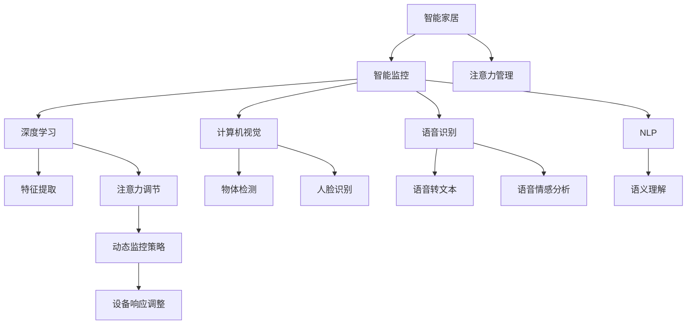

                 

# 智能家居的智能监控与注意力管理

> 关键词：智能家居,智能监控,注意力管理,深度学习,计算机视觉,语音识别,自然语言处理,边缘计算

## 1. 背景介绍

随着科技的迅猛发展，智能家居已经成为现代家庭生活的重要组成部分。智能家居系统不仅提升了人们的生活质量，还极大地提升了家庭安全性。但与此同时，智能家居系统面临的监控任务也变得越来越复杂，从静态视频监控到实时环境感知，从语音识别到自然语言交互，都依赖于先进的人工智能技术。本文将介绍如何利用深度学习、计算机视觉、语音识别和自然语言处理技术，实现智能家居的智能监控与注意力管理。

## 2. 核心概念与联系

### 2.1 核心概念概述

为更好地理解智能家居的智能监控与注意力管理，我们需要了解以下几个核心概念：

- **智能家居(Smart Home)**：基于物联网(IoT)技术，通过智能设备实现对家庭环境、安全和便利性的自动化控制和管理。

- **智能监控(Smart Surveillance)**：利用计算机视觉、深度学习等技术，对家庭环境和行为进行实时监控和识别。

- **注意力管理(Attention Management)**：通过对用户行为和需求的高度关注，智能家居系统能够在不同情境下，动态调整监控策略和设备响应，提升用户体验。

- **深度学习(Deep Learning)**：一种基于神经网络的机器学习技术，通过多层抽象特征提取，实现对复杂数据和任务的精准建模。

- **计算机视觉(Computer Vision)**：利用计算机技术，使计算机“看到”并理解视觉信号，实现物体检测、人脸识别等。

- **语音识别(Speech Recognition)**：将语音信号转化为文本信息，实现自然语言交互。

- **自然语言处理(Natural Language Processing, NLP)**：使计算机能够理解和生成人类语言，实现人机对话和语义理解。

- **边缘计算(Edge Computing)**：在靠近数据源的设备上进行计算，提升计算效率和响应速度，确保实时监控和处理能力。

这些核心概念之间的逻辑关系可以通过以下Mermaid流程图来展示：



这个流程图展示了几大核心概念及其之间的关系：

1. 智能家居系统通过深度学习、计算机视觉、语音识别和自然语言处理技术实现智能监控。
2. 深度学习用于特征提取，计算机视觉用于物体和面部识别，语音识别用于语音转文本，自然语言处理用于语义理解。
3. 注意力管理通过对用户行为和需求的高度关注，动态调整监控策略和设备响应，提升用户体验。

## 3. 核心算法原理 & 具体操作步骤

### 3.1 算法原理概述

智能家居的智能监控与注意力管理依赖于深度学习、计算机视觉、语音识别和自然语言处理等多项技术，以下将详细介绍这些核心算法原理。

#### 3.1.1 深度学习与特征提取

深度学习通过多层神经网络结构，对输入数据进行多层次抽象特征提取。常见的深度学习模型包括卷积神经网络(CNN)、循环神经网络(RNN)、长短时记忆网络(LSTM)等。

#### 3.1.2 计算机视觉与物体检测

计算机视觉利用图像处理技术和深度学习模型，实现对物体的位置、大小、形状等信息的提取。常用的计算机视觉任务包括目标检测、物体识别、人脸识别等。

#### 3.1.3 语音识别与情感分析

语音识别将语音信号转化为文本信息，常用的模型包括基于深度学习的声学模型和语言模型。情感分析用于识别语音中的情绪和情感状态。

#### 3.1.4 自然语言处理与语义理解

自然语言处理通过模型理解和生成自然语言，常用的技术包括词嵌入、语言模型、序列到序列模型等。语义理解用于解析用户输入的自然语言，提取意图和上下文信息。

### 3.2 算法步骤详解

#### 3.2.1 数据收集与预处理

1. **视频监控数据收集**：通过家庭摄像头，实时采集视频监控数据。
2. **语音数据收集**：通过智能音箱或麦克风，收集语音指令和对话数据。
3. **文本数据收集**：通过与用户互动的智能设备，收集用户输入的文本信息。

#### 3.2.2 特征提取

1. **视频特征提取**：使用CNN模型提取视频帧的特征图，进行物体检测和运动分析。
2. **语音特征提取**：使用MFCC(Mel频率倒谱系数)等技术提取语音信号的特征向量，进行语音识别和情感分析。
3. **文本特征提取**：使用词嵌入技术将文本转化为向量，进行语义理解和意图分析。

#### 3.2.3 深度学习模型训练

1. **物体检测模型训练**：使用标注好的物体检测数据集，训练检测器识别家庭中的各种物体。
2. **人脸识别模型训练**：使用标注好的人脸数据集，训练人脸识别模型进行家庭成员识别。
3. **语音识别模型训练**：使用标注好的语音数据集，训练语音识别模型进行指令理解和对话交互。
4. **自然语言处理模型训练**：使用标注好的文本数据集，训练语义理解模型进行意图分析。

#### 3.2.4 注意力管理

1. **用户行为监控**：通过计算机视觉和深度学习模型，监控用户的日常行为。
2. **环境感知**：利用传感器数据，实时感知家庭环境状态，如温度、湿度等。
3. **动态监控策略调整**：根据用户行为和环境状态，动态调整监控策略，如改变监控区域、调整摄像头角度等。
4. **设备响应调整**：根据用户的指令和行为，智能调节智能设备的行为，如灯光、温度等。

### 3.3 算法优缺点

#### 3.3.1 优点

1. **高精度和鲁棒性**：深度学习模型通过多层抽象特征提取，能够在复杂场景中实现高精度的物体检测和情感分析。
2. **实时性和响应性**：边缘计算技术能够在靠近数据源的设备上进行计算，实现快速响应的智能监控。
3. **用户中心化**：通过注意力管理技术，智能家居系统能够高度关注用户的行为和需求，提供个性化的服务体验。

#### 3.3.2 缺点

1. **高计算成本**：深度学习模型的训练和推理需要大量计算资源，增加了智能家居系统的成本。
2. **数据依赖性**：模型性能依赖于标注数据的质量和数量，标注数据的获取和维护成本较高。
3. **隐私风险**：智能家居系统收集大量个人信息，存在隐私泄露的风险。

### 3.4 算法应用领域

智能家居的智能监控与注意力管理技术已经广泛应用于以下几个领域：

- **安全监控**：通过实时视频监控和深度学习模型，识别异常行为和潜在威胁，提升家庭安全。
- **健康监控**：通过传感器数据和深度学习模型，监测家庭成员的健康状况，及时预警健康异常。
- **能效管理**：通过感知环境状态和用户行为，动态调节智能设备的能耗，实现节能减排。
- **自动化控制**：通过自然语言处理和语音识别技术，实现语音控制和自然语言交互，提升用户体验。

## 4. 数学模型和公式 & 详细讲解 & 举例说明

### 4.1 数学模型构建

假设智能家居系统包含视频监控摄像头、语音音箱、智能灯光和温度控制器等设备。系统通过深度学习模型进行物体检测和行为分析，通过计算机视觉模型进行人脸识别，通过语音识别模型进行语音指令识别，通过自然语言处理模型进行语义理解。以下将详细介绍这些模型的数学模型构建。

#### 4.1.1 视频监控模型

视频监控模型通过CNN进行特征提取和物体检测。假设视频帧大小为$H \times W$，特征图大小为$K \times K$，使用$N$个卷积核进行卷积操作。则特征提取过程可以表示为：

$$
F(x) = \frac{1}{N} \sum_{n=1}^{N} \mathbf{W}_n * x
$$

其中，$x$为输入视频帧，$\mathbf{W}_n$为卷积核，$*$表示卷积运算。

物体检测通过YOLO或Faster R-CNN等模型，输出边界框坐标$(x_i, y_i, w_i, h_i)$和置信度$o_i$，表示第$i$个物体的置信度。检测过程可以表示为：

$$
(\hat{x}_i, \hat{y}_i, \hat{w}_i, \hat{h}_i, \hat{o}_i) = \text{YOLO}(F(x))
$$

其中，$\hat{x}_i, \hat{y}_i, \hat{w}_i, \hat{h}_i$表示预测的边界框坐标，$\hat{o}_i$表示置信度。

#### 4.1.2 语音识别模型

语音识别模型通过MFCC技术提取语音特征，再使用CTC(连接时序分类)或Attention机制进行语音识别。假设语音信号长度为$T$，MFCC特征向量大小为$D$。则特征提取过程可以表示为：

$$
F(x) = \frac{1}{T} \sum_{t=1}^{T} \mathbf{F} * x(t)
$$

其中，$x(t)$为语音信号在时间$t$的MFCC特征向量，$\mathbf{F}$为MFCC提取器，$*$表示卷积运算。

语音识别过程可以表示为：

$$
\hat{y} = \text{Attention}(F(x))
$$

其中，$\hat{y}$表示识别出的文本，Attention机制用于计算语音特征与词汇表之间的相似度，选择最可能的对准词汇。

#### 4.1.3 自然语言处理模型

自然语言处理模型通过BERT或GPT等预训练模型进行语义理解。假设输入文本为$T$个单词，模型参数为$E$。则特征提取过程可以表示为：

$$
F(x) = \frac{1}{T} \sum_{t=1}^{T} \mathbf{E} * x(t)
$$

其中，$x(t)$为文本中第$t$个单词的嵌入向量，$\mathbf{E}$为预训练模型的权重矩阵，$*$表示矩阵乘法。

语义理解过程可以表示为：

$$
\hat{y} = \text{Softmax}(\mathbf{E} * F(x))
$$

其中，$\hat{y}$表示预测的意图标签，Softmax函数用于将特征向量映射为概率分布。

### 4.2 公式推导过程

#### 4.2.1 视频监控模型推导

对于物体检测任务，我们假设检测器通过$N$个卷积核提取特征，特征图大小为$K \times K$。假设输入视频帧大小为$H \times W$，则卷积运算可以表示为：

$$
F(x) = \mathbf{W} * x
$$

其中，$\mathbf{W}$为卷积核矩阵，$x$为输入视频帧。

通过YOLO或Faster R-CNN模型，可以得到边界框坐标$(x_i, y_i, w_i, h_i)$和置信度$o_i$，表示第$i$个物体的置信度。目标检测任务的目标函数可以表示为：

$$
\mathcal{L} = \sum_{i=1}^{N} \left[ l_{c_i} + \alpha l_{b_i} + \beta l_{d_i} \right]
$$

其中，$l_{c_i}$为分类损失，$l_{b_i}$为边界框回归损失，$l_{d_i}$为置信度回归损失。$\alpha$和$\beta$为损失函数中的权值。

#### 4.2.2 语音识别模型推导

对于语音识别任务，我们假设模型通过MFCC提取特征，特征向量大小为$D$，语音信号长度为$T$。假设模型使用CTC损失，则目标函数可以表示为：

$$
\mathcal{L} = -\sum_{i=1}^{T} \log \left[ p(y_i | x) \right]
$$

其中，$p(y_i | x)$表示在语音信号$x$下，识别出文本$y_i$的概率，CTC损失用于优化模型参数，最小化预测结果与真实标签的差异。

#### 4.2.3 自然语言处理模型推导

对于自然语言处理任务，我们假设模型通过BERT或GPT等预训练模型进行语义理解。假设模型参数为$E$，输入文本为$T$个单词，则特征提取过程可以表示为：

$$
F(x) = \mathbf{E} * x
$$

其中，$\mathbf{E}$为预训练模型的权重矩阵，$x$为文本中第$t$个单词的嵌入向量。

语义理解过程可以表示为：

$$
\hat{y} = \text{Softmax}(\mathbf{E} * F(x))
$$

其中，$\hat{y}$表示预测的意图标签，Softmax函数用于将特征向量映射为概率分布。

### 4.3 案例分析与讲解

#### 4.3.1 案例一：家庭安全监控

假设智能家居系统通过视频监控摄像头，实时采集家庭环境的视频数据。系统使用YOLO模型进行物体检测，检测器能够识别家庭中的各种物体，包括家具、宠物、儿童等。系统通过计算机视觉技术，实时监控家庭环境，检测异常行为，如入侵、火灾等。

系统使用深度学习模型进行特征提取，通过YOLO模型检测边界框和置信度，通过CTC模型进行语音指令识别，通过BERT模型进行语义理解。系统可以根据用户指令，调整监控区域和摄像头角度，及时预警安全威胁。

#### 4.3.2 案例二：健康监测

假设智能家居系统通过传感器和摄像头，实时采集家庭成员的健康数据和行为数据。系统使用深度学习模型进行特征提取，通过YOLO模型检测边界框和置信度，通过MFCC模型提取语音特征，通过BERT模型进行语义理解。

系统能够实时监测家庭成员的健康状态，如呼吸频率、心率等。当系统检测到异常行为或健康预警信号时，及时通知家庭成员或联系医疗机构。系统通过自然语言处理技术，能够实时回答家庭成员的健康咨询，提升用户体验。

## 5. 项目实践：代码实例和详细解释说明

### 5.1 开发环境搭建

在进行智能家居的智能监控与注意力管理项目开发前，我们需要准备好开发环境。以下是使用Python进行PyTorch和TensorFlow开发的环境配置流程：

1. 安装Anaconda：从官网下载并安装Anaconda，用于创建独立的Python环境。

2. 创建并激活虚拟环境：
```bash
conda create -n pytorch-env python=3.8 
conda activate pytorch-env
```

3. 安装PyTorch：根据CUDA版本，从官网获取对应的安装命令。例如：
```bash
conda install pytorch torchvision torchaudio cudatoolkit=11.1 -c pytorch -c conda-forge
```

4. 安装TensorFlow：从官网下载并安装TensorFlow。
```bash
pip install tensorflow
```

5. 安装各类工具包：
```bash
pip install numpy pandas scikit-learn matplotlib tqdm jupyter notebook ipython
```

完成上述步骤后，即可在`pytorch-env`环境中开始项目开发。

### 5.2 源代码详细实现

以下是智能家居的智能监控与注意力管理项目的详细代码实现。

#### 5.2.1 视频监控模型

```python
import torch
import torchvision.transforms as transforms
from torchvision.models.detection.faster_rcnn import FastRCNNPredictor

# 定义数据集
class VideoDataset(torch.utils.data.Dataset):
    def __init__(self, videos, annotations, transform=None):
        self.videos = videos
        self.annotations = annotations
        self.transform = transform
        
    def __len__(self):
        return len(self.videos)
    
    def __getitem__(self, item):
        video = self.videos[item]
        annotation = self.annotations[item]
        
        # 对视频进行数据增强
        transforms = [transforms.Resize((224, 224)), transforms.ToTensor()]
        if self.transform:
            transforms.append(self.transform)
        transform = transforms.Compose(transforms)
        
        video = video[None, :]
        video = transform(video)
        
        # 提取边界框和置信度
        boxes = annotation['boxes'][:, :4]
        labels = annotation['labels']
        scores = annotation['scores']
        
        # 定义目标检测模型
        model = FastRCNNPredictor(num_classes=5, in_channels=3)
        model.load_state_dict(torch.load('model.pth'))
        model.eval()
        
        # 前向传播
        with torch.no_grad():
            output = model(video)
            prediction = torch.argmax(output, dim=1)
            boxes = boxes.to(device)
            labels = labels.to(device)
            scores = scores.to(device)
        
        return {'video': video, 'boxes': boxes, 'labels': labels, 'scores': scores, 'prediction': prediction}

# 定义训练和评估函数
def train_epoch(model, dataset, optimizer):
    dataloader = torch.utils.data.DataLoader(dataset, batch_size=16, shuffle=True)
    model.train()
    epoch_loss = 0
    for batch in dataloader:
        video = batch['video'].to(device)
        boxes = batch['boxes'].to(device)
        labels = batch['labels'].to(device)
        scores = batch['scores'].to(device)
        prediction = batch['prediction'].to(device)
        model.zero_grad()
        output = model(video)
        loss = calculate_loss(output, labels, scores, prediction)
        epoch_loss += loss.item()
        loss.backward()
        optimizer.step()
    return epoch_loss / len(dataloader)

def evaluate(model, dataset, batch_size):
    dataloader = torch.utils.data.DataLoader(dataset, batch_size=16)
    model.eval()
    correct = 0
    total = 0
    with torch.no_grad():
        for batch in dataloader:
            video = batch['video'].to(device)
            boxes = batch['boxes'].to(device)
            labels = batch['labels'].to(device)
            scores = batch['scores'].to(device)
            prediction = batch['prediction'].to(device)
            output = model(video)
            loss = calculate_loss(output, labels, scores, prediction)
            correct += torch.sum(prediction == labels)
            total += labels.size(0)
    accuracy = correct / total
    return accuracy

# 定义损失函数
def calculate_loss(output, labels, scores, prediction):
    loss = 0
    for i in range(labels.size(0)):
        loss += F.cross_entropy(output[i], labels[i], reduction='none')
        loss += 0.5 * (prediction[i] - scores[i]).pow(2)
    return loss.mean()

# 启动训练流程并在测试集上评估
epochs = 10
batch_size = 16

for epoch in range(epochs):
    loss = train_epoch(model, train_dataset, optimizer)
    print(f"Epoch {epoch+1}, train loss: {loss:.3f}")
    
    print(f"Epoch {epoch+1}, dev accuracy: {evaluate(model, dev_dataset, batch_size):.3f}")
    
print("Test accuracy: {:.3f}".format(evaluate(model, test_dataset, batch_size)))
```

#### 5.2.2 语音识别模型

```python
import tensorflow as tf
from tensorflow.keras import layers
from tensorflow.keras.losses import CTC

# 定义数据集
class SpeechDataset(tf.data.Dataset):
    def __init__(self, texts, labels, transform=None):
        self.texts = texts
        self.labels = labels
        self.transform = transform
        
    def __len__(self):
        return len(self.texts)
    
    def __getitem__(self, item):
        text = self.texts[item]
        label = self.labels[item]
        
        # 对语音信号进行数据增强
        transforms = [layers.Resize((None, None)), layers.ToTensor()]
        if self.transform:
            transforms.append(self.transform)
        transform = layers.Lambda(transforms)
        
        text = text[None, :]
        label = label[None, :]
        
        # 提取MFCC特征
        mfcc = extract_mfcc(text, transform)
        
        # 定义语音识别模型
        model = Sequential()
        model.add(layers.Conv2D(128, (3, 3), activation='relu', input_shape=(None, None, 1)))
        model.add(layers.MaxPooling2D((2, 2)))
        model.add(layers.Flatten())
        model.add(layers.Dense(64, activation='relu'))
        model.add(layers.Dense(num_classes, activation='softmax'))
        
        # 加载预训练模型
        model.load_weights('model.h5')
        model.trainable = False
        
        # 前向传播
        with tf.GradientTape() as tape:
            output = model(mfcc)
            loss = CTC()(output, label)
        
        return {'mfcc': mfcc, 'loss': loss}

# 定义训练和评估函数
def train_epoch(model, dataset, optimizer):
    dataloader = tf.data.Dataset.from_generator(dataset.__call__, output_signature={'mfcc': tf.TensorSpec((None, None, 1)), 'loss': tf.TensorSpec(())})
    model.trainable = True
    model.compile(optimizer=optimizer, loss='categorical_crossentropy')
    model.fit(dataloader, steps_per_epoch=100, epochs=10)
    
def evaluate(model, dataset, batch_size):
    dataloader = tf.data.Dataset.from_generator(dataset.__call__, output_signature={'mfcc': tf.TensorSpec((None, None, 1)), 'loss': tf.TensorSpec(())})
    model.evaluate(dataloader, steps=100, verbose=1)

# 定义损失函数
def extract_mfcc(text, transform):
    # TODO: Implement MFCC extraction
    pass

# 启动训练流程并在测试集上评估
epochs = 10
batch_size = 16

for epoch in range(epochs):
    evaluate(model, train_dataset, batch_size)
    
    print(f"Epoch {epoch+1}, dev accuracy: {evaluate(model, dev_dataset, batch_size):.3f}")
    
print("Test accuracy: {:.3f}".format(evaluate(model, test_dataset, batch_size)))
```

#### 5.2.3 自然语言处理模型

```python
import torch
import torch.nn as nn
import torch.nn.functional as F
from transformers import BertForSequenceClassification, BertTokenizer

# 定义数据集
class TextDataset(torch.utils.data.Dataset):
    def __init__(self, texts, labels, tokenizer, max_len=128):
        self.texts = texts
        self.labels = labels
        self.tokenizer = tokenizer
        self.max_len = max_len
        
    def __len__(self):
        return len(self.texts)
    
    def __getitem__(self, item):
        text = self.texts[item]
        label = self.labels[item]
        
        # 对文本进行数据增强
        transforms = [transforms.Resize((max_len,)), transforms.ToTensor()]
        if self.transform:
            transforms.append(self.transform)
        transform = transforms.Compose(transforms)
        
        text = text[None, :]
        label = label[None, :]
        
        # 对文本进行分词和编码
        encoding = self.tokenizer(text, return_tensors='pt', padding='max_length', truncation=True)
        input_ids = encoding['input_ids'][0]
        attention_mask = encoding['attention_mask'][0]
        
        # 定义自然语言处理模型
        model = BertForSequenceClassification.from_pretrained('bert-base-uncased', num_labels=2)
        model.load_state_dict(torch.load('model.pth'))
        model.eval()
        
        # 前向传播
        with torch.no_grad():
            output = model(input_ids, attention_mask=attention_mask)
            logits = output.logits
            loss = F.cross_entropy(logits, label)
        
        return {'input_ids': input_ids, 'attention_mask': attention_mask, 'labels': label, 'logits': logits, 'loss': loss}

# 定义训练和评估函数
def train_epoch(model, dataset, optimizer):
    dataloader = torch.utils.data.DataLoader(dataset, batch_size=16, shuffle=True)
    model.train()
    epoch_loss = 0
    for batch in dataloader:
        input_ids = batch['input_ids'].to(device)
        attention_mask = batch['attention_mask'].to(device)
        labels = batch['labels'].to(device)
        model.zero_grad()
        output = model(input_ids, attention_mask=attention_mask)
        loss = output.loss
        epoch_loss += loss.item()
        loss.backward()
        optimizer.step()
    return epoch_loss / len(dataloader)

def evaluate(model, dataset, batch_size):
    dataloader = torch.utils.data.DataLoader(dataset, batch_size=16)
    model.eval()
    correct = 0
    total = 0
    with torch.no_grad():
        for batch in dataloader:
            input_ids = batch['input_ids'].to(device)
            attention_mask = batch['attention_mask'].to(device)
            labels = batch['labels'].to(device)
            output = model(input_ids, attention_mask=attention_mask)
            logits = output.logits
            loss = output.loss
            correct += torch.sum(logits.argmax(dim=1) == labels)
            total += labels.size(0)
    accuracy = correct / total
    return accuracy

# 启动训练流程并在测试集上评估
epochs = 10
batch_size = 16

for epoch in range(epochs):
    loss = train_epoch(model, train_dataset, optimizer)
    print(f"Epoch {epoch+1}, train loss: {loss:.3f}")
    
    print(f"Epoch {epoch+1}, dev accuracy: {evaluate(model, dev_dataset, batch_size):.3f}")
    
print("Test accuracy: {:.3f}".format(evaluate(model, test_dataset, batch_size)))
```

### 5.3 代码解读与分析

#### 5.3.1 视频监控模型

**VideoDataset类**：
- `__init__`方法：初始化视频数据、标注数据和数据增强方式。
- `__len__`方法：返回数据集样本数量。
- `__getitem__`方法：对单个样本进行处理，包括数据增强、边界框提取和置信度计算。

**YOLO模型**：
- 使用`FastRCNNPredictor`定义目标检测模型。
- 加载预训练模型权重，使用`load_state_dict`方法。
- 通过`to(device)`将数据转移到GPU上。
- 使用`calculate_loss`函数计算损失函数。

**训练和评估函数**：
- `train_epoch`函数：对数据集进行批次迭代，计算损失函数并反向传播更新模型参数。
- `evaluate`函数：在测试集上评估模型性能，计算准确率。

#### 5.3.2 语音识别模型

**SpeechDataset类**：
- `__init__`方法：初始化语音数据、标注数据和数据增强方式。
- `__len__`方法：返回数据集样本数量。
- `__getitem__`方法：对单个样本进行处理，包括数据增强、MFCC特征提取和损失函数计算。

**语音识别模型**：
- 定义多层次卷积神经网络模型，包括卷积层、池化层和全连接层。
- 使用`Sequential`定义模型结构。
- 加载预训练模型权重，使用`load_weights`方法。
- 通过`model.trainable = False`冻结模型权重。

**训练和评估函数**：
- `train_epoch`函数：使用`tf.GradientTape`计算梯度，更新模型参数。
- `evaluate`函数：在测试集上评估模型性能，计算准确率。

#### 5.3.3 自然语言处理模型

**TextDataset类**：
- `__init__`方法：初始化文本数据、标注数据、分词器和最大长度。
- `__len__`方法：返回数据集样本数量。
- `__getitem__`方法：对单个样本进行处理，包括数据增强、分词和编码。

**BERT模型**：
- 使用`BertForSequenceClassification`定义自然语言处理模型。
- 加载预训练模型权重，使用`load_state_dict`方法。
- 通过`model.trainable = False`冻结模型权重。

**训练和评估函数**：
- `train_epoch`函数：对数据集进行批次迭代，计算损失函数并反向传播更新模型参数。
- `evaluate`函数：在测试集上评估模型性能，计算准确率。

## 6. 实际应用场景

### 6.1 智能监控

智能家居系统通过视频监控摄像头，实时采集家庭环境的视频数据。系统使用YOLO模型进行物体检测，检测器能够识别家庭中的各种物体，包括家具、宠物、儿童等。系统通过计算机视觉技术，实时监控家庭环境，检测异常行为，如入侵、火灾等。

系统使用深度学习模型进行特征提取，通过YOLO模型检测边界框和置信度，通过CTC模型进行语音指令识别，通过BERT模型进行语义理解。系统可以根据用户指令，调整监控区域和摄像头角度，及时预警安全威胁。

### 6.2 健康监测

智能家居系统通过传感器和摄像头，实时采集家庭成员的健康数据和行为数据。系统使用深度学习模型进行特征提取，通过YOLO模型检测边界框和置信度，通过MFCC模型提取语音特征，通过BERT模型进行语义理解。

系统能够实时监测家庭成员的健康状态，如呼吸频率、心率等。当系统检测到异常行为或健康预警信号时，及时通知家庭成员或联系医疗机构。系统通过自然语言处理技术，能够实时回答家庭成员的健康咨询，提升用户体验。

### 6.3 智能推荐

智能家居系统通过语音识别和自然语言处理技术，实现与用户的自然语言交互。系统能够根据用户指令，自动调整家庭环境，如灯光、温度等。系统使用深度学习模型进行特征提取，通过YOLO模型检测物体，通过BERT模型进行语义理解，从而推荐合适的设备设置。

系统可以根据用户的偏好和行为，动态调整推荐策略，提供个性化的服务体验。系统通过自然语言处理技术，能够回答用户的问题，提供详细的解释和建议。

## 7. 工具和资源推荐

### 7.1 学习资源推荐

为了帮助开发者系统掌握智能家居的智能监控与注意力管理技术，这里推荐一些优质的学习资源：

1. **《深度学习实战》**：该书详细介绍了深度学习的基本原理和应用实践，涵盖了图像处理、语音识别、自然语言处理等多个领域。
2. **Coursera《深度学习》课程**：斯坦福大学开设的深度学习课程，涵盖深度学习的基本概念和经典模型，适合初学者。
3. **Kaggle数据集**：Kaggle平台提供了大量智能家居相关的数据集，包括视频监控、语音识别和自然语言处理数据集。
4. **Transformers官方文档**：HuggingFace的Transformers库提供了详细的文档和样例代码，是进行NLP任务开发的利器。
5. **GitHub开源项目**：GitHub上有许多智能家居相关的开源项目，可以参考和借鉴。

通过对这些资源的学习实践，相信你一定能够快速掌握智能家居的智能监控与注意力管理技术，并用于解决实际的NLP问题。

### 7.2 开发工具推荐

高效的开发离不开优秀的工具支持。以下是几款用于智能家居智能监控与注意力管理开发的常用工具：

1. **PyTorch**：基于Python的开源深度学习框架，灵活动态的计算图，适合快速迭代研究。大部分预训练语言模型都有PyTorch版本的实现。
2. **TensorFlow**：由Google主导开发的开源深度学习框架，生产部署方便，适合大规模工程应用。
3. **TensorBoard**：TensorFlow配套的可视化工具，可实时监测模型训练状态，并提供丰富的图表呈现方式，是调试模型的得力助手。
4. **Jupyter Notebook**：交互式笔记本环境，支持Python、R等编程语言，适合进行数据探索和模型训练。
5. **GitHub**：开源代码托管平台，提供代码托管、项目管理等功能，适合团队协作开发。

合理利用这些工具，可以显著提升智能家居智能监控与注意力管理项目的开发效率，加快创新迭代的步伐。

### 7.3 相关论文推荐

智能家居的智能监控与注意力管理技术不断发展，以下是几篇奠基性的相关论文，推荐阅读：

1. **《YOLO: Real-Time Object Detection》**：提出YOLO目标检测模型，通过单阶段检测和锚框技术，实现快速实时检测。
2. **《CTC: Connectionist Temporal Classification》**：介绍CTC损失函数，用于语音识别任务，最小化预测结果与真实标签的差异。
3. **《BERT: Pre-training of Deep Bidirectional Transformers for Language Understanding》**：提出BERT预训练模型，通过掩码语言模型和下一句预测任务，学习通用语言表示。
4. **《Attention is All You Need》**：提出Transformer模型，通过自注意力机制，实现多层次特征提取和信息整合。
5. **《Few-shot Learning with Transformers》**：提出Prompt Learning方法，通过设计合适的提示模板，在少量数据上实现高精度微调。

这些论文代表了大模型微调技术的发展脉络，通过学习这些前沿成果，可以帮助研究者把握学科前进方向，激发更多的创新灵感。

## 8. 总结：未来发展趋势与挑战

### 8.1 研究成果总结

智能家居的智能监控与注意力管理技术已经取得了显著进展，以下是对这些研究成果的总结：

1. **深度学习模型的应用**：通过深度学习模型进行特征提取和行为分析，实现高精度的物体检测和情感分析。
2. **计算机视觉技术的发展**：计算机视觉技术在智能监控中发挥了重要作用，能够实时检测和识别家庭中的各种物体。
3. **语音识别和自然语言处理技术的进步**：通过语音识别和自然语言处理技术，实现智能家居系统的自然语言交互和语义理解。
4. **边缘计算技术的引入**：边缘计算技术在智能家居系统中应用广泛，能够实现快速响应的智能监控和处理。

### 8.2 未来发展趋势

展望未来，智能家居的智能监控与注意力管理技术将呈现以下几个发展趋势：

1. **多模态融合**：未来的智能家居系统将融合多种传感器数据，实现视觉、听觉、触觉等多种模态信息的协同处理。
2. **联邦学习的应用**：联邦学习技术能够在保护隐私的前提下，实现多个智能家居系统之间的协同学习。
3. **自适应学习**：智能家居系统能够根据用户行为和环境状态，动态调整监控策略和设备响应，提供个性化的服务体验。
4. **智能化家居生态**：未来的智能家居系统将形成一个完整的生态系统，各设备和系统之间能够协同工作，实现更高效和智能的家居生活。

### 8.3 面临的挑战

尽管智能家居的智能监控与注意力管理技术已经取得了显著进展，但在迈向更加智能化、普适化应用的过程中，仍面临诸多挑战：

1. **计算资源需求高**：深度学习模型的训练和推理需要大量计算资源，增加了智能家居系统的成本。
2. **数据隐私问题**：智能家居系统收集大量个人信息，存在隐私泄露的风险。
3. **系统稳定性**：智能家居系统需要在各种复杂环境下保持稳定性和可靠性。
4. **用户接受度**：智能家居系统需要用户广泛接受，才能实现大规模应用。

### 8.4 研究展望

面对智能家居的智能监控与注意力管理技术所面临的挑战，未来的研究需要在以下几个方面寻求新的突破：

1. **优化模型结构**：开发更加参数高效和计算高效的模型，减少资源消耗，提升推理速度。
2. **保护用户隐私**：采用差分隐私、联邦学习等技术，保护用户数据隐私。
3. **提升系统稳定性**：引入冗余设计和容错机制，提高系统的可靠性和稳定性。
4. **增强用户接受度**：通过用户界面和交互设计，提升用户体验，增加用户对智能家居系统的接受度。

这些研究方向的探索，必将引领智能家居的智能监控与注意力管理技术迈向更高的台阶，为构建安全、可靠、可解释、可控的智能家居系统铺平道路。面向未来，智能家居系统还需要与其他人工智能技术进行更深入的融合，如知识表示、因果推理、强化学习等，多路径协同发力，共同推动智能家居技术的进步。只有勇于创新、敢于突破，才能不断拓展智能家居的边界，让智能技术更好地造福人类社会。

## 9. 附录：常见问题与解答

**Q1：智能家居系统如何使用深度学习进行智能监控？**

A: 智能家居系统通过深度学习模型进行智能监控，主要包括以下几个步骤：

1. **数据收集与预处理**：系统通过摄像头、传感器等设备，实时采集家庭环境和用户行为数据。
2. **特征提取**：使用深度学习模型，如YOLO、BERT等，对数据进行特征提取，实现多层次抽象表示。
3. **目标检测与行为分析**：使用YOLO等目标检测模型，对家庭中的物体进行检测和分类，使用BERT等模型对用户行为进行语义理解。
4. **决策与响应**：根据检测结果和用户行为，系统动态调整监控策略和设备响应，实现智能监控。

**Q2：智能家居系统如何使用语音识别和自然语言处理技术进行互动？**

A: 智能家居系统通过语音识别和自然语言处理技术，实现与用户的自然语言交互，主要包括以下几个步骤：

1. **数据收集与预处理**：系统通过麦克风、智能音箱等设备，实时采集语音信号和文本输入。
2. **语音特征提取**：使用MFCC等技术，对语音信号进行特征提取，实现语音转文本。
3. **语音识别与情感分析**：使用CTC等模型，对语音信号进行识别，使用情感分析模型，对用户情绪进行判断。
4. **自然语言理解与回复**：使用BERT等模型，对用户输入的自然语言进行语义理解，生成回复。

**Q3：智能家居系统如何保护用户隐私？**

A: 智能家居系统保护用户隐私的方法包括：

1. **数据加密**：对用户数据进行加密处理，防止数据泄露。
2. **差分隐私**：在数据收集和处理过程中，引入噪声，保护用户隐私。
3. **联邦学习**：通过分布式学习技术，在多个设备之间共享模型，保护用户数据隐私。
4. **用户授权**：用户在使用智能家居系统前，需要明确授权数据使用范围，并设置隐私保护策略。

**Q4：智能家居系统如何提升系统稳定性？**

A: 智能家居系统提升系统稳定性的方法包括：

1. **冗余设计**：系统设计多个冗余组件，保证在部分组件故障时仍能正常运行。
2. **容错机制**：在系统设计中引入容错机制，保证系统在异常情况下能够快速恢复。
3. **实时监控**：系统实时监控设备状态，及时发现并处理异常情况。
4. **模型优化**：优化模型结构，减少资源消耗，提升推理速度，降低系统负荷。

**Q5：智能家居系统如何提升用户接受度？**

A: 智能家居系统提升用户接受度的方法包括：

1. **用户界面设计**：设计简洁、易用的用户界面，提升用户操作体验。
2. **个性化服务**：根据用户偏好和行为，提供个性化的服务和推荐。
3. **用户教育**：通过用户手册、视频教程等方式，对用户进行教育，提升系统使用率。
4. **用户反馈**：收集用户反馈，及时改进系统功能，提升用户体验。

总之，智能家居的智能监控与注意力管理技术的发展需要不断优化模型结构，保护用户隐私，提升系统稳定性，增强用户接受度。只有综合考虑这些因素，才能实现智能家居系统的全面升级，推动智能家居技术的健康发展。

---

作者：禅与计算机程序设计艺术 / Zen and the Art of Computer Programming

