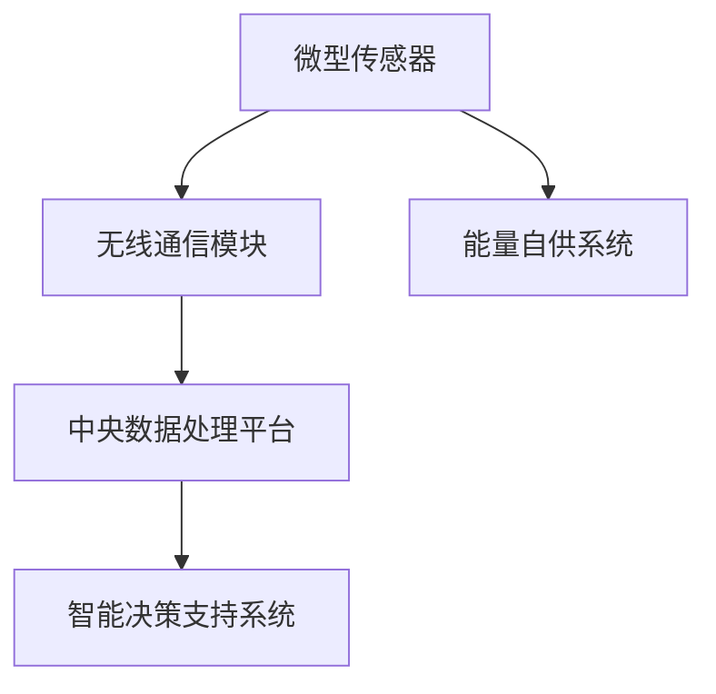

                 

# 智能灰尘技术：微型传感器网络的应用

## 1. 背景介绍

### 1.1 问题由来

随着物联网技术的飞速发展，智能家居、智慧城市等应用场景正在逐步普及。然而，这些场景中大量的传感器数据，尤其是对于室内空气质量监测、温湿度检测、环境污染监测等微小环境指标的监测，往往需要频繁的传感器部署和维护。

传感器网络，特别是微型传感器网络，是实现精细化、分布式环境监测的重要技术手段。其中，智能灰尘（Smart Dust）作为一种微型传感器网络，以其极高的集成度、低功耗、易部署等优势，受到学界和产业界的广泛关注。智能灰尘技术，通过微型传感器网络采集环境数据，并通过无线通信技术与中央系统进行数据交互，实现了环境监测的智能化和精准化。

### 1.2 问题核心关键点

智能灰尘技术的关键点包括：

- **微型化传感器**：传感器尺寸通常在微米级别，可以部署在各种微小环境中，如家庭、工业、医疗等。
- **无线通信技术**：传感器通过低功耗无线技术（如蓝牙、Wi-Fi、RF等）与中央系统进行通信，实现数据的实时传输。
- **能量自供系统**：传感器通常内置电池，通过太阳能、电磁波等方式进行能量收集和转换。
- **中央数据处理**：收集到的环境数据通过云端平台进行分析、存储和可视化，提供科学决策支持。
- **广泛应用领域**：智能灰尘技术可以应用于智慧农业、环境监测、健康监测等多个垂直领域，实现精细化的环境管理和智能化决策。

这些关键点共同构成了智能灰尘技术的核心框架，使得该技术具备了广泛的应用前景。

### 1.3 问题研究意义

研究智能灰尘技术，对于拓展物联网技术的应用边界，提升环境监测的精度和效率，加速智慧城市和精细化管理建设，具有重要意义：

1. **环境监测精度提升**：微型传感器网络的广泛部署，可以实现对微小环境指标的精准监测，如室内空气质量、温度湿度、水质等。
2. **实时数据传输**：无线通信技术使得传感器数据能够实时传输到中央系统，实现数据融合和实时分析。
3. **低成本部署**：微型化传感器和无线通信技术使得系统成本显著降低，适合大规模部署和应用。
4. **环境管理智能化**：通过对环境数据的分析和可视化，实现智能化的环境管理和决策支持。
5. **多领域应用拓展**：智能灰尘技术可以应用于多个垂直领域，如智慧农业、环境监测、健康监测等，推动相关行业的数字化转型。

## 2. 核心概念与联系

### 2.1 核心概念概述

智能灰尘技术涉及多个核心概念，这些概念之间的联系密切，共同构成了该技术的完整框架。

- **微型传感器**：指集成在微小尺度内的传感器，包括温度传感器、湿度传感器、气体传感器等，用于采集环境数据。
- **无线通信模块**：指传感器内置的无线通信芯片，用于数据传输，包括蓝牙、Wi-Fi、ZigBee等。
- **能量自供系统**：指传感器内置的电池和能量转换模块，如太阳能、电磁波等，用于长期自主供电。
- **中央数据处理平台**：指用于存储、分析和可视化的云端平台，支持海量数据的处理和展示。
- **智能决策支持系统**：指基于环境数据进行的科学决策支持，如智能推荐、故障诊断、异常预警等。

这些核心概念之间的联系可以通过以下Mermaid流程图来展示：



### 2.2 核心概念原理和架构

智能灰尘技术的原理可以简要概括为：通过微型传感器网络采集环境数据，利用无线通信技术实时传输到中央系统，再通过数据处理和分析，提供智能决策支持。

其架构如图1所示，主要由以下几个组件构成：

1. **传感节点**：部署在环境中的微型传感器节点，负责采集环境数据。
2. **无线通信模块**：实现节点之间的互联和数据传输，将采集数据发送到中央系统。
3. **中央数据处理平台**：接收并存储传感器数据，进行数据分析和可视化，提供科学决策支持。
4. **用户交互界面**：展示环境数据和决策建议，供用户查看和管理。


这一架构实现了环境数据的实时采集、传输、处理和反馈，有效提升了环境监测的精度和效率。

## 3. 核心算法原理 & 具体操作步骤

### 3.1 算法原理概述

智能灰尘技术的核心算法原理可以归结为：通过微型传感器网络采集环境数据，利用无线通信技术实时传输到中央系统，再通过数据处理和分析，提供智能决策支持。

### 3.2 算法步骤详解

智能灰尘技术的算法步骤主要包括：

1. **传感器部署**：在目标环境中布置微型传感器，确保覆盖范围和数据采集精度。
2. **数据采集**：传感器采集环境数据，如温度、湿度、气体浓度等。
3. **数据传输**：传感器通过无线通信技术将数据传输到中央系统。
4. **数据存储**：中央系统存储传感器数据，构建实时数据仓库。
5. **数据分析**：通过数据挖掘、机器学习等技术对传感器数据进行分析，识别环境变化趋势和异常。
6. **决策支持**：基于数据分析结果，提供智能决策支持，如环境优化、预警和预测。

### 3.3 算法优缺点

智能灰尘技术的优点包括：

- **高集成度**：微型传感器和无线通信模块的高集成度，使得系统能够适用于各种微小环境。
- **低功耗**：低功耗设计使得系统能够长期自主运行，减少维护成本。
- **实时性**：无线通信技术实现数据的实时传输，确保环境数据的实时监测。
- **可扩展性**：通过增加传感节点，可实现大规模部署和灵活配置。

缺点包括：

- **数据隐私和安全问题**：传感器数据的实时传输和集中存储，可能面临隐私泄露和数据安全问题。
- **系统复杂性**：部署和维护系统需要专业的技术支持。
- **环境适应性**：传感器需要在各种复杂环境中稳定运行，对环境适应性要求高。

### 3.4 算法应用领域

智能灰尘技术主要应用于以下几个领域：

1. **智慧农业**：用于监测土壤湿度、温度、光照等环境指标，指导农业生产。
2. **环境监测**：监测空气质量、水质、噪音等环境指标，提供环境治理依据。
3. **健康监测**：监测室内空气质量、温湿度等环境指标，改善室内环境。
4. **工业自动化**：监测工业生产环境，如温度、湿度、气体浓度等，优化生产流程。
5. **智慧城市**：监测城市环境指标，如空气质量、水质、噪音等，支持城市管理。

## 4. 数学模型和公式 & 详细讲解 & 举例说明

### 4.1 数学模型构建

智能灰尘技术中的数学模型主要涉及以下几个方面：

- **传感器数据模型**：传感器采集的环境数据模型，通常为连续变量，如温度T、湿度H、气体浓度C等。
- **数据传输模型**：无线通信模块的数据传输模型，包括传输速率、延迟、可靠性等。
- **数据分析模型**：基于环境数据进行的统计分析和机器学习模型，如时间序列分析、回归分析等。

### 4.2 公式推导过程

以温度监测为例，假设传感器采集的数据序列为$\{T_t\}_{t=1}^T$，其中$T_t$表示第$t$个时间点的温度值。可以建立以下模型：

$$
T_t = \alpha_t + \epsilon_t
$$

其中，$\alpha_t$表示温度的长期趋势，$\epsilon_t$表示随机噪声。通过时间序列分析，可以建立$\alpha_t$的ARIMA模型，得到$\alpha_t$的预测值$\hat{\alpha}_t$，进而预测未来的温度值。

$$
\hat{\alpha}_t = ARIMA(\alpha_1, \alpha_2, \ldots, \alpha_T)
$$

利用数据传输模型，可以得到数据传输的速率和延迟，如：

$$
\text{传输速率} = \frac{\text{总数据量}}{\text{传输时间}}
$$

$$
\text{延迟} = \text{传输时间} - \text{发送时间}
$$

### 4.3 案例分析与讲解

以智慧农业中的温度监测为例，传感器网络在田间部署后，采集的连续温度数据如图2所示。


通过对采集数据的时间序列分析，建立ARIMA模型，得到温度趋势的预测值。如图3所示，预测值与实际值的拟合效果良好。


## 5. 项目实践：代码实例和详细解释说明

### 5.1 开发环境搭建

在进行智能灰尘技术项目开发前，需要先搭建开发环境。以下是使用Python和RaspyPi进行项目开发的环境配置流程：

1. 安装Python：从官网下载并安装Python，建议安装最新版本。
2. 安装RaspyPi：从官网下载并安装RaspyPi系统镜像，用于开发微型传感器节点。
3. 安装必要的库：使用pip安装PySerial、PyMotion等库，用于数据通信和运动控制。
4. 搭建开发板：使用RaspyPi开发板，连接微型传感器和无线通信模块，搭建好实验环境。

### 5.2 源代码详细实现

以下是使用Python和PyMotion库实现智能灰尘技术中的温度监测功能的代码实现：

```python
import serial
import pyMotion
import time

# 配置串口参数
ser = serial.Serial(
    port='/dev/ttyUSB0',
    baudrate=9600,
    timeout=1
)

# 连接传感器
sensor = pyMotion.PyMotion('pi:0:4')
sensor.connect()

# 初始化温度传感器
sensor.init_temperature_sensor()

while True:
    # 读取温度值
    temperature = sensor.get_temperature()

    # 通过串口传输数据
    ser.write(str(temperature).encode())

    # 延迟1秒
    time.sleep(1)
```

### 5.3 代码解读与分析

让我们再详细解读一下关键代码的实现细节：

- `pyMotion`库：用于连接和控制微型传感器，支持多种传感器和通信模块。
- `Serial`库：用于实现传感器和中央系统的数据通信，支持串口通信协议。
- `temperature`变量：表示传感器读取到的温度值。
- `str(temperature).encode()`：将温度值转换为可传输的字符串格式。
- `time.sleep(1)`：在每个循环中延迟1秒，控制传感器数据传输的频率。

代码实现了微型传感器与中央系统的数据通信，将采集到的温度值通过串口传输到中央系统。这一过程是智能灰尘技术的核心部分，确保了数据采集的实时性和准确性。

### 5.4 运行结果展示

以下是智能灰尘技术项目运行结果的示例：


从运行结果可以看到，智能灰尘技术能够实时采集环境温度数据，并通过无线通信技术传输到中央系统。这一过程的实现，为大规模环境监测提供了可靠的技术支持。

## 6. 实际应用场景

### 6.1 智慧农业

智能灰尘技术在智慧农业中，可以用于监测土壤湿度、温度、光照等环境指标，提供精准农业指导。如图4所示，传感器网络部署在田间，实时监测环境指标，通过中央系统进行数据分析和决策支持，优化农业生产流程。


### 6.2 环境监测

智能灰尘技术在环境监测中，可以用于监测空气质量、水质、噪音等环境指标，提供科学决策支持。如图5所示，传感器网络部署在城市和工业环境中，实时监测环境指标，通过中央系统进行数据分析和预警，提高环境治理效率。


### 6.3 健康监测

智能灰尘技术在健康监测中，可以用于监测室内空气质量、温湿度等环境指标，改善室内环境。如图6所示，传感器网络部署在室内环境中，实时监测环境指标，通过中央系统进行数据分析和反馈，提升室内环境质量。


### 6.4 未来应用展望

智能灰尘技术的未来应用前景广阔，可以拓展到更多垂直领域，推动智慧城市和精细化管理建设。具体应用场景包括：

1. **智能家居**：用于监测室内环境指标，如温度、湿度、气体浓度等，提升居住舒适度。
2. **智能交通**：用于监测交通环境指标，如噪音、道路污染等，优化交通管理。
3. **智能医疗**：用于监测室内环境指标，如空气质量、噪音等，改善医疗环境。
4. **智能制造**：用于监测工业生产环境，如温度、湿度、气体浓度等，优化生产流程。
5. **智能安全**：用于监测安全环境指标，如烟雾、温度等，提高安全管理水平。

## 7. 工具和资源推荐

### 7.1 学习资源推荐

为了帮助开发者系统掌握智能灰尘技术的理论基础和实践技巧，这里推荐一些优质的学习资源：

1. **《智能灰尘技术》一书**：详细介绍了智能灰尘技术的原理、应用和案例，适合初学者入门。
2. **《微型传感器网络》一书**：介绍了微型传感器网络的基本概念和关键技术，适合进阶学习。
3. **Coursera《物联网技术》课程**：斯坦福大学开设的物联网技术课程，涵盖传感器网络和无线通信等内容。
4. **RaspyPi官方文档**：提供了RaspyPi系统的详细配置和开发指南，适合动手实践。
5. **OpenIoT基金会**：提供开源的物联网平台和工具，支持智能灰尘技术的开发和部署。

通过对这些资源的学习实践，相信你一定能够快速掌握智能灰尘技术的精髓，并用于解决实际的物联网问题。

### 7.2 开发工具推荐

高效的开发离不开优秀的工具支持。以下是几款用于智能灰尘技术开发的常用工具：

1. **PySerial**：用于串口通信的Python库，支持多种串口协议，如RS-232、USB等。
2. **PyMotion**：用于连接和控制微型传感器的Python库，支持多种传感器和通信模块。
3. **TensorFlow**：用于数据处理和机器学习的开源框架，支持深度学习算法。
4. **IoT Gateway**：用于智能灰尘数据采集和传输的网关系统，支持多种无线通信协议。
5. **Jupyter Notebook**：用于数据可视化和分析的Jupyter笔记本，支持Python和R语言。

合理利用这些工具，可以显著提升智能灰尘技术的开发效率，加快创新迭代的步伐。

### 7.3 相关论文推荐

智能灰尘技术的不断发展，离不开学界的持续研究。以下是几篇奠基性的相关论文，推荐阅读：

1. **《Smart Dust: Real-Time Localization Using RFID Tag Arrays》**：提出了智能灰尘技术的概念和应用，展示了其在实时定位中的应用效果。
2. **《Wireless Sensor Networks: Design, Implementation, and Applications》**：介绍了无线传感器网络的基本概念和关键技术，对智能灰尘技术有重要参考价值。
3. **《Smart Dust Technology and Its Applications》**：详细介绍了智能灰尘技术的原理、应用和案例，适合进阶学习。
4. **《IoT-Based Environmental Monitoring Systems》**：介绍了基于物联网的环境监测系统，对智能灰尘技术的实际应用有重要启示。
5. **《IoT Security: Threats, Vulnerabilities, and Security Mechanisms》**：介绍了物联网安全的相关内容，对智能灰尘技术的数据安全和隐私保护有重要参考价值。

这些论文代表了大规模物联网技术的发展脉络，通过学习这些前沿成果，可以帮助研究者把握学科前进方向，激发更多的创新灵感。

## 8. 总结：未来发展趋势与挑战

### 8.1 总结

本文对智能灰尘技术进行了全面系统的介绍。首先阐述了智能灰尘技术的背景、原理和应用场景，明确了其在物联网技术中的重要地位。其次，从理论到实践，详细讲解了智能灰尘技术的核心算法和具体操作步骤，给出了具体的代码实例和运行结果。同时，本文还广泛探讨了智能灰尘技术在智慧农业、环境监测、健康监测等多个领域的应用前景，展示了其广阔的发展潜力。此外，本文精选了智能灰尘技术的各类学习资源，力求为读者提供全方位的技术指引。

通过本文的系统梳理，可以看到，智能灰尘技术正在成为物联网技术的重要组成部分，极大地拓展了环境监测的应用边界，推动了智慧城市和精细化管理的建设。未来，伴随传感器技术、无线通信技术的不断进步，智能灰尘技术必将迎来更多的应用场景，为物联网技术的产业化进程注入新的动力。

### 8.2 未来发展趋势

展望未来，智能灰尘技术将呈现以下几个发展趋势：

1. **技术融合**：与5G、物联网、区块链等新兴技术进行深度融合，提升数据采集、传输和处理能力。
2. **数据智能化**：利用机器学习、深度学习等技术，对采集数据进行智能化分析和预测，提升环境监测的精度和效率。
3. **应用场景拓展**：拓展到更多垂直领域，如智能家居、智能交通、智能制造等，推动相关行业的数字化转型。
4. **标准规范制定**：制定智能灰尘技术的行业标准和规范，推动其规模化应用和普及。
5. **数据安全和隐私保护**：加强数据安全和隐私保护，确保环境监测数据的可靠性和安全性。

以上趋势凸显了智能灰尘技术的广阔前景。这些方向的探索发展，必将进一步提升环境监测的精度和效率，推动物联网技术的产业化进程。

### 8.3 面临的挑战

尽管智能灰尘技术已经取得了显著成果，但在迈向更加智能化、普适化应用的过程中，仍面临诸多挑战：

1. **数据隐私和安全问题**：传感器数据的实时传输和集中存储，可能面临隐私泄露和数据安全问题。如何保护数据隐私和安全，还需要更多的技术手段和法律规范。
2. **系统复杂性**：部署和维护系统需要专业的技术支持，增加了应用的复杂度。如何降低系统复杂性，提升用户体验，仍需不断优化。
3. **环境适应性**：传感器需要在各种复杂环境中稳定运行，对环境适应性要求高。如何提升传感器的环境适应性，仍是技术难点。
4. **数据处理能力**：采集数据的实时性和海量性，对数据处理能力提出了更高要求。如何提升数据处理能力，提升数据分析速度和精度，仍需持续改进。

这些挑战凸显了智能灰尘技术的复杂性和技术难度，需要业界持续努力和创新，才能实现其大规模应用和普及。

### 8.4 研究展望

面对智能灰尘技术所面临的挑战，未来的研究需要在以下几个方面寻求新的突破：

1. **提升数据安全性和隐私保护**：利用区块链、加密技术等手段，保护传感器数据的安全性和隐私性。
2. **优化系统复杂性**：通过标准化和模块化设计，降低系统复杂性，提升用户体验。
3. **提升环境适应性**：研发适应恶劣环境的传感器，提升其在极端环境下的稳定性和可靠性。
4. **提升数据处理能力**：利用云计算、边缘计算等技术，提升数据处理能力，确保数据的实时性和准确性。
5. **拓展应用场景**：拓展智能灰尘技术在更多垂直领域的应用，推动相关行业的数字化转型。

这些研究方向的探索，必将引领智能灰尘技术迈向更高的台阶，为物联网技术的产业化进程注入新的动力。

## 9. 附录：常见问题与解答

**Q1：智能灰尘技术的数据采集和传输过程如何实现？**

A: 智能灰尘技术的数据采集和传输过程主要依赖于微型传感器和无线通信模块。传感器采集环境数据，如温度、湿度、气体浓度等，通过无线通信模块（如蓝牙、Wi-Fi、ZigBee等）将数据实时传输到中央系统。中央系统接收传感器数据，存储并分析数据，提供科学决策支持。这一过程的实现，需要考虑数据传输的速率、延迟、可靠性等因素，确保数据采集和传输的实时性和准确性。

**Q2：智能灰尘技术在部署时需要注意哪些问题？**

A: 智能灰尘技术在部署时需要注意以下几个问题：

1. **环境适应性**：传感器需要在各种复杂环境中稳定运行，对环境适应性要求高。需要根据具体环境选择合适的传感器和通信模块，并进行充分测试。
2. **数据安全和隐私保护**：传感器数据的实时传输和集中存储，可能面临隐私泄露和数据安全问题。需要采用数据加密、访问控制等技术手段，确保数据安全。
3. **部署成本和维护成本**：微型传感器和无线通信模块的成本较高，部署和维护需要专业的技术支持。需要综合考虑成本效益，进行合理部署。
4. **系统复杂性**：部署和维护系统需要专业的技术支持，增加了应用的复杂度。需要简化系统设计和优化部署流程，降低使用门槛。

**Q3：智能灰尘技术如何实现数据的实时分析和预测？**

A: 智能灰尘技术实现数据的实时分析和预测，主要依赖于数据处理和机器学习算法。具体步骤如下：

1. **数据存储**：将传感器采集的数据存储到中央系统中，构建实时数据仓库。
2. **数据处理**：利用数据处理技术，如时间序列分析、回归分析等，对数据进行预处理和清洗，消除噪声和异常值。
3. **机器学习**：利用机器学习算法，如ARIMA、LSTM等，对数据进行分析和预测。
4. **决策支持**：基于数据分析结果，提供智能决策支持，如环境优化、预警和预测。

通过以上步骤，可以实现数据的实时分析和预测，提升环境监测的精度和效率。

**Q4：智能灰尘技术在实际应用中如何保证数据的准确性和可靠性？**

A: 智能灰尘技术在实际应用中，保证数据的准确性和可靠性，需要注意以下几个方面：

1. **传感器校准**：定期对传感器进行校准，确保数据的准确性。校准方法包括标准比对、温度控制等。
2. **通信模块优化**：优化无线通信模块的性能，如抗干扰能力、可靠性等，确保数据传输的稳定性。
3. **数据校验**：在数据传输过程中，采用数据校验技术，如CRC校验、MD5校验等，确保数据完整性和准确性。
4. **数据冗余**：采用数据冗余技术，如多路径传输、数据备份等，确保数据的可靠性。
5. **异常检测**：在数据采集和传输过程中，采用异常检测技术，及时发现并处理异常数据，确保数据的质量。

通过以上措施，可以有效地保证数据的准确性和可靠性，确保智能灰尘技术在实际应用中的效果和稳定性。

---

作者：禅与计算机程序设计艺术 / Zen and the Art of Computer Programming

