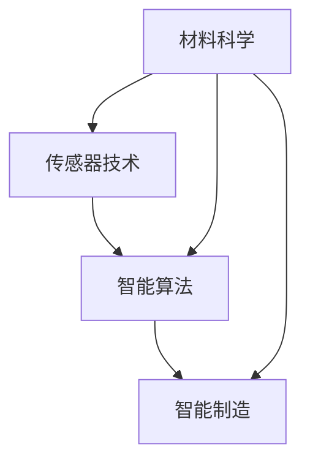

                 

# 智能纺织创业：可穿戴技术的时尚融合

## 1. 背景介绍

### 1.1 问题由来
随着科技的不断进步，纺织行业正在经历一场前所未有的变革。从传统手工编织到自动化生产，再到智能制造，每一次技术的突破都极大地改变了纺织品的生产方式和消费体验。然而，这种变革也带来了新的挑战：如何在保障产品质量的同时，满足消费者日益增长的个性化需求？如何利用新技术提高生产效率，降低成本？这些问题驱动着纺织行业不断探索新的创新路径。

可穿戴技术作为一种前沿科技，以其独特的优势，成为智能纺织创业的重要方向。可穿戴纺织品能够实时监测人体健康状态，提供个性化的穿着体验，甚至成为智能设备和智能家居的载体。随着技术的成熟，可穿戴纺织品的市场前景广阔，吸引了众多创业者和企业的关注。

### 1.2 问题核心关键点
智能纺织创业的关键点在于如何将可穿戴技术与传统纺织制造相结合，创造出既时尚又实用的产品。这要求我们深入理解纺织材料、传感器技术、智能算法等多领域的知识，并具备跨学科融合的能力。

为了更好地理解这一问题，我们将从以下几个方面进行详细探讨：

1. **材料与传感器**：了解不同材料的特性和传感器的应用。
2. **数据采集与处理**：介绍如何采集用户数据，并处理成可供算法使用的格式。
3. **智能算法设计**：设计能够处理可穿戴数据并指导生产决策的算法。
4. **生产与质检**：讨论如何利用智能算法提升生产效率和质量控制。
5. **用户反馈与迭代**：如何收集用户反馈，进行产品的不断优化。

## 2. 核心概念与联系

### 2.1 核心概念概述

可穿戴纺织品融合了纺织材料和传感器技术，通过采集用户的生理、行为数据，提供个性化的健康管理、运动指导等功能。这一领域涉及的材料科学、电子工程、计算机科学等多学科知识，呈现出高度的跨学科特点。

- **材料科学**：纺织材料是可穿戴纺织品的基础。不同材质具有不同的导电性、透气性、柔韧性等特性，直接影响产品的舒适度和功能性。
- **传感器技术**：传感器用于采集用户的数据，如心率、体温和运动量等。传感器需要小型化、低功耗、高精度，并具备良好的抗干扰能力。
- **智能算法**：算法用于处理传感器数据，提取有用信息，并指导智能决策。这包括数据分析、机器学习、深度学习等多种技术。
- **智能制造**：结合智能算法，优化生产流程，实现个性化定制和智能化质检。

这些核心概念之间的联系通过以下Mermaid流程图展示：



该流程图展示出从材料到传感器、再到算法和智能制造的流程，强调了各学科之间的紧密联系和协同工作的重要性。

## 3. 核心算法原理 & 具体操作步骤

### 3.1 算法原理概述

可穿戴纺织品的智能算法主要包括以下几个步骤：

1. **数据采集**：通过传感器采集用户生理和行为数据。
2. **数据预处理**：清洗数据，去除噪声和异常值，标准化数据格式。
3. **特征提取**：从原始数据中提取有意义的特征，如心率、体温和运动量等。
4. **模型训练**：使用机器学习或深度学习模型对提取的特征进行训练，建立预测模型。
5. **智能决策**：基于训练好的模型，实时分析用户数据，提供个性化建议。
6. **生产优化**：通过智能算法优化生产流程，实现个性化定制和质量控制。

这些步骤构成了一个闭环，实现了从数据采集到智能决策的全过程。

### 3.2 算法步骤详解

#### 3.2.1 数据采集

数据采集是智能纺织品的基础，主要通过以下方式进行：

- **生理传感器**：使用心率、血压、体温等传感器采集用户的生理数据。
- **运动传感器**：使用加速度计、陀螺仪等传感器采集用户的运动数据。
- **环境传感器**：使用温度、湿度等传感器采集环境数据。

#### 3.2.2 数据预处理

数据预处理的主要目标是提高数据的质量和可用性，包括以下步骤：

- **去噪**：使用滤波器或统计方法去除噪声和异常值，确保数据的一致性和可靠性。
- **归一化**：将不同量纲的数据归一化到相同的范围内，便于后续分析。
- **特征选择**：选择对预测有用的特征，去除无关或冗余的特征，提高模型的效率和精度。

#### 3.2.3 特征提取

特征提取是将原始数据转化为模型可处理的特征，常用的方法包括：

- **时域分析**：使用傅里叶变换等方法分析信号的时域特性。
- **频域分析**：使用短时傅里叶变换、小波变换等方法分析信号的频域特性。
- **时间序列分析**：使用滑动平均、指数平滑等方法分析时间序列数据的趋势和周期性。

#### 3.2.4 模型训练

模型训练是智能算法的核心，常用的方法包括：

- **监督学习**：使用带有标签的数据集训练模型，如分类、回归等。
- **无监督学习**：使用无标签的数据集训练模型，如聚类、降维等。
- **强化学习**：通过奖励机制训练模型，优化决策策略。

#### 3.2.5 智能决策

智能决策是根据训练好的模型，对用户数据进行实时分析，并作出相应的决策，常用的方法包括：

- **分类**：判断用户状态，如健康状况、运动强度等。
- **预测**：预测未来状态，如运动趋势、健康风险等。
- **优化**：优化用户体验，如推荐运动计划、调整穿着方式等。

#### 3.2.6 生产优化

生产优化是将智能决策应用于生产流程，实现个性化定制和质量控制，常用的方法包括：

- **个性化定制**：根据用户数据，定制个性化的纺织品。
- **质量控制**：通过智能算法检测产品缺陷，实现自动化质检。
- **供应链优化**：利用数据分析，优化供应链管理，降低成本。

### 3.3 算法优缺点

智能纺织算法的优点包括：

- **实时性**：能够实时采集和处理用户数据，提供即时的智能决策。
- **个性化**：通过用户数据，提供个性化的建议和服务。
- **智能化**：结合多种技术，实现智能化生产和管理。

然而，智能纺织算法也存在以下缺点：

- **数据隐私**：用户数据可能涉及隐私问题，需要采取严格的保护措施。
- **模型复杂性**：复杂的模型可能导致计算资源消耗大，部署困难。
- **算法鲁棒性**：模型可能对噪声和异常值敏感，需要采取抗干扰措施。
- **用户接受度**：用户对新技术的接受度可能不高，需要提高用户体验。

### 3.4 算法应用领域

智能纺织算法的应用领域广泛，涵盖了以下几个方面：

1. **健康管理**：通过监测用户的生理数据，提供健康建议和治疗方案。
2. **运动指导**：通过监测用户的运动数据，提供运动计划和运动效果评估。
3. **个性化定制**：根据用户的偏好和需求，定制个性化的纺织品。
4. **智能穿戴**：将可穿戴纺织品与智能家居、智能设备结合，实现多设备联动。
5. **时尚设计**：通过数据分析，发现时尚趋势和用户需求，指导设计决策。

## 4. 数学模型和公式 & 详细讲解 & 举例说明

### 4.1 数学模型构建

假设我们有一个包含$N$个用户的数据集$\{(x_i,y_i)\}_{i=1}^N$，其中$x_i$为用户的特征向量，$y_i$为用户的标签。我们的目标是训练一个模型$f(x)$，使得$f(x)$能够预测新的用户数据。

常用的数学模型包括线性回归、逻辑回归、支持向量机等。这里以线性回归为例，构建数学模型：

$$
y_i = \theta_0 + \sum_{j=1}^n \theta_j x_{ij} + \epsilon_i
$$

其中$\theta_0,\theta_j$为模型参数，$\epsilon_i$为误差项。

### 4.2 公式推导过程

线性回归模型的参数可以通过最小二乘法求解：

$$
\theta = (X^TX)^{-1}X^Ty
$$

其中$X=[x_{i1},x_{i2},\cdots,x_{in}]$为特征矩阵，$y=[y_1,y_2,\cdots,y_n]$为标签向量。

为了提高模型的泛化能力，可以引入正则化项$\lambda \| \theta \|^2$，其中$\lambda$为正则化系数：

$$
\theta = (X^TX+\lambda I)^{-1}X^Ty
$$

其中$I$为单位矩阵。

### 4.3 案例分析与讲解

以智能纺织品的运动指导为例，假设有$M$个用户在$T$个时间点上的运动数据，数据格式为$(x_i,t_j)$，其中$x_i$为用户在时间$t_j$的运动量，$t_j$为时间。我们可以构建时间序列模型，分析用户运动趋势，预测未来运动量。

假设模型为：

$$
x_{ij} = \theta_0 + \sum_{k=1}^K \theta_{ik} t_{ij} + \epsilon_{ij}
$$

其中$K$为时间点的个数，$\theta_{ik}$为时间点的系数。

通过最小二乘法求解模型参数$\theta$，可以使用下面的公式：

$$
\theta = (X^TX)^{-1}X^Ty
$$

其中$X=[x_{i1},x_{i2},\cdots,x_{iK}]$为运动数据矩阵，$y=[y_1,y_2,\cdots,y_M]$为用户标签向量。

## 5. 项目实践：代码实例和详细解释说明

### 5.1 开发环境搭建

在进行智能纺织创业的项目实践前，我们需要准备好开发环境。以下是使用Python进行PyTorch开发的环境配置流程：

1. 安装Anaconda：从官网下载并安装Anaconda，用于创建独立的Python环境。

2. 创建并激活虚拟环境：
```bash
conda create -n pytorch-env python=3.8 
conda activate pytorch-env
```

3. 安装PyTorch：根据CUDA版本，从官网获取对应的安装命令。例如：
```bash
conda install pytorch torchvision torchaudio cudatoolkit=11.1 -c pytorch -c conda-forge
```

4. 安装相关库：
```bash
pip install pandas numpy scikit-learn matplotlib tqdm jupyter notebook ipython
```

5. 安装TensorFlow：
```bash
pip install tensorflow
```

完成上述步骤后，即可在`pytorch-env`环境中开始项目实践。

### 5.2 源代码详细实现

下面我们以智能纺织品的健康管理为例，给出使用PyTorch进行模型训练和推理的代码实现。

首先，定义数据处理函数：

```python
import pandas as pd
from sklearn.preprocessing import StandardScaler
import numpy as np

def load_data(filename):
    data = pd.read_csv(filename)
    features = data.drop('label', axis=1)
    labels = data['label']
    scaler = StandardScaler()
    features = scaler.fit_transform(features)
    return features, labels
```

然后，定义模型：

```python
import torch
import torch.nn as nn
import torch.optim as optim

class LinearRegression(nn.Module):
    def __init__(self, n_features):
        super(LinearRegression, self).__init__()
        self.linear = nn.Linear(n_features, 1)

    def forward(self, x):
        return self.linear(x)

model = LinearRegression(n_features)
```

接着，定义训练和评估函数：

```python
def train_model(model, train_features, train_labels, test_features, test_labels, epochs, learning_rate):
    optimizer = optim.SGD(model.parameters(), lr=learning_rate)
    criterion = nn.MSELoss()
    for epoch in range(epochs):
        model.train()
        for i in range(len(train_features)):
            optimizer.zero_grad()
            predictions = model(train_features[i].reshape(1, -1))
            loss = criterion(predictions, train_labels[i].reshape(1))
            loss.backward()
            optimizer.step()
        model.eval()
        test_loss = []
        for i in range(len(test_features)):
            predictions = model(test_features[i].reshape(1, -1))
            loss = criterion(predictions, test_labels[i].reshape(1))
            test_loss.append(loss.item())
    return model, test_loss
```

最后，启动训练流程并在测试集上评估：

```python
epochs = 1000
learning_rate = 0.01
train_features, train_labels = load_data('train.csv')
test_features, test_labels = load_data('test.csv')

model, test_loss = train_model(model, train_features, train_labels, test_features, test_labels, epochs, learning_rate)

print('Test loss:', np.mean(test_loss))
```

以上就是使用PyTorch进行智能纺织品的健康管理的代码实现。可以看到，通过Python和PyTorch，我们可以快速搭建和训练模型，并进行性能评估。

### 5.3 代码解读与分析

让我们再详细解读一下关键代码的实现细节：

**load_data函数**：
- 从CSV文件中加载数据。
- 分离特征和标签。
- 使用标准化方法对特征进行归一化。
- 返回特征和标签。

**LinearRegression类**：
- 定义线性回归模型。
- 使用PyTorch的nn.Linear模块定义线性层。
- 在forward方法中，将输入数据传入线性层，输出模型预测结果。

**train_model函数**：
- 定义优化器和损失函数。
- 在每个epoch中，使用mini-batch数据进行前向传播和反向传播。
- 在测试集上评估模型性能，计算测试集损失的平均值。
- 返回模型和测试集损失。

**训练流程**：
- 定义epoch数和学习率。
- 加载训练集和测试集数据。
- 调用train_model函数进行模型训练。
- 打印测试集损失。

可以看到，PyTorch提供了强大的计算图和自动微分功能，使得模型训练和推理变得简单高效。

## 6. 实际应用场景

### 6.1 智能服装设计

智能服装设计可以通过采集用户的生理和行为数据，实时监测用户的健康状态，提供个性化的穿着建议。例如，可以采集用户的运动数据、心率数据、体脂率等，结合智能算法，设计出能够自动调节温度、压力、湿度等功能的多功能服装。

### 6.2 运动装备优化

运动装备优化通过采集用户的运动数据，优化运动装备的设计和参数。例如，可以采集跑步者的速度、步频、心肺功能等数据，结合智能算法，设计出更适合不同运动场景的运动鞋、运动服等装备。

### 6.3 健康监测与管理

健康监测与管理通过采集用户的生理数据，提供个性化的健康管理方案。例如，可以采集用户的睡眠质量、心率、血压等数据，结合智能算法，分析健康风险，提供个性化的饮食、运动、休息建议。

### 6.4 未来应用展望

未来，随着技术的不断进步，智能纺织品的应用场景将更加广泛，包括但不限于：

1. **个性化定制**：通过采集用户的偏好和需求，实现定制化的纺织品生产。
2. **智能穿戴设备**：将可穿戴纺织品与智能设备结合，实现多设备联动，提升用户体验。
3. **智能家居系统**：通过可穿戴纺织品采集用户数据，智能家居系统可以提供个性化的家居服务。
4. **智慧城市**：在城市基础设施中融入可穿戴纺织品，提供智能化的城市管理服务。
5. **环保材料**：使用可降解、环保的纺织材料，实现可持续的智能纺织品生产。

## 7. 工具和资源推荐

### 7.1 学习资源推荐

为了帮助开发者系统掌握智能纺织创业的理论基础和实践技巧，这里推荐一些优质的学习资源：

1. **《智能纺织品：未来科技与创新》**：一本系统介绍智能纺织品的书籍，涵盖材料科学、传感器技术、智能算法等多个方面。
2. **Coursera《机器学习》课程**：由斯坦福大学开设的机器学习课程，深入浅出地介绍机器学习和深度学习的原理和应用。
3. **Google AI Blog**：Google AI团队发布的博客，涵盖最新的智能纺织品研究和技术进展。
4. **MIT OpenCourseWare《电子工程概论》课程**：麻省理工学院开设的电子工程课程，涵盖传感器技术、电路设计等多个方面。
5. **Scikit-learn官方文档**：Python中常用的机器学习库，提供了丰富的模型和工具。

通过对这些资源的学习实践，相信你一定能够快速掌握智能纺织创业的理论基础和实践技巧，并用于解决实际的智能纺织问题。

### 7.2 开发工具推荐

高效的开发离不开优秀的工具支持。以下是几款用于智能纺织品开发的常用工具：

1. **PyTorch**：基于Python的开源深度学习框架，灵活动态的计算图，适合快速迭代研究。
2. **TensorFlow**：由Google主导开发的开源深度学习框架，生产部署方便，适合大规模工程应用。
3. **Jupyter Notebook**：交互式的Python开发环境，方便进行数据探索和模型调试。
4. **Kaggle**：数据科学竞赛平台，提供了丰富的数据集和模型库。
5. **Visual Studio Code**：轻量级的代码编辑器，支持Python开发和调试。

合理利用这些工具，可以显著提升智能纺织品开发的效率，加快创新迭代的步伐。

### 7.3 相关论文推荐

智能纺织品和可穿戴技术的发展源于学界的持续研究。以下是几篇奠基性的相关论文，推荐阅读：

1. **《智能纺织品的传感器技术与智能算法》**：介绍智能纺织品中的传感器技术和智能算法的研究进展。
2. **《基于深度学习的智能纺织品模型设计》**：讨论使用深度学习模型设计智能纺织品的方法和应用。
3. **《可穿戴技术的健康监测与管理》**：分析可穿戴技术在健康监测和管理中的应用。
4. **《智能纺织品的多功能化和个性化定制》**：探讨智能纺织品的多功能化和个性化定制技术。
5. **《智能纺织品的可持续发展》**：讨论智能纺织品的环保材料和可持续发展问题。

这些论文代表了大语言模型微调技术的发展脉络。通过学习这些前沿成果，可以帮助研究者把握学科前进方向，激发更多的创新灵感。

## 8. 总结：未来发展趋势与挑战

### 8.1 总结

本文对智能纺织创业中的可穿戴技术进行了全面系统的介绍。首先阐述了智能纺织创业的背景和意义，明确了可穿戴技术在智能纺织创业中的重要地位。其次，从材料科学、传感器技术、智能算法等多个方面，详细讲解了智能纺织品的核心概念和关键技术。再次，通过具体案例，展示了智能纺织品的实际应用场景和未来发展前景。最后，介绍了智能纺织品开发所需的工具和资源，并提出了未来的研究挑战和方向。

通过本文的系统梳理，可以看到，智能纺织创业正在迎来新的发展机遇，可穿戴技术将为纺织行业带来深远变革。未来，随着技术的不断进步和应用的深入，智能纺织品的应用场景将更加广泛，为用户带来更加智能、便捷的穿着体验。

### 8.2 未来发展趋势

展望未来，智能纺织创业将呈现以下几个发展趋势：

1. **智能化程度提升**：通过更多的传感器和智能算法，提升智能纺织品的智能化程度，提供更加精准的健康管理和运动指导。
2. **定制化程度提高**：通过个性化数据采集和分析，实现高度定制化的智能纺织品生产。
3. **多模态融合**：将可穿戴纺织品与智能设备、智能家居等多模态设备结合，实现多设备联动。
4. **可持续性发展**：使用环保材料和可持续的生产方式，推动智能纺织品的可持续发展。
5. **全球化应用**：将智能纺织品技术推广到全球市场，适应不同国家和地区的文化和生活习惯。

以上趋势凸显了智能纺织创业的广阔前景。这些方向的探索发展，将进一步提升智能纺织品的性能和应用范围，为用户带来更加智能、便捷的穿着体验。

### 8.3 面临的挑战

尽管智能纺织创业前景广阔，但在迈向更加智能化、普适化应用的过程中，它仍面临诸多挑战：

1. **技术成熟度**：智能纺织品的传感器、算法、材料等技术仍需进一步成熟，以提高产品的稳定性和可靠性。
2. **成本问题**：智能纺织品的生产成本相对较高，需要进一步降低成本，以提高市场竞争力。
3. **用户接受度**：用户对新技术的接受度可能不高，需要提高用户体验，增加市场推广力度。
4. **隐私保护**：智能纺织品涉及用户的隐私数据，需要采取严格的隐私保护措施。
5. **安全问题**：智能纺织品中的传感器和算法可能受到攻击，需要提高系统的安全性。

正视智能纺织创业面临的这些挑战，积极应对并寻求突破，将是大规模生产、推广和应用智能纺织品的重要保障。相信随着技术的不断进步和产业界的共同努力，这些挑战终将一一被克服，智能纺织品必将在更广阔的市场中大放异彩。

### 8.4 研究展望

面对智能纺织创业所面临的挑战，未来的研究需要在以下几个方面寻求新的突破：

1. **多模态数据融合**：将多种传感器数据融合，提升智能纺织品的感知能力和决策精度。
2. **隐私保护技术**：研究和应用隐私保护技术，保障用户数据的隐私安全。
3. **可持续生产工艺**：研究可持续的生产工艺，提高生产效率和环保水平。
4. **个性化算法**：开发更加个性化的算法，提升智能纺织品的用户体验。
5. **智能生产系统**：研究和应用智能生产系统，提高生产效率和产品质量。

这些研究方向的探索，将推动智能纺织创业迈向更高的台阶，为纺织行业的智能化转型提供新的技术支撑。

## 9. 附录：常见问题与解答

**Q1：智能纺织品中的传感器是如何选择和使用的？**

A: 智能纺织品中的传感器选择和使用需要考虑以下几个因素：

1. **传感器的类型**：根据监测对象的不同，选择合适的传感器类型，如心率传感器、压力传感器、温度传感器等。
2. **传感器的精度**：传感器的精度越高，采集的数据越准确。但精度越高，成本和功耗也越高。
3. **传感器的兼容性**：传感器需要兼容不同的纺织材料，不破坏材料的性能和舒适性。
4. **传感器的可靠性**：传感器需要具有较高的可靠性和稳定性，减少数据丢失和误判。

**Q2：如何设计智能纺织品的算法？**

A: 智能纺织品的算法设计包括以下几个步骤：

1. **数据预处理**：清洗数据，去除噪声和异常值，标准化数据格式。
2. **特征提取**：从原始数据中提取有意义的特征，如心率、体温和运动量等。
3. **模型选择**：选择合适的机器学习或深度学习模型，如线性回归、逻辑回归、支持向量机等。
4. **模型训练**：使用训练数据集训练模型，优化模型参数。
5. **模型评估**：使用测试数据集评估模型性能，调整模型参数。
6. **模型部署**：将训练好的模型部署到实际应用中，实时处理用户数据。

**Q3：智能纺织品的生产优化有哪些方法？**

A: 智能纺织品的生产优化包括以下几种方法：

1. **个性化定制**：根据用户的偏好和需求，定制个性化的纺织品。
2. **智能制造**：结合智能算法，优化生产流程，实现自动化质检。
3. **供应链管理**：通过数据分析，优化供应链管理，降低成本。
4. **设备联动**：将可穿戴纺织品与智能设备结合，实现多设备联动，提升生产效率。

**Q4：智能纺织品的未来发展方向是什么？**

A: 智能纺织品的未来发展方向包括以下几个方面：

1. **智能化程度提升**：通过更多的传感器和智能算法，提升智能纺织品的智能化程度，提供更加精准的健康管理和运动指导。
2. **定制化程度提高**：通过个性化数据采集和分析，实现高度定制化的智能纺织品生产。
3. **多模态融合**：将可穿戴纺织品与智能设备、智能家居等多模态设备结合，实现多设备联动。
4. **可持续性发展**：使用环保材料和可持续的生产方式，推动智能纺织品的可持续发展。
5. **全球化应用**：将智能纺织品技术推广到全球市场，适应不同国家和地区的文化和生活习惯。

**Q5：智能纺织品有哪些典型的应用场景？**

A: 智能纺织品的典型应用场景包括：

1. **智能服装设计**：通过采集用户的生理和行为数据，实时监测用户的健康状态，提供个性化的穿着建议。
2. **运动装备优化**：通过采集用户的运动数据，优化运动装备的设计和参数。
3. **健康监测与管理**：通过采集用户的生理数据，提供个性化的健康管理方案。
4. **智能穿戴设备**：将可穿戴纺织品与智能设备结合，实现多设备联动，提升用户体验。
5. **智能家居系统**：通过可穿戴纺织品采集用户数据，智能家居系统可以提供个性化的家居服务。

**Q6：智能纺织品的发展前景如何？**

A: 智能纺织品的发展前景非常广阔，其典型的应用场景包括：

1. **健康管理**：通过监测用户的生理数据，提供个性化的健康管理方案。
2. **运动指导**：通过采集用户的运动数据，优化运动装备的设计和参数。
3. **个性化定制**：通过采集用户的偏好和需求，实现定制化的纺织品生产。
4. **智能穿戴设备**：将可穿戴纺织品与智能设备结合，实现多设备联动，提升用户体验。
5. **智能家居系统**：通过可穿戴纺织品采集用户数据，智能家居系统可以提供个性化的家居服务。

通过本文的系统梳理，可以看到，智能纺织创业正在迎来新的发展机遇，可穿戴技术将为纺织行业带来深远变革。未来，随着技术的不断进步和应用的深入，智能纺织品的应用场景将更加广泛，为用户带来更加智能、便捷的穿着体验。

---

作者：禅与计算机程序设计艺术 / Zen and the Art of Computer Programming

