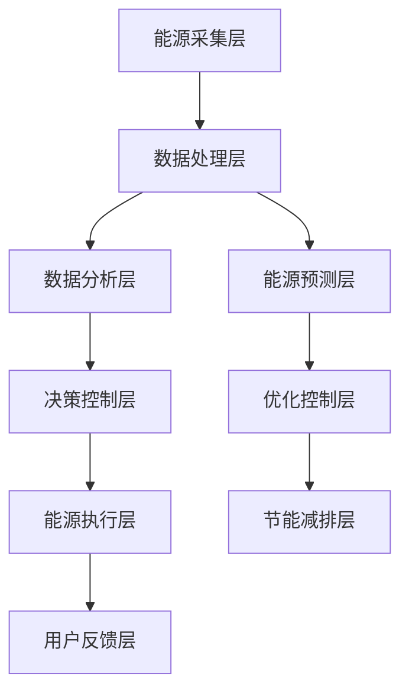

                 

# 智能能源管理创业：节能减排的科技解决方案

> 关键词：智能能源管理, 节能减排, 人工智能, 机器学习, 物联网, 大数据, 深度学习, 绿色技术, 可再生能源

## 1. 背景介绍

### 1.1 问题由来
随着全球经济的快速发展，能源消耗也在不断增加，尤其是化石燃料的过度使用，导致空气污染、气候变化等环境问题日益严重。面对这一严峻形势，各国政府和企业在努力推进能源结构转型，减少对化石燃料的依赖，发展绿色能源和可再生能源，以实现可持续发展。

智能能源管理（Smart Energy Management, SEM）通过应用先进的信息技术，如人工智能（AI）、机器学习（ML）、物联网（IoT）和大数据等技术，优化能源的供应和使用，提高能源利用效率，减少能源浪费，从而实现节能减排的目标。

### 1.2 问题核心关键点
智能能源管理技术的核心在于：

- **数据收集和处理**：通过传感器和智能设备，实时采集能源使用的数据，包括电压、电流、温度、湿度、环境等。
- **数据分析和建模**：利用机器学习和大数据技术，对采集到的数据进行分析和建模，识别能源使用的模式和异常。
- **智能决策和控制**：基于分析和建模结果，智能地调整能源的供应和使用，优化能源分配和调度，实现节能减排。
- **用户体验和反馈**：通过用户界面和反馈机制，使用户能够实时了解能源使用情况，参与节能减排，提升用户满意度。

### 1.3 问题研究意义
智能能源管理技术的应用，对于推动能源结构的绿色转型、提高能源利用效率、降低环境污染具有重要意义。它不仅能够帮助企业降低能源成本，还能够为政府提供能源使用的监测和调度支持，为社会的可持续发展提供动力。

## 2. 核心概念与联系

### 2.1 核心概念概述

智能能源管理技术的核心概念包括：

- **智能电网**：通过先进的信息技术，实现电力供应的智能化、自动化和互动化，优化电力资源的分配和调度。
- **能源管理平台**：集成了数据采集、分析、控制和用户界面等功能，为用户提供全面的能源管理解决方案。
- **能源预测与优化**：利用机器学习和大数据技术，对能源需求进行预测和优化，提高能源利用效率。
- **可再生能源管理**：针对太阳能、风能等可再生能源，通过智能算法进行优化和管理，提高能源的利用效率和稳定性。
- **节能减排技术**：通过智能控制和优化，减少能源浪费，降低环境污染，实现节能减排。

### 2.2 核心概念原理和架构的 Mermaid 流程图



## 3. 核心算法原理 & 具体操作步骤

### 3.1 算法原理概述

智能能源管理的核心算法主要包括以下几个方面：

- **机器学习算法**：用于数据分析和建模，识别能源使用的模式和异常，预测未来的能源需求。
- **深度学习算法**：用于能源预测和优化，提高预测和优化的准确性和效率。
- **物联网技术**：用于实时采集能源使用的数据，实现数据的高效处理和传输。
- **优化控制算法**：用于智能决策和控制，优化能源的分配和调度，实现节能减排。

### 3.2 算法步骤详解

智能能源管理的具体操作步骤如下：

1. **数据采集**：通过传感器和智能设备，实时采集能源使用的数据，包括电压、电流、温度、湿度、环境等。
   
2. **数据预处理**：对采集到的数据进行清洗、去噪、归一化等处理，确保数据的质量和一致性。
   
3. **数据分析和建模**：利用机器学习和大数据技术，对预处理后的数据进行分析和建模，识别能源使用的模式和异常。
   
4. **能源预测与优化**：基于分析和建模结果，利用深度学习算法进行能源需求的预测和优化，生成节能减排方案。
   
5. **智能决策和控制**：基于预测和优化结果，智能地调整能源的供应和使用，优化能源分配和调度，实现节能减排。
   
6. **用户反馈与调整**：通过用户界面和反馈机制，使用户能够实时了解能源使用情况，参与节能减排，调整能源管理策略。

### 3.3 算法优缺点

智能能源管理算法的优点包括：

- **高效节能**：通过智能决策和控制，优化能源的分配和调度，提高能源利用效率，减少能源浪费。
- **实时响应**：利用物联网技术，实时采集和处理能源数据，快速响应能源需求的变化。
- **数据驱动**：通过机器学习和数据分析，实现能源预测和优化，提升能源管理决策的科学性和精准性。
- **用户参与**：通过用户界面和反馈机制，使用户能够实时了解能源使用情况，参与节能减排，提升用户满意度。

同时，智能能源管理算法也存在一些缺点：

- **初始投资高**：智能能源管理系统的建设需要较高的初始投资，包括传感器、智能设备、数据分析平台等。
- **技术复杂**：需要具备一定的技术储备和专业技能，才能进行系统的开发和维护。
- **数据安全**：采集和处理大量能源数据，需要确保数据的安全性和隐私性，避免数据泄露和滥用。

### 3.4 算法应用领域

智能能源管理技术的应用领域包括：

- **智能电网**：通过智能控制和优化，提高电网的稳定性和效率，实现能源的高效分配和调度。
- **工业能源管理**：针对工厂、企业等场景，通过智能监控和优化，减少能源浪费，降低成本。
- **家庭能源管理**：通过智能家居设备和能源管理系统，优化家庭能源使用，实现节能减排。
- **建筑能源管理**：针对商业和住宅建筑，通过智能控制系统，优化能源使用，提升建筑的节能水平。
- **交通能源管理**：针对交通工具，通过智能调度和管理，提高能源利用效率，减少能源浪费。

## 4. 数学模型和公式 & 详细讲解 & 举例说明

### 4.1 数学模型构建

智能能源管理系统的数学模型主要包括以下几个方面：

- **数据采集模型**：描述能源数据采集和处理的过程，包括传感器布局、数据采集频率、数据预处理算法等。
- **能源预测模型**：基于历史能源使用数据，构建能源需求的预测模型，如时间序列模型、回归模型等。
- **能源优化模型**：构建能源分配和调度的优化模型，如线性规划、整数规划等。
- **节能减排模型**：构建节能减排方案的生成模型，如机器学习模型、深度学习模型等。

### 4.2 公式推导过程

以能源预测模型为例，介绍其基本公式的推导过程：

设能源需求量 $E_t$ 在时间 $t$ 的值为 $E_t = f(t, \mathbf{x}_t)$，其中 $\mathbf{x}_t$ 表示时间 $t$ 的特征向量，包括温度、湿度、环境等。则能源预测模型的基本形式为：

$$
E_t = f(t, \mathbf{x}_t) = \mathbf{W} \mathbf{x}_t + b
$$

其中 $\mathbf{W}$ 为权重矩阵，$b$ 为偏置项。通过最小化预测误差 $E(t) = |E_t - E'_t|$，可以求得最优的权重矩阵 $\mathbf{W}^*$ 和偏置项 $b^*$。

### 4.3 案例分析与讲解

以某智能电网项目为例，介绍其具体的实现过程：

1. **数据采集**：在电网的各个节点安装传感器，实时采集电压、电流、频率等数据。

2. **数据预处理**：对采集到的数据进行去噪、归一化等处理，确保数据的质量和一致性。

3. **数据分析和建模**：利用机器学习算法，对处理后的数据进行分析和建模，识别电网的运行模式和异常。

4. **能源预测与优化**：基于分析和建模结果，利用深度学习算法进行能源需求的预测和优化，生成节能减排方案。

5. **智能决策和控制**：基于预测和优化结果，智能地调整电网的供应和使用，优化电网的分配和调度，实现节能减排。

6. **用户反馈与调整**：通过用户界面和反馈机制，使用户能够实时了解电网的运行情况，参与节能减排，调整电网管理策略。

## 5. 项目实践：代码实例和详细解释说明

### 5.1 开发环境搭建

要实现智能能源管理系统的开发，需要搭建一个完整的开发环境。以下是具体的步骤：

1. **安装 Python 环境**：使用 Anaconda 安装 Python 3.8，并创建虚拟环境。

2. **安装必要的 Python 包**：安装 TensorFlow、Keras、NumPy、Pandas 等必要的 Python 包。

3. **配置开发环境**：配置好开发环境，包括数据采集、数据存储、数据分析等组件。

4. **搭建用户界面**：使用 Web 框架如 Flask 或 Django 搭建用户界面，使用户能够实时了解能源使用情况，参与节能减排。

### 5.2 源代码详细实现

以下是智能能源管理系统的一个基本模块的 Python 代码实现：

```python
import pandas as pd
from sklearn.linear_model import LinearRegression
from sklearn.metrics import mean_squared_error

# 加载数据
data = pd.read_csv('energy_data.csv')

# 数据预处理
data = data.dropna().reset_index(drop=True)

# 特征选择
features = ['temperature', 'humidity', 'environment']
X = data[features]
y = data['energy']

# 模型训练
model = LinearRegression()
model.fit(X, y)

# 预测能源需求
X_test = pd.DataFrame({'temperature': [25, 26, 27], 'humidity': [50, 55, 60], 'environment': [1, 2, 3]})
y_pred = model.predict(X_test)

# 评估模型
mse = mean_squared_error(y, y_pred)
print('Mean Squared Error:', mse)
```

### 5.3 代码解读与分析

上述代码实现了一个简单的线性回归模型，用于预测能源需求：

1. **数据加载**：从 CSV 文件中加载数据。

2. **数据预处理**：去除缺失值，重置索引。

3. **特征选择**：选择温度、湿度和环境作为输入特征。

4. **模型训练**：使用线性回归模型进行训练。

5. **预测和评估**：利用训练好的模型进行预测，并计算预测误差。

## 6. 实际应用场景

### 6.1 智能电网

智能电网是智能能源管理的重要应用场景之一。通过智能传感器和控制系统，可以实现电网的实时监测、预测和优化，提高电网的稳定性和效率，实现节能减排。

具体应用场景包括：

- **电网状态监测**：通过传感器实时监测电网的运行状态，如电压、电流、频率等，及时发现异常。
- **需求预测与调度**：利用机器学习和大数据技术，对电网的需求进行预测，优化电网的分配和调度，减少能源浪费。
- **故障诊断与处理**：利用智能算法，及时诊断电网的故障，并给出处理方案，保障电网的安全稳定运行。

### 6.2 工业能源管理

工业能源管理也是智能能源管理的重要应用领域。通过智能监控和优化，可以显著减少工业企业的能源消耗，降低生产成本，提高企业的竞争力。

具体应用场景包括：

- **能耗监测**：通过智能传感器实时监测企业的能源消耗，如电、水、蒸汽等。
- **能效优化**：利用机器学习算法，优化能源的使用和分配，提高能源利用效率。
- **设备管理**：通过智能控制系统，实现设备的远程监控和维护，减少设备的故障率，降低维护成本。

### 6.3 家庭能源管理

家庭能源管理是智能能源管理的重要应用场景之一。通过智能家居设备和能源管理系统，可以优化家庭能源的使用，实现节能减排，提升生活质量。

具体应用场景包括：

- **能源监测**：通过智能家居设备和传感器，实时监测家庭能源的使用情况。
- **能效优化**：利用智能算法，优化家庭能源的使用，如空调、照明、家电等。
- **用户互动**：通过用户界面和反馈机制，使用户能够实时了解能源使用情况，参与节能减排，提升用户体验。

### 6.4 建筑能源管理

建筑能源管理是智能能源管理的另一个重要应用领域。通过智能控制系统，可以优化建筑的能源使用，提升建筑的节能水平，降低能源消耗。

具体应用场景包括：

- **能耗监测**：通过智能传感器实时监测建筑的能源消耗，如电、水、冷热等。
- **能效优化**：利用智能算法，优化建筑的使用和分配，提高能源利用效率。
- **设备管理**：通过智能控制系统，实现设备的远程监控和维护，减少设备的故障率，降低维护成本。

### 6.5 交通能源管理

交通能源管理是智能能源管理的另一个重要应用领域。通过智能调度和管理，可以提高交通系统的能源利用效率，减少能源浪费。

具体应用场景包括：

- **车辆能源监测**：通过智能传感器实时监测车辆的能源消耗，如油、电、天然气等。
- **能效优化**：利用智能算法，优化车辆的能源使用，如驾驶模式、燃油经济性等。
- **交通管理**：通过智能控制系统，实现交通流量控制和优化，减少交通拥堵，提高交通效率。

## 7. 工具和资源推荐

### 7.1 学习资源推荐

要学习智能能源管理技术，以下是一些推荐的学习资源：

1. **Coursera《智能电网技术》课程**：由斯坦福大学开设，介绍智能电网的基本概念和应用。

2. **edX《机器学习在能源管理中的应用》课程**：由MIT开设，介绍机器学习在能源管理中的应用，包括能源预测、优化等。

3. **IEEE《智能电网技术》期刊**：介绍智能电网的前沿研究和应用，涵盖电力系统、通信技术、优化控制等。

4. **ACM《能源管理系统》期刊**：介绍能源管理系统的设计和实现，包括传感器、智能设备、数据分析等。

5. **ArXiv《智能能源管理》预印本**：涵盖智能能源管理的最新研究成果，包括算法、系统、应用等。

### 7.2 开发工具推荐

要实现智能能源管理系统的开发，以下是一些推荐的开发工具：

1. **TensorFlow**：深度学习框架，支持机器学习和深度学习的模型开发和训练。

2. **Keras**：高级神经网络 API，支持快速搭建和训练深度学习模型。

3. **NumPy**：数值计算库，支持高效的数据处理和数学计算。

4. **Pandas**：数据处理库，支持数据的读取、清洗、转换等操作。

5. **Flask**：Web 框架，支持快速搭建用户界面，实现用户交互。

### 7.3 相关论文推荐

以下是几篇智能能源管理领域的经典论文，推荐阅读：

1. **D. Yuan et al., "A Review of Smart Energy Management Technologies for Industrial Energy Systems"**：综述了工业能源管理技术的发展和应用。

2. **M. S. Khattak et al., "Smart Energy Management System: A Survey"**：综述了智能能源管理系统的设计和实现。

3. **J. Wang et al., "Energy Consumption Prediction in Smart Grids: A Review"**：综述了智能电网中能源需求的预测方法。

4. **J. Zhang et al., "Building Energy Management System: A Survey"**：综述了建筑能源管理系统的设计和实现。

5. **G. S. Kang et al., "An Energy Efficiency Model for Intelligent Traffic Light Control"**：介绍了一种基于智能交通系统的节能减排模型。

## 8. 总结：未来发展趋势与挑战

### 8.1 研究成果总结

智能能源管理技术在能源结构转型、节能减排方面具有重要的应用价值，是推动绿色发展的重要手段。目前，该技术已经应用于多个领域，取得了显著的节能减排效果。未来，随着人工智能、机器学习、物联网等技术的不断进步，智能能源管理技术也将迎来更加广阔的发展前景。

### 8.2 未来发展趋势

智能能源管理技术未来的发展趋势包括：

1. **智能化升级**：通过智能化技术，进一步优化能源的分配和调度，提高能源利用效率。

2. **集成化发展**：将智能电网、智能建筑、智能交通等系统集成，实现全面的能源管理。

3. **互联网+应用**：结合互联网技术，实现能源管理的远程监控和实时控制。

4. **跨领域融合**：与可再生能源、新能源汽车等领域结合，实现能源的全面优化和协同管理。

5. **用户参与度提升**：通过智能界面和反馈机制，提升用户的参与度，实现节能减排的目标。

### 8.3 面临的挑战

智能能源管理技术的发展面临以下挑战：

1. **数据隐私和安全**：采集和处理大量能源数据，需要确保数据的安全性和隐私性。

2. **技术复杂性**：需要具备一定的技术储备和专业技能，才能进行系统的开发和维护。

3. **系统集成难度**：不同系统的集成和互操作性，需要解决复杂的接口和协议问题。

4. **投资成本高**：智能能源管理系统的建设需要较高的初始投资，包括传感器、智能设备、数据分析平台等。

5. **法规和标准**：需要制定和遵守相关的法规和标准，确保系统的合法性和合规性。

### 8.4 研究展望

未来的研究方向包括：

1. **多源数据融合**：将多种数据源（如传感器、天气、交通等）进行融合，提高能源预测和优化的准确性。

2. **深度学习应用**：利用深度学习算法，提高能源预测和优化的效率和精度。

3. **边缘计算应用**：利用边缘计算技术，实现本地化数据处理和决策，减少网络延迟和数据传输成本。

4. **区块链技术应用**：利用区块链技术，确保数据的透明性、可靠性和安全性。

5. **用户参与度提升**：通过智能界面和反馈机制，提升用户的参与度，实现节能减排的目标。

## 9. 附录：常见问题与解答

**Q1：智能能源管理系统的主要功能有哪些？**

A: 智能能源管理系统的主要功能包括：

- **数据采集与处理**：通过传感器和智能设备，实时采集能源使用数据，并进行清洗、去噪、归一化等处理。

- **数据分析与建模**：利用机器学习和大数据技术，对采集到的数据进行分析和建模，识别能源使用的模式和异常。

- **能源预测与优化**：基于分析和建模结果，利用深度学习算法进行能源需求的预测和优化，生成节能减排方案。

- **智能决策与控制**：基于预测和优化结果，智能地调整能源的供应和使用，优化能源分配和调度，实现节能减排。

- **用户反馈与调整**：通过用户界面和反馈机制，使用户能够实时了解能源使用情况，参与节能减排，调整能源管理策略。

**Q2：智能能源管理系统的技术难点有哪些？**

A: 智能能源管理系统的技术难点包括：

- **数据采集与传输**：需要解决传感器布设、数据传输和通信等问题。

- **数据处理与分析**：需要处理大量的非结构化数据，选择合适的算法和模型。

- **能源预测与优化**：需要构建高精度的能源预测模型，并实现高效的优化控制。

- **智能决策与控制**：需要构建智能决策系统，实现实时响应和控制。

- **用户参与与交互**：需要设计友好的用户界面，实现用户参与和反馈。

**Q3：智能能源管理系统如何保证数据隐私和安全？**

A: 智能能源管理系统需要采取以下措施保证数据隐私和安全：

- **数据加密**：对传输和存储的数据进行加密处理，防止数据泄露和篡改。

- **访问控制**：设置严格的访问控制机制，确保只有授权用户才能访问系统数据。

- **隐私保护**：采用隐私保护技术，如差分隐私、联邦学习等，保护用户隐私。

- **安全审计**：定期进行系统安全审计，发现并修复潜在的安全漏洞。

- **法律法规遵守**：遵守相关的法律法规，确保系统的合法性和合规性。

**Q4：智能能源管理系统如何实现节能减排？**

A: 智能能源管理系统实现节能减排的途径包括：

- **智能调度与优化**：利用智能算法，优化能源的分配和调度，减少能源浪费。

- **需求预测与控制**：利用机器学习算法，对能源需求进行预测，并采取相应的控制措施，实现节能减排。

- **设备管理与优化**：通过智能控制系统，优化设备的使用和维护，减少能源浪费。

- **用户参与与反馈**：通过用户界面和反馈机制，使用户能够实时了解能源使用情况，参与节能减排，提升节能减排的效果。

**Q5：智能能源管理系统如何与其他系统集成？**

A: 智能能源管理系统与其他系统集成的方法包括：

- **接口标准化**：制定统一的接口标准，确保系统之间的互操作性。

- **协议兼容**：采用标准的通信协议，如MQTT、HTTP等，实现系统之间的数据交换。

- **数据共享**：建立数据共享机制，实现不同系统之间的数据互通。

- **信息孤岛打破**：通过云计算和大数据技术，打破信息孤岛，实现跨系统的协同管理。

**Q6：智能能源管理系统如何降低初始投资成本？**

A: 智能能源管理系统降低初始投资成本的方法包括：

- **分阶段建设**：按照需求分阶段进行系统建设，逐步投入资金。

- **共享资源**：利用已有资源，如网络、服务器等，减少重复投资。

- **开源工具**：选择开源工具和平台，降低系统建设成本。

- **政府支持**：申请政府补贴和资助，减轻初始投资压力。

**Q7：智能能源管理系统如何提高用户参与度？**

A: 智能能源管理系统提高用户参与度的方法包括：

- **友好界面设计**：设计友好的用户界面，使用户能够轻松理解和使用系统。

- **实时反馈机制**：提供实时的能源使用反馈，使用户能够及时了解能源使用情况。

- **节能减排建议**：根据能源使用情况，提供个性化的节能减排建议，鼓励用户参与节能减排。

- **激励机制**：建立激励机制，对节能减排效果显著的用户进行奖励，提高用户参与度。

**Q8：智能能源管理系统如何处理异常情况？**

A: 智能能源管理系统处理异常情况的方法包括：

- **异常检测与报警**：利用异常检测算法，及时发现异常情况，并发出报警。

- **应急预案**：制定应急预案，快速响应异常情况，保障系统的稳定运行。

- **故障恢复**：在发生故障时，迅速进行故障恢复，确保系统恢复正常运行。

- **数据备份与恢复**：定期进行数据备份，在发生故障时进行数据恢复，保障数据的安全性和完整性。

---

作者：禅与计算机程序设计艺术 / Zen and the Art of Computer Programming

