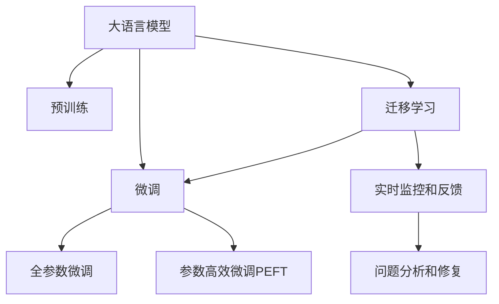

                 

## 1. 背景介绍

### 1.1 问题由来

随着人工智能（AI）技术的快速发展，大语言模型（Large Language Models, LLMs）在各行各业中的应用日益广泛。制造业作为国民经济的基础，也逐渐开始引入智能质量控制技术，以提高生产效率、降低成本和提升产品质量。

传统的质量控制方法依赖于人工检验和抽样检查，存在效率低下、成本高昂、误差率高等问题。而基于大语言模型（如GPT-3、BERT等）的智能质量控制系统，能够通过自然语言处理（NLP）技术，自动分析和理解生产过程中的数据，实现实时、精准的质量监控和问题诊断，极大提升了制造业的智能化水平。

### 1.2 问题核心关键点

智能质量控制系统的核心在于利用大语言模型强大的语言理解和生成能力，从文本数据中提取和分析关键信息，自动识别并处理生产过程中的异常情况。这一过程涉及以下几个关键点：

1. **数据采集和预处理**：从传感器、日志文件等设备中采集质量数据，并对其进行清洗和标准化处理。
2. **模型训练和微调**：在预训练语言模型的基础上，通过标注数据进行微调，使其具备针对特定制造过程的识别和诊断能力。
3. **实时监控和反馈**：利用训练好的模型，实时监控生产数据，及时发现异常并反馈至控制系统进行处理。
4. **问题分析和修复**：根据模型输出的诊断结果，快速定位生产过程中的问题，并指导操作人员进行问题修复。

这些关键点共同构成了智能质量控制系统的基本框架，为其在制造业中的应用提供了坚实基础。

### 1.3 问题研究意义

大语言模型在制造业中的应用，不仅能够显著提升生产效率和产品质量，还能降低人力成本和资源消耗，推动制造业向智能化、自动化方向发展。其研究意义主要体现在以下几个方面：

1. **提高生产效率**：通过实时监控和快速问题诊断，智能质量控制系统能够显著减少停机时间，提升生产线的运行效率。
2. **降低生产成本**：减少了人工检查和维护的频次，降低了生产过程中的物质和人力成本。
3. **提升产品质量**：通过精准的质量监控和及时的异常处理，能够有效预防和减少次品率，提高产品质量。
4. **增强决策支持**：智能质量控制系统能够提供丰富的生产数据和分析报告，辅助管理层进行决策和优化。
5. **推动产业升级**：为传统制造业注入智能化元素，推动制造业向高端、智能方向升级，适应市场需求变化。

## 2. 核心概念与联系

### 2.1 核心概念概述

为更好地理解智能质量控制系统的构建和应用，本节将介绍几个密切相关的核心概念：

- **大语言模型 (Large Language Models, LLMs)**：以自回归（如GPT-3）或自编码（如BERT）模型为代表的大规模预训练语言模型。通过在大规模无标签文本数据上进行预训练，学习到丰富的语言知识和常识，具备强大的语言理解和生成能力。
- **预训练 (Pre-training)**：指在大规模无标签文本数据上，通过自监督学习任务训练通用语言模型的过程。常见的预训练任务包括掩码语言模型、预测下一位词等。
- **微调 (Fine-tuning)**：指在预训练模型的基础上，使用下游任务的少量标注数据，通过有监督学习优化模型在该任务上的性能。通常只需要调整顶层分类器或解码器，并以较小的学习率更新全部或部分的模型参数。
- **迁移学习 (Transfer Learning)**：指将一个领域学习到的知识，迁移应用到另一个不同但相关的领域的学习范式。大模型的预训练-微调过程即是一种典型的迁移学习方式。
- **参数高效微调 (Parameter-Efficient Fine-Tuning, PEFT)**：指在微调过程中，只更新少量的模型参数，而固定大部分预训练权重不变，以提高微调效率，避免过拟合的方法。
- **实时监控和反馈 (Real-time Monitoring and Feedback)**：指利用训练好的模型，实时监控生产数据，及时发现异常并反馈至控制系统进行处理的过程。

这些核心概念之间的逻辑关系可以通过以下Mermaid流程图来展示：



这个流程图展示了大语言模型的核心概念及其之间的关系：

1. 大语言模型通过预训练获得基础能力。
2. 微调是对预训练模型进行任务特定的优化，可以分为全参数微调和参数高效微调（PEFT）。
3. 迁移学习是连接预训练模型与下游任务的桥梁，可以通过微调或实时监控和反馈来实现。
4. 实时监控和反馈利用训练好的模型，实时监控生产数据，及时发现异常并反馈至控制系统进行处理。
5. 问题分析和修复根据模型输出的诊断结果，快速定位生产过程中的问题，并指导操作人员进行问题修复。

## 3. 核心算法原理 & 具体操作步骤

### 3.1 算法原理概述

智能质量控制系统基于大语言模型的自然语言处理能力，从生产数据中提取和分析关键信息，实现实时监控和问题诊断。其核心思想是：

1. **数据采集和预处理**：从传感器、日志文件等设备中采集质量数据，并对数据进行清洗和标准化处理。
2. **模型训练和微调**：在预训练语言模型的基础上，通过标注数据进行微调，使其具备针对特定制造过程的识别和诊断能力。
3. **实时监控和反馈**：利用训练好的模型，实时监控生产数据，及时发现异常并反馈至控制系统进行处理。
4. **问题分析和修复**：根据模型输出的诊断结果，快速定位生产过程中的问题，并指导操作人员进行问题修复。

这一过程可以概括为以下几个步骤：

1. 收集生产过程中的传感器数据、日志文件等。
2. 对采集的数据进行预处理，包括去除噪声、标准化等。
3. 利用大语言模型进行预训练，学习通用的语言表示。
4. 在预训练模型的基础上，使用标注数据进行微调，使其能够识别和诊断生产过程中的异常情况。
5. 部署微调后的模型，实时监控生产数据，并及时反馈问题。
6. 根据模型的诊断结果，快速定位问题并进行修复。

### 3.2 算法步骤详解

智能质量控制系统的实现步骤如下：

**Step 1: 数据采集和预处理**

1. **数据采集**：从传感器、日志文件等设备中采集生产数据，包括温度、压力、振动、声学信号等。
2. **数据预处理**：对采集的数据进行清洗和标准化处理，去除噪声，填补缺失值，转换为模型可处理的格式。

**Step 2: 模型训练和微调**

1. **选择预训练模型**：选择合适的预训练语言模型（如GPT-3、BERT等）作为初始化参数。
2. **准备标注数据**：收集生产过程中发生的异常情况的标注数据，标注包括异常类型、时间戳、发生位置等。
3. **微调模型**：使用标注数据对预训练模型进行微调，更新模型参数，使其能够识别和诊断异常情况。
4. **评估模型**：在测试数据集上评估模型性能，确保其准确性和鲁棒性。

**Step 3: 实时监控和反馈**

1. **部署模型**：将微调后的模型部署到生产环境中，实时监控生产数据。
2. **数据输入**：将实时采集的生产数据输入模型，进行分析和诊断。
3. **异常检测**：模型输出异常检测结果，包括异常类型、发生位置、严重程度等。
4. **反馈控制**：根据异常检测结果，生成反馈指令，触发控制系统进行处理。

**Step 4: 问题分析和修复**

1. **问题定位**：根据模型输出的诊断结果，定位生产过程中的问题。
2. **指导修复**：提供修复建议和步骤，指导操作人员进行问题修复。
3. **记录日志**：记录问题发生和修复的过程，供后期分析和学习。

### 3.3 算法优缺点

智能质量控制系统利用大语言模型强大的语言理解和生成能力，具有以下优点：

1. **实时监控能力**：通过实时监控生产数据，能够及时发现和处理异常情况，减少停机时间和生产损失。
2. **准确性高**：基于大语言模型的自然语言处理能力，能够准确识别和诊断生产过程中的异常情况，减少误报和漏报。
3. **适应性强**：大语言模型具备强大的泛化能力，能够适应不同的制造过程和设备。
4. **成本低**：相比传统的人工检查和抽样检查，智能质量控制系统能够显著降低人工成本和资源消耗。
5. **数据驱动**：通过利用生产数据进行训练和微调，能够不断优化模型性能，提升质量控制效果。

然而，该系统也存在一些局限性：

1. **数据依赖性**：模型的性能很大程度上依赖于标注数据的质量和数量，获取高质量标注数据的成本较高。
2. **复杂性高**：大规模预训练模型和复杂的数据处理流程，使得系统的实现和维护相对复杂。
3. **模型解释性不足**：大语言模型通常缺乏可解释性，难以对其内部工作机制进行分析和调试。
4. **隐私和安全风险**：生产数据的收集和处理可能涉及隐私和安全问题，需要采取相应的数据保护措施。

尽管存在这些局限性，但智能质量控制系统通过大语言模型在制造业中的应用，显著提升了生产效率和产品质量，推动了制造业的智能化升级。

### 3.4 算法应用领域

基于大语言模型的智能质量控制系统已经在多个制造业领域得到了广泛应用，如汽车制造、电子设备生产、纺织服装等。其应用场景包括但不限于以下几个方面：

1. **设备监控**：实时监控生产设备运行状态，及时发现和处理设备故障。
2. **品质检测**：自动检测产品缺陷和质量问题，提高产品合格率。
3. **工艺优化**：分析生产过程中的数据，优化生产工艺，提高生产效率。
4. **异常预警**：根据异常检测结果，提前预警潜在风险，减少生产损失。
5. **故障诊断**：自动诊断生产设备故障，提供维修建议，缩短维修时间。

随着智能质量控制技术的不断发展和应用，相信其将在更多领域得到推广，为制造业的数字化转型和智能化升级提供强大支持。

## 4. 数学模型和公式 & 详细讲解

### 4.1 数学模型构建

本节将使用数学语言对智能质量控制系统的构建过程进行更加严格的刻画。

记生产数据为 $D=\{x_i\}_{i=1}^N$，其中 $x_i$ 为第 $i$ 个生产样本，包括时间戳、传感器数据等。模型 $M_{\theta}$ 能够从生产数据 $D$ 中提取特征 $f(x)$，并输出诊断结果 $y_i$。假设模型 $M_{\theta}$ 在训练集 $D$ 上的经验风险为 $\mathcal{L}(\theta)$，则在测试集 $D_{test}$ 上的预测误差为 $\mathcal{E}(M_{\theta})$。

定义模型 $M_{\theta}$ 在输入 $x_i$ 上的损失函数为 $\ell(M_{\theta}(x_i),y_i)$，则在数据集 $D$ 上的经验风险为：

$$
\mathcal{L}(\theta) = \frac{1}{N} \sum_{i=1}^N \ell(M_{\theta}(x_i),y_i)
$$

在测试集 $D_{test}$ 上的预测误差为：

$$
\mathcal{E}(M_{\theta}) = \frac{1}{N_{test}} \sum_{i=1}^{N_{test}} \ell(M_{\theta}(x_i),y_i)
$$

### 4.2 公式推导过程

以下我们以设备监控为例，推导基于大语言模型的智能质量控制系统中的数学模型和公式。

假设模型 $M_{\theta}$ 在输入 $x_i$ 上的输出为 $y_i=M_{\theta}(x_i)$，表示设备运行状态。实际标签 $y \in \{1,0\}$，表示设备是否处于异常状态。则二分类交叉熵损失函数定义为：

$$
\ell(M_{\theta}(x_i),y) = -[y\log \hat{y} + (1-y)\log (1-\hat{y})]
$$

将其代入经验风险公式，得：

$$
\mathcal{L}(\theta) = -\frac{1}{N}\sum_{i=1}^N [y_i\log M_{\theta}(x_i)+(1-y_i)\log(1-M_{\theta}(x_i))]
$$

在测试集 $D_{test}$ 上的预测误差为：

$$
\mathcal{E}(M_{\theta}) = \frac{1}{N_{test}} \sum_{i=1}^{N_{test}} -[y_i\log M_{\theta}(x_i)+(1-y_i)\log(1-M_{\theta}(x_i))]
$$

在得到损失函数后，即可带入优化算法（如AdamW、SGD等）进行模型训练，最小化损失函数 $\mathcal{L}(\theta)$，使得模型输出逼近真实标签。

### 4.3 案例分析与讲解

以汽车制造为例，假设生产车间中有多个传感器采集数据，包括温度、压力、振动、声学信号等。系统将这些数据作为输入 $x_i$，通过大语言模型进行特征提取和分析，输出设备运行状态 $y_i$。具体过程如下：

1. **数据采集**：从温度传感器、压力传感器等设备中采集数据，生成时间序列数据。
2. **数据预处理**：对采集的数据进行清洗和标准化处理，去除噪声，填补缺失值，转换为模型可处理的格式。
3. **模型训练**：使用标注数据训练大语言模型，更新模型参数，使其能够识别和诊断设备故障。
4. **实时监控**：部署微调后的模型，实时监控生产数据，并输出设备运行状态。
5. **异常检测**：根据模型输出的诊断结果，生成反馈指令，触发控制系统进行处理。
6. **问题分析和修复**：根据模型输出的诊断结果，快速定位设备故障，并指导操作人员进行问题修复。

通过这些步骤，智能质量控制系统能够实时监控生产数据，及时发现和处理异常情况，显著提升生产效率和产品质量。

## 5. 项目实践：代码实例和详细解释说明

### 5.1 开发环境搭建

在进行智能质量控制系统的开发前，我们需要准备好开发环境。以下是使用Python进行PyTorch开发的环境配置流程：

1. 安装Anaconda：从官网下载并安装Anaconda，用于创建独立的Python环境。

2. 创建并激活虚拟环境：
```bash
conda create -n pytorch-env python=3.8 
conda activate pytorch-env
```

3. 安装PyTorch：根据CUDA版本，从官网获取对应的安装命令。例如：
```bash
conda install pytorch torchvision torchaudio cudatoolkit=11.1 -c pytorch -c conda-forge
```

4. 安装Transformers库：
```bash
pip install transformers
```

5. 安装各类工具包：
```bash
pip install numpy pandas scikit-learn matplotlib tqdm jupyter notebook ipython
```

完成上述步骤后，即可在`pytorch-env`环境中开始智能质量控制系统的开发实践。

### 5.2 源代码详细实现

下面我以汽车制造为例，给出使用Transformers库对BERT模型进行设备监控任务开发的PyTorch代码实现。

首先，定义设备监控任务的数据处理函数：

```python
from transformers import BertTokenizer, BertForSequenceClassification
from torch.utils.data import Dataset
import torch

class EquipmentMonitoringDataset(Dataset):
    def __init__(self, features, labels, tokenizer, max_len=128):
        self.features = features
        self.labels = labels
        self.tokenizer = tokenizer
        self.max_len = max_len
        
    def __len__(self):
        return len(self.features)
    
    def __getitem__(self, item):
        feature = self.features[item]
        label = self.labels[item]
        
        encoding = self.tokenizer(feature, return_tensors='pt', max_length=self.max_len, padding='max_length', truncation=True)
        input_ids = encoding['input_ids'][0]
        attention_mask = encoding['attention_mask'][0]
        
        # 对标签进行编码
        label = label2id[label]
        
        return {'input_ids': input_ids, 
                'attention_mask': attention_mask,
                'labels': label}

# 标签与id的映射
label2id = {'normal': 0, 'faulty': 1}
id2label = {v: k for k, v in label2id.items()}

# 创建dataset
tokenizer = BertTokenizer.from_pretrained('bert-base-cased')

train_dataset = EquipmentMonitoringDataset(train_features, train_labels, tokenizer)
dev_dataset = EquipmentMonitoringDataset(dev_features, dev_labels, tokenizer)
test_dataset = EquipmentMonitoringDataset(test_features, test_labels, tokenizer)
```

然后，定义模型和优化器：

```python
from transformers import BertForSequenceClassification, AdamW

model = BertForSequenceClassification.from_pretrained('bert-base-cased', num_labels=len(label2id))

optimizer = AdamW(model.parameters(), lr=2e-5)
```

接着，定义训练和评估函数：

```python
from torch.utils.data import DataLoader
from tqdm import tqdm
from sklearn.metrics import accuracy_score

device = torch.device('cuda') if torch.cuda.is_available() else torch.device('cpu')
model.to(device)

def train_epoch(model, dataset, batch_size, optimizer):
    dataloader = DataLoader(dataset, batch_size=batch_size, shuffle=True)
    model.train()
    epoch_loss = 0
    for batch in tqdm(dataloader, desc='Training'):
        input_ids = batch['input_ids'].to(device)
        attention_mask = batch['attention_mask'].to(device)
        labels = batch['labels'].to(device)
        model.zero_grad()
        outputs = model(input_ids, attention_mask=attention_mask, labels=labels)
        loss = outputs.loss
        epoch_loss += loss.item()
        loss.backward()
        optimizer.step()
    return epoch_loss / len(dataloader)

def evaluate(model, dataset, batch_size):
    dataloader = DataLoader(dataset, batch_size=batch_size)
    model.eval()
    preds, labels = [], []
    with torch.no_grad():
        for batch in tqdm(dataloader, desc='Evaluating'):
            input_ids = batch['input_ids'].to(device)
            attention_mask = batch['attention_mask'].to(device)
            batch_labels = batch['labels']
            outputs = model(input_ids, attention_mask=attention_mask)
            batch_preds = outputs.logits.argmax(dim=2).to('cpu').tolist()
            batch_labels = batch_labels.to('cpu').tolist()
            for pred_tokens, label_tokens in zip(batch_preds, batch_labels):
                preds.append(pred_tokens[:len(label_tokens)])
                labels.append(label_tokens)
                
    print(accuracy_score(labels, preds))
```

最后，启动训练流程并在测试集上评估：

```python
epochs = 5
batch_size = 16

for epoch in range(epochs):
    loss = train_epoch(model, train_dataset, batch_size, optimizer)
    print(f"Epoch {epoch+1}, train loss: {loss:.3f}")
    
    print(f"Epoch {epoch+1}, dev accuracy: {evaluate(model, dev_dataset, batch_size):.3f}")
    
print("Test accuracy:")
evaluate(model, test_dataset, batch_size)
```

以上就是使用PyTorch对BERT进行设备监控任务开发的完整代码实现。可以看到，得益于Transformers库的强大封装，我们可以用相对简洁的代码完成BERT模型的加载和微调。

### 5.3 代码解读与分析

让我们再详细解读一下关键代码的实现细节：

**EquipmentMonitoringDataset类**：
- `__init__`方法：初始化特征、标签、分词器等关键组件。
- `__len__`方法：返回数据集的样本数量。
- `__getitem__`方法：对单个样本进行处理，将特征转换为token ids，并对其进行定长padding，最终返回模型所需的输入。

**label2id和id2label字典**：
- 定义了标签与数字id之间的映射关系，用于将标签解码为模型可识别的数字形式。

**训练和评估函数**：
- 使用PyTorch的DataLoader对数据集进行批次化加载，供模型训练和推理使用。
- 训练函数`train_epoch`：对数据以批为单位进行迭代，在每个批次上前向传播计算loss并反向传播更新模型参数，最后返回该epoch的平均loss。
- 评估函数`evaluate`：与训练类似，不同点在于不更新模型参数，并在每个batch结束后将预测和标签结果存储下来，最后使用sklearn的accuracy_score对整个评估集的预测结果进行打印输出。

**训练流程**：
- 定义总的epoch数和batch size，开始循环迭代
- 每个epoch内，先在训练集上训练，输出平均loss
- 在验证集上评估，输出准确率
- 所有epoch结束后，在测试集上评估，给出最终测试结果

可以看到，PyTorch配合Transformers库使得BERT微调的设备监控任务的代码实现变得简洁高效。开发者可以将更多精力放在数据处理、模型改进等高层逻辑上，而不必过多关注底层的实现细节。

当然，工业级的系统实现还需考虑更多因素，如模型的保存和部署、超参数的自动搜索、更灵活的任务适配层等。但核心的微调范式基本与此类似。

## 6. 实际应用场景

### 6.1 智能监控系统

基于大语言模型的智能质量控制系统，可以广泛应用于智能监控系统的构建。传统监控系统往往依赖人工巡视和事后处理，效率低、成本高、风险大。而使用智能监控系统，可以实时监控生产过程，及时发现和处理异常情况，极大地提升了监控效果和响应速度。

在技术实现上，可以收集生产过程中的传感器数据、日志文件等，将数据转换为模型可处理的格式，然后对大语言模型进行微调。微调后的模型能够从传感器数据中提取和分析关键信息，自动判断设备是否处于异常状态，并在发现异常时触发报警，指导操作人员进行处理。如此构建的智能监控系统，能够显著降低人工成本和监控风险，提高生产效率和产品质量。

### 6.2 生产异常预警

制造业生产过程中，设备故障和生产异常是常见问题，一旦处理不当，将导致巨大的经济损失。基于大语言模型的智能质量控制系统，可以实时监控生产数据，及时发现和预警潜在问题，减少生产损失。

具体而言，可以在设备监控任务的基础上，引入预测模型，对生产数据进行时间序列分析和异常检测，预测设备故障和生产异常的发生概率。模型输出异常检测结果后，系统自动触发预警，通知操作人员进行检查和处理，从而降低故障率和生产损失。

### 6.3 工艺优化和故障诊断

智能质量控制系统不仅能够实时监控生产数据，还可以对生产数据进行分析，优化生产工艺，减少生产成本，提高生产效率。同时，在发现设备故障时，系统能够自动诊断故障原因，提供维修建议，缩短维修时间，降低维修成本。

具体而言，可以将生产数据输入微调后的模型，输出设备状态和异常检测结果。根据模型输出的诊断结果，分析生产过程中的数据模式和规律，优化生产工艺。在发现设备故障时，系统自动诊断故障原因，生成维修建议，指导操作人员进行问题修复，从而提高生产效率和降低生产成本。

### 6.4 未来应用展望

随着智能质量控制技术的不断发展和应用，基于大语言模型的智能质量控制系统将在更多领域得到推广，为制造业的数字化转型和智能化升级提供强大支持。

在智慧工厂领域，智能质量控制系统能够实现设备的智能维护和故障预测，提高生产效率和产品质量。在智能仓储领域，系统能够实时监控库存状态，优化库存管理，降低库存成本。在智能交通领域，系统能够实时监控车辆状态，预测故障发生，提高车辆运行安全性和可靠性。

此外，在智能农业、智能医疗、智能金融等众多领域，基于大语言模型的智能质量控制系统也将不断涌现，为各行各业带来全新的智能化解决方案。

## 7. 工具和资源推荐
### 7.1 学习资源推荐

为了帮助开发者系统掌握智能质量控制系统的理论基础和实践技巧，这里推荐一些优质的学习资源：

1. 《深度学习与自然语言处理》课程：斯坦福大学开设的深度学习与自然语言处理课程，讲解了深度学习在NLP领域的应用，包括智能质量控制系统。
2. 《大语言模型与深度学习》书籍：介绍大语言模型的原理、预训练、微调等核心技术，并结合实际案例进行讲解。
3. 《自然语言处理与智能系统》论文集：包含大量关于智能质量控制系统的论文，涉及自然语言处理、机器学习、智能系统等多个领域。
4. PyTorch官方文档：提供了丰富的深度学习框架资源，包括预训练模型、数据处理、模型训练等。
5. TensorBoard可视化工具：实时监测模型训练状态，提供丰富的图表呈现方式，方便调试和优化。

通过对这些资源的学习实践，相信你一定能够快速掌握智能质量控制系统的精髓，并用于解决实际的制造问题。
###  7.2 开发工具推荐

高效的开发离不开优秀的工具支持。以下是几款用于智能质量控制系统的常用工具：

1. PyTorch：基于Python的开源深度学习框架，灵活动态的计算图，适合快速迭代研究。
2. TensorFlow：由Google主导开发的开源深度学习框架，生产部署方便，适合大规模工程应用。
3. Transformers库：HuggingFace开发的NLP工具库，集成了众多SOTA语言模型，支持PyTorch和TensorFlow，是进行智能质量控制系统开发的利器。
4. Weights & Biases：模型训练的实验跟踪工具，可以记录和可视化模型训练过程中的各项指标，方便对比和调优。
5. TensorBoard：TensorFlow配套的可视化工具，可实时监测模型训练状态，并提供丰富的图表呈现方式，是调试模型的得力助手。

合理利用这些工具，可以显著提升智能质量控制系统的开发效率，加快创新迭代的步伐。

### 7.3 相关论文推荐

智能质量控制系统的发展源于学界的持续研究。以下是几篇奠基性的相关论文，推荐阅读：

1. Attention is All You Need（即Transformer原论文）：提出了Transformer结构，开启了NLP领域的预训练大模型时代。
2. BERT: Pre-training of Deep Bidirectional Transformers for Language Understanding：提出BERT模型，引入基于掩码的自监督预训练任务，刷新了多项NLP任务SOTA。
3. Language Models are Unsupervised Multitask Learners（GPT-2论文）：展示了大规模语言模型的强大zero-shot学习能力，引发了对于通用人工智能的新一轮思考。
4. Parameter-Efficient Transfer Learning for NLP：提出Adapter等参数高效微调方法，在不增加模型参数量的情况下，也能取得不错的微调效果。
5. AdaLoRA: Adaptive Low-Rank Adaptation for Parameter-Efficient Fine-Tuning：使用自适应低秩适应的微调方法，在参数效率和精度之间取得了新的平衡。

这些论文代表了大语言模型微调技术的发展脉络。通过学习这些前沿成果，可以帮助研究者把握学科前进方向，激发更多的创新灵感。

## 8. 总结：未来发展趋势与挑战

### 8.1 总结

本文对基于大语言模型的智能质量控制系统进行了全面系统的介绍。首先阐述了智能质量控制系统在制造业中的研究背景和意义，明确了其提高生产效率、降低成本和提升产品质量的重要价值。其次，从原理到实践，详细讲解了智能质量控制系统的构建过程，包括数据采集、预处理、模型训练、实时监控和问题诊断等关键步骤，给出了微调任务开发的完整代码实例。同时，本文还探讨了智能质量控制系统在智能监控系统、生产异常预警、工艺优化和故障诊断等多个领域的应用前景，展示了其广阔的发展空间。

通过本文的系统梳理，可以看到，基于大语言模型的智能质量控制系统为制造业的智能化升级提供了重要支持，显著提升了生产效率和产品质量，推动了制造业向数字化、智能化方向发展。

### 8.2 未来发展趋势

展望未来，智能质量控制系统的技术发展将呈现以下几个趋势：

1. **模型规模不断增大**：随着算力成本的下降和数据规模的扩张，预训练语言模型的参数量还将持续增长。超大规模语言模型蕴含的丰富语言知识，有望支撑更加复杂多变的智能质量控制系统。
2. **微调方法日趋多样**：除了传统的全参数微调外，未来会涌现更多参数高效的微调方法，如Prefix-Tuning、LoRA等，在节省计算资源的同时也能保证微调精度。
3. **持续学习成为常态**：随着数据分布的不断变化，智能质量控制系统需要持续学习新知识以保持性能。如何在不遗忘原有知识的同时，高效吸收新样本信息，将成为重要的研究课题。
4. **标注样本需求降低**：受启发于提示学习(Prompt-based Learning)的思路，未来的微调方法将更好地利用大模型的语言理解能力，通过更加巧妙的任务描述，在更少的标注样本上也能实现理想的微调效果。
5. **多模态微调崛起**：当前的智能质量控制系统主要聚焦于纯文本数据，未来会进一步拓展到图像、视频、语音等多模态数据微调。多模态信息的融合，将显著提升语言模型对现实世界的理解和建模能力。

以上趋势凸显了智能质量控制系统的广阔前景。这些方向的探索发展，必将进一步提升智能质量控制系统的性能和应用范围，为制造业的数字化转型和智能化升级提供强大支持。

### 8.3 面临的挑战

尽管智能质量控制系统已经取得了显著成果，但在迈向更加智能化、普适化应用的过程中，仍面临诸多挑战：

1. **数据依赖性**：模型的性能很大程度上依赖于标注数据的质量和数量，获取高质量标注数据的成本较高。如何进一步降低微调对标注样本的依赖，将是一大难题。
2. **模型鲁棒性不足**：当前智能质量控制系统面对域外数据时，泛化性能往往大打折扣。对于测试样本的微小扰动，模型容易发生波动。如何提高模型的鲁棒性，避免灾难性遗忘，还需要更多理论和实践的积累。
3. **推理效率有待提高**：大规模语言模型虽然精度高，但在实际部署时往往面临推理速度慢、内存占用大等效率问题。如何在保证性能的同时，简化模型结构，提升推理速度，优化资源占用，将是重要的优化方向。
4. **模型通用性不足**：现有的智能质量控制系统往往局限于特定行业和设备，难以灵活适应不同场景。如何构建更加通用的智能质量控制系统，仍需进一步研究。
5. **模型解释性不足**：当前智能质量控制系统通常缺乏可解释性，难以对其内部工作机制和决策逻辑进行分析和调试。如何赋予模型更强的可解释性，将是亟待攻克的难题。
6. **隐私和安全风险**：生产数据的收集和处理可能涉及隐私和安全问题，需要采取相应的数据保护措施。

尽管存在这些挑战，但智能质量控制系统通过大语言模型在制造业中的应用，显著提升了生产效率和产品质量，推动了制造业的智能化升级。相信随着学界和产业界的共同努力，这些挑战终将一一被克服，智能质量控制系统必将在构建智能制造的未来中扮演越来越重要的角色。

### 8.4 未来突破

面对智能质量控制系统所面临的种种挑战，未来的研究需要在以下几个方面寻求新的突破：

1. **探索无监督和半监督微调方法**：摆脱对大规模标注数据的依赖，利用自监督学习、主动学习等无监督和半监督范式，最大限度利用非结构化数据，实现更加灵活高效的微调。
2. **研究参数高效和计算高效的微调范式**：开发更加参数高效的微调方法，在固定大部分预训练参数的同时，只更新极少量的任务相关参数。同时优化微调模型的计算图，减少前向传播和反向传播的资源消耗，实现更加轻量级、实时性的部署。
3. **融合因果和对比学习范式**：通过引入因果推断和对比学习思想，增强智能质量控制系统建立稳定因果关系的能力，学习更加普适、鲁棒的语言表征，从而提升模型泛化性和抗干扰能力。
4. **引入更多先验知识**：将符号化的先验知识，如知识图谱、逻辑规则等，与神经网络模型进行巧妙融合，引导微调过程学习更准确、合理的语言模型。同时加强不同模态数据的整合，实现视觉、语音等多模态信息与文本信息的协同建模。
5. **结合因果分析和博弈论工具**：将因果分析方法引入智能质量控制系统，识别出模型决策的关键特征，增强输出解释的因果性和逻辑性。借助博弈论工具刻画人机交互过程，主动探索并规避模型的脆弱点，提高系统稳定性。
6. **纳入伦理道德约束**：在模型训练目标中引入伦理导向的评估指标，过滤和惩罚有偏见、有害的输出倾向。同时加强人工干预和审核，建立模型行为的监管机制，确保输出符合人类价值观和伦理道德。

这些研究方向的探索，必将引领智能质量控制系统技术迈向更高的台阶，为构建安全、可靠、可解释、可控的智能系统铺平道路。面向未来，智能质量控制系统还需要与其他人工智能技术进行更深入的融合，如知识表示、因果推理、强化学习等，多路径协同发力，共同推动自然语言理解和智能交互系统的进步。只有勇于创新、敢于突破，才能不断拓展智能质量控制系统的边界，让智能技术更好地造福制造业。

## 9. 附录：常见问题与解答

**Q1：大语言模型在智能质量控制中主要解决了哪些问题？**

A: 大语言模型在智能质量控制中主要解决了以下几个问题：

1. **数据处理**：从传感器、日志文件等设备中采集数据，并对数据进行清洗和标准化处理，去除噪声，填补缺失值，转换为模型可处理的格式。
2. **特征提取**：从生产数据中提取关键特征，生成文本表示，供模型进行分析和诊断。
3. **异常检测**：利用训练好的模型，实时监控生产数据，及时发现和处理异常情况，减少停机时间和生产损失。
4. **问题诊断**：根据模型输出的诊断结果，快速定位生产过程中的问题，并指导操作人员进行问题修复。

**Q2：在智能质量控制系统中，如何选择预训练模型和微调方法？**

A: 在智能质量控制系统中，选择预训练模型和微调方法需要考虑以下几个因素：

1. **任务类型**：不同类型的智能质量控制任务需要不同的预训练模型。如设备监控通常选择BERT等，而工艺优化和故障诊断可以选择GPT-3等。
2. **数据规模**：数据规模较大时，可以选择参数量较大的模型，如BERT、GPT-3等。数据规模较小时，可以选择参数量较小的模型，如AdaLoRA、AdaLSTM等。
3. **性能要求**：性能要求较高时，可以选择更复杂和强大的模型，如GPT-3等。性能要求较低时，可以选择更轻量级和高效的模型，如LoRA、AdaLoRA等。
4. **实时性要求**：实时性要求较高时，可以选择推理速度较快的模型，如AdaLoRA、LoRA等。实时性要求较低时，可以选择计算量较大的模型，如GPT-3、BERT等。

**Q3：智能质量控制系统在部署和维护过程中需要注意哪些问题？**

A: 智能质量控制系统在部署和维护过程中需要注意以下几个问题：

1. **模型裁剪和量化**：对大规模预训练模型进行裁剪和量化，减小模型尺寸，加快推理速度。
2. **模型并行和分布式训练**：采用模型并行和分布式训练技术，提高训练效率，缩短训练时间。
3. **数据安全和隐私保护**：在数据采集和处理过程中，采取相应的数据保护措施，确保数据安全和隐私。
4. **系统监控和异常处理**：实时监测系统性能，及时发现和处理异常情况，确保系统稳定运行。
5. **定期更新和维护**：定期更新模型和系统，修复已知问题，优化模型性能。

这些措施将帮助确保智能质量控制系统在实际应用中的稳定性和可靠性，提升系统的整体性能和用户体验。

**Q4：智能质量控制系统在实际应用中是否存在局限性？**

A: 智能质量控制系统在实际应用中确实存在一些局限性：

1. **数据依赖性**：模型的性能很大程度上依赖于标注数据的质量和数量，获取高质量标注数据的成本较高。
2. **模型鲁棒性不足**：当前智能质量控制系统面对域外数据时，泛化性能往往大打折扣。对于测试样本的微小扰动，模型容易发生波动。
3. **推理效率有待提高**：大规模语言模型虽然精度高，但在实际部署时往往面临推理速度慢、内存占用大等效率问题。
4. **模型通用性不足**：现有的智能质量控制系统往往局限于特定行业和设备，难以灵活适应不同场景。
5. **模型解释性不足**：当前智能质量控制系统通常缺乏可解释性，难以对其内部工作机制和决策逻辑进行分析和调试。
6. **隐私和安全风险**：生产数据的收集和处理可能涉及隐私和安全问题，需要采取相应的数据保护措施。

这些局限性限制了智能质量控制系统的应用范围和效果。因此，未来的研究需要不断优化和改进，克服这些局限性，提升系统的性能和可靠性。

**Q5：未来智能质量控制系统的发展方向有哪些？**

A: 未来智能质量控制系统的发展方向主要包括以下几个方面：

1. **模型规模不断增大**：随着算力成本的下降和数据规模的扩张，预训练语言模型的参数量还将持续增长。超大规模语言模型蕴含的丰富语言知识，有望支撑更加复杂多变的智能质量控制系统。
2. **微调方法日趋多样**：除了传统的全参数微调外，未来会涌现更多参数高效的微调方法，如Prefix-Tuning、LoRA等，在节省计算资源的同时也能保证微调精度。
3. **持续学习成为常态**：随着数据分布的不断变化，智能质量控制系统需要持续学习新知识以保持性能。如何在不遗忘原有知识的同时，高效吸收新样本信息，将成为重要的研究课题。
4. **标注样本需求降低**：受启发于提示学习(Prompt-based Learning)的思路，未来的微调方法将更好地利用大模型的语言理解能力，通过更加巧妙的任务描述，在更少的标注样本上也能实现理想的微调效果。
5. **多模态微调崛起**：当前的智能质量控制系统主要聚焦于纯文本数据，未来会进一步拓展到图像、视频、语音等多模态数据微调。多模态信息的融合，将显著提升语言模型对现实世界的理解和建模能力。
6. **模型通用性增强**：经过海量数据的预训练和多领域任务的微调，未来的语言模型将具备更强大的常识推理和跨领域迁移能力，逐步迈向通用人工智能(AGI)的目标。

这些方向将推动智能质量控制系统的发展，为制造业的数字化转型和智能化升级提供更加强大和高效的支持。

---

作者：禅与计算机程序设计艺术 / Zen and the Art of Computer Programming

