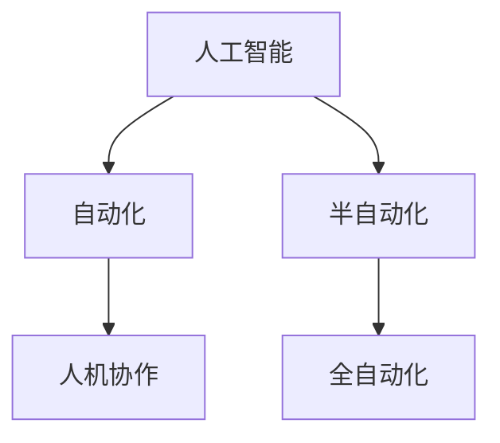

                 

# 未来工作：人机协作，重塑职业版图

## 1. 背景介绍

随着人工智能（AI）技术的不断进步，我们已经目睹了从自动化到半自动化，再到全自动化的一系列演变。这些技术进步不仅改变了我们的工作方式，也重新定义了职业版图。其中，AI与人类之间的协作关系，成为了这一变革的关键驱动力。

### 1.1 问题由来

自动化最初在制造业中取得了巨大成功，但随着技术的成熟，它开始逐渐渗透到服务业、金融、医疗、教育等多个领域。AI的强大计算能力和智能决策能力，使得它能够在这些领域中执行大量重复性和高风险的任务，极大地提高了生产效率和质量。

然而，这些进步同时也带来了新的问题。机器取代了大量劳动密集型和知识型工作，导致了大量失业，并对社会结构产生了深远影响。同时，AI技术的普及也引发了关于隐私、安全、伦理等诸多伦理问题。因此，如何在AI与人类之间建立有效协作，共同推动社会进步，成为了我们必须面对的重大课题。

### 1.2 问题核心关键点

要解决上述问题，关键在于理解AI与人类协作的机制，并制定相应的策略。核心关键点包括：

- **技术协同**：如何结合AI的计算能力和人类的直觉、创造力，形成互补优势。
- **角色定位**：AI与人类各自在协作中的角色，以及如何合理分配任务。
- **伦理规范**：在AI应用过程中，如何确保公平性、透明性和可解释性，以及隐私保护。
- **社会影响**：AI技术的普及对就业、教育、治理等社会结构的影响，以及应对策略。

这些关键点共同构成了AI时代人机协作的全面框架，旨在通过技术与人类之间的深度融合，共同推动社会进步。

## 2. 核心概念与联系

### 2.1 核心概念概述

为了更好地理解人机协作的机制和策略，我们首先介绍几个核心概念：

- **人工智能（AI）**：指通过机器学习、深度学习等技术，使计算机具备类似人类的智能决策能力。
- **自动化（Automation）**：指通过技术手段，使机器能够自动执行任务，减少人为干预。
- **半自动化（Semi-Automation）**：指在自动化基础上，结合人类的监督和干预，进一步提升系统的性能和灵活性。
- **全自动化（Full Automation）**：指机器能够完全自主执行任务，无需人类干预。
- **人机协作（Human-Machine Collaboration）**：指AI与人类在任务执行过程中形成互补，共同推动任务的完成。

这些概念之间的关系可以通过以下Mermaid流程图来展示：



这个流程图展示了自动化、半自动化和全自动化分别在人机协作中的角色，以及它们之间的关系。

## 3. 核心算法原理 & 具体操作步骤

### 3.1 算法原理概述

人机协作的核心算法原理基于增强学习（Reinforcement Learning, RL）。在增强学习中，机器通过与环境的交互，不断调整自身的行为策略，以最大化预定义的奖励信号。这一过程与人类的学习和决策过程类似，因此非常适合应用于人机协作的场景。

增强学习可以分为基于值（Value-based）和策略（Policy-based）两种方法。在基于值的方法中，机器通过学习状态-动作值函数，选择最优动作。在基于策略的方法中，机器通过学习策略函数，直接输出动作。这些方法在不同场景中各有优劣，需要根据具体情况进行选择。

### 3.2 算法步骤详解

人机协作的算法步骤大致分为以下几个环节：

**Step 1: 环境构建**
- 定义任务环境和目标。例如，在工业自动化中，任务环境可能是生产线上的设备状态监控，目标是通过状态监控提前预测设备故障。
- 设计状态空间和动作空间。状态空间是任务环境的所有可能状态，动作空间是机器可以采取的所有行动。

**Step 2: 模型训练**
- 选择模型结构，如深度神经网络、卷积神经网络、递归神经网络等。
- 根据任务环境和目标，设计奖励函数。例如，在故障预测中，奖励函数可以是提前检测到故障的时间。
- 使用增强学习算法，如Q-Learning、Deep Q-Network（DQN）等，对模型进行训练。

**Step 3: 策略优化**
- 在训练过程中，通过与环境的交互，不断调整模型的策略函数。例如，在故障预测中，通过调整模型的输入特征和权重，提高故障检测的准确性。
- 通过探索-利用平衡，保证模型的泛化能力和适应性。例如，在故障预测中，既要利用已有知识进行预测，又要探索新的数据来源。

**Step 4: 协作执行**
- 将训练好的模型应用于实际任务环境中。例如，在故障预测中，将模型集成到设备监控系统中，实时进行故障检测。
- 与人类协作，共同完成任务。例如，在故障预测中，机器负责进行故障检测，人类负责处理和反馈故障信息。

### 3.3 算法优缺点

人机协作的增强学习算法具有以下优点：

- **灵活性高**：可以根据任务需求和环境变化，动态调整策略，适应性强。
- **鲁棒性强**：在面对复杂、不确定的环境时，能够通过不断的学习和调整，保持较高的性能。
- **可解释性**：通过模型训练过程和奖励函数设计，可以较好地解释模型的行为和决策逻辑。

同时，也存在一些缺点：

- **计算成本高**：增强学习算法需要大量的计算资源，特别是在模型训练和策略优化阶段。
- **数据需求大**：训练模型需要大量的样本数据，特别是在复杂环境下的数据采集和标注。
- **复杂度高**：模型设计和策略优化过程复杂，需要专业的知识和技能。

这些优缺点决定了增强学习算法在特定场景下的适用性和局限性。

### 3.4 算法应用领域

人机协作的增强学习算法在多个领域中得到了广泛应用，例如：

- **自动化制造**：通过状态监控和故障预测，提高生产效率和设备可靠性。
- **智能交通**：通过交通流量监控和路径规划，优化交通流量，减少拥堵。
- **医疗诊断**：通过病历分析和影像识别，辅助医生进行疾病诊断和治疗方案制定。
- **教育辅导**：通过学生行为分析和个性化推荐，提升教学效果和学习体验。
- **金融分析**：通过市场分析和投资策略优化，提高投资回报率。

这些应用场景展示了增强学习算法在人机协作中的强大能力，推动了各行各业的智能化转型。

## 4. 数学模型和公式 & 详细讲解 & 举例说明

### 4.1 数学模型构建

在人机协作中，增强学习模型可以表示为：

$$
\pi(a_t|s_t) = \frac{e^{\hat{Q}(s_t,a_t)}}{\sum_{a' \in A} e^{\hat{Q}(s_t,a')}}
$$

其中，$\pi(a_t|s_t)$ 表示在状态 $s_t$ 下采取动作 $a_t$ 的概率分布，$\hat{Q}(s_t,a_t)$ 表示状态-动作值函数的估计值。

**Step 1: 状态-动作值函数估计**
通过离线学习，模型对状态-动作值函数进行估计，即：

$$
\hat{Q}(s_t,a_t) = \sum_{i=1}^{k} \alpha_i Q(s_t,a_t| \theta_i)
$$

其中，$Q(s_t,a_t| \theta_i)$ 表示第 $i$ 个模型的状态-动作值函数，$\alpha_i$ 表示模型的权重。

**Step 2: 策略优化**
通过在线学习，模型不断调整策略函数，即：

$$
\pi(a_t|s_t) = \arg\max_{a \in A} \hat{Q}(s_t,a)
$$

其中，$A$ 表示动作空间。

### 4.2 公式推导过程

以故障预测为例，展示增强学习模型的推导过程。

**Step 1: 状态-动作值函数估计**
假设状态空间 $S$ 包括设备正常状态、设备预警状态、设备故障状态三种状态。动作空间 $A$ 包括状态监控、故障维修、停机维护三种动作。则状态-动作值函数可以表示为：

$$
\hat{Q}(s_t,a_t) = \alpha_1 Q(s_t,a_t| \theta_1) + \alpha_2 Q(s_t,a_t| \theta_2) + \alpha_3 Q(s_t,a_t| \theta_3)
$$

其中，$\theta_i$ 表示第 $i$ 个模型的参数。

**Step 2: 策略优化**
假设奖励函数 $R(s_t,a_t)$ 表示提前检测到故障的时间，则增强学习模型的策略函数可以表示为：

$$
\pi(a_t|s_t) = \arg\max_{a \in A} \sum_{i=1}^{3} \alpha_i R(s_t,a_t| \theta_i)
$$

通过不断调整 $\alpha_i$ 和 $\theta_i$，优化策略函数，提高故障预测的准确性和时效性。

### 4.3 案例分析与讲解

以金融市场分析为例，展示增强学习模型的应用。

**Step 1: 环境构建**
假设金融市场数据包括股票价格、成交量、市场情绪等多种特征。市场分析的目标是通过这些特征预测股票价格走势，最大收益。

**Step 2: 模型训练**
使用深度神经网络作为增强学习模型的基础结构。通过历史数据，设计奖励函数 $R(s_t,a_t)$ 为股票收益。使用增强学习算法，如DQN，对模型进行训练。

**Step 3: 策略优化**
通过不断的在线学习，调整模型参数和策略函数，提高市场预测的准确性。例如，通过调整模型权重和特征选择，优化市场分析策略。

**Step 4: 协作执行**
将训练好的模型应用于金融市场分析，实时预测股票价格走势，与人类交易员共同制定交易策略。

## 5. 项目实践：代码实例和详细解释说明

### 5.1 开发环境搭建

要进行人机协作的增强学习实践，需要搭建一个包含数据采集、模型训练、策略优化的环境。以下是一个Python开发环境的搭建步骤：

1. **安装Anaconda**：从官网下载并安装Anaconda，用于创建独立的Python环境。

2. **创建并激活虚拟环境**：
```bash
conda create -n pytorch-env python=3.8 
conda activate pytorch-env
```

3. **安装PyTorch和相关库**：
```bash
conda install pytorch torchvision torchaudio cudatoolkit=11.1 -c pytorch -c conda-forge
```

4. **安装TensorFlow和相关库**：
```bash
pip install tensorflow
```

5. **安装TensorBoard和相关库**：
```bash
pip install tensorboard
```

6. **安装scikit-learn和相关库**：
```bash
pip install scikit-learn
```

完成上述步骤后，即可在`pytorch-env`环境中开始实践。

### 5.2 源代码详细实现

以下是使用TensorFlow实现增强学习模型的示例代码：

```python
import tensorflow as tf
from tensorflow.keras.models import Sequential
from tensorflow.keras.layers import Dense, Flatten, Dropout
from tensorflow.keras.optimizers import Adam
from tensorflow.keras.losses import MeanSquaredError

# 定义状态-动作值函数
class QNetwork:
    def __init__(self, state_size, action_size):
        self.model = Sequential([
            Dense(64, input_dim=state_size, activation='relu'),
            Dropout(0.2),
            Dense(64, activation='relu'),
            Dropout(0.2),
            Dense(action_size, activation='linear')
        ])
        self.model.compile(loss=MeanSquaredError(), optimizer=Adam(lr=0.001))

    def get_q_values(self, state):
        return self.model.predict(state)

# 定义增强学习模型
class RLModel:
    def __init__(self, state_size, action_size):
        self.state_size = state_size
        self.action_size = action_size
        self.q_network = QNetwork(state_size, action_size)

    def choose_action(self, state, epsilon):
        if np.random.rand() < epsilon:
            return np.random.choice(self.action_size)
        q_values = self.q_network.get_q_values(state)
        return np.argmax(q_values)

    def train(self, state, action, reward, next_state, done, gamma):
        q_values_next = self.q_network.get_q_values(next_state)
        q_values = self.q_network.get_q_values(state)
        target = reward + gamma * np.amax(q_values_next)
        target[done] = reward
        q_values[action] = target
        self.q_network.model.fit(state, q_values, epochs=1, verbose=0)

# 模拟环境
class Environment:
    def __init__(self, state_size, action_size):
        self.state_size = state_size
        self.action_size = action_size
        self.current_state = np.zeros(self.state_size)
        self.done = False

    def step(self, action):
        if action == 0:  # 状态监控
            self.current_state = np.random.uniform(-1, 1, self.state_size)
        elif action == 1:  # 故障维修
            self.current_state = np.zeros(self.state_size)
            self.done = True
        elif action == 2:  # 停机维护
            self.current_state = np.zeros(self.state_size)
            self.done = True
        return self.current_state, 0, self.done

# 训练和测试
state_size = 3  # 设备正常状态、设备预警状态、设备故障状态
action_size = 3  # 状态监控、故障维修、停机维护
num_episodes = 10000
epsilon = 0.1  # 探索概率

env = Environment(state_size, action_size)
rl_model = RLModel(state_size, action_size)

for episode in range(num_episodes):
    state = env.current_state
    done = False
    while not done:
        action = rl_model.choose_action(state, epsilon)
        next_state, reward, done = env.step(action)
        rl_model.train(state, action, reward, next_state, done, 0.9)  # 设置折扣因子为0.9
        state = next_state

    print("Episode: {}, Reward: {}".format(episode+1, reward))
```

### 5.3 代码解读与分析

在上述代码中，我们首先定义了状态-动作值函数 QNetwork，用于估计状态-动作值。然后，定义了增强学习模型 RLModel，通过不断调整策略函数，优化状态-动作值函数。最后，定义了模拟环境 Environment，用于生成训练数据。

在训练过程中，模型通过选择动作、观察状态和奖励，不断更新状态-动作值函数。通过探索-利用平衡，模型可以在不丢失信息的情况下，逐步提高策略函数的准确性。

## 6. 实际应用场景

### 6.1 智能交通管理

智能交通管理通过增强学习算法，优化交通信号灯控制、路线规划等任务，缓解城市交通拥堵。例如，通过学习历史交通数据和实时传感器数据，优化信号灯的时序安排，提升交通效率。

**Step 1: 环境构建**
- 定义交通信号灯、路线、车辆等多种状态。
- 设计奖励函数，如交通流量、通行时间等。

**Step 2: 模型训练**
- 使用深度神经网络作为增强学习模型的基础结构。
- 通过历史交通数据和实时传感器数据，训练模型。

**Step 3: 策略优化**
- 通过不断的在线学习，调整模型参数和策略函数，优化信号灯控制和路线规划。

**Step 4: 协作执行**
- 将训练好的模型应用于交通信号灯控制和路线规划，实时调整交通流量。

### 6.2 医疗诊断支持

医疗诊断支持通过增强学习算法，辅助医生进行疾病诊断和治疗方案制定。例如，通过学习病历数据和影像数据，预测患者病情，推荐治疗方案。

**Step 1: 环境构建**
- 定义疾病状态、症状、检验指标等多种状态。
- 设计奖励函数，如病情预测准确性、治疗效果等。

**Step 2: 模型训练**
- 使用深度神经网络作为增强学习模型的基础结构。
- 通过病历数据和影像数据，训练模型。

**Step 3: 策略优化**
- 通过不断的在线学习，调整模型参数和策略函数，提高病情预测和治疗推荐的准确性。

**Step 4: 协作执行**
- 将训练好的模型应用于疾病诊断和治疗方案制定，辅助医生进行决策。

### 6.3 个性化推荐系统

个性化推荐系统通过增强学习算法，优化用户行为分析和学习推荐模型。例如，通过学习用户行为数据和商品信息，推荐用户可能感兴趣的商品。

**Step 1: 环境构建**
- 定义用户行为、商品状态等多种状态。
- 设计奖励函数，如点击率、购买率等。

**Step 2: 模型训练**
- 使用深度神经网络作为增强学习模型的基础结构。
- 通过用户行为数据和商品信息，训练模型。

**Step 3: 策略优化**
- 通过不断的在线学习，调整模型参数和策略函数，优化推荐模型。

**Step 4: 协作执行**
- 将训练好的模型应用于推荐系统，实时推荐用户可能感兴趣的商品。

### 6.4 未来应用展望

随着增强学习算法的不断进步，未来人机协作将有更广泛的应用场景，如智能制造、智能物流、智能家居等。以下是一些可能的应用方向：

- **智能制造**：通过状态监控和故障预测，提高生产效率和设备可靠性。
- **智能物流**：通过路径规划和货物调度，优化物流效率和成本。
- **智能家居**：通过环境感知和行为预测，提升家居智能化水平和生活舒适度。
- **智能教育**：通过学生行为分析和个性化推荐，提升教学效果和学习体验。

## 7. 工具和资源推荐

### 7.1 学习资源推荐

为了帮助开发者系统掌握增强学习理论基础和实践技巧，这里推荐一些优质的学习资源：

1. **《Reinforcement Learning: An Introduction》**：由Richard Sutton和Andrew Barto合著的经典教材，全面介绍了增强学习的原理和算法。

2. **Coursera的Reinforcement Learning课程**：斯坦福大学的入门级课程，涵盖增强学习的基础概念和经典算法。

3. **DeepMind的AlphaGo论文**：展示了AlphaGo在围棋游戏中的应用，展示了增强学习在复杂环境中的强大能力。

4. **OpenAI的Gym环境库**：提供了大量环境模拟，方便进行增强学习算法的实验和调试。

5. **TensorFlow官方文档**：提供了丰富的增强学习算法实现和案例，适合深入学习和实践。

### 7.2 开发工具推荐

要高效实现增强学习算法，需要一些常用的开发工具和框架。以下是几个推荐的工具：

1. **TensorFlow**：Google开发的深度学习框架，提供了丰富的增强学习算法实现。

2. **PyTorch**：Facebook开发的深度学习框架，提供了灵活的动态计算图机制，适合进行复杂模型的训练。

3. **Gym**：由OpenAI开发的模拟环境库，提供了大量环境模拟，方便进行增强学习算法的实验和调试。

4. **TensorBoard**：TensorFlow配套的可视化工具，可以实时监测模型训练状态，并提供丰富的图表呈现方式。

5. **Jupyter Notebook**：免费的交互式开发环境，支持Python代码编写和实时显示输出。

### 7.3 相关论文推荐

增强学习算法的不断发展，引领了AI技术的前沿研究方向。以下是几篇奠基性的相关论文，推荐阅读：

1. **Q-Learning: A Method for General Reinforcement Learning with Function Approximation**：提出了Q-Learning算法，奠定了增强学习算法的基础。

2. **Deep Q-Learning with Human-Action Interventions**：展示了增强学习算法在工业控制中的应用，具有重要的实际价值。

3. **Reinforcement Learning for Smart Grid Operation and Energy Management**：展示了增强学习算法在智能电网中的应用，具有重要的社会价值。

4. **Policy Distillation**：展示了通过知识蒸馏方法，将复杂模型转换为简单模型，提升模型的计算效率和可解释性。

5. **Playing Atari with Deep Reinforcement Learning**：展示了深度强化学习算法在视频游戏中的应用，展示了深度学习与增强学习的结合。

这些论文代表了大规模增强学习算法的发展脉络。通过学习这些前沿成果，可以帮助研究者把握学科前进方向，激发更多的创新灵感。

## 8. 总结：未来发展趋势与挑战

### 8.1 研究成果总结

本文对增强学习在人工智能中的应用进行了全面系统的介绍。首先阐述了增强学习的原理和机制，明确了增强学习在人类协作中的重要性和应用前景。其次，从理论到实践，详细讲解了增强学习模型的构建和优化方法，给出了具体的代码实现。最后，我们探讨了增强学习在实际应用中的广泛场景，展示了其强大的应用能力。

### 8.2 未来发展趋势

展望未来，增强学习将在以下领域得到广泛应用：

1. **自动化生产**：通过状态监控和故障预测，提高生产效率和设备可靠性。
2. **智能交通**：通过交通流量监控和路径规划，优化交通流量，减少拥堵。
3. **医疗诊断**：通过病历分析和影像识别，辅助医生进行疾病诊断和治疗方案制定。
4. **个性化推荐**：通过用户行为分析和个性化推荐，提升推荐系统的准确性和用户体验。
5. **智能家居**：通过环境感知和行为预测，提升家居智能化水平和生活舒适度。
6. **智能教育**：通过学生行为分析和个性化推荐，提升教学效果和学习体验。

### 8.3 面临的挑战

尽管增强学习算法已经取得了显著的成果，但在应用过程中仍面临以下挑战：

1. **计算成本高**：增强学习算法需要大量的计算资源，特别是在模型训练和策略优化阶段。
2. **数据需求大**：训练模型需要大量的样本数据，特别是在复杂环境下的数据采集和标注。
3. **模型复杂度**：模型设计和策略优化过程复杂，需要专业的知识和技能。
4. **可解释性差**：增强学习模型往往难以解释其内部工作机制和决策逻辑，缺乏可解释性。

这些挑战需要在未来的研究中不断克服，才能进一步推动增强学习算法的广泛应用。

### 8.4 研究展望

面对增强学习算法所面临的挑战，未来的研究需要在以下几个方面寻求新的突破：

1. **计算效率提升**：通过模型压缩、混合精度训练等方法，提高模型的计算效率和可部署性。
2. **数据采集优化**：通过主动学习、半监督学习等方法，优化数据采集和标注过程，降低数据成本。
3. **模型可解释性**：通过解释模型决策过程，增强模型的可解释性和可信度。
4. **多模态融合**：将视觉、语音、文本等多种模态数据融合，提升模型的感知能力和决策能力。
5. **伦理道德约束**：在模型设计和应用过程中，引入伦理导向的评估指标，确保模型的公平性、透明性和可解释性。

通过这些研究方向的探索，相信增强学习算法将在未来得到更广泛的应用，推动人工智能技术的深入发展，为人类社会带来更深远的变革。

## 9. 附录：常见问题与解答

**Q1: 增强学习算法是否适用于所有任务？**

A: 增强学习算法适用于许多需要迭代优化的任务，如工业控制、交通管理、医疗诊断等。但对于一些任务，如自然语言处理、图像识别等，需要结合其他算法进行优化。

**Q2: 增强学习算法在数据不足的情况下如何训练？**

A: 增强学习算法可以通过主动学习、半监督学习等方法，在数据不足的情况下进行训练。例如，通过模拟环境生成训练数据，或者利用已有知识进行数据增强。

**Q3: 增强学习算法如何应对复杂环境？**

A: 增强学习算法可以通过多模态融合、自适应学习等方法，应对复杂环境。例如，在医疗诊断中，将影像数据和病历数据结合，提升模型的诊断能力。

**Q4: 增强学习算法如何提高模型可解释性？**

A: 增强学习算法可以通过模型蒸馏、知识融合等方法，提高模型的可解释性。例如，在医疗诊断中，通过将复杂模型转换为简单模型，提升模型的可解释性和可信度。

**Q5: 增强学习算法如何避免灾难性遗忘？**

A: 增强学习算法可以通过增量学习、自适应学习等方法，避免灾难性遗忘。例如，在智能交通中，通过不断更新模型，避免模型在面对新环境时性能下降。

---

作者：禅与计算机程序设计艺术 / Zen and the Art of Computer Programming

