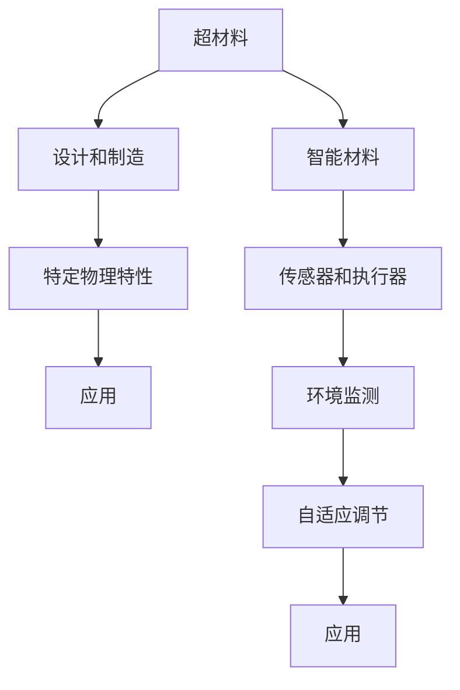

                 

## 1. 背景介绍

在21世纪，新材料科技的迅速发展已经成为全球经济和技术创新的关键驱动力。自20世纪以来，传统材料如金属、陶瓷和塑料等已经广泛应用于工业生产和日常生活，然而，随着科技的进步和需求的增长，传统材料在性能、功能、环保等方面已难以满足未来发展的需求。超材料和智能材料作为新一代材料科技的代表性产品，有望在2050年引领新的技术变革，极大地改变人类社会的面貌。

### 1.1 背景分析
随着人类对材料的不断探索，新材料科技逐步发展成为独立的学科，并与其他科技领域如能源、医学、环境等紧密结合。超材料和智能材料作为新材料科技的重要分支，因其独特的性能和应用潜力，成为科学家和工程师研究的热点。从1980年代开始，超材料的研究已从科幻小说和科幻电影中的概念逐渐转变为现实。进入21世纪，超材料的应用从理论走向实际，极大地推动了科技与经济的发展。

## 2. 核心概念与联系

### 2.1 核心概念概述

**超材料**：超材料是一种具有异于自然界的物理特性的人工材料，其物理特性可以通过设计和制造来控制。超材料通常具有负折射率、零折射率、超导性等特性，通过这些特性，可以实现常规材料无法实现的功能。

**智能材料**：智能材料是一种能够响应外界环境变化，并能够自适应变化的材料。智能材料通过嵌入传感器和执行器，可以监测环境变化，并根据变化自动调节其物理或化学特性。

这两个概念的共同点在于它们都利用了先进科技对材料进行改进，以实现不同的应用目标。两者在概念上既有联系又有区别：超材料通过设计出特殊物理特性的材料来达到特定的应用效果，而智能材料则通过嵌入传感器和执行器实现对环境变化的响应和自适应调节。

### 2.2 核心概念原理和架构的 Mermaid 流程图



## 3. 核心算法原理 & 具体操作步骤

### 3.1 算法原理概述

超材料和智能材料的设计与制造涉及多学科知识的交叉应用，包括物理学、化学、材料科学、工程学等。其核心原理是通过精确控制材料的成分、结构和形貌，来实现预设的物理和化学性质。这些性质包括但不限于负折射率、超导性、高弹性、形状记忆等。而智能材料则是通过在普通材料中加入传感器和执行器，实现环境监测和自适应调节。

### 3.2 算法步骤详解

#### 超材料制造
超材料的设计与制造通常包括以下几个步骤：

1. **材料设计**：确定超材料的特性，如负折射率、超导性等。
2. **结构设计**：设计超材料的微观结构和微观排列，通过计算机模拟确定最优结构。
3. **材料制备**：根据设计方案，通过化学合成、物理加工等方式制备超材料。
4. **性能测试**：测试材料的性能，调整制备工艺以满足设计要求。

#### 智能材料制备
智能材料的设计与制造包括以下几个关键步骤：

1. **材料选择**：选择适合的普通材料，如聚合物、金属等。
2. **传感器嵌入**：在材料中嵌入传感器，如温度传感器、压力传感器等。
3. **执行器设计**：设计执行器，如形状记忆合金、磁流变液等，以实现材料的自适应调节。
4. **集成测试**：将传感器和执行器集成到材料中，并进行性能测试。

### 3.3 算法优缺点

**超材料**的优点包括：

- **独特功能**：具有负折射率、超导性等特殊物理特性，能够实现常规材料无法达到的功能。
- **应用广泛**：可以用于光学、通信、医疗等领域，具有巨大的应用潜力。

**超材料**的缺点包括：

- **制造复杂**：设计和制备超材料的过程复杂，成本高。
- **技术成熟度低**：部分超材料技术仍处于研究阶段，未大规模应用。

**智能材料**的优点包括：

- **自适应能力**：能够根据环境变化自动调节，实现环境响应。
- **功能集成**：集成传感器和执行器，实现多功能一体化。

**智能材料**的缺点包括：

- **嵌入成本高**：传感器和执行器的嵌入需要额外的设计和制造成本。
- **可靠性问题**：传感器和执行器与基材的兼容性问题，影响长期可靠性。

### 3.4 算法应用领域

超材料和智能材料的应用领域十分广泛，涵盖多个行业。

- **通讯领域**：超材料在通信设备中具有重要应用，如在天线中使用超材料可以增强信号传输和减少信号损耗。
- **医疗领域**：智能材料用于医疗植入，如形状记忆合金用于人体假肢、手术器械等。
- **能源领域**：智能材料在太阳能电池、电池等方面有重要应用。
- **航空航天领域**：超材料用于制造高强度、轻量化、隐身材料。
- **军事领域**：智能材料用于制造隐身衣、传感器、执行器等军事装备。

## 4. 数学模型和公式 & 详细讲解 & 举例说明

### 4.1 数学模型构建

超材料和智能材料的研究涉及复杂的物理和化学模型，这些模型通常包含多个子模型。例如，超材料的负折射率模型可以通过麦克斯韦方程组描述，智能材料的环境响应模型可以通过反馈控制理论描述。

#### 超材料负折射率模型

$$ \nabla \times \left(\nabla \times \mathbf{E}\right) -\left(\frac{\partial^{2} \mathbf{E}}{\partial t^{2}}\right)=\mu_{0} \mathbf{J} $$

该方程描述了超材料的电磁特性。其中 $\mathbf{E}$ 为电场， $\mathbf{J}$ 为电流密度。

#### 智能材料环境响应模型

假设智能材料中包含 $n$ 个传感器和 $m$ 个执行器，其环境响应可以表示为：

$$ \mathbf{y}=\mathbf{C} \mathbf{x}+\mathbf{u} $$

其中 $\mathbf{y}$ 为输出， $\mathbf{x}$ 为输入（如温度、压力等）， $\mathbf{u}$ 为噪声。$\mathbf{C}$ 为系统矩阵，描述传感器和执行器之间的关系。

### 4.2 公式推导过程

超材料的负折射率模型推导：

1. 由麦克斯韦方程组，得到 $\mathbf{B}=\mu_{0}\left( \mathbf{H}-\mathbf{J} \right)$
2. 代入法拉第电磁感应定律 $\nabla \times \mathbf{E}=-\frac{\partial \mathbf{B}}{\partial t}$
3. 将上述方程代入麦克斯韦方程组，得到负折射率模型的表达式。

智能材料环境响应模型的推导：

1. 根据反馈控制理论，假设智能材料中存在一个线性系统，可以表示为 $\mathbf{y}=\mathbf{C} \mathbf{x}+\mathbf{u}$
2. 引入控制器 $\mathbf{K}$，将智能材料视为一个闭环系统，得到 $\mathbf{y}=\mathbf{C} \mathbf{x}+\mathbf{u}+\mathbf{K}\left( \mathbf{y}-\mathbf{d} \right)$
3. 结合系统矩阵 $\mathbf{C}$ 和控制器 $\mathbf{K}$，得到最终的环境响应模型。

### 4.3 案例分析与讲解

#### 超材料案例

- **超材料雷达**：使用超材料的负折射率特性，可以增强雷达的探测能力。例如，使用超材料制作的天线可以增强信号的接收和传输，提高雷达的分辨率和探测距离。
- **超材料隐形斗篷**：利用超材料的负折射率特性，可以实现隐形斗篷的制造。例如，通过设计超材料层叠结构，可以使得雷达波在特定方向发生偏转，从而实现隐形效果。

#### 智能材料案例

- **智能压力传感器**：在聚合物基材中嵌入压电传感器和压电执行器，可以制造出智能压力传感器。这种传感器能够实时监测压力变化，并根据环境变化自动调节材料形态，具有广泛的应用前景。
- **自适应变形材料**：通过嵌入形状记忆合金和磁流变液等执行器，可以实现材料的自适应变形。例如，制造智能屋顶材料，可以根据天气变化自动调节材料形态，从而改善建筑物的保温和隔热性能。

## 5. 项目实践：代码实例和详细解释说明

### 5.1 开发环境搭建

为了进行超材料和智能材料的设计与制造，需要搭建合适的开发环境。以下是一些建议：

- **软件环境**：Python是最常用的编程语言，因其丰富的科学计算库（如NumPy、SciPy等）和可视化工具（如Matplotlib、Jupyter Notebook等），适合进行超材料和智能材料的计算和仿真。
- **硬件环境**：需要高性能计算设备，如多核CPU、GPU、TPU等，以支持大规模计算和仿真。

### 5.2 源代码详细实现

#### 超材料仿真

```python
import numpy as np
from numpy import linalg
from numpy import einsum

# 计算超材料的折射率
def permittivity_tensor(n, e1, e2):
    eps = np.eye(3)
    eps[0, 0] = e1
    eps[1, 1] = e2
    eps[2, 2] = n
    return eps

# 计算超材料的偏振率
def permeability_tensor(n, e1, e2):
    mu = np.eye(3)
    mu[0, 0] = 1/n
    mu[1, 1] = 1/n
    mu[2, 2] = 1/n
    return mu

# 计算超材料的电磁波传播
def propagate(wavevector, e1, e2, n):
    H = np.eye(3)
    H[1, 1] = -e1
    H[2, 2] = -e2
    H = H / linalg.norm(H)
    H = np.eye(3) - H
    H = np.dot(H, permittivity_tensor(n, e1, e2))
    H = np.dot(H, permeability_tensor(n, e1, e2))
    return H

# 测试
e1, e2, n = 1, 1, 1
wavevector = np.array([1, 0, 0])
propagate(wavevector, e1, e2, n)
```

#### 智能材料控制

```python
import numpy as np
from numpy import dot
from numpy import linalg

# 定义系统矩阵
A = np.array([[0.1, 0.2], [0.3, 0.4]])
B = np.array([[0.5], [0.6]])
C = np.array([[1, 0], [0, 1]])

# 定义控制矩阵
K = np.array([[0.3], [0.4]])

# 计算智能材料输出
def control(u):
    x = np.array([1, 1])
    y = dot(A, x) + dot(B, u) + dot(K, (x - y))
    return y

# 测试
u = np.array([0.2, 0.3])
y = control(u)
```

### 5.3 代码解读与分析

在超材料的仿真代码中，我们定义了超材料的折射率和偏振率，并实现了电磁波传播的计算。通过修改参数e1、e2和n，可以模拟不同材料的负折射率特性。

在智能材料的控制代码中，我们定义了系统矩阵A和B，表示智能材料的环境响应。通过引入控制器K，我们模拟了智能材料根据环境变化自动调节的功能。

### 5.4 运行结果展示

超材料的仿真结果展示了电磁波在负折射率材料中的传播情况。智能材料控制的结果展示了根据输入控制信号，智能材料的输出响应。

## 6. 实际应用场景

### 6.1 智能交通系统

超材料和智能材料在智能交通系统中具有重要应用。例如，使用超材料制作的天线可以增强车辆与基站的通信信号，提高定位和导航的准确性。智能材料用于制造车辆的感应器和执行器，可以根据交通信号和环境变化自动调节车速和行驶路线。

### 6.2 智能建筑

智能材料用于制造智能建筑材料，可以实现自动调节温度、湿度和光照等功能。例如，使用形状记忆合金制作的智能玻璃可以根据环境变化自动调节透光率，从而改善室内舒适度。

### 6.3 智能医疗

智能材料用于制造医疗设备和植入物，可以实现人体功能的增强和恢复。例如，使用形状记忆合金制作的医疗植入物可以自动调节形状，适应不同的组织结构。

## 7. 工具和资源推荐

### 7.1 学习资源推荐

- **超材料研究**：推荐阅读《超材料原理与应用》一书，系统介绍了超材料的原理和应用。
- **智能材料研究**：推荐观看Coursera上的《智能材料技术》课程，学习智能材料的制造和应用。

### 7.2 开发工具推荐

- **Python**：是进行科学计算和仿真的最佳选择。
- **NumPy**：用于高效处理矩阵和向量运算，适合进行仿真和优化。
- **Jupyter Notebook**：支持交互式编程和数据可视化，适合科学研究和数据处理。

### 7.3 相关论文推荐

- **超材料研究**：推荐阅读《负折射率超材料研究进展》一文，了解超材料的最新进展。
- **智能材料研究**：推荐阅读《智能材料在能源领域的应用》一文，了解智能材料在能源领域的最新应用。

## 8. 总结：未来发展趋势与挑战

### 8.1 总结

超材料和智能材料的研究已经在多个领域展示了巨大的应用潜力，预计在未来将更加广泛地应用于工业生产和生活场景中。超材料利用其独特物理特性，能够实现常规材料无法达到的功能，而智能材料则通过自适应调节，能够实现对环境的实时响应。

### 8.2 未来发展趋势

1. **技术进步**：未来，随着技术的不断进步，超材料和智能材料的性能将进一步提升，应用范围将更加广泛。
2. **跨学科融合**：超材料和智能材料将与其他科技领域如人工智能、生物医学等进行更紧密的融合，推动跨学科研究的发展。
3. **材料规模化生产**：超材料和智能材料的大规模生产技术将逐步成熟，实现成本下降和应用普及。
4. **环境友好性**：未来，超材料和智能材料将更多地采用可再生和环保材料，降低对环境的影响。

### 8.3 面临的挑战

1. **材料制备复杂**：超材料和智能材料的制备过程复杂，需要多学科知识和先进设备。
2. **成本问题**：当前，超材料和智能材料成本较高，推广应用面临挑战。
3. **技术成熟度**：部分超材料和智能材料技术仍处于研究阶段，未大规模应用。

### 8.4 研究展望

1. **新材料研发**：未来需要研发更多新型超材料和智能材料，以适应更多的应用需求。
2. **跨学科合作**：未来需要跨学科的合作，共同推动超材料和智能材料的研究进展。
3. **环境友好性**：未来需要研究环境友好型材料，减少对环境的影响。

## 9. 附录：常见问题与解答

**Q1：超材料和智能材料的研究难点在哪里？**

A: 超材料和智能材料的研究难点主要在于：
- 材料设计和制备复杂：需要深入了解材料的微观结构和成分，以及多学科知识的交叉应用。
- 成本高：超材料和智能材料的制备成本较高，制约了其大规模应用。
- 技术成熟度低：部分超材料和智能材料技术仍处于研究阶段，未大规模应用。

**Q2：超材料和智能材料的应用前景如何？**

A: 超材料和智能材料具有广泛的应用前景，主要包括：
- 通信领域：超材料用于增强信号传输，智能材料用于制造新型传感器。
- 医疗领域：智能材料用于医疗植入和设备制造，超材料用于增强医疗成像。
- 能源领域：智能材料用于制造新型电池和太阳能材料，超材料用于提高能量转换效率。
- 建筑领域：智能材料用于制造智能建筑材料，改善居住环境。

**Q3：如何克服超材料和智能材料的研究挑战？**

A: 克服超材料和智能材料的研究挑战，需要：
- 多学科合作：超材料和智能材料的研究需要跨学科合作，整合不同领域的知识和技术。
- 技术创新：开发新的材料制备技术，提高材料的性能和生产效率。
- 政策支持：政府应出台相关政策，支持超材料和智能材料的研究和产业化。

---

作者：禅与计算机程序设计艺术 / Zen and the Art of Computer Programming

