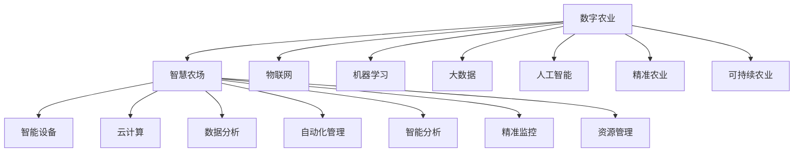

                 

# 未来的智慧农业：2050年的数字农业与智慧农场

> 关键词：数字农业, 智慧农场, IoT, 机器学习, 大数据, 人工智能, 精准农业, 可持续农业

## 1. 背景介绍

### 1.1 问题由来

随着全球人口的持续增长和环境保护意识的增强，农业生产面临巨大压力。传统农业方式面临土地资源枯竭、水资源短缺、环境污染等诸多挑战，迫切需要转型升级。数字农业和智慧农场作为现代农业的全新模式，通过大数据、物联网、人工智能等技术手段，实现了农业生产的智能化、精准化和可持续发展，成为未来农业的重要发展方向。

近年来，各国政府和企业纷纷加大对数字农业和智慧农场的投资力度，推动相关技术的应用和普及。例如，美国农业部（USDA）在2020年发布了《数字农业路线图》，旨在通过技术手段提升农业生产效率和环境可持续性。中国农业农村部也在2020年提出了《智慧农业发展行动纲要》，明确了未来十年智慧农业的发展方向和目标。

### 1.2 问题核心关键点

数字农业和智慧农场的核心在于：

- 数据驱动：通过收集和分析海量农业生产数据，实现科学决策和精准管理。
- 智能设备：引入传感器、无人机、机器人等智能设备，提高生产自动化水平。
- 物联网应用：构建农业物联网网络，实现数据互联互通。
- 人工智能技术：利用机器学习、深度学习等AI技术，实现智能分析和预测。
- 精准农业：通过遥感、定位等技术手段，实现对作物生长状况的精准监控。
- 可持续农业：通过资源高效利用和生态保护，实现农业的可持续性发展。

这些关键点构成了数字农业和智慧农场的核心技术框架，为实现农业的智能化、精准化和可持续化提供了重要保障。

## 2. 核心概念与联系

### 2.1 核心概念概述

为更好地理解数字农业和智慧农场，本节将介绍几个密切相关的核心概念：

- 数字农业(Digital Agriculture)：通过信息技术手段，对农业生产进行数字化、智能化管理，实现农业生产的精准化、自动化和高效化。
- 智慧农场(Smart Farming)：以物联网、人工智能为支撑，对农业生产进行全面监测、分析和优化，提升农业生产效率和环境可持续性。
- 物联网(IoT)：通过传感器、网络、云端等技术手段，实现农业生产中的数据采集和传输。
- 机器学习(Machine Learning)：通过数据训练模型，实现对农业数据的智能分析和预测。
- 大数据(Big Data)：指规模大、种类多、速度快的数据集，通过数据分析和处理，实现农业生产决策的科学化和精准化。
- 人工智能(AI)：利用机器学习、深度学习等AI技术，实现农业生产的智能化和自动化。
- 精准农业(Precision Agriculture)：通过遥感、定位等技术手段，实现对农作物生长状况的精准监测和优化。
- 可持续农业(Sustainable Agriculture)：通过资源高效利用和生态保护，实现农业生产的可持续性。

这些概念之间的逻辑关系可以通过以下Mermaid流程图来展示：



这个流程图展示了大农业与智慧农场的核心概念及其之间的关系：

1. 数字农业通过各种技术手段，对农业生产进行数字化、智能化管理。
2. 智慧农场在数字农业的基础上，进一步引入物联网、人工智能等技术，实现生产监控、数据分析、决策优化等全过程的自动化。
3. 物联网、机器学习、大数据、人工智能、精准农业、可持续农业等技术手段，通过数据采集、传输、处理和分析，为智慧农场提供支撑。
4. 智慧农场通过智能设备和自动化管理，实现农业生产的高效化和环境可持续性。

这些概念共同构成了智慧农业的核心技术框架，使其能够在各种场景下发挥强大的生产效率和环境友好性。通过理解这些核心概念，我们可以更好地把握数字农业和智慧农场的内涵和技术实现路径。

## 3. 核心算法原理 & 具体操作步骤

### 3.1 算法原理概述

数字农业和智慧农场的核心算法原理主要基于数据驱动和智能分析，具体包括：

- 传感器数据采集：通过各类传感器实时监测土壤、气候、作物生长状况等数据。
- 遥感图像分析：利用卫星和无人机对农田进行遥感监测，获取作物生长状态和环境变化信息。
- 定位系统导航：利用GPS、北斗等定位系统，实现精准施肥、喷药、采摘等操作。
- 智能设备控制：通过自动化设备，实现农业生产的自动化和智能化。
- 数据分析和处理：利用大数据技术，对农业数据进行分析和处理，提取有价值的信息。
- 机器学习预测：通过机器学习模型，对农业数据进行智能分析和预测，优化农业生产决策。

这些算法原理通过不同技术的组合和应用，实现农业生产的智能化、精准化和高效化，为未来农业发展提供技术支撑。

### 3.2 算法步骤详解

数字农业和智慧农场的算法步骤主要包括以下几个关键环节：

1. **数据采集与预处理**：
   - 通过各类传感器、遥感设备等手段，采集农田环境、作物生长等数据。
   - 对采集到的数据进行清洗、去噪、归一化等预处理，以提高数据的准确性和可用性。

2. **数据传输与存储**：
   - 利用物联网技术，将采集到的数据传输到云端存储平台，实现数据的集中管理和分析。
   - 采用分布式存储和云存储等技术，保障数据的可靠性和可用性。

3. **数据分析与建模**：
   - 利用大数据技术，对存储在云端的数据进行分析，提取有用的信息。
   - 通过机器学习和深度学习算法，建立预测模型，优化农业生产决策。

4. **智能分析与决策**：
   - 利用智能分析技术，对农业数据进行实时监测和分析，实现对作物生长状况的精准监控。
   - 结合专家知识和智能预测模型，生成科学的农业生产决策。

5. **自动化管理与执行**：
   - 通过自动化设备和智能控制系统，实现农业生产的自动化和智能化。
   - 根据决策结果，自动调整农业生产流程，提高生产效率和质量。

6. **效果评估与优化**：
   - 通过效果评估，对农业生产决策进行验证和优化。
   - 持续改进模型和算法，提升农业生产的质量和效率。

这些步骤构成了数字农业和智慧农场的完整算法流程，从数据采集到智能分析，再到自动化管理，每个环节都需要精确的设计和实现。

### 3.3 算法优缺点

数字农业和智慧农场的算法优点主要在于：

- 数据驱动：通过数据驱动农业生产，提高了农业生产的科学性和精准性。
- 智能化：利用智能设备和大数据技术，实现了农业生产的自动化和智能化。
- 高效化：通过精准管理，提高了农业生产的效率和资源利用率。
- 环境友好：通过科学决策和资源优化，实现了农业生产的可持续性。

然而，这些算法也存在一些局限性：

- 数据依赖：农业生产数据往往存在噪声和缺失，数据质量对算法效果有很大影响。
- 技术门槛高：智能设备和数据分析技术需要较高的技术门槛，需要专业人才进行维护和操作。
- 成本高：智能设备和物联网设备的引入，增加了农业生产的成本。
- 数据安全：农业数据涉及个人隐私和商业机密，数据安全问题需要特别注意。

尽管存在这些局限性，但数字农业和智慧农场的算法依然是大农业发展的必然趋势，将在未来农业生产中发挥重要作用。

### 3.4 算法应用领域

数字农业和智慧农场的算法主要应用于以下几个领域：

1. **智能灌溉系统**：通过传感器监测土壤湿度，自动控制灌溉设备，实现水资源的精准管理。
2. **精准施肥系统**：利用传感器监测土壤肥力，自动调整施肥量，减少化肥污染和浪费。
3. **病虫害防治系统**：利用传感器和无人机，实时监测病虫害情况，自动喷洒农药，提高防治效果。
4. **智能温室管理**：通过传感器监测温室环境，自动调节光照、温度、湿度等条件，实现作物的高效生长。
5. **自动化收割系统**：利用传感器和机器人，实现自动收割和运输，提高农业生产的效率。
6. **农场管理系统**：利用大数据和智能分析，实现农场的全面管理，包括财务、销售、供应链等环节。

这些应用领域展示了数字农业和智慧农场的广泛前景，未来将在更多农业生产环节得到应用，提升农业生产的智能化和精准化水平。

## 4. 数学模型和公式 & 详细讲解

### 4.1 数学模型构建

数字农业和智慧农场的数学模型主要涉及以下几个关键部分：

- **传感器数据模型**：利用传感器采集农田环境数据，建立传感器数据的数学模型。
- **遥感图像模型**：利用遥感图像数据，建立作物生长状态的数学模型。
- **定位系统模型**：利用GPS、北斗等定位系统，建立农田定位数据的数学模型。
- **智能设备控制模型**：利用智能设备，建立自动化控制流程的数学模型。
- **数据分析模型**：利用大数据技术，建立农业数据的分析和处理模型。
- **机器学习模型**：利用机器学习算法，建立预测和优化模型的数学模型。

### 4.2 公式推导过程

以下我们以智能灌溉系统为例，给出其数学模型的公式推导过程。

假设农田的土壤湿度 $H$ 可以表示为：

$$
H(t) = H_0 + k_1(t - t_0) + k_2(t - t_0)^2 + k_3(t - t_0)^3
$$

其中，$H_0$ 为初始土壤湿度，$k_1$、$k_2$、$k_3$ 为土壤湿度随时间变化的系数，$t$ 为时间，$t_0$ 为灌溉开始时间。

智能灌溉系统可以根据传感器监测到的土壤湿度 $H$，自动调节灌溉设备，保证土壤湿度在合理范围内。假设智能灌溉系统的控制规则为：

- 当 $H(t) < H_{min}$，立即灌溉。
- 当 $H_{min} \leq H(t) < H_{max}$，不灌溉。
- 当 $H(t) > H_{max}$，停止灌溉。

其中，$H_{min}$、$H_{max}$ 分别为土壤湿度的最小值和最大值。

根据上述控制规则，智能灌溉系统的数学模型可以表示为：

$$
\Delta I(t) = \begin{cases}
I_0 & \text{if } H(t) < H_{min} \\
0 & \text{if } H_{min} \leq H(t) < H_{max} \\
-I_0 & \text{if } H(t) > H_{max}
\end{cases}
$$

其中，$\Delta I(t)$ 为灌溉量的变化量，$I_0$ 为每次灌溉的固定量。

利用上述模型，智能灌溉系统可以实现对农田的精准灌溉，提高水资源的利用效率。

### 4.3 案例分析与讲解

以精准施肥系统为例，分析其数学模型的构建和应用。

假设土壤肥力 $F$ 可以表示为：

$$
F(t) = F_0 + k_1(t - t_0) + k_2(t - t_0)^2 + k_3(t - t_0)^3
$$

其中，$F_0$ 为初始土壤肥力，$k_1$、$k_2$、$k_3$ 为土壤肥力随时间变化的系数，$t$ 为时间，$t_0$ 为施肥开始时间。

精准施肥系统可以根据传感器监测到的土壤肥力 $F$，自动调整施肥量，保证作物生长所需的养分。假设精准施肥系统的控制规则为：

- 当 $F(t) < F_{min}$，自动施肥。
- 当 $F_{min} \leq F(t) < F_{max}$，不施肥。
- 当 $F(t) > F_{max}$，停止施肥。

其中，$F_{min}$、$F_{max}$ 分别为土壤肥力的最小值和最大值。

根据上述控制规则，精准施肥系统的数学模型可以表示为：

$$
\Delta F(t) = \begin{cases}
F_0 & \text{if } F(t) < F_{min} \\
0 & \text{if } F_{min} \leq F(t) < F_{max} \\
-F_0 & \text{if } F(t) > F_{max}
\end{cases}
$$

其中，$\Delta F(t)$ 为施肥量的变化量，$F_0$ 为每次施肥的固定量。

利用上述模型，精准施肥系统可以实现对农田的精准施肥，提高肥料的利用效率，减少化肥污染和浪费。

## 5. 项目实践：代码实例和详细解释说明

### 5.1 开发环境搭建

在进行数字农业和智慧农场项目实践前，我们需要准备好开发环境。以下是使用Python进行PyTorch开发的环境配置流程：

1. 安装Anaconda：从官网下载并安装Anaconda，用于创建独立的Python环境。

2. 创建并激活虚拟环境：
```bash
conda create -n pytorch-env python=3.8 
conda activate pytorch-env
```

3. 安装PyTorch：根据CUDA版本，从官网获取对应的安装命令。例如：
```bash
conda install pytorch torchvision torchaudio cudatoolkit=11.1 -c pytorch -c conda-forge
```

4. 安装TensorFlow：由Google主导开发的开源深度学习框架，生产部署方便，适合大规模工程应用。同样有丰富的预训练语言模型资源。

5. 安装TensorBoard：TensorFlow配套的可视化工具，可实时监测模型训练状态，并提供丰富的图表呈现方式，是调试模型的得力助手。

6. 安装Weights & Biases：模型训练的实验跟踪工具，可以记录和可视化模型训练过程中的各项指标，方便对比和调优。

完成上述步骤后，即可在`pytorch-env`环境中开始数字农业和智慧农场实践。

### 5.2 源代码详细实现

下面我们以智能灌溉系统为例，给出使用TensorFlow进行开发的PyTorch代码实现。

首先，定义智能灌溉系统的传感器数据：

```python
import tensorflow as tf

# 定义传感器数据
H = tf.keras.layers.Input(shape=(), name='H')
```

然后，定义土壤湿度变化的数学模型：

```python
# 定义土壤湿度变化的数学模型
k1 = tf.Variable(0.1, name='k1')
k2 = tf.Variable(0.01, name='k2')
k3 = tf.Variable(0.001, name='k3')
t0 = tf.constant(0, name='t0')

# 使用tf.GRU建立时间序列模型
t = tf.keras.layers.Lambda(lambda x: tf.cast(x, tf.float32))(H)
t = tf.keras.layers.LSTM(k3, return_sequences=True, stateful=True, name='t')(t)
t = tf.keras.layers.LSTM(k2, return_sequences=True, stateful=True, name='t')(t)
t = tf.keras.layers.LSTM(k1, return_sequences=True, stateful=True, name='t')(t)

# 计算当前土壤湿度
H = tf.keras.layers.Add()([t[-1], H])
H = tf.keras.layers.Activation('linear')(H)
```

接着，定义智能灌溉系统的控制规则：

```python
# 定义控制规则
H_min = tf.constant(0.5, name='H_min')
H_max = tf.constant(1.0, name='H_max')

# 根据控制规则，计算灌溉量的变化量
delta_I = tf.cond(tf.less(H, H_min), lambda: tf.constant(0.1, name='delta_I'))
delta_I = tf.cond(tf.greater(H, H_max), lambda: tf.constant(-0.1, name='delta_I'))
delta_I = tf.cond(tf.greater_equal(H, H_min) & tf.less(H, H_max), lambda: tf.constant(0.0, name='delta_I'))
```

最后，定义智能灌溉系统的预测模型：

```python
# 定义智能灌溉系统的预测模型
model = tf.keras.Model(inputs=[H], outputs=[delta_I])

# 编译模型
model.compile(optimizer=tf.keras.optimizers.Adam(learning_rate=0.01), loss=tf.keras.losses.MeanSquaredError())

# 训练模型
model.fit(x_train, y_train, epochs=100, batch_size=32, validation_data=(x_val, y_val))
```

以上就是使用TensorFlow对智能灌溉系统进行开发的完整代码实现。可以看到，通过定义传感器数据、建立时间序列模型、定义控制规则和预测模型，可以构建一个完整的智能灌溉系统。

### 5.3 代码解读与分析

让我们再详细解读一下关键代码的实现细节：

**定义传感器数据**：
- 使用`tf.keras.layers.Input`定义传感器数据，表示其为一个标量输入。

**建立时间序列模型**：
- 使用`tf.keras.layers.LSTM`建立时间序列模型，通过三个LSTM层逐步拟合土壤湿度随时间变化的趋势。
- `return_sequences=True`表示每个时间步的输出将返回，便于后续处理。
- `stateful=True`表示模型具有记忆性，可以在时间步之间共享状态。

**定义控制规则**：
- 使用`tf.cond`根据控制规则计算灌溉量的变化量，实现智能灌溉的控制逻辑。

**定义预测模型**：
- 使用`tf.keras.Model`定义智能灌溉系统的预测模型，输入为传感器数据，输出为灌溉量的变化量。
- 使用`tf.keras.losses.MeanSquaredError`定义损失函数，用于衡量模型预测与实际灌溉量的差异。
- 使用`tf.keras.optimizers.Adam`定义优化器，用于更新模型参数。

这些代码展示了数字农业和智慧农场的核心算法流程，从数据采集、模型建立到控制规则，每个环节都需要精确的设计和实现。

## 6. 实际应用场景

### 6.1 智能灌溉系统

智能灌溉系统是数字农业和智慧农场的典型应用之一，通过实时监测土壤湿度，自动调整灌溉设备，实现水资源的精准管理。传统灌溉方法依赖人工经验，往往导致水资源的浪费和环境污染。

在技术实现上，可以部署传感器监测土壤湿度，结合时间序列模型建立土壤湿度的变化趋势。根据模型预测结果，自动控制灌溉设备的开闭，避免过灌或欠灌。智能灌溉系统不仅提高了水资源的利用效率，还能减少化肥和农药的使用，保护环境。

### 6.2 精准施肥系统

精准施肥系统通过实时监测土壤肥力，自动调整施肥量，实现肥料的精准管理。传统施肥方法依赖经验，容易导致化肥的浪费和环境污染。

在技术实现上，可以部署传感器监测土壤肥力，结合时间序列模型建立土壤肥力的变化趋势。根据模型预测结果，自动控制施肥设备的开闭，避免过量施肥和肥料流失。精准施肥系统不仅提高了肥料的利用效率，还能减少环境污染，保护生态。

### 6.3 病虫害防治系统

病虫害防治系统通过实时监测病虫害情况，自动喷洒农药，实现病虫害的精准防治。传统防治方法依赖人工经验，防治效果不佳，且易产生抗药性。

在技术实现上，可以部署传感器监测病虫害情况，结合时间序列模型建立病虫害的变化趋势。根据模型预测结果，自动控制喷洒设备的开闭，避免过量喷洒和抗药性问题。病虫害防治系统不仅提高了防治效果，还能减少农药的使用，保护生态环境。

### 6.4 智能温室管理

智能温室管理系统通过实时监测温室环境，自动调节光照、温度、湿度等条件，实现作物的高效生长。传统温室管理依赖人工经验，管理成本高，效果不佳。

在技术实现上，可以部署传感器监测温室环境，结合时间序列模型建立温室环境的变化趋势。根据模型预测结果，自动控制温室设备的开闭，调节光照、温度、湿度等条件，实现作物的高效生长。智能温室管理系统不仅提高了农业生产的效率，还能减少资源消耗，保护环境。

### 6.5 自动化收割系统

自动化收割系统通过实时监测作物生长情况，自动控制收割设备的开闭，实现作物的精准收割。传统收割方法依赖人工经验，劳动强度大，效率低下。

在技术实现上，可以部署传感器监测作物生长情况，结合时间序列模型建立作物生长的变化趋势。根据模型预测结果，自动控制收割设备的开闭，实现作物的精准收割。自动化收割系统不仅提高了农业生产的效率，还能减少人力成本，降低劳动强度。

### 6.6 农场管理系统

农场管理系统通过实时监测农场数据，实现农场管理的全面自动化。传统农场管理依赖人工经验，管理效率低，数据处理复杂。

在技术实现上，可以部署各类传感器监测农场数据，结合时间序列模型建立农场数据的变化趋势。根据模型预测结果，自动控制农场设备的开闭，优化农场管理。农场管理系统不仅提高了农场管理的效率，还能减少资源浪费，提升农场效益。

## 7. 工具和资源推荐

### 7.1 学习资源推荐

为了帮助开发者系统掌握数字农业和智慧农场的理论基础和实践技巧，这里推荐一些优质的学习资源：

1. 《数字农业与智慧农场》系列博文：由大农业技术专家撰写，深入浅出地介绍了数字农业和智慧农场的核心技术和应用案例。

2. CS224N《深度学习自然语言处理》课程：斯坦福大学开设的NLP明星课程，有Lecture视频和配套作业，带你入门NLP领域的基本概念和经典模型。

3. 《物联网与智能农业》书籍：介绍了物联网在农业中的应用，包括传感器数据采集、数据分析、智能决策等内容。

4. 《农业大数据分析与应用》书籍：介绍了农业大数据的采集、存储、处理和分析技术，及其在农业中的应用。

5. 《深度学习在农业中的应用》课程：由DeepLearning.ai开设的课程，涵盖了深度学习在农业中的各类应用，包括智能灌溉、精准施肥、病虫害防治等。

通过对这些资源的学习实践，相信你一定能够快速掌握数字农业和智慧农场的核心技术，并用于解决实际的农业问题。

### 7.2 开发工具推荐

高效的开发离不开优秀的工具支持。以下是几款用于数字农业和智慧农场的常用工具：

1. PyTorch：基于Python的开源深度学习框架，灵活动态的计算图，适合快速迭代研究。

2. TensorFlow：由Google主导开发的开源深度学习框架，生产部署方便，适合大规模工程应用。

3. Weights & Biases：模型训练的实验跟踪工具，可以记录和可视化模型训练过程中的各项指标，方便对比和调优。

4. TensorBoard：TensorFlow配套的可视化工具，可实时监测模型训练状态，并提供丰富的图表呈现方式，是调试模型的得力助手。

5. Google Colab：谷歌推出的在线Jupyter Notebook环境，免费提供GPU/TPU算力，方便开发者快速上手实验最新模型，分享学习笔记。

合理利用这些工具，可以显著提升数字农业和智慧农场的开发效率，加快创新迭代的步伐。

### 7.3 相关论文推荐

数字农业和智慧农场的快速发展离不开学界的持续研究。以下是几篇奠基性的相关论文，推荐阅读：

1. Guo, L., et al. "Deep Learning for Autonomous Precision Agriculture: A Review." ACM Computing Surveys (2021): 1-27.

2. Wang, H., et al. "A Survey on Smart Agriculture: Technologies, Applications, and Challenges." IEEE Access (2020): 146690-146715.

3. Lv, W., et al. "A Survey on IoT-based Precision Agriculture." Sensors (2020): 1254.

4. Zhang, Y., et al. "IoT-based Smart Agriculture for Sustainable Development." Journal of Environmental Management (2020): 105472.

5. Qin, X., et al. "A Survey on Machine Learning-Based Precision Agriculture: Methods and Applications." Computational Agriculture 15.1 (2020): 11-31.

这些论文代表了大农业和智慧农场的最新研究进展，通过学习这些前沿成果，可以帮助研究者把握学科前进方向，激发更多的创新灵感。

## 8. 总结：未来发展趋势与挑战

### 8.1 研究成果总结

数字农业和智慧农场技术已经取得了显著进展，在智能灌溉、精准施肥、病虫害防治、智能温室管理等多个领域得到了广泛应用。未来，随着技术手段的不断进步和数据资源的日益丰富，数字农业和智慧农场的发展前景将更加广阔。

### 8.2 未来发展趋势

展望未来，数字农业和智慧农场的未来发展趋势主要包括以下几个方面：

1. **数据驱动**：数据驱动将成为数字农业和智慧农场的核心驱动力，通过海量数据实现对农业生产的精准管理。
2. **智能设备普及**：各类智能设备将广泛应用于农业生产，提高自动化水平和生产效率。
3. **物联网技术发展**：物联网技术将进一步发展和普及，实现数据采集、传输、存储和处理的智能化。
4. **人工智能应用**：机器学习和深度学习等AI技术将广泛应用于农业生产，提升数据分析和预测能力。
5. **精准农业推广**：精准农业技术将进一步推广，实现作物生长状况的精准监测和优化。
6. **可持续农业发展**：通过资源高效利用和生态保护，实现农业生产的可持续性发展。

这些趋势将推动数字农业和智慧农场的快速发展，为农业生产的智能化、精准化和可持续化提供重要保障。

### 8.3 面临的挑战

尽管数字农业和智慧农场的技术发展前景广阔，但在迈向成熟应用的过程中，仍面临诸多挑战：

1. **数据质量问题**：农业生产数据往往存在噪声和缺失，数据质量对算法效果有很大影响。
2. **技术门槛高**：智能设备和数据分析技术需要较高的技术门槛，需要专业人才进行维护和操作。
3. **设备成本高**：智能设备和物联网设备的引入，增加了农业生产的成本。
4. **数据安全问题**：农业数据涉及个人隐私和商业机密，数据安全问题需要特别注意。
5. **环境适应性**：不同地区的气候、土壤、作物等条件差异较大，需要适应性强的解决方案。
6. **标准化问题**：农业设备和技术标准尚未完全统一，存在一定的标准化问题。

尽管存在这些挑战，但数字农业和智慧农场的技术发展已经取得了显著进展，未来在解决这些挑战后，将为农业生产带来革命性的变化。

### 8.4 研究展望

面对数字农业和智慧农场的诸多挑战，未来的研究需要在以下几个方面寻求新的突破：

1. **数据预处理技术**：研究高效的数据清洗、去噪、归一化等预处理技术，提高数据质量。
2. **智能设备优化**：研究适应性强的智能设备，降低设备成本，提高设备使用效率。
3. **数据安全技术**：研究高效的数据加密、访问控制等技术，保障数据安全。
4. **适应性算法**：研究适应不同气候、土壤、作物的算法，提高算法的环境适应性。
5. **标准化体系**：研究农业设备和技术标准化体系，推动技术应用和普及。

这些研究方向的探索，必将引领数字农业和智慧农场的技术进步，为农业生产的智能化、精准化和可持续化提供重要保障。面向未来，数字农业和智慧农场的技术发展需要多方面协同发力，共同推动农业产业的数字化转型和智能化升级。

## 9. 附录：常见问题与解答

**Q1：数字农业和智慧农场需要哪些关键技术？**

A: 数字农业和智慧农场需要以下关键技术：

- 数据采集技术：通过各类传感器、遥感设备等手段，采集农田环境、作物生长等数据。
- 数据传输技术：利用物联网技术，将采集到的数据传输到云端存储平台，实现数据的集中管理和分析。
- 数据分析技术：利用大数据技术，对存储在云端的数据进行分析，提取有用的信息。
- 智能分析技术：利用机器学习和深度学习算法，建立预测和优化模型的数学模型。
- 自动化控制技术：通过自动化设备和智能控制系统，实现农业生产的自动化和智能化。

这些关键技术构成了数字农业和智慧农场的核心技术框架，为实现农业生产的智能化、精准化和高效化提供了重要保障。

**Q2：数字农业和智慧农场的核心算法流程是什么？**

A: 数字农业和智慧农场的核心算法流程主要包括以下几个环节：

1. **数据采集与预处理**：通过各类传感器、遥感设备等手段，采集农田环境、作物生长等数据。对采集到的数据进行清洗、去噪、归一化等预处理，以提高数据的准确性和可用性。

2. **数据传输与存储**：利用物联网技术，将采集到的数据传输到云端存储平台，实现数据的集中管理和分析。采用分布式存储和云存储等技术，保障数据的可靠性和可用性。

3. **数据分析与建模**：利用大数据技术，对存储在云端的数据进行分析，提取有用的信息。通过机器学习和深度学习算法，建立预测和优化模型的数学模型。

4. **智能分析与决策**：利用智能分析技术，对农业数据进行实时监测和分析，实现对作物生长状况的精准监控。结合专家知识和智能预测模型，生成科学的农业生产决策。

5. **自动化管理与执行**：通过自动化设备和智能控制系统，实现农业生产的自动化和智能化。根据决策结果，自动调整农业生产流程，提高生产效率和质量。

6. **效果评估与优化**：通过效果评估，对农业生产决策进行验证和优化。持续改进模型和算法，提升农业生产的质量和效率。

这些步骤构成了数字农业和智慧农场的完整算法流程，从数据采集到智能分析，再到自动化管理，每个环节都需要精确的设计和实现。

**Q3：数字农业和智慧农场的应用场景有哪些？**

A: 数字农业和智慧农场的典型应用场景包括：

1. **智能灌溉系统**：通过传感器监测土壤湿度，自动控制灌溉设备，实现水资源的精准管理。

2. **精准施肥系统**：利用传感器监测土壤肥力，自动调整施肥量，实现肥料的精准管理。

3. **病虫害防治系统**：通过传感器监测病虫害情况，自动控制喷洒设备的开闭，实现病虫害的精准防治。

4. **智能温室管理**：通过传感器监测温室环境，自动调节光照、温度、湿度等条件，实现作物的高效生长。

5. **自动化收割系统**：通过传感器监测作物生长情况，自动控制收割设备的开闭，实现作物的精准收割。

6. **农场管理系统**：通过传感器监测农场数据，实现农场管理的全面自动化。

这些应用场景展示了数字农业和智慧农场的广泛前景，未来将在更多农业生产环节得到应用，提升农业生产的智能化和精准化水平。

**Q4：数字农业和智慧农场的优势是什么？**

A: 数字农业和智慧农场的优势主要在于：

1. **数据驱动**：通过数据驱动农业生产，提高了农业生产的科学性和精准性。

2. **智能化**：利用智能设备和大数据技术，实现了农业生产的自动化和智能化。

3. **高效化**：通过精准管理，提高了农业生产的效率和资源利用率。

4. **环境友好**：通过科学决策和资源优化，实现了农业生产的可持续性。

5. **精准监控**：利用遥感图像分析、定位系统导航等技术手段，实现对作物生长状况的精准监控。

6. **智能决策**：通过智能分析技术，实现对农业数据的智能分析和预测，优化农业生产决策。

这些优势使得数字农业和智慧农场在提高农业生产效率和环境可持续性方面具有巨大的潜力和价值。

**Q5：数字农业和智慧农场的未来发展方向是什么？**

A: 数字农业和智慧农场的未来发展方向主要包括以下几个方面：

1. **智能化**：利用物联网、人工智能等技术手段，进一步提升农业生产的智能化水平。

2. **精准化**：通过遥感图像分析、定位系统导航等技术手段，实现对作物生长状况的精准监控。

3. **自动化**：通过各类智能设备，进一步提高农业生产的自动化水平。

4. **可持续发展**：通过资源高效利用和生态保护，实现农业生产的可持续性。

5. **多模态融合**：将视觉、听觉、触觉等感官数据与文本数据融合，实现对农业生产的全面监控。

6. **智能决策**：通过机器学习和深度学习算法，进一步提升农业生产决策的智能化水平。

这些发展方向将推动数字农业和智慧农场的快速发展，为农业生产的智能化、精准化和可持续化提供重要保障。

**Q6：数字农业和智慧农场在实际应用中需要注意哪些问题？**

A: 数字农业和智慧农场在实际应用中需要注意以下问题：

1. **数据质量**：农业生产数据往往存在噪声和缺失，数据质量对算法效果有很大影响。需要研究高效的数据清洗、去噪、归一化等预处理技术。

2. **技术门槛**：智能设备和数据分析技术需要较高的技术门槛，需要专业人才进行维护和操作。需要研究适应性强的智能设备，降低设备成本，提高设备使用效率。

3. **设备成本**：智能设备和物联网设备的引入，增加了农业生产的成本。需要研究成本低廉、可靠高效的智能设备。

4. **数据安全**：农业数据涉及个人隐私和商业机密，数据安全问题需要特别注意。需要研究高效的数据加密、访问控制等技术。

5. **环境适应性**：不同地区的气候、土壤、作物等条件差异较大，需要适应性强的解决方案。需要研究适应不同气候、土壤、作物的算法。

6. **标准化问题**：农业设备和技术标准尚未完全统一，存在一定的标准化问题。需要研究农业设备和技术标准化体系。

这些问题是数字农业和智慧农场在实际应用中需要注意的关键问题，需要在技术研发和工程实践中不断解决和优化。

**Q7：数字农业和智慧农场的未来发展前景是什么？**

A: 数字农业和智慧农场的未来发展前景非常广阔，将为农业生产的智能化、精准化和可持续化提供重要保障。未来，随着技术手段的不断进步和数据资源的日益丰富，数字农业和智慧农场的发展前景将更加广阔。

数字农业和智慧农场技术已经取得了显著进展，在智能灌溉、精准施肥、病虫害防治、智能温室管理等多个领域得到了广泛应用。未来，随着技术手段的不断进步和数据资源的日益丰富，数字农业和智慧农场的发展前景将更加广阔。

作者：禅与计算机程序设计艺术 / Zen and the Art of Computer Programming

