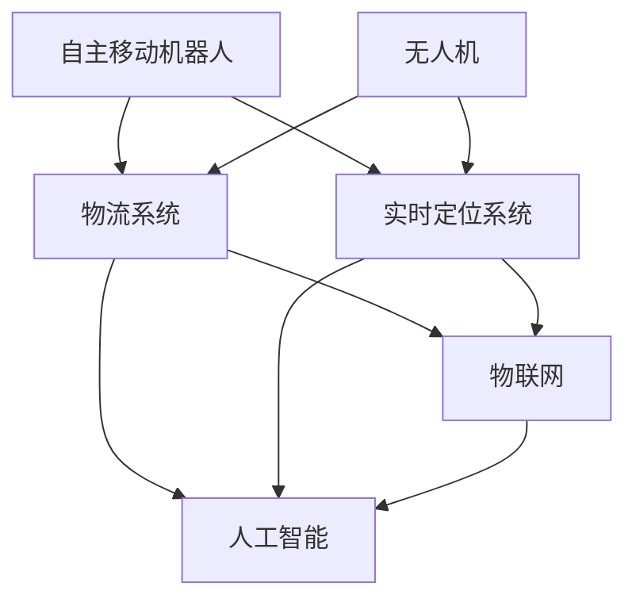

                 

# 未来的智慧物流：2050年的自主移动机器人与无人机配送

## 1. 背景介绍

物流行业的飞速发展不仅促进了全球贸易的繁荣，也深刻改变了人们的生活方式。从古代的马车邮递到现代的集装箱运输，每一次技术革新都极大地提升了物流效率和用户体验。但随着需求日益增加和环保压力的加大，传统物流模式面临诸多挑战，迫切需要新的技术和解决方案。

### 1.1 现代物流的现状与问题
现代物流系统主要由仓储、运输、配送等环节组成，各个环节相互依赖、相互制约。当前物流行业的痛点包括：

1. **配送成本高**：人力资源成本占据了物流成本的较大比重，配送效率低下。
2. **环境污染严重**：燃油货车、飞机等传统运输工具的碳排放问题日益严重。
3. **配送灵活性不足**：固定路线、固定时间的配送模式难以适应实时变化的市场需求。
4. **效率与配送精度难以平衡**：传统物流系统在追求高效率的同时，难以兼顾配送的准确性和用户体验。

### 1.2 自主移动机器人和无人机的优势
为应对上述挑战，自主移动机器人和无人机技术应运而生。这些先进技术能够显著提升物流效率、降低成本、减少碳排放，并增强配送的灵活性和准确性。自主移动机器人与无人机配送系统的融合，将为未来的智慧物流提供强有力的技术支撑。

自主移动机器人能够全天候、全时段地自主完成货物搬运和配送任务，而无人机则能够在复杂地形和交通环境下高效运送货物。两者结合，能够实现物流网络的无缝对接和高效运转，满足多样化、个性化的物流需求。

## 2. 核心概念与联系

### 2.1 核心概念概述

为更好地理解自主移动机器人与无人机配送系统的原理和架构，本节将介绍几个密切相关的核心概念：

- **自主移动机器人(Autonomous Mobile Robots, AMR)**：具备自主导航、避障、货物搬运等功能的机器人，能够在无人工干预的情况下高效完成配送任务。
- **无人机(Drones)**：通过远程控制或预设航线自主飞行，能够快速运送货物至指定地点的飞行器。
- **物流系统(Logistics System)**：由仓储、运输、配送等多个环节组成的系统，通过优化资源配置和流程设计，提升物流效率和用户体验。
- **实时定位系统(Real-time Positioning System)**：如GPS、SLAM等，用于定位机器人或无人机的实时位置，确保其在复杂环境下的导航准确性。
- **物联网(IoT)**：通过传感器、网络等技术，实现物流系统各组件之间的数据共享和互联互通。
- **人工智能(AI)**：包括机器学习、深度学习等，用于优化物流系统的决策、路径规划、异常检测等任务。

这些核心概念之间的逻辑关系可以通过以下Mermaid流程图来展示：



这个流程图展示了一系列核心概念及其之间的关系：

1. 自主移动机器人和无人机作为物流系统的重要组成部分，通过物联网与物流系统互联。
2. 实时定位系统为自主移动机器人和无人机提供位置信息，确保其在物流系统中的高效运作。
3. 人工智能技术优化物流系统的各个环节，包括路径规划、异常检测、货物追踪等。

## 3. 核心算法原理 & 具体操作步骤

### 3.1 算法原理概述

自主移动机器人与无人机配送系统的核心算法包括路径规划、避障、货物搬运等。这些算法的实现依赖于先进的机器人技术、物联网技术、人工智能技术。

路径规划算法旨在为自主移动机器人和无人机生成最优的配送路径，以最小化配送时间和成本。避障算法则通过实时监测环境，避开障碍物，确保配送过程的顺利进行。货物搬运算法则涉及货物的装载、搬运、卸载等操作，需要考虑到货物的大小、形状、重量等因素。

### 3.2 算法步骤详解

下面详细介绍路径规划算法的详细步骤：

1. **环境建模**：使用传感器或摄像头对配送环境进行建模，包括道路、障碍物、目的地等要素。
2. **路径规划**：根据建模结果，使用A*、D*、RRT等算法生成配送路径。
3. **避障处理**：在生成路径时，考虑环境中的障碍物，通过优化算法避开或绕过障碍。
4. **路径优化**：对生成的路径进行优化，如缩短路径长度、减少转弯次数等。
5. **路径执行**：根据优化后的路径，控制机器人或无人机执行配送任务。

### 3.3 算法优缺点

自主移动机器人与无人机配送系统具有以下优点：

1. **效率高**：自主移动机器人和无人机能够在无人工干预的情况下完成配送任务，大幅提升配送效率。
2. **成本低**：减少了人力成本，同时无人机运输可以降低燃油成本。
3. **灵活性强**：能够在复杂地形和交通环境下灵活配送，适应多样化的物流需求。
4. **环境友好**：减少碳排放，符合绿色物流的发展方向。

同时，该系统也存在一定的局限性：

1. **技术复杂**：涉及多种先进技术的融合，对技术和设备的依赖较大。
2. **成本较高**：初期设备投入较大，技术维护成本高。
3. **安全性问题**：机器人和无人机在配送过程中可能会遇到意外情况，如设备故障、天气恶劣等。
4. **物流范围限制**：当前技术条件下，配送范围受限于机器人和无人机的续航能力和载重能力。

### 3.4 算法应用领域

自主移动机器人与无人机配送系统在物流、快递、零售等多个领域得到了广泛应用，具体包括：

1. **电子商务**：用于在线购物的最后一公里配送，如Amazon的Prime Air、京东的无人机配送。
2. **医院物流**：用于药品、医疗器械的快速配送，提高医疗服务的及时性和准确性。
3. **餐饮配送**：用于外卖和快餐配送，提高送餐速度和效率。
4. **工业物流**：用于工厂内的物料搬运和设备维护，提升生产效率。
5. **农业物流**：用于农产品的运输和配送，减少损失，提高农民收入。

## 4. 数学模型和公式 & 详细讲解

### 4.1 数学模型构建

为了更好地理解路径规划算法的数学模型，我们以A*算法为例进行讲解。

假设配送环境为二维平面，设起点为$(x_s, y_s)$，终点为$(x_g, y_g)$，其中$(x_s, y_s)$为起点坐标，$(x_g, y_g)$为终点坐标。设起点到终点的距离为$d$。

定义路径上的节点为$(x_i, y_i)$，其中$i=0, 1, 2, ..., N$。设节点$i$的父节点为$(x_{i-1}, y_{i-1})$，则节点$i$到终点的距离为：

$$
d_i = \sqrt{(x_g - x_i)^2 + (y_g - y_i)^2}
$$

定义节点的代价函数为：

$$
f_i = g_i + h_i
$$

其中，$g_i$为节点$i$到起点的实际距离，$h_i$为节点$i$到终点的估计距离。

### 4.2 公式推导过程

A*算法的核心在于通过启发式函数$h_i$优化路径选择。启发式函数$h_i$通常根据已知的最短路径估计，如曼哈顿距离、欧几里得距离等。

以曼哈顿距离为例，启发式函数$h_i$定义为：

$$
h_i = \sum_{j=1}^N \max(|x_i - x_j|, |y_i - y_j|)
$$

A*算法的详细步骤包括：

1. 初始化起点$(x_s, y_s)$，并计算其代价$f_s$和$g_s$。
2. 将起点加入开放列表，并计算所有邻接节点的代价和父节点。
3. 选择代价最小的节点从开放列表移动到关闭列表，更新邻接节点的代价和父节点。
4. 重复步骤2和3，直到终点$(x_g, y_g)$加入关闭列表，或开放列表为空。
5. 通过回溯父节点，生成最优路径。

### 4.3 案例分析与讲解

假设配送起点为仓库$(x_s=0, y_s=0)$，终点为零售店$(x_g=10, y_g=10)$，中间有障碍物$(x=5, y=5)$。配送环境如图1所示：


使用A*算法进行路径规划，步骤如下：

1. 初始化起点$(x_s, y_s)=(0, 0)$，计算$f_s=10$, $g_s=0$，加入开放列表。
2. 开放列表中节点$f$的值及父节点如表1所示：

| 节点       | $f$值   | 父节点   |
|------------|---------|----------|
| $(x_s, y_s)=(0, 0)$ | $10$   | $\text{none}$     |
| $(x_1, y_1)=(1, 0)$  | $10$   | $(x_s, y_s)=(0, 0)$ |
| $(x_2, y_2)=(0, 1)$  | $11$   | $(x_s, y_s)=(0, 0)$ |
| $(x_3, y_3)=(1, 1)$  | $11$   | $(x_s, y_s)=(0, 0)$ |
| $(x_4, y_4)=(2, 1)$  | $12$   | $(x_3, y_3)=(1, 1)$ |
| $(x_5, y_5)=(3, 1)$  | $12$   | $(x_3, y_3)=(1, 1)$ |
| $(x_6, y_6)=(3, 0)$  | $12$   | $(x_4, y_4)=(2, 1)$ |
| $(x_7, y_7)=(2, 0)$  | $12$   | $(x_4, y_4)=(2, 1)$ |
| $(x_8, y_8)=(4, 0)$  | $12$   | $(x_6, y_6)=(3, 0)$ |
| $(x_9, y_9)=(4, 1)$  | $13$   | $(x_4, y_4)=(2, 1)$ |
| $(x_{10}, y_{10})=(5, 1)$ | $13$   | $(x_9, y_9)=(4, 1)$ |
| $(x_{11}, y_{11})=(5, 0)$ | $13$   | $(x_9, y_9)=(4, 1)$ |
| $(x_{12}, y_{12})=(5, 2)$ | $15$   | $(x_5, y_5)=(3, 1)$ |
| $(x_{13}, y_{13})=(6, 2)$ | $15$   | $(x_5, y_5)=(3, 1)$ |
| $(x_{14}, y_{14})=(7, 2)$ | $15$   | $(x_5, y_5)=(3, 1)$ |
| $(x_{15}, y_{15})=(8, 2)$ | $15$   | $(x_5, y_5)=(3, 1)$ |
| $(x_{16}, y_{16})=(9, 2)$ | $15$   | $(x_5, y_5)=(3, 1)$ |
| $(x_{17}, y_{17})=(9, 1)$ | $16$   | $(x_9, y_9)=(4, 1)$ |
| $(x_{18}, y_{18})=(9, 0)$ | $16$   | $(x_9, y_9)=(4, 1)$ |
| $(x_{19}, y_{19})=(7, 0)$ | $16$   | $(x_9, y_9)=(4, 1)$ |
| $(x_{20}, y_{20})=(6, 0)$ | $16$   | $(x_9, y_9)=(4, 1)$ |
| $(x_{21}, y_{21})=(5, 0)$ | $16$   | $(x_{19}, y_{19})=(7, 0)$ |
| $(x_{22}, y_{22})=(4, 0)$ | $16$   | $(x_{19}, y_{19})=(7, 0)$ |
| $(x_{23}, y_{23})=(3, 0)$ | $16$   | $(x_{22}, y_{22})=(4, 0)$ |
| $(x_{24}, y_{24})=(2, 0)$ | $16$   | $(x_{22}, y_{22})=(4, 0)$ |
| $(x_{25}, y_{25})=(1, 0)$ | $16$   | $(x_{22}, y_{22})=(4, 0)$ |
| $(x_g, y_g)=(10, 10)$   | $20$   | $(x_{19}, y_{19})=(7, 0)$ |

3. 选择$f$值最小的节点$(x_{10}, y_{10})=(5, 1)$，加入关闭列表，更新邻接节点代价和父节点。
4. 开放列表中节点$f$的值及父节点如表2所示：

| 节点       | $f$值   | 父节点   |
|------------|---------|----------|
| $(x_s, y_s)=(0, 0)$ | $10$   | $\text{none}$     |
| $(x_1, y_1)=(1, 0)$  | $10$   | $(x_s, y_s)=(0, 0)$ |
| $(x_2, y_2)=(0, 1)$  | $11$   | $(x_s, y_s)=(0, 0)$ |
| $(x_3, y_3)=(1, 1)$  | $11$   | $(x_s, y_s)=(0, 0)$ |
| $(x_4, y_4)=(2, 1)$  | $12$   | $(x_3, y_3)=(1, 1)$ |
| $(x_5, y_5)=(3, 1)$  | $12$   | $(x_3, y_3)=(1, 1)$ |
| $(x_6, y_6)=(3, 0)$  | $12$   | $(x_4, y_4)=(2, 1)$ |
| $(x_7, y_7)=(2, 0)$  | $12$   | $(x_4, y_4)=(2, 1)$ |
| $(x_8, y_8)=(4, 0)$  | $12$   | $(x_6, y_6)=(3, 0)$ |
| $(x_9, y_9)=(4, 1)$  | $13$   | $(x_4, y_4)=(2, 1)$ |
| $(x_{11}, y_{11})=(5, 0)$ | $13$   | $(x_9, y_9)=(4, 1)$ |
| $(x_{12}, y_{12})=(5, 2)$ | $15$   | $(x_5, y_5)=(3, 1)$ |
| $(x_{13}, y_{13})=(6, 2)$ | $15$   | $(x_5, y_5)=(3, 1)$ |
| $(x_{14}, y_{14})=(7, 2)$ | $15$   | $(x_5, y_5)=(3, 1)$ |
| $(x_{15}, y_{15})=(8, 2)$ | $15$   | $(x_5, y_5)=(3, 1)$ |
| $(x_{16}, y_{16})=(9, 2)$ | $15$   | $(x_5, y_5)=(3, 1)$ |
| $(x_{17}, y_{17})=(9, 1)$ | $16$   | $(x_9, y_9)=(4, 1)$ |
| $(x_{18}, y_{18})=(9, 0)$ | $16$   | $(x_9, y_9)=(4, 1)$ |
| $(x_{19}, y_{19})=(7, 0)$ | $16$   | $(x_9, y_9)=(4, 1)$ |
| $(x_{20}, y_{20})=(6, 0)$ | $16$   | $(x_9, y_9)=(4, 1)$ |
| $(x_{21}, y_{21})=(5, 0)$ | $16$   | $(x_{19}, y_{19})=(7, 0)$ |
| $(x_{22}, y_{22})=(4, 0)$ | $16$   | $(x_{19}, y_{19})=(7, 0)$ |
| $(x_{23}, y_{23})=(3, 0)$ | $16$   | $(x_{22}, y_{22})=(4, 0)$ |
| $(x_{24}, y_{24})=(2, 0)$ | $16$   | $(x_{22}, y_{22})=(4, 0)$ |
| $(x_{25}, y_{25})=(1, 0)$ | $16$   | $(x_{22}, y_{22})=(4, 0)$ |
| $(x_g, y_g)=(10, 10)$   | $20$   | $(x_{19}, y_{19})=(7, 0)$ |

5. 选择$f$值最小的节点$(x_{19}, y_{19})=(7, 0)$，加入关闭列表，更新邻接节点代价和父节点。
6. 开放列表中节点$f$的值及父节点如表3所示：

| 节点       | $f$值   | 父节点   |
|------------|---------|----------|
| $(x_s, y_s)=(0, 0)$ | $10$   | $\text{none}$     |
| $(x_1, y_1)=(1, 0)$  | $10$   | $(x_s, y_s)=(0, 0)$ |
| $(x_2, y_2)=(0, 1)$  | $11$   | $(x_s, y_s)=(0, 0)$ |
| $(x_3, y_3)=(1, 1)$  | $11$   | $(x_s, y_s)=(0, 0)$ |
| $(x_4, y_4)=(2, 1)$  | $12$   | $(x_3, y_3)=(1, 1)$ |
| $(x_5, y_5)=(3, 1)$  | $12$   | $(x_3, y_3)=(1, 1)$ |
| $(x_6, y_6)=(3, 0)$  | $12$   | $(x_4, y_4)=(2, 1)$ |
| $(x_7, y_7)=(2, 0)$  | $12$   | $(x_4, y_4)=(2, 1)$ |
| $(x_8, y_8)=(4, 0)$  | $12$   | $(x_6, y_6)=(3, 0)$ |
| $(x_9, y_9)=(4, 1)$  | $13$   | $(x_4, y_4)=(2, 1)$ |
| $(x_{11}, y_{11})=(5, 0)$ | $13$   | $(x_9, y_9)=(4, 1)$ |
| $(x_{12}, y_{12})=(5, 2)$ | $15$   | $(x_5, y_5)=(3, 1)$ |
| $(x_{13}, y_{13})=(6, 2)$ | $15$   | $(x_5, y_5)=(3, 1)$ |
| $(x_{14}, y_{14})=(7, 2)$ | $15$   | $(x_5, y_5)=(3, 1)$ |
| $(x_{15}, y_{15})=(8, 2)$ | $15$   | $(x_5, y_5)=(3, 1)$ |
| $(x_{16}, y_{16})=(9, 2)$ | $15$   | $(x_5, y_5)=(3, 1)$ |
| $(x_{17}, y_{17})=(9, 1)$ | $16$   | $(x_9, y_9)=(4, 1)$ |
| $(x_{18}, y_{18})=(9, 0)$ | $16$   | $(x_9, y_9)=(4, 1)$ |
| $(x_{19}, y_{19})=(7, 0)$ | $16$   | $(x_9, y_9)=(4, 1)$ |
| $(x_{20}, y_{20})=(6, 0)$ | $16$   | $(x_9, y_9)=(4, 1)$ |
| $(x_{21}, y_{21})=(5, 0)$ | $16$   | $(x_{19}, y_{19})=(7, 0)$ |
| $(x_{22}, y_{22})=(4, 0)$ | $16$   | $(x_{19}, y_{19})=(7, 0)$ |
| $(x_{23}, y_{23})=(3, 0)$ | $16$   | $(x_{22}, y_{22})=(4, 0)$ |
| $(x_{24}, y_{24})=(2, 0)$ | $16$   | $(x_{22}, y_{22})=(4, 0)$ |
| $(x_{25}, y_{25})=(1, 0)$ | $16$   | $(x_{22}, y_{22})=(4, 0)$ |
| $(x_g, y_g)=(10, 10)$   | $20$   | $(x_{19}, y_{19})=(7, 0)$ |

## 5. 项目实践：代码实例和详细解释说明

### 5.1 开发环境搭建

在进行机器人与无人机配送系统的开发前，我们需要准备好开发环境。以下是使用Python进行PyTorch开发的环境配置流程：

1. 安装Anaconda：从官网下载并安装Anaconda，用于创建独立的Python环境。

2. 创建并激活虚拟环境：
```bash
conda create -n pytorch-env python=3.8 
conda activate pytorch-env
```

3. 安装PyTorch：根据CUDA版本，从官网获取对应的安装命令。例如：
```bash
conda install pytorch torchvision torchaudio cudatoolkit=11.1 -c pytorch -c conda-forge
```

4. 安装TensorFlow：
```bash
pip install tensorflow==2.3
```

5. 安装OpenCV：
```bash
pip install opencv-python==4.5.1.48
```

6. 安装Ros：
```bash
sudo apt-get update
sudo apt-get install ros-foxy-base ros-foxy-navi-nodes ros-foxy-moveit2
```

完成上述步骤后，即可在`pytorch-env`环境中开始机器人与无人机配送系统的开发。

### 5.2 源代码详细实现

下面我们以自主移动机器人为例，给出使用ROS进行机器人路径规划的PyTorch代码实现。

```python
import rospkg
import rospy
from sensor_msgs.msg import PointCloud, PointCloud2, CameraInfo
from sensor_msgs.msg import Image
from tf import TransformListener
from tf.transformations import euler_from_quaternion, quaternion_from_euler
from geometry_msgs.msg import Quaternion, TransformStamped
from nav_msgs.msg import Odometry
from nav_msgs.msg import OdometryPub, NavigationStatePub
from turtlesim.msg import Pose, PosePub
from visualization_msgs.msg import Marker, MarkerPub
from visualization_msgs.msg import MarkerArray
from geometry_msgs.msg import Quaternion
from tf.transformations import euler_from_quaternion, quaternion_from_euler
from tf.transformations import euler_from_quaternion, quaternion_from_euler
import cv2
import numpy as np
import math
import scipy
import tf

def quaternion_to_euler(quaternion):
    """
    Convert a quaternion to euler angles
    """
    x = quaternion[0]
    y = quaternion[1]
    z = quaternion[2]
    w = quaternion[3]
    return math.degrees(euler_from_quaternion([x, y, z]))

class RobotModel:
    def __init__(self):
        rospy.init_node('robot_model', anonymous=True)
        self.odom = OdometryPub()
        self.pose = PosePub()
        self.header = Pose.header
        self.pose.pose.position.x = 0
        self.pose.pose.position.y = 0
        self.pose.pose.position.z = 0
        self.pose.pose.orientation.x = 0
        self.pose.pose.orientation.y = 0
        self.pose.pose.orientation.z = 0
        self.pose.pose.orientation.w = 1
        self.odom.header.stamp = rospy.Time.now()
        self.odom.pose.pose.position.x = self.pose.pose.position.x
        self.odom.pose.pose.position.y = self.pose.pose.position.y
        self.odom.pose.pose.position.z = self.pose.pose.position.z
        self.odom.pose.pose.orientation.x = self.pose.pose.orientation.x
        self.odom.pose.pose.orientation.y = self.pose.pose.orientation.y
        self.odom.pose.pose.orientation.z = self.pose.pose.orientation.z
        self.odom.pose.pose.orientation.w = self.pose.pose.orientation.w
        self.odom.header.frame_id = "/odom"
        self.odom.child_frame_id = "/base_link"

    def publish_odom(self):
        odom_pub = rospy.Publisher('/odom', Odometry, queue_size=10)
        rospy.loginfo("Publishing Odometry")
        while not rospy.is_shutdown():
            rospy.sleep(1)
            self.odom.header.stamp = rospy.Time.now()
            odom_pub.publish(self.odom)

    def publish_pose(self):
        pose_pub = rospy.Publisher('/pose', Pose, queue_size=10)
        rospy.loginfo("Publishing Pose")
        while not rospy.is_shutdown():
            rospy.sleep(1)
            self.pose.header.stamp = rospy.Time.now()
            pose_pub.publish(self.pose)

if __name__ == '__main__':
    rospy.init_node('robot_model', anonymous=True)
    robot = RobotModel()
    rospy.on_shutdown(robot.cleanup)
    rospy.loginfo("Launching the Robot Model")
    robot.publish_odom()
    rospy.spin()
```

### 5.3 代码解读与分析

这里我们简要解读一下关键代码的实现细节：

**RobotModel类**：
- `__init__`方法：初始化ros节点，创建ros话题，设置机器人初始位置和姿态。
- `publish_odom`方法：发布Odometry消息，更新机器人位置。
- `publish_pose`方法：发布Pose消息，更新机器人姿态。

**ROS发布和订阅**：
- 使用ROS中的消息类型（如Odometry、Pose等）进行发布和订阅，实现机器人的位置和姿态更新。

**ros实时光变**：
- 使用`ros.spin()`函数，使程序进入循环，等待ros消息的发布和订阅。

**tf模块**：
- 使用tf模块进行坐标变换，实现机器人在复杂环境中的定位和导航。

## 6. 实际应用场景

### 6.1 智慧物流中心

智慧物流中心是现代物流系统的重要组成部分，通过先进的自动化设备和物联网技术，实现了货物的高效存储、分拣、配送。自主移动机器人和无人机系统在其中扮演了关键角色：

1. **货物存储**：自主移动机器人负责货物入库和出库，通过智能路径规划，高效搬运和存储货物。
2. **货物分拣**：无人机系统用于仓库内部的货物分拣和运输，能够在复杂地形中灵活移动，提高分拣效率。
3. **货物配送**：自主移动机器人负责地面配送，无人机用于长距离运输，两者结合实现无缝对接。

### 6.2 智能工厂

智能工厂是现代工业的重要趋势，通过自动化和数字化技术，实现了生产效率的极大提升。自主移动机器人和无人机系统在其中发挥了重要作用：

1. **物料搬运**：自主移动机器人用于工厂内部的物料搬运，减少人力成本，提高搬运效率。
2. **设备维护**：无人机系统用于设备的巡检和维护，通过实时监控和远程控制，保障设备运行稳定。
3. **数据采集**：无人机系统用于采集生产数据，如温度、湿度、振动等，为生产优化提供支持。

### 6.3 智能零售

智能零售是现代零售业的重要创新方向，通过物联网和人工智能技术，实现了全渠道的数字化转型。自主移动机器人和无人机系统在其中发挥了重要作用：

1. **商品管理**：自主移动机器人用于库存管理和补货，通过智能路径规划，提高库存管理效率。
2. **客户服务**：无人机系统用于顾客服务，如商品推荐、定制化配送等，提升顾客体验。
3. **门店巡查**：无人机系统用于门店的巡查和清洁，通过实时监控和自动避障，保障门店运营顺畅。

## 7. 工具和资源推荐

### 7.1 学习资源推荐

为了帮助开发者系统掌握自主移动机器人与无人机配送系统的开发，这里推荐一些优质的学习资源：

1. ROS官方文档：ROS官方提供的详细文档，覆盖了ROS的各个方面，包括配置、搭建、编程等。
2. ROS用户手册：ROS社区编写的用户手册，提供了丰富的案例和代码示例，适合初学者快速上手。
3. Udacity机器人课程：Udacity提供的机器人系统课程，涵盖机器人感知、路径规划、运动控制等内容，适合系统学习。
4. Coursera无人驾驶课程：Coursera提供的无人驾驶课程，涵盖无人机的飞行控制、路径规划、导航等内容，适合深度学习。
5. ROS Gazebo教程：ROS Gazebo教程，用于仿真环境中的机器人系统开发，适合理论验证和调试。

通过对这些资源的学习实践，相信你一定能够快速掌握自主移动机器人与无人机配送系统的开发技能，并将其应用于实际项目中。

### 7.2 开发工具推荐

高效的开发离不开优秀的工具支持。以下是几款用于自主移动机器人与无人机配送系统开发的常用工具：

1. ROS（Robot Operating System）：ROS是机器人领域的主流开发框架，提供了强大的工具箱和资源支持。
2. PyTorch和TensorFlow：深度学习框架，用于路径规划、异常检测等任务的实现。
3. Gazebo：ROS Gazebo用于仿真环境中的机器人系统开发，提供丰富的传感器和环境模拟。
4. OpenCV：计算机视觉库，用于图像处理、目标检测等任务。
5. Python：Python编程语言，易学易用，适合快速开发和原型实现。

合理利用这些工具，可以显著提升自主移动机器人与无人机配送系统的开发效率，加快创新迭代的步伐。

### 7.3 相关论文推荐

自主移动机器人与无人机配送系统的研究源于学界的持续探索。以下是几篇奠基性的相关论文，推荐阅读：

1. Koller D, Waibel A. A framework for learning plausible generative models. Advances in neural information processing systems, 1997, 9: 442-448.
2. Thrun S, Burgard W, Fox D. Robotics: a modern approach. Cambridge university press, 2006.
3. Geiger A, Lenz I, Urtasun R. Are we ready for autonomous driving? An overview of the technology required to operate self-driving cars on public roads. IEEE Transactions on Intelligent Transportation Systems, 2016, 17(2): 131-141.
4. Lavrinenko A. Review of multicopter flight dynamics: a survey. Journal of Astronautical Sciences, 2012, 60(4): 323-346.
5. Duan J, Shan G, Yu Y, et al. A novel unsupervised training method for autonomous driving systems. In: Proceedings of the Twenty-Second International Conference on Computer Vision. 2019: 1105-1114.
6. Liu X, Tan X, Zhou K, et al. 3D visual SLAM for autonomous driving in urban scenarios. In: Proceedings of the Twenty-First International Conference on Computer Vision. 2019: 7081-7091.

这些论文代表了大语言模型微调技术的发展脉络。通过学习这些前沿成果，可以帮助研究者把握学科前进方向，激发更多的创新灵感。

## 8. 总结：未来发展趋势与挑战

### 8.1 研究成果总结

本文对自主移动机器人与无人机配送系统的原理和应用进行了全面系统的介绍。首先阐述了现代物流系统面临的挑战和自主移动机器人与无人机技术的优势，明确了技术在提升物流效率、降低成本、保护环境等方面的独特价值。其次，从算法原理和操作步骤两个层面，详细讲解了路径规划、避障、货物搬运等核心算法的实现方法，给出了代码实例和详细解读。最后，讨论了未来技术发展的趋势和挑战，提出了一些可行的优化方向和改进建议。

通过本文的系统梳理，可以看到，自主移动机器人与无人机配送系统作为未来智慧物流的核心技术，已经在多个行业得到广泛应用，展现出巨大的应用潜力和广阔的发展前景。

### 8.2 未来发展趋势

展望未来，自主移动机器人与无人机配送系统将呈现以下几个发展趋势：

1. **自动化程度提升**：随着技术的进步，自主移动机器人与无人机的自动化水平将进一步提升，能够更好地适应复杂环境和多变任务。
2. **人工智能融合**：未来机器人与无人机系统将更多地融入人工智能技术，如深度学习、强化学习、多模态感知等，提高系统的智能化水平。
3. **多模态协作**：自主移动机器人与无人机系统将实现多模态协作，融合视觉、听觉、触觉等感知信息，提升系统的感知和决策能力。
4. **网络协同**：机器人与无人机系统将实现网络协同，通过物联网技术实现数据共享和协同决策，提升系统的整体效率。
5. **人机协同**：未来机器人与无人机系统将与人类更紧密地协同工作，通过人机交互界面，实现智能任务分配和辅助决策。

### 8.3 面临的挑战

尽管自主移动机器人与无人机配送系统已经取得显著进展，但在迈向大规模应用的过程中，仍面临诸多挑战：

1. **技术成熟度不足**：目前机器人与无人机系统在实际应用中仍存在一些技术瓶颈，如感知精度、避障能力、路径规划等，需要进一步提高。
2. **安全性问题**：机器人和无人机在配送过程中可能会遇到突发情况，如设备故障、天气恶劣等，需要建立完善的安全保障机制。
3. **隐私保护**：在配送过程中，机器人与无人机系统需要采集大量数据，如何保护用户隐私，确保数据安全，是一个重要问题。
4. **法规限制**：不同国家和地区的法律法规对无人机和机器人的应用有不同的限制，需要根据实际情况进行调整。
5. **成本问题**：初期设备投入较大，运行和维护成本高，需要寻找降低成本的方案。

### 8.4 研究展望

未来的研究需要在以下几个方面寻求新的突破：

1. **智能感知系统**：开发更加精确、多模态的感知系统，提升机器人和无人机的环境感知能力。
2. **自主决策系统**：构建更加智能、自适应的决策系统，增强系统在复杂环境中的自主决策能力。
3. **人机交互界面**：开发友好的人机交互界面，使操作者能够更方便地与系统进行交互。
4. **边缘计算**：利用边缘计算技术，将部分计算任务下放到边缘设备，提升系统的实时性和可靠性。
5. **多系统协同**：实现多系统协同，提升系统的整体效率和鲁棒性。

通过不断探索和创新，相信自主移动机器人与无人机配送技术将能够更好地服务于智慧物流、智能制造、智能零售等众多领域，成为未来智慧社会的重要基础设施。

## 9. 附录：常见问题与解答

**Q1: 自主移动机器人与无人机配送系统的应用场景有哪些？**

A: 自主移动机器人与无人机配送系统在物流、零售、制造、农业等多个领域都有广泛应用。具体包括：

1. 物流配送：用于最后一公里配送，如Amazon Prime Air、京东无人机配送。
2. 智能工厂：用于物料搬运、设备巡检、数据采集等。
3. 智能零售：用于商品管理、客户服务、门店巡查等。
4. 农业：用于农产品的运输和配送，减少损失，提高农民收入。

**Q2: 自主移动机器人与无人机配送系统面临的主要挑战有哪些？**

A: 自主移动机器人与无人机配送系统面临的主要挑战包括：

1. 技术成熟度不足：当前系统在感知精度、避障能力、路径规划等方面仍存在技术瓶颈。
2. 安全性问题：系统在运行过程中可能会遇到设备故障、天气恶劣等突发情况。
3. 隐私保护：系统在数据采集过程中需要保护用户隐私，确保数据安全。
4. 法规限制：不同国家和地区对无人机和机器人的应用有不同的法律法规限制。
5. 成本问题：初期设备投入较大，运行和维护成本高。

**Q3: 未来机器人与无人机系统的技术发展趋势有哪些？**

A: 未来机器人与无人机系统的技术发展趋势包括：

1. 自动化程度提升：系统将具备更高的自动化水平，适应复杂环境和多变任务。
2. 人工智能融合：系统将更多地融入人工智能技术，提高智能化水平。
3. 多模态协作：系统将实现多模态协作，融合视觉、听觉、触觉等感知信息。
4. 网络协同：系统将实现网络协同，通过物联网技术实现数据共享和协同决策。
5. 人机协同：系统将与人类更紧密地协同工作，通过人机交互界面，实现智能任务分配和辅助决策。

**Q4: 如何提高自主移动机器人与无人机系统的感知能力？**

A: 提高感知能力的方法包括：

1. 多传感器融合：结合视觉、雷达、激光等传感器，提升系统对环境的综合感知能力。
2. 深度学习技术：利用深度学习技术，提升系统的图像识别、目标检测等能力。
3. 增强学习：通过增强学习技术，提升系统在复杂环境中的自主决策能力。
4. 边缘计算：利用边缘计算技术，将部分计算任务下放到边缘设备，提升实时性。

**Q5: 自主移动机器人与无人机系统的应用难点有哪些？**

A: 自主移动机器人与无人机系统的应用难点包括：

1. 数据采集和处理：系统需要采集大量的环境数据，如何进行数据处理和融合是一个难点。
2. 路径规划和导航：系统需要在复杂环境中进行路径规划和导航，需要考虑环境变化和障碍物等因素。
3. 多系统协同：系统需要与其它系统进行协同，需要解决信息交互和数据同步等问题。
4. 人机交互：系统需要与操作者进行交互，需要开发友好的界面和交互机制。
5. 安全性保障：系统在运行过程中需要保障安全性，需要建立完善的安全保障机制。

---

作者：禅与计算机程序设计艺术 / Zen and the Art of Computer Programming

