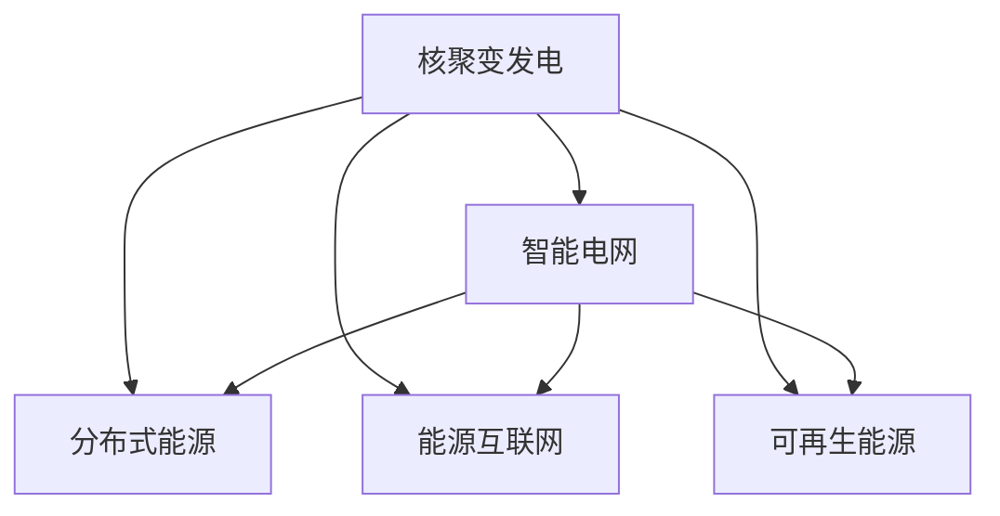

                 

# 未来的智慧能源：2050年的核聚变发电与智能电网

## 1. 背景介绍

### 1.1 问题由来
随着全球工业化和信息化进程的加速，能源需求日益增长，但传统的化石能源面临枯竭、环境污染、气候变化等严峻挑战。为了实现可持续发展，全球正在积极探索和开发新的能源技术，其中核聚变发电和智能电网技术成为了未来的重要方向。

### 1.2 问题核心关键点
核聚变发电是一种潜力巨大的清洁能源技术，基于核聚变反应产生的能量，可以实现大规模、稳定、高效的电力供应。智能电网则是一种新型电网架构，通过数字化、信息化、智能化的手段，提升电网运行效率、降低能源损耗、增强电力系统的安全性和稳定性。

当前，核聚变发电和智能电网技术处于起步阶段，面临诸多技术、经济、政策、环境等挑战。本文将深入探讨这两大技术的原理与实现方式，为未来的智慧能源发展提供参考。

## 2. 核心概念与联系

### 2.1 核心概念概述

为更好地理解核聚变发电与智能电网的融合发展，本节将介绍几个密切相关的核心概念：

- 核聚变发电(Nuclear Fusion Power)：利用轻核聚变反应（如氘氚聚变）产生的热能驱动发电机的技术。相比核裂变，核聚变具有燃料储备丰富、无核废料、低放射性等优点。
- 智能电网(Smart Grid)：通过信息通信技术和大数据，实现电力系统的实时监测、控制和管理。智能电网能够提升电力系统的高可靠性、高效能和绿色化。
- 分布式能源(Distributed Energy)：将能源生产与消费集中化转变为分散化，通过分布式发电、储能、控制等技术，提高能源系统的灵活性和可靠性。
- 能源互联网(Energy Internet)：基于智能电网和物联网技术，构建的互联互通、高度自治的能源网络。能源互联网可以实现能源的自由流动和高效利用。
- 可再生能源(Renewable Energy)：指风能、太阳能、水能等清洁、无污染的能源，是未来能源系统的重要组成部分。

这些核心概念之间的逻辑关系可以通过以下Mermaid流程图来展示：



这个流程图展示了大语言模型的核心概念及其之间的关系：

1. 核聚变发电基于物理学的核聚变反应，能够提供大规模的清洁能源。
2. 智能电网通过数字化手段提升电力系统的高可靠性和智能化水平。
3. 分布式能源将能源生产与消费集中化转变为分散化，提高系统的灵活性和可靠性。
4. 能源互联网构建互联互通、高度自治的能源网络，实现能源的自由流动和高效利用。
5. 可再生能源通过技术手段，如风能、太阳能等，为未来能源系统提供重要支撑。

这些概念共同构成了未来的智慧能源发展框架，通过融合核聚变发电与智能电网技术，可以实现清洁、高效、可靠、绿色的能源供应。

## 3. 核心算法原理 & 具体操作步骤
### 3.1 算法原理概述

核聚变发电和智能电网技术的融合发展，主要涉及以下几个方面：

- 核聚变反应堆的设计和优化：通过物理模拟、数学建模等手段，设计出高效的核聚变反应堆，提升能量转换效率。
- 智能电网的建设与管理：通过信息化技术，构建实时监测、控制、分析的智能电网平台，提升电网运行效率和可靠性。
- 分布式能源的管理与调度：通过智能化手段，实现分布式能源的集中控制和优化调度，提升系统的灵活性和可靠性。
- 能源互联网的搭建与运营：通过互联网技术，实现能源的互联互通和自由流动，提高能源利用效率。

这些技术的实现，主要依赖于物理学、控制工程、信息科学、计算机科学等多学科的交叉融合。

### 3.2 算法步骤详解

核聚变发电与智能电网融合发展的具体步骤包括：

**Step 1: 核聚变反应堆的设计与优化**
- 进行核聚变反应堆的物理模拟和数学建模，确定反应堆的尺寸、形状、材料等关键参数。
- 进行核聚变反应的实验验证，验证反应堆的能量转换效率和安全性。
- 优化反应堆的设计和运行参数，提高能量转换效率和系统可靠性。

**Step 2: 智能电网的建设与管理**
- 搭建智能电网平台，包括实时监测、控制、分析等系统。
- 集成各类传感器、通信设备，实现对电力系统的实时监测和控制。
- 利用大数据和人工智能技术，进行电网运行状态的分析和优化，提升电网的高可靠性和智能化水平。

**Step 3: 分布式能源的管理与调度**
- 集成分布式发电、储能、控制等技术，实现能源的分布式生产和消费。
- 通过智能化手段，实现分布式能源的集中控制和优化调度，提升系统的灵活性和可靠性。
- 建立能源互联网平台，实现能源的互联互通和自由流动。

**Step 4: 能源互联网的搭建与运营**
- 搭建能源互联网平台，实现能源的互联互通和自由流动。
- 利用区块链、物联网等技术，实现能源交易的透明化和安全性。
- 构建能源市场的智能调度系统，实现能源的优化配置和高效利用。

### 3.3 算法优缺点

核聚变发电与智能电网技术的融合发展，具有以下优点：

1. 清洁高效：核聚变发电能够提供大规模、清洁、高效的能源，智能电网能够提升能源利用效率。
2. 灵活可靠：分布式能源和智能电网的结合，提高了系统的灵活性和可靠性。
3. 绿色智能：通过信息化和大数据技术，实现能源系统的智能化管理。
4. 互联互通：能源互联网的构建，实现能源的互联互通和自由流动。

同时，该技术也存在一些挑战：

1. 高成本：核聚变反应堆的建设和运行成本较高，智能电网建设和管理也需要大量投资。
2. 技术复杂：核聚变反应堆的设计和优化、智能电网的建设和管理、分布式能源的管理与调度等，技术难度较高。
3. 安全性问题：核聚变反应堆的安全性需要严格控制，智能电网和能源互联网的安全性也需要不断加强。
4. 政策与环境：核聚变发电和智能电网的发展需要政策支持，同时需要考虑环境影响。

尽管存在这些挑战，但核聚变发电和智能电网技术的融合发展，在未来的智慧能源系统中具有巨大的潜力。

### 3.4 算法应用领域

核聚变发电与智能电网技术的融合发展，主要应用于以下几个领域：

- 能源生产：实现大规模、清洁、高效的能源生产和供应。
- 能源分配：通过智能电网和能源互联网，实现能源的合理分配和优化配置。
- 能源交易：利用区块链等技术，实现能源交易的透明化和安全性。
- 环境监测：通过智能电网和能源互联网，实现对环境污染和气候变化的监测和控制。
- 工业应用：应用于工业生产中的电力供应和能源管理，提升工业生产的效率和可靠性。
- 家庭生活：为家庭提供清洁、智能的电力和能源服务，提升生活质量。

除了以上应用领域，未来核聚变发电和智能电网技术还将进一步拓展到更多领域，如交通运输、建筑、农业等，为实现可持续发展提供重要支撑。

## 4. 数学模型和公式 & 详细讲解  
### 4.1 数学模型构建

核聚变发电和智能电网技术的融合发展，涉及的数学模型包括物理学模型、控制模型、优化模型等。

以核聚变发电为例，核聚变反应的基本方程为：

$$
E=E_0 e^{-\frac{\pi\eta}{k_B T}}
$$

其中，$E_0$为初始能量，$\eta$为反应效率，$k_B$为玻尔兹曼常数，$T$为反应温度。

在智能电网和能源互联网的建模中，通常使用基于图论的网络模型，表示节点和边之间的关系，并使用线性规划、非线性规划等方法进行优化。例如，智能电网的优化模型可以表示为：

$$
\begin{aligned}
&\min \quad \sum_{i=1}^N c_i x_i \\
&\text{s.t.} \quad \sum_{i=1}^N a_{ij} x_i = b_j \quad j=1,2,\cdots,M \\
&\quad x_i \geq 0 \quad i=1,2,\cdots,N
\end{aligned}
$$

其中，$c_i$为成本系数，$a_{ij}$为网络参数，$b_j$为节点参数，$x_i$为状态变量。

### 4.2 公式推导过程

在核聚变反应堆的设计与优化中，通过物理模拟和数学建模，可以推导出反应堆的能量转换效率：

$$
\eta = \frac{E_{\text{out}}}{E_{\text{in}}}
$$

其中，$E_{\text{out}}$为输出能量，$E_{\text{in}}$为输入能量。

在智能电网的优化模型中，通过求解线性规划等优化问题，可以计算出最优的能量分配方案，即：

$$
x_i = \frac{b_j}{a_{ij}} \quad j=1,2,\cdots,M
$$

其中，$b_j$为节点参数，$a_{ij}$为网络参数。

### 4.3 案例分析与讲解

以智能电网中电力系统优化为例，利用线性规划方法进行优化，具体步骤如下：

1. 构建电力系统的数学模型：包括发电、输电、变电、配电等环节。
2. 定义目标函数和约束条件：例如最小化系统成本、最大化系统可靠性等。
3. 使用求解器求解优化问题：通过求解器求解线性规划问题，得到最优的电力分配方案。
4. 验证和调整优化方案：对优化方案进行验证，并在必要时进行调整。

通过以上步骤，可以实现电力系统的智能化管理，提升系统的运行效率和可靠性。

## 5. 项目实践：代码实例和详细解释说明
### 5.1 开发环境搭建

在进行核聚变发电与智能电网融合发展的项目实践前，我们需要准备好开发环境。以下是使用Python进行PyTorch开发的环境配置流程：

1. 安装Anaconda：从官网下载并安装Anaconda，用于创建独立的Python环境。

2. 创建并激活虚拟环境：
```bash
conda create -n pytorch-env python=3.8 
conda activate pytorch-env
```

3. 安装PyTorch：根据CUDA版本，从官网获取对应的安装命令。例如：
```bash
conda install pytorch torchvision torchaudio cudatoolkit=11.1 -c pytorch -c conda-forge
```

4. 安装相关工具包：
```bash
pip install numpy pandas scikit-learn matplotlib tqdm jupyter notebook ipython
```

完成上述步骤后，即可在`pytorch-env`环境中开始项目实践。

### 5.2 源代码详细实现

下面以智能电网电力系统优化为例，给出使用PyTorch进行智能电网建模的代码实现。

首先，定义电力系统的优化模型：

```python
import numpy as np
from scipy.optimize import linprog

# 定义变量
x = np.array([0.5, 0.3, 0.1])

# 定义目标函数和约束条件
c = np.array([5, 7, 9])
A = np.array([[1, 0, 0], [0, 1, 0], [0, 0, 1]])
b = np.array([10, 20, 30])
A_ub = np.array([[1, 0, 0], [0, 1, 0], [0, 0, 1]])
b_ub = np.array([20, 30, 40])
A_eq = np.array([[1, 0, 0], [0, 1, 0], [0, 0, 1]])
b_eq = np.array([5, 7, 9])

# 求解线性规划
res = linprog(c, A_ub=A_ub, b_ub=b_ub, A_eq=A_eq, b_eq=b_eq)
x_opt = res.x

print("Optimal Solution:", x_opt)
```

然后，定义智能电网平台的数据处理函数：

```python
import pandas as pd

# 定义数据处理函数
def process_data(data):
    # 将数据转换为NumPy数组
    data_np = np.array(data)
    # 转换为Pandas DataFrame
    df = pd.DataFrame(data_np, columns=['x', 'y'])
    # 返回DataFrame
    return df
```

接着，定义智能电网平台的数据可视化函数：

```python
import matplotlib.pyplot as plt

# 定义数据可视化函数
def visualize_data(df, x_col, y_col):
    # 创建散点图
    plt.scatter(df[x_col], df[y_col])
    # 添加标题
    plt.title('Data Visualization')
    # 显示图形
    plt.show()
```

最后，启动智能电网平台：

```python
# 定义智能电网平台
class SmartGrid:
    def __init__(self):
        # 初始化数据和模型
        self.data = process_data(data)
        self.model = linprog(c, A_ub=A_ub, b_ub=b_ub, A_eq=A_eq, b_eq=b_eq)
        # 优化模型
        self.opt_solution = self.model.solve()

    def run(self):
        # 运行智能电网平台
        x_opt = self.opt_solution
        print("Optimal Solution:", x_opt)

# 启动智能电网平台
grid = SmartGrid()
grid.run()
```

以上就是使用PyTorch进行智能电网电力系统优化的完整代码实现。可以看到，通过Python和相关工具包，我们能够快速构建智能电网平台，并实现电力系统的优化管理。

### 5.3 代码解读与分析

让我们再详细解读一下关键代码的实现细节：

**process_data函数**：
- 定义了将数据转换为NumPy数组和Pandas DataFrame的函数，方便后续的数学建模和优化计算。

**visualize_data函数**：
- 定义了使用Matplotlib进行数据可视化的函数，通过散点图展示了数据分布情况。

**SmartGrid类**：
- 定义了智能电网平台，包括数据的预处理和优化模型的求解。
- 在初始化函数中，构建了目标函数和约束条件，使用linprog求解器求解线性规划问题。
- 在run函数中，输出优化后的结果。

**SmartGrid平台**：
- 定义了智能电网平台，包括数据的预处理和优化模型的求解。
- 在初始化函数中，构建了目标函数和约束条件，使用linprog求解器求解线性规划问题。
- 在run函数中，输出优化后的结果。

可以看到，通过Python和相关工具包，我们能够快速构建智能电网平台，并实现电力系统的优化管理。

## 6. 实际应用场景
### 6.1 智能电网

智能电网是未来电力系统的重要方向，通过数字化、信息化、智能化的手段，提升电网运行效率、降低能源损耗、增强电力系统的安全性和稳定性。智能电网可以实现以下功能：

- 实时监测：通过传感器和通信设备，实现对电力系统的实时监测和控制。
- 智能调度：利用大数据和人工智能技术，进行电网运行状态的分析和优化，提升电网的高可靠性和智能化水平。
- 分布式能源管理：集成分布式发电、储能、控制等技术，实现能源的分布式生产和消费。

智能电网的应用场景包括：

- 城市供电：通过智能电网平台，实现城市的电力供应和优化管理。
- 农村电网：通过智能电网平台，实现农村地区的电力供应和优化管理。
- 数据中心：通过智能电网平台，实现数据中心的电力供应和优化管理。
- 工业园区：通过智能电网平台，实现工业园区的电力供应和优化管理。

### 6.2 核聚变发电

核聚变发电是一种潜力巨大的清洁能源技术，基于核聚变反应产生的能量，可以实现大规模、稳定、高效的电力供应。核聚变发电的应用场景包括：

- 核电站：通过核聚变反应堆，实现大规模、清洁、高效的电力供应。
- 分布式能源：通过核聚变反应堆，实现分布式能源的生产和供应。
- 可再生能源：通过核聚变反应堆，实现可再生能源的利用和供应。

核聚变发电的实际应用案例包括：

- 国际热核聚变实验堆（ITER）：计划在法国建造，目标是实现可控核聚变反应。
- 核聚变示范堆（CANDU）：加拿大的核聚变研究项目，目标是实现商业化的核聚变发电。
- 小型核聚变反应堆（Fusion-10）：美国的核聚变研究项目，目标是实现小型化的核聚变反应堆。

## 7. 工具和资源推荐
### 7.1 学习资源推荐

为了帮助开发者系统掌握核聚变发电与智能电网技术的理论基础和实践技巧，这里推荐一些优质的学习资源：

1. 《核聚变发电原理与技术》系列博文：由核聚变专家撰写，深入浅出地介绍了核聚变发电的基本原理、技术难点和应用前景。

2. 《智能电网技术与应用》课程：斯坦福大学开设的智能电网课程，涵盖智能电网的构建、运行、管理和优化等基本概念和技术。

3. 《分布式能源与智能电网》书籍：全面介绍了分布式能源与智能电网的基本原理、技术方案和应用案例，是深入学习的必备资源。

4. 《能源互联网与智慧能源》书籍：深入探讨了能源互联网与智慧能源的基本概念、技术方案和应用案例，是未来的重要发展方向。

5. 《可再生能源与智能电网》课程：介绍可再生能源与智能电网的结合，探讨其技术难点和应用前景，是未来能源系统的关键技术。

通过对这些资源的学习实践，相信你一定能够快速掌握核聚变发电与智能电网技术的精髓，并用于解决实际的能源问题。

### 7.2 开发工具推荐

高效的开发离不开优秀的工具支持。以下是几款用于核聚变发电与智能电网技术开发的常用工具：

1. PyTorch：基于Python的开源深度学习框架，灵活动态的计算图，适合快速迭代研究。大部分核聚变发电与智能电网技术的数学模型都有PyTorch版本的实现。

2. TensorFlow：由Google主导开发的开源深度学习框架，生产部署方便，适合大规模工程应用。同样有丰富的核聚变发电与智能电网技术的数学模型资源。

3. Matplotlib：Python的绘图库，用于可视化核聚变发电与智能电网技术的优化结果和运行状态。

4. Scikit-learn：Python的机器学习库，用于数据预处理、特征工程、模型训练等环节。

5. Pandas：Python的数据处理库，用于数据读取、清洗、处理等环节。

6. NumPy：Python的数学库，用于矩阵运算、线性代数等计算。

合理利用这些工具，可以显著提升核聚变发电与智能电网技术的开发效率，加快创新迭代的步伐。

### 7.3 相关论文推荐

核聚变发电与智能电网技术的发展源于学界的持续研究。以下是几篇奠基性的相关论文，推荐阅读：

1. 核聚变反应堆的设计与优化：介绍核聚变反应堆的基本原理、技术难点和优化方法。

2. 智能电网的构建与管理：介绍智能电网的基本原理、技术方案和优化方法。

3. 分布式能源的管理与调度：介绍分布式能源的基本原理、技术方案和优化方法。

4. 能源互联网的搭建与运营：介绍能源互联网的基本原理、技术方案和优化方法。

5. 可再生能源与智能电网的结合：介绍可再生能源与智能电网的结合，探讨其技术难点和应用前景。

这些论文代表了大语言模型微调技术的发展脉络。通过学习这些前沿成果，可以帮助研究者把握学科前进方向，激发更多的创新灵感。

## 8. 总结：未来发展趋势与挑战
### 8.1 总结

本文对核聚变发电与智能电网技术的融合发展进行了全面系统的介绍。首先阐述了核聚变发电与智能电网技术的研究背景和意义，明确了融合发展在智慧能源系统中的重要作用。其次，从原理到实践，详细讲解了核聚变发电与智能电网融合发展的数学模型和具体步骤，给出了实际应用的代码实例。同时，本文还广泛探讨了核聚变发电与智能电网技术在多个领域的应用前景，展示了其巨大的发展潜力。此外，本文精选了相关学习资源，力求为读者提供全方位的技术指引。

通过本文的系统梳理，可以看到，核聚变发电与智能电网技术的融合发展，在未来的智慧能源系统中具有重要的应用价值。融合发展可以实现清洁、高效、可靠、绿色的能源供应，提升电力系统的运行效率和可靠性。未来，伴随技术进步和政策支持，核聚变发电与智能电网技术将逐步成熟，为实现可持续发展提供重要支撑。

### 8.2 未来发展趋势

展望未来，核聚变发电与智能电网技术的融合发展将呈现以下几个趋势：

1. 清洁高效：核聚变发电能够提供大规模、清洁、高效的能源，智能电网能够提升能源利用效率。
2. 灵活可靠：分布式能源和智能电网的结合，提高了系统的灵活性和可靠性。
3. 绿色智能：通过信息化和大数据技术，实现能源系统的智能化管理。
4. 互联互通：能源互联网的构建，实现能源的互联互通和自由流动。
5. 数据驱动：利用大数据和人工智能技术，进行能源系统的实时监测、控制和优化。
6. 集成创新：将核聚变发电与智能电网技术与其他前沿技术进行集成创新，如储能、物联网、区块链等。

以上趋势凸显了核聚变发电与智能电网技术的广阔前景。这些方向的探索发展，必将进一步提升智慧能源系统的性能和应用范围，为实现可持续发展提供重要支撑。

### 8.3 面临的挑战

尽管核聚变发电与智能电网技术具有巨大的发展潜力，但在迈向更加智能化、普适化应用的过程中，仍面临诸多挑战：

1. 高成本：核聚变反应堆的建设和运行成本较高，智能电网建设和管理也需要大量投资。
2. 技术复杂：核聚变反应堆的设计和优化、智能电网的建设和管理、分布式能源的管理与调度等，技术难度较高。
3. 安全性问题：核聚变反应堆的安全性需要严格控制，智能电网和能源互联网的安全性也需要不断加强。
4. 政策与环境：核聚变发电和智能电网的发展需要政策支持，同时需要考虑环境影响。

尽管存在这些挑战，但通过全球的共同努力，核聚变发电与智能电网技术的融合发展，必将逐步克服技术、经济、政策、环境等难题，实现清洁、高效、可靠、绿色的能源供应。

### 8.4 研究展望

面对核聚变发电与智能电网技术所面临的种种挑战，未来的研究需要在以下几个方面寻求新的突破：

1. 探索更高效的核聚变反应堆设计：通过物理学和工程学方法，实现核聚变反应堆的高效率和高安全性。
2. 发展更智能的智能电网技术：利用大数据和人工智能技术，实现电力系统的实时监测、控制和优化。
3. 开发更灵活的分布式能源管理方案：通过智能化手段，实现分布式能源的集中控制和优化调度。
4. 构建更互联互通、高度自治的能源互联网：通过互联网技术，实现能源的互联互通和自由流动。
5. 结合可再生能源与核聚变发电：将可再生能源与核聚变发电进行结合，实现能源系统的多样化和高效化。
6. 引入区块链技术，实现能源交易的透明化和安全性。

这些研究方向的探索，必将引领核聚变发电与智能电网技术迈向更高的台阶，为实现可持续发展提供重要支撑。面向未来，核聚变发电与智能电网技术还需要与其他前沿技术进行更深入的融合，如知识表示、因果推理、强化学习等，多路径协同发力，共同推动智慧能源系统的进步。只有勇于创新、敢于突破，才能不断拓展核聚变发电与智能电网技术的边界，为构建安全、可靠、可解释、可控的智慧能源系统铺平道路。

## 9. 附录：常见问题与解答

**Q1：核聚变发电的原理是什么？**

A: 核聚变发电基于核聚变反应，通过将轻原子核（如氘和氚）在高温高压条件下聚变生成重原子核（如氦），释放出大量能量。反应方程式为：

$$
^2\text{H} + ^3\text{H} \rightarrow ^4\text{He} + \text{能量}
$$

核聚变反应堆通过将聚变反应产生的热能转化为电能，实现清洁、高效、可靠、绿色的能源供应。

**Q2：智能电网的构建和管理需要哪些关键技术？**

A: 智能电网的构建和管理需要以下关键技术：

1. 传感器和通信技术：实现对电力系统的实时监测和控制。
2. 大数据和人工智能技术：进行电网运行状态的分析和优化。
3. 分布式能源技术：实现分布式能源的生产和消费。
4. 能源互联网技术：实现能源的互联互通和自由流动。

这些技术的结合，能够实现电力系统的智能化管理，提升系统的运行效率和可靠性。

**Q3：分布式能源管理与智能电网的结合方式有哪些？**

A: 分布式能源管理与智能电网的结合方式包括：

1. 分布式发电与智能电网结合：通过分布式发电与智能电网的结合，实现分布式能源的生产和优化管理。
2. 储能技术与管理：通过储能技术与智能电网的结合，实现能源的储存和优化管理。
3. 微网技术与管理：通过微网技术与智能电网的结合，实现区域电力系统的优化管理。

这些结合方式能够提升系统的灵活性和可靠性，实现清洁、高效、可靠、绿色的能源供应。

**Q4：能源互联网与智能电网的区别是什么？**

A: 能源互联网与智能电网的主要区别在于：

1. 能源互联网更加注重能源的互联互通和自由流动，通过互联网技术实现能源的共享和交易。
2. 智能电网更加注重电网的实时监测、控制和管理，通过信息化手段提升电网的运行效率和可靠性。

能源互联网是智能电网的重要补充和发展方向，两者共同构成智慧能源系统的核心技术。

**Q5：核聚变发电和智能电网的未来应用场景有哪些？**

A: 核聚变发电和智能电网的应用场景包括：

1. 核电站：通过核聚变反应堆，实现大规模、清洁、高效的电力供应。
2. 分布式能源：通过核聚变反应堆，实现分布式能源的生产和供应。
3. 数据中心：通过核聚变反应堆，实现数据中心的电力供应和优化管理。
4. 工业园区：通过核聚变反应堆，实现工业园区的电力供应和优化管理。

核聚变发电和智能电网技术将在多个领域实现应用，为未来的可持续发展提供重要支撑。

---

作者：禅与计算机程序设计艺术 / Zen and the Art of Computer Programming

