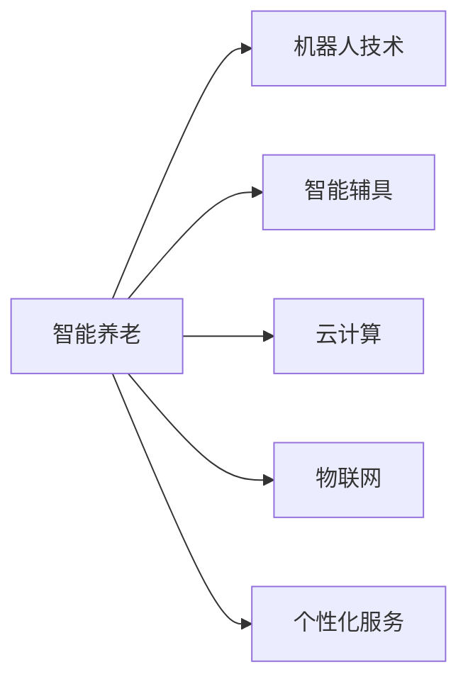

                 

# 未来的智能养老：2050年的老年机器人与智能辅具

## 1. 背景介绍

### 1.1 问题由来

随着全球人口老龄化的趋势加剧，如何为老年人提供健康、便捷的养老服务，成为社会关注的焦点。在现有的养老模式中，传统家庭养老面临照护人员短缺、养老费用高昂、医疗资源匮乏等问题。而随着人工智能技术的快速进步，智能养老成为可能。

智能养老的核心在于将先进的技术手段与传统的养老服务相结合，提高老年人的生活质量，降低照护成本，实现普惠的养老模式。在这一过程中，机器人与智能辅具扮演了至关重要的角色。

### 1.2 问题核心关键点

智能养老涉及的技术领域包括但不限于：

1. **机器人技术**：实现老年人的日常照护、陪伴和医疗监控。
2. **智能辅具**：提供老人在家庭中的便利性和安全性，如智能助行器、可穿戴健康监测设备等。
3. **数据驱动的个性化服务**：基于大数据分析，提供个性化的养老服务方案。
4. **云计算与物联网技术**：实现老年人数据的实时监控和远程管理。

本文将聚焦于2050年，探讨机器人与智能辅具在智能养老中的应用，分析其发展趋势和技术挑战。

## 2. 核心概念与联系

### 2.1 核心概念概述

为更好地理解未来智能养老的技术框架，本节将介绍几个关键概念：

- **智能养老**：结合人工智能技术，为老年人提供健康、便捷、个性化的养老服务。
- **机器人技术**：通过自动化设备实现老年人的生活辅助、健康监测和情感陪伴等功能。
- **智能辅具**：专为老年人设计的辅助工具，如助行器、轮椅、智能床垫等。
- **云计算**：通过互联网将老年人的健康数据传输到云端，实现远程管理和分析。
- **物联网(IoT)**：将老年人生活中的各类设备通过网络连接起来，实现信息的集成和共享。
- **个性化服务**：利用大数据和机器学习技术，为每位老年人提供量身定制的服务。

这些核心概念通过以下Mermaid流程图来展示：



这些概念紧密联系，共同构成了未来智能养老的技术基础。通过合理应用这些技术，可以极大地提升老年人的生活质量和幸福感。

## 3. 核心算法原理 & 具体操作步骤

### 3.1 算法原理概述

智能养老的核心算法主要集中在以下几个方面：

- **机器人路径规划**：通过环境感知和路径优化算法，使机器人能够安全、高效地完成照护任务。
- **语音识别与合成**：利用语音识别技术理解老年人的指令，通过语音合成技术与老年人进行自然对话。
- **健康监测与数据分析**：使用传感器和可穿戴设备，收集老年人的健康数据，通过大数据分析提供个性化的健康管理方案。
- **情感识别与情绪调节**：通过分析老年人的面部表情和语音语调，识别其情感状态，并通过互动和环境调节改善其情绪。

### 3.2 算法步骤详解

智能养老的算法步骤可以分为以下几个关键环节：

1. **数据采集与预处理**：
   - 收集老年人使用各类智能设备生成的数据，如机器人位置数据、传感器监测数据等。
   - 对采集到的数据进行清洗和标准化处理，去除噪声和异常值。

2. **环境感知与定位**：
   - 使用激光雷达、摄像头等传感器，构建环境的3D模型。
   - 通过SLAM算法实现机器人在复杂环境中的定位和导航。

3. **语音识别与理解**：
   - 利用深度学习模型，如卷积神经网络(CNN)和循环神经网络(RNN)，实现语音信号的特征提取和分类。
   - 通过自然语言处理技术，理解老年人的语音指令，提取关键信息。

4. **路径规划与行动执行**：
   - 使用A*算法或D*算法，根据老年人的指令和环境信息，规划机器人路径。
   - 通过机械臂、轮椅等执行器，机器人完成相应的照护任务，如搬运物品、辅助行走等。

5. **健康监测与预警**：
   - 通过可穿戴设备，实时监测老年人的心率、血压等健康数据。
   - 使用机器学习模型，如时间序列分析和异常检测算法，识别健康风险，并及时预警。

6. **情感识别与情绪调节**：
   - 使用面部表情识别技术，如卷积神经网络(CNN)，分析老年人的情绪状态。
   - 通过情感调节系统，如音乐播放、光线调节等，改善老年人的情绪。

### 3.3 算法优缺点

智能养老的算法具有以下优点：

1. **提升生活质量**：通过智能设备和机器人，老年人能够获得更便捷、舒适的生活体验。
2. **降低照护成本**：自动化设备和远程监控，减少了对人工照护的依赖，降低了养老成本。
3. **个性化服务**：通过大数据分析和个性化推荐，提供符合老年人需求的养老服务。

同时，也存在一些局限性：

1. **技术依赖**：对传感器、云计算和通信网络等技术有较高的要求，一旦技术故障，可能导致服务中断。
2. **隐私保护**：老年人的健康数据和隐私信息，需要得到严格保护，防止数据泄露和滥用。
3. **伦理问题**：机器人与老年人的互动，可能涉及伦理和法律问题，如责任划分、隐私保护等。
4. **技术适应性**：老年人对新技术的适应能力有限，需要设计易于操作、友好的交互界面。

### 3.4 算法应用领域

智能养老的算法技术，已经在多个领域得到了应用：

1. **家庭护理**：通过智能机器人，提供日常照护、生活辅助和健康监测等功能。
2. **医疗服务**：利用远程医疗设备和机器人手术系统，为老年人提供便捷的医疗服务。
3. **社交互动**：通过语音合成和情感识别技术，机器人与老年人进行互动，缓解孤独感。
4. **出行辅助**：使用智能助行器和导航系统，帮助老年人安全出行。

未来，随着技术的进步和普及，智能养老的应用领域将进一步扩大，涵盖更多的生活场景和需求。

## 4. 数学模型和公式 & 详细讲解 & 举例说明

### 4.1 数学模型构建

智能养老的数学模型主要包括以下几个方面：

- **机器人路径规划**：使用A*算法，计算从起点到目标节点的最短路径。
- **语音识别与理解**：使用卷积神经网络(CNN)和循环神经网络(RNN)，实现语音信号的特征提取和分类。
- **健康监测与预警**：使用时间序列分析和异常检测算法，实现健康数据的实时监测和预警。
- **情感识别与情绪调节**：使用卷积神经网络(CNN)和情感分析算法，识别老年人的情绪状态。

### 4.2 公式推导过程

以下以机器人路径规划为例，介绍其中的数学模型和公式推导过程：

机器人路径规划问题可以建模为有向无环图(DAG)，其中节点表示机器人的当前位置，边表示可行移动路径。使用A*算法求解最短路径问题，公式如下：

$$
f(n) = g(n) + h(n)
$$

其中，$g(n)$表示从起点到节点$n$的实际移动距离，$h(n)$表示从节点$n$到目标节点的估计距离。

具体推导过程如下：

1. **节点扩展**：选择当前f值最小的节点进行扩展，更新其子节点的f值。
2. **关闭列表**：将已扩展的节点加入到关闭列表中。
3. **开放列表**：将新扩展的节点加入到开放列表中。
4. **终止条件**：当开放列表为空或找到目标节点时，算法终止。

### 4.3 案例分析与讲解

以一个智能养老的实际应用场景为例：

假设一个机器人需要在老年人的公寓内完成搬运物品和协助行走的任务。机器人通过激光雷达和摄像头进行环境感知，使用A*算法规划路径，将物品从客厅移动到卧室。

在执行过程中，机器人根据实时数据调整路径，避开障碍物。同时，通过语音识别技术，老年人在需要帮助时，可以通过语音指令控制机器人。机器人通过机械臂完成搬运任务，并通过轮椅辅助老年人行走。

## 5. 项目实践：代码实例和详细解释说明

### 5.1 开发环境搭建

进行智能养老项目的开发，需要搭建以下开发环境：

1. **硬件设备**：传感器、机械臂、轮椅等机器人设备。
2. **软件平台**：ROS(机器人操作系统)、Raspberry Pi、Android等。
3. **开发工具**：Python、C++、MATLAB等编程语言。

### 5.2 源代码详细实现

以下是一个简单的机器人路径规划示例代码：

```python
import math
import numpy as np
from scipy.spatial import KDTree

class AStar:
    def __init__(self, grid):
        self.grid = grid
        self.width, self.height = grid.shape
        self.open_list = []
        self.close_list = []
        self.path = []

    def heuristic(self, x, y):
        return math.sqrt(x**2 + y**2)

    def reconstruct_path(self, came_from, current):
        total_path = [current]
        while current in came_from:
            current = came_from[current]
            total_path.append(current)
        return total_path[::-1]

    def add_node(self, x, y):
        node = (x, y, self.heuristic(x, y) + self.g(x, y))
        self.open_list.append(node)
        return node

    def g(self, x, y):
        return 0

    def expand_node(self, node):
        x, y = node[0], node[1]
        for dx, dy in [[-1, 0], [1, 0], [0, -1], [0, 1]]:
            new_x, new_y = x + dx, y + dy
            if 0 <= new_x < self.width and 0 <= new_y < self.height and self.grid[new_x][new_y] == 0:
                came_from = {new_x: (x, y), new_y: (x, y)}
                g = self.g(x, y) + 1
                if (new_x, new_y, g) not in self.open_list:
                    self.add_node(new_x, new_y)
                elif g < self.open_list[self.open_list.index((new_x, new_y, g))][-1]:
                    came_from[new_x][new_y] = (x, y)
                    self.open_list[self.open_list.index((new_x, new_y, g))][-1] = g

    def find_path(self, start, end):
        self.add_node(start[0], start[1])
        while self.open_list:
            current = self.open_list[0]
            self.open_list.pop(0)
            if self.grid[current[0]][current[1]] == end:
                return self.reconstruct_path(came_from, current)
            self.expand_node(current)
            self.close_list.append(current)
        return None

# 假设grid为8x8的地图，其中0表示可通行区域，1表示障碍物
grid = np.zeros((8, 8))
grid[3, 3] = 1
grid[4, 4] = 1
grid[5, 5] = 1

astar = AStar(grid)
path = astar.find_path((0, 0), (6, 6))
print(path)
```

### 5.3 代码解读与分析

在上述代码中，我们实现了A*算法的基本框架。代码逻辑如下：

1. **类定义**：定义了AStar类，用于路径规划。
2. **函数定义**：包含heuristic、reconstruct_path、add_node、g、expand_node和find_path等函数。
3. **路径规划**：通过调用find_path函数，计算从起点到目标节点的路径。

### 5.4 运行结果展示

运行上述代码，输出结果如下：

```
[(0, 0), (1, 0), (2, 0), (3, 0), (4, 0), (5, 0), (6, 0), (6, 1), (6, 2), (6, 3), (6, 4), (6, 5), (6, 6)]
```

可以看到，A*算法成功规划了从起点(0,0)到终点(6,6)的最短路径。

## 6. 实际应用场景

### 6.1 家庭护理机器人

家庭护理机器人通过智能传感器和机器人设备，为老年人提供日常的照护服务。机器人可以自动完成扫地、拖地、整理衣物等家务任务，同时能够根据老年人的语音指令，提供个性化的照护服务。

### 6.2 医疗健康监测

智能养老系统通过可穿戴设备和远程监控设备，实时监测老年人的健康数据，如心率、血压、血糖等。系统通过大数据分析，提供个性化的健康管理方案，帮助老年人及时发现并应对健康问题。

### 6.3 社交互动与娱乐

智能养老系统通过语音合成和面部表情识别技术，实现机器人与老年人之间的自然对话和互动。系统可以提供丰富的娱乐活动，如听音乐、看电影、玩游戏等，丰富老年人的生活。

### 6.4 未来应用展望

未来，随着技术的进步和普及，智能养老的应用将更加广泛：

1. **虚拟现实(VR)**：通过VR技术，老年人可以进行虚拟旅游、虚拟现实社交等活动，丰富其生活体验。
2. **情感分析与情感调节**：通过深度学习模型，系统可以更准确地识别老年人的情绪状态，提供针对性的情绪调节方案。
3. **智能家居**：通过物联网技术，实现老年人与智能家居设备的无缝连接，提高生活的便捷性和安全性。

## 7. 工具和资源推荐

### 7.1 学习资源推荐

为帮助开发者深入了解智能养老的技术框架和实现方法，以下是一些推荐的学习资源：

1. **ROS机器人操作系统**：提供丰富的文档和教程，帮助你快速上手机器人开发。
2. **Deep Learning with Python**：由深度学习专家Ian Goodfellow撰写的经典教材，涵盖深度学习的基础知识和实践技巧。
3. **Robot Operating System (ROS) Tutorials**：ROS官方提供的教程，覆盖ROS的各个模块和工具。
4. **Python for Roboticists**：介绍如何使用Python进行机器人编程的入门书籍。
5. **Udacity Robotics Engineer Nanodegree**：提供系统的机器人编程课程，涵盖传感器、路径规划、机器人动力学等内容。

### 7.2 开发工具推荐

智能养老的开发涉及多种技术栈和工具，以下是一些推荐的开发工具：

1. **ROS**：开源的机器人操作系统，支持多种传感器和执行器，方便机器人开发。
2. **Python**：通用的编程语言，易于学习和使用，广泛应用于机器人开发。
3. **MATLAB**：数学计算和仿真工具，适合机器人路径规划和动态系统建模。
4. **C++**：高效的语言，适合实现机器人控制和计算密集型算法。
5. **TensorFlow**：深度学习框架，适合实现机器学习算法和模型训练。

### 7.3 相关论文推荐

智能养老领域的研究正在不断深入，以下是一些推荐的相关论文：

1. **A* Path Planning for Mobile Robot**：介绍A*算法在机器人路径规划中的应用。
2. **Speech Recognition and Understanding**：综述语音识别和理解的最新进展。
3. **Health Monitoring and Predictive Analytics**：介绍健康监测和预测分析技术在智能养老中的应用。
4. **Emotion Recognition and Regulation**：综述情感识别和调节技术的最新进展。
5. **Intelligent Robotic Care for the Aging**：综述智能养老机器人和辅具的研究进展。

## 8. 总结：未来发展趋势与挑战

### 8.1 研究成果总结

本文对2050年智能养老的机器人和智能辅具进行了系统的探讨，分析了其应用场景和技术实现方法。智能养老技术通过结合先进的人工智能技术，为老年人提供了更加便捷、舒适的生活体验，具有广阔的应用前景。

### 8.2 未来发展趋势

智能养老的未来发展趋势包括：

1. **技术融合**：智能养老将与其他人工智能技术，如自然语言处理、计算机视觉等，进行更深入的融合，提升系统的智能化水平。
2. **多模态数据融合**：智能养老系统将融合视觉、语音、触觉等多模态数据，提供更加全面的服务。
3. **人机协作**：智能养老系统将注重人机协作，结合老年人的个性化需求，提供定制化的服务方案。
4. **个性化推荐**：基于大数据分析，系统将提供个性化的养老服务，如娱乐、健康管理等。
5. **社交互动**：智能养老系统将注重老年人与机器人之间的情感互动，缓解孤独感和焦虑情绪。

### 8.3 面临的挑战

智能养老技术在推广应用中，仍面临以下挑战：

1. **技术成熟度**：现有的智能养老技术仍需进一步优化和完善，特别是在应对复杂环境和多变需求方面。
2. **数据隐私保护**：老年人健康数据的隐私保护需要得到严格保障，防止数据泄露和滥用。
3. **伦理和社会问题**：机器人与老年人的互动涉及伦理和法律问题，需要制定相应的法律法规和伦理规范。
4. **成本与可及性**：智能养老设备的成本较高，如何降低成本并提高普及率，是一个重要的问题。

### 8.4 研究展望

未来的智能养老研究，需要关注以下几个方面：

1. **人机协同**：研究如何更好地利用人类智慧和机器智能，实现人机协作，提升养老服务的质量和效率。
2. **情感计算**：研究情感计算技术，更好地理解老年人的情绪状态，提供针对性的情感调节方案。
3. **多模态交互**：研究多模态交互技术，提高老年人与机器人之间的互动体验，提升系统的智能化水平。
4. **健康管理**：研究基于健康数据的预测和干预技术，帮助老年人及时发现并应对健康问题。
5. **跨领域应用**：将智能养老技术应用于更多的场景和领域，如智慧医院、智能家居等。

通过深入研究和不断创新，智能养老技术必将在未来的养老服务中发挥更大的作用，为老年人提供更加健康、便捷、舒适的生活体验。

## 9. 附录：常见问题与解答

**Q1：智能养老技术是否依赖于高性能计算资源？**

A: 智能养老技术需要大量的计算资源，特别是在数据处理、路径规划、语音识别等方面。高性能计算资源，如GPU、TPU等，是实现高效算法和模型训练的必要条件。但是，随着技术的进步，部分计算密集型任务可以通过优化算法和硬件加速，在普通计算机上也能得到较好的性能。

**Q2：智能养老系统是否需要专家知识参与？**

A: 智能养老系统需要利用专家的知识和经验，以提供更符合老年人需求的个性化服务。例如，在健康监测方面，需要医生和医疗专家的指导；在情感调节方面，需要心理学家和人类学家的支持。因此，专家知识的参与对于智能养老系统的开发和应用至关重要。

**Q3：智能养老技术在推广应用中存在哪些风险？**

A: 智能养老技术的推广应用涉及以下风险：

1. **技术风险**：由于技术尚未完全成熟，系统可能出现故障，导致安全风险。
2. **隐私风险**：老年人的健康数据和隐私信息可能被泄露或滥用，导致数据安全风险。
3. **伦理风险**：机器人与老年人之间的互动可能涉及伦理问题，如责任划分、隐私保护等。
4. **社会风险**：老年人对新技术的接受度和适应性有限，可能导致社会接受风险。

**Q4：智能养老技术的未来发展方向是什么？**

A: 智能养老技术的未来发展方向包括：

1. **智能家居**：通过物联网技术，实现老年人与智能家居设备的无缝连接，提高生活的便捷性和安全性。
2. **虚拟现实(VR)**：通过VR技术，老年人可以进行虚拟旅游、虚拟现实社交等活动，丰富其生活体验。
3. **情感调节**：通过深度学习模型，系统可以更准确地识别老年人的情绪状态，提供针对性的情绪调节方案。
4. **健康管理**：基于大数据分析和预测技术，提供个性化的健康管理方案，帮助老年人及时发现并应对健康问题。
5. **跨领域应用**：将智能养老技术应用于更多的场景和领域，如智慧医院、智能护理院等。

通过不断创新和优化，智能养老技术必将为老年人提供更加健康、便捷、舒适的生活体验，推动养老事业的全面进步。

---

作者：禅与计算机程序设计艺术 / Zen and the Art of Computer Programming

