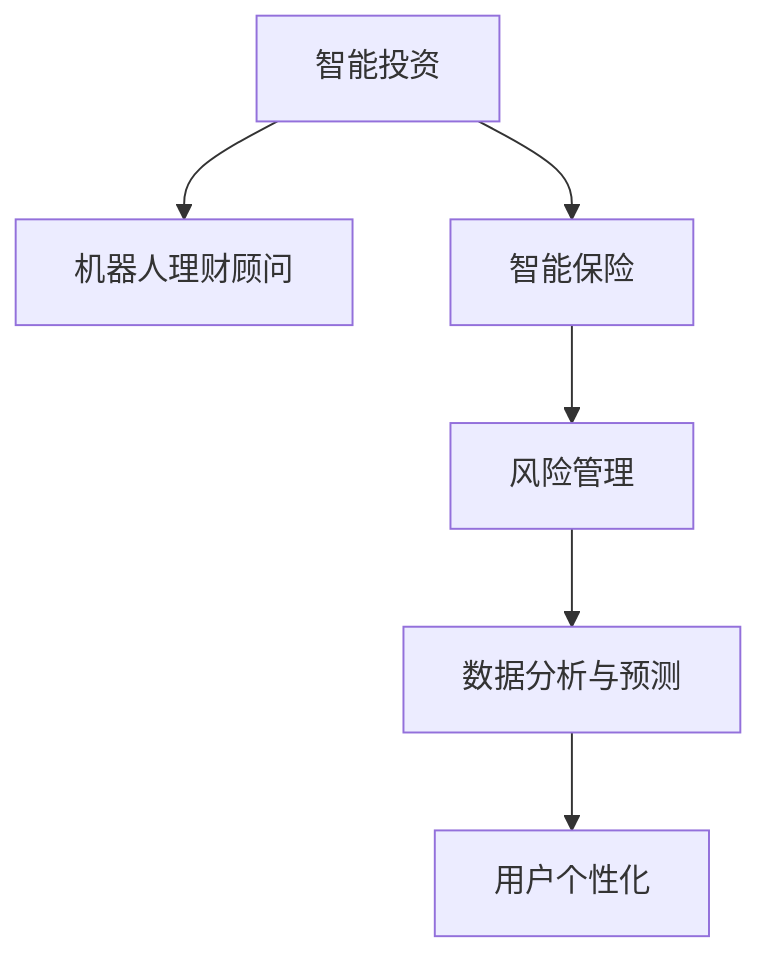

                 

# 未来的智能投资：2050年的机器人理财顾问与智能保险

> 关键词：智能投资，机器人理财顾问，智能保险，未来金融，人工智能

## 1. 背景介绍

### 1.1 问题由来
随着全球金融市场的快速发展和信息技术的进步，传统的金融服务正面临前所未有的变革。人口老龄化、经济不确定性、金融产品复杂化等挑战要求金融机构提供更高效、智能的金融解决方案。如何利用先进技术，打造一个智能化、自动化、个性化的金融服务平台，成为亟待解决的问题。

近年来，人工智能(AI)和机器学习(ML)技术在金融领域得到广泛应用。金融科技(Fintech)企业通过算法驱动，为投资者提供精准的投资建议、智能的风险管理、自动化的理财规划等服务，大大提升了金融服务的效率和质量。但这些技术仍然面临技术瓶颈、用户信任度、法律合规等问题，且大多需要高成本的部署和维护。

未来的智能投资将不仅限于传统的资产管理，还将涵盖更广泛的金融服务，如智能保险、智能融资、智能税务规划等。本文将探讨2050年，随着技术进步和需求变化，智能投资与智能保险将如何集成到全球金融市场中，为投资者和保险公司带来新的机遇和挑战。

### 1.2 问题核心关键点
智能投资与智能保险的核心关键点包括：
- 智能投资：如何通过AI算法实现精准的投资建议、动态的风险管理和自动化的理财规划？
- 智能保险：如何利用AI进行智能风险评估、个性化的保险产品设计、智能理赔处理等？
- 技术融合：如何将智能投资与智能保险集成到一个综合的智能金融平台中？
- 用户体验：如何确保智能金融产品符合用户需求，提升用户的满意度与信任度？
- 法规与监管：如何在遵循法律法规的前提下，推动智能金融产品的发展与普及？

## 2. 核心概念与联系

### 2.1 核心概念概述

为更好地理解未来的智能投资与智能保险，本节将介绍几个密切相关的核心概念：

- **智能投资**：通过人工智能算法对市场数据、经济指标和用户行为进行分析，为用户提供精准的投资建议和动态的风险管理服务。

- **机器人理财顾问**：一种基于人工智能的自动化理财工具，可以提供个性化的投资组合建议、动态调整和风险控制等功能。

- **智能保险**：利用人工智能算法对投保人信息、风险评估和理赔数据进行分析，设计更合理的保险产品，并提供智能理赔处理服务。

- **风险管理**：通过对金融产品的风险进行评估和管理，控制投资组合的风险水平，确保资本安全。

- **数据分析与预测**：利用机器学习算法对大量历史数据进行分析和预测，用于投资策略优化、风险管理、产品设计等。

- **用户个性化**：通过分析用户偏好、财务状况和行为数据，提供个性化的金融服务，增强用户体验。

这些核心概念之间的逻辑关系可以通过以下Mermaid流程图来展示：



这个流程图展示了一个智能金融系统的核心组件及其相互关系：

1. 智能投资系统为机器人理财顾问提供市场数据和投资策略，同时接受保险公司的投保数据。
2. 机器人理财顾问基于投资策略为用户提供投资建议和风险控制。
3. 智能保险系统通过风险评估算法设计保险产品，并为理赔提供智能处理服务。
4. 风险管理系统通过数据分析与预测算法评估和控制风险水平。
5. 数据分析与预测系统为所有组件提供数据支持，并进行预测分析。
6. 用户个性化系统通过用户数据定制化服务，提升用户体验。

这些概念共同构成了智能金融系统的骨架，为未来的智能投资与智能保险提供了理论基础和技术支持。

## 3. 核心算法原理 & 具体操作步骤
### 3.1 算法原理概述

未来的智能投资与智能保险系统，主要基于深度学习和机器学习算法实现。其核心思想是通过历史数据和市场数据的分析，构建智能模型，实现精准预测和动态调整，为用户提供个性化的金融服务。

智能投资和智能保险系统主要包含以下几个算法模块：

1. **市场分析与预测**：使用时间序列分析、机器学习等技术，对市场走势进行预测，生成投资建议。

2. **风险评估与管理**：基于多因素模型和机器学习算法，评估投资组合的风险，并动态调整以降低风险。

3. **用户画像与行为分析**：使用聚类分析、分类算法等，分析用户偏好和行为，生成个性化的投资和保险产品推荐。

4. **智能理赔处理**：使用图像识别、自然语言处理等技术，对保险理赔申请进行自动化处理。

5. **模型训练与优化**：使用深度学习算法，通过标注数据集对智能模型进行训练和优化，提升模型的预测精度和鲁棒性。

6. **数据隐私保护**：使用数据加密、联邦学习等技术，保护用户隐私，确保数据安全。

### 3.2 算法步骤详解

未来的智能投资与智能保险系统的算法实现步骤如下：

**Step 1: 数据收集与预处理**
- 收集市场历史数据、经济指标、用户行为数据、保险理赔数据等。
- 清洗和预处理数据，确保数据的完整性和一致性。

**Step 2: 模型设计与训练**
- 设计市场分析与预测、风险评估与管理、用户画像与行为分析等模型。
- 使用标注数据集对模型进行训练和验证。
- 通过交叉验证等技术，优化模型的超参数，提升模型的性能。

**Step 3: 系统集成与部署**
- 将训练好的模型集成到智能投资和智能保险系统中。
- 部署到云平台或本地服务器，确保系统的可访问性和稳定性。

**Step 4: 用户交互与反馈**
- 提供友好的用户界面，使用户能够便捷地查询投资建议、保险产品、理赔状态等。
- 收集用户反馈，优化系统的交互体验和功能。

**Step 5: 性能监控与迭代**
- 监控系统性能，收集关键指标如投资收益、风险水平、理赔准确率等。
- 根据用户反馈和市场变化，迭代优化系统算法和策略。

### 3.3 算法优缺点

智能投资与智能保险系统的主要优点包括：

1. **高效性**：通过算法自动化处理大量数据，显著提升金融服务的效率和准确性。
2. **个性化**：基于用户数据，提供量身定做的投资和保险方案，提升用户体验。
3. **风险控制**：通过多因素模型和实时数据监控，动态调整投资组合，降低投资风险。
4. **智能化**：利用AI技术进行精准分析和预测，减少人为失误和偏见。

同时，该系统也存在一些缺点：

1. **数据依赖**：系统性能高度依赖高质量的数据输入。
2. **模型复杂性**：大规模模型和高维度数据的处理增加了系统的复杂性。
3. **隐私风险**：用户数据的使用可能涉及隐私问题，需要严格的数据保护措施。
4. **技术门槛**：系统的开发和维护需要一定的技术储备和资源投入。

### 3.4 算法应用领域

智能投资与智能保险系统在多个金融服务领域均有应用潜力：

- **智能投资**：银行、证券公司、基金公司、独立理财顾问等。
- **智能保险**：保险公司、保险代理、医疗保险等。
- **智能融资**：贷款机构、P2P平台、消费金融等。
- **智能税务规划**：税务咨询公司、金融顾问等。

这些领域都将受益于智能金融技术的应用，提升服务质量，降低运营成本。

## 4. 数学模型和公式 & 详细讲解  
### 4.1 数学模型构建

本节将使用数学语言对未来的智能投资与智能保险系统进行更加严格的刻画。

记智能投资系统的输入为市场数据 $x_t$，模型为 $f_\theta$，输出为投资建议 $y_t$，则模型可以表示为：

$$
y_t = f_\theta(x_t)
$$

其中 $\theta$ 为模型参数。

智能投资系统的训练目标是最小化预测误差，即：

$$
\min_\theta \sum_{t=1}^T \ell(y_t, \hat{y}_t)
$$

其中 $\ell$ 为损失函数，$\hat{y}_t$ 为模型预测的投资建议。

类似的，智能保险系统的训练目标为：

$$
\min_\theta \sum_{t=1}^T \ell(y_t, \hat{y}_t)
$$

其中 $\ell$ 为损失函数，$\hat{y}_t$ 为模型预测的理赔金额或概率。

### 4.2 公式推导过程

以智能投资系统为例，假设模型使用时间序列分析进行预测，预测未来 $n$ 天的投资收益。模型的输入为市场数据 $x_t$，包括历史股价、市场指数、经济指标等，输出为投资建议 $y_t$，表示未来 $n$ 天的预期收益。

模型训练目标为：

$$
\min_\theta \sum_{t=1}^T \ell(y_t, \hat{y}_t)
$$

其中 $\ell$ 为均方误差损失函数，$\hat{y}_t$ 为模型预测的投资收益。

模型的前向传播过程为：

$$
h_t = \sigma(W_{in} x_t + b_{in})
$$

$$
y_t = \sigma(W_{out} h_t + b_{out})
$$

其中 $W_{in}, W_{out}$ 为权重矩阵，$b_{in}, b_{out}$ 为偏置向量，$\sigma$ 为激活函数。

模型的反向传播过程为：

$$
\frac{\partial \ell}{\partial \theta} = \frac{\partial \ell}{\partial y_t} \frac{\partial y_t}{\partial h_t} \frac{\partial h_t}{\partial x_t}
$$

其中 $\frac{\partial \ell}{\partial y_t}$ 为损失函数对输出层的梯度，$\frac{\partial y_t}{\partial h_t}$ 为输出层对隐藏层的梯度，$\frac{\partial h_t}{\partial x_t}$ 为隐藏层对输入层的梯度。

通过不断迭代更新参数 $\theta$，模型可以逐步逼近真实收益 $y_t$，实现精准的投资预测。

### 4.3 案例分析与讲解

以智能保险理赔处理为例，假设模型使用图像识别和自然语言处理技术，自动处理理赔申请。模型的输入为理赔申请图像和描述文本，输出为理赔结果。

模型训练目标为：

$$
\min_\theta \sum_{t=1}^T \ell(y_t, \hat{y}_t)
$$

其中 $\ell$ 为交叉熵损失函数，$\hat{y}_t$ 为模型预测的理赔结果。

模型的前向传播过程为：

$$
x = RNN(l, x_t)
$$

$$
y_t = CNN(l', x)
$$

其中 $RNN$ 为循环神经网络，$x$ 为输入序列，$l$ 为序列长度，$CNN$ 为卷积神经网络，$l'$ 为卷积核大小。

模型的反向传播过程为：

$$
\frac{\partial \ell}{\partial \theta} = \frac{\partial \ell}{\partial y_t} \frac{\partial y_t}{\partial x} \frac{\partial x}{\partial l} \frac{\partial l}{\partial x_t}
$$

其中 $\frac{\partial \ell}{\partial y_t}$ 为损失函数对输出层的梯度，$\frac{\partial y_t}{\partial x}$ 为输出层对输入序列的梯度，$\frac{\partial x}{\partial l}$ 为输入序列对序列长度的梯度，$\frac{\partial l}{\partial x_t}$ 为序列长度对输入序列的梯度。

通过不断迭代更新参数 $\theta$，模型可以逐步逼近真实理赔结果 $y_t$，实现智能理赔处理。

## 5. 项目实践：代码实例和详细解释说明
### 5.1 开发环境搭建

在进行智能投资与智能保险项目实践前，我们需要准备好开发环境。以下是使用Python进行PyTorch开发的环境配置流程：

1. 安装Anaconda：从官网下载并安装Anaconda，用于创建独立的Python环境。

2. 创建并激活虚拟环境：
```bash
conda create -n pytorch-env python=3.8 
conda activate pytorch-env
```

3. 安装PyTorch：根据CUDA版本，从官网获取对应的安装命令。例如：
```bash
conda install pytorch torchvision torchaudio cudatoolkit=11.1 -c pytorch -c conda-forge
```

4. 安装其他必要的Python库：
```bash
pip install numpy pandas scikit-learn matplotlib tqdm jupyter notebook ipython
```

完成上述步骤后，即可在`pytorch-env`环境中开始项目实践。

### 5.2 源代码详细实现

这里我们以智能保险系统中的理赔处理模块为例，给出使用PyTorch和TensorFlow进行实现的代码。

首先，定义模型：

```python
import torch.nn as nn
import torch.optim as optim

class理赔处理模型(nn.Module):
    def __init__(self):
        super(理赔处理模型, self).__init__()
        self.cnn = nn.Sequential(
            nn.Conv2d(3, 64, kernel_size=3, stride=1, padding=1),
            nn.ReLU(inplace=True),
            nn.MaxPool2d(kernel_size=2, stride=2),
            nn.Conv2d(64, 128, kernel_size=3, stride=1, padding=1),
            nn.ReLU(inplace=True),
            nn.MaxPool2d(kernel_size=2, stride=2),
            nn.Conv2d(128, 256, kernel_size=3, stride=1, padding=1),
            nn.ReLU(inplace=True),
            nn.MaxPool2d(kernel_size=2, stride=2),
            nn.Flatten(),
            nn.Linear(256 * 4 * 4, 128),
            nn.ReLU(inplace=True),
            nn.Linear(128, 1),
            nn.Sigmoid()
        )
    
    def forward(self, x):
        x = self.cnn(x)
        return x
```

然后，定义训练函数：

```python
def训练模型(模型, 数据集, 学习率, 迭代次数):
    criterion = nn.BCELoss()
    optimizer = optim.Adam(model.parameters(), lr=学习率)
    
    for epoch in range(迭代次数):
        for i, (features, targets) in enumerate(数据集):
            features = features.to(device)
            targets = targets.to(device)
            
            optimizer.zero_grad()
            outputs = model(features)
            loss = criterion(outputs, targets)
            loss.backward()
            optimizer.step()
            
            if (i+1) % 100 == 0:
                print(f'Epoch {epoch+1}, Step {i+1}/{len(数据集)}: Loss = {loss.item():.4f}')
```

最后，启动训练流程：

```python
model =理赔处理模型()
device = torch.device('cuda' if torch.cuda.is_available() else 'cpu')
model.to(device)

train_model(model, 数据集, 学习率=0.001, 迭代次数=100)
```

以上就是使用PyTorch实现智能保险系统中的理赔处理模块的完整代码实现。可以看到，通过定义模型、训练函数和启动训练流程，智能保险系统中的理赔处理模块得以高效运行。

### 5.3 代码解读与分析

让我们再详细解读一下关键代码的实现细节：

**理赔处理模型类**：
- `__init__`方法：初始化CNN模型，包含卷积层、ReLU激活函数、池化层、全连接层和Sigmoid输出层。
- `forward`方法：定义前向传播过程，将输入图像数据通过卷积、池化、全连接等操作，最终输出预测结果。

**训练函数**：
- 定义了BCE损失函数和Adam优化器。
- 在每个epoch中，对数据集进行迭代，计算模型输出与真实标签的损失，并反向传播更新模型参数。
- 每100步输出一次损失值，用于监测模型训练进度。

**训练流程**：
- 定义模型和设备。
- 调用训练函数，进行模型训练，迭代次数为100。

以上代码展示了智能保险系统中理赔处理模块的实现过程。开发者可以根据具体需求，调整模型的结构、训练参数等，以适应不同的理赔场景。

## 6. 实际应用场景
### 6.1 智能理财顾问

未来的智能理财顾问将基于深度学习和自然语言处理技术，为用户提供个性化的理财建议和服务。通过分析用户资产状况、风险偏好、消费习惯等，智能理财顾问可以生成量身定做的理财方案，帮助用户实现财富增值。

具体实现上，智能理财顾问可以使用深度学习算法，分析市场走势和用户行为数据，动态调整投资组合和风险水平。通过自然语言处理技术，智能理财顾问可以理解用户需求，提供实时投资建议和风险提示。

### 6.2 智能保险理赔

智能保险理赔系统将利用图像识别和自然语言处理技术，自动化处理理赔申请，提升理赔效率，降低人工成本。通过分析理赔申请的图像和描述文本，智能系统可以自动识别出理赔类型、损失金额等信息，并进行自动处理。

具体实现上，智能保险理赔系统可以使用卷积神经网络(CNN)和循环神经网络(RNN)处理图像和文本数据，生成理赔结果。通过多任务学习等技术，系统可以在同一模型中同时处理图像识别和自然语言处理任务，提高系统的通用性和鲁棒性。

### 6.3 智能投资组合管理

未来的智能投资组合管理将利用机器学习和大数据分析技术，实现动态的投资组合优化和风险控制。通过分析历史市场数据和用户偏好，智能系统可以生成多资产配置方案，并提供动态调整建议。

具体实现上，智能投资组合管理系统可以使用多因素模型和随机森林等算法，评估各资产的风险和收益。通过动态调整投资组合，系统可以降低风险水平，实现长期稳定收益。

### 6.4 未来应用展望

随着技术的不断进步，未来的智能投资与智能保险系统将在多个领域得到广泛应用，带来全新的服务体验和商业价值：

- **金融服务智能化**：通过AI技术优化金融服务流程，提升用户体验，降低运营成本。
- **个性化金融服务**：利用大数据和深度学习技术，提供量身定制的金融服务，满足不同用户需求。
- **金融风险管理**：通过智能风险评估和动态调整，降低投资风险，提高金融市场的稳定性。
- **实时金融市场分析**：利用AI技术进行实时市场分析，为投资者提供精准的投资建议。
- **智能化客户服务**：通过智能聊天机器人和智能客服系统，提升客户满意度，提高客户忠诚度。

未来的智能投资与智能保险系统将通过AI技术，重构金融服务的生态系统，为投资者和保险公司带来更多的机遇和挑战。

## 7. 工具和资源推荐
### 7.1 学习资源推荐

为了帮助开发者系统掌握未来的智能投资与智能保险系统，这里推荐一些优质的学习资源：

1. **深度学习与机器学习课程**：包括Coursera的《深度学习专项课程》、斯坦福大学的《机器学习课程》等，涵盖深度学习、机器学习、自然语言处理等多个方向。

2. **金融科技书籍**：《金融科技革命》、《智能投顾革命》等书籍，介绍金融科技的发展历程、最新趋势和前沿技术。

3. **NLP开源项目**：如TensorFlow、PyTorch等，提供了丰富的自然语言处理库和工具，助力智能投资与智能保险系统的开发。

4. **金融数据平台**：如Yahoo Finance、Quandl等，提供海量金融市场数据和API接口，用于数据获取和模型训练。

5. **金融科技论坛和社区**：如GitHub、Stack Overflow等，汇聚了大量金融科技开发者和研究者，提供丰富的资源和交流平台。

通过对这些资源的学习实践，相信你一定能够快速掌握未来智能投资与智能保险系统的高效开发方法。

### 7.2 开发工具推荐

高效的开发离不开优秀的工具支持。以下是几款用于智能投资与智能保险系统开发的常用工具：

1. **PyTorch**：基于Python的开源深度学习框架，灵活动态的计算图，适合快速迭代研究。

2. **TensorFlow**：由Google主导开发的开源深度学习框架，生产部署方便，适合大规模工程应用。

3. **Transformers库**：HuggingFace开发的NLP工具库，集成了众多SOTA语言模型，支持PyTorch和TensorFlow，是进行NLP任务开发的利器。

4. **Jupyter Notebook**：提供交互式代码执行和数据可视化功能，适合进行快速原型开发和数据探索。

5. **Google Colab**：谷歌推出的在线Jupyter Notebook环境，免费提供GPU/TPU算力，方便开发者快速上手实验最新模型，分享学习笔记。

合理利用这些工具，可以显著提升智能投资与智能保险系统开发的效率，加快创新迭代的步伐。

### 7.3 相关论文推荐

未来智能投资与智能保险技术的发展源于学界的持续研究。以下是几篇奠基性的相关论文，推荐阅读：

1. **智能投顾算法**：DeepMind的《AlphaGo》系列论文，介绍通过强化学习和深度学习算法实现智能投顾的技术。

2. **金融市场预测**：SVM Light的《金融市场预测算法》，介绍基于支持向量机等传统机器学习算法对金融市场的预测方法。

3. **智能保险理赔**：Kaggle的《智能保险理赔系统》，介绍通过深度学习算法实现智能保险理赔的技术。

4. **金融数据挖掘**：Harvard大学的《金融数据挖掘》，介绍大数据和机器学习在金融领域的应用。

5. **金融风险管理**：MIT的《金融风险管理》，介绍金融风险评估和管理的技术方法。

这些论文代表了大规模智能投资与智能保险系统的发展脉络。通过学习这些前沿成果，可以帮助研究者把握学科前进方向，激发更多的创新灵感。

## 8. 总结：未来发展趋势与挑战

### 8.1 总结

本文对未来的智能投资与智能保险系统进行了全面系统的介绍。首先阐述了智能投资与智能保险系统的研究背景和意义，明确了系统在提升金融服务效率、优化用户体验等方面的价值。其次，从原理到实践，详细讲解了智能投资与智能保险系统的核心算法和操作步骤，给出了代码实现示例。同时，本文还探讨了系统在多个金融服务领域的应用前景，展示了智能金融技术的前景和潜力。最后，本文精选了智能投资与智能保险系统的学习资源和开发工具，力求为读者提供全方位的技术指引。

通过本文的系统梳理，可以看到，未来的智能投资与智能保险系统正在成为金融服务的重要组成部分，极大地提升了金融服务的智能化水平，为投资者和保险公司带来了新的机遇和挑战。

### 8.2 未来发展趋势

展望未来，未来的智能投资与智能保险系统将呈现以下几个发展趋势：

1. **自动化程度提升**：随着技术进步，未来的智能理财顾问和智能保险系统将具备更高的自动化程度，能够实时动态调整投资组合和理赔处理。
2. **个性化服务优化**：通过更精准的用户画像和行为分析，未来的智能金融系统将提供更个性化的金融服务，满足不同用户需求。
3. **实时市场分析增强**：利用AI技术进行实时市场分析，未来的智能投资组合管理系统将能够提供精准的投资建议和动态调整。
4. **多模态数据融合**：未来的智能金融系统将融合视觉、语音、文本等多种数据源，提升系统的综合分析和决策能力。
5. **跨平台集成**：未来的智能金融系统将实现跨平台集成，为用户提供无缝的跨设备、跨场景金融服务。
6. **监管合规保障**：未来的智能金融系统将通过联邦学习等技术，保障数据隐私和安全，确保系统的合规性和可信性。

这些趋势将推动智能投资与智能保险系统向更加智能化、自动化、个性化方向发展，为投资者和保险公司带来更多的价值和机遇。

### 8.3 面临的挑战

尽管智能投资与智能保险系统已经取得了显著进展，但在实现大规模应用的过程中，仍面临诸多挑战：

1. **数据质量问题**：高质量数据的获取和处理是系统性能的关键。不完整、不准确、不一致的数据将影响系统的预测和决策。
2. **技术门槛高**：深度学习和自然语言处理等技术复杂度高，对开发者的技术要求较高。
3. **监管与法律风险**：金融市场的复杂性和特殊性要求系统在合规性和隐私保护方面具备高度的规范性。
4. **用户接受度**：新系统的推广需要改变用户的使用习惯，用户对新技术的接受度是推广的重要瓶颈。
5. **模型鲁棒性**：系统需要具备良好的鲁棒性，以应对市场波动和数据异常等情况。
6. **安全性问题**：系统的安全性涉及用户隐私和数据安全，需要采取多层次的防护措施。

这些挑战需要学界和产业界共同努力，通过技术创新、法规完善、市场教育等多方面工作，逐步克服。

### 8.4 研究展望

面对未来的挑战，未来的智能投资与智能保险系统的研究需要在以下几个方向寻求新的突破：

1. **大数据处理技术**：研究高效、稳健的大数据处理技术，提升系统的数据处理能力和数据质量。
2. **深度学习算法优化**：优化深度学习算法，提升模型的准确性和鲁棒性，减少算力消耗。
3. **跨领域融合技术**：研究跨领域融合技术，提升系统的综合分析和决策能力。
4. **隐私保护与数据安全**：研究隐私保护和数据安全技术，确保用户隐私和数据安全。
5. **智能人机交互**：研究智能人机交互技术，提升系统的用户体验和用户接受度。

这些研究方向将引领智能投资与智能保险系统向更加智能化、安全化、个性化方向发展，推动金融科技行业的持续创新和进步。

## 9. 附录：常见问题与解答

**Q1：智能投资与智能保险系统如何处理不完整或异常数据？**

A: 处理不完整或异常数据是智能投资与智能保险系统的重要挑战。以下是几种常见的方法：

1. **数据清洗**：在数据预处理阶段，进行数据清洗和补全，去除缺失值和异常值。
2. **数据插补**：使用均值插补、KNN插补等方法，根据已有数据推断缺失值。
3. **模型鲁棒性增强**：使用鲁棒性较强的模型，如随机森林、Adaboost等，增强模型的泛化能力。
4. **异常检测**：使用异常检测算法，如孤立森林、LOF等，检测和处理异常数据。

这些方法可以结合使用，根据具体情况进行优化。

**Q2：智能投资与智能保险系统如何确保模型的透明性和可解释性？**

A: 确保模型的透明性和可解释性是智能投资与智能保险系统的重要目标。以下是几种常见的方法：

1. **模型可视化**：使用可视化工具，如图表、热力图等，展示模型的决策过程和特征权重。
2. **模型解释工具**：使用模型解释工具，如SHAP、LIME等，分析模型的输出结果和特征贡献。
3. **多模型融合**：使用多模型融合技术，提高模型的透明度和可解释性。
4. **知识图谱**：引入知识图谱，结合符号化知识，增强模型的可解释性。

这些方法可以结合使用，根据具体情况进行优化。

**Q3：智能投资与智能保险系统如何应对大规模数据集的处理？**

A: 应对大规模数据集的处理是智能投资与智能保险系统的关键技术挑战。以下是几种常见的方法：

1. **数据采样**：对大规模数据集进行分层采样，减少数据量同时保留数据分布。
2. **分布式计算**：使用分布式计算框架，如Hadoop、Spark等，实现并行计算和数据处理。
3. **数据压缩**：使用数据压缩技术，如PCA、LZW等，减少数据的存储和传输开销。
4. **模型压缩**：使用模型压缩技术，如剪枝、量化等，减少模型的参数量和计算量。

这些方法可以结合使用，根据具体情况进行优化。

**Q4：智能投资与智能保险系统如何在不同场景下保持一致的性能？**

A: 保持系统在不同场景下的性能是一大挑战。以下是几种常见的方法：

1. **模型适配**：根据不同场景，设计适配的模型架构和参数。
2. **多模型集成**：使用多模型集成技术，提高系统的鲁棒性和泛化能力。
3. **在线学习**：使用在线学习技术，实时更新模型，适应数据分布变化。
4. **超参数调优**：通过超参数调优，优化模型在不同场景下的性能。

这些方法可以结合使用，根据具体情况进行优化。

**Q5：智能投资与智能保险系统如何确保系统的安全性和可靠性？**

A: 确保系统的安全性和可靠性是智能投资与智能保险系统的重要保障。以下是几种常见的方法：

1. **数据加密**：使用数据加密技术，保护用户数据的安全性。
2. **访问控制**：使用访问控制技术，确保系统的安全访问。
3. **模型鲁棒性增强**：使用鲁棒性较强的模型，提高系统的鲁棒性。
4. **异常检测**：使用异常检测技术，及时发现和处理异常情况。
5. **多层次防护**：使用多层次的防护措施，确保系统的安全性和可靠性。

这些方法可以结合使用，根据具体情况进行优化。

---

作者：禅与计算机程序设计艺术 / Zen and the Art of Computer Programming

