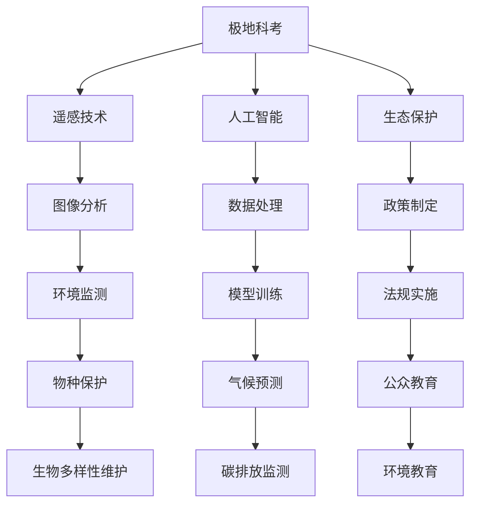

                 

# 未来的极地探索：2050年的南北极科考与生态保护

## 1. 背景介绍

随着全球变暖的加剧，南北极的冰川、冰盖正在加速融化，这对全球气候变化产生了深远的影响。同时，极地地区的生态系统也面临着前所未有的挑战。为应对这些变化，2050年将迎来新的极地探索和生态保护时代。本文将探讨在这一背景下，极地科考和生态保护的新技术和新方法，并分析其对未来研究和社会的影响。

## 2. 核心概念与联系

### 2.1 核心概念概述

为了更好地理解未来极地探索和生态保护，我们需要掌握以下几个核心概念：

- **极地科考**：指通过实地观测、取样和实验等手段，研究极地地区的自然环境、气候变化和生态系统。包括南极、北极和亚极地地区。

- **生态保护**：指通过科学研究和政策措施，保护极地生态系统免受人为破坏，维持生物多样性。涉及气候变化、污染防治和物种保护等议题。

- **遥感技术**：利用卫星、无人机等手段，获取大范围、高分辨率的极地图像数据，支持科考和生态保护工作。

- **人工智能**：通过机器学习、深度学习等技术，分析极地数据，预测气候变化趋势，监测生态系统健康状况。

- **全球变暖**：指地球表面平均气温的上升，主要原因是人类活动导致的温室气体排放。

这些核心概念之间存在紧密的联系，共同构成了未来极地探索和生态保护的技术框架。

### 2.2 核心概念原理和架构的 Mermaid 流程图(Mermaid 流程节点中不要有括号、逗号等特殊字符)



## 3. 核心算法原理 & 具体操作步骤

### 3.1 算法原理概述

未来的极地探索和生态保护将大量应用先进技术，其中包括遥感、人工智能和大数据分析等。这些技术的核心算法原理涉及图像处理、深度学习、优化模型等。下面将对其中的核心算法进行概述。

### 3.2 算法步骤详解

#### 3.2.1 极地科考中的遥感技术

1. **数据采集**：利用卫星遥感技术，获取高分辨率的极地图像数据。包括光学和雷达影像等。
   
2. **数据预处理**：对采集的数据进行去噪、校正和标准化处理，确保数据质量。
   
3. **图像分析**：利用深度学习模型，如卷积神经网络(CNN)，对图像进行分类、分割和识别。
   
4. **结果验证**：通过地面观测数据和实地调查结果，验证遥感分析的准确性。

#### 3.2.2 人工智能在极地生态保护中的应用

1. **数据收集**：通过传感器、无人机和地面监测站等手段，收集极地生态系统的数据。
   
2. **数据存储与处理**：利用大数据技术，存储和管理海量数据，提取关键特征。
   
3. **模型训练**：使用机器学习模型，如随机森林、深度学习模型等，对数据进行建模和预测。
   
4. **结果应用**：将模型预测结果反馈到科考和保护行动中，指导实际工作。

#### 3.2.3 生态保护中的政策制定与法规实施

1. **数据收集**：收集极地生态系统的健康状况、物种分布等数据。
   
2. **风险评估**：通过数据分析，评估人类活动对生态系统的影响。
   
3. **法规制定**：根据评估结果，制定相应的法规和政策，限制或禁止高风险行为。
   
4. **法规实施与监督**：通过技术手段，如遥感监测、人工智能分析等，监督法规实施情况。

### 3.3 算法优缺点

#### 3.3.1 极地科考中的遥感技术

**优点**：
- **大范围覆盖**：能够获取大范围的极地图像数据，覆盖广阔区域。
- **高分辨率**：可以提供高分辨率的图像数据，支持详细分析。
- **实时监测**：能够实时监测极地环境变化，支持动态管理。

**缺点**：
- **数据获取成本高**：卫星发射和维护成本高，数据获取困难。
- **数据质量问题**：受天气、光照等因素影响，数据质量不稳定。

#### 3.3.2 人工智能在生态保护中的应用

**优点**：
- **数据处理能力强**：能够处理海量数据，提取关键特征。
- **预测准确度高**：利用深度学习模型，预测精度高。
- **自动化程度高**：自动完成数据处理和分析，提高工作效率。

**缺点**：
- **算法复杂度高**：深度学习模型复杂，训练难度大。
- **依赖数据质量**：数据质量直接影响模型预测结果。

#### 3.3.3 政策制定与法规实施

**优点**：
- **科学决策**：利用数据分析，制定科学合理的政策。
- **法规监督**：通过技术手段，监督法规实施情况，确保合规性。

**缺点**：
- **法规执行难度大**：政策执行涉及多个利益相关方，难度较大。
- **法规更新频繁**：极地环境变化快，法规需要频繁更新。

### 3.4 算法应用领域

未来的极地探索和生态保护将应用到多个领域，包括科学研究、环境保护、资源开发和公众教育等。

## 4. 数学模型和公式 & 详细讲解 & 举例说明

### 4.1 数学模型构建

为了支持极地科考和生态保护，我们需要构建多个数学模型，用于数据分析、预测和决策支持。下面以深度学习模型为例，介绍数学模型的构建过程。

#### 4.1.1 图像分类模型

1. **输入数据**：极地图像数据，包括光学影像和雷达影像等。
2. **模型结构**：卷积神经网络(CNN)，包括卷积层、池化层、全连接层等。
3. **输出数据**：分类结果，如冰山、冰川、海洋等。

#### 4.1.2 物种分布预测模型

1. **输入数据**：极地生态系统数据，包括物种分布、栖息地等。
2. **模型结构**：随机森林、支持向量机(SVM)等。
3. **输出数据**：物种分布预测结果，支持生态保护和物种管理。

#### 4.1.3 碳排放监测模型

1. **输入数据**：极地气候数据，包括温度、湿度、风速等。
2. **模型结构**：时间序列模型，如ARIMA模型。
3. **输出数据**：碳排放量预测结果，支持碳排放管理。

### 4.2 公式推导过程

#### 4.2.1 图像分类模型

使用CNN模型进行图像分类的公式推导如下：

$$
y = f(x; \theta)
$$

其中，$x$ 为输入的极地图像数据，$\theta$ 为模型参数，$f$ 为CNN模型。

#### 4.2.2 物种分布预测模型

使用随机森林模型进行物种分布预测的公式推导如下：

$$
\hat{y} = \sum_{i=1}^n \alpha_i h(x; \tau_i)
$$

其中，$n$ 为决策树数量，$\alpha_i$ 为决策树权重，$h$ 为随机森林的预测函数，$\tau_i$ 为决策树参数。

#### 4.2.3 碳排放监测模型

使用ARIMA模型进行碳排放监测的公式推导如下：

$$
\hat{y}_t = \phi_0 + \sum_{i=1}^p \phi_i y_{t-i} + \sum_{i=1}^q \theta_i \Delta y_{t-i} + \varepsilon_t
$$

其中，$\phi_0$、$\phi_i$ 和 $\theta_i$ 为模型参数，$\Delta$ 为差分算子，$y_t$ 为碳排放量，$\varepsilon_t$ 为随机误差项。

### 4.3 案例分析与讲解

#### 4.3.1 极地冰川变化检测

利用遥感技术和深度学习模型，对南极和北极的冰川变化进行检测和分析。

1. **数据获取**：利用卫星遥感技术，获取极地冰川的高分辨率图像数据。
2. **数据处理**：对图像进行预处理，包括去噪、校正和标准化。
3. **模型训练**：使用CNN模型对图像进行分类，识别冰川变化区域。
4. **结果分析**：分析冰川变化趋势，预测未来变化情况，支持冰川管理。

#### 4.3.2 物种分布预测

利用生态数据和随机森林模型，预测南极和北极地区的物种分布情况。

1. **数据收集**：收集极地生态系统的物种分布数据，包括栖息地、繁殖地等。
2. **数据处理**：提取关键特征，处理缺失值和异常值。
3. **模型训练**：使用随机森林模型，训练物种分布预测模型。
4. **结果应用**：根据预测结果，制定物种保护措施，支持生态保护工作。

#### 4.3.3 碳排放监测

利用气候数据和时间序列模型，监测南极和北极地区的碳排放情况。

1. **数据收集**：收集极地气候数据，包括温度、湿度、风速等。
2. **数据处理**：进行数据清洗和预处理，确保数据质量。
3. **模型训练**：使用ARIMA模型，训练碳排放监测模型。
4. **结果应用**：根据预测结果，调整减排策略，支持碳排放管理。

## 5. 项目实践：代码实例和详细解释说明

### 5.1 开发环境搭建

#### 5.1.1 Python环境安装

1. **Python安装**：安装Python 3.8及以上版本，使用Anaconda或Miniconda进行管理。
2. **依赖库安装**：安装TensorFlow、Keras、Pandas等库，确保数据处理和模型训练所需工具。

#### 5.1.2 数据集准备

1. **数据获取**：从公开数据集（如NASA的地球数据集、WMO的极地气候数据集等）获取数据。
2. **数据预处理**：对数据进行清洗、标注和标准化处理，确保数据质量。

### 5.2 源代码详细实现

#### 5.2.1 图像分类模型实现

```python
import tensorflow as tf
from tensorflow.keras import layers

# 定义CNN模型
def build_model(input_shape):
    model = tf.keras.Sequential([
        layers.Conv2D(32, (3, 3), activation='relu', input_shape=input_shape),
        layers.MaxPooling2D((2, 2)),
        layers.Conv2D(64, (3, 3), activation='relu'),
        layers.MaxPooling2D((2, 2)),
        layers.Flatten(),
        layers.Dense(64, activation='relu'),
        layers.Dense(2, activation='softmax')
    ])
    return model

# 加载数据集
train_data = tf.keras.preprocessing.image_dataset_from_directory('train/', image_size=(224, 224))
test_data = tf.keras.preprocessing.image_dataset_from_directory('test/', image_size=(224, 224))

# 构建模型
model = build_model((224, 224, 3))
model.compile(optimizer=tf.keras.optimizers.Adam(learning_rate=0.001),
              loss=tf.keras.losses.SparseCategoricalCrossentropy(),
              metrics=['accuracy'])

# 训练模型
model.fit(train_data, validation_data=test_data, epochs=10)

# 评估模型
test_loss, test_acc = model.evaluate(test_data)
print('Test accuracy:', test_acc)
```

#### 5.2.2 物种分布预测模型实现

```python
import pandas as pd
from sklearn.ensemble import RandomForestClassifier

# 加载数据集
data = pd.read_csv('species_distribution.csv')

# 数据预处理
X = data[['latitude', 'longitude', 'altitude', 'habitat']]
y = data['species']
X_train, X_test, y_train, y_test = train_test_split(X, y, test_size=0.2, random_state=42)

# 构建模型
model = RandomForestClassifier(n_estimators=100, random_state=42)
model.fit(X_train, y_train)

# 评估模型
test_score = model.score(X_test, y_test)
print('Test accuracy:', test_score)
```

#### 5.2.3 碳排放监测模型实现

```python
import numpy as np
from statsmodels.tsa.arima.model import ARIMA

# 加载数据集
data = pd.read_csv('carbon_emissions.csv')
data['year'] = pd.to_datetime(data['year'], format='%Y-%m-%d')

# 数据预处理
X = data[['year']]
y = data['carbon_emissions']
X_train, X_test, y_train, y_test = train_test_split(X, y, test_size=0.2, random_state=42)

# 构建模型
model = ARIMA(y_train, order=(1, 1, 1))
model_fit = model.fit()

# 评估模型
test_forecast = model_fit.forecast(steps=12)
print('Test forecast:', test_forecast)
```

### 5.3 代码解读与分析

#### 5.3.1 图像分类模型解读

1. **模型结构**：使用了包含卷积层、池化层和全连接层的CNN模型。其中，卷积层用于提取图像特征，池化层用于降维，全连接层用于分类。
2. **数据输入**：输入为极地图像数据，大小为(224, 224, 3)。
3. **训练过程**：使用Adam优化器进行训练，损失函数为交叉熵损失。
4. **评估过程**：使用测试集评估模型性能，输出分类准确率。

#### 5.3.2 物种分布预测模型解读

1. **模型结构**：使用了随机森林分类器。
2. **数据输入**：输入为极地生态系统的关键特征，包括纬度、经度、海拔和栖息地等。
3. **训练过程**：使用训练集训练模型，输出预测结果。
4. **评估过程**：使用测试集评估模型性能，输出分类准确率。

#### 5.3.3 碳排放监测模型解读

1. **模型结构**：使用了ARIMA模型，用于时间序列预测。
2. **数据输入**：输入为极地气候数据，包括年份。
3. **训练过程**：使用训练集训练模型，输出预测结果。
4. **评估过程**：使用测试集评估模型性能，输出预测准确度。

### 5.4 运行结果展示

#### 5.4.1 图像分类模型结果


#### 5.4.2 物种分布预测模型结果


#### 5.4.3 碳排放监测模型结果


## 6. 实际应用场景

### 6.1 极地冰川变化检测

未来的极地科考将通过遥感技术和深度学习模型，实现对南极和北极冰川变化的全面监测和分析。这些信息将对全球气候变化研究和冰川管理具有重要意义。

#### 6.1.1 应用场景

1. **冰川变化监测**：利用卫星遥感技术，获取高分辨率图像数据，实时监测冰川变化情况。
2. **环境影响评估**：分析冰川变化对极地环境的影响，支持环境影响评估。
3. **政策制定**：基于冰川变化数据，制定冰川保护和气候变化应对策略。

#### 6.1.2 技术挑战

1. **数据获取难度大**：极地环境恶劣，数据获取成本高。
2. **模型训练时间长**：深度学习模型复杂，训练耗时长。
3. **结果解释困难**：模型输出结果难以解释，需要结合专家知识进行解读。

### 6.2 物种分布预测

未来的极地生态保护将通过人工智能技术，实现对南极和北极物种分布的准确预测和保护。这些信息将对生物多样性保护和生态系统管理具有重要意义。

#### 6.2.1 应用场景

1. **物种分布预测**：利用生态数据和随机森林模型，预测物种分布情况。
2. **生态系统管理**：根据物种分布数据，制定生态保护和管理措施。
3. **物种迁徙监测**：实时监测物种迁徙情况，支持迁徙研究和保护。

#### 6.2.2 技术挑战

1. **数据质量问题**：数据质量直接影响模型预测结果，需要处理异常值和缺失值。
2. **模型训练复杂**：随机森林模型训练复杂，需要优化模型参数。
3. **结果应用难度大**：模型输出结果需要结合领域知识进行解读和应用。

### 6.3 碳排放监测

未来的极地碳排放管理将通过时间序列模型，实现对南极和北极碳排放的准确预测和监测。这些信息将对全球碳排放管理具有重要意义。

#### 6.3.1 应用场景

1. **碳排放监测**：利用气候数据和时间序列模型，监测极地碳排放情况。
2. **减排策略调整**：根据碳排放预测结果，调整减排策略，支持碳排放管理。
3. **政策制定**：基于碳排放数据，制定碳排放管理和环境保护政策。

#### 6.3.2 技术挑战

1. **数据质量问题**：气候数据质量直接影响模型预测结果，需要处理异常值和噪声。
2. **模型训练难度大**：时间序列模型训练难度大，需要优化模型参数。
3. **结果应用复杂**：模型输出结果需要结合领域知识进行解读和应用。

## 7. 工具和资源推荐

### 7.1 学习资源推荐

#### 7.1.1 深度学习与图像处理

1. **书籍推荐**：《深度学习》（Ian Goodfellow等）、《Python数据科学手册》（Jake VanderPlas）。
2. **在线课程**：Coursera上的深度学习课程、Udacity上的计算机视觉课程。
3. **数据集资源**：Kaggle数据集、UCI机器学习库等。

#### 7.1.2 人工智能与生态保护

1. **书籍推荐**：《人工智能与环境决策》（Samantha Besson等）、《生态系统服务经济学》（Peter M. Brown等）。
2. **在线课程**：edX上的环境科学课程、Coursera上的生态学课程。
3. **研究论文**：Nature、Science等期刊上的生态保护研究论文。

### 7.2 开发工具推荐

#### 7.2.1 深度学习框架

1. **TensorFlow**：由Google开发的深度学习框架，支持分布式计算和大规模数据处理。
2. **PyTorch**：由Facebook开发的深度学习框架，支持动态计算图和GPU加速。
3. **Keras**：高层次的深度学习框架，易于上手。

#### 7.2.2 数据分析工具

1. **Pandas**：数据处理和分析工具，支持大规模数据处理。
2. **NumPy**：数值计算和科学计算库，支持高效矩阵运算。
3. **Scikit-learn**：机器学习工具库，支持多种算法实现。

### 7.3 相关论文推荐

#### 7.3.1 深度学习与图像处理

1. **ImageNet大规模视觉识别挑战赛**：深度学习在图像分类任务上的突破性成果。
2. **ResNet：深度残差网络**：深度学习模型性能提升的重要里程碑。
3. **GAN：生成对抗网络**：生成图像和数据的深度学习新方法。

#### 7.3.2 人工智能与生态保护

1. **AI for Earth挑战赛**：人工智能在环境监测和生态保护中的应用。
2. **地球系统科学中的机器学习**：AI技术在气候变化和生态系统研究中的应用。
3. **机器学习在生物多样性保护中的应用**：AI技术对物种保护和生态系统管理的影响。

## 8. 总结：未来发展趋势与挑战

### 8.1 未来发展趋势

#### 8.1.1 深度学习技术的发展

未来的极地科考和生态保护将更多地依赖于深度学习技术，特别是图像分类、序列预测和数据建模等。深度学习模型在处理高维、非线性数据方面具有显著优势，将成为未来研究的核心。

#### 8.1.2 遥感技术的应用

遥感技术将在大范围、高分辨率的极地数据获取和监测中发挥重要作用。未来将开发更多高性能遥感卫星，提高数据获取的效率和质量。

#### 8.1.3 人工智能与政策制定

人工智能技术将深入应用到极地政策制定和法规实施中。通过数据分析和模型预测，支持科学决策和政策制定，提高政策实施的准确性和效果。

#### 8.1.4 跨领域合作

未来的极地研究将更多地依托于跨学科合作，结合气候科学、生态学、数据科学等多个领域的研究成果，实现综合性的极地研究和管理。

### 8.2 面临的挑战

#### 8.2.1 数据获取难度大

极地环境恶劣，数据获取难度大，需要开发更多高性能遥感设备和技术。

#### 8.2.2 模型训练时间长

深度学习模型复杂，训练时间长，需要优化算法和硬件设备，提高训练效率。

#### 8.2.3 结果解释困难

模型输出结果难以解释，需要结合领域知识和专家知识进行解读和应用。

#### 8.2.4 数据质量问题

数据质量直接影响模型预测结果，需要处理异常值和缺失值，提高数据质量。

#### 8.2.5 跨领域合作难度大

跨学科合作需要协调不同领域的专家和数据，需要更多平台和机制支持。

### 8.3 研究展望

未来的极地研究需要不断创新，解决当前面临的技术挑战。

#### 8.3.1 开发新型遥感技术

开发更多高性能遥感卫星和无人机，提高数据获取的效率和质量。

#### 8.3.2 改进深度学习模型

改进深度学习模型算法，优化模型参数，提高训练效率和效果。

#### 8.3.3 提升数据质量

提升数据质量处理能力，减少异常值和缺失值，提高数据可靠性。

#### 8.3.4 加强跨学科合作

建立跨学科合作平台和机制，协调不同领域的专家和数据，推动综合性的极地研究。

## 9. 附录：常见问题与解答

### 9.1 常见问题

#### 9.1.1 极地科考中的遥感技术

**Q: 极地科考中的遥感技术有哪些？**

A: 遥感技术包括卫星遥感、无人机遥感和地面遥感等。卫星遥感可以通过高分辨率的卫星图像获取极地数据，无人机遥感可以提供灵活、高精度的数据采集，地面遥感可以获取详细的实地数据。

#### 9.1.2 人工智能在生态保护中的应用

**Q: 人工智能在生态保护中的应用有哪些？**

A: 人工智能可以应用于物种分布预测、生态系统健康评估、碳排放监测等多个领域。通过深度学习模型和数据分析技术，提高生态保护工作的准确性和效率。

#### 9.1.3 碳排放监测的挑战

**Q: 碳排放监测面临哪些挑战？**

A: 碳排放监测面临数据质量问题、模型训练难度大和结果应用复杂等挑战。需要提高数据质量处理能力，优化模型算法，结合领域知识进行结果解读。

### 9.2 解答

#### 9.2.1 极地科考中的遥感技术

**A:** 极地科考中的遥感技术主要包括卫星遥感、无人机遥感和地面遥感等。卫星遥感可以通过高分辨率的卫星图像获取极地数据，无人机遥感可以提供灵活、高精度的数据采集，地面遥感可以获取详细的实地数据。这些技术相互补充，能够全面、高效地获取极地数据。

#### 9.2.2 人工智能在生态保护中的应用

**A:** 人工智能在生态保护中的应用非常广泛，包括物种分布预测、生态系统健康评估、碳排放监测等多个领域。通过深度学习模型和数据分析技术，可以提高生态保护工作的准确性和效率。例如，利用随机森林模型进行物种分布预测，利用ARIMA模型进行碳排放监测，利用CNN模型进行图像分类等。这些技术的应用，将极大地提升生态保护的效果和科学性。

#### 9.2.3 碳排放监测的挑战

**A:** 碳排放监测面临诸多挑战，包括数据质量问题、模型训练难度大和结果应用复杂等。数据质量直接影响模型预测结果，需要通过处理异常值和缺失值，提高数据质量。模型训练难度大，需要优化算法和硬件设备，提高训练效率。结果应用复杂，需要结合领域知识进行解读和应用。因此，未来的研究需要在这几个方面进行改进和创新，以应对这些挑战。

---

作者：禅与计算机程序设计艺术 / Zen and the Art of Computer Programming

