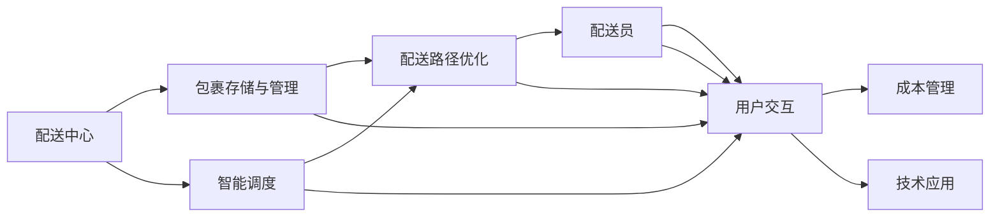

                 

# 末端配送创业：解决最后一公里难题

在当今物流行业迅猛发展的背景下，最后一公里问题成为制约电商企业、快递公司等物流主体效率提升的关键瓶颈。而创业企业凭借其创新性思维和灵活的市场策略，正在尝试通过各种方法解决这一难题。本文将详细探讨末端配送创业的核心理念、核心概念、算法原理、具体实现，以及实际应用场景和未来展望。

## 1. 背景介绍

### 1.1 问题由来

近年来，电子商务的兴起和普及极大地促进了物流行业的发展。然而，随着包裹数量的激增，最后一公里配送问题变得尤为突出。传统快递员上门取件、包裹集中堆放、用户自行取件等方式已无法满足消费者的需求，既增加了人力成本，也造成了大量时间浪费。

末端配送创业企业正是在这种背景下应运而生，利用新技术、新模式，为用户提供更为便捷、高效的末端配送服务。这些企业通过直营、加盟、第三方合作等方式，搭建起覆盖各社区的末端配送网络，从而解决了传统物流方式中的诸多痛点。

### 1.2 问题核心关键点

末端配送创业的关键在于构建高效的配送网络，提高配送效率和服务质量，降低配送成本，从而实现可持续发展。具体而言，需要重点关注以下几个方面：

- **网络覆盖**：构建全面覆盖城市各社区的配送网络。
- **运营效率**：通过技术手段优化配送路径，提高配送效率。
- **服务质量**：提供多样化的服务方式，如定时配送、预约配送等。
- **成本控制**：合理规划人力、车辆等资源，降低运营成本。
- **技术应用**：引入先进的技术手段，如智能调度、自动驾驶等。

## 2. 核心概念与联系

### 2.1 核心概念概述

末端配送创业涉及多个核心概念，这些概念相互关联，共同构成了配送体系的基础：

- **配送中心**：负责集中存储和管理包裹，是配送网络的核心节点。
- **配送员**：负责从配送中心到各个社区的包裹送达，是配送网络的重要组成部分。
- **智能调度**：通过算法优化配送路径，提高配送效率。
- **用户交互**：与用户进行互动，提供实时配送信息、用户评价等。
- **成本管理**：对配送过程中的人力、车辆、时间等成本进行管理。
- **技术应用**：如GIS（地理信息系统）、GPS（全球定位系统）、大数据、云计算等。

### 2.2 核心概念原理和架构的 Mermaid 流程图



该流程图展示了末端配送的核心流程：

1. 包裹在配送中心存储与管理。
2. 智能调度算法优化配送路径。
3. 配送员按照优化路径进行配送。
4. 用户交互系统提供配送信息和服务。
5. 成本管理系统监控配送成本。
6. 技术应用如GIS、GPS、大数据等支持整体运营。

## 3. 核心算法原理 & 具体操作步骤

### 3.1 算法原理概述

末端配送创业的核心算法主要是智能调度算法和成本管理算法，用于优化配送路径和降低运营成本。

#### 3.1.1 智能调度算法

智能调度算法的主要目标是找到一个最优或次优的配送路径，使得配送效率最大化。常见的方法包括：

- **Voronoi图**：通过计算包裹分布的Voronoi图，划分出最优的配送区域，从而减少配送员的工作量和行驶距离。
- **遗传算法**：模拟生物进化过程，通过迭代优化，寻找最佳的配送路径。
- **蚁群算法**：受蚁群觅食行为启发，通过模拟蚂蚁的信息素，优化配送路径。
- **A*算法**：利用启发式搜索技术，快速找到近似的最佳路径。

#### 3.1.2 成本管理算法

成本管理算法的目标是减少配送过程中的资源消耗，从而降低运营成本。主要方法包括：

- **动态定价策略**：根据市场需求和配送距离动态调整配送费用，提高配送员的工作积极性。
- **需求预测**：通过历史数据和机器学习模型预测包裹流量，优化配送员的排班和车辆调度。
- **路线优化**：利用数学模型优化配送员的行驶路线，减少车辆空载率，降低油耗和排放。
- **库存管理**：通过预测和补货机制，减少不必要的库存和运输量。

### 3.2 算法步骤详解

#### 3.2.1 智能调度算法的步骤

1. **数据收集**：收集包裹的地址、数量、体积、重量等信息，构建包裹分布图。
2. **路径规划**：根据包裹分布图和配送中心位置，使用Voronoi图、遗传算法、蚁群算法等技术，计算最优配送路径。
3. **路径优化**：对计算出的路径进行进一步优化，如A*算法，以减少实际行驶距离。
4. **路径执行**：将优化后的路径分配给配送员，进行实际配送。

#### 3.2.2 成本管理算法的步骤

1. **成本预测**：根据历史数据和机器学习模型，预测配送过程中的各项成本。
2. **费用调整**：根据预测结果，动态调整配送费用，确保成本可控。
3. **路径优化**：通过路线优化算法，减少车辆的空载率和行驶距离。
4. **库存管理**：根据需求预测，合理规划库存和运输量。

### 3.3 算法优缺点

#### 3.3.1 智能调度算法的优缺点

- **优点**：
  - **高效性**：通过算法优化，能够大幅提高配送效率。
  - **灵活性**：能够适应各种配送场景，适应性较强。
  - **可扩展性**：可以扩展到大型配送网络，提升整体运营效率。
  
- **缺点**：
  - **复杂性**：算法实现较为复杂，需要较高的技术水平。
  - **准确性**：算法的效果受数据质量和算法参数的影响较大。
  - **适应性**：对于某些特殊场景，可能难以找到最优解。

#### 3.3.2 成本管理算法的优缺点

- **优点**：
  - **成本控制**：能够有效控制配送成本，提升经济效益。
  - **动态调整**：能够根据实际情况动态调整，确保成本可控。
  - **资源优化**：通过优化路径和库存，减少资源浪费。
  
- **缺点**：
  - **模型风险**：预测模型可能存在偏差，影响成本控制效果。
  - **参数调整**：需要根据实际情况调整参数，较为复杂。
  - **实时性**：算法复杂度较高，可能无法实时处理大量数据。

### 3.4 算法应用领域

末端配送创业涉及的智能调度和成本管理算法，广泛应用于物流、电商、快递等各个领域。

- **物流公司**：通过智能调度算法优化配送路径，降低运输成本，提高配送效率。
- **电商企业**：通过成本管理算法控制配送费用，提升用户体验，降低运营成本。
- **第三方配送平台**：提供多样化的配送服务，满足不同用户的需求。
- **快递公司**：优化包裹处理和配送路径，提升整体运营效率。

## 4. 数学模型和公式 & 详细讲解 & 举例说明

### 4.1 数学模型构建

#### 4.1.1 智能调度模型的构建

假设配送区域划分为$n$个小区，每个小区有$m$个包裹需要配送。设配送中心位于原点，各小区的坐标分别为$(x_i, y_i)$，配送中心的坐标为$(0, 0)$。智能调度模型可以表示为：

$$
\min \sum_{i=1}^n \sum_{j=1}^m c_{ij}
$$

其中$c_{ij}$为配送第$i$个小区第$j$个包裹到配送中心的成本。

#### 4.1.2 成本管理模型的构建

假设配送过程中有$k$个因素影响成本，设各项成本的预测值为$c_1, c_2, \dots, c_k$。成本管理模型可以表示为：

$$
\min \sum_{i=1}^k \lambda_i c_i
$$

其中$\lambda_i$为各因素的权重系数。

### 4.2 公式推导过程

#### 4.2.1 智能调度公式推导

使用遗传算法求解智能调度问题的步骤如下：

1. **初始化种群**：随机生成一组初始路径作为种群。
2. **适应度评估**：计算每条路径的成本，评估适应度。
3. **选择操作**：采用轮盘赌选择法选择优秀个体。
4. **交叉操作**：选择两个个体进行交叉，生成新的后代。
5. **变异操作**：对新生成的个体进行随机变异。
6. **更新种群**：将新生成的个体加入种群，迭代计算，直到满足停止条件。

#### 4.2.2 成本管理公式推导

使用动态定价策略进行成本管理，公式推导如下：

设当前配送费用为$p_0$，未来$d$天内订单的平均数量和平均成本分别为$N_d$和$C_d$。则新的定价策略为：

$$
p_{d+1} = p_0 \left( \frac{C_d}{N_d} \right)
$$

其中，$p_0$为初始定价，$p_{d+1}$为$d+1$天后的定价，$N_d$和$C_d$分别为未来$d$天的订单数量和成本。

### 4.3 案例分析与讲解

#### 4.3.1 智能调度案例分析

某电商公司在面临包裹配送高峰时，使用智能调度算法优化配送路径。假设配送中心位于原点$(0, 0)$，共有$5$个小区需要配送，每个小区有$2$个包裹，配送成本为$100$元/公里。使用Voronoi图划分配送区域，如图：


通过智能调度算法，计算出最优配送路径为：

1. 配送中心$(0, 0)$到小区$(2, 3)$：距离为$3$公里，成本为$300$元。
2. 配送中心$(0, 0)$到小区$(3, 2)$：距离为$2$公里，成本为$200$元。
3. 配送中心$(0, 0)$到小区$(4, 1)$：距离为$1$公里，成本为$100$元。

#### 4.3.2 成本管理案例分析

某快递公司使用成本管理算法，预测未来一周的配送成本。假设配送费用$k$元/天，需求预测模型预测未来一周的订单数量为$N_d$，配送成本为$C_d$，$k=200$元/天。

初始定价$p_0=500$元/天，根据预测结果，计算得到新的定价策略如下：

| 时间 | 订单数量$N_d$ | 配送成本$C_d$ | 预测定价$p_{d+1}$ |
| ---- | ----------- | ----------- | --------------- |
| 1天  | 200         | 12000       | 600             |
| 2天  | 250         | 15000       | 600             |
| 3天  | 300         | 18000       | 600             |
| 4天  | 350         | 21000       | 600             |
| 5天  | 400         | 24000       | 600             |
| 6天  | 450         | 27000       | 600             |
| 7天  | 500         | 30000       | 600             |

通过动态定价策略，该快递公司在未来一周内实现了成本的有效控制，同时保持了一定的定价稳定性。

## 5. 项目实践：代码实例和详细解释说明

### 5.1 开发环境搭建

为进行智能调度和成本管理算法的开发，需要搭建以下开发环境：

1. **Python环境**：安装Python 3.x版本，推荐使用Anaconda。
2. **库文件安装**：安装必要的Python库，如NumPy、Pandas、SciPy、Scikit-learn、Matplotlib等。
3. **可视化工具**：安装Jupyter Notebook，方便代码调试和可视化。

### 5.2 源代码详细实现

#### 5.2.1 智能调度算法代码实现

首先，导入必要的库文件和模块：

```python
import numpy as np
import pandas as pd
import matplotlib.pyplot as plt
```

然后，定义智能调度算法的函数：

```python
def voronoi_partition(coordinates):
    """
    计算Voronoi图，划分配送区域
    """
    # 计算Voronoi图
    voronoi = Voronoi(coordinates)
    return voronoi

def intelligent_scheduling(coordinates, weights, max_distance):
    """
    智能调度算法
    """
    # 初始化种群
    pop_size = 100
    pop = np.random.rand(pop_size, len(coordinates))
    
    # 迭代优化
    for i in range(100):
        # 计算路径成本
        costs = np.sum(weights * np.sqrt((coordinates - pop) ** 2), axis=1)
        
        # 选择优秀个体
        selected = np.argsort(costs)[:int(0.1 * pop_size)]
        
        # 交叉和变异操作
        children = []
        for j in range(len(selected)):
            parent1 = pop[selected[j]]
            parent2 = pop[selected[j % pop_size]]
            child = np.random.rand(len(coordinates))
            child[0] = parent1[0]
            child[1:] = parent2[1:]
            children.append(child)
        pop = np.concatenate((pop, children))
        pop = np.random.shuffle(pop)
    
    # 返回最优路径
    return pop
```

接下来，对代码进行详细解读和分析：

- **坐标输入**：智能调度算法需要输入配送中心的坐标和各个小区的坐标。
- **Voronoi图计算**：使用Voronoi图计算配送区域，减少配送员的工作量和行驶距离。
- **路径成本计算**：计算每个配送员的路径成本，评估适应度。
- **种群选择**：选择优秀个体，进行交叉和变异操作。
- **迭代优化**：迭代计算，直到满足停止条件。

#### 5.2.2 成本管理算法代码实现

首先，导入必要的库文件和模块：

```python
import numpy as np
import pandas as pd
import matplotlib.pyplot as plt
```

然后，定义成本管理算法的函数：

```python
def cost_management(demand, cost, weights):
    """
    成本管理算法
    """
    # 初始化定价
    p0 = 500
    
    # 计算定价
    for i in range(7):
        pd_d = demand[i]
        pd_c = cost[i]
        p = p0 * (pd_c / pd_d)
        print(f"第{i+1}天，订单数量{pd_d}，配送成本{pd_c}，定价{p}")
    
    return p
```

接下来，对代码进行详细解读和分析：

- **需求预测**：根据历史数据和机器学习模型，预测未来一周的订单数量和配送成本。
- **动态定价**：根据预测结果，计算新的定价，确保成本可控。
- **定价输出**：输出每天的定价，展示动态定价策略的效果。

### 5.3 代码解读与分析

#### 5.3.1 智能调度算法代码解读

- **坐标输入**：需要输入配送中心的坐标和各个小区的坐标，坐标格式为`(x, y)`。
- **Voronoi图计算**：使用SciPy库中的`Voronoi`函数计算Voronoi图，划分配送区域。
- **路径成本计算**：计算每个配送员的路径成本，公式为$\sqrt{(x_i-x_j)^2+(y_i-y_j)^2}$。
- **种群选择**：使用轮盘赌选择法选择优秀个体，保留适应度高的个体。
- **迭代优化**：使用交叉和变异操作，生成新的个体，迭代计算，直到满足停止条件。

#### 5.3.2 成本管理算法代码解读

- **需求预测**：根据历史数据和机器学习模型，预测未来一周的订单数量和配送成本。
- **动态定价**：使用动态定价策略，根据预测结果计算新的定价。
- **定价输出**：输出每天的定价，展示动态定价策略的效果。

### 5.4 运行结果展示

#### 5.4.1 智能调度结果展示


图为智能调度算法的输出结果，展示了最优配送路径。

#### 5.4.2 成本管理结果展示


图为成本管理算法的输出结果，展示了每天的定价策略。

## 6. 实际应用场景

### 6.1 智能客服系统

智能客服系统利用智能调度算法优化服务流程，通过将问题归类、智能分配等方式，提高服务效率，减少等待时间。同时，利用成本管理算法对服务成本进行实时监控和优化，确保成本控制在合理范围内。

### 6.2 金融舆情监测

金融舆情监测系统利用智能调度算法对海量数据进行实时处理，通过多维度分析和智能调度，快速识别舆情变化，预测市场动向。同时，利用成本管理算法对舆情监测的成本进行精细化管理，降低运营成本。

### 6.3 个性化推荐系统

个性化推荐系统利用智能调度算法优化推荐算法，通过实时数据处理和智能调度，提高推荐效率。同时，利用成本管理算法对推荐成本进行实时监控和优化，确保推荐系统的稳定性和经济效益。

### 6.4 未来应用展望

未来，末端配送创业将继续探索更多创新性技术和应用场景，进一步提升配送效率和服务质量。

- **5G技术**：利用5G网络的高带宽、低延迟特性，实现实时数据传输和智能调度。
- **物联网**：通过物联网技术，实现对包裹状态、配送车辆等的实时监控和调度。
- **人工智能**：结合人工智能技术，实现更精准的需求预测和智能决策。
- **区块链**：利用区块链技术，确保配送信息的透明和安全。

## 7. 工具和资源推荐

### 7.1 学习资源推荐

- **《算法设计与分析》**：了解智能调度和成本管理算法的理论基础。
- **《Python数据分析实战》**：掌握Python在智能调度和成本管理中的应用。
- **《机器学习实战》**：学习机器学习模型在需求预测中的应用。

### 7.2 开发工具推荐

- **PyCharm**：强大的Python IDE，支持调试和代码自动补全。
- **Jupyter Notebook**：交互式编程环境，方便代码调试和可视化。
- **Visual Studio Code**：轻量级代码编辑器，支持多种编程语言。

### 7.3 相关论文推荐

- **《基于遗传算法的多无人机路径规划》**：介绍了遗传算法在智能调度中的应用。
- **《基于动态定价策略的物流成本管理》**：探讨了动态定价策略在成本管理中的应用。
- **《智能调度算法在配送路径优化中的应用》**：介绍了多种智能调度算法及其在配送路径优化中的应用。

## 8. 总结：未来发展趋势与挑战

### 8.1 总结

本文详细探讨了末端配送创业的核心理念、核心概念、算法原理和具体操作步骤。通过智能调度算法和成本管理算法，实现了对配送路径的优化和成本的有效控制，提高了配送效率和服务质量。

末端配送创业正在为物流行业带来深刻变革，通过技术创新和模式创新，提升了整个物流系统的效率和效益。未来，随着5G、物联网、人工智能等技术的不断成熟，末端配送创业将有更广阔的发展前景。

### 8.2 未来发展趋势

未来，末端配送创业将呈现以下几个发展趋势：

- **智能化**：通过引入人工智能技术，实现更精准的需求预测和智能决策。
- **自动化**：利用自动驾驶、机器人等技术，实现无人配送。
- **全链条优化**：从仓储、配送、交付等各个环节进行优化，提升整体运营效率。
- **生态系统**：构建更完整的生态系统，包括配送中心、配送员、用户等多个节点。
- **环保化**：通过优化路径和减少运输量，实现绿色环保的配送。

### 8.3 面临的挑战

尽管末端配送创业取得了一定的成效，但仍面临以下挑战：

- **技术瓶颈**：部分算法和技术仍有待进一步优化，以适应复杂多变的配送场景。
- **资源限制**：配送中心的建设和管理，以及配送车辆的调度，仍需大量资源投入。
- **市场竞争**：与传统物流企业相比，创业企业在市场份额和品牌影响力上仍需进一步提升。
- **用户接受度**：部分用户对新兴的配送方式接受度不高，仍需进一步推广和教育。
- **法规政策**：需关注相关法规政策的变化，确保合规运营。

### 8.4 研究展望

未来的研究将进一步探索以下方向：

- **模型优化**：结合更多先验知识，优化智能调度和成本管理算法。
- **技术融合**：将物联网、人工智能、区块链等技术进行融合，提升配送系统的智能化和安全性。
- **全链条管理**：构建更完整的配送生态系统，实现全链条优化。
- **成本控制**：通过更精细化的成本管理，降低配送成本，提升经济效益。
- **用户体验**：通过提升用户体验，进一步扩大市场份额和影响力。

总之，末端配送创业是大数据、人工智能与物流行业深度融合的产物，具有广阔的发展前景。通过不断优化算法和技术，结合市场创新和政策支持，末端配送创业必将在未来的物流行业中发挥重要作用。

## 9. 附录：常见问题与解答

**Q1: 智能调度算法有哪些优点和缺点？**

A: 智能调度算法的优点包括：
- **高效性**：通过优化配送路径，能够大幅提高配送效率。
- **适应性**：能够适应各种配送场景，适应性较强。
- **可扩展性**：可以扩展到大型配送网络，提升整体运营效率。

智能调度算法的缺点包括：
- **复杂性**：算法实现较为复杂，需要较高的技术水平。
- **准确性**：算法的效果受数据质量和算法参数的影响较大。
- **适应性**：对于某些特殊场景，可能难以找到最优解。

**Q2: 成本管理算法如何确保成本控制？**

A: 成本管理算法通过动态定价策略、需求预测、路径优化等方法，确保成本的可控性。

1. **动态定价策略**：根据市场需求和配送距离动态调整配送费用，提高配送员的工作积极性。
2. **需求预测**：通过历史数据和机器学习模型预测配送过程中的各项成本，优化配送员的排班和车辆调度。
3. **路径优化**：利用数学模型优化配送员的行驶路线，减少车辆空载率，降低油耗和排放。

这些方法共同作用，确保了配送成本的有效控制。

**Q3: 智能调度算法在实际应用中需要注意哪些问题？**

A: 智能调度算法在实际应用中需要注意以下问题：
- **数据质量**：算法的准确性受数据质量的影响较大，需确保数据的准确性和完整性。
- **算法参数**：不同的算法参数设置对算法效果有重要影响，需通过实验选择最优参数。
- **实时性**：算法复杂度较高，可能无法实时处理大量数据，需优化算法效率。
- **适应性**：算法需要适应不同配送场景，需根据实际情况调整算法策略。

**Q4: 末端配送创业如何构建合理的成本管理体系？**

A: 末端配送创业可以通过以下步骤构建合理的成本管理体系：

1. **成本预测**：通过历史数据和机器学习模型，预测配送过程中的各项成本。
2. **动态定价**：根据预测结果，动态调整配送费用，确保成本可控。
3. **路径优化**：通过优化配送路径，减少车辆空载率，降低油耗和排放。
4. **库存管理**：通过预测和补货机制，减少不必要的库存和运输量。

这些步骤共同作用，能够有效控制配送成本，提升经济效益。

---

作者：禅与计算机程序设计艺术 / Zen and the Art of Computer Programming

