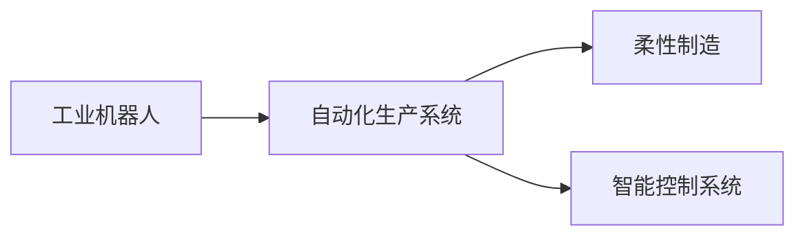

                 

# 机器人创业：自动化生产的未来蓝图

在当今数字化时代，自动化生产已经成为制造业的重要趋势。随着机器人技术的发展，企业可以通过自动化生产线大幅提升生产效率和产品质量，实现成本节约和市场竞争力的提升。本文将全面探讨机器人创业的各项关键技术，为想要涉足这一领域的创业者提供一份详尽的指导手册。

## 1. 背景介绍

### 1.1 问题由来
随着工业4.0时代的到来，全球制造业正在经历从传统的“劳动密集型”向“智能制造”的转变。传统工厂依靠大量人工操作，不仅效率低下，而且容易受到员工技能和情绪波动的影响。而机器人技术的应用，尤其是工业机器人，能够24小时不间断工作，具有精度高、稳定性好、可编程性强等优点，正在成为自动化生产的主要驱动力。

### 1.2 问题核心关键点
机器人创业的核心在于如何构建高效、可靠的自动化生产系统。这包括选择合适的机器人硬件平台，设计合理的生产工艺流程，以及构建智能控制系统，以实现生产线的自动化、柔性化和智能化。此外，企业还需要考虑机器人与员工共存、安全保障、设备维护等方面问题。

### 1.3 问题研究意义
机器人创业有助于企业降低生产成本，提高产品质量和产量，同时推动制造业向智能化、绿色化方向发展。对于创业者而言，掌握机器人技术，不仅可以带来丰厚的商业回报，还能为推动行业技术进步贡献力量。

## 2. 核心概念与联系

### 2.1 核心概念概述

为更好地理解机器人创业的关键技术，本节将介绍几个关键概念：

- **工业机器人**：指的是在工业生产中，用于自动化执行各种任务的机器人。工业机器人的应用广泛，包括焊接、装配、搬运、喷涂等。
- **自动化生产系统**：通过工业机器人、自动导引车(AGV)、智能仓储等技术，实现从原材料到成品的全自动化生产流程。
- **柔性制造**：指生产系统能够快速适应多品种、小批量生产需求，通过柔性制造单元、可重构生产线等技术实现。
- **智能控制系统**：集成物联网、人工智能、大数据等技术，实现生产线的实时监控、调度、优化和预测。

这些概念之间具有紧密的联系，共同构成了机器人创业的技术框架。

### 2.2 核心概念原理和架构的 Mermaid 流程图(Mermaid 流程节点中不要有括号、逗号等特殊字符)



以上图表展示了一个典型的工业机器人生产系统架构：工业机器人作为自动化生产的主体，与柔性制造单元、智能控制系统等共同构建起自动化生产线，实现高效、灵活的生产能力。

## 3. 核心算法原理 & 具体操作步骤
### 3.1 算法原理概述

机器人创业的核心算法主要集中在自动化路径规划、机器人控制、过程监控和故障诊断等方面。这些算法需要结合实际生产需求和机器人硬件特性进行设计和优化。

### 3.2 算法步骤详解

以下将以工业机器人在汽车制造生产线上的应用为例，详细讲解自动化路径规划和机器人控制的具体步骤。

**Step 1: 数据采集和建模**
- 使用传感器、摄像头等设备采集生产线的实时数据。
- 对采集数据进行预处理和建模，建立生产线的数学模型。

**Step 2: 路径规划**
- 根据生产线的需求，设计机器人的运动路径。
- 使用A*、D*等路径规划算法，生成最优路径。
- 考虑障碍物、安全距离等因素，进行路径避障优化。

**Step 3: 机器人控制**
- 通过运动控制器，根据路径规划结果控制机器人运动。
- 使用PID控制器等，实现机器人定位和轨迹跟随。
- 集成视觉定位、力觉反馈等技术，提升机器人控制精度和稳定性。

**Step 4: 过程监控和故障诊断**
- 使用传感器和监控设备，实时采集生产线数据。
- 应用异常检测算法，监控生产线的异常情况。
- 对异常数据进行分析，进行故障诊断和处理。

### 3.3 算法优缺点

自动化路径规划和机器人控制算法的优点在于：

- 精度高：通过精确的数学建模和路径规划，能够实现高精度的运动控制。
- 灵活性强：可以根据生产需求动态调整路径和运动参数，实现柔性制造。
- 安全性好：通过实时监控和故障诊断，及时发现并处理异常情况，保障生产安全。

缺点在于：

- 计算复杂：特别是在大规模生产系统中，路径规划和控制算法计算量较大。
- 对硬件要求高：需要高性能的计算平台和精确的运动控制器。
- 开发周期长：算法设计和优化需要结合实际生产场景，调试周期较长。

### 3.4 算法应用领域

自动化路径规划和机器人控制算法在以下领域有广泛应用：

- 汽车制造：机器人进行汽车焊接、装配、涂装等操作。
- 电子制造：机器人进行PCB组装、电路检测等操作。
- 食品加工：机器人进行食品搬运、包装等操作。
- 制药制造：机器人进行药品灌装、包装等操作。

## 4. 数学模型和公式 & 详细讲解 & 举例说明

### 4.1 数学模型构建

以机器人路径规划为例，我们可以建立如下数学模型：

设机器人在平面上的位置为 $(x,y)$，路径起点为 $(x_0,y_0)$，终点为 $(x_f,y_f)$，障碍物集合为 $\Omega$，机器人可以避开的障碍物半径为 $r$。目标是最小化路径长度 $L$，同时满足避障条件：

$$
\begin{aligned}
&\min L = \sqrt{(x-x_0)^2+(y-y_0)^2} + \sqrt{(x_f-x)^2+(y_f-y)^2} \\
&\text{s.t. } (x-x_i)^2+(y-y_i)^2 > r^2, \forall (x_i,y_i) \in \Omega
\end{aligned}
$$

### 4.2 公式推导过程

上述模型中，路径长度 $L$ 可以通过欧几里得距离公式计算，路径的避障条件则通过判断点到障碍物中心的距离是否大于障碍物半径来表达。

### 4.3 案例分析与讲解

假设某汽车制造线上，要求机器人从点 $A(0,0)$ 到点 $B(10,10)$，同时需避开一个半径为 $1$ 的圆形障碍物 $(5,5)$。我们可以使用D*算法来求解最优路径。D*算法结合了A*算法和启发式搜索的思想，能够实时处理动态环境变化，适合机器人路径规划。

## 5. 项目实践：代码实例和详细解释说明

### 5.1 开发环境搭建

在进行机器人路径规划和控制实践前，我们需要准备好开发环境。以下是使用Python进行ROS开发的环境配置流程：

1. 安装ROS（Robot Operating System）：从官网下载并安装ROS，选择适合的Linux发行版和硬件平台。
2. 安装Gazebo：用于创建虚拟仿真环境，进行机器人运动和交互的仿真测试。
3. 安装Python和ROS相关库：例如rospy、roscpp、cv_bridge等。

### 5.2 源代码详细实现

以下是一个简单的工业机器人路径规划和控制的Python代码示例：

```python
import rospy
import math
from tf.transformations import euler_from_quaternion, quaternion_from_euler

class RobotPathPlanner:
    def __init__(self, start, end, obstacles):
        self.start = start
        self.end = end
        self.obstacles = obstacles
        self.path = self.calculate_path()

    def calculate_path(self):
        # 使用A*算法计算路径
        # ...

        return self.path

class RobotController:
    def __init__(self, path):
        self.path = path
        self.current_position = self.start
        self.acceleration = 0.1

    def move_to_next_point(self):
        # 控制机器人移动到下一个点
        # ...

class RobotSystem:
    def __init__(self, path_planner, controller):
        self.path_planner = path_planner
        self.controller = controller

    def run(self):
        self.path_planner.calculate_path()
        while True:
            self.controller.move_to_next_point()
            # ...

# 创建机器人系统
path_planner = RobotPathPlanner((0, 0), (10, 10), [(5, 5)])
controller = RobotController(path_planner.path)
robot_system = RobotSystem(path_planner, controller)

# 运行机器人系统
robot_system.run()
```

### 5.3 代码解读与分析

以上代码实现了一个简单的工业机器人路径规划和控制系统。其中：

- `RobotPathPlanner` 类负责计算最优路径。
- `RobotController` 类控制机器人沿路径运动。
- `RobotSystem` 类整合路径规划和控制，实现整个系统的运行。

## 6. 实际应用场景

### 6.1 智能仓储

在智能仓储系统中，机器人被广泛用于自动化搬运和分拣操作。通过路径规划和控制，机器人能够快速、准确地完成货物的存储和取出，大幅提高仓库的物流效率和准确性。

### 6.2 汽车制造

汽车制造生产线上的机器人用于焊接、装配、涂装等操作，通过高效的路径规划和运动控制，实现生产线的自动化和柔性化，提升汽车生产的精度和速度。

### 6.3 电子产品组装

电子产品组装线上，机器人执行PCB焊接、元器件插接等操作，通过精确的运动控制和实时监控，确保产品的质量稳定，同时提升生产效率。

### 6.4 未来应用展望

未来，随着机器人技术的发展和应用场景的扩展，机器人创业将迎来更多机遇。

- **无人仓库**：全自动化仓储系统的普及，将进一步提升物流效率，减少人工成本。
- **智慧工厂**：工业4.0环境下，通过机器人技术实现智能制造，推动制造业向更高层次发展。
- **智能家居**：家庭服务机器人将普及，为人们提供更便捷、高效的生活服务。

## 7. 工具和资源推荐

### 7.1 学习资源推荐

为了帮助机器人创业者掌握核心技术，以下是一些优质的学习资源：

- **ROS官方文档**：ROS的官方文档详细介绍了ROS系统的安装、配置、开发等方方面面，是初学者必读。
- **Gazebo官方文档**：Gazebo的官方文档提供了丰富的仿真环境和机器人模型，适合进行仿真测试和调试。
- **Udacity机器人工程师课程**：由Udacity开设的机器人工程师课程，涵盖机器人运动控制、路径规划、感知技术等，适合系统学习机器人开发。
- **ROS Bag Viewer**：用于可视化ROS消息的工具，帮助开发者分析和调试机器人系统。
- **Robot Operating System for Humans**：一本介绍ROS的书籍，适合初学者入门。

### 7.2 开发工具推荐

高效的开发离不开优秀的工具支持。以下是几款用于机器人开发常用的工具：

- **ROS**：ROS提供了一套完整的工具链，用于管理机器人硬件、感知、控制等方面的开发和调试。
- **Gazebo**：用于创建仿真环境，进行机器人运动和交互的模拟测试。
- **Rviz**：用于可视化机器人感知和运动数据，帮助开发者进行调试和分析。
- **YAML**：用于配置文件和数据交换，是ROS和机器人开发中常用的格式。
- **ROSBag**：用于记录和回放ROS消息，便于分析和优化。

### 7.3 相关论文推荐

机器人创业的学术研究主要集中在路径规划、运动控制、智能感知等方面，以下是几篇奠基性的相关论文，推荐阅读：

- **A* Path Planning for Industrial Robots**：介绍A*算法在工业机器人路径规划中的应用。
- **D* Lite: An Optimal Path Planning Algorithm for Real-Time Robot Navigation**：提出D* Lite算法，用于实时动态环境的路径规划。
- **Hierarchical Robot Control Architecture**：提出一种层次化的机器人控制架构，用于复杂环境下的运动控制。
- **Robot Navigation with Full Information and Complete State Observation**：探讨机器人全信息导航技术，提升路径规划的精度和鲁棒性。
- **Vision-Based Object Detection and Tracking**：介绍基于视觉的物体检测和跟踪技术，适合在机器人路径规划中应用。

## 8. 总结：未来发展趋势与挑战

### 8.1 总结

本文对机器人创业的关键技术进行了全面系统的介绍。从自动化路径规划到机器人控制，从仿真测试到实际部署，系统阐述了机器人创业的各个环节。通过本文的系统梳理，可以看到，机器人技术在自动化生产中具有广阔的应用前景，对于创业者来说，掌握核心技术，实现高精度、高效率的自动化生产，将带来丰厚的商业回报。

### 8.2 未来发展趋势

展望未来，机器人创业将呈现以下几个发展趋势：

- **集成化**：机器人技术将与其他智能技术，如物联网、人工智能等深度融合，形成更加智能化的自动化生产系统。
- **个性化**：通过机器学习算法，机器人系统将能够适应不同的生产需求，实现个性化定制。
- **自适应**：机器人将具备自适应环境变化的能力，能够实时调整路径和运动参数，提升生产系统的灵活性和鲁棒性。
- **低成本化**：随着技术的成熟和标准化，机器人系统的成本将逐步降低，适合更多中小企业应用。
- **人机协作**：机器人将更多地与人类协同工作，提升生产效率和质量，同时保障工作安全。

### 8.3 面临的挑战

尽管机器人创业具有巨大的潜力，但在迈向更大规模应用的过程中，仍面临诸多挑战：

- **技术门槛高**：机器人系统涉及机械、电子、软件等多个领域，开发复杂度较高。
- **硬件成本高**：高精度的运动控制和感知系统需要高性能的传感器和控制器，成本较高。
- **软件调试难**：复杂的系统集成和调试需要丰富的经验和技巧，对开发者的要求较高。
- **系统可靠性差**：自动化系统对硬件和软件的要求较高，一旦出现故障，可能导致生产线停工。
- **市场竞争激烈**：机器人市场竞争激烈，需要企业具备强大的技术实力和市场竞争力。

### 8.4 研究展望

面对机器人创业面临的挑战，未来的研究需要在以下几个方面寻求新的突破：

- **智能融合**：将机器人与智能制造、物联网、人工智能等技术融合，构建更加智能化的自动化生产系统。
- **自适应技术**：开发自适应技术，使机器人系统能够实时调整路径和参数，适应动态环境变化。
- **低成本方案**：探索低成本的机器人硬件和软件解决方案，降低企业应用门槛。
- **人机协作算法**：研究人机协作算法，提升人机协同效率和工作安全。
- **可靠性和鲁棒性**：提升系统的可靠性，设计冗余机制，增强系统的鲁棒性。

这些研究方向的探索，必将引领机器人创业技术迈向更高的台阶，为机器人自动化生产的未来发展提供新的动力。面向未来，机器人创业者需要不断创新、不断突破，方能在激烈的市场竞争中脱颖而出。

## 9. 附录：常见问题与解答

**Q1：机器人路径规划算法的种类有哪些？**

A: 常用的机器人路径规划算法包括A*、D*、RRT等。这些算法各有优缺点，选择时应根据实际应用场景和需求进行综合考虑。

**Q2：机器人控制算法中PID控制器如何工作？**

A: PID控制器是一种基于误差反馈的控制器，通过比例（P）、积分（I）和微分（D）三个控制量的组合，实现对机器人位置的精确控制。PID控制器需要实时计算误差，并通过Kp、Ki、Kd等参数进行调节，以实现稳定的运动控制。

**Q3：如何确保机器人系统的稳定性？**

A: 机器人系统的稳定性主要依赖于硬件设备的可靠性和软件的鲁棒性。选择高品质的传感器和控制器，采用冗余设计，实现系统冗余，可以有效提高系统的可靠性。此外，在软件方面，引入异常检测和故障诊断机制，及时发现并处理异常情况，保障系统稳定。

**Q4：机器人路径规划和控制的开发难点在哪里？**

A: 机器人路径规划和控制的开发难点主要在于：

- 需要处理复杂的运动学和动力学方程，计算量大。
- 需要实时处理传感器数据，系统复杂度高。
- 需要综合考虑多种因素，如路径规划、避障、安全等。
- 需要丰富的经验和技巧，调试难度大。

**Q5：机器人创业的商业模式有哪些？**

A: 机器人创业的商业模式多种多样，主要包括：

- 直接销售机器人设备，如自动化生产线、服务机器人等。
- 提供定制化解决方案，如自动化仓储系统、智能制造系统等。
- 提供云服务，如机器人监控、数据分析、维护服务等。
- 提供零部件和系统集成服务，如传感器、运动控制器、系统集成等。
- 提供培训和咨询服务，帮助企业优化机器人系统。

通过探索多样化的商业模式，机器人创业者可以在不同的市场中找到适合的切入点，实现商业成功。

---

作者：禅与计算机程序设计艺术 / Zen and the Art of Computer Programming

