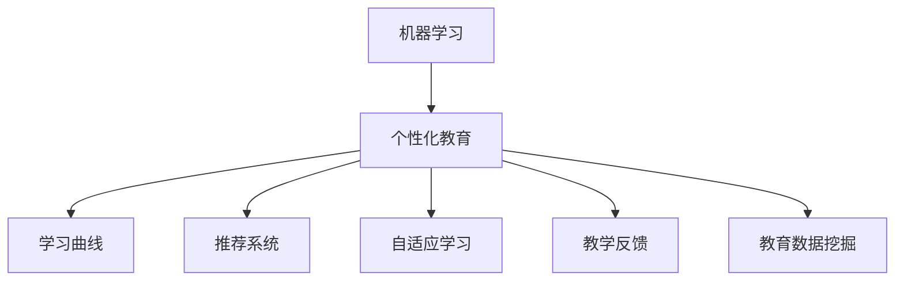

                 

# 机器学习在个性化教育中的应用：适应学生学习曲线

## 1. 背景介绍

### 1.1 问题由来
在现代教育体系中，传统的"一刀切"式教学模式已经难以满足个性化学习的需求。每个学生的基础、兴趣和学习风格各不相同，"一刀切"的教学方法难以有效适应个体差异，导致部分学生学习效率低下，甚至出现厌学现象。个性化教育正是为了解决这个问题，通过动态调整教学内容和方式，适应不同学生的学习曲线，从而提高整体教学效果。

近年来，随着机器学习（Machine Learning, ML）和大数据技术的快速进步，个性化教育逐渐成为了可能。通过收集和分析学生的学习数据，机器学习模型可以识别出每个学生的学习特点和需求，从而为每个学生量身定制个性化的学习方案。这种基于数据的个性化教学方法，已经在多个国家和地区得到了应用和验证，取得了显著的成效。

### 1.2 问题核心关键点
机器学习在个性化教育中的应用，核心在于构建适应学生学习曲线的个性化教学模型。这个模型需要根据学生的历史学习数据，动态调整教学内容、学习节奏和反馈方式，实现个性化教学。其关键点包括以下几个方面：

1. **学习数据分析**：收集学生的学习数据，包括考试成绩、作业完成情况、课堂互动等，以形成学生学习曲线的初步模型。
2. **模型训练**：基于收集到的学习数据，训练机器学习模型，学习每个学生的学习特点和需求。
3. **个性化推荐**：根据学生的学习特点，动态生成个性化的学习推荐，包括课程内容、习题难度、复习计划等。
4. **教学反馈优化**：根据学生的学习反馈，不断优化个性化教学模型，提高教学效果。
5. **系统集成**：将个性化教学模型与现有的教学管理系统、学习平台等进行集成，形成完整的个性化教育体系。

## 2. 核心概念与联系

### 2.1 核心概念概述

为了更好地理解机器学习在个性化教育中的应用，本节将介绍几个密切相关的核心概念：

- **机器学习（Machine Learning, ML）**：一种利用数据和算法使计算机系统具有自主学习能力的领域。通过训练模型，使其能够自动地对新数据进行预测和决策。

- **个性化教育（Personalized Education）**：根据每个学生的个体差异和需求，提供定制化的学习方案和资源，以提高学习效率和效果。

- **学习曲线（Learning Curve）**：描述学生在不同学习阶段上的表现，包括知识掌握情况、学习速度和效率等。

- **推荐系统（Recommendation System）**：通过分析用户行为和偏好，为用户推荐个性化的产品、内容或服务。

- **自适应学习（Adaptive Learning）**：根据学生当前的学习状态和表现，动态调整学习内容和难度，以适应学生的学习进度和能力。

- **教学反馈（Teaching Feedback）**：通过学生的学习表现和反馈，及时调整教学策略和内容，优化学习效果。

- **教育数据挖掘（Educational Data Mining, EDM）**：使用数据挖掘技术，从教育数据中提取有用的信息和模式，支持教育决策和教学优化。

这些核心概念之间的逻辑关系可以通过以下Mermaid流程图来展示：



这个流程图展示了一组概念之间的内在联系：机器学习为个性化教育提供了技术支持，个性化教育需要构建学习曲线和推荐系统，自适应学习和教学反馈是提高个性化教育效果的关键手段，而教育数据挖掘则是基础数据来源和分析工具。

## 3. 核心算法原理 & 具体操作步骤
### 3.1 算法原理概述

机器学习在个性化教育中的核心算法原理，主要基于以下三个步骤：

1. **数据预处理**：收集学生的学习数据，并进行清洗、特征提取等预处理操作。
2. **模型训练**：基于预处理后的数据，训练机器学习模型，学习学生的学习特点和需求。
3. **个性化推荐**：根据模型的预测结果，动态生成个性化的学习推荐。

这些步骤构成了个性化教育的机器学习框架，通过不断迭代优化，可以实现对学生学习曲线的动态适应。

### 3.2 算法步骤详解

基于机器学习在个性化教育中的应用，以下是一个详细的算法步骤：

**Step 1: 数据收集与预处理**

1. **数据收集**：从学习管理系统（LMS）、在线课程平台、教育应用程序等收集学生的学习数据，包括但不限于考试成绩、作业提交时间、课堂互动记录、阅读和视频观看时间等。
2. **数据清洗**：清洗数据中的缺失值、异常值等，确保数据的完整性和准确性。
3. **特征提取**：从学习数据中提取有用的特征，如学习时长、平均成绩、学习频率等，作为模型的输入。

**Step 2: 模型训练**

1. **模型选择**：根据学习任务的特点，选择合适的机器学习模型，如决策树、随机森林、神经网络等。
2. **模型训练**：使用训练集数据训练模型，调整模型参数，使其能够准确预测学生的学习状态和需求。
3. **模型评估**：在验证集上评估模型的性能，如准确率、召回率、F1分数等，确保模型的泛化能力。

**Step 3: 个性化推荐**

1. **推荐生成**：基于训练好的模型，生成每个学生的个性化学习推荐，包括课程内容、习题难度、复习计划等。
2. **动态调整**：根据学生的学习反馈和最新学习数据，动态调整推荐内容，确保学习推荐的个性化和及时性。
3. **系统集成**：将学习推荐系统与现有的教学管理系统、学习平台等进行集成，形成完整的个性化教育体系。

### 3.3 算法优缺点

机器学习在个性化教育中的应用，具有以下优点：

1. **高度个性化**：通过分析学生的学习数据，生成个性化的学习推荐，满足不同学生的学习需求。
2. **数据驱动**：基于学生的学习数据进行决策，使教学过程更加科学和高效。
3. **自适应学习**：根据学生的学习状态和表现，动态调整学习内容和难度，适应学生的学习进度和能力。
4. **反馈优化**：通过学生的学习反馈，不断优化学习模型，提高教学效果。

同时，也存在一些缺点：

1. **数据隐私问题**：收集和处理学生学习数据，可能涉及隐私和数据安全问题。
2. **模型复杂度**：复杂的机器学习模型可能难以解释和调试，教师和管理者难以理解和接受。
3. **资源需求高**：个性化教育需要大量的数据和计算资源，可能对学校和教育机构带来一定的负担。
4. **技术门槛高**：需要专业的数据科学家和技术人员进行模型开发和维护，对教育机构的技术能力提出了较高要求。

### 3.4 算法应用领域

机器学习在个性化教育中的应用，已经在多个领域得到了广泛的应用：

1. **在线教育**：基于学生学习数据，生成个性化的课程推荐和习题推荐，提高在线学习效果。
2. **学校教育**：在课堂教学中，根据学生的学习曲线动态调整教学内容和难度，提高课堂教学效果。
3. **职业教育**：根据学生职业需求，生成个性化的学习方案和职业指导，提升职业培训效果。
4. **企业培训**：根据员工的学习数据，生成个性化的培训方案和评估，提高企业培训效率。
5. **学术研究**：分析学生学习数据，支持学术研究，探讨个性化教育的影响和效果。

## 4. 数学模型和公式 & 详细讲解 & 举例说明
### 4.1 数学模型构建

基于机器学习在个性化教育中的应用，以下是一个数学模型的构建：

假设有一个学生 $S_i$，其学习状态 $L_i$ 可以通过一系列特征 $X_{i1}, X_{i2}, ..., X_{in}$ 来表示，其中 $n$ 为特征数量。

**学习状态预测模型**：

$$
\hat{L}_i = \sum_{j=1}^{n} \theta_j X_{ij}
$$

其中 $\theta_j$ 为模型参数，$X_{ij}$ 为第 $i$ 个学生第 $j$ 个特征的值。

**个性化推荐模型**：

$$
R_i = \text{Softmax}(\hat{L}_i)
$$

其中 $\text{Softmax}$ 函数将学习状态 $\hat{L}_i$ 转换为概率分布，表示推荐内容的权重。

**动态调整模型**：

$$
\hat{L}_i = \alpha \hat{L}_i + (1-\alpha) L_i
$$

其中 $\alpha$ 为动态调整的权重，$L_i$ 为学生的当前学习状态，$\hat{L}_i$ 为模型的预测学习状态。

### 4.2 公式推导过程

以下我们以一个简单的回归模型为例，推导其基本公式。

假设有一个学生 $S_i$，其学习状态 $L_i$ 可以通过一个线性回归模型预测：

$$
\hat{L}_i = \theta_0 + \sum_{j=1}^{n} \theta_j X_{ij}
$$

其中 $\theta_0$ 为截距，$\theta_j$ 为第 $j$ 个特征的系数。

根据最小二乘法，可以求解模型的最优参数 $\theta$：

$$
\theta = \arg\min_{\theta} \sum_{i=1}^{N} (L_i - \hat{L}_i)^2
$$

其解析解为：

$$
\theta = (\mathbf{X}^T \mathbf{X})^{-1} \mathbf{X}^T \mathbf{Y}
$$

其中 $\mathbf{X}$ 为特征矩阵，$\mathbf{Y}$ 为标签矩阵。

### 4.3 案例分析与讲解

以一个简单的学生学习数据为例，分析机器学习在个性化教育中的应用。

假设有一个学校，收集了学生 $S_1, S_2, ..., S_n$ 的学习数据，包括考试成绩、作业完成时间、课堂互动记录等。

**Step 1: 数据收集与预处理**

1. **数据收集**：收集每个学生 $S_i$ 的考试成绩 $L_i$、作业完成时间 $X_{i1}$、课堂互动记录 $X_{i2}$ 等。
2. **数据清洗**：处理缺失值和异常值，确保数据的完整性和准确性。
3. **特征提取**：提取每个学生的平均考试成绩 $X_{i1}$、课堂互动频率 $X_{i2}$ 等特征，作为模型的输入。

**Step 2: 模型训练**

1. **模型选择**：选择线性回归模型作为预测学习状态的模型。
2. **模型训练**：使用训练集数据训练模型，求解最优参数 $\theta$。
3. **模型评估**：在验证集上评估模型的性能，如均方误差等。

**Step 3: 个性化推荐**

1. **推荐生成**：基于训练好的模型，生成每个学生的个性化学习推荐，如课程推荐、习题推荐等。
2. **动态调整**：根据学生的学习反馈和最新学习数据，动态调整推荐内容。
3. **系统集成**：将推荐系统与现有的教学管理系统、学习平台等进行集成，形成完整的个性化教育体系。

## 5. 项目实践：代码实例和详细解释说明
### 5.1 开发环境搭建

在进行个性化教育项目实践前，我们需要准备好开发环境。以下是使用Python进行scikit-learn开发的常见环境配置流程：

1. 安装Anaconda：从官网下载并安装Anaconda，用于创建独立的Python环境。

2. 创建并激活虚拟环境：
```bash
conda create -n education-env python=3.8 
conda activate education-env
```

3. 安装scikit-learn：
```bash
conda install scikit-learn
```

4. 安装各类工具包：
```bash
pip install numpy pandas scikit-learn matplotlib tqdm jupyter notebook ipython
```

完成上述步骤后，即可在`education-env`环境中开始个性化教育项目的开发。

### 5.2 源代码详细实现

下面我们以一个简单的线性回归模型为例，给出scikit-learn库进行学生学习曲线分析的Python代码实现。

首先，定义学习状态预测函数：

```python
from sklearn.linear_model import LinearRegression
import pandas as pd
import numpy as np

def predict_learning_state(X, y):
    model = LinearRegression()
    model.fit(X, y)
    return model.predict(X)

# 读取数据
data = pd.read_csv('student_data.csv')

# 特征提取
X = data[['exam_score', 'homework_time', 'class_interaction']]
y = data['learning_state']

# 预测学生学习状态
predictions = predict_learning_state(X, y)
```

然后，定义个性化推荐函数：

```python
def recommend_learning_materials(X, predictions):
    # 根据预测结果生成个性化推荐
    recommendations = []
    for i, prediction in enumerate(predictions):
        # 假设课程难度从易到难依次为 [easy, medium, hard]
        if prediction < 60:
            recommendations.append(['easy'])
        elif prediction < 70:
            recommendations.append(['medium'])
        else:
            recommendations.append(['hard'])
    return recommendations

# 推荐学生学习材料
recommendations = recommend_learning_materials(X, predictions)
```

最后，运行推荐系统并进行展示：

```python
for i, recommendation in enumerate(recommendations):
    print(f"Student {i+1} recommended materials: {recommendation}")
```

以上就是使用scikit-learn进行个性化教育微调的完整代码实现。可以看到，scikit-learn库提供了丰富的机器学习算法和工具，使得个性化教育的实现变得简便高效。

### 5.3 代码解读与分析

让我们再详细解读一下关键代码的实现细节：

**predict_learning_state函数**：
- 使用LinearRegression模型对学生的学习状态进行预测，返回预测结果。

**recommend_learning_materials函数**：
- 根据学生的学习状态预测结果，生成个性化的学习推荐。

**数据读取和处理**：
- 使用pandas库读取学生数据，并提取有用的特征。

**学习状态预测和推荐**：
- 使用scikit-learn的LinearRegression模型对学生的学习状态进行预测，并根据预测结果生成推荐。

**系统集成**：
- 在实际应用中，将推荐系统与现有的教学管理系统、学习平台等进行集成，形成完整的个性化教育体系。

可以看到，scikit-learn库提供了便捷的API，使得机器学习模型的开发和应用变得简便。但需要注意的是，在实际应用中，还需要根据具体任务进行更深入的模型优化和数据处理，以提高推荐系统的准确性和实用性。

## 6. 实际应用场景

### 6.1 在线教育

在线教育平台可以借助机器学习技术，为每个学生提供个性化的学习推荐。通过收集学生的学习数据，如考试成绩、学习时长、课程反馈等，平台可以动态调整课程推荐和习题推荐，提高在线学习效果。例如，某学生在某门课程上的成绩不佳，平台可以推荐相关的习题和辅导视频，帮助其弥补知识漏洞。

### 6.2 学校教育

在传统课堂教学中，教师可以借助机器学习模型，根据学生的学习状态动态调整教学内容和难度。例如，某学生在数学课上的表现不佳，教师可以调整课堂内容，增加基础题目的练习，并提供难度适中的挑战题目。

### 6.3 职业教育

职业培训机构可以借助机器学习模型，为学员提供个性化的职业培训方案。通过分析学员的学习数据和职业需求，平台可以生成个性化的培训内容和学习路径，提高培训效果和就业竞争力。例如，某学员想成为一名数据分析师，平台可以为其推荐相关的数据分析课程和实战项目，并提供职业发展的指导。

### 6.4 企业培训

企业培训部门可以借助机器学习模型，为员工提供个性化的培训方案。通过分析员工的学习数据和职业需求，平台可以生成个性化的培训内容和评估，提高培训效率和员工满意度。例如，某员工想提升项目管理能力，平台可以为其推荐相关的项目管理课程和案例分析，并提供职业发展的指导。

## 7. 工具和资源推荐
### 7.1 学习资源推荐

为了帮助开发者系统掌握机器学习在个性化教育中的应用，这里推荐一些优质的学习资源：

1. 《机器学习实战》系列博文：由机器学习专家撰写，深入浅出地介绍了机器学习的基本原理和常用算法。

2. Coursera《机器学习》课程：斯坦福大学开设的机器学习课程，由Andrew Ng教授主讲，包含大量的编程作业和实验。

3. 《Python机器学习》书籍：通过Python语言介绍了机器学习的基本流程和实现方法，适合初学者入门。

4. Scikit-learn官方文档：scikit-learn库的官方文档，提供了丰富的示例和API，方便开发者使用。

5. Kaggle：数据科学竞赛平台，提供了大量的机器学习项目和数据集，有助于提高机器学习实践能力。

通过对这些资源的学习实践，相信你一定能够快速掌握机器学习在个性化教育中的应用，并用于解决实际的个性化学习问题。
### 7.2 开发工具推荐

高效的开发离不开优秀的工具支持。以下是几款用于个性化教育开发的常用工具：

1. scikit-learn：基于Python的机器学习库，提供了丰富的算法和工具，支持多种数据处理和模型训练。

2. TensorFlow：由Google主导开发的开源深度学习框架，生产部署方便，适合大规模工程应用。

3. PyTorch：基于Python的深度学习框架，灵活的计算图，适合快速迭代研究。

4. Jupyter Notebook：交互式的编程环境，支持Python等多种编程语言，适合数据处理和模型验证。

5. Weights & Biases：模型训练的实验跟踪工具，可以记录和可视化模型训练过程中的各项指标，方便对比和调优。

6. Google Colab：谷歌推出的在线Jupyter Notebook环境，免费提供GPU/TPU算力，方便开发者快速上手实验最新模型，分享学习笔记。

合理利用这些工具，可以显著提升个性化教育任务的开发效率，加快创新迭代的步伐。

### 7.3 相关论文推荐

机器学习在个性化教育中的应用源于学界的持续研究。以下是几篇奠基性的相关论文，推荐阅读：

1. Adaptive Learning Systems: A Survey of the Literature and Future Research Directions：综述了自适应学习系统的研究进展和未来方向。

2. Personalized Learning: Current Status and Future Directions：讨论了个性化学习的现状和未来发展趋势。

3. Learning Analytics for Personalized Education：介绍了学习分析技术在个性化教育中的应用。

4. Cognitive Tutor: Dynamic Tutorial Design and Adaptation：介绍了一种基于认知理论的自适应学习系统。

5. Empirical Analysis of Personalized Learning Systems：通过实验分析了个性化学习系统的实际效果。

这些论文代表了大规模机器学习在个性化教育领域的发展脉络。通过学习这些前沿成果，可以帮助研究者把握学科前进方向，激发更多的创新灵感。

## 8. 总结：未来发展趋势与挑战
### 8.1 总结

本文对机器学习在个性化教育中的应用进行了全面系统的介绍。首先阐述了个性化教育的重要性，以及机器学习在其中的关键作用。其次，从原理到实践，详细讲解了个性化教育的机器学习框架，给出了个性化教育微调的完整代码实例。同时，本文还广泛探讨了个性化教育的应用场景，展示了机器学习范式在教育领域的广泛应用。

通过本文的系统梳理，可以看到，机器学习在个性化教育中的应用，已经成为了现代教育体系的一个重要组成部分。通过数据驱动的决策和动态调整的学习内容，个性化教育能够更好地满足每个学生的个体差异和需求，从而提高整体教学效果。

### 8.2 未来发展趋势

展望未来，机器学习在个性化教育中的应用将呈现以下几个发展趋势：

1. **深度学习的应用**：随着深度学习技术的发展，个性化的推荐系统将更加精准和高效，能够更好地适应学生的学习需求。

2. **跨领域融合**：个性化教育将与其他领域的技术进行深度融合，如教育数据挖掘、认知科学、人工智能等，形成更加全面、智能的教育系统。

3. **自适应学习系统**：基于学习模型的自适应学习系统将更加普及，能够根据学生的学习状态和反馈，动态调整学习内容，提高学习效果。

4. **多模态学习**：未来的个性化教育将不仅关注文本数据，还将融合视觉、听觉等多模态数据，提供更加全面、丰富的学习体验。

5. **实时学习分析**：基于机器学习的大数据分析技术，将能够实时监测和分析学生的学习状态，提供及时的学习反馈和调整。

这些趋势凸显了机器学习在个性化教育中的巨大潜力，将为教育事业带来革命性的变化。

### 8.3 面临的挑战

尽管机器学习在个性化教育中的应用已经取得了显著的进展，但在迈向更加智能化、普适化应用的过程中，它仍面临着诸多挑战：

1. **数据隐私问题**：收集和处理学生学习数据，可能涉及隐私和数据安全问题。如何在保障隐私的前提下，获取高质量的学习数据，是未来研究的重要方向。

2. **算法透明度**：机器学习模型的复杂性，可能导致其决策过程难以解释和理解，教师和管理者难以接受。如何提高模型的透明度和可解释性，将是重要的研究方向。

3. **资源需求高**：个性化教育需要大量的数据和计算资源，可能对学校和教育机构带来一定的负担。如何降低资源需求，提高系统的可扩展性，是重要的优化方向。

4. **技术门槛高**：需要专业的数据科学家和技术人员进行模型开发和维护，对教育机构的技术能力提出了较高要求。如何降低技术门槛，普及机器学习在教育中的应用，是重要的普及方向。

5. **效果评估难**：个性化教育的效果评估需要考虑多方面的因素，如学生的学习态度、教师的教学效果等。如何设计科学有效的评估指标，全面衡量个性化教育的效果，将是重要的研究方向。

6. **公平性问题**：个性化教育需要考虑到不同学生之间的公平性问题，避免对某些学生产生不利影响。如何设计公平的个性化教育方案，避免歧视和偏见，是重要的伦理方向。

这些挑战需要在未来的研究中不断攻克，才能更好地推动机器学习在个性化教育中的应用，实现教育公平和个性化。

### 8.4 研究展望

面向未来，机器学习在个性化教育中的应用还需要在以下几个方面进行深入研究：

1. **模型优化**：进一步优化学习模型，提高其预测准确性和泛化能力，确保模型的鲁棒性和稳定性。

2. **数据处理**：探索更加高效的数据处理和清洗技术，保障数据质量和数据安全。

3. **算法透明度**：提高机器学习模型的透明度和可解释性，使教师和管理者能够理解和接受。

4. **资源优化**：探索资源优化技术，降低个性化教育的资源需求，提高系统的可扩展性和可部署性。

5. **公平性研究**：研究公平性问题，设计公平的个性化教育方案，避免歧视和偏见。

6. **跨领域融合**：探索与其他领域技术的深度融合，形成更加全面、智能的教育系统。

这些研究方向的探索，将进一步推动机器学习在个性化教育中的应用，为构建安全、可靠、可解释、可控的智能教育系统铺平道路。相信随着技术的不断进步，机器学习在个性化教育中将发挥更大的作用，为教育事业带来深远影响。

## 9. 附录：常见问题与解答

**Q1：个性化教育的核心是什么？**

A: 个性化教育的核心在于构建适应学生学习曲线的个性化教学模型，通过动态调整教学内容和方式，适应不同学生的学习需求。其关键在于收集学生的学习数据，训练机器学习模型，生成个性化的学习推荐。

**Q2：机器学习在个性化教育中主要解决哪些问题？**

A: 机器学习在个性化教育中主要解决以下问题：
1. 数据收集与预处理：收集和处理学生学习数据，确保数据质量和完整性。
2. 模型训练：训练机器学习模型，学习学生的学习特点和需求。
3. 个性化推荐：根据学生的学习特点，生成个性化的学习推荐。
4. 动态调整：根据学生的学习反馈和最新学习数据，动态调整推荐内容。

**Q3：在个性化教育中，如何选择适当的机器学习算法？**

A: 在个性化教育中，选择适当的机器学习算法需要考虑以下几个因素：
1. 任务类型：如回归、分类、聚类等。
2. 数据规模：如小规模、大规模数据集。
3. 数据特性：如结构化、非结构化数据。
4. 模型复杂度：如简单、复杂模型。
5. 计算资源：如CPU、GPU等。
6. 应用场景：如在线教育、学校教育、职业教育等。

基于以上因素，可以选择合适的机器学习算法，如线性回归、决策树、随机森林、神经网络等。

**Q4：在个性化教育中，如何保障数据隐私和数据安全？**

A: 在个性化教育中，保障数据隐私和数据安全是至关重要的。具体措施包括：
1. 数据匿名化：对学生数据进行匿名化处理，避免暴露学生身份。
2. 数据加密：对敏感数据进行加密处理，确保数据传输和存储的安全性。
3. 访问控制：对数据访问进行严格控制，确保只有授权人员可以访问敏感数据。
4. 数据审计：定期对数据访问和使用进行审计，发现和防范潜在风险。
5. 合规性：确保数据处理符合相关法律法规和行业标准。

通过以上措施，可以有效地保障个性化教育中数据隐私和数据安全。

**Q5：个性化教育的机器学习系统需要考虑哪些性能指标？**

A: 个性化教育的机器学习系统需要考虑以下性能指标：
1. 准确率：预测结果与实际结果的匹配度。
2. 召回率：实际结果被预测到的比例。
3. F1分数：综合考虑准确率和召回率的性能指标。
4. 均方误差（MSE）：回归任务中的性能指标。
5. 混淆矩阵：分类任务中的性能指标。
6. 均值绝对误差（MAE）：回归任务中的性能指标。
7. R平方（R2）：回归任务中的性能指标。

通过以上指标，可以全面衡量个性化教育的机器学习系统的性能。

---

作者：禅与计算机程序设计艺术 / Zen and the Art of Computer Programming

