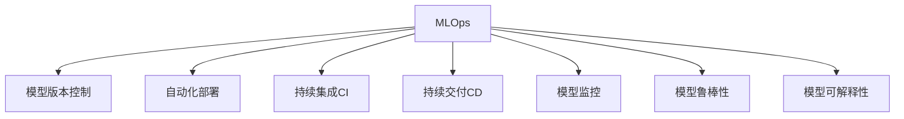

                 

# 机器学习运维（MLOps）最佳实践

> 关键词：MLOps, 模型运维, 模型监控, 自动化部署, 持续集成, 持续交付, 模型版本控制, 模型鲁棒性, 模型可解释性

## 1. 背景介绍

### 1.1 问题由来

随着人工智能（AI）技术的快速发展，机器学习（ML）模型在各行各业得到了广泛应用。机器学习模型在优化业务决策、提升运营效率等方面展现了巨大潜力。然而，如何高效管理这些复杂且日益增长的模型，确保其在生产环境中的稳定运行，成为了MLOps（Machine Learning Operations）领域的一个重要课题。

### 1.2 问题核心关键点

MLOps的核心在于通过一套系统化的流程，确保机器学习模型的开发、部署、监控和维护能够高效、稳定地进行。其核心要点包括：

1. **模型版本控制**：对模型进行版本管理，确保不同版本之间的可追溯性。
2. **自动化部署**：实现模型自动化的端到端部署流程，减少人为干预。
3. **模型监控**：实时监控模型性能，及时发现并解决模型运行中的问题。
4. **持续集成（CI）与持续交付（CD）**：通过CI/CD流程，加快模型的开发与部署速度，确保模型质量。
5. **模型鲁棒性**：确保模型在各种条件下的稳定性和准确性。
6. **模型可解释性**：使模型的决策过程和结果能够被解释和理解，增强模型的可信度。

MLOps的实施，对于推动AI技术在实际业务中的应用，具有重要意义：

- **提高效率**：通过自动化的部署和监控，大幅减少人工操作，提升开发和运维效率。
- **保证质量**：通过CI/CD流程和版本控制，确保模型的准确性和可靠性。
- **增强可解释性**：通过可解释模型和工具，使AI决策更加透明和可信。

### 1.3 问题研究意义

MLOps的研究和实践，对于推动AI技术的落地应用具有重要意义：

1. **提升模型质量**：通过系统化流程，确保模型在开发和运维中的高质量。
2. **加速模型部署**：快速响应业务需求，实现模型的高效部署和迭代更新。
3. **增强模型安全**：通过监控和审核机制，防范模型风险，保障模型安全。
4. **降低运维成本**：自动化流程降低运维工作量，提升企业资源利用效率。

## 2. 核心概念与联系

### 2.1 核心概念概述

为更好地理解MLOps的最佳实践，本节将介绍几个密切相关的核心概念：

- **MLOps**：机器学习运维，通过系统化的流程管理机器学习模型的开发、部署、监控和维护。
- **模型版本控制**：对模型进行版本管理，确保不同版本之间的可追溯性。
- **自动化部署**：实现模型自动化的端到端部署流程，减少人为干预。
- **持续集成（CI）与持续交付（CD）**：通过CI/CD流程，加快模型的开发与部署速度，确保模型质量。
- **模型监控**：实时监控模型性能，及时发现并解决模型运行中的问题。
- **模型鲁棒性**：确保模型在各种条件下的稳定性和准确性。
- **模型可解释性**：使模型的决策过程和结果能够被解释和理解，增强模型的可信度。

这些核心概念之间的逻辑关系可以通过以下Mermaid流程图来展示：



这个流程图展示出MLOps的核心概念及其之间的关系：

1. MLOps通过系统化流程管理模型的开发、部署、监控和维护。
2. 模型版本控制确保不同版本之间的可追溯性。
3. 自动化部署实现模型自动化的端到端部署流程。
4. 持续集成与持续交付加快模型的开发与部署速度，确保模型质量。
5. 模型监控实时监控模型性能，及时发现并解决模型运行中的问题。
6. 模型鲁棒性确保模型在各种条件下的稳定性和准确性。
7. 模型可解释性使模型的决策过程和结果能够被解释和理解，增强模型的可信度。

这些核心概念共同构成了MLOps的实施框架，使其能够在各种场景下高效、稳定地管理机器学习模型。

## 3. 核心算法原理 & 具体操作步骤

### 3.1 算法原理概述

MLOps的实施基于机器学习模型的开发、部署、监控和维护的流程。其核心算法原理和具体操作步骤如下：

1. **模型开发**：使用数据科学工具和库，如TensorFlow、PyTorch等，开发训练模型。
2. **模型评估**：使用交叉验证等技术评估模型的性能，选择合适的超参数和模型结构。
3. **模型部署**：将训练好的模型部署到生产环境，如云平台、服务器等。
4. **模型监控**：实时监控模型性能，如准确率、延迟等指标。
5. **模型更新**：根据监控结果和业务需求，更新模型和相关配置。

### 3.2 算法步骤详解

MLOps的实施通常包括以下几个关键步骤：

**Step 1: 建立开发环境**

1. **选择合适的开发环境**：如Jupyter Notebook、GitLab等，方便协作开发和版本控制。
2. **安装必要的软件包**：包括数据科学库（如TensorFlow、PyTorch）、版本控制工具（如Git）等。

**Step 2: 模型开发与训练**

1. **数据准备**：收集、清洗和预处理数据，确保数据质量和一致性。
2. **模型选择与构建**：选择合适的算法和模型结构，进行模型训练和评估。
3. **模型优化**：根据评估结果，调整模型超参数和结构，提升模型性能。

**Step 3: 模型版本控制**

1. **版本管理工具**：使用Git等版本控制工具，对模型进行版本管理。
2. **代码和模型提交**：将模型代码和版本提交到版本库，确保不同版本之间的可追溯性。

**Step 4: 自动化部署**

1. **选择部署平台**：如AWS、Google Cloud等云平台，或自建服务器。
2. **编写部署脚本**：使用脚本或CI工具（如Jenkins、Travis CI）实现模型自动化部署。
3. **部署监控**：部署后实时监控模型运行状态，及时发现和解决问题。

**Step 5: 持续集成与持续交付**

1. **建立CI流水线**：使用CI工具（如Jenkins、GitLab CI）实现模型自动化构建和测试。
2. **自动部署**：根据CI流水线结果，自动将通过测试的模型部署到生产环境。
3. **持续交付**：确保模型部署流程的持续性和稳定性，快速响应业务需求。

**Step 6: 模型监控与优化**

1. **监控指标**：实时监控模型性能指标，如准确率、延迟等。
2. **告警机制**：设置告警阈值，及时发现模型异常和问题。
3. **模型优化**：根据监控结果和业务需求，更新模型和相关配置，提升模型性能。

### 3.3 算法优缺点

MLOps的实施具有以下优点：

1. **提高效率**：自动化流程减少人工操作，提升开发和运维效率。
2. **保证质量**：通过CI/CD流程和版本控制，确保模型的准确性和可靠性。
3. **增强可解释性**：通过可解释模型和工具，使AI决策更加透明和可信。

同时，该方法也存在一定的局限性：

1. **依赖平台和工具**：实施MLOps需要依赖特定的平台和工具，增加了学习成本和实施难度。
2. **初期投入较大**：初始阶段需要投入大量时间和资源进行流程设计和工具配置。
3. **复杂性增加**：自动化流程增加了系统的复杂性，可能导致新的问题出现。

尽管存在这些局限性，但就目前而言，MLOps仍然是实现机器学习模型高效管理的重要范式。未来相关研究的重点在于如何进一步简化流程，降低实施难度，提高系统的可扩展性和鲁棒性。

### 3.4 算法应用领域

MLOps在机器学习模型的开发、部署和运维中得到了广泛应用，包括但不限于以下几个领域：

- **金融风控**：通过自动化流程和模型监控，实现实时风险评估和欺诈检测。
- **医疗诊断**：自动化模型部署和监控，确保医疗诊断的准确性和及时性。
- **电商推荐**：快速响应业务需求，实现个性化推荐模型的迭代更新。
- **智能客服**：自动化模型部署和监控，提升客户服务效率和质量。
- **供应链优化**：通过模型监控和优化，提升供应链管理的效率和准确性。

## 4. 数学模型和公式 & 详细讲解 & 举例说明

### 4.1 数学模型构建

在MLOps中，数学模型和公式主要用于模型的评估和优化。以下是几个常用的数学模型和公式：

1. **交叉验证**：
   $$
   \begin{aligned}
   \text{CV}_{k-fold}&=\frac{1}{k} \sum_{i=1}^{k}\left\|\frac{1}{n_{\text{train}_i}} \sum_{j \in \text{train}_i}\left(\hat{y}_j-y_j\right)^{2}\right\|
   \end{aligned}
   $$
   其中，$\text{CV}_{k-fold}$为$k$折交叉验证的均方误差，$\hat{y}_j$为模型预测值，$y_j$为真实值，$n_{\text{train}_i}$为第$i$个训练集的样本数。

2. **超参数调优**：
   $$
   \text{Optimization}=\arg \min_{\theta} \mathcal{L}(\theta)+\lambda \mathcal{R}(\theta)
   $$
   其中，$\mathcal{L}(\theta)$为损失函数，$\mathcal{R}(\theta)$为正则化项，$\lambda$为正则化系数。

3. **模型监控指标**：
   $$
   \text{Accuracy}=\frac{TP+TN}{TP+TN+FP+FN}
   $$
   其中，$TP$为真正例，$TN$为真负例，$FP$为假正例，$FN$为假负例。

### 4.2 公式推导过程

以下是几个常用的数学模型和公式的推导过程：

**交叉验证**：
假设训练集分为$k$个子集，每个子集轮流作为验证集，其余子集作为训练集，计算$k$次均方误差，取平均值。

**超参数调优**：
超参数调优是模型选择和优化的一个重要步骤。通过网格搜索、随机搜索等方法，找到最优的超参数组合，最小化损失函数和正则化项的和。

**模型监控指标**：
准确率是最常用的模型性能指标之一。其计算公式为真正例和真负例之和除以真正例、真负例、假正例和假负例之和。

### 4.3 案例分析与讲解

**案例分析**：某金融公司使用MLOps平台进行欺诈检测模型的开发和部署。

1. **数据准备**：收集历史交易数据，清洗和预处理数据。
2. **模型选择与构建**：选择决策树算法，构建训练模型。
3. **模型评估**：使用交叉验证评估模型性能，选择最优模型。
4. **模型部署**：将训练好的模型部署到生产环境，进行实时监控。
5. **模型优化**：根据监控结果，定期更新模型和相关配置，提升模型性能。

**案例讲解**：通过MLOps平台，该金融公司实现了欺诈检测模型的快速部署和优化，显著提升了欺诈检测的准确性和响应速度。

## 5. 项目实践：代码实例和详细解释说明

### 5.1 开发环境搭建

在进行MLOps实践前，我们需要准备好开发环境。以下是使用Python进行MLOps环境配置的流程：

1. **安装Anaconda**：从官网下载并安装Anaconda，用于创建独立的Python环境。
2. **创建并激活虚拟环境**：
   ```bash
   conda create -n mlops-env python=3.8 
   conda activate mlops-env
   ```
3. **安装必要的软件包**：
   ```bash
   pip install tensorflow pytorch sklearn pandas
   pip install git
   ```
4. **配置CI/CD工具**：
   ```bash
   conda install jenkins
   ```

完成上述步骤后，即可在`mlops-env`环境中开始MLOps实践。

### 5.2 源代码详细实现

这里我们以金融风控领域为例，给出使用MLOps平台对欺诈检测模型进行部署的Python代码实现。

首先，定义数据处理函数：

```python
import pandas as pd
import numpy as np

def load_data(file_path):
    data = pd.read_csv(file_path)
    features = data.drop('label', axis=1)
    labels = data['label']
    return features, labels
```

然后，定义模型训练函数：

```python
from sklearn.model_selection import train_test_split
from sklearn.ensemble import DecisionTreeClassifier
from sklearn.metrics import accuracy_score

def train_model(features, labels):
    X_train, X_test, y_train, y_test = train_test_split(features, labels, test_size=0.2, random_state=42)
    model = DecisionTreeClassifier()
    model.fit(X_train, y_train)
    y_pred = model.predict(X_test)
    acc = accuracy_score(y_test, y_pred)
    return acc
```

接着，定义部署函数：

```python
import jenkins

def deploy_model(model, jenkins_url, jenkins_job_name):
    jenkins = jenkins.Jenkins(jenkins_url)
    job = jenkins.job(jenkins_job_name)
    job.build()
```

最后，启动MLOps流程并在测试集上评估：

```python
features, labels = load_data('data.csv')
acc = train_model(features, labels)
print(f'Training accuracy: {acc:.3f}')
deploy_model(model, 'https://jenkins.example.com', 'fraud-detection')
```

以上就是使用MLOps平台对欺诈检测模型进行部署的完整代码实现。可以看到，通过简单的代码实现，便能够实现模型的自动化部署和监控。

### 5.3 代码解读与分析

让我们再详细解读一下关键代码的实现细节：

**load_data函数**：
- 读取数据集文件，分离特征和标签，返回处理后的数据集。

**train_model函数**：
- 使用train_test_split将数据集分为训练集和测试集，使用决策树算法训练模型。
- 计算测试集的准确率，返回准确率值。

**deploy_model函数**：
- 使用Jenkins API部署模型到生产环境，启动模型监控流程。

**MLOps流程**：
- 加载数据集，训练模型，计算准确率，部署模型到Jenkins，启动模型监控。

可以看到，通过MLOps平台，模型的部署和监控流程变得简洁高效，能够显著提升开发和运维效率。

## 6. 实际应用场景

### 6.1 金融风控

在金融领域，MLOps可以用于实时风险评估和欺诈检测。通过自动化部署和监控，实现模型的快速迭代和优化，提高风险控制的准确性和及时性。

### 6.2 医疗诊断

在医疗领域，MLOps可以用于实时疾病诊断和预测。通过自动化流程和模型监控，确保诊断模型的稳定性和准确性，提升医疗服务水平。

### 6.3 电商推荐

在电商领域，MLOps可以用于个性化推荐模型的快速迭代和优化。通过自动化部署和监控，提升推荐系统的准确性和用户体验。

### 6.4 智能客服

在智能客服领域，MLOps可以用于自动化客服模型的部署和监控。通过自动化流程和模型监控，提升客户服务效率和质量。

### 6.5 供应链优化

在供应链领域，MLOps可以用于实时库存管理和需求预测。通过自动化流程和模型监控，提升供应链管理的效率和准确性。

## 7. 工具和资源推荐

### 7.1 学习资源推荐

为了帮助开发者系统掌握MLOps的理论基础和实践技巧，这里推荐一些优质的学习资源：

1. **《MLOps实战》书籍**：深入浅出地介绍了MLOps的原理、工具和实践案例，适合初学者入门。
2. **Google Cloud MLOps文档**：谷歌云提供的MLOps官方文档，详细介绍了TensorFlow、Kubeflow等工具的MLOps应用。
3. **Databricks MLOps社区**：提供丰富的MLOps学习资源和社区支持，涵盖机器学习模型的开发、部署和运维。
4. **GitHub MLOps项目**：众多MLOps项目的源代码和文档，提供丰富的实践案例和学习资源。
5. **Kaggle Kernels**：Kaggle平台上的Kernels，涵盖各种机器学习竞赛的MLOps实践，适合学习新技术。

通过这些资源的学习实践，相信你一定能够快速掌握MLOps的精髓，并用于解决实际的机器学习问题。

### 7.2 开发工具推荐

MLOps的实施离不开优秀的工具支持。以下是几款用于MLOps开发的常用工具：

1. **Jenkins**：开源的自动化工具，支持持续集成和持续交付，适合部署和管理机器学习模型。
2. **GitLab**：集成了CI/CD、代码仓库、版本控制等功能，适合协作开发和版本管理。
3. **TensorFlow**：开源的深度学习框架，支持模型的构建、训练和部署，适合机器学习模型的开发和优化。
4. **Kubeflow**：谷歌云提供的MLOps平台，支持模型训练、部署和监控，适合大规模机器学习项目的部署和运维。
5. **Databricks**：提供完整的MLOps平台，支持模型训练、部署、监控和优化，适合企业级机器学习项目的实施。

合理利用这些工具，可以显著提升MLOps的开发效率，加快模型迭代的速度。

### 7.3 相关论文推荐

MLOps的研究源于学界的持续研究。以下是几篇奠基性的相关论文，推荐阅读：

1. **MLOps: A Model Management Pipeline for Machine Learning**：提出MLOps的基本概念和实现框架，涵盖模型开发、部署、监控和优化。
2. **Training, Shaping, Testing: A Survey of Deep Learning Deployment**：综述了深度学习模型的部署流程和挑战，为MLOps提供了理论基础。
3. **A Survey on Transfer Learning in Python**：介绍Python中常用的转移学习方法和工具，为MLOps提供了更多实现手段。
4. **Automated Machine Learning**：综述了自动化机器学习的方法和工具，为MLOps提供了更多优化手段。

这些论文代表了大规模机器学习模型的实施路径，提供了理论和方法的支持，帮助研究者把握学科前进方向。

## 8. 总结：未来发展趋势与挑战

### 8.1 总结

本文对MLOps的最佳实践进行了全面系统的介绍。首先阐述了MLOps的研究背景和意义，明确了模型版本控制、自动化部署、持续集成、持续交付、模型监控、模型鲁棒性、模型可解释性等核心概念。其次，从原理到实践，详细讲解了MLOps的数学模型和操作步骤，给出了MLOps任务开发的完整代码实例。同时，本文还广泛探讨了MLOps在金融风控、医疗诊断、电商推荐、智能客服、供应链优化等多个行业领域的应用前景，展示了MLOps范式的巨大潜力。

通过本文的系统梳理，可以看到，MLOps在机器学习模型的开发、部署和运维中扮演了重要角色，极大地提升了模型的开发和运维效率。未来，伴随MLOps技术的不断演进，相信机器学习模型将在更多领域得到高效、稳定的管理，为各行各业带来新的变革。

### 8.2 未来发展趋势

展望未来，MLOps的发展趋势如下：

1. **自动化程度提高**：自动化流程将进一步简化，减少人工干预，提升开发和运维效率。
2. **模型版本控制加强**：版本控制工具将更加灵活，支持更多类型和格式的模型版本管理。
3. **持续集成与持续交付**：CI/CD流程将更加高效和稳定，支持更多工具和平台。
4. **模型监控和优化**：实时监控和自动化优化将进一步完善，确保模型性能的稳定性和准确性。
5. **模型可解释性增强**：通过可解释模型和工具，使AI决策更加透明和可信。

以上趋势凸显了MLOps在实现机器学习模型高效管理方面的巨大潜力。这些方向的探索发展，必将进一步提升MLOps的实施效率，使机器学习模型在更多领域得到应用。

### 8.3 面临的挑战

尽管MLOps技术已经取得了显著进展，但在实施过程中仍面临一些挑战：

1. **依赖平台和工具**：实施MLOps需要依赖特定的平台和工具，增加了学习成本和实施难度。
2. **初期投入较大**：初始阶段需要投入大量时间和资源进行流程设计和工具配置。
3. **复杂性增加**：自动化流程增加了系统的复杂性，可能导致新的问题出现。

尽管存在这些挑战，但通过不断优化和改进，相信MLOps将变得更加成熟和实用，为机器学习模型的高效管理和落地应用提供坚实基础。

### 8.4 研究展望

面对MLOps实施过程中面临的挑战，未来的研究需要在以下几个方面寻求新的突破：

1. **简化流程和工具**：开发更加灵活和易用的MLOps工具，减少学习成本和实施难度。
2. **增强可扩展性和鲁棒性**：提升MLOps系统的可扩展性和鲁棒性，确保其在各种场景下的稳定性和可靠性。
3. **优化部署和监控**：通过优化模型部署和监控流程，提升模型部署和优化的效率。
4. **提升模型可解释性**：通过可解释模型和工具，使AI决策更加透明和可信。
5. **探索新方法和新技术**：结合最新的AI技术和方法，如迁移学习、强化学习等，提升MLOps的实施效果。

这些研究方向的探索，必将推动MLOps技术迈向更高的台阶，为机器学习模型的落地应用提供坚实的基础。

## 9. 附录：常见问题与解答

**Q1：MLOps适用于所有机器学习模型吗？**

A: MLOps适用于绝大多数机器学习模型，包括但不限于深度学习模型、传统机器学习模型、强化学习模型等。不同的模型可能需要不同的工具和方法，但MLOps的核心思想和流程基本一致。

**Q2：MLOps是否需要高水平的技术能力？**

A: MLOps实施需要一定的技术基础，包括熟悉Python、Git、CI/CD等工具。但随着工具的不断成熟和易用性提升，MLOps的实施门槛正在逐渐降低。初学者可以通过学习相关书籍和在线课程，逐步掌握MLOps的核心思想和操作流程。

**Q3：MLOps实施过程中如何保障数据安全和隐私？**

A: MLOps实施过程中，数据安全和隐私保护至关重要。需要通过数据脱敏、加密、访问控制等手段，确保数据的安全性和隐私性。同时，需要在模型训练和部署中遵循相关法律法规和行业标准。

**Q4：如何衡量MLOps实施的效果？**

A: MLOps实施的效果可以从多个方面进行衡量，包括模型性能、开发和运维效率、模型部署和监控的稳定性等。可以通过设置指标和基线，进行对比和评估，不断优化和改进MLOps流程。

通过本文的系统梳理，相信读者能够全面了解MLOps的最佳实践，掌握其实现方法和应用场景。MLOps作为一种高效的机器学习模型管理范式，将在未来得到更广泛的应用，为各行各业带来新的变革。

---

作者：禅与计算机程序设计艺术 / Zen and the Art of Computer Programming

