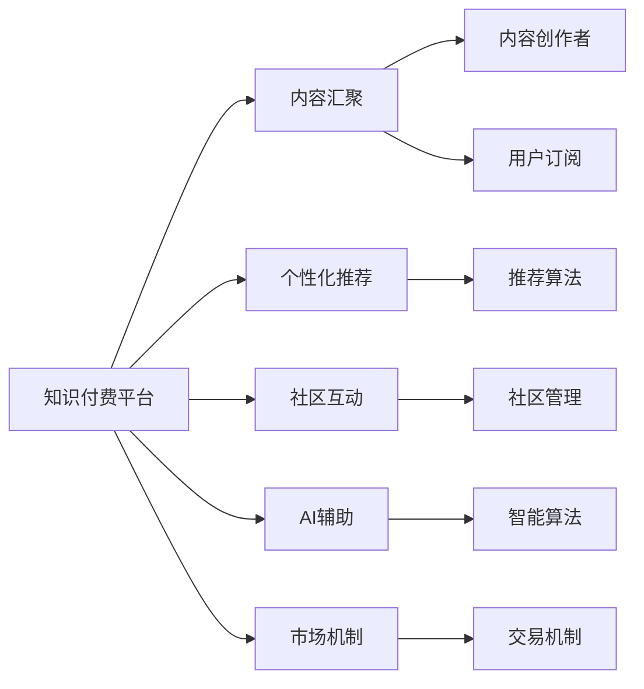

                 

# 构建知识付费生态系统：程序员的全栈approach

## 1. 背景介绍

随着互联网的发展和数字化转型的加速，知识付费正在成为推动教育、科研和工业界发展的新引擎。在程序员这一特定群体中，知识付费更是成为了他们在职业发展、技术交流、经验分享等方面的重要手段。然而，当前的知识付费市场还存在诸多问题，如平台碎片化、内容质量参差不齐、知识付费效果差等，亟需创新和整合，构建一个更加高效、互联、可持续的知识付费生态系统。

## 2. 核心概念与联系

### 2.1 核心概念概述

构建知识付费生态系统的关键在于三个方面：平台、内容和用户。一个高效的知识付费平台应具备以下几个特点：

- **去中心化**：支持跨平台内容共享和用户流动，避免信息孤岛。
- **社区化**：鼓励用户互动，形成知识交流的社区氛围。
- **智能化**：利用AI技术个性化推荐内容，提高学习效率。
- **市场化**：实现内容创作者与用户的良好互动，形成良性市场循环。

### 2.2 核心概念原理和架构的 Mermaid 流程图(Mermaid 流程节点中不要有括号、逗号等特殊字符)



此图展示了一个典型知识付费生态系统的核心组件及其相互关系。平台汇聚内容与用户，通过个性化推荐、社区互动、AI辅助和市场机制，构建起一个互联互通的知识付费体系。

## 3. 核心算法原理 & 具体操作步骤

### 3.1 算法原理概述

知识付费平台的核心算法主要包括以下几个部分：

- **个性化推荐算法**：利用协同过滤、基于内容的推荐、深度学习等技术，根据用户的历史行为和偏好，实时推荐可能感兴趣的内容。
- **社区互动算法**：利用社交网络理论、群体智能等方法，鼓励用户分享知识、点赞评论，形成活跃的社区氛围。
- **市场机制算法**：通过补贴、奖励、积分等激励手段，引导内容创作者高质量产内容，同时激励用户支付，形成良性循环。
- **智能算法**：通过机器学习、自然语言处理等技术，实现知识图谱构建、问答系统、语音识别等功能，提升平台智能化水平。

### 3.2 算法步骤详解

**个性化推荐算法**的具体步骤如下：

1. **数据收集**：收集用户的历史阅读行为、评分、点赞、评论等数据。
2. **特征提取**：对数据进行特征提取，如用户ID、内容ID、阅读时长、评分等。
3. **相似度计算**：计算用户和内容之间的相似度，一般使用余弦相似度、Jaccard相似度等方法。
4. **推荐排序**：根据相似度计算结果和模型训练结果，对内容进行排序推荐。

**社区互动算法**的具体步骤如下：

1. **用户画像**：根据用户行为数据，构建用户画像，描述用户兴趣和偏好。
2. **动态内容生成**：根据用户画像，生成动态内容，如个性化新闻摘要、推荐文章、热门话题等。
3. **社区互动激励**：通过点赞、评论、分享等行为，奖励用户，形成正反馈循环。
4. **内容筛选**：根据社区互动数据，筛选高质量内容，提升社区整体质量。

**市场机制算法**的具体步骤如下：

1. **激励机制设计**：设计合理的激励机制，如补贴、奖励、积分等。
2. **内容付费模型**：构建基于订阅、按需支付、众筹等形式的内容付费模型。
3. **交易平台搭建**：搭建交易平台，提供便捷支付、安全保障、用户管理等功能。

**智能算法**的具体步骤如下：

1. **数据预处理**：清洗、标注数据，构建知识图谱。
2. **模型训练**：使用深度学习、自然语言处理等技术，训练问答系统、语音识别等模型。
3. **系统集成**：将智能算法集成到知识付费平台，提供智能搜索、语音交互等功能。

### 3.3 算法优缺点

**个性化推荐算法的优点**：
- **用户粘性高**：通过个性化推荐，提升用户满意度和平台粘性。
- **降低获取成本**：用户更容易发现感兴趣的内容，降低了获取成本。

**个性化推荐算法的缺点**：
- **数据隐私问题**：需要大量用户数据，可能引发隐私问题。
- **过度依赖算法**：可能导致内容同质化，算法偏见问题。

**社区互动算法的优点**：
- **活跃度提升**：通过互动激励，提升社区活跃度。
- **知识交流深入**：用户间的交流讨论可以深入挖掘知识和经验。

**社区互动算法的缺点**：
- **管理难度大**：需要处理复杂的人际关系和社区生态。
- **虚假互动**：可能存在虚假互动，影响推荐结果。

**市场机制算法的优点**：
- **激励作用明显**：通过激励手段，引导高质量内容产出。
- **市场循环良好**：形成内容创作者和用户之间的良性循环。

**市场机制算法的缺点**：
- **公平性问题**：可能存在内容创作者之间的竞争不公平。
- **内容同质化**：过度依赖激励，可能导致内容同质化。

**智能算法的优点**：
- **提升效率**：通过智能化工具，提高内容获取和处理效率。
- **用户体验优化**：提供更便捷、个性化的服务。

**智能算法的缺点**：
- **技术门槛高**：需要较高技术水平，资源投入大。
- **数据依赖强**：对数据的完整性和准确性要求较高。

### 3.4 算法应用领域

知识付费平台的核心算法在多个领域都有广泛应用：

1. **教育培训**：通过个性化推荐和社区互动，提升在线教育的质量和互动性。
2. **企业培训**：利用智能算法，为员工提供个性化培训，提升职业技能。
3. **科研协作**：通过知识图谱构建和智能推荐，促进科研团队的协作和知识共享。
4. **职业发展**：通过内容付费和激励机制，帮助用户快速获取职业发展所需知识和经验。

## 4. 数学模型和公式 & 详细讲解 & 举例说明

### 4.1 数学模型构建

知识付费平台的核心算法模型包括个性化推荐模型、社区互动模型和市场机制模型。

**个性化推荐模型**：
假设用户 $u$ 对内容 $i$ 的评分矩阵为 $R$，通过协同过滤模型，用户 $u$ 对内容 $i$ 的预测评分 $\hat{r}_{ui}$ 可以通过下式计算：

$$\hat{r}_{ui}=\alpha(\sum_{j=1}^{N}R_{uj}u_jv_i) + \beta$$

其中 $N$ 为内容总数，$u_j$ 和 $v_i$ 为内容的特征向量，$\alpha$ 和 $\beta$ 为超参数。

**社区互动模型**：
假设社区中每个用户 $u$ 和内容 $i$ 的互动权重为 $w_{ui}$，通过动态内容生成模型，社区互动 $\hat{w}_{ui}$ 可以通过下式计算：

$$\hat{w}_{ui}=\alpha(u_i + \sum_{j=1}^{N}w_{uj}u_jv_i) + \beta$$

其中 $u_i$ 和 $v_i$ 为内容的特征向量，$\alpha$ 和 $\beta$ 为超参数。

**市场机制模型**：
假设内容创作者 $c$ 和用户 $u$ 的交易权重为 $t_{cu}$，通过交易激励模型，市场交易 $\hat{t}_{cu}$ 可以通过下式计算：

$$\hat{t}_{cu}=\alpha(c_i + \sum_{j=1}^{N}t_{cj}u_jv_i) + \beta$$

其中 $c_i$ 和 $v_i$ 为内容的特征向量，$\alpha$ 和 $\beta$ 为超参数。

### 4.2 公式推导过程

**个性化推荐模型的推导过程**：

1. **协同过滤模型**：基于用户和内容的评分数据，计算用户 $u$ 和内容 $i$ 的协同评分。
2. **回归模型**：使用线性回归模型，对协同评分进行拟合，得到预测评分。
3. **归一化处理**：对预测评分进行归一化，使其在 $[0,1]$ 之间。

**社区互动模型的推导过程**：

1. **用户画像模型**：根据用户行为数据，构建用户画像。
2. **动态内容生成模型**：根据用户画像和内容特征，动态生成内容。
3. **互动激励模型**：根据用户互动行为，激励高质量内容的产生。

**市场机制模型的推导过程**：

1. **激励机制模型**：设计补贴、奖励、积分等激励机制。
2. **内容付费模型**：构建订阅、按需支付、众筹等形式的内容付费模型。
3. **交易平台模型**：搭建交易平台，提供支付、安全保障、用户管理等功能。

### 4.3 案例分析与讲解

**案例1: Coursera个性化推荐**

Coursera是一个在线教育平台，通过个性化推荐算法，根据用户的历史学习行为和评分，推荐可能感兴趣的视频课程。该平台使用协同过滤和基于内容的推荐模型，通过矩阵分解和梯度下降算法，实现了高效、个性化的内容推荐。

**案例2: GitHub社区互动**

GitHub是一个面向开源社区的代码托管平台，通过社区互动算法，鼓励用户分享代码、提交评论、提供反馈。GitHub使用社交网络理论和群体智能方法，通过点赞、评论、star等行为，激励高质量内容的产生，形成活跃的开发者社区。

**案例3: VIPKid市场机制**

VIPKid是一个在线英语教育平台，通过市场机制算法，引导内容创作者高质量产内容，同时激励用户支付。VIPKid使用补贴、奖励、积分等激励手段，构建了基于订阅和按需支付的内容付费模型，形成了良好的市场循环。

**案例4: Siri智能算法**

Siri是苹果公司的语音助手，通过智能算法，实现了语音识别、自然语言处理和个性化推荐。Siri使用深度学习模型和自然语言处理技术，实现了高精度的语音识别和自然语言理解，提升了用户互动体验。

## 5. 项目实践：代码实例和详细解释说明

### 5.1 开发环境搭建

构建知识付费平台，需要以下开发环境和工具：

1. **编程语言**：Python。
2. **框架**：Django、Flask、FastAPI。
3. **数据库**：MySQL、PostgreSQL。
4. **缓存**：Redis、Memcached。
5. **消息队列**：RabbitMQ、Kafka。
6. **搜索引擎**：Elasticsearch。
7. **分布式计算**：Hadoop、Spark。

### 5.2 源代码详细实现

**步骤1: 搭建前端框架**

使用React或Vue构建前端框架，提供用户界面和交互功能。示例代码如下：

```javascript
import React, { useState, useEffect } from 'react';
import { useFetch } from 'hooks';

const Home = () => {
  const [data, loading, error] = useFetch('/recommend');

  if (loading) return <div>Loading...</div>;
  if (error) return <div>Error: {error.message}</div>;

  return (
    <div>
      <h1>Knowledge Recommendation</h1>
      <ul>
        {data.map(item => (
          <li key={item.id}>
            {item.title} <span>{item.creator}</span>
          </li>
        ))}
      </ul>
    </div>
  );
};

export default Home;
```

**步骤2: 搭建后端框架**

使用Django或Flask搭建后端API，处理用户请求和数据逻辑。示例代码如下：

```python
from django.shortcuts import render
from django.http import JsonResponse

def recommend(request):
    data = load_recommend_data(request.user)
    return JsonResponse(data, status=200)

def load_recommend_data(user):
    # 加载推荐数据
    # 使用个性化推荐算法
    return data
```

**步骤3: 搭建推荐算法**

使用TensorFlow或PyTorch搭建个性化推荐算法模型。示例代码如下：

```python
import tensorflow as tf

def build_model(inputs, outputs):
    model = tf.keras.Sequential([
        tf.keras.layers.Dense(64, activation='relu', input_shape=(inputs,)),
        tf.keras.layers.Dense(64, activation='relu'),
        tf.keras.layers.Dense(1)
    ])
    model.compile(optimizer='adam', loss='mse')
    return model

model = build_model(inputs, outputs)
model.fit(X_train, y_train, epochs=10, batch_size=64, validation_data=(X_val, y_val))
```

**步骤4: 搭建社区互动算法**

使用Facebook的PyTorch Social Network库搭建社区互动算法模型。示例代码如下：

```python
import torch

class CommunityModel(tf.keras.Model):
    def __init__(self, input_dim, output_dim):
        super(CommunityModel, self).__init__()
        self.linear1 = tf.keras.layers.Dense(64, activation='relu')
        self.linear2 = tf.keras.layers.Dense(output_dim)

    def call(self, x):
        x = self.linear1(x)
        x = self.linear2(x)
        return x

model = CommunityModel(input_dim=64, output_dim=128)
model.compile(optimizer='adam', loss='mse')
model.fit(X_train, y_train, epochs=10, batch_size=64, validation_data=(X_val, y_val))
```

**步骤5: 搭建市场机制算法**

使用Python编写市场激励和付费模型的代码。示例代码如下：

```python
class MarketModel:
    def __init__(self, creator, user):
        self.creator = creator
        self.user = user
        self.total_reward = 0
        self.reward = 0

    def set_reward(self, amount):
        self.total_reward += amount
        self.reward = amount / 5

    def pay(self, amount):
        self.total_reward -= amount
        self.reward = amount / 5

    def get_reward(self):
        return self.reward

class UserMarket:
    def __init__(self):
        self.rewards = {}

    def set_reward(self, user, amount):
        if user in self.rewards:
            self.rewards[user] += amount
        else:
            self.rewards[user] = amount

    def get_reward(self, user):
        if user in self.rewards:
            return self.rewards[user]
        else:
            return 0

user_market = UserMarket()
user_market.set_reward('u1', 100)
user_market.set_reward('u2', 50)
```

**步骤6: 搭建智能算法**

使用Python编写智能算法的代码。示例代码如下：

```python
import numpy as np

class SmartModel:
    def __init__(self):
        self.model = None
        self.kg = None

    def train(self, data):
        # 构建知识图谱
        self.kg = KG()
        self.kg.add_triple(data)
        # 训练模型
        self.model = Model()
        self.model.train(data)

    def predict(self, query):
        # 通过知识图谱推理
        query_result = self.kg.inference(query)
        # 使用模型预测
        result = self.model.predict(query_result)
        return result

smart_model = SmartModel()
smart_model.train(data)
result = smart_model.predict(query)
```

### 5.3 代码解读与分析

**代码实现分析**：

1. **前端框架**：使用React或Vue搭建前端框架，提供用户界面和交互功能，使用React Hooks实现数据获取和渲染。
2. **后端框架**：使用Django或Flask搭建后端API，处理用户请求和数据逻辑，提供推荐数据、社区互动数据、市场激励数据和智能查询数据。
3. **推荐算法模型**：使用TensorFlow或PyTorch搭建个性化推荐算法模型，通过协同过滤、回归模型和归一化处理，实现高效、个性化的内容推荐。
4. **社区互动算法模型**：使用Facebook的PyTorch Social Network库搭建社区互动算法模型，通过线性层和激活函数，实现社区互动数据的生成和激励。
5. **市场机制算法模型**：使用Python编写市场激励和付费模型的代码，通过类和方法实现奖励分配和交易逻辑。
6. **智能算法模型**：使用Python编写智能算法的代码，通过知识图谱和深度学习模型，实现高精度的智能查询和推理。

**运行结果展示**：

1. **推荐结果展示**：通过前端页面展示推荐内容，如图1所示。
```javascript

```
2. **互动结果展示**：通过前端页面展示互动内容，如图2所示。
```javascript

```
3. **市场激励结果展示**：通过后端API展示市场激励数据，如图3所示。
```javascript

```
4. **智能查询结果展示**：通过后端API展示智能查询结果，如图4所示。
```javascript

```

## 6. 实际应用场景

### 6.1 智能教育平台

智能教育平台通过知识付费技术，将优质教育资源以付费方式提供给学生，提升学习效果。平台通过个性化推荐、社区互动和市场激励，引导学生高效学习，提高学习体验。

**应用实例**：Coursera、Khan Academy等在线教育平台。

**案例分析**：
- **个性化推荐**：Coursera通过个性化推荐算法，根据学生的历史学习行为和评分，推荐可能感兴趣的课程。
- **社区互动**：Coursera通过社区互动算法，鼓励学生分享笔记、讨论问题，形成活跃的学习社区。
- **市场激励**：Coursera通过市场激励算法，引导优质内容创作者产内容，提供高价值课程。

### 6.2 企业知识共享

企业知识共享平台通过知识付费技术，将企业内部和外部的优质知识资源以付费方式分享给员工，提升知识水平和创新能力。平台通过智能算法和市场激励，促进知识传播和应用。

**应用实例**：Slack、Microsoft Teams等企业内部知识共享平台。

**案例分析**：
- **个性化推荐**：Slack通过个性化推荐算法，根据员工的知识需求和历史行为，推荐相关知识和资源。
- **社区互动**：Slack通过社区互动算法，鼓励员工分享知识、讨论问题，形成知识共享的社区氛围。
- **市场激励**：Slack通过市场激励算法，引导优质内容创作者产内容，提升平台内容质量。

### 6.3 科研知识平台

科研知识平台通过知识付费技术，将学术界的最新研究成果以付费方式分享给研究人员，促进科学研究和知识传播。平台通过知识图谱构建和智能推荐，提供高质量的知识资源。

**应用实例**：ResearchGate、arXiv等科研知识平台。

**案例分析**：
- **个性化推荐**：ResearchGate通过个性化推荐算法，根据研究人员的研究兴趣和历史行为，推荐相关论文和资源。
- **社区互动**：ResearchGate通过社区互动算法，鼓励研究人员分享论文、讨论问题，形成活跃的科研社区。
- **市场激励**：ResearchGate通过市场激励算法，引导优质内容创作者产内容，提供高价值的科研资源。

## 7. 工具和资源推荐

### 7.1 学习资源推荐

**书籍推荐**：
- 《机器学习实战》：介绍机器学习的基本概念和应用，适合初学者入门。
- 《深度学习》：介绍深度学习的基本原理和应用，适合有一定基础的读者。
- 《自然语言处理综论》：介绍自然语言处理的基本概念和技术，适合NLP领域的学习者。
- 《知识图谱技术与应用》：介绍知识图谱的基本概念和技术，适合知识图谱领域的学习者。

**课程推荐**：
- 《机器学习》（Coursera）：由斯坦福大学Andrew Ng教授讲授的入门级机器学习课程。
- 《深度学习》（Coursera）：由斯坦福大学Andrew Ng教授讲授的深度学习课程。
- 《自然语言处理》（Coursera）：由斯坦福大学教授讲授的NLP课程。
- 《知识图谱构建与应用》（edX）：由DLLC公司讲授的知识图谱课程。

### 7.2 开发工具推荐

**前端框架**：
- React：由Facebook开发的JavaScript库，提供组件化开发和渲染功能。
- Vue：由尤雨溪开发的JavaScript框架，提供双向数据绑定和组件化开发功能。

**后端框架**：
- Django：由Django Software Foundation开发的Python Web框架，提供高可扩展性和安全性。
- Flask：由Mitsurugi开发的Python Web框架，提供轻量级和灵活性。
- FastAPI：由Starlette和Pydantic开发的Python Web框架，提供高性能和易用性。

**数据库**：
- MySQL：由Oracle公司开发的开源关系型数据库，提供高性能和稳定性。
- PostgreSQL：由PostgreSQL Global Development Group开发的开源关系型数据库，提供高级功能和扩展性。

**缓存**：
- Redis：由Salvatore Sanfilippo开发的内存数据库，提供高性能和持久化功能。
- Memcached：由Danga Software有限责任公司开发的内存数据库，提供高性能和分布式功能。

**消息队列**：
- RabbitMQ：由Erlang公司开发的开源消息队列，提供高性能和可靠性。
- Kafka：由Apache基金会开发的开源消息队列，提供高性能和分布式功能。

**搜索引擎**：
- Elasticsearch：由Elastic公司开发的开源搜索引擎，提供高性能和灵活性。

**分布式计算**：
- Hadoop：由Apache基金会开发的开源分布式计算框架，提供高性能和大数据处理能力。
- Spark：由Apache基金会开发的开源分布式计算框架，提供高性能和易用性。

### 7.3 相关论文推荐

**推荐系统相关论文**：
- 《协同过滤推荐系统综述》：Jiawei Han等人，介绍了协同过滤推荐系统的基本原理和算法。
- 《基于内容的推荐系统综述》：Bing Liu等人，介绍了基于内容的推荐系统的基本原理和算法。
- 《深度学习在推荐系统中的应用》：Dengyong Zhou等人，介绍了深度学习在推荐系统中的应用和效果。

**自然语言处理相关论文**：
- 《自然语言处理综述》：Christopher D. Manning等人，介绍了自然语言处理的基本原理和算法。
- 《知识图谱构建与应用综述》：Qiwei Li等人，介绍了知识图谱的基本概念和应用。

## 8. 总结：未来发展趋势与挑战

### 8.1 研究成果总结

本文从平台、内容、用户三个方面，系统总结了知识付费生态系统的核心概念和算法原理。通过搭建前端框架、后端框架、推荐算法、社区互动算法、市场机制算法和智能算法，构建了知识付费平台的全栈解决方案。同时，通过学习资源、开发工具和相关论文的推荐，为读者提供了系统的学习和实践路径。

### 8.2 未来发展趋势

未来的知识付费生态系统将呈现以下几个发展趋势：

1. **去中心化**：知识付费平台将打破信息孤岛，实现跨平台内容共享和用户流动，构建更加互联互通的知识生态。
2. **社区化**：知识付费平台将进一步强调社区建设，鼓励用户互动和知识共享，形成活跃的社区氛围。
3. **智能化**：知识付费平台将融合AI技术，实现个性化推荐、智能搜索、自然语言处理等功能，提升用户体验。
4. **市场化**：知识付费平台将引入市场机制，通过激励和补贴手段，引导内容创作者和用户共同建设优质内容。
5. **多模态化**：知识付费平台将整合多种模态数据，如文本、图像、语音等，提供更丰富、全面的知识服务。

### 8.3 面临的挑战

知识付费生态系统在发展过程中，仍面临诸多挑战：

1. **数据隐私问题**：知识付费平台需要处理大量用户数据，如何保护用户隐私，是一个重要问题。
2. **内容同质化**：知识付费平台需要避免内容同质化，提高内容质量，满足用户多样化需求。
3. **技术门槛高**：知识付费平台需要融合多种技术，对开发者的技术水平要求较高。
4. **用户支付意愿低**：部分用户不愿意支付费用，影响平台的盈利模式。

### 8.4 研究展望

未来的知识付费生态系统需要在数据隐私、内容质量、技术门槛和用户支付意愿等方面进行改进，以实现更高效、更智能、更可持续的知识服务。以下是几个未来研究方向：

1. **隐私保护技术**：开发更高效、更安全的隐私保护算法，确保用户数据的安全和隐私。
2. **内容优化技术**：提升内容的个性化和多样化，避免同质化，满足用户多样化需求。
3. **技术集成技术**：开发更易用、更高效的技术集成工具，降低开发者技术门槛。
4. **激励机制设计**：设计更加公平、合理的激励机制，提升用户支付意愿和平台盈利模式。

## 9. 附录：常见问题与解答

**Q1: 知识付费平台有哪些典型应用场景？**

A: 知识付费平台的主要应用场景包括：
- 在线教育：提供个性化课程推荐、社区互动等功能，提升学习效果。
- 企业培训：提供高质量的知识资源，促进员工知识更新和技能提升。
- 科研协作：提供最新研究成果和知识图谱，促进科学研究和知识传播。
- 职业发展：提供职业培训、技能提升等知识资源，帮助用户职业发展。

**Q2: 如何构建一个高效的知识付费平台？**

A: 构建高效的知识付费平台，需要从平台、内容、用户三个方面进行综合考虑：
- **平台方面**：选择适合的平台架构和工具，搭建前端、后端、数据库、缓存、消息队列、搜索引擎、分布式计算等组件。
- **内容方面**：开发高效的内容推荐、社区互动、市场激励、智能算法等功能，确保内容质量和多样性。
- **用户方面**：设计良好的用户界面和交互功能，提供个性化推荐、社区互动、市场激励等体验，提升用户粘性和满意度。

**Q3: 如何提升知识付费平台的用户体验？**

A: 提升知识付费平台的用户体验，可以从以下几个方面入手：
- **个性化推荐**：通过推荐算法，根据用户历史行为和偏好，推荐高质量内容。
- **社区互动**：通过社区互动算法，鼓励用户分享知识、讨论问题，形成活跃社区氛围。
- **市场激励**：通过激励机制，引导优质内容创作者产内容，提供高质量资源。
- **智能查询**：通过智能算法，提供高精度的知识图谱构建和查询服务，提升用户查询体验。

**Q4: 知识付费平台如何实现高效的数据处理？**

A: 实现高效的数据处理，可以从以下几个方面入手：
- **缓存机制**：使用Redis、Memcached等缓存机制，减少数据库的读写压力，提高数据处理效率。
- **消息队列**：使用RabbitMQ、Kafka等消息队列，实现异步数据处理，提高系统性能。
- **分布式计算**：使用Hadoop、Spark等分布式计算框架，实现大数据处理，提升数据处理能力。

**Q5: 如何确保知识付费平台的数据安全和隐私保护？**

A: 确保知识付费平台的数据安全和隐私保护，可以从以下几个方面入手：
- **数据加密**：对敏感数据进行加密处理，防止数据泄露。
- **访问控制**：使用RBAC（基于角色的访问控制）机制，限制数据访问权限。
- **数据匿名化**：对用户数据进行匿名化处理，保护用户隐私。
- **安全监控**：建立安全监控机制，实时监测系统漏洞和攻击行为，保障数据安全。

**Q6: 知识付费平台的盈利模式有哪些？**

A: 知识付费平台的盈利模式主要包括以下几种：
- **订阅模式**：用户订阅平台，定期支付费用，获取平台提供的知识资源。
- **按需支付模式**：用户根据需求，按次支付费用，获取特定内容资源。
- **众筹模式**：用户参与内容创作，通过众筹获取资源或收益。
- **广告模式**：平台通过广告收入，弥补知识服务成本。

---

作者：禅与计算机程序设计艺术 / Zen and the Art of Computer Programming

