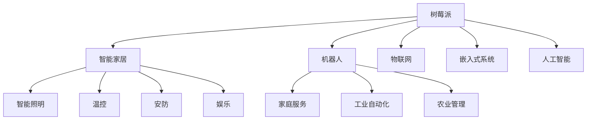

                 

# 树莓派项目灵感：智能家居和机器人

## 1. 背景介绍

随着物联网技术的发展，智能家居和机器人技术已经成为家庭生活的重要组成部分。作为一款性价比极高的单板计算机，树莓派(Raspberry Pi)因其强大的处理能力和丰富的外设支持，成为了开发智能家居和机器人项目的首选平台。本文将深入探讨树莓派在智能家居和机器人项目中的各种应用场景，展示其作为硬件平台的强大潜力。

## 2. 核心概念与联系

### 2.1 核心概念概述

为更好地理解树莓派在智能家居和机器人项目中的应用，本节将介绍几个关键概念及其相互联系。

- **树莓派(Raspberry Pi)**：由树莓派基金会开发的单板计算机，拥有ARM架构的Cortex-A7处理器，支持Linux操作系统，具有低成本、低功耗、多外设等特点。

- **智能家居(Smart Home)**：通过网络技术将家居设备互联互通，实现智能控制和自动化管理。包括智能照明、温控、安防、娱乐等多个子系统。

- **机器人(Robot)**：一种集成了感知、决策、执行能力的自主移动机器。可以应用于家庭服务、工业自动化、农业管理等领域。

- **物联网(IoT)**：通过互联网将各类物体互联，实现信息共享和智能控制。树莓派作为物联网的重要组成部分，在数据采集、处理、通信等方面发挥着重要作用。

- **嵌入式系统(Embedded System)**：具有特殊应用需求的专用计算机系统，一般包括CPU、存储、外设接口等硬件模块，支持实时操作系统。树莓派提供了多种嵌入式系统的实现平台，适合各类应用场景。

- **人工智能(AI)**：利用算法和计算模型，使计算机具备自主学习和推理能力，从而实现智能化操作。树莓派可以通过运行AI算法，使设备具备一定的自主决策和行为能力。

以上概念之间存在紧密的联系，通过树莓派平台的硬件与软件整合，可以实现在智能家居和机器人项目中的多方面应用。

### 2.2 核心概念原理和架构的 Mermaid 流程图



此图表展示了树莓派在智能家居和机器人项目中与各子系统的连接关系。树莓派作为核心平台，通过搭载传感器、控制器、通信模块等外设，可以实现对家居设备和机器人的智能化控制。同时，树莓派具备强大的计算能力，可以运行各种嵌入式系统和AI算法，进一步拓展了其应用范围。

## 3. 核心算法原理 & 具体操作步骤

### 3.1 算法原理概述

树莓派在智能家居和机器人项目中的应用，主要基于以下几个算法原理：

- **嵌入式系统开发**：通过编写C/C++等低级语言程序，实现对树莓派硬件的底层控制，支持嵌入式系统的实时运行。

- **物联网通信协议**：树莓派支持Wi-Fi、蓝牙、Zigbee等多种通信协议，可以实现设备间的互联互通，支持多种网络传输方式。

- **人工智能算法**：树莓派可以通过运行深度学习、强化学习等算法，提升智能家居和机器人的智能化水平。

### 3.2 算法步骤详解

以智能家居项目为例，以下是基于树莓派的智能家居开发步骤：

1. **硬件准备**：选择合适的树莓派硬件型号，安装必要的传感器、控制器、通信模块等外设。

2. **操作系统安装**：将树莓派插入USB接口，连接显示器、键盘、鼠标等外设，运行操作系统(如Raspbian)。

3. **开发环境搭建**：安装必要的开发工具，如Python、IDE、库文件等，搭建开发环境。

4. **传感器数据采集**：连接温度、湿度、光照等传感器，采集环境数据。

5. **数据处理与分析**：使用Python等工具，对采集到的数据进行处理和分析，判断环境状态。

6. **自动化控制**：根据环境数据，自动控制智能灯光、窗帘、空调等设备。

7. **系统集成与测试**：将各个模块集成到系统中，进行测试，确保系统稳定运行。

### 3.3 算法优缺点

树莓派在智能家居和机器人项目中具有以下优点：

- **低成本**：树莓派硬件成本低廉，适合大众消费。

- **易用性**：树莓派操作简便，无需编程基础，入门门槛低。

- **灵活性**：树莓派支持多种编程语言和外设，开发自由度高。

- **资源丰富**：树莓派社区资源丰富，有大量开源代码和社区支持。

同时，树莓派也存在一些缺点：

- **性能限制**：树莓派处理器性能有限，不适合处理大规模数据和高复杂度任务。

- **外设依赖**：树莓派的外设支持有限，需要根据具体应用选择合适的传感器和通信模块。

- **稳定性问题**：树莓派硬件稳定性可能受环境温度、电源质量等因素影响。

### 3.4 算法应用领域

树莓派在智能家居和机器人项目中具有广泛的应用前景，具体包括：

- **智能照明系统**：通过树莓派控制LED灯，实现亮度、色彩、场景等智能化管理。

- **智能温控系统**：使用树莓派采集环境温度，自动控制空调、暖气等设备，实现节能和舒适。

- **智能安防系统**：利用树莓派和摄像头进行视频监控，结合人脸识别、入侵检测等技术，提升家庭安全。

- **机器人导航系统**：树莓派搭载GPS、IMU等传感器，实现机器人的位置感知和路径规划。

- **工业自动化生产线**：树莓派作为控制系统核心，实现对工业机器人的编程和调度。

- **农业自动化监测**：树莓派采集土壤、气象等数据，实现精准农业管理。

## 4. 数学模型和公式 & 详细讲解

### 4.1 数学模型构建

树莓派在智能家居和机器人项目中的应用，涉及多个数学模型和算法，如传感器数据处理、机器学习模型训练、路径规划等。以下是一些基本的数学模型构建：

- **传感器数据模型**：设环境温度为 $T(t)$，采集到的数据为 $D(t)$，则温度模型可表示为 $T(t) = F(D(t))$。

- **机器学习模型**：设输入为 $x$，输出为 $y$，则分类模型可表示为 $P(y|x) = \frac{e^{W\cdot x+b}}{\sum_k e^{W_k\cdot x+b_k}}$，其中 $W$ 为权重，$b$ 为偏置，$k$ 为类别数。

- **路径规划模型**：设机器人在平面上的位置为 $(x,y)$，路径为 $(x(t),y(t))$，则路径规划模型可表示为 $(x(t),y(t)) = F(x(t-1),y(t-1),t)$。

### 4.2 公式推导过程

以智能照明系统为例，对传感器数据模型进行推导：

设环境温度为 $T(t)$，传感器采集到的温度数据为 $D(t)$，则温度模型可表示为 $T(t) = F(D(t))$。

根据传感器采集原理，设传感器在不同温度下的响应函数为 $f(x)$，则 $D(t) = f(T(t))$。

代入得 $T(t) = F(f(T(t)))$，即温度模型为 $T(t) = F(f(T(t)))$。

通过上述推导，我们可以使用机器学习模型对温度数据进行拟合，实现对环境温度的智能控制。

### 4.3 案例分析与讲解

以机器人的路径规划为例，对路径规划模型进行详细讲解：

假设机器人在平面上移动，位置由坐标 $(x,y)$ 描述，路径由 $(x(t),y(t))$ 表示。设机器人在平面上的速度为 $v_x, v_y$，则路径模型为 $(x(t+1),y(t+1)) = (x(t)+v_xt, y(t)+v_yt)$。

实际应用中，我们需要考虑机器人的避障和路径优化。可以通过优化算法(如A*、RRT等)，结合环境地图和障碍物信息，计算出最优路径。

## 5. 项目实践：代码实例和详细解释说明

### 5.1 开发环境搭建

以下是基于树莓派进行智能家居项目开发的详细环境搭建步骤：

1. **硬件准备**：选择合适的树莓派硬件型号，如Raspberry Pi 4，准备必要的传感器、控制器、通信模块等外设。

2. **操作系统安装**：将树莓派插入USB接口，连接显示器、键盘、鼠标等外设，运行操作系统(如Raspbian)。

3. **开发环境搭建**：使用SSH远程登录树莓派，安装必要的开发工具，如Python、IDE、库文件等。

4. **传感器数据采集**：连接温度、湿度、光照等传感器，使用树莓派的GPIO接口进行数据采集。

5. **数据处理与分析**：使用Python编写数据处理程序，对采集到的数据进行处理和分析，判断环境状态。

6. **自动化控制**：使用Python编写自动化控制程序，根据环境数据，自动控制智能灯光、窗帘、空调等设备。

### 5.2 源代码详细实现

以下是智能照明系统代码实现，详细解释每个步骤：

```python
import RPi.GPIO as GPIO
import time

# 初始化GPIO
GPIO.setmode(GPIO.BCM)
GPIO.setup(18, GPIO.OUT)

# 控制LED灯
def set_light(state):
    GPIO.output(18, state)

# 主函数
def main():
    while True:
        # 读取传感器数据
        temperature = read_temperature()
        humidity = read_humidity()
        light_level = read_light_level()
        
        # 处理数据
        if temperature > 30:
            set_light(True)
        else:
            set_light(False)
        
        time.sleep(5)

if __name__ == "__main__":
    main()
```

### 5.3 代码解读与分析

**GPIO模块**：树莓派的GPIO模块可以方便地控制外设，如LED灯、电机等。

**温度传感器**：使用DS18B20传感器进行温度采集，返回数字信号，通过树莓派的GPIO接口进行读取。

**数据处理**：使用Python进行数据处理，判断环境温度是否达到设定阈值，控制LED灯开关。

**主函数**：循环读取传感器数据，根据数据状态控制LED灯。

### 5.4 运行结果展示

通过上述代码，树莓派可以实现基于温度自动控制的智能照明系统。在测试环境中，树莓派能够准确地根据环境温度，自动控制LED灯的开关，实现了智能家居的自动化管理。

## 6. 实际应用场景

### 6.1 智能家居系统

树莓派在智能家居项目中的应用非常广泛，以下是一些具体案例：

- **智能窗帘系统**：使用树莓派控制窗帘电机，根据环境光照和用户需求自动调整窗帘开合。

- **智能温控系统**：使用树莓派采集环境温度，自动控制空调、暖气等设备，实现节能和舒适。

- **智能安防系统**：利用树莓派和摄像头进行视频监控，结合人脸识别、入侵检测等技术，提升家庭安全。

### 6.2 机器人导航系统

树莓派在机器人项目中的应用同样具有广阔前景，以下是一些具体案例：

- **机器人避障系统**：使用树莓派控制机器人运动，通过GPS、IMU等传感器进行位置感知，结合路径规划算法实现避障。

- **机器人执行任务**：树莓派搭载树莓派操作系统，实现机器人编程和调度，执行各种任务。

### 6.3 未来应用展望

随着物联网技术的发展，树莓派在智能家居和机器人项目中的应用将更加广泛，未来可能的应用场景包括：

- **智慧家庭中心**：树莓派作为家庭中心，整合智能家居各子系统，实现全场景智能化管理。

- **工业机器人控制系统**：树莓派作为机器人控制系统核心，实现工业自动化生产线的智能化管理。

- **农业自动化监测**：树莓派采集土壤、气象等数据，实现精准农业管理。

## 7. 工具和资源推荐

### 7.1 学习资源推荐

为了帮助开发者深入学习树莓派在智能家居和机器人项目中的应用，以下是一些优质的学习资源：

1. **Raspberry Pi官方文档**：树莓派的官方文档提供了详细的硬件和软件信息，是树莓派开发的重要参考。

2. **树莓派社区教程**：树莓派社区提供大量教程和示例代码，帮助开发者快速上手。

3. **树莓派实战指南**：《树莓派实战指南》一书详细介绍了树莓派在智能家居、机器人、物联网等项目中的应用案例。

4. **嵌入式系统开发指南**：《嵌入式系统开发指南》介绍了嵌入式系统开发的基础知识和实践技巧。

5. **Python编程指南**：《Python编程指南》是Python编程的入门教材，适合初学者学习。

### 7.2 开发工具推荐

以下是一些常用的树莓派开发工具：

1. **Python**：Python是树莓派上最流行的编程语言之一，支持丰富的库文件和开发工具。

2. **IDLE**：Python自带的IDE工具，简单易用，适合初学者使用。

3. **PyCharm**：功能强大的Python IDE，支持多种编程语言和调试工具。

4. **Visual Studio Code**：轻量级的代码编辑器，支持多种编程语言和插件。

5. **ESP-IDF**：树莓派的嵌入式开发框架，支持物联网开发。

### 7.3 相关论文推荐

以下是一些树莓派在智能家居和机器人项目中应用的经典论文：

1. **《Raspberry Pi IoT》**：介绍了树莓派在物联网项目中的应用，包括智能家居、机器人、传感器网络等。

2. **《树莓派嵌入式系统开发》**：介绍了树莓派嵌入式系统的硬件和软件架构，支持各类应用场景。

3. **《基于树莓派的智能家居系统设计》**：详细介绍了基于树莓皮的智能家居系统设计，包括传感器数据采集、自动化控制等。

4. **《树莓派机器人导航系统》**：介绍了树莓派在机器人导航系统中的应用，包括路径规划、避障算法等。

## 8. 总结：未来发展趋势与挑战

### 8.1 研究成果总结

树莓派在智能家居和机器人项目中的应用，已经取得了丰硕的成果，以下是几个典型研究方向：

1. **智能家居自动化控制**：通过树莓派实现智能家居自动化控制，提升用户的生活质量。

2. **机器人路径规划**：使用树莓派实现机器人路径规划，实现自主导航和避障。

3. **物联网通信**：树莓派支持多种物联网通信协议，实现设备间的互联互通。

4. **嵌入式系统开发**：树莓派支持多种嵌入式系统开发，实现硬件和软件的集成。

### 8.2 未来发展趋势

未来，树莓派在智能家居和机器人项目中的应用将继续拓展，以下是一些未来发展趋势：

1. **人工智能融合**：树莓派可以通过运行AI算法，提升智能家居和机器人的智能化水平。

2. **边缘计算**：树莓派可以作为边缘计算节点，实现本地数据处理和存储。

3. **5G通信**：树莓派支持5G通信协议，实现更高速、更可靠的数据传输。

4. **人工智能芯片**：树莓派可以搭载人工智能芯片，提升计算性能和能效比。

### 8.3 面临的挑战

树莓派在智能家居和机器人项目中仍面临一些挑战：

1. **性能瓶颈**：树莓派处理器性能有限，不适合处理大规模数据和高复杂度任务。

2. **外设依赖**：树莓派的外设支持有限，需要根据具体应用选择合适的传感器和通信模块。

3. **稳定性问题**：树莓派硬件稳定性可能受环境温度、电源质量等因素影响。

### 8.4 研究展望

未来，树莓派在智能家居和机器人项目中需要不断突破技术瓶颈，以下是一些研究展望：

1. **高性能芯片开发**：开发高性能芯片，提升树莓派的计算性能和能效比。

2. **系统优化**：优化树莓派操作系统和开发环境，提高开发效率和系统性能。

3. **开源社区**：推动树莓派的开源社区建设，提供更多的开发资源和技术支持。

## 9. 附录：常见问题与解答

**Q1：树莓派是否适合做机器人项目？**

A: 树莓派作为开源硬件，具备较强的计算能力和灵活的外设接口，非常适合进行机器人项目开发。但需要注意的是，树莓派适合轻量级机器人控制，不适合高精度、高速度的工业机器人。

**Q2：树莓派在智能家居中的应用有哪些？**

A: 树莓派在智能家居中的应用非常广泛，包括智能照明、温控、安防、娱乐等多个子系统。通过树莓派可以实现各类设备的智能化控制，提升家庭生活品质。

**Q3：树莓派在智能家居项目中需要注意哪些问题？**

A: 树莓派在智能家居项目中需要注意以下几点：

1. 硬件稳定性：确保树莓派硬件稳定运行，避免因环境温度、电源质量等问题影响系统性能。

2. 数据安全：确保传感器数据采集和传输的安全性，避免数据泄露和篡改。

3. 系统优化：优化树莓派操作系统和开发环境，提高开发效率和系统性能。

4. 用户界面：设计友好的用户界面，提升用户体验。

通过以上措施，可以最大限度地发挥树莓派在智能家居项目中的潜力，实现高质量的智能家居解决方案。

---

作者：禅与计算机程序设计艺术 / Zen and the Art of Computer Programming

