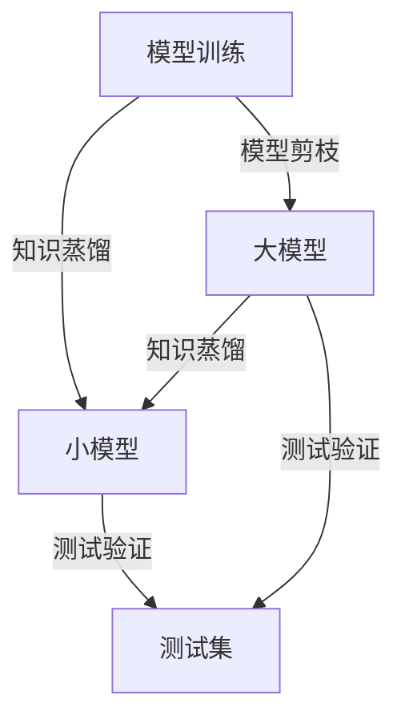

                 

# 模型压缩技术：知识蒸馏与模型剪枝

> 关键词：模型压缩, 知识蒸馏, 模型剪枝, 深度学习, 神经网络, 迁移学习

## 1. 背景介绍

### 1.1 问题由来
近年来，深度学习技术在图像识别、自然语言处理、语音识别等领域取得了显著进展。然而，随着模型复杂度的增加，深度学习模型的参数量呈指数级增长，导致训练和推理过程变得极度耗时、计算成本昂贵，不利于模型的部署和应用。为此，模型压缩技术应运而生，旨在通过减少模型参数量和计算量，在不牺牲模型性能的前提下，显著提升模型的实际应用效率和可扩展性。

### 1.2 问题核心关键点
模型压缩技术主要包含两种方法：知识蒸馏和模型剪枝。其中，知识蒸馏通过将大型复杂模型的知识传递给小型精简模型，实现知识共享和迁移学习；模型剪枝则是通过去除模型中的冗余参数，进一步提升模型压缩率。

知识蒸馏方法主要包括：
- 基于软标签蒸馏：使用大模型的输出概率作为小模型的监督信号，训练小模型。
- 基于硬标签蒸馏：直接使用大模型的预测标签作为小模型的监督信号，训练小模型。

模型剪枝方法主要包括：
- 结构剪枝：删除模型中的冗余连接、层或神经元，以减少模型参数和计算量。
- 权重剪枝：通过调整模型权重，去除低权重参数，实现模型压缩。

本文章将深入探讨这两种模型压缩技术的原理、实现和应用，为深度学习模型的优化提供新的思路和方向。

## 2. 核心概念与联系

### 2.1 核心概念概述

模型压缩技术旨在通过对深度学习模型进行压缩，降低其计算复杂度，提升模型的实际应用效率和可扩展性。常见的方法包括知识蒸馏和模型剪枝。

- **知识蒸馏(Knowledge Distillation)**：通过将大模型的知识传递给小模型，实现知识共享和迁移学习。大模型通过监督小模型，让小模型学习大模型的知识，从而实现性能提升。
- **模型剪枝(Model Pruning)**：通过删除模型中的冗余参数，减少模型的计算量和内存占用，提升模型压缩率和实际应用效率。剪枝方法主要包括结构剪枝和权重剪枝。

两种方法在实现上有相似之处，均通过减少模型参数和计算量来提升模型性能。同时，它们也可以结合使用，通过先进行模型剪枝，再进行知识蒸馏，进一步优化模型。

### 2.2 核心概念原理和架构的 Mermaid 流程图



## 3. 核心算法原理 & 具体操作步骤
### 3.1 算法原理概述

知识蒸馏和模型剪枝的核心思想是通过减少模型参数和计算量，在不牺牲模型性能的前提下，提升模型实际应用效率和可扩展性。

### 3.2 算法步骤详解

#### 3.2.1 知识蒸馏步骤

**Step 1: 选择大模型和小模型**
- 选择一个大模型作为教师模型，一个小模型作为学生模型。大模型的复杂度通常较高，但性能更好；小模型的复杂度较低，但性能较差。

**Step 2: 训练大模型**
- 使用大模型进行训练，以获得高质量的知识。

**Step 3: 迁移知识**
- 通过监督学习的方式，将大模型的知识迁移到小模型上。具体方法包括：
  - **软标签蒸馏**：将大模型的输出概率作为小模型的监督信号，训练小模型。
  - **硬标签蒸馏**：直接使用大模型的预测标签作为小模型的监督信号，训练小模型。

**Step 4: 测试验证**
- 使用测试集对小模型进行测试，评估其性能是否达到预期。

**Step 5: 迭代优化**
- 通过不断调整大模型和小模型的参数，提升小模型的性能。

#### 3.2.2 模型剪枝步骤

**Step 1: 选择剪枝方法**
- 选择结构剪枝或权重剪枝方法。结构剪枝侧重于删除模型中的冗余连接或层，权重剪枝侧重于删除低权重参数。

**Step 2: 剪枝模型**
- 对模型进行剪枝，去除冗余或低权重参数。

**Step 3: 重训练模型**
- 使用剪枝后的模型进行重新训练，以恢复性能。

**Step 4: 测试验证**
- 使用测试集对剪枝后的模型进行测试，评估其性能是否达到预期。

**Step 5: 迭代优化**
- 通过不断调整剪枝策略和重训练参数，进一步提升模型性能。

### 3.3 算法优缺点

**知识蒸馏的优点**：
- 可以通过迁移学习的方式，让小型模型快速获得高质量的知识，提升性能。
- 可以在不同架构和复杂度的模型间进行知识传递，具有广泛的适用性。

**知识蒸馏的缺点**：
- 需要大量的计算资源和时间，进行大模型的训练和知识传递。
- 对小模型的初始化依赖较高，如果初始化不好，可能无法充分吸收大模型的知识。

**模型剪枝的优点**：
- 可以通过减少模型参数和计算量，显著提升模型压缩率和实际应用效率。
- 可以通过去除冗余参数，提升模型的泛化能力和鲁棒性。

**模型剪枝的缺点**：
- 剪枝过程中可能损失部分模型知识，导致性能下降。
- 剪枝后模型的训练和推理时间可能增加，需要进一步优化。

### 3.4 算法应用领域

模型压缩技术在实际应用中有着广泛的应用场景，特别是在移动设备、嵌入式系统、智能家居、物联网等领域，对模型性能和计算资源的要求极高。

- **移动设备**：通过模型压缩，可以提升手机、平板等移动设备上的应用性能和用户体验。
- **嵌入式系统**：通过模型压缩，可以优化嵌入式系统中的图像识别、语音识别等应用。
- **智能家居**：通过模型压缩，可以提升智能家居设备中的语音识别、视频分析等应用的实际效率。
- **物联网**：通过模型压缩，可以优化物联网设备中的数据处理和分析能力。

## 4. 数学模型和公式 & 详细讲解 & 举例说明

### 4.1 数学模型构建

知识蒸馏和模型剪枝涉及的数学模型主要包括：
- 损失函数：用于评估模型性能，通常包括交叉熵损失、均方误差损失等。
- 监督信号：用于指导模型训练，通常包括大模型的输出概率或预测标签。
- 剪枝策略：用于确定模型中冗余参数或低权重参数的删除方式。

### 4.2 公式推导过程

#### 4.2.1 知识蒸馏公式推导

知识蒸馏的目标是通过监督小模型，使其学习大模型的知识。假设大模型为 $M_{\text{big}}$，小模型为 $M_{\text{small}}$，则知识蒸馏的目标函数可以表示为：

$$
\mathcal{L}_{\text{distill}} = \mathcal{L}_{\text{big}} + \lambda \mathcal{L}_{\text{small}} + \mathcal{L}_{\text{distill}}
$$

其中，$\mathcal{L}_{\text{big}}$ 为大模型的损失函数，$\mathcal{L}_{\text{small}}$ 为小模型的损失函数，$\mathcal{L}_{\text{distill}}$ 为知识蒸馏的损失函数。$\lambda$ 为正则化系数，用于控制知识蒸馏在模型训练中的权重。

对于软标签蒸馏，$\mathcal{L}_{\text{distill}}$ 可以表示为：

$$
\mathcal{L}_{\text{distill}} = -\sum_{i=1}^n \sum_{j=1}^m y_i^j \log M_{\text{small}}(x_i, j)
$$

其中，$y_i^j$ 为样本 $i$ 在大模型上的预测概率，$j$ 表示不同的类别，$n$ 为样本数，$m$ 为类别数。

对于硬标签蒸馏，$\mathcal{L}_{\text{distill}}$ 可以表示为：

$$
\mathcal{L}_{\text{distill}} = -\sum_{i=1}^n \mathbb{1}\{y_i = \hat{y}_i\}
$$

其中，$\hat{y}_i$ 为大模型对样本 $i$ 的预测标签。

#### 4.2.2 模型剪枝公式推导

模型剪枝的目标是通过减少模型参数和计算量，提升模型压缩率和实际应用效率。假设模型为 $M$，剪枝后的模型为 $M^{\prime}$，则剪枝的目标函数可以表示为：

$$
\mathcal{L}_{\text{pruning}} = \mathcal{L}_{\text{big}} + \mathcal{L}_{\text{small}}
$$

其中，$\mathcal{L}_{\text{big}}$ 为大模型的损失函数，$\mathcal{L}_{\text{small}}$ 为剪枝后模型的损失函数。

对于结构剪枝，剪枝后的模型参数可以通过删除模型中的冗余连接或层来得到。例如，对于一个卷积神经网络，可以通过删除冗余的卷积层或池化层，减少模型参数和计算量。

对于权重剪枝，剪枝后的模型参数可以通过调整模型权重来得到。例如，可以通过设置阈值，删除低权重参数，减少模型参数和计算量。

### 4.3 案例分析与讲解

#### 4.3.1 知识蒸馏案例分析

以图像识别任务为例，假设有一个大模型 $M_{\text{big}}$ 和一个小模型 $M_{\text{small}}$，使用知识蒸馏方法训练小模型。具体步骤如下：
1. 使用大模型 $M_{\text{big}}$ 进行训练，获得高质量的知识。
2. 使用大模型的输出概率作为小模型的监督信号，训练小模型 $M_{\text{small}}$。
3. 使用测试集对小模型进行测试，评估其性能。
4. 通过不断调整大模型和小模型的参数，提升小模型的性能。

#### 4.3.2 模型剪枝案例分析

以卷积神经网络为例，假设有一个卷积神经网络模型 $M$，使用结构剪枝方法压缩模型。具体步骤如下：
1. 选择结构剪枝方法，例如删除冗余的卷积层或池化层。
2. 对模型进行剪枝，删除冗余连接或层。
3. 使用剪枝后的模型进行重新训练，恢复性能。
4. 使用测试集对剪枝后的模型进行测试，评估其性能。
5. 通过不断调整剪枝策略和重训练参数，进一步提升模型性能。

## 5. 项目实践：代码实例和详细解释说明

### 5.1 开发环境搭建

在进行模型压缩技术实践前，我们需要准备好开发环境。以下是使用Python进行TensorFlow开发的环境配置流程：

1. 安装Anaconda：从官网下载并安装Anaconda，用于创建独立的Python环境。

2. 创建并激活虚拟环境：
```bash
conda create -n tf-env python=3.8 
conda activate tf-env
```

3. 安装TensorFlow：根据CUDA版本，从官网获取对应的安装命令。例如：
```bash
pip install tensorflow==2.8
```

4. 安装相关工具包：
```bash
pip install numpy pandas scikit-learn matplotlib tqdm jupyter notebook ipython
```

完成上述步骤后，即可在`tf-env`环境中开始模型压缩技术的实践。

### 5.2 源代码详细实现

这里我们以卷积神经网络的结构剪枝为例，给出使用TensorFlow进行卷积神经网络压缩的Python代码实现。

首先，定义卷积神经网络模型：

```python
import tensorflow as tf

def conv_net(x, weights, biases):
    x = tf.nn.conv2d(x, weights['conv1'], strides=[1, 1, 1, 1], padding='SAME')
    x = tf.nn.relu(tf.nn.bias_add(x, biases['conv1']))
    x = tf.nn.max_pool(x, ksize=[1, 2, 2, 1], strides=[1, 2, 2, 1], padding='SAME')
    x = tf.nn.relu(tf.nn.bias_add(x, biases['conv2']))
    x = tf.nn.max_pool(x, ksize=[1, 2, 2, 1], strides=[1, 2, 2, 1], padding='SAME')
    x = tf.reshape(x, [-1, 128])
    x = tf.nn.relu(tf.nn.bias_add(x, biases['fc1']))
    x = tf.nn.dropout(x, keep_prob)
    x = tf.nn.relu(tf.nn.bias_add(x, biases['fc2']))
    x = tf.nn.dropout(x, keep_prob)
    x = tf.matmul(x, weights['out']) + biases['out']
    return x
```

然后，定义模型剪枝函数：

```python
def prune_model(model, pruning_rate):
    graph = tf.get_default_graph()
    for op in graph.get_operations():
        if op.type.startswith('Conv'):
            weights = op.inputs[1]
            pruned_weights = prune_weights(weights, pruning_rate)
            tf.keras.backend.set_value(pruned_weights, pruned_weights)
    return model

def prune_weights(weights, pruning_rate):
    prune_op = tf.contrib.pruning.keras.clip_weight_by_value(weights, -pruning_rate, pruning_rate)
    return prune_op
```

最后，启动训练流程并在测试集上评估：

```python
epochs = 10
batch_size = 128

for epoch in range(epochs):
    model = prune_model(model, pruning_rate=0.5)
    model.fit(x_train, y_train, batch_size=batch_size, epochs=1)
    
    test_loss = model.evaluate(x_test, y_test, batch_size=batch_size)
    print('Epoch %d, test loss: %.4f' % (epoch+1, test_loss))
    
print('Final test loss: %.4f' % model.evaluate(x_test, y_test, batch_size=batch_size))
```

以上就是使用TensorFlow进行卷积神经网络压缩的完整代码实现。可以看到，通过定义剪枝函数和重训练模型，即可实现对卷积神经网络的压缩。

### 5.3 代码解读与分析

让我们再详细解读一下关键代码的实现细节：

**conv_net函数**：
- 定义卷积神经网络模型，包含卷积、池化、全连接等操作。

**prune_model函数**：
- 定义剪枝函数，遍历模型中的所有操作，找出卷积层，并将其权重进行剪枝。
- 使用`tf.contrib.pruning.keras.clip_weight_by_value`函数进行权重剪枝，保留绝对值在剪枝率范围内的权重。

**prune_weights函数**：
- 定义权重剪枝函数，通过`tf.contrib.pruning.keras.clip_weight_by_value`函数进行权重剪枝，保留绝对值在剪枝率范围内的权重。

**训练流程**：
- 定义总的epoch数和batch size，开始循环迭代
- 每个epoch内，先进行剪枝，然后进行重训练
- 在测试集上评估剪枝后的模型，输出测试损失
- 所有epoch结束后，输出最终测试损失

可以看到，TensorFlow提供了强大的图操作和变量管理能力，使得模型压缩技术的实现变得简洁高效。开发者可以将更多精力放在剪枝策略和重训练逻辑上，而不必过多关注底层实现细节。

当然，工业级的系统实现还需考虑更多因素，如剪枝策略的优化、超参数的自动搜索、更灵活的任务适配层等。但核心的模型压缩原理基本与此类似。

## 6. 实际应用场景
### 6.1 移动设备

在移动设备上，模型压缩技术的应用场景非常广泛。例如，智能手机的相机应用、视频编辑、语音助手等，都需要高效、低延迟的模型。

在相机应用中，可以通过模型压缩技术优化图像识别、人脸检测等功能的计算量，提升设备的响应速度和用户体验。

在视频编辑中，可以通过模型压缩技术优化视频帧的计算量，提升视频编辑的实时性和流畅性。

在语音助手中，可以通过模型压缩技术优化语音识别的计算量，提升语音助手的响应速度和准确性。

### 6.2 嵌入式系统

嵌入式系统通常具有计算资源受限、存储容量有限的特性，对模型压缩技术的需求尤为迫切。

例如，智能家居设备中的语音助手、智能安防系统等，需要通过模型压缩技术优化计算量和存储空间，以适应嵌入式系统的硬件资源限制。

### 6.3 智能家居

智能家居设备通常需要处理大量的视频、音频和文本数据，对模型压缩技术的需求尤为迫切。

例如，智能音箱中的语音识别、智能电视中的视频分析等，需要通过模型压缩技术优化计算量，提升设备的应用效率和用户体验。

### 6.4 物联网

物联网设备通常需要处理大量的传感器数据，对模型压缩技术的需求尤为迫切。

例如，智能家居中的温湿度传感器、智能穿戴设备中的健康监测等，需要通过模型压缩技术优化计算量，提升设备的实时性和稳定性。

## 7. 工具和资源推荐
### 7.1 学习资源推荐

为了帮助开发者系统掌握模型压缩技术的理论基础和实践技巧，这里推荐一些优质的学习资源：

1. **《深度学习框架TensorFlow教程》**：由TensorFlow官方团队编写，系统介绍了TensorFlow的基本概念和使用方法，适合初学者入门。

2. **《模型压缩技术综述》**：由学界专家撰写，全面介绍了模型压缩技术的各种方法和应用，适合深入学习。

3. **Kaggle竞赛平台**：提供了丰富的模型压缩竞赛和项目，可以实际练习和应用模型压缩技术。

4. **GitHub开源项目**：提供了许多模型压缩技术的开源实现，可以学习借鉴。

5. **AI Challenger赛题**：提供了许多模型压缩的赛题和竞赛，可以实际练习和应用模型压缩技术。

通过对这些资源的学习实践，相信你一定能够快速掌握模型压缩技术的精髓，并用于解决实际的深度学习问题。

### 7.2 开发工具推荐

高效的开发离不开优秀的工具支持。以下是几款用于模型压缩技术开发的常用工具：

1. **TensorFlow**：由Google主导开发的深度学习框架，提供高效的计算图和变量管理能力，适合复杂的模型压缩任务。

2. **PyTorch**：由Facebook主导开发的深度学习框架，提供动态计算图和易于调试的API，适合模型压缩技术的开发。

3. **Keras**：由Google主导开发的高级深度学习框架，提供简单易用的API和强大的预训练模型库，适合快速开发模型压缩应用。

4. **ONNX**：一个开源的神经网络交换格式，可以将模型在不同框架间进行转换，便于模型压缩和部署。

5. **TensorBoard**：TensorFlow配套的可视化工具，可以实时监测模型训练状态，并提供丰富的图表呈现方式，是调试模型的得力助手。

合理利用这些工具，可以显著提升模型压缩技术的开发效率，加快创新迭代的步伐。

### 7.3 相关论文推荐

模型压缩技术在学术界和工业界得到了广泛的研究和应用。以下是几篇奠基性的相关论文，推荐阅读：

1. **"Deep Compression: Compressing Deep Neural Networks using Vector Quantization and Pruning"**：提出了基于向量量化和剪枝的模型压缩方法，取得较好的效果。

2. **"Knowledge Distillation"**：介绍了知识蒸馏方法的基本思想和实现方法，是模型压缩技术的经典论文。

3. **"Pruning Neural Networks without Any Data Using Knowledge Distillation"**：提出了一种无需数据即可进行剪枝的方法，具有较高的可操作性和实际价值。

4. **"Structured Pruning via Rank-Based Object Detection and Tracklet Clustering"**：提出了一种基于对象检测和轨迹聚类的结构剪枝方法，适用于大规模模型。

5. **"Pruning Convolutional Neural Networks for Improved Quantization Performance"**：提出了一种通过剪枝优化模型量化的方法，适用于嵌入式设备和移动设备。

这些论文代表了大模型压缩技术的最新进展，通过学习这些前沿成果，可以帮助研究者把握学科前进方向，激发更多的创新灵感。

## 8. 总结：未来发展趋势与挑战

### 8.1 研究成果总结

模型压缩技术在大规模深度学习模型应用中发挥了重要作用，取得了显著的效果。具体成果包括：
1. 通过知识蒸馏和模型剪枝方法，显著降低了模型的计算量和内存占用。
2. 通过剪枝策略和重训练方法，提升了模型压缩率和实际应用效率。
3. 通过结构剪枝和权重剪枝方法，优化了模型的泛化能力和鲁棒性。
4. 通过模型压缩技术，优化了移动设备、嵌入式系统、智能家居、物联网等领域的模型应用，提升了用户体验和应用效率。

### 8.2 未来发展趋势

展望未来，模型压缩技术将呈现以下几个发展趋势：

1. **多任务学习**：通过将模型压缩与多任务学习结合，提升模型的泛化能力和应用范围。
2. **自动化剪枝**：通过自动化的剪枝策略，进一步提升模型的压缩率和性能。
3. **模型量化**：通过模型量化技术，将浮点模型转换为定点模型，提升模型的计算效率和部署效率。
4. **分布式训练**：通过分布式训练技术，提升模型压缩的计算效率和资源利用率。
5. **跨领域迁移**：通过跨领域迁移学习，将模型压缩技术应用于更多的行业和应用场景。

### 8.3 面临的挑战

尽管模型压缩技术已经取得了显著进展，但在实践中仍面临一些挑战：

1. **计算资源限制**：模型压缩需要大量的计算资源和时间，可能难以在有限的计算资源下实现。
2. **性能损失**：剪枝和量化可能损失部分模型知识，导致性能下降。
3. **自动化剪枝**：需要研究更智能的剪枝策略，避免手动调参和实验成本。
4. **模型泛化**：需要研究更好的模型泛化方法，避免模型在新的数据集上性能下降。

### 8.4 研究展望

面对模型压缩技术所面临的挑战，未来的研究需要在以下几个方面寻求新的突破：

1. **高效的剪枝策略**：研究更高效的剪枝策略，如基于模型权重的剪枝方法、基于模型结构的剪枝方法等。
2. **自动化的剪枝算法**：研究更智能的剪枝算法，自动选择最佳的剪枝参数和剪枝策略。
3. **混合压缩方法**：研究多种压缩方法的结合，如知识蒸馏、模型量化、结构剪枝等，优化模型性能和计算效率。
4. **跨领域迁移学习**：研究跨领域迁移学习的方法，将模型压缩技术应用于更多的行业和应用场景。
5. **模型量化技术**：研究更高效的模型量化方法，提升模型的计算效率和部署效率。

这些研究方向的探索，必将引领模型压缩技术迈向更高的台阶，为深度学习模型的优化提供新的思路和方向。面向未来，模型压缩技术需要在计算资源、模型性能、剪枝策略、模型泛化等方面进行更深入的研究和实践，才能在实际应用中发挥更大的作用。

## 9. 附录：常见问题与解答

**Q1：模型压缩技术如何减少计算量？**

A: 模型压缩技术通过剪枝和量化等方法，减少模型的参数量和计算量。具体来说，剪枝方法通过删除冗余参数，减少计算量和内存占用；量化方法通过将浮点模型转换为定点模型，减少计算量和内存占用。

**Q2：模型压缩技术如何保持模型性能？**

A: 模型压缩技术通过剪枝和量化等方法，尽量减少对模型性能的影响。具体来说，剪枝方法通过保留重要参数，保持模型性能；量化方法通过使用更小的数据类型，保持模型精度。

**Q3：模型压缩技术在移动设备上如何应用？**

A: 在移动设备上，模型压缩技术的应用场景非常广泛。例如，智能手机的相机应用、视频编辑、语音助手等，需要通过模型压缩技术优化计算量，提升设备的响应速度和用户体验。

**Q4：模型压缩技术如何提升模型的泛化能力？**

A: 模型压缩技术可以通过剪枝和量化等方法，提升模型的泛化能力。具体来说，剪枝方法通过删除冗余参数，减少模型复杂度，提升泛化能力；量化方法通过减少模型数据精度，提升泛化能力。

**Q5：模型压缩技术如何提高模型训练效率？**

A: 模型压缩技术可以通过剪枝和量化等方法，提高模型训练效率。具体来说，剪枝方法通过减少模型参数量和计算量，提高模型训练速度；量化方法通过减少模型数据精度，提高模型训练速度。

通过以上问题的解答，可以更好地理解模型压缩技术的原理和应用，帮助开发者更好地掌握和应用这一技术。

