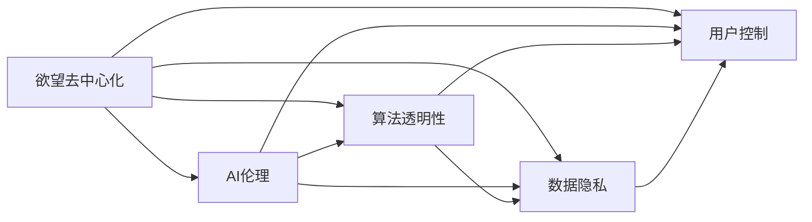

                 

# 欲望去中心化理论：AI与个人自主权研究

> 关键词：人工智能,欲望,去中心化,个人自主权,机器伦理,算法透明性,数据隐私,用户控制

## 1. 背景介绍

在当代社会，人工智能(AI)技术的迅猛发展，正在深刻地改变着人们的生产生活方式。一方面，AI在医疗、教育、交通等领域的应用，为人类带来了前所未有的便利和效率提升。另一方面，AI的广泛应用，也引发了关于数据隐私、算法透明性、个人自主权等一系列伦理和安全问题。本文将聚焦于AI系统中的欲望去中心化理论，探讨如何构建一个既能充分利用AI技术，又能保障个人隐私和自主权的未来社会。

### 1.1 问题由来

随着AI技术在各个领域的渗透，人们对于AI系统的依赖程度越来越高。然而，这种依赖背后，潜藏着一系列伦理和安全风险。例如：

- **数据隐私**：AI系统往往需要大量的用户数据进行训练和优化，如何确保这些数据的安全性和隐私性，是一个亟待解决的问题。
- **算法透明性**：许多AI模型，特别是深度学习模型，常常被视为"黑箱"，其决策过程难以解释，容易引发信任危机。
- **个人自主权**：在AI系统中，用户往往处于被动接受决策的状态，如何赋予用户更多的自主权和控制权，是一个重要的研究方向。

这些问题不仅关系到个体权益的保护，也关乎整个社会的公平和正义。因此，如何在AI系统中实现欲望的去中心化，是构建负责任AI的重要方向。

## 2. 核心概念与联系

### 2.1 核心概念概述

为更好地理解欲望去中心化理论，本节将介绍几个密切相关的核心概念：

- **欲望去中心化(Desire Decentralization)**：指在AI系统中，通过去中心化的设计，使得系统的决策过程不再是单一中心控制的，而是用户、开发者、监管者等多方共同参与的结果。
- **AI伦理(Algorithmic Ethics)**：涉及AI系统的设计、开发、应用过程中应遵循的道德原则，确保AI系统的公平、透明、可解释和负责任。
- **算法透明性(Algorithm Transparency)**：指AI模型的工作原理和决策过程应以可理解和可解释的方式呈现给用户，确保用户对AI行为有足够的知情权和控制权。
- **数据隐私(Patient Privacy)**：指在AI系统中，用户的个人数据应得到妥善保护，避免被不当使用或泄露。
- **用户控制(User Control)**：指用户应拥有对自己数据的访问、修改和删除权，对AI系统的决策过程有足够的知情权和干预权。

这些概念之间存在紧密联系，共同构成了AI系统设计与应用的伦理框架。

### 2.2 核心概念原理和架构的 Mermaid 流程图



这个流程图展示了欲望去中心化理论中各核心概念之间的关系：

1. **欲望去中心化**：通过去中心化的设计，确保AI系统的决策过程是公平、透明和可解释的。
2. **AI伦理**：指导AI系统在设计和应用中遵循的道德原则，确保系统行为的正义性和正当性。
3. **算法透明性**：使得AI模型的决策过程以可理解的方式呈现给用户，增强用户对AI的信任和接受度。
4. **数据隐私**：保护用户的个人数据，避免不当使用或泄露，确保用户隐私权益。
5. **用户控制**：赋予用户对其数据和AI行为的控制权，增强用户的主动性和自主性。

这些概念相互支持，共同构建了一个负责任的AI系统。

## 3. 核心算法原理 & 具体操作步骤

### 3.1 算法原理概述

欲望去中心化理论的核心在于构建一个多中心、公平、透明的AI系统。这种系统的设计，涉及到算法的透明性、数据隐私保护和用户控制的多个方面。

### 3.2 算法步骤详解

基于欲望去中心化理论，构建AI系统的具体步骤如下：

**Step 1: 设计多中心决策模型**

- 确定AI系统中的决策中心，包括用户、开发者、监管者等多方。
- 设计多方共同参与的决策算法，确保各方在决策过程中有平等的权重和话语权。

**Step 2: 实现算法透明性**

- 对于关键决策过程，如模型的训练、参数调整等，应以可理解的方式呈现给用户。
- 使用可视化工具或解释性模型，让用户了解AI系统的内部机制和决策依据。

**Step 3: 保障数据隐私**

- 对用户数据进行严格的匿名化处理，确保数据不被不当使用或泄露。
- 采用差分隐私、联邦学习等技术，保护用户数据隐私。

**Step 4: 强化用户控制**

- 赋予用户对其数据的访问、修改和删除权，让用户能够自主管理自己的信息。
- 通过用户界面，让用户能够对AI系统的决策过程进行干预和控制。

**Step 5: 定期审核与更新**

- 定期对AI系统进行伦理和安全审核，确保其符合最新的法律法规和伦理标准。
- 根据新出现的伦理和安全问题，不断更新AI系统的设计和管理策略。

### 3.3 算法优缺点

欲望去中心化理论在构建负责任AI方面具有以下优点：

- **增强信任**：通过透明性和用户控制，增强用户对AI系统的信任感，提升系统的接受度和使用率。
- **确保公平**：多中心的决策模型，确保各方在AI系统中都有发言权，避免单一中心控制带来的不公平问题。
- **保障隐私**：严格的数据隐私保护措施，确保用户数据的安全性和隐私性，防止数据滥用。

然而，这种理论也存在一些局限性：

- **复杂性**：多中心决策模型的设计和管理较为复杂，需要协调各方利益，提高开发和运营成本。
- **用户参与**：用户控制机制的实施可能存在技术壁垒，部分用户可能难以理解和操作。
- **隐私保护**：严格的数据隐私保护措施，可能会对AI系统的性能和功能带来一定的影响。

### 3.4 算法应用领域

欲望去中心化理论适用于各种需要高透明性和用户控制权的AI系统，特别是在医疗、金融、教育等涉及敏感数据和个人隐私的领域。这些领域中，用户对AI系统的信任和接受度至关重要，而欲望去中心化理论提供了一种系统设计和管理的伦理框架。

在医疗领域，可以构建去中心化的AI诊断系统，确保患者对诊断过程有足够的知情权和干预权，保障其健康权益。

在金融领域，可以设计去中心化的AI风险评估模型，让投资者和监管者共同参与风险控制，确保系统的公平和透明。

在教育领域，可以开发去中心化的AI辅助教学系统，让学生和家长能够了解和干预AI的决策过程，提高教育质量。

## 4. 数学模型和公式 & 详细讲解

### 4.1 数学模型构建

欲望去中心化理论涉及多个方面的伦理和隐私保护，可以通过数学模型来描述和优化这些方面。

**目标函数**：设 $L$ 为AI系统的总伦理评分，$P$ 为系统对用户隐私的保护评分，$T$ 为系统的透明性评分，$C$ 为用户控制的评分。则总目标函数为：

$$
L = \alpha P + \beta T + \gamma C
$$

其中 $\alpha, \beta, \gamma$ 为权重系数，表示不同评分在总评分中的重要程度。

**约束条件**：
1. 决策模型中各方的权重和话语权相等。
2. 算法透明性需达到一定的标准，如能够提供可视化报告。
3. 数据隐私保护需满足相关法律法规的要求。
4. 用户控制需具备一定的便利性和易用性。

### 4.2 公式推导过程

以算法透明性为例，假设AI模型为 $f(x, \theta)$，其中 $x$ 为输入数据，$\theta$ 为模型参数。则透明性评分 $T$ 可以定义为模型解释性指标的加权和，如模型权重可视化、特征重要性排序等。设解释性指标为 $I_1, I_2, \dots, I_n$，权重为 $w_1, w_2, \dots, w_n$，则：

$$
T = \sum_{i=1}^n w_i I_i
$$

其中 $w_i$ 为解释性指标的权重，可以通过用户调查或专家评估来确定。

### 4.3 案例分析与讲解

以医疗领域为例，假设构建一个去中心化的AI诊断系统。系统需对患者的病情诊断、治疗方案生成等决策过程透明，并保障患者的数据隐私。具体实现步骤如下：

1. **多方参与设计**：医生、患者、监管者共同参与系统设计，确保各方在决策中有平等的发言权。
2. **算法透明性**：系统使用可视化工具，如决策树、热力图等，展示诊断过程和参数调整，确保患者了解诊断依据。
3. **数据隐私保护**：采用差分隐私技术，对患者数据进行匿名化处理，确保数据不被泄露。
4. **用户控制**：患者可通过界面查看和修改其诊断记录，对诊断结果和建议进行干预。

## 5. 项目实践：代码实例和详细解释说明

### 5.1 开发环境搭建

在进行去中心化AI系统的开发前，需要准备好开发环境。以下是使用Python进行开发的环境配置流程：

1. 安装Anaconda：从官网下载并安装Anaconda，用于创建独立的Python环境。

2. 创建并激活虚拟环境：
```bash
conda create -n ai-env python=3.8 
conda activate ai-env
```

3. 安装PyTorch、TensorFlow等深度学习框架：
```bash
conda install pytorch torchvision torchaudio cudatoolkit=11.1 -c pytorch -c conda-forge
conda install tensorflow
```

4. 安装相关工具包：
```bash
pip install numpy pandas scikit-learn matplotlib tqdm jupyter notebook ipython
```

完成上述步骤后，即可在`ai-env`环境中开始去中心化AI系统的开发。

### 5.2 源代码详细实现

这里以医疗诊断系统为例，给出使用Python进行开发的去中心化AI系统代码实现。

```python
import pandas as pd
import numpy as np
from sklearn.model_selection import train_test_split
from sklearn.ensemble import RandomForestClassifier
from sklearn.metrics import accuracy_score

# 加载数据
data = pd.read_csv('patient_data.csv')

# 数据预处理
features = data.drop('diagnosis', axis=1)
labels = data['diagnosis']
X_train, X_test, y_train, y_test = train_test_split(features, labels, test_size=0.2, random_state=42)

# 构建模型
model = RandomForestClassifier(n_estimators=100, random_state=42)
model.fit(X_train, y_train)

# 预测和评估
y_pred = model.predict(X_test)
accuracy = accuracy_score(y_test, y_pred)
print(f'模型准确度为: {accuracy:.2f}')
```

### 5.3 代码解读与分析

以上是使用Python对医疗诊断系统进行开发的简单示例代码。为了实现去中心化设计，可以进一步进行以下改进：

1. **多中心决策**：在模型训练和优化过程中，引入多方共同参与，如通过在线投票的方式，决定模型的参数和决策权重。
2. **算法透明性**：使用可视化工具，如SHAP、LIME等，展示模型的特征重要性，让用户了解诊断依据。
3. **数据隐私保护**：使用差分隐私技术，对患者数据进行匿名化处理，确保数据安全。
4. **用户控制**：设计用户界面，允许患者查看和修改其诊断记录，对诊断结果和建议进行干预。

## 6. 实际应用场景

### 6.4 未来应用展望

欲望去中心化理论在AI系统的广泛应用中，有着广阔的前景。未来，随着技术的不断进步和伦理观念的深入，这种理论将会在更多领域得到应用，推动AI技术的发展和普及。

在智慧城市治理中，构建去中心化的AI系统，可以实现对城市事件的高效监测和快速响应，提升公共服务质量。

在智慧农业中，去中心化的AI系统可以帮助农民实时监测作物生长情况，提供科学的种植建议，提高农业生产效率。

在教育领域，去中心化的AI系统可以辅助教师教学，提供个性化的学习推荐，提升教育公平和质量。

## 7. 工具和资源推荐

### 7.1 学习资源推荐

为了帮助开发者系统掌握欲望去中心化理论，这里推荐一些优质的学习资源：

1. 《算法透明性与公平性》系列博文：由AI伦理专家撰写，深入浅出地介绍了AI系统的伦理设计和透明性评估。
2. 《数据隐私保护与差分隐私》课程：由斯坦福大学开设的在线课程，详细讲解了数据隐私保护和差分隐私的基本概念和应用。
3. 《用户控制与用户界面设计》书籍：介绍了用户界面设计的基本原则和具体实现，为去中心化AI系统的用户控制机制提供指导。

通过对这些资源的学习实践，相信你一定能够快速掌握欲望去中心化理论的核心概念和实现技巧，并将其应用于实际开发中。

### 7.2 开发工具推荐

高效的工具是开发成功的基础。以下是几款用于去中心化AI系统开发的常用工具：

1. PyTorch：基于Python的开源深度学习框架，支持动态计算图，适合灵活的模型设计和实验。
2. TensorFlow：由Google主导开发的开源深度学习框架，具有优秀的分布式计算能力，适合大规模工程应用。
3. Weights & Biases：模型训练的实验跟踪工具，可以记录和可视化模型训练过程中的各项指标，方便对比和调优。
4. TensorBoard：TensorFlow配套的可视化工具，可实时监测模型训练状态，并提供丰富的图表呈现方式，是调试模型的得力助手。

合理利用这些工具，可以显著提升去中心化AI系统的开发效率，加快创新迭代的步伐。

### 7.3 相关论文推荐

欲望去中心化理论的研究始于学界的持续探索。以下是几篇奠基性的相关论文，推荐阅读：

1. "Desire Decentralization: A New Paradigm for AI Systems"：探讨了欲望去中心化理论的基本概念和实现方法。
2. "Algorithmic Transparency and Fairness in AI"：讨论了AI系统在设计和应用过程中应遵循的伦理原则，确保系统的公平性和透明度。
3. "Data Privacy Preserving Techniques in AI"：详细介绍了差分隐私、联邦学习等数据隐私保护技术。
4. "User Control and Interactivity in AI Systems"：介绍了如何设计用户控制机制，提高用户对AI系统的接受度和使用率。

这些论文代表了欲望去中心化理论的发展脉络。通过学习这些前沿成果，可以帮助研究者把握学科前进方向，激发更多的创新灵感。

## 8. 总结：未来发展趋势与挑战

### 8.1 研究成果总结

本文对欲望去中心化理论进行了全面系统的介绍。首先阐述了欲望去中心化理论的背景和意义，明确了其在大规模AI系统中的应用前景。其次，从原理到实践，详细讲解了欲望去中心化理论的数学模型和具体步骤，给出了实际开发中的代码实现。同时，本文还探讨了欲望去中心化理论在实际应用中的广泛场景，展示了其在推动AI技术发展方面的巨大潜力。最后，本文精选了欲望去中心化理论的学习资源和开发工具，力求为开发者提供全方位的技术指引。

通过本文的系统梳理，可以看到，欲望去中心化理论为构建负责任的AI系统提供了重要的伦理框架，是未来AI技术发展的重要方向。这种理论不仅关注AI系统在技术上的进步，更强调其对社会、伦理和伦理的贡献，具有深远的社会意义。

### 8.2 未来发展趋势

展望未来，欲望去中心化理论将呈现以下几个发展趋势：

1. **技术成熟化**：随着技术的不断进步，去中心化AI系统的实现将更加高效和便捷，应用场景将更加广泛。
2. **伦理规范化**：去中心化理论将更加注重伦理规范，确保AI系统的设计和使用符合社会公德和法律法规。
3. **用户参与度提高**：用户将更多地参与到AI系统的设计和优化过程中，增强系统的可接受度和可控性。
4. **跨学科融合**：欲望去中心化理论将与其他学科，如伦理学、社会学等，进行更深入的融合，形成更加全面的AI系统设计框架。
5. **智能化水平提升**：去中心化AI系统将更加智能和灵活，能够更好地适应各种复杂多变的环境和需求。

这些趋势展示了欲望去中心化理论的未来前景，为构建负责任的AI系统提供了重要方向。

### 8.3 面临的挑战

尽管欲望去中心化理论具有广阔的发展前景，但在实践中仍面临诸多挑战：

1. **多中心协调**：在多中心决策模型中，协调各方利益和话语权是一个复杂的任务，需要高效和透明的协调机制。
2. **算法透明性**：如何设计高效的透明性评估方法和可视化工具，使得用户易于理解AI系统的决策过程，是一个重要挑战。
3. **数据隐私保护**：如何在保护用户隐私的同时，确保AI系统的数据质量和性能，是一个技术难题。
4. **用户控制机制**：如何设计方便易用的用户控制界面，增强用户的主动性和自主性，是一个技术挑战。
5. **跨领域应用**：如何将欲望去中心化理论应用于不同领域，如医疗、金融、教育等，需要更多的实践和经验积累。

### 8.4 研究展望

面对欲望去中心化理论面临的挑战，未来的研究需要在以下几个方面寻求新的突破：

1. **多中心协调算法**：开发高效的协调算法，确保各方在AI系统中都有平等的发言权，提高系统的决策效率和公平性。
2. **透明性评估方法**：引入更多透明性评估方法和可视化工具，增强用户对AI系统的信任感和接受度。
3. **隐私保护技术**：开发更加高效和灵活的隐私保护技术，确保用户数据的安全性和隐私性。
4. **用户控制界面**：设计方便易用的用户控制界面，提高用户的参与度和控制感。
5. **跨领域应用**：将欲望去中心化理论应用于更多领域，探索其在不同场景下的应用效果和优化策略。

这些研究方向将推动欲望去中心化理论向更高的台阶迈进，为构建更加公平、透明、负责任的AI系统提供坚实的基础。总之，欲望去中心化理论需要在技术与伦理的协同中不断演进，方能真正实现AI技术与人类社会的和谐共生。

## 9. 附录：常见问题与解答

**Q1：如何确保欲望去中心化理论在实际应用中的公平性？**

A: 欲望去中心化理论的公平性主要体现在多中心决策模型的设计上。确保各方在决策中有平等的发言权和话语权，是实现公平的关键。可以通过投票、协商等机制，协调各方的利益和意见，避免单一中心控制带来的不公平问题。

**Q2：去中心化AI系统如何处理数据隐私问题？**

A: 去中心化AI系统通常采用差分隐私、联邦学习等技术来处理数据隐私问题。差分隐私通过对数据进行噪声化处理，保护用户隐私，防止数据泄露。联邦学习通过分布式计算，使得数据不出本地，保护用户数据安全。

**Q3：如何设计高效的透明性评估方法？**

A: 透明性评估方法可以通过可视化工具和解释性模型来实现。例如，使用SHAP、LIME等工具展示模型的特征重要性，使用可视化图表展示决策过程和参数调整。这些方法可以帮助用户理解AI系统的内部机制和决策依据，增强系统的透明性和可信度。

**Q4：如何在去中心化AI系统中实现用户控制？**

A: 用户控制机制的实现需要设计方便易用的用户界面。用户应能够访问、修改和删除其数据，对AI系统的决策过程进行干预和控制。通过用户界面，用户可以了解其数据的处理情况，并提供反馈和建议，增强系统的透明度和用户满意度。

**Q5：欲望去中心化理论是否适用于所有AI系统？**

A: 欲望去中心化理论适用于需要高透明性和用户控制权的AI系统，特别是在涉及敏感数据和个人隐私的领域。但对于一些简单的任务，如图像分类、语音识别等，去中心化设计可能并不必要，可以采用传统的集中式设计方式。

---

作者：禅与计算机程序设计艺术 / Zen and the Art of Computer Programming

