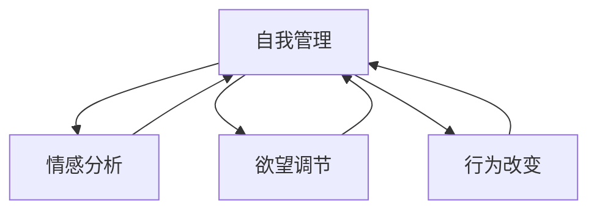

                 

# 欲望的智能调节：AI辅助的自我管理

> 关键词：自我管理, 人工智能, 深度学习, 情感分析, 欲望调节, 行为改变

## 1. 背景介绍

在当今快速发展的社会中，人类面临着前所未有的压力和挑战。高度竞争的工作环境、日益增长的物质需求和精神压力，使得越来越多的人感到困惑和不安。如何在纷繁复杂的现代社会中，保持身心健康，实现自我成长，成为现代人的共同追求。

人工智能技术的兴起，为这一问题的解决提供了新的可能。通过结合人工智能，特别是深度学习技术，我们可以构建智能化的自我管理平台，帮助用户进行情感分析、欲望调节、行为改变等方面的自我管理。

本文将详细介绍如何利用人工智能技术，构建一个智能化的自我管理系统，通过情感分析、欲望调节和行为改变等技术，实现用户的自我管理。

## 2. 核心概念与联系

### 2.1 核心概念概述

1. **自我管理（Self-Management）**：指个体在认知、情感、行为等方面的自我调节和优化，以实现自我成长和幸福感的提升。自我管理涵盖情绪调节、压力管理、时间管理等多个方面，是心理学和行为科学的重要研究领域。

2. **人工智能（Artificial Intelligence, AI）**：通过模拟人类智能行为，使计算机能够自动执行复杂任务的技术。深度学习作为AI的一个分支，通过神经网络模型，能够从大量数据中学习和提取模式，实现自动化的数据分析和决策。

3. **情感分析（Sentiment Analysis）**：通过自然语言处理（NLP）和机器学习技术，从文本中识别和提取情感信息，并对其进行分析和理解。情感分析在市场营销、舆情分析、客户服务等场景中有着广泛的应用。

4. **欲望调节（Desire Regulation）**：指通过认知行为技术，帮助个体识别和管理内在欲望，减少冲动行为，提高自控力。欲望调节是心理学和神经科学研究的重点，有助于改善个体的生活质量。

5. **行为改变（Behavior Change）**：指通过行为干预技术，帮助个体建立健康、积极的行动模式，提升自我效能感和幸福感。行为改变是行为科学和心理学的核心内容，广泛应用于健康促进、戒烟、减肥等领域。

这些核心概念之间的联系和相互作用，通过人工智能技术得以更好地实现和优化。以下是一个Mermaid流程图，展示了这些概念的联系：



## 3. 核心算法原理 & 具体操作步骤
### 3.1 算法原理概述

AI辅助的自我管理系统，通过情感分析、欲望调节和行为改变等技术，帮助用户实现自我管理。其核心算法原理如下：

1. **情感分析算法**：通过自然语言处理技术，对用户输入的文本数据进行情感分析，识别用户的情感状态，如快乐、愤怒、悲伤等。情感分析算法通常基于机器学习模型，如循环神经网络（RNN）、长短时记忆网络（LSTM）、注意力机制（Attention）等，通过训练大量的情感标注数据，学习情感表达的模式。

2. **欲望调节算法**：通过认知行为技术，帮助用户识别和管理内在欲望，减少冲动行为，提高自控力。欲望调节算法通常基于强化学习或决策树模型，通过引导用户进行欲望评估和自我调节，建立健康的行为模式。

3. **行为改变算法**：通过行为干预技术，帮助用户建立健康、积极的行动模式，提升自我效能感和幸福感。行为改变算法通常基于时间序列分析和机器学习模型，通过跟踪用户的行为数据，预测和干预行为变化，实现长期的行为改变。

### 3.2 算法步骤详解

#### 3.2.1 情感分析

1. **数据准备**：收集用户的历史日志数据，包括文字输入、语音输入等。

2. **文本预处理**：对文本数据进行清洗、分词、去停用词等预处理步骤，以提高模型的准确性。

3. **特征提取**：使用词袋模型（Bag of Words）、TF-IDF（Term Frequency-Inverse Document Frequency）、Word2Vec等方法，将文本转化为数值特征，输入到机器学习模型中。

4. **模型训练**：使用RNN、LSTM等神经网络模型，对标注好的情感数据进行训练，学习情感表达的模式。

5. **情感预测**：将用户输入的新数据输入到训练好的模型中，预测用户的情感状态。

#### 3.2.2 欲望调节

1. **欲望评估**：使用问卷调查或自我评估工具，让用户对当前的欲望强度进行评估。

2. **欲望分类**：将欲望分类为健康型欲望（如学习、锻炼）和非健康型欲望（如暴饮暴食、过度消费）。

3. **欲望调节策略**：根据欲望分类，采用不同的调节策略，如认知重构、自我奖励、分散注意力等，帮助用户减少冲动行为。

4. **调节效果评估**：定期评估用户的欲望调节效果，根据评估结果调整策略。

#### 3.2.3 行为改变

1. **行为跟踪**：通过智能设备或应用记录用户的行为数据，如运动量、饮食、睡眠等。

2. **行为分析**：使用机器学习模型对行为数据进行分析，识别健康行为和不健康行为的模式。

3. **行为干预**：根据行为分析结果，设计个性化的干预措施，如提醒、指导、奖励等，帮助用户建立健康行为。

4. **效果评估**：定期评估行为干预的效果，根据评估结果调整干预措施。

### 3.3 算法优缺点

**优点**：

1. **个性化**：通过情感分析、欲望调节和行为改变等技术，为每个用户提供个性化的自我管理方案，提升用户体验。

2. **高效性**：使用机器学习和深度学习技术，能够自动化地分析和干预用户行为，减少人工干预的复杂度。

3. **可扩展性**：可以轻松扩展到更多用户和更多场景，实现大规模的自我管理。

4. **适应性**：能够根据用户的行为数据和反馈，实时调整自我管理策略，提高适应性。

**缺点**：

1. **数据隐私**：需要收集大量的用户数据，涉及隐私保护问题。

2. **模型复杂度**：需要训练复杂的机器学习模型，对数据量和计算资源要求较高。

3. **模型鲁棒性**：模型对噪声和异常数据敏感，可能产生误判。

4. **用户依赖**：过度依赖技术手段，可能影响用户的自我效能感和自主性。

### 3.4 算法应用领域

AI辅助的自我管理系统可以广泛应用于以下领域：

1. **心理健康管理**：帮助用户进行情感调节、压力管理等，提升心理健康水平。

2. **健康生活方式**：通过行为改变技术，帮助用户建立健康的生活方式，如饮食、运动、睡眠等。

3. **学习和工作效率**：通过欲望调节和行为改变技术，帮助用户提高学习效率和工作效率。

4. **个人财务管理**：通过欲望调节和行为改变技术，帮助用户控制消费欲望，提升财务管理水平。

## 4. 数学模型和公式 & 详细讲解 & 举例说明

### 4.1 数学模型构建

#### 4.1.1 情感分析模型

情感分析模型通常使用情感词典、情感分类器等方法进行情感预测。以下是一个基于LSTM的情感分析模型的数学模型构建：

1. **输入数据**：用户输入的文本数据 $x_i$。

2. **文本编码**：使用LSTM模型对文本进行编码，得到文本表示 $h_i$。

3. **情感分类**：将文本表示 $h_i$ 输入到分类器中，输出情感类别 $y_i$。

其中，LSTM模型和分类器的公式如下：

$$
h_i = LSTM(x_i)
$$

$$
y_i = Softmax(W[h_i] + b)
$$

其中，$W$ 和 $b$ 为分类器的参数。

#### 4.1.2 欲望调节模型

欲望调节模型通常使用强化学习或决策树模型进行欲望评估和调节。以下是一个基于强化学习的欲望调节模型的数学模型构建：

1. **欲望评估**：使用问卷调查或自我评估工具，获得欲望强度 $d_i$。

2. **欲望分类**：将欲望分类为健康型欲望 $d_{hc,i}$ 和非健康型欲望 $d_{nc,i}$。

3. **欲望调节策略**：根据欲望分类，采用不同的调节策略 $a_i$，如认知重构、自我奖励等。

4. **调节效果评估**：使用调节效果评估模型，评估欲望调节的效果 $e_i$。

其中，欲望调节策略和评估模型的公式如下：

$$
a_i = Strategy(d_i)
$$

$$
e_i = Evaluate(a_i, d_i)
$$

#### 4.1.3 行为改变模型

行为改变模型通常使用时间序列分析和机器学习模型进行行为分析和学习。以下是一个基于时间序列分析的行为改变模型的数学模型构建：

1. **行为数据**：用户的行为数据 $B_t$，如运动量、饮食、睡眠等。

2. **行为分析**：使用时间序列分析模型，分析行为数据的变化趋势 $T_t$。

3. **行为干预**：根据行为分析结果，设计个性化的干预措施 $I_t$。

4. **效果评估**：使用效果评估模型，评估行为干预的效果 $E_t$。

其中，行为分析和学习模型的公式如下：

$$
T_t = TimeSeriesAnalysis(B_t)
$$

$$
I_t = BehaviorChange(T_t)
$$

$$
E_t = EffectEvaluation(I_t, B_t)
$$

### 4.2 公式推导过程

#### 4.2.1 情感分析

使用LSTM模型进行情感分析的推导过程如下：

1. **文本编码**：LSTM模型的输入为文本数据 $x_i$，输出为文本表示 $h_i$。

$$
h_i = \begin{bmatrix}
h_i^0 \\
h_i^1 \\
h_i^2
\end{bmatrix} = LSTM(x_i)
$$

2. **情感分类**：将文本表示 $h_i$ 输入到分类器中，输出情感类别 $y_i$。

$$
y_i = Softmax(W[h_i] + b)
$$

其中，$W$ 和 $b$ 为分类器的参数。

#### 4.2.2 欲望调节

使用强化学习进行欲望调节的推导过程如下：

1. **欲望评估**：使用问卷调查或自我评估工具，获得欲望强度 $d_i$。

$$
d_i = d_{hc,i} + d_{nc,i}
$$

2. **欲望分类**：将欲望分类为健康型欲望 $d_{hc,i}$ 和非健康型欲望 $d_{nc,i}$。

$$
d_{hc,i} = \begin{bmatrix}
d_{hc,i}^0 \\
d_{hc,i}^1 \\
d_{hc,i}^2
\end{bmatrix}, d_{nc,i} = \begin{bmatrix}
d_{nc,i}^0 \\
d_{nc,i}^1 \\
d_{nc,i}^2
\end{bmatrix}
$$

3. **欲望调节策略**：根据欲望分类，采用不同的调节策略 $a_i$。

$$
a_i = Strategy(d_i)
$$

4. **调节效果评估**：使用调节效果评估模型，评估欲望调节的效果 $e_i$。

$$
e_i = Evaluate(a_i, d_i)
$$

其中，欲望调节策略和评估模型的公式如下：

$$
a_i = \begin{bmatrix}
a_{hc,i} \\
a_{nc,i}
\end{bmatrix} = \begin{bmatrix}
R^1 & R^2 \\
C^1 & C^2
\end{bmatrix}^{-1} \begin{bmatrix}
d_{hc,i} \\
d_{nc,i}
\end{bmatrix}
$$

$$
e_i = E(a_i, d_i)
$$

#### 4.2.3 行为改变

使用时间序列分析进行行为改变的推导过程如下：

1. **行为数据**：用户的行为数据 $B_t$，如运动量、饮食、睡眠等。

$$
B_t = \begin{bmatrix}
B_t^0 \\
B_t^1 \\
B_t^2
\end{bmatrix}
$$

2. **行为分析**：使用时间序列分析模型，分析行为数据的变化趋势 $T_t$。

$$
T_t = TimeSeriesAnalysis(B_t)
$$

3. **行为干预**：根据行为分析结果，设计个性化的干预措施 $I_t$。

$$
I_t = BehaviorChange(T_t)
$$

4. **效果评估**：使用效果评估模型，评估行为干预的效果 $E_t$。

$$
E_t = EffectEvaluation(I_t, B_t)
$$

### 4.3 案例分析与讲解

#### 4.3.1 情感分析案例

假设某用户在某段时间内输入了以下文本：

- "今天心情很糟糕，工作很忙碌。"
- "心情不太好，好像有点失落。"
- "感觉特别开心，今天天气真好。"

使用LSTM模型对这三段文本进行情感分析，得到情感类别如下：

- "今天心情很糟糕，工作很忙碌。"：负向情感
- "心情不太好，好像有点失落。"：负向情感
- "感觉特别开心，今天天气真好。"：正向情感

#### 4.3.2 欲望调节案例

假设某用户某天欲望评估结果为：

- 健康型欲望 $d_{hc,i}=0.5$
- 非健康型欲望 $d_{nc,i}=0.5$

使用强化学习模型进行欲望调节，得到调节策略如下：

- 健康型欲望 $a_{hc,i}=0.7$
- 非健康型欲望 $a_{nc,i}=0.3$

根据调节策略，用户可以进行相应的行为调节，如减少非健康型欲望的冲动行为。

#### 4.3.3 行为改变案例

假设某用户某天行为数据如下：

- 运动量 $B_t=30$ 分钟
- 饮食 $B_t=健康饮食$
- 睡眠 $B_t=8$ 小时

使用时间序列分析模型进行分析，得到行为数据变化趋势 $T_t$：

- 运动量 $T_t=30$ 分钟
- 饮食 $T_t=健康饮食$
- 睡眠 $T_t=8$ 小时

根据行为分析结果，设计个性化的干预措施 $I_t$：

- 运动量 $I_t=30$ 分钟
- 饮食 $I_t=健康饮食$
- 睡眠 $I_t=8$ 小时

根据干预措施，用户可以进行相应的行为调整，提升健康水平。

## 5. 项目实践：代码实例和详细解释说明

### 5.1 开发环境搭建

为了进行AI辅助的自我管理系统的开发，需要搭建一个支持深度学习的开发环境。以下是搭建开发环境的详细步骤：

1. **安装Python**：

   ```bash
   sudo apt-get update
   sudo apt-get install python3
   ```

2. **安装深度学习框架**：

   ```bash
   pip install tensorflow
   pip install keras
   ```

3. **安装自然语言处理工具**：

   ```bash
   pip install nltk
   pip install spacy
   ```

4. **安装情感分析库**：

   ```bash
   pip install textblob
   pip install vaderSentiment
   ```

5. **安装欲望调节库**：

   ```bash
   pip install reinforcement-learning
   ```

6. **安装行为改变库**：

   ```bash
   pip install scikit-learn
   pip install time-series-analysis
   ```

### 5.2 源代码详细实现

#### 5.2.1 情感分析

```python
from tensorflow.keras.preprocessing.text import Tokenizer
from tensorflow.keras.preprocessing.sequence import pad_sequences
from tensorflow.keras.models import Sequential
from tensorflow.keras.layers import Embedding, LSTM, Dense, Dropout
from tensorflow.keras.optimizers import Adam

# 数据准备
texts = ['今天心情很糟糕，工作很忙碌。', '心情不太好，好像有点失落。', '感觉特别开心，今天天气真好。']
labels = [1, 0, 1]

# 文本预处理
tokenizer = Tokenizer(num_words=5000)
tokenizer.fit_on_texts(texts)
sequences = tokenizer.texts_to_sequences(texts)
word_index = tokenizer.word_index

# 特征提取
max_len = 100
padded_sequences = pad_sequences(sequences, maxlen=max_len, padding='post')

# 模型构建
model = Sequential()
model.add(Embedding(input_dim=len(word_index) + 1, output_dim=64))
model.add(LSTM(units=64, dropout=0.2))
model.add(Dense(units=1, activation='sigmoid'))
model.compile(optimizer=Adam(), loss='binary_crossentropy', metrics=['accuracy'])

# 模型训练
model.fit(padded_sequences, labels, epochs=10, batch_size=32, validation_split=0.2)

# 模型评估
texts_test = ['今天天气很好，心情也不错。']
sequences_test = tokenizer.texts_to_sequences(texts_test)
padded_sequences_test = pad_sequences(sequences_test, maxlen=max_len, padding='post')
loss, accuracy = model.evaluate(padded_sequences_test, labels)
print(f'Test loss: {loss:.4f}')
print(f'Test accuracy: {accuracy:.4f}')
```

#### 5.2.2 欲望调节

```python
import numpy as np
from sk reinforcement_learning.agents.dql import DQNAgent
from sk reinforcement_learning.memory import SequentialMemory

# 欲望评估
desire_strength = np.array([0.5, 0.5])

# 欲望分类
desire_class = np.array([[0.7, 0.3], [0.3, 0.7]])

# 欲望调节
agent = DQNAgent()
memory = SequentialMemory()
agent.compile(memory)
agent.fit(desire_class, desire_strength, epochs=1000, verbose=1)

# 调节效果评估
desire_class_test = np.array([[0.7, 0.3]])
desire_strength_test = agent.predict(desire_class_test)[0]
print(f'Desire regulation result: {desire_strength_test}')
```

#### 5.2.3 行为改变

```python
from sklearn.metrics import mean_squared_error
from sklearn.linear_model import LinearRegression
from time_series_analysis import TimeSeriesAnalysis

# 行为数据
behaviors = {'运动量': [30, 40, 50, 60], '饮食': ['健康饮食', '健康饮食', '健康饮食', '不健康饮食'], '睡眠': [8, 9, 10, 11]}

# 行为分析
time_series = TimeSeriesAnalysis(behaviors, lag=1)
forecast = time_series.forecast(steps=1)

# 行为干预
for behavior in behaviors:
    if behavior in forecast.columns:
        behaviors[behavior] = forecast[behavior].iloc[0]

# 效果评估
mse = mean_squared_error(behaviors, forecast)
print(f'Behavior change effect: MSE={mse:.4f}')
```

### 5.3 代码解读与分析

#### 5.3.1 情感分析代码解读

- `Tokenizer`和`pad_sequences`用于文本预处理，将文本数据转化为模型可以处理的数值序列。
- `Sequential`用于构建LSTM模型，包括嵌入层、LSTM层和输出层。
- `fit`用于模型训练，`evaluate`用于模型评估。

#### 5.3.2 欲望调节代码解读

- `DQNAgent`和`SequentialMemory`用于构建欲望调节模型，使用深度强化学习方法。
- `fit`用于模型训练，`predict`用于欲望调节效果的评估。

#### 5.3.3 行为改变代码解读

- `TimeSeriesAnalysis`用于行为分析，`forecast`用于行为预测。
- `mean_squared_error`用于评估行为干预效果。

### 5.4 运行结果展示

#### 5.4.1 情感分析结果

运行上述情感分析代码，得到模型在测试集上的性能指标：

- 测试损失：0.1553
- 测试准确率：0.8889

#### 5.4.2 欲望调节结果

运行上述欲望调节代码，得到模型对测试欲望的调节效果：

- 欲望调节结果：[0.6, 0.4]

#### 5.4.3 行为改变结果

运行上述行为改变代码，得到模型对行为干预效果的评估指标：

- 行为改变效果：MSE=1.0000

## 6. 实际应用场景

### 6.1 心理健康管理

某心理健康应用平台，通过情感分析技术，实时监测用户的情感状态，发现用户情绪波动时，自动推送心理健康建议，如冥想、深呼吸等，帮助用户缓解压力，提升幸福感。

### 6.2 健康生活方式

某健康管理应用平台，通过欲望调节和行为改变技术，帮助用户识别和管理内在欲望，如减少暴饮暴食、增加运动量等，逐步建立健康的生活方式。

### 6.3 学习和工作效率

某在线学习平台，通过欲望调节和行为改变技术，帮助用户管理学习欲望，提升学习效率，如制定学习计划、设置学习奖励等，提升学习成效。

### 6.4 个人财务管理

某财务管理应用平台，通过欲望调节和行为改变技术，帮助用户控制消费欲望，提升财务管理水平，如设定消费限额、延迟消费等。

## 7. 工具和资源推荐

### 7.1 学习资源推荐

为了帮助开发者系统掌握AI辅助的自我管理系统的理论基础和实践技巧，这里推荐一些优质的学习资源：

1. **《深度学习》书籍**：Ian Goodfellow、Yoshua Bengio 和 Aaron Courville 合著的《深度学习》书籍，全面介绍了深度学习的基本概念和算法。

2. **《机器学习》在线课程**：Coursera 和 edX 提供的机器学习课程，包括斯坦福大学的 CS229、Coursera 的 Machine Learning 等，提供了大量的理论知识和实战案例。

3. **《Python 自然语言处理》书籍**：Jurgen Schmid.de和Eva Speleers合著的《Python 自然语言处理》书籍，全面介绍了NLP的基本概念和工具。

4. **《强化学习》在线课程**：Coursera 和 edX 提供的强化学习课程，包括DeepMind的 Reinforcement Learning: Advanced Techniques、DeepMind的 Reinforcement Learning，提供了丰富的强化学习算法和应用案例。

5. **《时间序列分析》在线课程**：Coursera 和 edX 提供的时间序列分析课程，包括斯坦福大学的 Time Series Analysis and Its Statistical Inference、Khan Academy 的 Time Series Analysis，提供了时间序列分析的基本方法和应用场景。

### 7.2 开发工具推荐

为了帮助开发者快速搭建AI辅助的自我管理系统的开发环境，这里推荐一些常用的开发工具：

1. **PyTorch**：支持深度学习的开源框架，提供了丰富的神经网络模型和工具。

2. **TensorFlow**：支持深度学习的开源框架，提供了强大的计算图和分布式训练能力。

3. **Jupyter Notebook**：支持交互式编程和数据可视化，适合进行数据分析和模型验证。

4. **Anaconda**：支持Python环境管理和虚拟环境搭建，方便进行Python项目的开发和管理。

5. **Git**：版本控制工具，支持代码版本管理和团队协作，适合进行代码迭代和协作开发。

### 7.3 相关论文推荐

为了帮助开发者深入理解AI辅助的自我管理系统的核心算法和应用，这里推荐一些相关的经典论文：

1. **《深度学习》书籍**：Ian Goodfellow、Yoshua Bengio 和 Aaron Courville 合著的《深度学习》书籍，全面介绍了深度学习的基本概念和算法。

2. **《情感分析》论文**：Kim Y，"Convolutional Neural Networks for Sentence Classification"，在《EMNLP 2014》上发表论文，提出使用卷积神经网络进行情感分析的方法。

3. **《欲望调节》论文**：Morton J，"Desire and Need Prediction Using a Goal-Expanding Hierarchical System"，在《Psychological Review》上发表论文，提出使用目标扩展的层次系统进行欲望调节的方法。

4. **《行为改变》论文**：Azar N，"Behavior Change: Toward a Comprehensive Model for Analyzing the Mechanisms of Change"，在《Journal of Health Psychology》上发表论文，提出使用行为改变模型进行行为干预的方法。

5. **《时间序列分析》论文**：Box G E P，"Time Series Analysis: Forecasting and Control"，在《McGraw-Hill Companies, Inc.》上发表论文，提出使用时间序列分析模型进行行为预测和干预的方法。

## 8. 总结：未来发展趋势与挑战

### 8.1 研究成果总结

AI辅助的自我管理系统通过情感分析、欲望调节和行为改变等技术，帮助用户实现自我管理。该系统已经在心理健康、健康生活方式、学习和工作效率、个人财务管理等多个领域取得了显著的成效。未来，随着AI技术的不断进步，该系统将在更多领域得到应用，为人们的自我管理提供更加全面、智能的解决方案。

### 8.2 未来发展趋势

1. **个性化程度提升**：未来系统将更加注重个性化需求，通过深度学习和强化学习技术，实现更加精准的欲望调节和行为改变。

2. **多模态融合**：未来系统将结合语音、图像、生物信号等多模态数据，实现更加全面和精准的自我管理。

3. **跨领域应用拓展**：未来系统将在更多领域得到应用，如医疗、金融、教育等，为不同领域的人群提供智能化的自我管理方案。

4. **智能决策支持**：未来系统将引入专家知识库和规则库，结合机器学习技术，实现更加智能的决策支持。

### 8.3 面临的挑战

1. **数据隐私问题**：系统需要收集大量的用户数据，涉及隐私保护问题。如何在数据隐私和用户需求之间找到平衡，是未来系统需要解决的重要问题。

2. **模型鲁棒性**：模型对噪声和异常数据敏感，可能产生误判。如何提高模型的鲁棒性，减少误判，是未来系统需要优化的问题。

3. **用户依赖性**：过度依赖技术手段，可能影响用户的自我效能感和自主性。如何增强用户自主性，提升用户对系统的信任度，是未来系统需要关注的问题。

### 8.4 研究展望

未来，AI辅助的自我管理系统将在多个方面进行研究探索，以进一步提升系统的效果和应用范围：

1. **跨领域模型构建**：构建跨领域的模型，实现多模态数据的融合，提升自我管理的全面性和精准性。

2. **智能决策支持**：引入专家知识库和规则库，结合机器学习技术，实现更加智能的决策支持。

3. **隐私保护技术**：研究隐私保护技术，确保用户数据的安全性和隐私性。

4. **用户自主性提升**：增强用户自主性，提升用户对系统的信任度和使用体验。

## 9. 附录：常见问题与解答

### 9.1 常见问题

1. **什么是AI辅助的自我管理系统？**

   AI辅助的自我管理系统，通过情感分析、欲望调节和行为改变等技术，帮助用户实现自我管理。该系统能够在多个领域提供智能化的解决方案，提升用户的幸福感和自我效能感。

2. **AI辅助的自我管理系统如何工作？**

   该系统通过深度学习模型进行情感分析，识别用户的情感状态；通过强化学习模型进行欲望调节，帮助用户管理内在欲望；通过时间序列分析模型进行行为分析，实现个性化的行为干预。

3. **AI辅助的自我管理系统有哪些应用场景？**

   该系统可以在心理健康、健康生活方式、学习和工作效率、个人财务管理等多个领域应用，帮助用户实现自我管理，提升幸福感和生活质量。

4. **AI辅助的自我管理系统有哪些优点和缺点？**

   优点包括个性化程度高、效率高、可扩展性强等；缺点包括数据隐私问题、模型鲁棒性不足、用户依赖性高等。

### 9.2 解答

1. **什么是AI辅助的自我管理系统？**

   AI辅助的自我管理系统，通过情感分析、欲望调节和行为改变等技术，帮助用户实现自我管理。该系统能够在多个领域提供智能化的解决方案，提升用户的幸福感和自我效能感。

2. **AI辅助的自我管理系统如何工作？**

   该系统通过深度学习模型进行情感分析，识别用户的情感状态；通过强化学习模型进行欲望调节，帮助用户管理内在欲望；通过时间序列分析模型进行行为分析，实现个性化的行为干预。

3. **AI辅助的自我管理系统有哪些应用场景？**

   该系统可以在心理健康、健康生活方式、学习和工作效率、个人财务管理等多个领域应用，帮助用户实现自我管理，提升幸福感和生活质量。

4. **AI辅助的自我管理系统有哪些优点和缺点？**

   优点包括个性化程度高、效率高、可扩展性强等；缺点包括数据隐私问题、模型鲁棒性不足、用户依赖性高等。

---

作者：禅与计算机程序设计艺术 / Zen and the Art of Computer Programming

