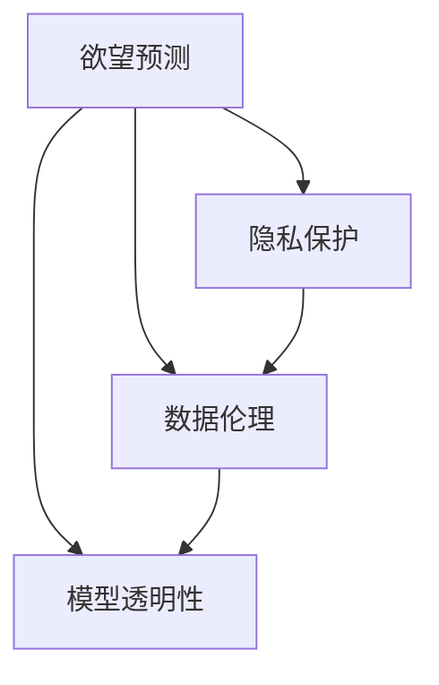

                 

# 欲望预测伦理委员会：AI时代的隐私保护机构

## 1. 背景介绍

### 1.1 问题由来

在快速发展的数字时代，人工智能(AI)技术正逐渐渗透到各个领域，从医疗、金融到零售、社交媒体，无处不在。而欲望预测，作为AI的一个重要应用方向，通过分析用户的在线行为、社交媒体动态、购买记录等数据，预测用户的潜在需求和行为，旨在提供更加个性化的服务。例如，电商平台的推荐系统可以基于用户的浏览记录和购买历史，预测用户可能感兴趣的商品，提升转化率和满意度。然而，欲望预测在带来便利的同时，也引发了一系列伦理和隐私问题，亟需建立一套完善的伦理监督和保护机制。

### 1.2 问题核心关键点

欲望预测的核心问题集中在隐私保护、数据伦理和模型透明性方面：

1. **隐私保护**：在收集和使用用户数据的过程中，如何保护用户的隐私，避免数据泄露和滥用，是欲望预测面临的首要问题。
2. **数据伦理**：欲望预测模型的训练和应用过程中，涉及数据的来源、处理方式和结果应用，如何确保数据使用的公平性和公正性，是另一重要议题。
3. **模型透明性**：欲望预测模型的决策过程往往复杂且难以解释，如何确保模型的透明性和可解释性，让用户在需要时能够理解模型的决策依据，也是一大挑战。

### 1.3 问题研究意义

研究和建立欲望预测伦理委员会，对于规范欲望预测的应用，保护用户隐私，提升社会公平，具有重要意义：

1. **规范欲望预测应用**：通过设立伦理委员会，制定相关标准和指南，可以有效避免欲望预测应用的滥用和误用，保障技术的健康发展。
2. **保护用户隐私**：建立完善的隐私保护机制，确保用户数据的安全和匿名性，防止数据泄露和滥用，提升用户对AI技术的信任度。
3. **提升社会公平**：确保欲望预测模型的公正性和公平性，避免算法偏见，提升社会整体福利，促进经济和社会的均衡发展。
4. **促进透明性**：提升欲望预测模型的透明性和可解释性，让用户和监管机构能够理解和监督模型的决策过程，保障AI技术的良性发展。

## 2. 核心概念与联系

### 2.1 核心概念概述

为更好地理解欲望预测伦理委员会的工作原理和结构，本节将介绍几个密切相关的核心概念：

- **欲望预测(Desire Prediction)**：通过分析用户的历史行为、社交媒体动态等数据，预测用户的潜在需求和行为，如购物欲望、旅游欲望、娱乐欲望等。
- **隐私保护(Privacy Protection)**：在欲望预测过程中，保护用户的个人信息和数据隐私，避免数据泄露和滥用。
- **数据伦理(Data Ethics)**：在欲望预测模型的训练和应用过程中，遵循伦理原则，确保数据使用的公平性和公正性。
- **模型透明性(Model Transparency)**：提升欲望预测模型的透明性和可解释性，让用户和监管机构能够理解和监督模型的决策过程。

这些核心概念之间的逻辑关系可以通过以下Mermaid流程图来展示：



这个流程图展示出欲望预测伦理委员会工作流程中的各个环节，包括隐私保护、数据伦理和模型透明性等核心概念，以及它们之间的内在联系。

## 3. 核心算法原理 & 具体操作步骤

### 3.1 算法原理概述

欲望预测的核心算法原理主要基于机器学习和深度学习技术。通过收集和分析用户的历史行为数据，如浏览记录、购买历史、社交媒体动态等，构建用户行为模型，预测其未来的欲望和行为。常见的算法包括协同过滤、基于内容的推荐、深度学习模型等。

欲望预测的算法流程一般包括以下几个关键步骤：

1. **数据收集**：从不同渠道收集用户的各类行为数据，包括线上行为、线下行为、社交媒体行为等。
2. **数据预处理**：对收集到的数据进行清洗、去重、归一化等预处理操作，确保数据的准确性和一致性。
3. **特征提取**：将预处理后的数据转化为模型的输入特征，如将文本数据转化为向量表示。
4. **模型训练**：使用训练集数据，训练欲望预测模型，调整模型参数，优化模型性能。
5. **欲望预测**：使用训练好的模型对新用户数据进行预测，输出用户的欲望或行为。

### 3.2 算法步骤详解

#### 3.2.1 数据收集与预处理

- **数据收集**：
  - 在线行为数据：如电商平台上的浏览记录、购买历史、搜索关键词等。
  - 社交媒体数据：如用户的社交媒体活动、点赞、评论、分享等。
  - 线下行为数据：如用户的地理位置、出行记录、消费记录等。

- **数据预处理**：
  - 数据清洗：去除噪声数据、缺失数据和异常值。
  - 数据归一化：对数据进行标准化或归一化处理，确保数据在不同维度上的可比性。
  - 特征选择：选择对欲望预测有较高贡献的特征，减少计算量和内存消耗。

#### 3.2.2 特征提取

- **文本特征提取**：
  - 词袋模型(Bag of Words)：将文本数据转化为词频向量，用于处理文本数据。
  - TF-IDF：考虑单词在文本中的频率和重要性的权重，用于文本向量化。
  - Word2Vec、BERT等词嵌入模型：将单词映射到低维向量空间，保留单词的语义信息。

- **时间序列特征提取**：
  - 滑动窗口：将时间序列数据分割成固定长度的窗口，用于处理时间相关的行为数据。
  - 移动平均：对时间序列数据进行移动平均处理，平滑数据趋势。

#### 3.2.3 模型训练与欲望预测

- **模型训练**：
  - 协同过滤(Collaborative Filtering)：基于用户行为数据，推荐相似用户或物品。
  - 基于内容的推荐(Content-Based Recommendation)：根据物品的特征，推荐符合用户兴趣的物品。
  - 深度学习模型：如多层感知器、卷积神经网络、循环神经网络等，用于处理复杂的用户行为数据。

- **欲望预测**：
  - 输入新用户数据，通过训练好的模型进行预测。
  - 输出用户的欲望或行为，如购物欲望、旅游欲望等。

### 3.3 算法优缺点

欲望预测算法具有以下优点：

1. **个性化服务**：通过分析用户行为数据，提供个性化的服务，提升用户体验和满意度。
2. **高效性**：利用机器学习和深度学习技术，处理大量数据，快速输出预测结果。
3. **灵活性**：支持多种数据源和特征类型，适应不同应用场景。

同时，该算法也存在以下局限性：

1. **数据依赖**：依赖高质量的数据，数据质量和数量不足可能影响模型效果。
2. **隐私风险**：收集和处理用户数据过程中，存在隐私泄露和滥用的风险。
3. **模型偏见**：如果训练数据存在偏见，模型可能产生不公平的预测结果。
4. **复杂性**：深度学习模型参数复杂，模型解释性和透明性不足。

### 3.4 算法应用领域

欲望预测技术广泛应用于多个领域，例如：

- **电商推荐**：根据用户的浏览记录和购买历史，推荐可能感兴趣的商品。
- **旅游推荐**：分析用户的旅游偏好，推荐适合的旅游目的地和活动。
- **内容推荐**：基于用户的阅读历史，推荐感兴趣的文章、视频、音乐等。
- **金融服务**：分析用户的金融行为，推荐理财产品和金融服务。
- **健康管理**：预测用户的健康需求，提供个性化的健康建议和干预。

除了上述这些经典应用外，欲望预测技术还在医疗、教育、社交媒体等多个领域得到应用，为人们的生活带来了便利和提升。

## 4. 数学模型和公式 & 详细讲解 & 举例说明

### 4.1 数学模型构建

在欲望预测中，我们通常使用如下数学模型：

- **用户行为数据**：$D=\{x_1, x_2, ..., x_n\}$，其中 $x_i$ 表示第 $i$ 个用户的特征向量。
- **欲望标签**：$y=\{y_1, y_2, ..., y_n\}$，其中 $y_i$ 表示第 $i$ 个用户的欲望标签。

欲望预测的目标是构建一个映射函数 $f$，将用户特征向量 $x_i$ 映射到欲望标签 $y_i$，即：

$$ y_i = f(x_i) $$

其中，$f$ 为预测函数。

### 4.2 公式推导过程

以协同过滤算法为例，假设用户 $i$ 对物品 $j$ 的评分数据为 $R_{ij}$，用户特征向量为 $x_i$，物品特征向量为 $x_j$，欲望标签为 $y_i$，协同过滤的目标是找到一个评分矩阵 $R$，使得：

$$ R = arg\min_{R} \| R - Y \|_F^2 $$

其中，$Y$ 为欲望标签矩阵，$\| \cdot \|_F$ 表示矩阵的 Frobenius 范数。

在协同过滤中，可以使用奇异值分解(SVD)方法对评分矩阵 $R$ 进行分解，得到 $R=U\Sigma V^T$，其中 $U$、$\Sigma$、$V$ 分别为左奇异矩阵、奇异值矩阵和右奇异矩阵。

协同过滤的预测函数可以表示为：

$$ \hat{y_i} = U_i V_j^T \Sigma $$

其中，$U_i$ 和 $V_j$ 分别为 $U$ 和 $V$ 矩阵中的第 $i$ 行和第 $j$ 列。

### 4.3 案例分析与讲解

假设有一个电商平台的推荐系统，需要预测用户的购物欲望。该系统收集了用户的浏览记录、购买历史和评价数据，构建了一个协同过滤模型。系统使用用户的历史评分数据训练模型，预测新用户对商品的欲望。

- **数据收集**：系统从电商平台收集用户的浏览记录、购买历史和评价数据。
- **数据预处理**：对收集到的数据进行清洗和归一化处理。
- **特征提取**：将用户浏览记录转化为词袋模型或TF-IDF向量，作为用户的特征向量。
- **模型训练**：使用用户的历史评分数据，训练协同过滤模型，调整模型参数。
- **欲望预测**：对新用户数据进行预测，输出用户的购物欲望。

## 5. 项目实践：代码实例和详细解释说明

### 5.1 开发环境搭建

在进行欲望预测的实践前，我们需要准备好开发环境。以下是使用Python进行Scikit-learn开发的环境配置流程：

1. 安装Anaconda：从官网下载并安装Anaconda，用于创建独立的Python环境。

2. 创建并激活虚拟环境：
```bash
conda create -n desire-prediction python=3.8 
conda activate desire-prediction
```

3. 安装Scikit-learn：
```bash
pip install scikit-learn
```

4. 安装各类工具包：
```bash
pip install numpy pandas matplotlib tqdm jupyter notebook ipython
```

完成上述步骤后，即可在`desire-prediction`环境中开始实践。

### 5.2 源代码详细实现

下面以协同过滤算法为例，给出使用Scikit-learn进行电商推荐系统的代码实现。

首先，定义协同过滤模型的类：

```python
from sklearn.neighbors import NearestNeighbors

class CollaborativeFiltering:
    def __init__(self, n_neighbors=50):
        self.model = NearestNeighbors(n_neighbors=n_neighbors)
        
    def fit(self, X, y):
        self.model.fit(X)
        
    def predict(self, X_test):
        _, indices = self.model.kneighbors(X_test)
        return self.model.kneighbors(X_test).T[1]
```

然后，构建数据集和模型实例：

```python
import pandas as pd
from sklearn.model_selection import train_test_split

# 加载数据集
data = pd.read_csv('data.csv')

# 分割训练集和测试集
train_data, test_data = train_test_split(data, test_size=0.2, random_state=42)

# 定义特征向量和欲望标签
X_train = train_data[['feature1', 'feature2', 'feature3']]
y_train = train_data['desire']
X_test = test_data[['feature1', 'feature2', 'feature3']]
y_test = test_data['desire']

# 构建模型实例
model = CollaborativeFiltering()

# 训练模型
model.fit(X_train, y_train)

# 预测测试集
y_pred = model.predict(X_test)
```

最后，评估模型性能：

```python
from sklearn.metrics import accuracy_score

# 计算准确率
accuracy = accuracy_score(y_test, y_pred)
print(f"Accuracy: {accuracy}")
```

以上就是使用Scikit-learn进行协同过滤算法电商推荐系统的完整代码实现。可以看到，利用Scikit-learn库，我们可以轻松实现协同过滤算法的电商推荐系统，进行数据预处理、模型训练和预测评估。

### 5.3 代码解读与分析

让我们再详细解读一下关键代码的实现细节：

**CollaborativeFiltering类**：
- `__init__`方法：初始化NearestNeighbors模型，设置邻居数。
- `fit`方法：使用训练数据拟合模型。
- `predict`方法：使用测试数据预测欲望标签。

**数据预处理**：
- `data.csv`：电商平台的推荐数据集，包含用户的浏览记录、购买历史和评价数据。
- `train_data`和`test_data`：将数据集分割为训练集和测试集，用于模型训练和评估。
- `X_train`和`X_test`：特征向量，包含用户的浏览记录、购买历史等数据。
- `y_train`和`y_test`：欲望标签，包含用户的购买欲望。

**模型训练**：
- `model.fit(X_train, y_train)`：使用训练数据拟合协同过滤模型，调整模型参数。

**欲望预测**：
- `y_pred = model.predict(X_test)`：使用测试数据预测用户的购买欲望。

可以看到，Scikit-learn库使得电商推荐系统的实现变得简洁高效。开发者可以将更多精力放在数据处理、模型改进等高层逻辑上，而不必过多关注底层的实现细节。

## 6. 实际应用场景

### 6.1 电商推荐系统

欲望预测在电商推荐系统中的应用，可以通过协同过滤算法实现。电商平台的推荐系统收集用户的浏览记录、购买历史和评价数据，构建用户行为模型，预测用户的购物欲望，从而提供个性化的商品推荐。

在技术实现上，可以收集用户的历史评分数据，构建协同过滤模型，通过预测新用户的购买欲望，生成个性化的推荐列表。推荐系统可以进一步集成多臂老虎机算法等优化策略，提高推荐的准确性和点击率。

### 6.2 旅游推荐系统

旅游推荐系统通过分析用户的旅游偏好，预测用户的旅行欲望，推荐适合的旅游目的地和活动。例如，一个旅游平台可以通过分析用户的浏览记录、搜索关键词和评分数据，构建用户行为模型，预测用户的旅游欲望，从而生成个性化的旅游推荐。

在技术实现上，可以收集用户的旅游历史数据和评分数据，构建协同过滤模型或基于内容的推荐模型，预测新用户的旅游欲望。旅游平台可以根据用户的偏好，推荐适合的旅游目的地、旅行线路和活动，提升用户的旅行体验。

### 6.3 内容推荐系统

内容推荐系统通过分析用户的阅读历史和评分数据，预测用户的阅读欲望，推荐感兴趣的文章、视频和音乐。例如，一个内容推荐平台可以通过分析用户的阅读记录、评分和评论数据，构建用户行为模型，预测用户的阅读欲望，从而生成个性化的内容推荐。

在技术实现上，可以收集用户的阅读历史和评分数据，构建协同过滤模型或基于内容的推荐模型，预测新用户的阅读欲望。内容平台可以根据用户的偏好，推荐感兴趣的内容，提升用户的阅读体验。

### 6.4 未来应用展望

随着欲望预测技术的不断发展，未来将在更多领域得到应用，为人们的生活带来便利和提升。

在智慧城市治理中，欲望预测技术可以用于预测居民的需求和行为，提供个性化的公共服务，提升城市的智能化水平。

在医疗健康领域，欲望预测技术可以用于预测患者的健康需求，提供个性化的健康建议和干预，提升医疗服务的效率和质量。

在社交媒体中，欲望预测技术可以用于预测用户的兴趣和行为，提供个性化的内容推荐和互动，提升用户体验。

此外，欲望预测技术还将与其他人工智能技术进行更深入的融合，如知识表示、因果推理、强化学习等，为构建人机协同的智能系统提供新的思路。

## 7. 工具和资源推荐

### 7.1 学习资源推荐

为了帮助开发者系统掌握欲望预测的理论基础和实践技巧，这里推荐一些优质的学习资源：

1. 《深度学习》系列博文：由深度学习领域专家撰写，深入浅出地介绍了深度学习的基本概念和核心算法，包括协同过滤算法等。

2. 《自然语言处理》课程：斯坦福大学开设的NLP明星课程，有Lecture视频和配套作业，带你入门NLP领域的基本概念和经典模型。

3. 《Python数据科学手册》书籍：详细介绍了Python在数据分析、机器学习等领域的应用，是学习欲望预测等NLP任务的必备资料。

4. Scikit-learn官方文档：Scikit-learn库的官方文档，提供了海量机器学习模型的代码实现，是进行欲望预测任务开发的利器。

5. Kaggle竞赛：参加Kaggle上的相关竞赛，实践欲望预测技术，提升实战能力。

通过对这些资源的学习实践，相信你一定能够快速掌握欲望预测的精髓，并用于解决实际的NLP问题。

### 7.2 开发工具推荐

高效的开发离不开优秀的工具支持。以下是几款用于欲望预测开发的常用工具：

1. Python：开源的编程语言，广泛用于数据分析和机器学习等领域，是欲望预测开发的首选语言。
2. Scikit-learn：基于Python的机器学习库，提供了丰富的机器学习算法和工具，适用于欲望预测等NLP任务开发。
3. TensorFlow和PyTorch：深度学习框架，适用于构建复杂的深度学习模型，支持多样化的欲望预测算法。
4. Weights & Biases：模型训练的实验跟踪工具，可以记录和可视化模型训练过程中的各项指标，方便对比和调优。
5. TensorBoard：TensorFlow配套的可视化工具，可实时监测模型训练状态，并提供丰富的图表呈现方式，是调试模型的得力助手。

合理利用这些工具，可以显著提升欲望预测任务的开发效率，加快创新迭代的步伐。

### 7.3 相关论文推荐

欲望预测技术的发展源于学界的持续研究。以下是几篇奠基性的相关论文，推荐阅读：

1. 《Collaborative Filtering for Implicit Feedback Datasets》：介绍了协同过滤算法的基本原理和实现方法，适用于电商推荐系统等场景。

2. 《Personalization in Information Systems》：综述了个性化推荐系统的研究现状和未来发展方向，介绍了多种个性化推荐算法。

3. 《Deep Personalized Recommendation with Confidence-Aware BPR》：提出了一种基于深度学习的个性化推荐算法，适用于复杂的应用场景。

4. 《Neural Collaborative Filtering》：提出了一种基于神经网络的协同过滤算法，适用于多模态数据的融合和复杂用户的建模。

这些论文代表了大语言模型微调技术的发展脉络。通过学习这些前沿成果，可以帮助研究者把握学科前进方向，激发更多的创新灵感。

## 8. 总结：未来发展趋势与挑战

### 8.1 总结

本文对欲望预测伦理委员会的工作原理和实践进行了全面系统的介绍。首先阐述了欲望预测的应用背景和研究意义，明确了隐私保护、数据伦理和模型透明性在欲望预测中的重要价值。其次，从原理到实践，详细讲解了欲望预测的核心算法原理和具体操作步骤，给出了欲望预测任务开发的完整代码实例。同时，本文还广泛探讨了欲望预测技术在电商、旅游、内容推荐等众多领域的应用前景，展示了欲望预测范式的巨大潜力。最后，本文精选了欲望预测技术的各类学习资源，力求为读者提供全方位的技术指引。

通过本文的系统梳理，可以看到，欲望预测技术在AI时代的应用前景广阔，将为人们的生活带来更多的便利和提升。欲望预测伦理委员会的设立，将为欲望预测技术的健康发展提供保障，促进AI技术的良性应用。

### 8.2 未来发展趋势

展望未来，欲望预测技术将呈现以下几个发展趋势：

1. **多样化数据源**：未来欲望预测将不仅仅依赖电商、社交媒体等数据源，还将拓展到更多数据类型，如物联网数据、传感器数据等。
2. **深度学习与混合模型**：深度学习模型将与传统算法结合，构建混合模型，提升预测精度和效率。
3. **多模态融合**：将文本、图像、语音等多模态数据进行融合，提升对用户行为的全面理解。
4. **个性化推荐**：基于用户的动态行为和反馈，提供更加个性化的推荐服务，提升用户满意度。
5. **隐私保护**：采用联邦学习、差分隐私等技术，保护用户隐私，确保数据使用的公平性和公正性。

以上趋势凸显了欲望预测技术的广阔前景。这些方向的探索发展，必将进一步提升欲望预测系统的性能和应用范围，为人类社会的智能化进程注入新的动力。

### 8.3 面临的挑战

尽管欲望预测技术已经取得了显著成就，但在迈向更加智能化、普适化应用的过程中，它仍面临诸多挑战：

1. **数据质量问题**：高质量的数据是欲望预测的基础，数据来源的多样性和质量参差不齐，可能导致模型性能不稳定。
2. **隐私保护**：在收集和处理用户数据过程中，如何保护用户隐私，防止数据泄露和滥用，是一个亟待解决的问题。
3. **模型复杂性**：深度学习模型的参数量较大，模型解释性和透明性不足，难以理解和解释模型的决策过程。
4. **计算资源需求**：大规模欲望预测任务需要大量的计算资源，如何高效利用资源，提升算法的效率，是一个重要挑战。
5. **算法偏见**：如果训练数据存在偏见，模型可能产生不公平的预测结果，影响模型的公正性和公平性。

面对这些挑战，未来的研究需要在以下几个方面寻求新的突破：

1. **数据增强**：通过数据增强技术，提升数据质量，减少模型的过拟合风险。
2. **隐私保护技术**：采用联邦学习、差分隐私等技术，保护用户隐私，确保数据使用的公平性和公正性。
3. **模型简化**：探索参数高效和计算高效的欲望预测算法，提升模型的透明性和可解释性。
4. **多模态融合**：将多种数据类型进行融合，提升对用户行为的全面理解。
5. **算法优化**：优化欲望预测算法的计算图，减少资源消耗，提升算法的效率。

只有不断克服这些挑战，才能将欲望预测技术推向更高的台阶，构建更加智能、公正和透明的AI系统。

### 8.4 研究展望

面对欲望预测伦理委员会所面临的诸多挑战，未来的研究需要在以下几个方面寻求新的突破：

1. **隐私保护机制**：建立完善的隐私保护机制，确保用户数据的安全和匿名性，防止数据泄露和滥用。
2. **伦理导向的算法设计**：在欲望预测模型的设计和应用过程中，遵循伦理原则，确保数据使用的公平性和公正性。
3. **模型透明性**：提升欲望预测模型的透明性和可解释性，让用户和监管机构能够理解和监督模型的决策过程，保障AI技术的良性发展。
4. **跨领域融合**：将欲望预测技术与其他人工智能技术进行更深入的融合，如知识表示、因果推理、强化学习等，为构建人机协同的智能系统提供新的思路。
5. **标准化与规范**：制定欲望预测伦理委员会的标准和规范，确保欲望预测技术的健康发展，促进AI技术的普适化应用。

这些研究方向的探索，必将引领欲望预测伦理委员会的工作不断向前推进，构建更加智能、公正和透明的AI系统。

## 9. 附录：常见问题与解答

**Q1：欲望预测如何保护用户隐私？**

A: 在欲望预测中，保护用户隐私是至关重要的。以下是几种常用的隐私保护技术：

1. **数据匿名化**：对用户数据进行匿名化处理，如去除用户标识符，保证用户隐私。
2. **差分隐私**：在数据分析和模型训练过程中，加入随机噪声，防止用户数据泄露。
3. **联邦学习**：将数据分布式存储在不同设备上，通过模型参数的共享和优化，保护用户数据的安全。
4. **隐私计算**：采用加密计算、多方安全计算等技术，保护数据隐私，确保数据使用的公平性和公正性。

通过这些隐私保护技术，可以最大限度地保护用户的隐私，避免数据泄露和滥用。

**Q2：欲望预测模型如何避免算法偏见？**

A: 算法偏见是欲望预测模型面临的重要问题，以下是几种常用的方法：

1. **数据清洗**：对数据进行清洗和预处理，去除噪声和异常值，减少算法偏见。
2. **样本平衡**：对训练数据进行样本平衡处理，确保各类样本数量相等，避免模型对某一类样本的偏袒。
3. **算法优化**：优化算法的计算图，减少参数量和计算量，提升模型的鲁棒性。
4. **模型监控**：对模型进行监控和评估，及时发现和修正算法偏见。

通过这些方法，可以有效避免算法偏见，提升模型的公正性和公平性。

**Q3：欲望预测模型如何提高透明性？**

A: 提高欲望预测模型的透明性，是提升用户信任度的关键。以下是几种常用的方法：

1. **可解释性算法**：采用可解释性较强的算法，如线性模型、决策树等，提升模型的透明性。
2. **模型可视化**：使用可视化工具，展示模型的内部结构和决策过程，帮助用户理解模型的决策依据。
3. **特征解释**：对模型的特征进行解释，让用户了解哪些特征对模型的预测有重要贡献。
4. **用户反馈**：收集用户的反馈和意见，不断优化模型，提升模型的透明性和可解释性。

通过这些方法，可以提升欲望预测模型的透明性，让用户和监管机构能够理解和监督模型的决策过程，保障AI技术的良性发展。

**Q4：欲望预测如何提升模型的效率？**

A: 提升欲望预测模型的效率，是实现大规模应用的关键。以下是几种常用的方法：

1. **数据压缩**：对数据进行压缩和存储优化，减少存储和计算资源消耗。
2. **算法优化**：优化算法的计算图，减少参数量和计算量，提升模型的效率。
3. **分布式计算**：采用分布式计算技术，将计算任务分散到多个设备上，提升计算效率。
4. **模型裁剪**：对模型进行裁剪和压缩，去除不必要的层和参数，减小模型尺寸，提升推理速度。

通过这些方法，可以有效提升欲望预测模型的效率，实现大规模应用。

---

作者：禅与计算机程序设计艺术 / Zen and the Art of Computer Programming

