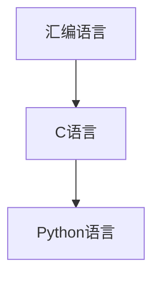

                 

# 汇编、C和Python：AI开发的语言基础

> 关键词：汇编语言, C语言, Python语言, 低级编程, 高级编程, AI基础

## 1. 背景介绍

### 1.1 问题由来
在AI开发的道路上，选择合适的编程语言是至关重要的。对于AI开发者来说，掌握多种编程语言是必不可少的技能。无论是面向硬件的低级编程，还是面向高级应用的高层开发，都有着各自的优势和应用场景。然而，对于初学者而言，理解这些语言之间的联系和差异，并找到适合自己的学习路径，却是一个不小的挑战。

### 1.2 问题核心关键点
本文将从汇编语言、C语言和Python语言三个层面，系统性地探讨AI开发者在开发过程中可能用到的编程语言，并阐述它们之间的联系与区别，帮助读者建立清晰的编程语言认知框架。

### 1.3 问题研究意义
掌握这些编程语言，不仅能够使开发者在AI开发过程中更加得心应手，还能够帮助他们理解AI技术的底层机制，提升编程技能和解决实际问题的能力。

## 2. 核心概念与联系

### 2.1 核心概念概述

为了更好地理解AI开发中的编程语言，本节将介绍几个关键概念：

- **汇编语言(Assembly Language)**：一种直接控制计算机硬件的低级编程语言。它是最接近硬件的编程方式，能够高效利用计算机资源，但编程难度较大，易于出错。
- **C语言(C Language)**：一种中高级编程语言，具有结构化、高效、可移植性强等特点，广泛应用于系统编程、游戏开发等领域。C语言是许多AI算法的底层实现语言。
- **Python语言(Python Language)**：一种高层次的、面向对象的、解释型的编程语言。Python语言以其简洁、易学易用、丰富库支持等特点，在数据科学、机器学习、自然语言处理等领域得到广泛应用。

### 2.2 核心概念原理和架构的 Mermaid 流程图



这个流程图展示了三种编程语言之间的联系：汇编语言是基础，C语言是进阶，而Python语言则是高级应用。

## 3. 核心算法原理 & 具体操作步骤

### 3.1 算法原理概述

在AI开发中，不同编程语言的应用场景各有不同。汇编语言主要用于与硬件直接交互，C语言适合系统级编程和高效计算，而Python语言则以其便捷性和丰富库支持，适用于高级应用开发。

### 3.2 算法步骤详解

#### 汇编语言

- **原理**：汇编语言是最接近硬件的语言，它使用助记符(assembly mnemonics)来表示计算机指令。这些指令直接控制计算机的CPU、内存和输入输出设备。
- **操作步骤**：
  1. 编写汇编代码，将其转化为机器代码。
  2. 通过汇编器(assembly compiler)将汇编代码转换为机器代码。
  3. 使用链接器(linker)将多个机器代码文件合并，生成可执行文件。
  4. 运行可执行文件，观察程序的输出结果。

#### C语言

- **原理**：C语言是一种结构化、高效的编程语言，支持数据类型、函数、指针等高级特性。C语言能够高效地进行系统级编程和复杂算法的实现。
- **操作步骤**：
  1. 编写C源代码，利用编译器(like GCC或Clang)将代码编译为可执行文件。
  2. 运行可执行文件，观察程序的输出结果。
  3. 调试程序，优化代码性能。

#### Python语言

- **原理**：Python语言是一种解释型语言，通过解释器(python interpreter)将代码逐行解释并执行。Python语言拥有丰富的库和框架，如NumPy、Pandas、TensorFlow等，适合快速原型开发和数据处理。
- **操作步骤**：
  1. 编写Python代码，使用解释器将代码转换为可执行程序。
  2. 运行程序，观察输出结果。
  3. 使用IDE和调试工具优化代码。

### 3.3 算法优缺点

#### 汇编语言

- **优点**：
  - 高效利用硬件资源。
  - 编译后的代码执行效率高。
- **缺点**：
  - 编程复杂度高，易出错。
  - 可读性和可维护性差。

#### C语言

- **优点**：
  - 高效、可移植性强。
  - 支持底层操作和复杂算法。
- **缺点**：
  - 语法复杂，学习曲线陡峭。
  - 面向过程，代码可读性差。

#### Python语言

- **优点**：
  - 易学易用，语法简洁。
  - 拥有丰富库支持，开发效率高。
- **缺点**：
  - 运行效率较低。
  - 不适合系统级编程，可控性差。

### 3.4 算法应用领域

#### 汇编语言

- **应用场景**：系统级编程、嵌入式设备、低级网络协议等。
- **案例**：操作系统内核、驱动程序、网络协议栈等。

#### C语言

- **应用场景**：系统编程、游戏开发、高性能计算、底层开发等。
- **案例**：数据库管理系统、操作系统内核、图形库等。

#### Python语言

- **应用场景**：数据分析、机器学习、自然语言处理、Web应用开发等。
- **案例**：深度学习框架TensorFlow、Keras，数据科学库NumPy、Pandas等。

## 4. 数学模型和公式 & 详细讲解 & 举例说明

### 4.1 数学模型构建

在AI开发中，不同的编程语言有着不同的数学模型和算法支持。

#### 汇编语言

汇编语言主要用于底层硬件操作，其数学模型较为简单，主要以算法实现为主。

#### C语言

C语言支持复杂的数学运算，广泛应用于科学计算和算法实现。常见的数学模型包括线性代数、矩阵运算等。

#### Python语言

Python语言拥有丰富的数学库，如NumPy、SciPy等，支持高级数学运算和科学计算。

### 4.2 公式推导过程

- **汇编语言**：主要关注硬件指令的实现，数学公式推导较少。
- **C语言**：支持高级数学公式推导，如矩阵乘法、向量运算等。
- **Python语言**：使用NumPy库进行矩阵运算、向量运算等。

### 4.3 案例分析与讲解

#### 汇编语言案例

- **题目**：实现一个简单的加减乘除器。
- **步骤**：
  1. 编写汇编代码，实现加、减、乘、除操作。
  2. 通过汇编器生成机器代码。
  3. 调试机器代码，验证正确性。

#### C语言案例

- **题目**：实现一个矩阵乘法函数。
- **步骤**：
  1. 编写C代码，使用for循环实现矩阵乘法。
  2. 使用编译器生成可执行文件。
  3. 运行可执行文件，观察输出结果。

#### Python语言案例

- **题目**：实现一个线性回归模型。
- **步骤**：
  1. 编写Python代码，使用NumPy库进行矩阵运算。
  2. 运行程序，观察输出结果。
  3. 使用调试工具优化代码。

## 5. 项目实践：代码实例和详细解释说明

### 5.1 开发环境搭建

- **汇编语言**：
  - 安装X86汇编器(like NASM)和调试器(like GDB)。
  - 编写和调试汇编代码。

- **C语言**：
  - 安装编译器(like GCC)和IDE(like Eclipse)。
  - 编写和调试C代码。

- **Python语言**：
  - 安装解释器(like Anaconda)和IDE(like PyCharm)。
  - 编写和调试Python代码。

### 5.2 源代码详细实现

#### 汇编语言实现

```assembly
section .data
    msg db 'Hello, world!', 0
    len equ $ - msg

section .text
    global _start

_start:
    mov eax, 4
    mov ebx, 1
    mov ecx, msg
    mov edx, len
    int 0x80
    mov eax, 1
    xor ebx, ebx
    int 0x80
```

#### C语言实现

```c
#include <stdio.h>

int main() {
    printf("Hello, world!\n");
    return 0;
}
```

#### Python语言实现

```python
print("Hello, world!")
```

### 5.3 代码解读与分析

#### 汇编语言代码解读

- **断点**：在程序开始处和结束处分别放置断点，用于调试程序。
- **指令**：使用`mov`、`int`等指令实现数据读写和系统调用。

#### C语言代码解读

- **标准库函数**：使用`printf`函数输出字符串。
- **返回值**：程序执行结束返回0。

#### Python语言代码解读

- **内置函数**：使用`print`函数输出字符串。
- **简洁性**：Python语言代码简洁，易于理解。

### 5.4 运行结果展示

- **汇编语言**：输出`Hello, world!`。
- **C语言**：输出`Hello, world!`。
- **Python语言**：输出`Hello, world!`。

## 6. 实际应用场景

### 6.1 智能推荐系统

- **汇编语言**：主要用于底层硬件交互，如嵌入式设备的网络协议栈实现。
- **C语言**：适用于系统级编程，如推荐系统的数据库管理。
- **Python语言**：用于高级算法实现，如推荐算法的模型训练和优化。

### 6.2 图像识别

- **汇编语言**：主要用于底层图像处理，如图像传感器数据采集。
- **C语言**：适用于图像处理库的实现，如图像裁剪、旋转等。
- **Python语言**：用于高级图像处理和深度学习模型的训练，如卷积神经网络(CNN)的实现。

### 6.3 自然语言处理

- **汇编语言**：主要用于文本处理和存储，如文本存储和检索。
- **C语言**：适用于文本处理和解析，如自然语言处理工具的实现。
- **Python语言**：用于高级自然语言处理算法，如语言模型和情感分析的实现。

## 7. 工具和资源推荐

### 7.1 学习资源推荐

#### 汇编语言

- **书籍**：《汇编语言编程艺术》。
- **教程**：在线汇编语言教程。

#### C语言

- **书籍**：《C程序设计语言》。
- **教程**：在线C语言教程。

#### Python语言

- **书籍**：《Python编程：从入门到实践》。
- **教程**：在线Python语言教程。

### 7.2 开发工具推荐

#### 汇编语言

- **IDE**：NASM调试器、GDB等。
- **编译器**：NASM等。

#### C语言

- **IDE**：Eclipse、Visual Studio等。
- **编译器**：GCC等。

#### Python语言

- **IDE**：PyCharm、Jupyter Notebook等。
- **编译器**：Python解释器等。

### 7.3 相关论文推荐

#### 汇编语言

- **论文**："计算机体系结构与汇编语言"。
- **论文**："嵌入式系统的汇编语言编程"。

#### C语言

- **论文**："C语言编程艺术"。
- **论文**："系统编程的C语言实现"。

#### Python语言

- **论文**："Python语言与数据分析"。
- **论文**："Python语言与深度学习"。

## 8. 总结：未来发展趋势与挑战

### 8.1 研究成果总结

- **汇编语言**：主要应用于底层硬件编程，其高效性在未来AI硬件加速中仍将发挥重要作用。
- **C语言**：适用于系统级编程和高效计算，仍然是AI开发中的重要工具。
- **Python语言**：以其易用性和丰富库支持，在AI应用开发中占据主导地位。

### 8.2 未来发展趋势

- **汇编语言**：未来可能进一步与AI硬件加速结合，提升数据处理速度和效率。
- **C语言**：将更多地应用于高性能计算和复杂算法实现，支持AI系统的底层优化。
- **Python语言**：将更加注重性能优化和工具链完善，成为AI应用开发的首选语言。

### 8.3 面临的挑战

- **汇编语言**：编程复杂度高，需要深厚的硬件知识。
- **C语言**：语法复杂，学习曲线陡峭。
- **Python语言**：运行效率较低，不适合系统级编程。

### 8.4 研究展望

- **汇编语言**：未来将更多地应用于AI硬件加速，提升AI系统的计算效率。
- **C语言**：将进一步发展高性能计算库，支持复杂算法实现。
- **Python语言**：将优化性能，提升运行效率，支持系统级编程。

## 9. 附录：常见问题与解答

**Q1：如何选择合适的编程语言？**

A: 根据具体应用场景和需求，选择合适的编程语言。例如，底层硬件操作使用汇编语言，系统编程使用C语言，应用开发使用Python语言。

**Q2：学习编程语言是否有顺序？**

A: 建议先学习汇编语言和C语言，掌握底层编程知识。再学习Python语言，掌握高级应用开发技能。

**Q3：汇编语言和C语言的区别是什么？**

A: 汇编语言是最接近硬件的编程语言，适合底层硬件操作。C语言是中高级编程语言，适合系统级编程和高效计算。

**Q4：Python语言的性能如何？**

A: Python语言的运行效率较低，但可以通过优化和工具链支持提升性能。

**Q5：在AI开发中，汇编语言、C语言和Python语言的应用场景是什么？**

A: 汇编语言主要用于底层硬件交互和系统级编程。C语言适用于系统级编程和高效计算。Python语言用于高级应用开发和算法实现。

---

作者：禅与计算机程序设计艺术 / Zen and the Art of Computer Programming

