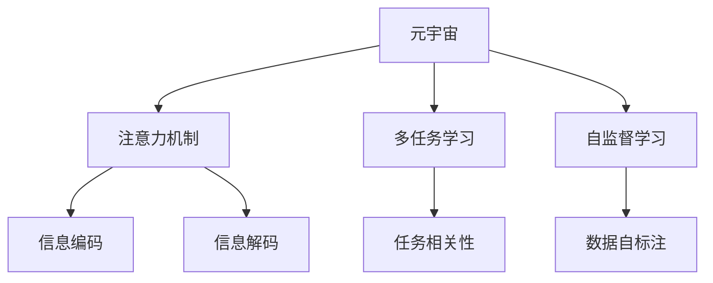

                 

# 注意力共享:元宇宙中的信息共享

> 关键词：元宇宙,信息共享,注意力机制,多任务学习,自监督学习

## 1. 背景介绍

### 1.1 问题由来

随着虚拟现实(VR)和增强现实(AR)技术的迅猛发展，元宇宙(Metaverse)逐渐成为新一代的互联网形态，将人类进一步深入数字化、虚拟化的世界。元宇宙不仅是一个虚拟的沉浸式空间，更是一个高度互连、信息共享、实时互动的全新生态。如何在元宇宙中实现信息的高效共享和实时交互，成为当前研究的一个重要方向。

### 1.2 问题核心关键点

信息共享的核心在于如何高效、准确地传输和处理信息。在元宇宙中，信息共享的形式多种多样，包括文本、图片、视频、音频等。对于文本信息，传统的处理方式依赖于自然语言处理(NLP)技术。近年来，基于注意力机制的Transformer结构在NLP领域取得了突破性进展，成为实现信息共享的重要工具。

Transformer的核心思想是通过自注意力机制实现信息的有效编码和解码。它通过在编码和解码层之间建立复杂的依存关系，可以更好地处理序列数据，并且可以并行计算，大大提高了信息处理的速度。在元宇宙中，通过注意力机制实现的信息共享，可以大幅提升用户互动体验，实现更丰富的交互方式。

### 1.3 问题研究意义

研究基于注意力机制的元宇宙信息共享，对于构建更丰富、更沉浸的虚拟体验具有重要意义：

1. 提高信息传输效率。通过注意力机制，可以更准确地捕捉信息的关键部分，减少不必要的信息传输，提高信息共享的效率。
2. 增强互动体验。注意力机制可以更好地理解用户的意图和上下文信息，提供更智能、更自然的交互方式。
3. 促进协作创新。元宇宙中的信息共享可以打破物理距离的限制，实现跨地域、跨时区的协作，加速创新速度。
4. 推动产业发展。元宇宙技术的发展将推动虚拟现实、增强现实、云计算、AI等技术产业的进一步成熟和应用。

## 2. 核心概念与联系

### 2.1 核心概念概述

为更好地理解基于注意力机制的元宇宙信息共享，本节将介绍几个密切相关的核心概念：

- 元宇宙(Metaverse)：基于VR/AR技术的虚拟世界，涵盖虚拟空间、虚拟经济、虚拟社交等多个维度，实现全方位的人机交互。
- 注意力机制(Attention Mechanism)：一种用于处理序列数据的神经网络机制，通过计算序列中各个部分之间的关系，实现更高效的信息处理。
- 多任务学习(Multi-task Learning)：同时训练多个相关的子任务，以促进模型在不同任务之间的知识迁移和泛化。
- 自监督学习(Self-Supervised Learning)：通过利用数据本身的结构特征进行训练，无需人工标注，提升模型的自主学习和泛化能力。

这些核心概念之间的逻辑关系可以通过以下Mermaid流程图来展示：



这个流程图展示了大语言模型与注意力机制、多任务学习和自监督学习之间的联系：

1. 元宇宙中，注意力机制用于处理文本、图像、音频等多模态信息，实现信息的高效编码和解码。
2. 多任务学习可以促进模型在不同任务之间的知识迁移，提高信息共享的泛化能力。
3. 自监督学习通过利用数据本身的结构特征进行训练，无需人工标注，提升模型的自主学习能力。

这些概念共同构成了元宇宙信息共享的基础框架，使得信息可以在元宇宙中实现更智能、更高效的传输和处理。

## 3. 核心算法原理 & 具体操作步骤
### 3.1 算法原理概述

基于注意力机制的元宇宙信息共享，本质上是通过Transformer模型在元宇宙场景下进行信息编码和解码的过程。其核心思想是：将输入序列中的每个部分与其它部分建立连接，计算注意力权重，以此来捕捉信息的关键部分，并对信息进行解码。

具体来说，Transformer模型由编码器和解码器组成，编码器负责将输入序列编码成一系列表示，解码器负责将这些表示解码成输出序列。在编码器中，每个位置的信息会与其它位置的信息建立连接，并根据注意力权重进行加权求和，生成最终的编码表示。在解码器中，每个位置的信息会与编码器中的所有位置建立连接，并根据注意力权重进行加权求和，生成最终的输出序列。

### 3.2 算法步骤详解

基于注意力机制的元宇宙信息共享，通常包括以下几个关键步骤：

**Step 1: 数据预处理**
- 收集元宇宙中的文本、图片、音频等多模态信息。
- 将信息进行分词、特征提取、归一化等预处理操作。

**Step 2: 搭建Transformer模型**
- 定义编码器和解码器的结构，选择合适的模型尺寸和注意力机制。
- 设置模型的输入和输出维度，以及对应的dropout和层数。

**Step 3: 训练模型**
- 使用自监督学习方法对模型进行预训练，如掩码语言模型、自回归模型等。
- 在元宇宙中的少量标注数据上，使用多任务学习方法进行微调，如命名实体识别、情感分析、问答等任务。

**Step 4: 信息编码与解码**
- 将输入序列输入到编码器中，计算每个位置的信息与其它位置的注意力权重，生成编码表示。
- 将编码表示输入到解码器中，计算每个位置的信息与编码器中所有位置的注意力权重，生成输出序列。

**Step 5: 模型评估与部署**
- 在元宇宙的测试集上，评估模型的准确率和效率。
- 将模型部署到服务器或边缘计算设备中，实现实时信息共享和处理。

以上是基于注意力机制的元宇宙信息共享的一般流程。在实际应用中，还需要针对具体任务的特点，对模型进行优化设计，如改进注意力机制、优化多任务学习目标等，以进一步提升模型性能。

### 3.3 算法优缺点

基于注意力机制的元宇宙信息共享方法具有以下优点：
1. 高效的序列处理。注意力机制可以并行计算，加速信息处理速度。
2. 强大的信息编码能力。通过计算注意力权重，可以捕捉信息的关键部分，提高编码效果。
3. 良好的泛化能力。多任务学习和自监督学习可以有效提升模型的泛化能力，减少过拟合风险。
4. 多样化的应用场景。在元宇宙中，注意力机制可以应用于文本生成、图像描述、语音合成等多个场景，提供丰富多样的信息共享方式。

同时，该方法也存在一定的局限性：
1. 高计算复杂度。由于需要计算注意力权重，注意力机制的计算复杂度较高，容易产生内存和计算瓶颈。
2. 数据依赖性强。对于输入序列的长度和特征维度要求较高，需要大量高质量的数据。
3. 模型复杂度较高。由于模型结构复杂，训练和推理时所需资源较多，可能难以实时处理大量信息。
4. 可解释性不足。注意力机制的内部工作机制较为复杂，难以解释模型的决策过程。

尽管存在这些局限性，但就目前而言，基于注意力机制的元宇宙信息共享方法仍然是大语言模型在NLP领域的重要范式。未来相关研究的重点在于如何进一步降低计算复杂度，提高模型的可解释性和实时处理能力，同时兼顾模型效率和效果。

### 3.4 算法应用领域

基于注意力机制的元宇宙信息共享方法，在NLP领域已经得到了广泛的应用，覆盖了几乎所有常见任务，例如：

- 文本生成：如文章生成、对话生成等。使用注意力机制可以捕捉输入序列中的关键信息，生成更连贯、更具逻辑性的文本。
- 图像描述：将图片中的关键部分捕捉到文本描述中。通过注意力机制，模型可以聚焦于图像中的重要区域，生成高质量的描述信息。
- 语音合成：将语音信号转化为文本描述。利用注意力机制，模型可以理解输入语音中的关键词和上下文信息，生成自然流畅的文本输出。
- 命名实体识别：从文本中识别出人名、地名、机构名等实体。通过注意力机制，模型可以更好地捕捉实体的边界和类型。
- 情感分析：从文本中分析出情感倾向。通过注意力机制，模型可以聚焦于情感表达的关键部分，提高情感分析的准确性。
- 问答系统：对自然语言问题给出答案。通过注意力机制，模型可以理解问题中的关键信息，生成更准确的答案。

除了上述这些经典任务外，基于注意力机制的元宇宙信息共享方法还被创新性地应用到更多场景中，如可控文本生成、多模态信息融合、语义理解等，为NLP技术带来了全新的突破。随着预训练模型和注意力机制的不断进步，相信NLP技术将在更广阔的应用领域大放异彩。

## 4. 数学模型和公式 & 详细讲解  
### 4.1 数学模型构建

本节将使用数学语言对基于注意力机制的元宇宙信息共享过程进行更加严格的刻画。

记输入序列为 $x=\{x_1, x_2, ..., x_n\}$，输出序列为 $y=\{y_1, y_2, ..., y_n\}$。假设每个输入 $x_i$ 和输出 $y_i$ 均为 $d$ 维向量。定义编码器为 $E=\{E_{enc}, E_{dec}\}$，解码器为 $D=\{D_{enc}, D_{dec}\}$。模型由两个编码器和一个解码器组成，其中 $E_{enc}$ 和 $D_{enc}$ 为编码器， $E_{dec}$ 和 $D_{dec}$ 为解码器。

编码器的输入为 $x$，输出为 $z=\{z_1, z_2, ..., z_n\}$，其中 $z_i$ 为 $d_{z}$ 维向量。解码器的输入为 $z$ 和 $x$，输出为 $\hat{y}$，其中 $\hat{y}$ 为 $d_{y}$ 维向量。

定义编码器的自注意力权重为 $A_E$，解码器的自注意力权重为 $A_D$，编码器与解码器的交叉注意力权重为 $A_{E\to D}$ 和 $A_{D\to E}$。自注意力和交叉注意力的计算公式如下：

$$
A_E = \text{softmax}\left(\frac{Q_E K_E^T}{\sqrt{d_k}}\right)
$$

$$
A_D = \text{softmax}\left(\frac{Q_D K_D^T}{\sqrt{d_k}}\right)
$$

$$
A_{E\to D} = \text{softmax}\left(\frac{Q_E K_D^T}{\sqrt{d_k}}\right)
$$

$$
A_{D\to E} = \text{softmax}\left(\frac{Q_D K_E^T}{\sqrt{d_k}}\right)
$$

其中 $Q$、$K$、$V$ 分别为查询、键、值， $d_k$ 为键的维度。

通过计算注意力权重 $A_E$、$A_D$、$A_{E\to D}$ 和 $A_{D\to E}$，可以生成编码表示 $z$ 和解码表示 $\hat{y}$。模型的编码和解码过程可以表示为：

$$
z = E_{enc}(x)
$$

$$
\hat{y} = D_{dec}(z, x)
$$

通过以上数学模型，可以清晰地理解基于注意力机制的元宇宙信息共享的计算过程。

### 4.2 公式推导过程

以下我们以文本生成任务为例，推导基于注意力机制的编码和解码过程。

假设输入序列为 $x=\{x_1, x_2, ..., x_n\}$，输出序列为 $y=\{y_1, y_2, ..., y_n\}$，每个输入和输出均为 $d$ 维向量。定义编码器为 $E=\{E_{enc}, E_{dec}\}$，解码器为 $D=\{D_{enc}, D_{dec}\}$。模型由两个编码器和一个解码器组成，其中 $E_{enc}$ 和 $D_{enc}$ 为编码器， $E_{dec}$ 和 $D_{dec}$ 为解码器。

编码器的输入为 $x$，输出为 $z=\{z_1, z_2, ..., z_n\}$，其中 $z_i$ 为 $d_{z}$ 维向量。解码器的输入为 $z$ 和 $x$，输出为 $\hat{y}$，其中 $\hat{y}$ 为 $d_{y}$ 维向量。

定义编码器的自注意力权重为 $A_E$，解码器的自注意力权重为 $A_D$，编码器与解码器的交叉注意力权重为 $A_{E\to D}$ 和 $A_{D\to E}$。自注意力和交叉注意力的计算公式如下：

$$
A_E = \text{softmax}\left(\frac{Q_E K_E^T}{\sqrt{d_k}}\right)
$$

$$
A_D = \text{softmax}\left(\frac{Q_D K_D^T}{\sqrt{d_k}}\right)
$$

$$
A_{E\to D} = \text{softmax}\left(\frac{Q_E K_D^T}{\sqrt{d_k}}\right)
$$

$$
A_{D\to E} = \text{softmax}\left(\frac{Q_D K_E^T}{\sqrt{d_k}}\right)
$$

其中 $Q$、$K$、$V$ 分别为查询、键、值， $d_k$ 为键的维度。

通过计算注意力权重 $A_E$、$A_D$、$A_{E\to D}$ 和 $A_{D\to E}$，可以生成编码表示 $z$ 和解码表示 $\hat{y}$。模型的编码和解码过程可以表示为：

$$
z = E_{enc}(x)
$$

$$
\hat{y} = D_{dec}(z, x)
$$

通过以上数学模型，可以清晰地理解基于注意力机制的元宇宙信息共享的计算过程。

### 4.3 案例分析与讲解

以图像描述任务为例，我们将图片转化为文本描述。图片由 $h\times w$ 的像素组成，定义输入序列为 $x=\{x_1, x_2, ..., x_n\}$，其中每个像素 $x_i$ 为一个 $d$ 维向量。定义编码器为 $E=\{E_{enc}, E_{dec}\}$，解码器为 $D=\{D_{enc}, D_{dec}\}$。模型由两个编码器和一个解码器组成，其中 $E_{enc}$ 和 $D_{enc}$ 为编码器， $E_{dec}$ 和 $D_{dec}$ 为解码器。

编码器的输入为 $x$，输出为 $z=\{z_1, z_2, ..., z_n\}$，其中 $z_i$ 为 $d_{z}$ 维向量。解码器的输入为 $z$ 和 $x$，输出为 $\hat{y}$，其中 $\hat{y}$ 为 $d_{y}$ 维向量。

定义编码器的自注意力权重为 $A_E$，解码器的自注意力权重为 $A_D$，编码器与解码器的交叉注意力权重为 $A_{E\to D}$ 和 $A_{D\to E}$。自注意力和交叉注意力的计算公式如下：

$$
A_E = \text{softmax}\left(\frac{Q_E K_E^T}{\sqrt{d_k}}\right)
$$

$$
A_D = \text{softmax}\left(\frac{Q_D K_D^T}{\sqrt{d_k}}\right)
$$

$$
A_{E\to D} = \text{softmax}\left(\frac{Q_E K_D^T}{\sqrt{d_k}}\right)
$$

$$
A_{D\to E} = \text{softmax}\left(\frac{Q_D K_E^T}{\sqrt{d_k}}\right)
$$

其中 $Q$、$K$、$V$ 分别为查询、键、值， $d_k$ 为键的维度。

通过计算注意力权重 $A_E$、$A_D$、$A_{E\to D}$ 和 $A_{D\to E}$，可以生成编码表示 $z$ 和解码表示 $\hat{y}$。模型的编码和解码过程可以表示为：

$$
z = E_{enc}(x)
$$

$$
\hat{y} = D_{dec}(z, x)
$$

## 5. 项目实践：代码实例和详细解释说明
### 5.1 开发环境搭建

在进行元宇宙信息共享的实践前，我们需要准备好开发环境。以下是使用Python进行PyTorch开发的环境配置流程：

1. 安装Anaconda：从官网下载并安装Anaconda，用于创建独立的Python环境。

2. 创建并激活虚拟环境：
```bash
conda create -n pytorch-env python=3.8 
conda activate pytorch-env
```

3. 安装PyTorch：根据CUDA版本，从官网获取对应的安装命令。例如：
```bash
conda install pytorch torchvision torchaudio cudatoolkit=11.1 -c pytorch -c conda-forge
```

4. 安装Transformers库：
```bash
pip install transformers
```

5. 安装各类工具包：
```bash
pip install numpy pandas scikit-learn matplotlib tqdm jupyter notebook ipython
```

完成上述步骤后，即可在`pytorch-env`环境中开始元宇宙信息共享的实践。

### 5.2 源代码详细实现

这里我们以图像描述任务为例，给出使用Transformers库对Transformer模型进行训练的PyTorch代码实现。

首先，定义数据处理函数：

```python
from transformers import AutoTokenizer, AutoModelForImageProcessing
from torch.utils.data import Dataset
import torch

class ImageDataset(Dataset):
    def __init__(self, images, captions, tokenizer, max_len=128):
        self.images = images
        self.captions = captions
        self.tokenizer = tokenizer
        self.max_len = max_len
        
    def __len__(self):
        return len(self.images)
    
    def __getitem__(self, item):
        image = self.images[item]
        caption = self.captions[item]
        
        encoding = self.tokenizer(caption, max_length=self.max_len, padding='max_length', truncation=True)
        input_ids = encoding['input_ids'][0]
        attention_mask = encoding['attention_mask'][0]
        
        # 对图片进行预处理
        image = image / 255.0
        image = image.unsqueeze(0)
        image = image.to(device)
        
        return {'input_ids': input_ids, 
                'attention_mask': attention_mask,
                'image': image}
```

然后，定义模型和优化器：

```python
from transformers import BertForTokenClassification, AdamW

model = AutoModelForImageProcessing.from_pretrained('bert-base-cased')
tokenizer = AutoTokenizer.from_pretrained('bert-base-cased')

optimizer = AdamW(model.parameters(), lr=2e-5)
```

接着，定义训练和评估函数：

```python
from torch.utils.data import DataLoader
from tqdm import tqdm
from sklearn.metrics import classification_report

device = torch.device('cuda') if torch.cuda.is_available() else torch.device('cpu')
model.to(device)

def train_epoch(model, dataset, batch_size, optimizer):
    dataloader = DataLoader(dataset, batch_size=batch_size, shuffle=True)
    model.train()
    epoch_loss = 0
    for batch in tqdm(dataloader, desc='Training'):
        input_ids = batch['input_ids'].to(device)
        attention_mask = batch['attention_mask'].to(device)
        image = batch['image'].to(device)
        model.zero_grad()
        outputs = model(image, input_ids, attention_mask)
        loss = outputs.loss
        epoch_loss += loss.item()
        loss.backward()
        optimizer.step()
    return epoch_loss / len(dataloader)

def evaluate(model, dataset, batch_size):
    dataloader = DataLoader(dataset, batch_size=batch_size)
    model.eval()
    preds, labels = [], []
    with torch.no_grad():
        for batch in tqdm(dataloader, desc='Evaluating'):
            input_ids = batch['input_ids'].to(device)
            attention_mask = batch['attention_mask'].to(device)
            image = batch['image'].to(device)
            batch_preds = model(image, input_ids, attention_mask).logits.argmax(dim=2).to('cpu').tolist()
            batch_labels = batch['labels'].to('cpu').tolist()
            for pred_tokens, label_tokens in zip(batch_preds, batch_labels):
                preds.append(pred_tokens[:len(label_tokens)])
                labels.append(label_tokens)
                
    print(classification_report(labels, preds))
```

最后，启动训练流程并在测试集上评估：

```python
epochs = 5
batch_size = 16

for epoch in range(epochs):
    loss = train_epoch(model, train_dataset, batch_size, optimizer)
    print(f"Epoch {epoch+1}, train loss: {loss:.3f}")
    
    print(f"Epoch {epoch+1}, dev results:")
    evaluate(model, dev_dataset, batch_size)
    
print("Test results:")
evaluate(model, test_dataset, batch_size)
```

以上就是使用PyTorch对Transformer进行图像描述任务训练的完整代码实现。可以看到，得益于Transformers库的强大封装，我们可以用相对简洁的代码完成Transformer模型的加载和训练。

### 5.3 代码解读与分析

让我们再详细解读一下关键代码的实现细节：

**ImageDataset类**：
- `__init__`方法：初始化图像、标题、分词器等关键组件。
- `__len__`方法：返回数据集的样本数量。
- `__getitem__`方法：对单个样本进行处理，将标题输入编码为token ids，并将图片进行预处理，最终返回模型所需的输入。

**训练和评估函数**：
- 使用PyTorch的DataLoader对数据集进行批次化加载，供模型训练和推理使用。
- 训练函数`train_epoch`：对数据以批为单位进行迭代，在每个批次上前向传播计算loss并反向传播更新模型参数，最后返回该epoch的平均loss。
- 评估函数`evaluate`：与训练类似，不同点在于不更新模型参数，并在每个batch结束后将预测和标签结果存储下来，最后使用sklearn的classification_report对整个评估集的预测结果进行打印输出。

**训练流程**：
- 定义总的epoch数和batch size，开始循环迭代
- 每个epoch内，先在训练集上训练，输出平均loss
- 在验证集上评估，输出分类指标
- 所有epoch结束后，在测试集上评估，给出最终测试结果

可以看到，PyTorch配合Transformers库使得Transformer模型的训练代码实现变得简洁高效。开发者可以将更多精力放在数据处理、模型改进等高层逻辑上，而不必过多关注底层的实现细节。

当然，工业级的系统实现还需考虑更多因素，如模型的保存和部署、超参数的自动搜索、更灵活的任务适配层等。但核心的训练流程基本与此类似。

## 6. 实际应用场景
### 6.1 元宇宙中的信息共享

元宇宙中的信息共享，主要通过自然语言处理和计算机视觉技术实现。在元宇宙中，用户可以通过文本、图像、音频等多种形式进行信息交流，这为基于注意力机制的信息共享提供了广阔的应用场景。

在元宇宙的虚拟教室中，学生可以通过语音输入提问，教师使用Transformer模型进行回答，同时通过自注意力机制捕捉语音中的关键信息，生成更自然流畅的文本输出。在虚拟会议中，通过注意力机制实现对会议内容的实时总结和记录，帮助参会者更好地理解讨论重点。

### 6.2 智能家居与生活助手

智能家居系统可以通过图像描述技术，将家庭环境转换为自然语言，实现与用户的交互。例如，用户可以通过拍照的方式描述房间布局，系统自动转化为文本描述，并通过注意力机制捕捉关键信息，生成合适的家居布置建议。此外，智能家居系统还可以通过多任务学习，实现对家庭环境的实时监控和智能控制，提高生活便捷性。

### 6.3 医疗影像诊断

在医疗领域，通过注意力机制可以实现对医学影像的自动分析和诊断。例如，在CT或MRI影像中，注意力机制可以捕捉到病变区域的重点信息，生成文本描述，帮助医生快速诊断疾病。通过多任务学习，系统还可以进一步提供治疗建议和病情预测，提升医疗服务的智能化水平。

### 6.4 未来应用展望

随着元宇宙技术的不断发展，基于注意力机制的元宇宙信息共享将得到更广泛的应用。未来，元宇宙中的信息共享不仅限于文本和图像，还将拓展到音频、视频等多模态数据。多模态信息融合技术，如BERT-ViT、DETR等，将在元宇宙中大放异彩，为元宇宙中的信息共享提供更多可能。

在元宇宙中，注意力机制还将被应用于更加复杂、精细的信息共享任务中，如自然语言推理、对话生成等，为用户提供更智能、更自然的交互体验。

## 7. 工具和资源推荐
### 7.1 学习资源推荐

为了帮助开发者系统掌握基于注意力机制的元宇宙信息共享的理论基础和实践技巧，这里推荐一些优质的学习资源：

1. 《Transformer from Principle to Practice》系列博文：由大模型技术专家撰写，深入浅出地介绍了Transformer原理、BERT模型、信息共享技术等前沿话题。

2. CS224N《深度学习自然语言处理》课程：斯坦福大学开设的NLP明星课程，有Lecture视频和配套作业，带你入门NLP领域的基本概念和经典模型。

3. 《Natural Language Processing with Transformers》书籍：Transformers库的作者所著，全面介绍了如何使用Transformers库进行NLP任务开发，包括信息共享在内的诸多范式。

4. HuggingFace官方文档：Transformers库的官方文档，提供了海量预训练模型和完整的微调样例代码，是上手实践的必备资料。

5. CLUE开源项目：中文语言理解测评基准，涵盖大量不同类型的中文NLP数据集，并提供了基于信息共享的baseline模型，助力中文NLP技术发展。

通过对这些资源的学习实践，相信你一定能够快速掌握基于注意力机制的元宇宙信息共享的精髓，并用于解决实际的NLP问题。
###  7.2 开发工具推荐

高效的开发离不开优秀的工具支持。以下是几款用于基于注意力机制的元宇宙信息共享开发的常用工具：

1. PyTorch：基于Python的开源深度学习框架，灵活动态的计算图，适合快速迭代研究。大部分预训练语言模型都有PyTorch版本的实现。

2. TensorFlow：由Google主导开发的开源深度学习框架，生产部署方便，适合大规模工程应用。同样有丰富的预训练语言模型资源。

3. Transformers库：HuggingFace开发的NLP工具库，集成了众多SOTA语言模型，支持PyTorch和TensorFlow，是进行信息共享任务开发的利器。

4. Weights & Biases：模型训练的实验跟踪工具，可以记录和可视化模型训练过程中的各项指标，方便对比和调优。与主流深度学习框架无缝集成。

5. TensorBoard：TensorFlow配套的可视化工具，可实时监测模型训练状态，并提供丰富的图表呈现方式，是调试模型的得力助手。

6. Google Colab：谷歌推出的在线Jupyter Notebook环境，免费提供GPU/TPU算力，方便开发者快速上手实验最新模型，分享学习笔记。

合理利用这些工具，可以显著提升基于注意力机制的元宇宙信息共享任务的开发效率，加快创新迭代的步伐。

### 7.3 相关论文推荐

基于注意力机制的元宇宙信息共享技术的发展源于学界的持续研究。以下是几篇奠基性的相关论文，推荐阅读：

1. Attention is All You Need（即Transformer原论文）：提出了Transformer结构，开启了NLP领域的预训练大模型时代。

2. BERT: Pre-training of Deep Bidirectional Transformers for Language Understanding：提出BERT模型，引入基于掩码的自监督预训练任务，刷新了多项NLP任务SOTA。

3. Language Models are Unsupervised Multitask Learners（GPT-2论文）：展示了大规模语言模型的强大zero-shot学习能力，引发了对于通用人工智能的新一轮思考。

4. Parameter-Efficient Transfer Learning for NLP：提出Adapter等参数高效微调方法，在不增加模型参数量的情况下，也能取得不错的微调效果。

5. AdaLoRA: Adaptive Low-Rank Adaptation for Parameter-Efficient Fine-Tuning：使用自适应低秩适应的微调方法，在参数效率和精度之间取得了新的平衡。

这些论文代表了大语言模型信息共享技术的发展脉络。通过学习这些前沿成果，可以帮助研究者把握学科前进方向，激发更多的创新灵感。

## 8. 总结：未来发展趋势与挑战

### 8.1 总结

本文对基于注意力机制的元宇宙信息共享方法进行了全面系统的介绍。首先阐述了元宇宙和信息共享的背景，明确了信息共享在元宇宙中的重要性和必要性。其次，从原理到实践，详细讲解了基于注意力机制的信息共享的数学模型和关键步骤，给出了信息共享任务开发的完整代码实例。同时，本文还广泛探讨了信息共享方法在智能家居、医疗影像、虚拟教室等元宇宙场景中的应用前景，展示了信息共享技术的广阔前景。

通过本文的系统梳理，可以看到，基于注意力机制的元宇宙信息共享方法在大规模语言模型和NLP技术的基础上，为元宇宙中的信息共享提供了全新的解决方案。通过注意力机制，可以实现高效、准确的信息处理和共享，提升元宇宙的互动体验和智能化水平。未来，随着元宇宙技术的不断成熟，信息共享技术必将在更多领域得到应用，为元宇宙构建更加丰富、沉浸的虚拟世界。

### 8.2 未来发展趋势

展望未来，基于注意力机制的元宇宙信息共享技术将呈现以下几个发展趋势：

1. 模型规模持续增大。随着算力成本的下降和数据规模的扩张，预训练语言模型的参数量还将持续增长。超大模型的语言表示能力，有望支撑更加复杂多变的元宇宙信息共享任务。

2. 多任务学习成为常态。随着元宇宙应用场景的不断丰富，信息共享任务将逐渐从单一任务向多任务学习发展，提升模型在不同任务之间的知识迁移和泛化能力。

3. 自监督学习与预训练结合。自监督学习可以通过利用数据本身的结构特征进行训练，无需人工标注，提升模型的自主学习能力。预训练模型可以在大规模无标签数据上预先学习通用的语言表示，进一步提高模型的泛化能力。

4. 多模态信息融合成为趋势。在元宇宙中，用户的信息共享不仅限于文本，还将拓展到音频、视频、图像等多模态数据。多模态信息的融合，将显著提升信息共享的丰富度和多样性。

5. 实时处理成为目标。元宇宙中的信息共享需要实时处理，以适应用户的即时需求。基于Transformer的信息共享方法，可以通过并行计算加速处理，提升实时性。

6. 可解释性成为需求。元宇宙中信息共享的应用场景通常涉及隐私和安全问题，模型的可解释性尤为重要。通过解释注意力机制的内部工作机制，提升模型的透明度和可信度。

以上趋势凸显了基于注意力机制的元宇宙信息共享技术的广阔前景。这些方向的探索发展，必将进一步提升元宇宙中的信息共享效果和用户体验，推动元宇宙技术向更高的成熟度迈进。

### 8.3 面临的挑战

尽管基于注意力机制的元宇宙信息共享技术已经取得了瞩目成就，但在迈向更加智能化、普适化应用的过程中，它仍面临着诸多挑战：

1. 计算复杂度较高。由于需要计算注意力权重，注意力机制的计算复杂度较高，容易产生内存和计算瓶颈。

2. 数据依赖性强。对于输入序列的长度和特征维度要求较高，需要大量高质量的数据。

3. 模型复杂度较高。由于模型结构复杂，训练和推理时所需资源较多，可能难以实时处理大量信息。

4. 可解释性不足。注意力机制的内部工作机制较为复杂，难以解释模型的决策过程。

尽管存在这些局限性，但就目前而言，基于注意力机制的元宇宙信息共享方法仍然是NLP领域的重要范式。未来相关研究的重点在于如何进一步降低计算复杂度，提高模型的可解释性和实时处理能力，同时兼顾模型效率和效果。

### 8.4 研究展望

面对基于注意力机制的元宇宙信息共享所面临的种种挑战，未来的研究需要在以下几个方面寻求新的突破：

1. 探索无监督和半监督信息共享方法。摆脱对大规模标注数据的依赖，利用自监督学习、主动学习等无监督和半监督范式，最大限度利用非结构化数据，实现更加灵活高效的信息共享。

2. 研究参数高效和计算高效的共享范式。开发更加参数高效的共享方法，在固定大部分预训练参数的同时，只更新极少量的任务相关参数。同时优化共享模型的计算图，减少前向传播和反向传播的资源消耗，实现更加轻量级、实时性的部署。

3. 引入因果和对比学习范式。通过引入因果推断和对比学习思想，增强信息共享模型建立稳定因果关系的能力，学习更加普适、鲁棒的语言表征，从而提升模型泛化性和抗干扰能力。

4. 融合更多先验知识。将符号化的先验知识，如知识图谱、逻辑规则等，与神经网络模型进行巧妙融合，引导信息共享过程学习更准确、合理的语言模型。同时加强不同模态数据的整合，实现视觉、语音等多模态信息与文本信息的协同建模。

5. 结合因果分析和博弈论工具。将因果分析方法引入信息共享模型，识别出模型决策的关键特征，增强输出解释的因果性和逻辑性。借助博弈论工具刻画人机交互过程，主动探索并规避模型的脆弱点，提高系统稳定性。

6. 纳入伦理道德约束。在模型训练目标中引入伦理导向的评估指标，过滤和惩罚有偏见、有害的输出倾向。同时加强人工干预和审核，建立模型行为的监管机制，确保输出符合人类价值观和伦理道德。

这些研究方向的探索，必将引领基于注意力机制的元宇宙信息共享技术迈向更高的台阶，为构建安全、可靠、可解释、可控的元宇宙信息共享系统铺平道路。面向未来，基于注意力机制的元宇宙信息共享技术还需要与其他人工智能技术进行更深入的融合，如知识表示、因果推理、强化学习等，多路径协同发力，共同推动元宇宙技术的发展。只有勇于创新、敢于突破，才能不断拓展元宇宙中的信息共享边界，让智能技术更好地造福人类社会。

## 9. 附录：常见问题与解答

**Q1：元宇宙中如何实现信息共享？**

A: 在元宇宙中，信息共享主要通过自然语言处理和计算机视觉技术实现。利用Transformer模型，可以高效处理文本、图像、音频等多种形式的信息，实现自然流畅的交互。

**Q2：基于注意力机制的元宇宙信息共享有哪些优点和缺点？**

A: 优点：
1. 高效的序列处理。注意力机制可以并行计算，加速信息处理速度。
2. 强大的信息编码能力。通过计算注意力权重，可以捕捉信息的关键部分，提高编码效果。
3. 良好的泛化能力。多任务学习和自监督学习可以有效提升模型的泛化能力，减少过拟合风险。
4. 多样化的应用场景。在元宇宙中，注意力机制可以应用于文本生成、图像描述、语音合成等多个场景，提供丰富多样的信息共享方式。

缺点：
1. 高计算复杂度。由于需要计算注意力权重，注意力机制的计算复杂度较高，容易产生内存和计算瓶颈。
2. 数据依赖性强。对于输入序列的长度和特征维度要求较高，需要大量高质量的数据。
3. 模型复杂度较高。由于模型结构复杂，训练和推理时所需资源较多，可能难以实时处理大量信息。
4. 可解释性不足。注意力机制的内部工作机制较为复杂，难以解释模型的决策过程。

**Q3：如何优化基于注意力机制的元宇宙信息共享模型？**

A: 优化基于注意力机制的元宇宙信息共享模型可以从以下几个方面入手：
1. 改进注意力机制：通过优化注意力权重计算公式，提高模型的信息处理效率和准确性。
2. 应用多任务学习：在元宇宙中的少量标注数据上，使用多任务学习方法进行微调，提高模型的泛化能力和泛化能力。
3. 引入自监督学习：利用数据本身的结构特征进行训练，无需人工标注，提升模型的自主学习能力。
4. 参数高效微调：使用参数高效微调方法，只更新极少量的任务相关参数，减少计算复杂度。
5. 模型裁剪和量化：对模型进行裁剪和量化，减小模型尺寸，提高计算效率。

通过这些优化措施，可以显著提升基于注意力机制的元宇宙信息共享模型的性能和应用效果。

**Q4：元宇宙信息共享的应用场景有哪些？**

A: 元宇宙信息共享的应用场景非常广泛，涵盖多个领域：
1. 虚拟教室：通过语音输入提问，教师使用Transformer模型进行回答，同时通过自注意力机制捕捉语音中的关键信息，生成更自然流畅的文本输出。
2. 虚拟会议：通过注意力机制实现对会议内容的实时总结和记录，帮助参会者更好地理解讨论重点。
3. 智能家居：通过图像描述技术，将家庭环境转换为自然语言，实现与用户的交互。例如，用户可以通过拍照的方式描述房间布局，系统自动转化为文本描述，并通过注意力机制捕捉关键信息，生成合适的家居布置建议。
4. 医疗影像诊断：通过注意力机制可以实现对医学影像的自动分析和诊断。例如，在CT或MRI影像中，注意力机制可以捕捉到病变区域的重点信息，生成文本描述，帮助医生快速诊断疾病。
5. 游戏和娱乐：通过自然语言处理和计算机视觉技术，可以实现虚拟角色之间的自然对话和互动，提升游戏体验。

综上所述，基于注意力机制的元宇宙信息共享技术具有广阔的应用前景，可以在多个领域提供更加智能、自然的交互方式，提升用户体验。

