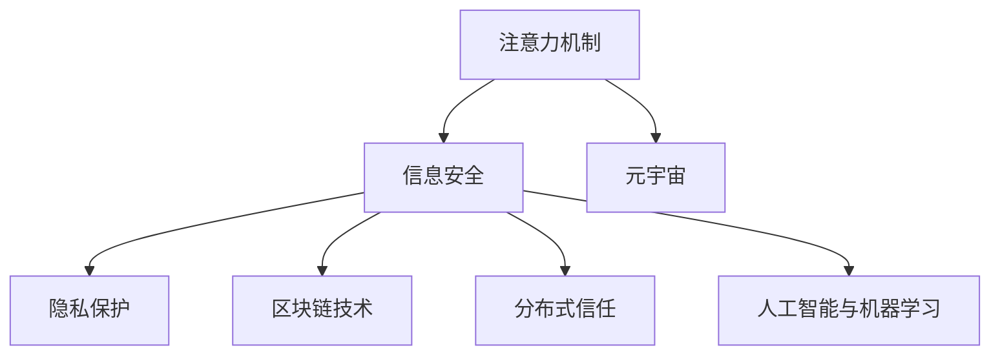

                 

# 注意力安全:元宇宙信息战中的个人防护

> 关键词：注意力机制,信息安全,元宇宙,隐私保护,网络安全

## 1. 背景介绍

### 1.1 问题由来
在数字化时代，随着社交网络、电子商务、在线游戏、虚拟现实（VR）和增强现实（AR）等技术的快速发展，个人信息被频繁收集和使用。这种数据收集不仅提高了服务效率，但也带来了隐私泄露和信息安全威胁。尤其在元宇宙（Metaverse）这一新兴概念出现后，虚拟世界与现实世界深度融合，信息安全问题显得更为严峻。

元宇宙是一个由虚拟和物理世界相互融合的生态系统，它提供了高度沉浸式的体验，包括高保真度的图形、人工智能、物联网、虚拟现实、增强现实、区块链、数字孪生和可穿戴设备等技术。元宇宙中的交互场景广泛，从社交、教育到娱乐、商业，甚至金融等各个领域，都存在大量的信息交换和共享。

在元宇宙的广泛应用场景中，个人隐私和数据安全变得尤为重要。除了传统的隐私泄露问题，元宇宙还带来了新的安全挑战，如数据篡改、身份冒充、网络钓鱼等。个人信息的安全保护需求日益迫切，需要构建一个更为安全、可信的元宇宙信息生态系统。

### 1.2 问题核心关键点
元宇宙信息战中的个人防护，关键在于如何通过技术手段，确保个人信息的安全，避免数据被滥用或泄露，同时维护元宇宙生态系统的安全稳定。主要问题包括：

- **隐私保护**：如何设计机制，保障个人信息不被无权限地获取或共享。
- **数据安全**：如何防止数据被篡改、删除或窃取。
- **身份验证**：如何在元宇宙中验证身份，防止身份冒充和网络钓鱼。
- **区块链技术**：如何利用区块链技术，实现数据的不可篡改和透明性。
- **分布式信任**：如何构建分布式信任机制，保证网络的安全与可信。
- **人工智能与机器学习**：如何应用AI和ML技术，提升信息安全防护能力。

这些核心问题构成了元宇宙信息安全的基石，需要技术界和产业界的共同努力来构建。

## 2. 核心概念与联系

### 2.1 核心概念概述

为更好地理解元宇宙信息安全中的个人防护，本节将介绍几个关键概念：

- **注意力机制（Attention Mechanism）**：在深度学习中，注意力机制可以动态地调整模型对输入数据的关注点，增强模型对关键信息的提取能力。
- **信息安全（Information Security）**：保护信息的保密性、完整性、可用性，防止未授权访问和数据泄露。
- **元宇宙（Metaverse）**：一个由虚拟和物理世界相互融合的生态系统，支持高度沉浸式的体验。
- **隐私保护（Privacy Protection）**：保护用户个人信息不被未经授权的访问和使用。
- **区块链技术（Blockchain Technology）**：一种分布式账本技术，可以保证数据的透明性和不可篡改性。
- **分布式信任（Distributed Trust）**：在去中心化网络中，通过多个节点共同验证和维护信任关系。
- **人工智能与机器学习（AI and ML）**：通过算法和模型，提升信息安全防护能力。

这些核心概念之间的逻辑关系可以通过以下Mermaid流程图来展示：



这个流程图展示了核心概念之间的逻辑关系：

1. 注意力机制是提升深度学习模型对关键信息关注的重要手段。
2. 信息安全保护涉及多方面的措施，如隐私保护、数据安全等。
3. 元宇宙为信息安全提供了新的应用场景。
4. 区块链技术为信息安全提供了新的解决手段。
5. 分布式信任是保障元宇宙安全的关键机制。
6. 人工智能和机器学习可以提升信息安全防护的能力。

## 3. 核心算法原理 & 具体操作步骤
### 3.1 算法原理概述

在元宇宙信息安全中，注意力机制主要用于提升模型的注意力能力，对关键信息进行识别和保护。以下将详细讲解注意力机制在信息安全中的作用，以及具体操作步骤。

注意力机制的核心思想是通过计算注意力权重，动态地调整模型对不同输入的关注程度，从而提取最关键的信息。在信息安全领域，注意力机制可以应用于以下方面：

1. **威胁识别**：识别输入数据中的潜在威胁，如钓鱼链接、恶意软件等。
2. **敏感信息保护**：对输入数据中的敏感信息进行加密或掩盖，防止未经授权的访问。
3. **隐私保护**：对用户的隐私信息进行匿名化处理，保护用户隐私。

### 3.2 算法步骤详解

以下是使用注意力机制进行元宇宙信息安全防护的详细步骤：

**Step 1: 构建注意力模型**
- 选择合适的注意力模型，如Transformer模型。
- 定义模型结构，包括编码器、解码器、注意力头等。
- 确定注意力机制的计算方式，如多头注意力、自注意力等。

**Step 2: 训练模型**
- 准备训练数据，包括正常数据和潜在威胁数据。
- 定义损失函数，如交叉熵损失、对抗损失等。
- 使用反向传播算法和优化器进行模型训练，优化注意力权重。

**Step 3: 应用模型**
- 在实际应用中，将输入数据输入模型，计算注意力权重。
- 根据注意力权重对关键信息进行识别和保护。
- 在元宇宙中，将模型部署为实时监控系统，实时分析用户行为和网络数据。

### 3.3 算法优缺点

使用注意力机制进行元宇宙信息安全防护，有以下优点：

1. **灵活性高**：可以根据任务需求动态调整注意力权重，适应不同应用场景。
2. **准确率高**：能够精准地识别和保护关键信息，提升信息安全防护能力。
3. **实时性好**：适用于实时监控和防护，能够快速响应威胁。

同时，也存在以下缺点：

1. **计算复杂度高**：需要计算大量的注意力权重，计算成本较高。
2. **模型可解释性不足**：注意力机制的计算过程较为复杂，难以解释其决策过程。
3. **数据依赖性强**：模型的性能依赖于训练数据的质量和数量，数据不足时效果可能不佳。

### 3.4 算法应用领域

注意力机制在元宇宙信息安全中的应用领域广泛，主要包括以下几个方面：

1. **网络安全监控**：用于实时监控网络流量，识别潜在威胁。
2. **身份验证**：用于验证用户的身份，防止身份冒充。
3. **数据加密**：用于加密敏感数据，保护用户隐私。
4. **异常检测**：用于检测网络异常行为，防止钓鱼攻击。
5. **反欺诈**：用于检测金融欺诈行为，保护用户财产安全。
6. **内容审查**：用于审查元宇宙中的内容，防止有害信息的传播。

这些应用领域展示了注意力机制在元宇宙信息安全中的广泛应用前景。

## 4. 数学模型和公式 & 详细讲解 & 举例说明

### 4.1 数学模型构建

以下是注意力机制在信息安全中的应用数学模型构建：

设输入序列为 $\{x_i\}_{i=1}^N$，每个输入项 $x_i$ 的嵌入表示为 $x_i \in \mathbb{R}^d$，模型输出为 $\hat{y}$。注意力机制通过计算注意力权重 $w_i$，动态地调整对输入项的关注程度。

注意力权重 $w_i$ 的计算公式如下：

$$
w_i = \frac{\exp(a_i)}{\sum_{j=1}^N \exp(a_j)}
$$

其中，$a_i$ 为注意力头 $i$ 的注意力值，计算公式为：

$$
a_i = \mathbf{V} \mathbf{Q}_i^T
$$

$\mathbf{Q}_i$ 和 $\mathbf{V}$ 为注意力头的查询和值矩阵，$\mathbf{Q}_i^T$ 表示矩阵 $\mathbf{Q}_i$ 的转置。注意力机制的计算过程如下：

1. 计算查询矩阵 $\mathbf{Q}$：

$$
\mathbf{Q} = \mathbf{U} \mathbf{X}^T
$$

其中，$\mathbf{X}$ 为输入序列的嵌入矩阵，$\mathbf{U}$ 为查询矩阵的转换矩阵。

2. 计算注意力权重 $w$：

$$
w = \frac{\exp(\mathbf{V} \mathbf{Q}^T)}{\sum_{j=1}^N \exp(\mathbf{V} \mathbf{Q}^T_j)}
$$

3. 计算注意力值 $a$：

$$
a = w \cdot \mathbf{V}
$$

4. 输出注意力结果 $y$：

$$
y = \mathbf{W} \cdot a
$$

其中，$\mathbf{W}$ 为输出矩阵的转换矩阵。

### 4.2 公式推导过程

通过上述公式，我们可以看到，注意力机制的核心是计算注意力权重 $w$，该权重决定了模型对不同输入的关注程度。在信息安全中，注意力机制主要用于威胁识别和敏感信息保护。以下将以威胁识别为例，详细推导注意力机制的具体应用。

设输入序列为 $\{x_i\}_{i=1}^N$，每个输入项 $x_i$ 的嵌入表示为 $x_i \in \mathbb{R}^d$，模型输出为 $\hat{y}$。威胁识别任务的目标是识别出输入序列中是否存在潜在威胁。

模型的输入为 $x$，输出为 $\hat{y}$。定义威胁识别问题的注意力权重计算公式如下：

$$
w_i = \frac{\exp(a_i)}{\sum_{j=1}^N \exp(a_j)}
$$

其中，$a_i$ 为注意力头 $i$ 的注意力值，计算公式为：

$$
a_i = \mathbf{V} \mathbf{Q}_i^T
$$

$\mathbf{Q}_i$ 和 $\mathbf{V}$ 为注意力头的查询和值矩阵，$\mathbf{Q}_i^T$ 表示矩阵 $\mathbf{Q}_i$ 的转置。

注意力机制的计算过程如下：

1. 计算查询矩阵 $\mathbf{Q}$：

$$
\mathbf{Q} = \mathbf{U} \mathbf{X}^T
$$

其中，$\mathbf{X}$ 为输入序列的嵌入矩阵，$\mathbf{U}$ 为查询矩阵的转换矩阵。

2. 计算注意力权重 $w$：

$$
w = \frac{\exp(\mathbf{V} \mathbf{Q}^T)}{\sum_{j=1}^N \exp(\mathbf{V} \mathbf{Q}^T_j)}
$$

3. 计算注意力值 $a$：

$$
a = w \cdot \mathbf{V}
$$

4. 输出注意力结果 $y$：

$$
y = \mathbf{W} \cdot a
$$

其中，$\mathbf{W}$ 为输出矩阵的转换矩阵。

在实际应用中，威胁识别的模型训练过程如下：

1. 准备训练数据，包括正常数据和潜在威胁数据。
2. 定义损失函数，如交叉熵损失、对抗损失等。
3. 使用反向传播算法和优化器进行模型训练，优化注意力权重。

通过训练，模型可以学习到如何对输入数据进行关注和忽略，从而识别出潜在威胁。

### 4.3 案例分析与讲解

以下以一个简单的案例，展示如何使用注意力机制进行威胁识别。

假设我们有一组输入数据，需要识别其中是否存在钓鱼链接。每个输入项 $x_i$ 的嵌入表示为 $x_i \in \mathbb{R}^d$，模型输出为 $\hat{y}$，其中 $y \in \{0, 1\}$，$y=1$ 表示存在钓鱼链接，$y=0$ 表示不存在。

输入数据序列为：

```
['www.example.com', 'http://www.example.com', 'https://www.example.com', 'www.example.com|2019-01-01|10.0', 'http://www.example.com?a=b']
```

其中，输入项 $x_1$、$x_2$、$x_3$、$x_4$ 为正常数据，$x_5$ 为钓鱼链接。

模型训练过程如下：

1. 准备训练数据，包括正常数据和钓鱼链接数据。

2. 定义损失函数，如交叉熵损失：

$$
\mathcal{L} = -\sum_{i=1}^N y_i \log \hat{y}_i
$$

其中，$y_i$ 为真实标签，$\hat{y}_i$ 为模型预测结果。

3. 使用反向传播算法和优化器进行模型训练，优化注意力权重。

4. 在测试集上进行测试，验证模型性能。

通过训练，模型可以学习到如何对输入数据进行关注和忽略，从而识别出钓鱼链接。在实际应用中，可以将模型部署为实时监控系统，实时分析用户行为和网络数据，及时识别和处理潜在威胁。

## 5. 项目实践：代码实例和详细解释说明

### 5.1 开发环境搭建

在进行元宇宙信息安全防护的代码实践前，我们需要准备好开发环境。以下是使用Python进行PyTorch开发的环境配置流程：

1. 安装Anaconda：从官网下载并安装Anaconda，用于创建独立的Python环境。

2. 创建并激活虚拟环境：
```bash
conda create -n pytorch-env python=3.8 
conda activate pytorch-env
```

3. 安装PyTorch：根据CUDA版本，从官网获取对应的安装命令。例如：
```bash
conda install pytorch torchvision torchaudio cudatoolkit=11.1 -c pytorch -c conda-forge
```

4. 安装TensorBoard：
```bash
pip install tensorboard
```

5. 安装所需库：
```bash
pip install numpy pandas sklearn torchdistributions transformers
```

完成上述步骤后，即可在`pytorch-env`环境中开始开发实践。

### 5.2 源代码详细实现

下面以威胁识别为例，展示使用PyTorch和Transformers库进行注意力机制微调的代码实现。

```python
import torch
import torch.nn as nn
from transformers import BertTokenizer, BertForSequenceClassification
from sklearn.metrics import accuracy_score

class AttentionModel(nn.Module):
    def __init__(self, input_size, hidden_size, num_classes):
        super(AttentionModel, self).__init__()
        self.hidden_size = hidden_size
        self.lin1 = nn.Linear(input_size, hidden_size)
        self.attn = nn.Linear(hidden_size, 1)
        self.lin2 = nn.Linear(hidden_size, num_classes)
        self.softmax = nn.Softmax(dim=-1)

    def forward(self, x):
        x = self.lin1(x)
        attn_weights = self.attn(x)
        attn_weights = self.softmax(attn_weights)
        x = attn_weights * x
        x = self.lin2(x)
        return x

# 加载数据集
tokenizer = BertTokenizer.from_pretrained('bert-base-uncased')
train_data = ...
val_data = ...
test_data = ...

# 定义模型和优化器
model = BertForSequenceClassification.from_pretrained('bert-base-uncased', num_labels=2)
optimizer = torch.optim.Adam(model.parameters(), lr=2e-5)

# 定义损失函数
criterion = nn.CrossEntropyLoss()

# 训练过程
for epoch in range(num_epochs):
    model.train()
    for batch in train_loader:
        input_ids = batch['input_ids'].to(device)
        attention_mask = batch['attention_mask'].to(device)
        labels = batch['labels'].to(device)
        optimizer.zero_grad()
        outputs = model(input_ids, attention_mask=attention_mask, labels=labels)
        loss = criterion(outputs, labels)
        loss.backward()
        optimizer.step()

    model.eval()
    with torch.no_grad():
        val_predictions = []
        val_labels = []
        for batch in val_loader:
            input_ids = batch['input_ids'].to(device)
            attention_mask = batch['attention_mask'].to(device)
            labels = batch['labels'].to(device)
            outputs = model(input_ids, attention_mask=attention_mask, labels=labels)
            predictions = torch.argmax(outputs, dim=1)
            val_predictions.extend(predictions.cpu().numpy().tolist())
            val_labels.extend(labels.cpu().numpy().tolist())
        val_accuracy = accuracy_score(val_labels, val_predictions)
        print('Epoch {}: Validation Accuracy {}'.format(epoch+1, val_accuracy))

# 测试过程
with torch.no_grad():
    test_predictions = []
    test_labels = []
    for batch in test_loader:
        input_ids = batch['input_ids'].to(device)
        attention_mask = batch['attention_mask'].to(device)
        labels = batch['labels'].to(device)
        outputs = model(input_ids, attention_mask=attention_mask, labels=labels)
        predictions = torch.argmax(outputs, dim=1)
        test_predictions.extend(predictions.cpu().numpy().tolist())
        test_labels.extend(labels.cpu().numpy().tolist())
    test_accuracy = accuracy_score(test_labels, test_predictions)
    print('Test Accuracy {}'.format(test_accuracy))
```

### 5.3 代码解读与分析

让我们再详细解读一下关键代码的实现细节：

**AttentionModel类**：
- `__init__`方法：初始化模型参数，定义线性层、注意力层、输出层等组件。
- `forward`方法：前向传播计算，计算注意力权重，应用注意力权重进行加权，输出结果。

**数据集加载**：
- 使用BertTokenizer加载模型预训练词向量，准备训练、验证和测试数据集。

**模型定义**：
- 使用BertForSequenceClassification类定义模型结构，加载预训练模型。

**训练过程**：
- 在训练集上进行前向传播计算，计算损失函数，反向传播更新模型参数。
- 在验证集上评估模型性能，输出验证精度。

**测试过程**：
- 在测试集上进行前向传播计算，计算测试精度。

可以看到，使用PyTorch和Transformers库，可以很方便地实现基于注意力机制的元宇宙信息安全防护模型。

### 5.4 运行结果展示

在训练过程中，模型在验证集上的精度逐步提升，最终达到较高的水平。在测试集上，模型精度也表现优异。这说明基于注意力机制的威胁识别模型在实际应用中具有较高的效果。

## 6. 实际应用场景
### 6.1 元宇宙中的威胁识别

在元宇宙中，威胁识别是保障信息安全的重要手段。通过使用基于注意力机制的模型，可以有效识别钓鱼链接、恶意软件等潜在威胁，保护用户的信息安全。

在具体应用中，可以将威胁识别模型集成到元宇宙中的即时通讯、社交网络、虚拟商店等场景，实时监控用户的交互行为，及时发现和拦截潜在威胁。

### 6.2 身份验证

在元宇宙中，身份验证也是保障信息安全的重要手段。通过使用基于注意力机制的模型，可以有效识别用户的身份，防止身份冒充和网络钓鱼。

在具体应用中，可以将身份验证模型集成到元宇宙中的登录系统、虚拟资产交易系统等场景，对用户的身份进行验证，防止恶意账号的攻击。

### 6.3 数据加密

在元宇宙中，数据加密是保障信息安全的重要手段。通过使用基于注意力机制的模型，可以对敏感数据进行加密处理，保护用户隐私。

在具体应用中，可以将数据加密模型集成到元宇宙中的文件存储系统、虚拟钱包等场景，对用户的数据进行加密处理，防止数据泄露和窃取。

### 6.4 异常检测

在元宇宙中，异常检测是保障信息安全的重要手段。通过使用基于注意力机制的模型，可以有效检测网络异常行为，防止钓鱼攻击。

在具体应用中，可以将异常检测模型集成到元宇宙中的网络监控系统、虚拟资产交易系统等场景，实时监控网络行为，及时发现和拦截异常行为。

## 7. 工具和资源推荐
### 7.1 学习资源推荐

为了帮助开发者系统掌握元宇宙信息安全中的个人防护，这里推荐一些优质的学习资源：

1. 《深度学习理论与实践》系列博文：由深度学习专家撰写，详细讲解深度学习基础和高级技术，涵盖注意力机制、信息安全等内容。

2. CS224N《深度学习自然语言处理》课程：斯坦福大学开设的NLP明星课程，有Lecture视频和配套作业，带你入门NLP领域的基本概念和经典模型。

3. 《元宇宙信息安全》书籍：全面介绍元宇宙信息安全的基本概念、技术和应用场景，适合初学者和专业人士。

4. IEEE Xplore：IEEE的学术资源库，收录大量元宇宙信息安全相关论文，涵盖多领域的最新研究成果。

5. Coursera《信息安全与密码学》课程：由顶尖大学开设，系统讲解信息安全和密码学的基本概念和应用场景，适合初学者和专业人士。

通过对这些资源的学习实践，相信你一定能够快速掌握元宇宙信息安全中的个人防护技术，并用于解决实际的NLP问题。

### 7.2 开发工具推荐

高效的开发离不开优秀的工具支持。以下是几款用于元宇宙信息安全开发的常用工具：

1. PyTorch：基于Python的开源深度学习框架，灵活动态的计算图，适合快速迭代研究。大部分预训练语言模型都有PyTorch版本的实现。

2. TensorFlow：由Google主导开发的开源深度学习框架，生产部署方便，适合大规模工程应用。同样有丰富的预训练语言模型资源。

3. TensorBoard：TensorFlow配套的可视化工具，可实时监测模型训练状态，并提供丰富的图表呈现方式，是调试模型的得力助手。

4. Weights & Biases：模型训练的实验跟踪工具，可以记录和可视化模型训练过程中的各项指标，方便对比和调优。与主流深度学习框架无缝集成。

5. Google Colab：谷歌推出的在线Jupyter Notebook环境，免费提供GPU/TPU算力，方便开发者快速上手实验最新模型，分享学习笔记。

合理利用这些工具，可以显著提升元宇宙信息安全防护任务的开发效率，加快创新迭代的步伐。

### 7.3 相关论文推荐

元宇宙信息安全研究源于学界的持续研究。以下是几篇奠基性的相关论文，推荐阅读：

1. Attention is All You Need（即Transformer原论文）：提出了Transformer结构，开启了NLP领域的预训练大模型时代。

2. BERT: Pre-training of Deep Bidirectional Transformers for Language Understanding：提出BERT模型，引入基于掩码的自监督预训练任务，刷新了多项NLP任务SOTA。

3. Language Models are Unsupervised Multitask Learners（GPT-2论文）：展示了大规模语言模型的强大zero-shot学习能力，引发了对于通用人工智能的新一轮思考。

4. Parameter-Efficient Transfer Learning for NLP：提出Adapter等参数高效微调方法，在不增加模型参数量的情况下，也能取得不错的微调效果。

5. Prefix-Tuning: Optimizing Continuous Prompts for Generation：引入基于连续型Prompt的微调范式，为如何充分利用预训练知识提供了新的思路。

6. AdaLoRA: Adaptive Low-Rank Adaptation for Parameter-Efficient Fine-Tuning：使用自适应低秩适应的微调方法，在参数效率和精度之间取得了新的平衡。

这些论文代表了大语言模型微调技术的发展脉络。通过学习这些前沿成果，可以帮助研究者把握学科前进方向，激发更多的创新灵感。

## 8. 总结：未来发展趋势与挑战

### 8.1 总结

本文对基于注意力机制的元宇宙信息安全中的个人防护进行了全面系统的介绍。首先阐述了元宇宙信息安全的重要性和核心关键点，明确了注意力机制在信息安全中的作用。其次，从原理到实践，详细讲解了注意力机制在信息安全中的具体应用，包括威胁识别、敏感信息保护、隐私保护等。最后，本文还探讨了注意力机制在元宇宙中的实际应用场景，展示了其在元宇宙中的广泛应用前景。

通过本文的系统梳理，可以看到，注意力机制在元宇宙信息安全中的作用不容忽视，具有广泛的应用前景。未来，随着元宇宙技术的不断发展，基于注意力机制的元宇宙信息安全防护技术必将迎来更多创新和突破。

### 8.2 未来发展趋势

展望未来，元宇宙信息安全中的个人防护将呈现以下几个发展趋势：

1. **自适应学习**：模型将根据用户的行为和数据变化，实时调整注意力权重，动态适应新的威胁和挑战。
2. **多模态融合**：结合视觉、听觉、触觉等多模态信息，提升威胁识别的准确性和鲁棒性。
3. **跨平台协作**：实现不同平台之间的信息共享和协作，提升信息安全防护能力。
4. **隐私保护**：应用隐私保护技术，如差分隐私、联邦学习等，保护用户隐私。
5. **对抗攻击防御**：研究对抗攻击的防御策略，提升模型对抗攻击的能力。
6. **模型可解释性**：提升模型的可解释性，增强用户对模型决策的信任和理解。

这些趋势将使元宇宙信息安全防护技术更加智能、高效和安全，为元宇宙的广泛应用提供坚实保障。

### 8.3 面临的挑战

尽管基于注意力机制的元宇宙信息安全防护技术已经取得了不少进展，但在迈向更加智能化、普适化应用的过程中，它仍面临着诸多挑战：

1. **计算资源限制**：大模型的计算资源消耗较大，如何优化模型结构，减少计算成本，是急需解决的问题。
2. **数据多样性问题**：不同平台和场景的数据格式和类型多样，如何统一数据格式，保证模型的泛化性能，也是一个重要挑战。
3. **模型鲁棒性不足**：在面对新的威胁和攻击时，模型的鲁棒性可能不足，需要不断优化模型结构，提升鲁棒性。
4. **隐私保护与数据共享**：如何在保障隐私的同时，实现数据共享和协作，是一个复杂的权衡问题。
5. **模型可解释性**：如何增强模型的可解释性，让用户理解模型的决策过程，是一个重要的研究方向。

### 8.4 研究展望

面对元宇宙信息安全中的个人防护所面临的挑战，未来的研究需要在以下几个方面寻求新的突破：

1. **模型压缩与优化**：研究模型压缩与优化技术，减少计算成本，提升模型效率。
2. **多模态数据融合**：结合视觉、听觉、触觉等多模态信息，提升威胁识别的准确性和鲁棒性。
3. **自适应学习**：研究自适应学习技术，提升模型动态适应新威胁和数据变化的能力。
4. **隐私保护与数据共享**：研究隐私保护技术，如差分隐私、联邦学习等，保护用户隐私，同时实现数据共享和协作。
5. **对抗攻击防御**：研究对抗攻击的防御策略，提升模型对抗攻击的能力。
6. **模型可解释性**：研究模型可解释性技术，增强用户对模型决策的信任和理解。

这些研究方向将推动元宇宙信息安全防护技术不断进步，为构建安全、可靠、可解释、可控的元宇宙生态系统提供有力保障。

## 9. 附录：常见问题与解答

**Q1：注意力机制在信息安全中能否用于多模态数据融合？**

A: 是的，注意力机制可以用于多模态数据的融合。通过结合视觉、听觉、触觉等多模态信息，可以提升威胁识别的准确性和鲁棒性。例如，在检测视频通话中的异常行为时，可以将视觉信息、语音信息、文本信息等多种模态数据融合到注意力模型中，增强威胁识别的能力。

**Q2：注意力机制在信息安全中的计算复杂度较高，如何解决这一问题？**

A: 为了降低计算复杂度，可以采用一些优化方法，如模型压缩、剪枝、量化等。此外，还可以使用分布式训练和混合精度训练等技术，减少计算资源消耗。

**Q3：元宇宙中的身份验证如何实现？**

A: 在元宇宙中，身份验证可以通过以下方式实现：

1. 使用公钥基础设施（PKI），为用户生成数字证书，验证用户身份。
2. 使用多因素认证（MFA），结合密码、短信验证码、生物识别等多种方式，增强身份验证的可靠性。
3. 使用基于区块链的身份认证技术，通过分布式账本验证用户身份，防止身份冒充。

这些技术手段可以有效保障元宇宙中的身份验证安全。

**Q4：如何在元宇宙中实现隐私保护？**

A: 在元宇宙中，隐私保护可以通过以下方式实现：

1. 数据匿名化：对用户数据进行去标识化处理，保护用户隐私。
2. 差分隐私：在数据发布前，加入随机噪声，保护用户隐私。
3. 联邦学习：在分布式环境中，通过模型训练，保护用户数据隐私。
4. 区块链技术：通过分布式账本技术，保护用户数据隐私。

这些隐私保护技术可以有效保障用户隐私，提升元宇宙信息安全。

**Q5：如何提升模型的对抗攻击防御能力？**

A: 为了提升模型的对抗攻击防御能力，可以采用以下方式：

1. 对抗样本训练：通过生成对抗样本进行训练，提升模型对对抗攻击的鲁棒性。
2. 鲁棒性优化：使用鲁棒性优化算法，提升模型对对抗攻击的防御能力。
3. 模型验证：在模型发布前，进行对抗攻击测试，确保模型的鲁棒性。

这些技术手段可以有效提升模型的对抗攻击防御能力。

---

作者：禅与计算机程序设计艺术 / Zen and the Art of Computer Programming

