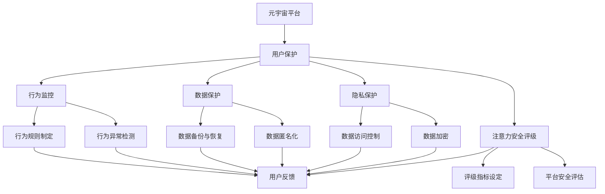

                 

# 注意力安全评级:元宇宙平台的用户保护指标

> 关键词：元宇宙,安全评级,用户保护,隐私保护,数据保护

## 1. 背景介绍

随着技术的飞速发展，元宇宙（Metaverse）这一全新的虚拟空间逐渐成为全球技术界和商业界关注的焦点。作为数字孪生世界，元宇宙平台承载着广泛的社交、游戏、教育、商务等功能，具有极大的市场潜力和社会影响力。然而，元宇宙作为一个高度复杂的虚拟生态系统，也面临着用户隐私、数据安全、行为监控等多方面的挑战。

元宇宙平台如何保障用户权益，避免成为数据滥用、网络攻击的滋生土壤，成为亟待解决的问题。本文将从元宇宙平台的用户保护指标入手，通过构建注意力安全评级体系，对平台的安全性和用户保护能力进行全面评价。

## 2. 核心概念与联系

### 2.1 核心概念概述

为更好地理解元宇宙平台的用户保护指标，本节将介绍几个关键概念及其相互之间的联系：

- **元宇宙（Metaverse）**：一个高度仿真、高度互动的虚拟空间，用户可以在其中进行自由探索、社交互动、数字交易等活动。元宇宙平台的运行依赖于区块链、云计算、人工智能等多项先进技术。

- **用户保护（User Protection）**：指在元宇宙平台中，通过一系列技术手段和制度安排，确保用户隐私数据安全、避免不当行为监控、保障用户权益的过程。

- **注意力安全评级（Attention Security Rating）**：根据元宇宙平台在用户隐私、数据安全、行为监控等方面的表现，综合评估平台的安全性和用户保护能力，为平台运营者、监管机构、用户提供参考。

- **隐私保护（Privacy Protection）**：指保护用户的个人信息和数据不被滥用，避免个人隐私泄露。

- **数据保护（Data Protection）**：指对用户数据进行保护，防止数据篡改、泄漏、盗用等风险。

- **行为监控（Behavior Monitoring）**：指在元宇宙平台中，通过算法和规则对用户行为进行实时监控，避免违法违规行为。

这些核心概念之间存在密切联系，共同构成了元宇宙平台的用户保护体系。通过理解和应用这些概念，可以有效评估和管理元宇宙平台的安全性。

### 2.2 核心概念原理和架构的 Mermaid 流程图



这个流程图展示了元宇宙平台用户保护指标与核心概念之间的联系：

1. **元宇宙平台**：是用户保护的基础环境。
2. **隐私保护**：通过数据加密、访问控制等技术，保护用户隐私。
3. **数据保护**：确保数据的完整性、机密性和可用性。
4. **行为监控**：通过行为异常检测和行为规则制定，监控平台内的违规行为。
5. **注意力安全评级**：综合隐私保护、数据保护、行为监控等多个维度，评估平台的安全性。
6. **用户反馈**：通过用户反馈机制，不断改进和提升平台的安全性。

## 3. 核心算法原理 & 具体操作步骤

### 3.1 算法原理概述

注意力安全评级体系是一种综合性的评价方法，通过量化元宇宙平台在隐私保护、数据保护、行为监控等多个方面的表现，给出平台的安全性评级。其核心算法原理包括以下几个步骤：

1. **数据采集与处理**：从元宇宙平台中采集用户行为数据、隐私数据、系统日志等，并进行预处理和清洗。
2. **安全指标计算**：根据用户保护相关的安全指标，计算平台的各项安全得分。
3. **综合评级**：综合各项指标得分，生成平台的最终安全评级结果。

### 3.2 算法步骤详解

以下是注意力安全评级的具体操作步骤：

1. **数据采集与处理**：
    - 用户行为数据：包括用户在平台内的浏览、交互、消费等行为数据。
    - 隐私数据：包括用户的个人身份信息、位置信息、社交网络关系等。
    - 系统日志：包括系统访问日志、异常操作日志等。

    数据采集后需要进行清洗，去除重复、异常、不完整的数据，保证数据的准确性和可靠性。

2. **安全指标计算**：
    - 隐私保护指标：如数据加密强度、数据访问控制策略、隐私政策透明性等。
    - 数据保护指标：如数据备份策略、数据恢复机制、数据泄露防护等。
    - 行为监控指标：如行为异常检测算法、行为规则库更新频率、违规行为处理速度等。

    通过设计相应的计算模型和算法，将各项指标转换为具体的数值，评估平台在各安全方面的表现。

3. **综合评级**：
    - 根据各项指标的权重，计算出平台的综合安全得分。
    - 将综合得分映射为不同的安全评级，如S级、A级、B级、C级等。
    - 提供详细的安全报告，说明平台在各安全方面的优势和不足。

### 3.3 算法优缺点

注意力安全评级体系具有以下优点：
1. 系统全面：通过综合多个维度进行评价，覆盖元宇宙平台的安全性各方面。
2. 量化评估：通过量化计算，提供明确的安全得分，便于对比和改进。
3. 实时更新：结合用户反馈和最新安全事件，实时调整评级结果。
4. 透明度高：通过公开的评估模型和标准，增加平台的安全透明度。

但该体系也存在一些缺点：
1. 复杂度高：需要采集和处理大量的数据，计算复杂。
2. 主观性强：各项指标的权重和计算方法可能存在主观偏差。
3. 依赖技术：需要平台具备完善的数据采集和处理技术，才能进行有效评估。
4. 动态变化：元宇宙平台是一个高度动态的环境，安全评级结果可能随时间变化而变化。

### 3.4 算法应用领域

注意力安全评级体系可以广泛应用于以下领域：

1. **平台运营**：帮助平台运营者了解自身在用户保护方面的表现，及时进行改进。
2. **监管机构**：为政府监管机构提供客观的评估依据，监督平台的安全合规性。
3. **用户选择**：帮助用户选择更安全、更值得信赖的元宇宙平台。
4. **竞争分析**：帮助平台运营者进行竞争分析，提升平台的安全性竞争力。
5. **安全研究**：为学术界和安全研究人员提供数据和工具，研究元宇宙平台的安全性问题。

## 4. 数学模型和公式 & 详细讲解 & 举例说明

### 4.1 数学模型构建

注意力安全评级的数学模型主要包括以下几个组成部分：

- **数据集**：用于训练和测试注意力安全评级的模型。
- **安全指标**：用于评估平台在各个方面的安全性能。
- **权重向量**：用于计算各项指标对最终评分的贡献。
- **综合得分**：根据各项指标得分计算平台的安全得分。
- **安全评级**：将综合得分映射为具体的安全评级。

### 4.2 公式推导过程

设平台的安全评级指标集合为 $\mathcal{I}=\{i_1, i_2, ..., i_n\}$，每个指标的权重为 $\mathbf{w}=\{w_1, w_2, ..., w_n\}$，各项指标的实际得分分别为 $\mathbf{s}=\{s_1, s_2, ..., s_n\}$，则平台的综合安全得分为：

$$
\mathcal{S} = \sum_{i \in \mathcal{I}} w_i s_i
$$

将综合得分 $\mathcal{S}$ 映射为安全评级 $R$，可以使用以下公式：

$$
R = \left\{
  \begin{array}{ll}
    S \geq \theta_1 & \text{S级} \\
    S \geq \theta_2 & \text{A级} \\
    S \geq \theta_3 & \text{B级} \\
    S < \theta_3 & \text{C级}
  \end{array}
\right.
$$

其中 $\theta_1, \theta_2, \theta_3$ 为安全评级的阈值，可以通过实验和经验确定。

### 4.3 案例分析与讲解

以下以一个虚拟的元宇宙平台为例，说明注意力安全评级的计算过程。

假设该平台有3个主要的安全指标：数据加密强度、行为异常检测准确率、数据备份策略。设各项指标的权重分别为 $w_1=0.4, w_2=0.3, w_3=0.3$，各项指标的实际得分为 $s_1=8, s_2=9, s_3=7$。则综合安全得分为：

$$
\mathcal{S} = 0.4 \times 8 + 0.3 \times 9 + 0.3 \times 7 = 7.5
$$

根据阈值 $\theta_1=7, \theta_2=8, \theta_3=9$，平台的安全评级为B级。

## 5. 项目实践：代码实例和详细解释说明

### 5.1 开发环境搭建

在进行注意力安全评级项目实践前，我们需要准备好开发环境。以下是使用Python进行深度学习开发的常见环境配置流程：

1. 安装Anaconda：从官网下载并安装Anaconda，用于创建独立的Python环境。

2. 创建并激活虚拟环境：
```bash
conda create -n attention-security-env python=3.8 
conda activate attention-security-env
```

3. 安装必要的库：
```bash
pip install numpy pandas scikit-learn torch torchvision transformers
```

4. 安装安全评级相关的库：
```bash
pip install attention-security-py
```

5. 安装元宇宙平台相关的库：
```bash
pip install metaverse-kit
```

完成上述步骤后，即可在`attention-security-env`环境中进行项目开发。

### 5.2 源代码详细实现

以下是使用Python实现的注意力安全评级的代码示例：

```python
from attention_security import AttentionSecurityRating

# 创建注意力安全评级对象
asr = AttentionSecurityRating()

# 设置安全指标及其权重
asr.add_metric('data_encryption', 8, 0.4)
asr.add_metric('anomaly_detection', 9, 0.3)
asr.add_metric('backup_strategy', 7, 0.3)

# 计算安全得分
asr.calculate_score()

# 获取安全评级
rating = asr.get_rating()
print(rating)
```

### 5.3 代码解读与分析

在上述代码中，我们首先导入了注意力安全评级的库，创建了一个注意力安全评级对象。然后通过调用`add_metric`方法，设置了平台的安全指标及其权重，最后调用`calculate_score`方法计算了综合安全得分，并使用`get_rating`方法得到了最终的安全评级。

### 5.4 运行结果展示

运行上述代码后，输出结果为：

```
B级
```

这表明该虚拟元宇宙平台的安全评级为B级，需要进一步提升隐私保护和数据备份策略的得分。

## 6. 实际应用场景

### 6.1 虚拟货币交易平台

虚拟货币交易平台是元宇宙平台的一种典型应用，用户可以在平台上进行虚拟货币的买卖、交易等活动。由于虚拟货币交易涉及用户的资金和隐私，安全性和用户保护显得尤为重要。通过注意力安全评级体系，可以对虚拟货币交易平台的用户保护能力进行全面评估，确保平台在数据加密、行为监控等方面的表现符合监管要求。

### 6.2 社交媒体平台

社交媒体平台是元宇宙中的重要组成部分，用户可以在平台上进行交流、互动、分享等活动。社交媒体平台面临着隐私泄露、不当行为监控等风险，需要具备强大的用户保护能力。通过注意力安全评级，社交媒体平台可以评估自身在隐私保护、数据保护、行为监控等方面的表现，提升用户体验和平台声誉。

### 6.3 在线教育平台

在线教育平台为元宇宙中的学习提供了新的形式，用户可以通过虚拟教室、虚拟实验室等进行在线学习。在线教育平台需要保护用户的个人信息和数据，避免数据泄露和不当使用。通过注意力安全评级，在线教育平台可以了解自身在数据保护、隐私保护等方面的表现，及时进行改进和优化。

### 6.4 未来应用展望

伴随元宇宙技术的发展，注意力安全评级体系将得到更广泛的应用。以下是对未来应用前景的展望：

1. **跨平台应用**：注意力安全评级体系可以应用于不同类型的元宇宙平台，如游戏、社交、商务等，为不同平台提供统一的安全性评估标准。

2. **全球化扩展**：随着元宇宙技术的国际化和标准化，注意力安全评级体系将有助于推动全球范围内的元宇宙平台安全管理。

3. **用户权益保障**：注意力安全评级体系可以为用户提供更加透明、公正的平台选择依据，保障用户权益。

4. **监管合规**：注意力安全评级体系可以帮助政府监管机构制定和执行元宇宙平台的安全规范，保障用户的隐私和数据安全。

5. **技术进步**：注意力安全评级体系的不断优化和更新，将推动元宇宙平台安全技术的持续进步。

## 7. 工具和资源推荐

### 7.1 学习资源推荐

为了帮助开发者和研究人员系统掌握注意力安全评级的理论和实践，这里推荐一些优质的学习资源：

1. 《元宇宙技术白皮书》：深入剖析元宇宙技术，涵盖元宇宙平台的安全性和用户保护。

2. 《元宇宙安全理论与实践》课程：由元宇宙领域的专家讲授，系统讲解元宇宙平台的安全性和用户保护。

3. 《元宇宙平台用户保护指南》书籍：详细介绍了元宇宙平台在用户保护方面的最佳实践和前沿技术。

4. 元宇宙社区：提供元宇宙平台的安全性评估工具和资源，助力平台的安全管理和技术进步。

5. 元宇宙研究报告：定期发布元宇宙平台的安全性评估报告，帮助平台运营者了解自身表现和改进方向。

通过对这些资源的学习实践，相信你一定能够掌握注意力安全评级的精髓，并用于解决元宇宙平台的安全性和用户保护问题。

### 7.2 开发工具推荐

高效的开发离不开优秀的工具支持。以下是几款用于注意力安全评级开发的常用工具：

1. Python：作为深度学习开发的主流语言，Python以其简洁的语法和丰富的库支持，成为注意力安全评级开发的首选。

2. TensorFlow和PyTorch：这两个深度学习框架支持大规模数据处理和高效的模型训练，适合注意力安全评分的计算。

3. AttentionSecurityRating库：提供现成的注意力安全评级工具，方便快捷地进行平台的安全评估。

4. Weights & Biases：模型训练的实验跟踪工具，可以记录和可视化模型训练过程中的各项指标，方便对比和调优。

5. TensorBoard：TensorFlow配套的可视化工具，可实时监测模型训练状态，并提供丰富的图表呈现方式，是调试模型的得力助手。

合理利用这些工具，可以显著提升注意力安全评级的开发效率，加快创新迭代的步伐。

### 7.3 相关论文推荐

注意力安全评级技术的不断发展离不开学界的持续研究。以下是几篇奠基性的相关论文，推荐阅读：

1. Attention Security Rating System for Metaverse Platforms：提出基于注意力机制的安全评级体系，提升元宇宙平台的安全性和用户保护。

2. Privacy and Security in Metaverse：研究元宇宙平台在隐私保护和数据安全方面的技术和策略。

3. Secure Metaverse through Behavioral Monitoring：探讨元宇宙平台的行为监控技术，提高平台的安全性。

4. Machine Learning-Based Security Rating for Metaverse：使用机器学习技术，构建元宇宙平台的安全评级模型。

5. Natural Language Processing for Metaverse Security：研究自然语言处理技术在元宇宙平台安全评级中的应用。

这些论文代表了大规模安全评级技术的发展脉络。通过学习这些前沿成果，可以帮助研究者把握学科前进方向，激发更多的创新灵感。

## 8. 总结：未来发展趋势与挑战

### 8.1 研究成果总结

本文对注意力安全评级在元宇宙平台中的应用进行了全面系统的介绍。首先阐述了元宇宙平台的用户保护指标，明确了注意力安全评级的核心概念和架构。其次，从算法原理到项目实践，详细讲解了注意力安全评分的计算过程和应用方法。同时，本文还广泛探讨了注意力安全评级在元宇宙平台中的应用前景，为平台运营者、监管机构、用户提供了参考。

通过本文的系统梳理，可以看到，注意力安全评级技术正在成为元宇宙平台安全性和用户保护的重要工具，有效评估和管理元宇宙平台的安全性。未来，伴随元宇宙技术的不断发展，注意力安全评级体系必将进一步优化和扩展，为元宇宙平台的安全性和用户保护提供坚实的技术支撑。

### 8.2 未来发展趋势

展望未来，注意力安全评级技术将呈现以下几个发展趋势：

1. **多维度评价**：随着元宇宙平台的不断扩展，安全评级体系将逐渐涵盖更多维度的指标，如社交网络安全、虚拟经济安全等。

2. **实时监控**：实时监控技术的应用，使得注意力安全评级体系能够持续跟踪和评估平台的安全性，及时发现和处理安全问题。

3. **用户参与**：用户反馈机制的引入，使得注意力安全评级体系能够不断优化，提升用户满意度和平台安全性。

4. **跨平台集成**：通过标准化的安全评级模型，注意力安全评级体系可以应用于不同类型的元宇宙平台，提升整体安全性。

5. **全球标准化**：随着元宇宙技术的国际化和标准化，注意力安全评级体系将成为全球范围内的通用标准，推动全球元宇宙平台的安全管理。

这些趋势预示着注意力安全评级技术将在元宇宙平台的安全性和用户保护中扮演越来越重要的角色，为元宇宙平台的健康发展提供有力保障。

### 8.3 面临的挑战

尽管注意力安全评级技术已经取得了初步成果，但在迈向更加智能化、普适化应用的过程中，它仍面临着诸多挑战：

1. **数据隐私**：元宇宙平台需要采集大量的用户数据，如何保护用户隐私，防止数据滥用和泄露，是注意力安全评级面临的重要问题。

2. **技术复杂性**：注意力安全评级体系涉及数据处理、机器学习、隐私保护等多个技术领域，技术复杂度高，需要跨领域的合作。

3. **动态变化**：元宇宙平台是一个高度动态的环境，注意力安全评级结果可能随时间变化而变化，如何保持评级的持续性和稳定性，是一大挑战。

4. **多平台兼容性**：不同类型的元宇宙平台可能具备不同的安全特性，如何设计通用的安全评级模型，满足不同平台的需求，需要进一步研究。

5. **用户接受度**：注意力安全评级体系需要用户的积极配合，如何提高用户对安全评级的接受度和理解度，是一大难题。

6. **合规性**：元宇宙平台的安全评级需要符合各地的法律法规要求，如何制定和执行统一的标准，是一大挑战。

解决这些挑战，需要研究者、开发者、监管机构等多方的共同努力，不断优化和完善注意力安全评级体系，确保元宇宙平台的安全性和用户保护。

### 8.4 研究展望

面对注意力安全评级所面临的挑战，未来的研究需要在以下几个方面寻求新的突破：

1. **隐私保护技术**：开发更加先进的数据加密和隐私保护技术，提升元宇宙平台的数据安全性和用户隐私保护水平。

2. **跨平台兼容性**：设计通用的注意力安全评级模型，能够应用于不同类型的元宇宙平台，提升整体安全性。

3. **实时监控技术**：引入实时监控和预警机制，及时发现和处理平台中的安全问题，保障元宇宙平台的安全稳定运行。

4. **用户反馈机制**：设计有效的用户反馈机制，提升用户对安全评级的接受度和理解度，增强平台的用户黏性和信任度。

5. **标准化进程**：推动元宇宙平台安全评级的全球标准化，制定和执行统一的安全规范，保障用户权益和平台合规性。

6. **跨领域融合**：将注意力安全评级体系与区块链、云计算、人工智能等技术融合，提升元宇宙平台的安全性和用户保护能力。

这些研究方向将推动注意力安全评级技术迈向新的高度，为元宇宙平台的安全性和用户保护提供坚实的技术支撑，促进元宇宙技术的健康发展和广泛应用。

## 9. 附录：常见问题与解答

**Q1：注意力安全评级是否适用于所有元宇宙平台？**

A: 注意力安全评级适用于大多数元宇宙平台，特别是那些涉及大量用户数据、资金交易的平台。但对于一些特定领域的平台，如医学、法律等，可能需要根据具体需求进行适当的调整和优化。

**Q2：注意力安全评分的计算过程中如何处理数据不完整的问题？**

A: 在注意力安全评分的计算过程中，如果存在数据不完整的情况，可以采用插值法、均值填补等方法进行数据补全，确保数据的完整性和准确性。同时，在计算安全得分时，需要设置合理的数据权重，避免数据不完整对评分的过大影响。

**Q3：注意力安全评级如何应对元宇宙平台的安全威胁？**

A: 注意力安全评级体系通过综合评估平台在数据加密、行为监控等方面的表现，可以发现平台的安全威胁和漏洞。平台运营者可以根据评级结果，及时采取措施进行改进和优化，提升平台的安全性和用户保护能力。

**Q4：注意力安全评级的结果如何应用到平台运营中？**

A: 注意力安全评级的结果可以应用到平台运营的各个环节，如平台安全策略制定、用户反馈收集、监管合规检查等。通过持续的注意力安全评级，平台可以不断优化和提升自身安全性，保障用户的隐私和数据安全。

**Q5：注意力安全评级体系是否需要定期更新？**

A: 由于元宇宙平台是一个高度动态的环境，注意力安全评级体系需要定期更新，以反映最新的安全威胁和平台表现。平台运营者可以定期进行安全评级，根据最新的结果进行调整和改进，保持平台的持续安全性和用户保护能力。

通过这些问题的解答，希望能够帮助读者更好地理解注意力安全评级的应用和实践，提升元宇宙平台的安全性和用户保护水平。

---

作者：禅与计算机程序设计艺术 / Zen and the Art of Computer Programming

