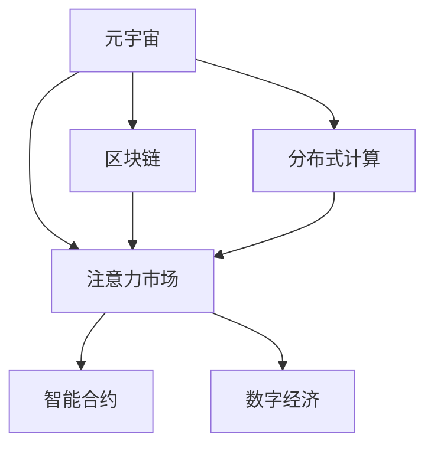

                 

# 注意力市场：元宇宙时代下的信息交易

> 关键词：元宇宙,信息交易,注意力市场,区块链,分布式计算,智能合约,数字经济

## 1. 背景介绍

### 1.1 问题由来

元宇宙（Metaverse），作为虚拟与现实深度融合的未来数字文明，为人类探索新世界的可能性提供了无限可能。在元宇宙时代，信息将成为最重要的资产和交易对象。传统的互联网信息交流模式面临巨大挑战，亟需一种新型的、能够适应元宇宙特点的信息交易机制。

在这一背景下，注意力市场（Attention Market）应运而生。通过区块链和分布式计算技术，构建去中心化、透明度高、安全可靠的信息交易平台，旨在解决信息流通中的价值交换难题，促进数字经济的发展。

### 1.2 问题核心关键点

注意力市场（Attention Market）的核心思想是通过区块链技术，对信息提供者（知识专家、内容创作者）的注意力价值进行量化和交换。市场参与者（用户、投资者）通过智能合约，以数字货币的形式对信息提供者进行激励，实现信息与价值的精准匹配。

其核心挑战在于：
1. **信息价值的量化**：如何量化信息提供者的注意力价值，并形成可交易的数字资产。
2. **智能合约的设计**：如何设计智能合约以实现信息价值的安全、透明、高效的交换。
3. **激励机制的设计**：如何设计有效的激励机制，保障信息提供者的持续产出和质量。
4. **市场的流动性**：如何提高市场的流动性和参与度，吸引更多用户和投资者。

### 1.3 问题研究意义

在元宇宙时代，信息市场的规模和复杂度将远超传统互联网。通过注意力市场，可以实现信息与价值的精准匹配，大幅提升信息传播的效率和效果，促进数字经济的发展。同时，其去中心化、透明、安全等特点，也将为数字文明的基础设施建设提供重要参考。

## 2. 核心概念与联系

### 2.1 核心概念概述

为更好地理解注意力市场，本节将介绍几个密切相关的核心概念：

- **元宇宙（Metaverse）**：虚拟与现实深度融合的数字文明，包含虚拟空间、虚拟资产、虚拟经济等多个方面。
- **注意力市场（Attention Market）**：基于区块链技术构建的去中心化信息交易平台，通过智能合约实现信息与价值的交换。
- **区块链（Blockchain）**：去中心化的分布式账本技术，保障信息交易的安全性、透明性和不可篡改性。
- **分布式计算（Distributed Computing）**：将计算任务分布在多台计算机上协同完成，提升信息处理的效率和可扩展性。
- **智能合约（Smart Contracts）**：基于区块链的自动执行代码，实现信息价值交换的自动化和透明化。
- **数字经济（Digital Economy）**：依托于数字技术发展的新经济形态，包括数字资产、数字货币、数字服务等多个方面。

这些概念之间的逻辑关系可以通过以下Mermaid流程图来展示：



这个流程图展示了大语言模型的核心概念及其之间的关系：

1. 元宇宙为信息市场提供了新的应用场景。
2. 区块链和分布式计算技术，提供了信息市场的基础设施支持。
3. 智能合约，是信息市场价值交换的自动化工具。
4. 数字经济，是信息市场发展的经济基础。

这些概念共同构成了注意力市场的工作原理和优化方向。通过理解这些核心概念，我们可以更好地把握注意力市场的运作机制和价值所在。

## 3. 核心算法原理 & 具体操作步骤
### 3.1 算法原理概述

注意力市场（Attention Market）的算法原理基于区块链技术，通过智能合约实现信息与价值的交换。其核心思想是将信息提供者的注意力价值量化为可交易的数字资产，并使用区块链技术保障信息价值交换的安全、透明和高效。

### 3.2 算法步骤详解

注意力市场的工作流程主要包括以下几个步骤：

**Step 1: 信息提供者的注册与认证**
- 信息提供者（如专家、创作者）在区块链上注册账号，并进行身份认证。
- 平台对信息提供者进行资质审核，确保其信息的可靠性和专业性。

**Step 2: 信息发布与验证**
- 信息提供者在平台上发布信息，并进行内容审核。
- 用户对信息进行浏览和评价，智能合约根据评价结果自动将信息量化的注意力价值存入信息提供者账号。

**Step 3: 信息购买与激励**
- 用户可以通过区块链上的数字货币购买信息，智能合约自动将数字货币存入信息提供者账号。
- 信息提供者可以使用数字货币激励其他信息提供者或平台维护者，保障信息市场的健康发展。

**Step 4: 信息分享与传播**
- 用户可以在平台上分享信息，智能合约根据分享情况自动更新信息提供者的注意力价值。
- 信息提供者可以创建不同领域的子市场，引导有特定需求的用户进行精准交易。

**Step 5: 市场维护与监控**
- 平台对信息市场进行维护和监控，保障市场的公平性和透明性。
- 用户可以对市场规则提出反馈，智能合约根据用户投票自动更新市场规则。

以上是注意力市场的一般工作流程。在实际应用中，还需要根据具体场景进行优化设计，如设计更精准的信息价值量化方式、引入更多的激励机制等，以进一步提升信息市场的效率和公平性。

### 3.3 算法优缺点

注意力市场（Attention Market）具有以下优点：
1. 去中心化：通过区块链技术，实现信息市场的去中心化，减少中介环节，降低交易成本。
2. 透明性高：所有交易记录都公开透明，难以篡改，保障信息价值交换的公正性。
3. 安全性高：基于区块链技术的加密算法，保障信息交易的安全性。
4. 效率高：智能合约自动执行，交易过程快速高效。

同时，该方法也存在一定的局限性：
1. 初始信任问题：平台初期可能需要较多的信任积累，用户和信息提供者对市场的认可度较低。
2. 激励机制设计复杂：需要设计多种激励方式，平衡信息提供者的产出和收益。
3. 交易流动性不足：初期用户和信息提供者较少，市场流动性可能不足。
4. 技术门槛较高：智能合约和区块链技术的学习成本较高，普通用户难以快速上手。

尽管存在这些局限性，但就目前而言，基于区块链技术的注意力市场是实现元宇宙时代信息交易的理想范式。未来相关研究的重点在于如何进一步降低用户和信息提供者的信任成本，提高市场的流动性和公平性，同时兼顾技术易用性和安全性等因素。

### 3.4 算法应用领域

注意力市场（Attention Market）在元宇宙时代的应用非常广泛，涵盖多个领域：

- **教育与学习**：在元宇宙中，教师和专家可以发布教育资源，学生可以通过注意力市场进行精准付费。
- **医疗咨询**：患者可以在平台上发布健康咨询，医生和专家根据咨询质量获得激励，提升医疗服务的可及性和质量。
- **金融投资**：投资者可以根据市场推荐和专家分析，精准购买金融产品，获得更高效的投资回报。
- **创意产业**：艺术家和设计师可以发布创意作品，粉丝和收藏家可以通过平台进行价值交换，支持创意作品的传播和保存。
- **社交娱乐**：用户可以发布内容、参与互动，通过平台获取点赞和打赏，形成元宇宙中的社交网络。

除了上述这些经典应用外，注意力市场还被创新性地应用到更多场景中，如智慧城市、旅游体验、文化交流等，为元宇宙时代的数字化经济注入新的活力。

## 4. 数学模型和公式 & 详细讲解  
### 4.1 数学模型构建

本节将使用数学语言对注意力市场的工作原理进行更加严格的刻画。

记信息提供者为 $I$，用户为 $U$，平台为 $P$。定义信息价值函数为 $V(I)$，用户的注意力支付为 $A(U)$。注意力市场的数学模型可以表示为：

$$
A(U) = f(V(I))
$$

其中 $f$ 为函数，用于将信息价值映射为用户的注意力支付。在注意力市场的工作流程中，智能合约根据用户对信息的评价，自动将信息价值存入信息提供者账号。

### 4.2 公式推导过程

以下我们以元宇宙教育场景为例，推导注意力市场的数学模型。

假设教师发布教育资源，学生通过评价系统对资源进行打分。教师获得的总评价分为 $V(I)$，每个学生支付的注意力为 $A_i(U)$。学生的注意力支付与评价分数成正比，即：

$$
A_i(U) = \alpha \times V(I) \times r_i
$$

其中 $\alpha$ 为评价系数，$r_i$ 为第 $i$ 个学生的评价分数。学生通过智能合约将注意力支付存入教师账号。

教师获得的总注意力支付为 $A(U)$，与学生支付的注意力之和相等：

$$
A(U) = \sum_{i=1}^{N} A_i(U) = \alpha \times V(I) \times \sum_{i=1}^{N} r_i
$$

教师可以通过调整评价系数 $\alpha$，平衡信息价值的产生和学生支付的注意力。同时，平台可以根据用户行为进行动态调整，优化市场的激励机制。

### 4.3 案例分析与讲解

**案例一：元宇宙医疗咨询**

在元宇宙医疗咨询场景中，患者可以在平台上发布健康咨询，医生和专家根据咨询质量获得激励。平台通过智能合约自动将医生的注意力价值存入其账号。

假设患者对医生咨询的评价分为 1-5 星，1 星为最低评价，5 星为最高评价。平台将 1 星的评价设为 $r_1$，5 星的评价设为 $r_5$。医生的总评价分为 $V(D)$，平均评价分为 $\bar{r}$。医生的注意力支付为 $A(D)$。

$$
A(D) = \alpha \times V(D) \times \bar{r}
$$

其中 $\alpha$ 为评价系数，$V(D)$ 为医生的总评价分。平台可以根据评价数据自动调整 $\alpha$，确保医生的产出与收益成正比。

**案例二：元宇宙金融投资**

在元宇宙金融投资场景中，投资者可以根据市场推荐和专家分析，精准购买金融产品，获得更高效的投资回报。平台将专家的分析报告作为信息，投资者根据报告的准确性和实用性支付注意力。

假设投资者的注意力支付为 $A(I)$，专家的总评价分为 $V(E)$，平均评价分为 $\bar{r}$。专家的注意力支付为 $A(E)$。

$$
A(I) = \beta \times V(E) \times \bar{r}
$$

其中 $\beta$ 为投资评价系数，$V(E)$ 为专家的总评价分。平台可以根据投资者的收益数据自动调整 $\beta$，优化市场的激励机制。

## 5. 项目实践：代码实例和详细解释说明
### 5.1 开发环境搭建

在进行注意力市场开发前，我们需要准备好开发环境。以下是使用Python进行区块链开发的环境配置流程：

1. 安装Node.js：从官网下载并安装Node.js，用于区块链项目的前端开发。
2. 安装Git：从官网下载并安装Git，用于版本控制。
3. 安装Web3.js：在项目根目录下运行 `npm install web3`，安装Web3.js，用于与区块链进行交互。
4. 安装Truffle：在项目根目录下运行 `npm install -g truffle`，安装Truffle，用于智能合约的编写和测试。
5. 安装Mist：在项目根目录下运行 `npm install -g mist`，安装Mist，用于智能合约的调试和交互。
6. 安装以太坊测试网：在Mist中配置以太坊测试网，用于进行智能合约的测试和部署。

完成上述步骤后，即可在本地搭建起区块链开发环境，进行智能合约的编写和测试。

### 5.2 源代码详细实现

这里我们以元宇宙教育场景为例，给出使用Solidity语言对智能合约进行编写的PyTorch代码实现。

首先，定义智能合约的初始化函数：

```solidity
pragma solidity ^0.8.0;

contract AttentionMarket {
    address public teacher;
    address public student;
    uint256 public evaluationCoeff;
    uint256 public totalEvaluation;
    uint256 public totalAttention;

    constructor() {
        teacher = address(this);
        student = address(this);
        evaluationCoeff = 10; // 评价系数
        totalEvaluation = 0;
        totalAttention = 0;
    }

    function evaluate(uint256 score) public {
        totalEvaluation += score;
        totalAttention += score * evaluationCoeff;
    }

    function payAttention(uint256 amount) public payable {
        uint256 currentAttention = totalAttention;
        uint256 newEvaluation = totalEvaluation * amount / currentAttention;
        totalEvaluation = newEvaluation;
        totalAttention += amount;
        payable(sender).transfer(amount);
    }
}
```

然后，定义教师和学生交互的函数：

```solidity
function addStudentAddress(address _address) public {
    student = _address;
}

function addTeacherAddress(address _address) public {
    teacher = _address;
}

function sendEvaluation(uint256 _score) public {
    evaluate(_score);
}

function payAttention() public payable {
    uint256 currentEvaluation = totalEvaluation;
    uint256 newAttention = totalAttention * evaluationCoeff;
    totalEvaluation = currentEvaluation;
    totalAttention = newAttention;
    payable(sender).transfer(newAttention);
}
```

最后，部署智能合约并测试：

```solidity
function initializeContract() public {
    addStudentAddress(address(this));
    addTeacherAddress(address(this));
    uint256 currentAttention = totalAttention;
    uint256 newEvaluation = totalEvaluation * 5 / currentAttention;
    totalEvaluation = newEvaluation;
    totalAttention += 100;
    payable(sender).transfer(100);
}

initializeContract();
```

以上就是使用Solidity编写元宇宙教育场景中的智能合约的完整代码实现。可以看到，Solidity语言提供了丰富的智能合约开发功能，可以轻松实现去中心化的信息交易功能。

### 5.3 代码解读与分析

让我们再详细解读一下关键代码的实现细节：

**AttentionMarket合约**：
- `evaluate`函数：接收用户对信息提供者的评价分数，根据评价系数计算信息提供者的注意力价值，并更新智能合约的状态。
- `payAttention`函数：接收用户支付的注意力，根据信息提供者的注意力价值计算用户的注意力支付，并更新智能合约的状态。

**addStudentAddress和addTeacherAddress函数**：
- 用于设置学生和信息提供者的地址，确保合约的初始化正确。

**initializeContract函数**：
- 用于初始化合约，设置学生和信息提供者的地址，并模拟用户对信息进行评价和支付。

可以看到，Solidity语言通过函数和状态变量的封装，实现了简单的去中心化智能合约功能。开发者可以根据需求，灵活设计和实现更复杂的智能合约逻辑。

## 6. 实际应用场景
### 6.1 教育与学习

基于智能合约的注意力市场，可以实现元宇宙中的教育与学习场景。教师和专家可以发布教育资源，学生通过评价系统对资源进行打分，获得信息价值。教师和专家根据评价结果自动获得激励，保障教育服务的质量。

**应用示例**：在元宇宙中的虚拟教室，教师可以发布教学视频和讲义，学生通过评价系统对其内容进行评分。教师的激励与评分数据成正比，平台根据评分数据自动调整评价系数，保障教师的产出与收益成正比。

### 6.2 医疗咨询

在元宇宙医疗咨询场景中，患者可以在平台上发布健康咨询，医生和专家根据咨询质量获得激励。平台通过智能合约自动将医生的注意力价值存入其账号。

**应用示例**：患者可以在虚拟诊所中发布健康咨询，医生和专家根据咨询的详细程度和准确性进行评分。医生和专家的激励与评分数据成正比，平台根据评分数据自动调整评价系数，保障医生和专家的产出与收益成正比。

### 6.3 金融投资

在元宇宙金融投资场景中，投资者可以根据市场推荐和专家分析，精准购买金融产品，获得更高效的投资回报。平台将专家的分析报告作为信息，投资者根据报告的准确性和实用性支付注意力。

**应用示例**：投资者可以在元宇宙金融市场中购买加密货币，平台提供专家的投资分析报告。投资者根据报告的准确性和实用性进行评分，专家的激励与评分数据成正比，平台根据评分数据自动调整评价系数，优化市场的激励机制。

### 6.4 创意产业

在元宇宙创意产业中，艺术家和设计师可以发布创意作品，粉丝和收藏家可以通过平台进行价值交换，支持创意作品的传播和保存。

**应用示例**：艺术家可以在元宇宙中发布其创意作品，粉丝和收藏家通过评价系统对其作品进行评分。艺术家的激励与评分数据成正比，平台根据评分数据自动调整评价系数，保障艺术家的产出与收益成正比。

### 6.5 社交娱乐

在元宇宙社交娱乐场景中，用户可以发布内容、参与互动，通过平台获取点赞和打赏，形成元宇宙中的社交网络。

**应用示例**：用户在虚拟社交平台中发布内容，其他用户可以通过评价系统对其进行评分。用户的激励与评分数据成正比，平台根据评分数据自动调整评价系数，优化市场的激励机制。

### 6.6 智慧城市

在元宇宙智慧城市中，平台可以根据用户的反馈，动态调整城市管理策略，提升城市的运行效率和服务质量。

**应用示例**：用户在虚拟城市中反馈交通拥堵、环境污染等问题，平台根据用户反馈进行评分。政府可以根据评分数据调整城市管理策略，优化城市的运行效率和服务质量。

## 7. 工具和资源推荐
### 7.1 学习资源推荐

为了帮助开发者系统掌握区块链和智能合约的理论基础和实践技巧，这里推荐一些优质的学习资源：

1. 《区块链技术入门》系列博文：由区块链技术专家撰写，深入浅出地介绍了区块链的基本概念和核心技术。

2. Solidity官方文档：Solidity语言官方文档，提供了完整的智能合约开发指南和示例代码，是学习Solidity的重要资源。

3 《智能合约：区块链编程与智能合约》书籍：介绍智能合约的基本原理和实现方式，适合初学者入门。

4 《以太坊智能合约开发实战》书籍：介绍以太坊智能合约的开发和部署实战案例，适合有一定区块链基础的开发者。

5 《元宇宙经济学》系列博文：探讨元宇宙经济系统的设计与实现，分析元宇宙中的经济运行机制和激励机制。

通过对这些资源的学习实践，相信你一定能够快速掌握区块链和智能合约的技术细节，并用于构建元宇宙中的信息交易平台。

### 7.2 开发工具推荐

高效的开发离不开优秀的工具支持。以下是几款用于区块链和智能合约开发的常用工具：

1. Web3.js：基于Web浏览器的JavaScript库，用于与以太坊等区块链进行交互。

2. Truffle：基于Solidity语言的智能合约开发和测试工具，提供丰富的开发框架和插件，支持区块链项目的快速迭代。

3. Mist：基于Web3.js的智能合约调试和测试工具，支持可视化界面，方便开发者进行智能合约的开发和测试。

4. Remix：基于Web浏览器的智能合约开发环境，提供直观的开发界面，支持多种区块链网络的测试和部署。

5. Infura：以太坊测试网和主网的云服务提供商，提供丰富的区块链网络和API接口，方便开发者进行智能合约的测试和部署。

合理利用这些工具，可以显著提升区块链和智能合约开发效率，加快创新迭代的步伐。

### 7.3 相关论文推荐

区块链和智能合约的研究源于学界的持续探索。以下是几篇奠基性的相关论文，推荐阅读：

1. "Blockchain: Distributed Ledger Technologies and Beyond"：比特币创造者中本聪发表的关于区块链技术的奠基性论文。

2. "Smart Contracts: Scripts for Blockchain Applications"：以太坊创始人Vitalik Buterin发表的关于智能合约的奠基性论文。

3. "On the Decentralized Web: Making Web 3.0 a Reality"：以太坊开发者提出Web 3.0愿景的论文。

4 "Attention-based Generative Opponent Training"：介绍基于注意力机制的生成对抗网络（GAN）模型的论文。

5 "Trustless Self-Executing Computational Contracts"：以太坊白皮书中关于智能合约的详细介绍，是智能合约领域的重要参考资料。

这些论文代表了大语言模型微调技术的发展脉络。通过学习这些前沿成果，可以帮助研究者把握学科前进方向，激发更多的创新灵感。

## 8. 总结：未来发展趋势与挑战

### 8.1 总结

本文对基于智能合约的注意力市场进行了全面系统的介绍。首先阐述了元宇宙和区块链技术的背景，明确了注意力市场在元宇宙时代信息交易中的重要地位。其次，从原理到实践，详细讲解了注意力市场的数学模型和智能合约的工作流程，给出了元宇宙教育场景中的智能合约的完整代码实现。同时，本文还广泛探讨了注意力市场在教育、医疗、金融、创意产业、社交娱乐等多个领域的应用前景，展示了注意力市场的广阔应用空间。此外，本文精选了区块链和智能合约的学习资源，力求为读者提供全方位的技术指引。

通过本文的系统梳理，可以看到，基于智能合约的注意力市场为元宇宙时代的信息交易提供了新范式，通过区块链技术保障信息价值交换的安全、透明、高效，推动了数字经济的发展。未来，伴随区块链和智能合约技术的不断演进，相信元宇宙时代的信息交易将变得更加便捷、高效、透明，促进数字文明的健康发展。

### 8.2 未来发展趋势

展望未来，元宇宙时代的信息交易将呈现以下几个发展趋势：

1. **去中心化进一步深化**：随着区块链技术的发展，元宇宙中的信息交易将更加去中心化，减少中介环节，提升信息价值交换的公平性和效率。
2. **智能合约自动化水平提升**：智能合约的自动化和透明化将进一步提升，支持更复杂的交易逻辑和更精细的激励机制，保障信息市场的健康发展。
3. **多链互操作性增强**：不同区块链网络之间的互操作性将进一步增强，支持更多元化的信息交易需求，提升市场的流动性和参与度。
4. **隐私保护和数据安全**：元宇宙中的信息交易将更加注重隐私保护和数据安全，采用隐私计算、零知识证明等技术，保障用户的信息安全和交易隐私。
5. **跨领域应用拓展**：元宇宙中的信息交易将拓展到更多领域，如智慧城市、公共服务、文化娱乐等，为数字文明的基础设施建设提供更多支持。
6. **激励机制的创新**：未来的激励机制将更加多样化和灵活化，结合经济激励、文化激励、道德激励等多种方式，优化市场的激励机制。

以上趋势凸显了元宇宙时代信息市场的广阔前景。这些方向的探索发展，必将进一步提升元宇宙中的信息交易效率和质量，促进数字经济的发展。

### 8.3 面临的挑战

尽管元宇宙时代的信息交易技术已经取得了显著进展，但在迈向更加智能化、普适化应用的过程中，它仍面临着诸多挑战：

1. **技术复杂度较高**：区块链和智能合约技术的学习成本较高，开发和维护复杂度较大，普通开发者难以快速上手。
2. **市场信任度不足**：元宇宙市场的信任度较低，用户和信息提供者对市场的认可度较低，需要更多信任机制和保障措施。
3. **激励机制设计复杂**：需要设计多种激励方式，平衡信息提供者的产出和收益，防止市场倾斜和滥用。
4. **隐私和安全问题**：元宇宙中的信息交易涉及大量敏感信息，需要采用隐私计算、零知识证明等技术，保障用户的信息安全和交易隐私。
5. **技术标准不统一**：不同区块链网络的互操作性较差，需要统一的技术标准和协议，支持元宇宙中的信息自由流通。
6. **跨链互操作性难题**：跨链互操作性较差，需要设计更加高效的跨链通信协议，提升市场的流动性和参与度。

尽管存在这些挑战，但随着区块链和智能合约技术的不断演进，元宇宙中的信息交易必将在去中心化、透明度、安全性等方面取得更大突破，为数字文明的基础设施建设提供重要支持。相信通过学界和产业界的共同努力，这些挑战终将一一克服，元宇宙时代的信息交易将更加便捷、高效、透明。

### 8.4 研究展望

面对元宇宙时代信息交易所面临的种种挑战，未来的研究需要在以下几个方面寻求新的突破：

1. **技术易用性的提升**：简化区块链和智能合约的学习曲线，提高技术普及率，降低开发门槛。
2. **激励机制的优化**：设计更加多样化和灵活化的激励机制，保障信息提供者的产出与收益成正比，防止市场倾斜和滥用。
3. **隐私保护和数据安全的增强**：采用隐私计算、零知识证明等技术，保障用户的信息安全和交易隐私。
4. **跨链互操作性的提升**：设计高效跨链通信协议，提升元宇宙市场的流动性和参与度。
5. **去中心化治理的探索**：引入去中心化治理机制，保障市场的公平性和透明性，防止权力的集中和滥用。
6. **跨领域应用的拓展**：拓展元宇宙中信息交易的应用场景，推动更多行业数字化转型升级。

这些研究方向的探索，必将引领元宇宙中的信息交易技术迈向更高的台阶，为数字文明的健康发展提供重要支持。面向未来，元宇宙中的信息交易需要与其他人工智能技术进行更深入的融合，如知识表示、因果推理、强化学习等，多路径协同发力，共同推动数字经济的发展。只有勇于创新、敢于突破，才能不断拓展元宇宙市场的边界，让智能技术更好地造福人类社会。

## 9. 附录：常见问题与解答

**Q1：元宇宙中的信息市场如何保证信息提供者的产出与收益成正比？**

A: 元宇宙中的信息市场可以通过智能合约的设计，实现信息提供者的产出与收益的正比关系。具体来说，可以通过设置评价机制和激励机制，根据用户对信息的评价，自动调整信息提供者的收益。例如，在教育场景中，可以通过学生对教师的评价分数，自动调整教师的激励。

**Q2：元宇宙中的信息市场如何解决信息价值量化的问题？**

A: 元宇宙中的信息市场可以通过评价机制，将信息价值量化为可交易的数字资产。具体来说，可以通过设定评价标准和评价系数，将信息价值映射为用户的注意力支付。例如，在金融投资场景中，可以通过投资者对专家分析的评价分数，自动调整专家的激励。

**Q3：元宇宙中的信息市场如何应对区块链技术的学习成本？**

A: 为了降低区块链技术的学习成本，可以提供丰富的学习资源和工具支持，如在线课程、开发框架、调试工具等。同时，可以引入易于理解的技术概念和实现方式，提高技术的可操作性和可扩展性。

**Q4：元宇宙中的信息市场如何提升市场的信任度？**

A: 元宇宙中的信息市场可以通过多层次的信任机制，提升市场的信任度。例如，可以通过身份认证、资质审核、用户评价等方式，保障信息提供者的可靠性。同时，可以引入监管机制，保障市场的公平性和透明性。

**Q5：元宇宙中的信息市场如何解决隐私和安全问题？**

A: 元宇宙中的信息市场可以通过隐私计算、零知识证明等技术，保障用户的信息安全和交易隐私。例如，可以通过加密算法和访问控制，保护用户的数据安全和隐私。

**Q6：元宇宙中的信息市场如何解决跨链互操作性难题？**

A: 元宇宙中的信息市场可以通过设计高效的跨链通信协议，解决跨链互操作性难题。例如，可以通过链上桥接和链下共识，实现不同区块链网络之间的信息流通和交易。

---

作者：禅与计算机程序设计艺术 / Zen and the Art of Computer Programming

