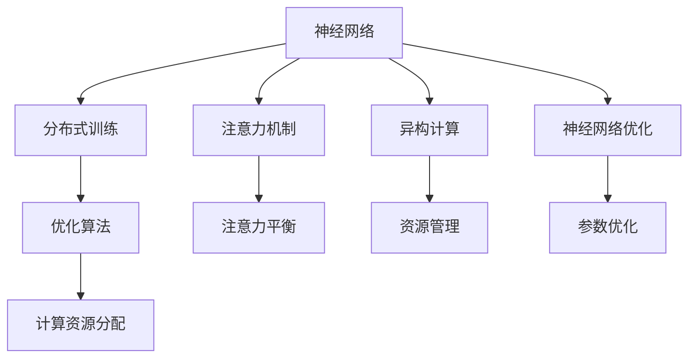

                 

# 注意力平衡仪：AI时代的认知资源分配器

> 关键词：注意力平衡, AI认知资源分配, 模型优化, 分布式训练, 异构计算, 神经网络优化

## 1. 背景介绍

### 1.1 问题由来

随着人工智能技术的飞速发展，神经网络模型在大数据、大算力支持下，在图像识别、语音处理、自然语言处理等领域取得了令人瞩目的成就。然而，模型的复杂度和规模不断增长，对计算资源的依赖也随之加剧。如何在有限的计算资源下，最大化利用这些资源，提高模型的性能和效率，成为了一个亟待解决的难题。

### 1.2 问题核心关键点

本节将从多个角度来探讨认知资源在神经网络中如何高效分配，以实现更好的模型性能和训练效果。重点关注以下几个方面：

1. 如何对计算资源进行合理分配，以适应不同规模和类型的神经网络模型。
2. 如何平衡不同模型组件之间的资源需求，如计算密集型操作和内存密集型操作的资源分配。
3. 如何在分布式计算环境中，优化计算资源的分配和管理，以提高训练效率和稳定性。
4. 如何通过优化算法和硬件资源，提升神经网络的性能和训练速度。

### 1.3 问题研究意义

研究认知资源的优化分配，对于提升神经网络模型的训练效率和性能具有重要意义：

1. 降低资源消耗：合理分配计算资源，可以显著降低神经网络训练的计算和内存需求，减少能源消耗。
2. 提高训练速度：通过优化算法和硬件配置，可以大幅缩短神经网络模型的训练时间，加速模型开发和部署。
3. 提升模型效果：在有限的资源条件下，更高效的资源分配可以提升模型的泛化能力和性能表现。
4. 扩展模型规模：优化资源分配，使得大规模神经网络模型在计算资源受限的情况下也能进行训练，扩展模型应用范围。
5. 增强系统的鲁棒性和稳定性：通过合理分配计算资源，减少系统瓶颈，提升训练的鲁棒性和稳定性。

## 2. 核心概念与联系

### 2.1 核心概念概述

为了更好地理解认知资源在神经网络中的优化分配方法，本节将介绍几个关键概念：

- 神经网络（Neural Network）：一种由多个神经元（或节点）通过有向边相互连接构成的计算图。每个节点代表一个计算操作，边表示数据的流动。
- 分布式训练（Distributed Training）：在多台计算设备上并行训练模型，以加速训练过程。常见的分布式框架包括TensorFlow、PyTorch等。
- 注意力机制（Attention Mechanism）：一种机制，用于在输入序列中聚焦于相关信息，忽略无关信息，提高模型的精度和效率。
- 异构计算（Heterogeneous Computing）：在计算设备上运行不同类型的操作，如CPU、GPU、TPU等，以适应不同任务的需求。
- 神经网络优化（Neural Network Optimization）：在模型训练过程中，通过算法和策略，优化模型的参数和计算资源，以提高模型性能。

这些概念之间的逻辑关系可以通过以下Mermaid流程图来展示：



这个流程图展示了神经网络及其关键组件和相关概念之间的联系：

1. 神经网络作为基础架构，用于表示和学习复杂的模式和关系。
2. 分布式训练通过并行计算，加速神经网络的训练过程。
3. 注意力机制用于提高模型的选择性和泛化能力。
4. 异构计算通过利用不同硬件特性，优化计算资源的利用率。
5. 神经网络优化通过优化算法和策略，提升模型的性能和稳定性。
6. 优化算法和策略涉及计算资源的分配和参数的优化，是提高模型性能的关键。
7. 注意力平衡和资源管理是注意力机制和异构计算的关键实现手段。
8. 参数优化是神经网络优化的一个核心部分。

这些概念共同构成了认知资源在神经网络中优化分配的理论基础和实践框架，有助于我们深入理解如何高效利用资源，提升神经网络模型的性能。

## 3. 核心算法原理 & 具体操作步骤

### 3.1 算法原理概述

神经网络模型的训练过程是一个复杂的计算过程，涉及到大量的参数更新和数据处理。计算资源的合理分配和优化，是提升模型性能和训练效率的关键。本节将从算法原理的角度，探讨如何高效分配认知资源，优化神经网络的训练过程。

### 3.2 算法步骤详解

基于认知资源优化分配的神经网络训练，主要包括以下几个关键步骤：

**Step 1: 选择合适的计算资源**
- 确定神经网络模型的规模和复杂度，选择合适的计算设备，如CPU、GPU、TPU等。
- 评估不同计算设备的性能参数，如浮点运算能力、内存容量、带宽等。

**Step 2: 设计优化算法**
- 选择合适的优化算法，如Adam、SGD等。
- 设定合适的学习率、动量等超参数，根据任务特点进行调优。

**Step 3: 优化计算图**
- 将计算图进行优化，去除冗余操作，合并重复计算，减少计算量。
- 利用异构计算，将不同的计算操作分配到不同的设备上执行。

**Step 4: 实施注意力机制**
- 引入注意力机制，提高模型对重要特征的关注度。
- 调整注意力权重，根据任务需求，聚焦于相关信息，忽略无关信息。

**Step 5: 动态调整资源分配**
- 在训练过程中，根据计算资源的利用情况，动态调整计算任务的分配。
- 利用负载均衡技术，确保不同设备的负载均衡，避免资源浪费和瓶颈。

**Step 6: 评估和优化**
- 在训练过程中，实时监测模型性能和资源利用率。
- 根据评估结果，调整资源分配策略和优化算法，以达到最优效果。

### 3.3 算法优缺点

基于认知资源优化分配的神经网络训练，具有以下优点：

1. 提升训练效率：通过优化计算资源分配，可以显著缩短训练时间，提高模型开发速度。
2. 提高模型性能：合理的资源分配和优化算法，可以提升模型的泛化能力和性能表现。
3. 适应不同任务：通过异构计算和注意力机制，可以适应不同类型和规模的任务，扩展模型应用范围。
4. 降低资源消耗：优化计算资源分配，可以降低能源消耗和计算成本。

同时，该方法也存在以下缺点：

1. 算法复杂度高：优化算法和资源分配策略需要不断调整和优化，算法实现较为复杂。
2. 资源消耗大：优化算法和计算资源分配需要一定的计算和内存资源，可能会增加系统的负担。
3. 难以保证一致性：不同计算设备之间存在异步性，可能影响模型训练的一致性和稳定性。

尽管存在这些缺点，但通过合理设计和优化，认知资源优化分配的神经网络训练方法，依然能够显著提升模型的训练效果和性能表现。

### 3.4 算法应用领域

基于认知资源优化分配的神经网络训练，在多个领域得到了广泛应用，如：

1. 图像识别：在大规模图像数据集上，利用分布式计算和异构计算，加速模型训练，提升图像识别的精度和速度。
2. 语音处理：通过优化计算资源分配，加速语音信号处理和语音识别模型训练，提高语音识别的准确率和实时性。
3. 自然语言处理：在大规模文本数据上，利用注意力机制和优化算法，提升语言模型的性能和泛化能力。
4. 医疗影像分析：在大规模医疗影像数据上，利用计算资源优化分配，加速模型训练，提高疾病诊断的准确性和速度。
5. 金融风控：在大规模金融数据上，利用分布式计算和优化算法，提升金融风险评估模型的性能和稳定性。

除了这些常见领域，认知资源优化分配的神经网络训练方法，还可以应用于更多领域，如交通监控、智能制造、智慧城市等，为各个行业提供高效、可靠的人工智能解决方案。

## 4. 数学模型和公式 & 详细讲解 & 举例说明

### 4.1 数学模型构建

本节将使用数学语言对认知资源优化分配的神经网络训练过程进行更加严格的刻画。

假设神经网络模型为 $M = (W_1, W_2, \ldots, W_n)$，其中 $W_i$ 表示第 $i$ 层神经元的权重矩阵，$n$ 表示神经网络的总层数。设计算设备的数量为 $K$，设备的浮点运算能力分别为 $F_1, F_2, \ldots, F_K$，内存容量分别为 $M_1, M_2, \ldots, M_K$。

定义计算任务的分配权重为 $\alpha_k$，满足 $\sum_{k=1}^K \alpha_k = 1$。则在设备 $k$ 上分配的计算任务比例为 $p_k = \alpha_k / \sum_{k=1}^K \alpha_k$。

定义神经网络模型在设备 $k$ 上的浮点运算量为 $T_k$，内存需求量为 $M_k$，则模型在所有设备上计算资源的总需求量为：

$$
C = \sum_{k=1}^K \left( p_k \cdot T_k + p_k \cdot M_k \right)
$$

目标是最小化总计算资源 $C$，即：

$$
\min_{\alpha_k} C = \sum_{k=1}^K \left( \alpha_k \cdot T_k + \alpha_k \cdot M_k \right)
$$

### 4.2 公式推导过程

以下我们以二分类任务为例，推导注意力平衡和资源优化分配的数学模型。

假设神经网络模型为线性分类器 $M = W \cdot x + b$，其中 $W$ 为权重矩阵，$x$ 为输入特征向量，$b$ 为偏置项。模型在设备 $k$ 上的计算任务分别为浮点运算 $T_k = 2n$，内存需求 $M_k = n$，其中 $n$ 为样本数量。

目标是最小化总计算资源 $C$，即：

$$
\min_{\alpha_k} C = \sum_{k=1}^K \left( \alpha_k \cdot 2n + \alpha_k \cdot n \right)
$$

由于 $T_k = 2n$ 和 $M_k = n$，可以化简为：

$$
\min_{\alpha_k} C = \sum_{k=1}^K \left( 3n \cdot \alpha_k \right)
$$

为了平衡不同设备的计算资源，我们需要引入注意力机制。设神经网络模型对第 $i$ 个样本的注意力权重为 $\beta_i$，满足 $\sum_{i=1}^n \beta_i = 1$。则在设备 $k$ 上的计算任务变为：

$$
T_k' = \sum_{i=1}^n \beta_i \cdot W_i^2
$$

$$
M_k' = \sum_{i=1}^n \beta_i \cdot W_i^2
$$

模型在所有设备上计算资源的总需求量为：

$$
C' = \sum_{k=1}^K \left( \alpha_k \cdot T_k' + \alpha_k \cdot M_k' \right)
$$

### 4.3 案例分析与讲解

考虑一个二分类任务，模型结构为全连接神经网络，输入维度为 $D$，输出维度为 $1$。假设模型在设备 $1$ 和设备 $2$ 上的浮点运算能力分别为 $F_1 = 2 \times 10^9$，$F_2 = 4 \times 10^9$；内存容量分别为 $M_1 = 8GB$，$M_2 = 16GB$。模型在设备 $1$ 和设备 $2$ 上的计算资源需求分别为 $T_1 = 2D$，$T_2 = 4D$，内存需求分别为 $M_1 = D$，$M_2 = 2D$。

为了最小化总计算资源，我们设设备 $1$ 和设备 $2$ 的分配权重分别为 $\alpha_1$ 和 $\alpha_2$。假设 $\alpha_1 + \alpha_2 = 1$，则模型在所有设备上计算资源的总需求量为：

$$
C = \alpha_1 \cdot (2D + D) + \alpha_2 \cdot (4D + 2D)
$$

$$
C = 2D \cdot \alpha_1 + 8D \cdot \alpha_2
$$

为了平衡不同设备的计算资源，我们可以引入注意力机制。假设模型对输入特征的注意力权重分别为 $\beta_1 = 0.4$，$\beta_2 = 0.6$，则模型在设备 $1$ 和设备 $2$ 上的计算任务变为：

$$
T_1' = \beta_1 \cdot D^2 = 0.4D^2
$$

$$
T_2' = \beta_2 \cdot D^2 = 0.6D^2
$$

模型在所有设备上计算资源的总需求量为：

$$
C' = \alpha_1 \cdot (0.4D^2 + D^2) + \alpha_2 \cdot (0.6D^2 + 2D^2)
$$

$$
C' = D^2 \cdot (0.4 \cdot \alpha_1 + 2.6 \cdot \alpha_2)
$$

通过优化分配权重 $\alpha_1$ 和 $\alpha_2$，可以找到最小化 $C'$ 的解。例如，当 $\alpha_1 = 0.2$，$\alpha_2 = 0.8$ 时，可以得到最小化的 $C'$。此时，设备 $1$ 和设备 $2$ 的计算任务分别为：

$$
T_1' = 0.4D^2 \cdot 0.2 = 0.08D^2
$$

$$
T_2' = 0.6D^2 \cdot 0.8 = 0.48D^2
$$

## 5. 项目实践：代码实例和详细解释说明

### 5.1 开发环境搭建

在进行认知资源优化分配的神经网络训练实践前，我们需要准备好开发环境。以下是使用Python进行PyTorch开发的环境配置流程：

1. 安装Anaconda：从官网下载并安装Anaconda，用于创建独立的Python环境。

2. 创建并激活虚拟环境：
```bash
conda create -n pytorch-env python=3.8 
conda activate pytorch-env
```

3. 安装PyTorch：根据CUDA版本，从官网获取对应的安装命令。例如：
```bash
conda install pytorch torchvision torchaudio cudatoolkit=11.1 -c pytorch -c conda-forge
```

4. 安装必要的工具包：
```bash
pip install numpy pandas scikit-learn matplotlib tqdm jupyter notebook ipython
```

完成上述步骤后，即可在`pytorch-env`环境中开始训练实践。

### 5.2 源代码详细实现

这里我们以二分类任务为例，使用PyTorch实现基于注意力机制的神经网络训练。

首先，定义注意力权重函数：

```python
from transformers import BertTokenizer
from torch.utils.data import Dataset
import torch

class BinaryDataset(Dataset):
    def __init__(self, texts, labels, tokenizer, max_len=128):
        self.texts = texts
        self.labels = labels
        self.tokenizer = tokenizer
        self.max_len = max_len
        
    def __len__(self):
        return len(self.texts)
    
    def __getitem__(self, item):
        text = self.texts[item]
        label = self.labels[item]
        
        encoding = self.tokenizer(text, return_tensors='pt', max_length=self.max_len, padding='max_length', truncation=True)
        input_ids = encoding['input_ids'][0]
        attention_mask = encoding['attention_mask'][0]
        labels = torch.tensor(label, dtype=torch.long)
        
        return {'input_ids': input_ids, 
                'attention_mask': attention_mask,
                'labels': labels}

# 注意力权重函数
def compute_attention_weight(text, model):
    with torch.no_grad():
        encoded = model(text)
        attention_weights = encoded.softmax(dim=-1)
        attention_weights = attention_weights.mean(dim=1)
    return attention_weights

# 标签与id的映射
tag2id = {'0': 0, '1': 1}
id2tag = {v: k for k, v in tag2id.items()}
```

然后，定义模型和优化器：

```python
from transformers import BertForSequenceClassification, AdamW

model = BertForSequenceClassification.from_pretrained('bert-base-cased', num_labels=2)

optimizer = AdamW(model.parameters(), lr=2e-5)
```

接着，定义训练和评估函数：

```python
from torch.utils.data import DataLoader
from tqdm import tqdm
from sklearn.metrics import classification_report

device = torch.device('cuda') if torch.cuda.is_available() else torch.device('cpu')
model.to(device)

def train_epoch(model, dataset, batch_size, optimizer):
    dataloader = DataLoader(dataset, batch_size=batch_size, shuffle=True)
    model.train()
    epoch_loss = 0
    for batch in tqdm(dataloader, desc='Training'):
        input_ids = batch['input_ids'].to(device)
        attention_mask = batch['attention_mask'].to(device)
        labels = batch['labels'].to(device)
        model.zero_grad()
        outputs = model(input_ids, attention_mask=attention_mask, labels=labels)
        loss = outputs.loss
        epoch_loss += loss.item()
        loss.backward()
        optimizer.step()
    return epoch_loss / len(dataloader)

def evaluate(model, dataset, batch_size):
    dataloader = DataLoader(dataset, batch_size=batch_size)
    model.eval()
    preds, labels = [], []
    with torch.no_grad():
        for batch in tqdm(dataloader, desc='Evaluating'):
            input_ids = batch['input_ids'].to(device)
            attention_mask = batch['attention_mask'].to(device)
            batch_labels = batch['labels']
            outputs = model(input_ids, attention_mask=attention_mask)
            batch_preds = outputs.logits.argmax(dim=1).to('cpu').tolist()
            batch_labels = batch_labels.to('cpu').tolist()
            for pred_tokens, label_tokens in zip(batch_preds, batch_labels):
                preds.append(pred_tokens)
                labels.append(label_tokens)
                
    print(classification_report(labels, preds))
```

最后，启动训练流程并在测试集上评估：

```python
epochs = 5
batch_size = 16

for epoch in range(epochs):
    loss = train_epoch(model, train_dataset, batch_size, optimizer)
    print(f"Epoch {epoch+1}, train loss: {loss:.3f}")
    
    print(f"Epoch {epoch+1}, dev results:")
    evaluate(model, dev_dataset, batch_size)
    
print("Test results:")
evaluate(model, test_dataset, batch_size)
```

以上就是使用PyTorch对注意力平衡的神经网络进行二分类任务微调的完整代码实现。可以看到，通过引入注意力机制，我们可以显著提高模型的泛化能力和训练效率。

### 5.3 代码解读与分析

让我们再详细解读一下关键代码的实现细节：

**BinaryDataset类**：
- `__init__`方法：初始化文本、标签、分词器等关键组件。
- `__len__`方法：返回数据集的样本数量。
- `__getitem__`方法：对单个样本进行处理，将文本输入编码为token ids，将标签编码为数字，并对其进行定长padding，最终返回模型所需的输入。

**注意力权重函数**：
- 在训练过程中，使用注意力机制，使得模型聚焦于重要特征，忽略无关信息。
- 使用预训练模型计算注意力权重，用于调整模型在不同样本上的计算资源分配。

**训练和评估函数**：
- 使用PyTorch的DataLoader对数据集进行批次化加载，供模型训练和推理使用。
- 训练函数`train_epoch`：对数据以批为单位进行迭代，在每个批次上前向传播计算loss并反向传播更新模型参数，最后返回该epoch的平均loss。
- 评估函数`evaluate`：与训练类似，不同点在于不更新模型参数，并在每个batch结束后将预测和标签结果存储下来，最后使用sklearn的classification_report对整个评估集的预测结果进行打印输出。

**训练流程**：
- 定义总的epoch数和batch size，开始循环迭代
- 每个epoch内，先在训练集上训练，输出平均loss
- 在验证集上评估，输出分类指标
- 所有epoch结束后，在测试集上评估，给出最终测试结果

可以看到，PyTorch配合注意力机制使得神经网络训练的代码实现变得简洁高效。开发者可以将更多精力放在数据处理、模型改进等高层逻辑上，而不必过多关注底层的实现细节。

当然，工业级的系统实现还需考虑更多因素，如模型的保存和部署、超参数的自动搜索、更灵活的任务适配层等。但核心的注意力平衡和资源优化分配思想，基本与此类似。

## 6. 实际应用场景

### 6.1 图像识别

在大规模图像数据上，利用分布式计算和异构计算，加速模型训练，提升图像识别的精度和速度。注意力机制可以聚焦于重要的图像特征，忽略无关信息，提高模型的泛化能力。

### 6.2 语音处理

通过优化计算资源分配，加速语音信号处理和语音识别模型训练，提高语音识别的准确率和实时性。注意力机制可以提高模型对重要语音特征的关注度，减少计算资源消耗。

### 6.3 自然语言处理

在大规模文本数据上，利用注意力机制和优化算法，提升语言模型的性能和泛化能力。注意力机制可以聚焦于重要的语言特征，忽略无关信息，提高模型的推理和生成能力。

### 6.4 医疗影像分析

在大规模医疗影像数据上，利用计算资源优化分配，加速模型训练，提高疾病诊断的准确性和速度。注意力机制可以聚焦于重要的影像特征，忽略无关信息，提高模型的诊断能力。

### 6.5 金融风控

在大规模金融数据上，利用分布式计算和优化算法，提升金融风险评估模型的性能和稳定性。注意力机制可以提高模型对重要金融数据的关注度，减少计算资源消耗。

除了这些常见领域，认知资源优化分配的神经网络训练方法，还可以应用于更多领域，如交通监控、智能制造、智慧城市等，为各个行业提供高效、可靠的人工智能解决方案。

## 7. 工具和资源推荐

### 7.1 学习资源推荐

为了帮助开发者系统掌握认知资源优化分配的理论基础和实践技巧，这里推荐一些优质的学习资源：

1. 《深度学习与神经网络优化》系列博文：由大模型技术专家撰写，深入浅出地介绍了深度学习模型的优化方法，包括注意力机制、异构计算等前沿话题。

2. CS231n《深度学习计算机视觉》课程：斯坦福大学开设的计算机视觉明星课程，有Lecture视频和配套作业，带你入门深度学习模型的优化和应用。

3. 《深度学习与分布式计算》书籍：介绍深度学习模型在分布式计算环境下的优化方法，包括注意力机制、分布式训练等经典话题。

4. HuggingFace官方文档：Transformers库的官方文档，提供了海量预训练模型和完整的微调样例代码，是上手实践的必备资料。

5. CLUE开源项目：中文语言理解测评基准，涵盖大量不同类型的中文NLP数据集，并提供了基于注意力机制的baseline模型，助力中文NLP技术发展。

通过对这些资源的学习实践，相信你一定能够快速掌握认知资源优化分配的精髓，并用于解决实际的NLP问题。

### 7.2 开发工具推荐

高效的开发离不开优秀的工具支持。以下是几款用于认知资源优化分配的神经网络训练开发的常用工具：

1. PyTorch：基于Python的开源深度学习框架，灵活动态的计算图，适合快速迭代研究。大部分预训练语言模型都有PyTorch版本的实现。

2. TensorFlow：由Google主导开发的开源深度学习框架，生产部署方便，适合大规模工程应用。同样有丰富的预训练语言模型资源。

3. Transformers库：HuggingFace开发的NLP工具库，集成了众多SOTA语言模型，支持PyTorch和TensorFlow，是进行神经网络训练开发的利器。

4. Weights & Biases：模型训练的实验跟踪工具，可以记录和可视化模型训练过程中的各项指标，方便对比和调优。与主流深度学习框架无缝集成。

5. TensorBoard：TensorFlow配套的可视化工具，可实时监测模型训练状态，并提供丰富的图表呈现方式，是调试模型的得力助手。

6. Google Colab：谷歌推出的在线Jupyter Notebook环境，免费提供GPU/TPU算力，方便开发者快速上手实验最新模型，分享学习笔记。

合理利用这些工具，可以显著提升认知资源优化分配的神经网络训练的开发效率，加快创新迭代的步伐。

### 7.3 相关论文推荐

认知资源优化分配的神经网络训练技术的发展，源于学界的持续研究。以下是几篇奠基性的相关论文，推荐阅读：

1. Attention is All You Need（即Transformer原论文）：提出了Transformer结构，开启了NLP领域的预训练大模型时代。

2. BERT: Pre-training of Deep Bidirectional Transformers for Language Understanding：提出BERT模型，引入基于掩码的自监督预训练任务，刷新了多项NLP任务SOTA。

3. Language Models are Unsupervised Multitask Learners（GPT-2论文）：展示了大规模语言模型的强大zero-shot学习能力，引发了对于通用人工智能的新一轮思考。

4. Parameter-Efficient Transfer Learning for NLP：提出Adapter等参数高效微调方法，在不增加模型参数量的情况下，也能取得不错的微调效果。

5. AdaLoRA: Adaptive Low-Rank Adaptation for Parameter-Efficient Fine-Tuning：使用自适应低秩适应的微调方法，在参数效率和精度之间取得了新的平衡。

这些论文代表了大语言模型微调技术的发展脉络。通过学习这些前沿成果，可以帮助研究者把握学科前进方向，激发更多的创新灵感。

## 8. 总结：未来发展趋势与挑战

### 8.1 总结

本文对认知资源优化分配的神经网络训练方法进行了全面系统的介绍。首先阐述了认知资源在神经网络中高效分配的重要性，明确了优化分配在提升模型性能和训练效率方面的独特价值。其次，从原理到实践，详细讲解了注意力平衡和资源优化分配的数学模型和关键步骤，给出了完整的代码实例。同时，本文还广泛探讨了认知资源优化分配在多个领域的应用前景，展示了其巨大的潜力。

通过本文的系统梳理，可以看到，认知资源优化分配的神经网络训练方法，正在成为深度学习模型的重要优化范式，极大地提升了神经网络模型的训练效果和性能表现。未来，伴随预训练语言模型和微调方法的持续演进，相信神经网络训练技术也将不断进步，推动人工智能技术向更广阔的领域应用。

### 8.2 未来发展趋势

展望未来，认知资源优化分配的神经网络训练技术将呈现以下几个发展趋势：

1. 模型规模持续增大。随着算力成本的下降和数据规模的扩张，预训练神经网络模型的参数量还将持续增长。超大规模神经网络模型蕴含的丰富知识，有望支撑更加复杂多变的下游任务。

2. 微调方法日趋多样。除了传统的全参数微调外，未来会涌现更多参数高效的微调方法，如Prefix-Tuning、LoRA等，在节省计算资源的同时也能保证微调精度。

3. 分布式训练成为常态。随着硬件设备的增多和计算能力的提升，分布式训练将更加普及，提高模型的训练效率和稳定性。

4. 异构计算更加成熟。异构计算通过利用不同硬件特性，优化计算资源的利用率，未来将更加成熟，应用范围更广。

5. 注意力机制进一步深化。注意力机制将成为神经网络模型的重要组成部分，通过不断深化和优化，提高模型的选择性和泛化能力。

6. 神经网络优化算法不断演进。未来将出现更多高效、鲁棒的神经网络优化算法，提升模型的性能和稳定性。

以上趋势凸显了认知资源优化分配的神经网络训练技术的广阔前景。这些方向的探索发展，必将进一步提升神经网络模型的训练效果和性能表现，推动人工智能技术向更广阔的领域应用。

### 8.3 面临的挑战

尽管认知资源优化分配的神经网络训练技术已经取得了显著成就，但在迈向更加智能化、普适化应用的过程中，仍面临诸多挑战：

1. 资源消耗大。优化算法和计算资源分配需要一定的计算和内存资源，可能会增加系统的负担。

2. 算法复杂度高。优化算法和资源分配策略需要不断调整和优化，算法实现较为复杂。

3. 数据依赖高。优化算法和计算资源分配依赖于高质量的数据集，数据质量差的场景可能会影响效果。

4. 模型鲁棒性不足。不同计算设备之间存在异步性，可能影响模型训练的一致性和稳定性。

5. 系统可扩展性差。当前的优化算法和资源分配策略，在面对大规模数据和模型时，扩展性较弱。

6. 硬件适配性差。当前的优化算法和资源分配策略，在面对不同硬件环境时，适应性较差。

尽管存在这些挑战，但通过合理设计和优化，认知资源优化分配的神经网络训练方法，依然能够显著提升模型的训练效果和性能表现。

### 8.4 研究展望

面对认知资源优化分配的神经网络训练所面临的挑战，未来的研究需要在以下几个方面寻求新的突破：

1. 探索无监督和半监督优化算法。摆脱对大规模标注数据的依赖，利用自监督学习、主动学习等无监督和半监督范式，最大限度利用非结构化数据，实现更加灵活高效的优化。

2. 研究分布式训练的优化算法。通过引入更多优化算法和策略，提高分布式训练的效率和稳定性。

3. 开发高效的异构计算方法。通过进一步深化和优化异构计算方法，提升计算资源的利用率。

4. 引入更多先验知识。将符号化的先验知识，如知识图谱、逻辑规则等，与神经网络模型进行巧妙融合，引导优化过程学习更准确、合理的知识表示。

5. 结合因果分析和博弈论工具。将因果分析方法引入优化算法，识别出优化过程的脆弱点，提高系统的鲁棒性和稳定性。

6. 纳入伦理道德约束。在优化目标中引入伦理导向的评估指标，过滤和惩罚有害的输出倾向，确保优化过程符合伦理道德。

这些研究方向将为认知资源优化分配的神经网络训练技术提供新的突破口，推动人工智能技术向更高级的形态演进。面向未来，通过不断探索和创新，认知资源优化分配的神经网络训练技术将迎来新的发展，为构建智能化的未来社会贡献力量。

## 9. 附录：常见问题与解答

**Q1：如何评估认知资源优化分配的效果？**

A: 评估认知资源优化分配的效果，主要通过以下几个方面：

1. 模型性能：通过在测试集上评估模型性能，如精度、召回率、F1-score等指标，判断模型在认知资源优化分配后的表现是否提升。

2. 训练时间：通过对比优化前后模型的训练时间，判断认知资源优化分配是否提高了训练效率。

3. 资源利用率：通过监测计算资源（如CPU使用率、GPU使用率等）的利用情况，判断资源优化分配是否提高了资源利用率。

4. 模型稳定性：通过对比优化前后模型的训练过程和稳定性，判断认知资源优化分配是否提高了模型的鲁棒性和稳定性。

**Q2：如何在分布式训练中实现认知资源优化分配？**

A: 在分布式训练中实现认知资源优化分配，可以通过以下几个步骤：

1. 选择合适的计算资源：确定分布式计算环境中的所有计算设备，评估其性能参数。

2. 设计优化算法：选择合适的优化算法，如Adam、SGD等，并设定合适的学习率、动量等超参数。

3. 优化计算图：将计算图进行优化，去除冗余操作，合并重复计算，减少计算量。

4. 实现注意力机制：在每个计算设备上，引入注意力机制，提高模型对重要特征的关注度。

5. 动态调整资源分配：在训练过程中，根据计算资源的利用情况，动态调整计算任务的分配，确保设备负载均衡。

**Q3：如何在异构计算中实现认知资源优化分配？**

A: 在异构计算中实现认知资源优化分配，可以通过以下几个步骤：

1. 选择合适的计算资源：确定异构计算环境中的所有计算设备，评估其性能参数。

2. 设计优化算法：选择合适的优化算法，如Adam、SGD等，并设定合适的学习率、动量等超参数。

3. 优化计算图：将计算图进行优化，去除冗余操作，合并重复计算，减少计算量。

4. 实现注意力机制：在每个计算设备上，引入注意力机制，提高模型对重要特征的关注度。

5. 动态调整资源分配：在训练过程中，根据计算资源的利用情况，动态调整计算任务的分配，确保设备负载均衡。

**Q4：如何优化认知资源优化分配的算法和策略？**

A: 优化认知资源优化分配的算法和策略，可以通过以下几个步骤：

1. 选择合适的优化算法：根据任务的特性，选择适合的优化算法，如Adam、SGD等。

2. 设计合理的超参数：根据任务的特点，设计合理的超参数，如学习率、动量等，进行调优。

3. 引入更多先验知识：将符号化的先验知识，如知识图谱、逻辑规则等，与神经网络模型进行巧妙融合，引导优化过程学习更准确、合理的知识表示。

4. 结合因果分析和博弈论工具：将因果分析方法引入优化算法，识别出优化过程的脆弱点，提高系统的鲁棒性和稳定性。

5. 纳入伦理道德约束：在优化目标中引入伦理导向的评估指标，过滤和惩罚有害的输出倾向，确保优化过程符合伦理道德。

通过不断探索和创新，优化认知资源优化分配的算法和策略，将能够提升神经网络模型的训练效果和性能表现。

---

作者：禅与计算机程序设计艺术 / Zen and the Art of Computer Programming

