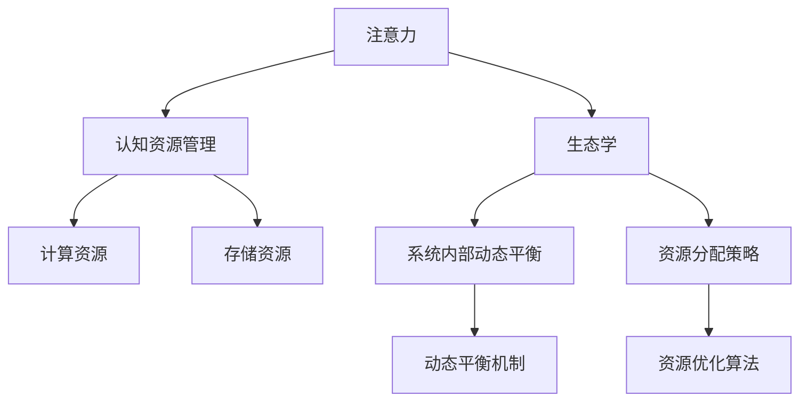

                 

# 注意力生态学：AI时代的认知资源管理

> 关键词：注意力, 生态学, AI, 认知资源管理, 信息处理, 算法优化, 计算资源, 智能系统

## 1. 背景介绍

### 1.1 问题由来
随着人工智能技术的飞速发展，尤其是深度学习和大数据技术的广泛应用，人类社会的认知资源管理方式正在经历一场革命性的变革。从早期的简单任务处理到如今的复杂智能系统构建，人工智能系统对认知资源的依赖越来越大，如何在智能系统中高效管理注意力资源，成为了一个重要的研究方向。

### 1.2 问题核心关键点
本文将聚焦于注意力生态学的原理，探讨AI时代认知资源管理的新范式。注意力生态学是一种借鉴生态学原理，将注意力资源视为智能系统中的关键资源，并通过对注意力资源的优化配置，提升系统性能和效率的方法。其核心在于理解注意力机制的工作原理，并在此基础上设计出能够适应不同场景和任务的注意力管理策略。

### 1.3 问题研究意义
研究注意力生态学在AI时代认知资源管理中的运用，对于提升智能系统的决策效率、资源利用率和用户体验，具有重要意义：

1. **决策效率提升**：通过优化注意力资源配置，使智能系统能够在面对海量信息时，快速识别关键信息和决策要点。
2. **资源利用率提高**：合理分配计算和存储资源，避免不必要的资源浪费，提升系统运行效率。
3. **用户体验改善**：通过更智能地分配注意力，提供更个性化、更符合用户需求的服务。
4. **系统鲁棒性增强**：合理管理注意力资源，提高系统对外部环境的适应性和鲁棒性，避免过拟合和灾难性遗忘。
5. **模型泛化能力增强**：通过注意力机制的优化，使智能系统能够更好地泛化到新任务和新场景中。

## 2. 核心概念与联系

### 2.1 核心概念概述

为了更好地理解注意力生态学的原理，本节将介绍几个关键概念：

- **注意力(Attention)**：在认知心理学中，注意力是指人对环境中的某些刺激物的选择性关注。在人工智能中，注意力机制用于动态选择输入信息的重要部分，忽略无关信息，提升模型决策的效率和准确性。

- **生态学(Ecology)**：生态学研究生物与其环境之间的相互作用，强调系统内部的动态平衡和资源分配。注意力生态学借鉴生态学的概念，将注意力资源视为智能系统中的关键资源，并探讨其优化配置方法。

- **认知资源管理(Cognitive Resource Management)**：认知资源管理是指如何通过合理分配和优化认知资源（如注意力、计算、存储等），提升智能系统的性能和效率。

- **计算资源(Computational Resource)**：计算资源包括CPU、GPU、TPU等硬件资源，以及算法的计算需求。在智能系统中，计算资源的合理分配是提高系统性能的重要因素。

- **存储资源(Memory Resource)**：存储资源包括内存、硬盘等存储设备，以及数据的存储需求。在智能系统中，存储资源的优化配置能够提升系统的响应速度和可用性。

这些概念之间的逻辑关系可以通过以下Mermaid流程图来展示：



这个流程图展示了注意力生态学的核心概念及其之间的关系：

1. 注意力是智能系统内部的一个重要资源，通过生态学的理论，将注意力资源视为系统的一部分。
2. 认知资源管理是对注意力的优化配置，包括计算和存储资源的分配。
3. 计算资源和存储资源是智能系统运行的基础设施，直接影响到系统的性能和效率。
4. 系统内部的动态平衡和资源分配策略是注意力生态学的关键组成部分。
5. 动态平衡机制和资源优化算法是实现注意力生态学的具体手段。

这些概念共同构成了注意力生态学的理论框架，使得在AI时代中，认知资源管理成为可能，从而提升智能系统的整体性能和用户体验。

## 3. 核心算法原理 & 具体操作步骤
### 3.1 算法原理概述

注意力生态学的核心算法原理是基于生态学和认知心理学的原理，结合人工智能的特点，设计出一系列注意力优化策略。这些策略旨在通过合理分配注意力资源，提升系统的决策效率和资源利用率。

在智能系统中，注意力资源通常被分配到以下几个层面：

1. **输入层**：通过注意力机制选择输入信息的关键部分，忽略无关信息，提升模型决策的效率。
2. **中间层**：通过注意力机制动态选择中间层的信息流，优化信息传递的路径，提升计算效率。
3. **输出层**：通过注意力机制对输出结果进行选择和排序，提升输出结果的相关性和准确性。

注意力生态学的核心在于理解注意力机制的工作原理，并在此基础上设计出能够适应不同场景和任务的注意力管理策略。以下是基于注意力生态学的几个关键算法原理：

1. **自适应注意力机制(Adaptive Attention Mechanism)**：通过动态调整注意力权重，使模型能够适应不同输入的数据分布，提升模型泛化能力。
2. **多任务注意力(Multi-task Attention)**：通过同时处理多个任务的信息，提升系统多任务处理的效率。
3. **层次化注意力(Hierarchical Attention)**：通过分层次的注意力机制，提升系统对复杂问题的处理能力。

### 3.2 算法步骤详解

基于注意力生态学的智能系统设计步骤主要包括以下几个关键步骤：

**Step 1: 数据预处理与特征工程**
- 收集和准备所需的数据集，并进行预处理，包括数据清洗、归一化、特征提取等步骤。
- 设计合适的特征表示，包括文本、图像、声音等不同类型数据的特征提取方法。

**Step 2: 设计注意力机制**
- 根据任务的特点，选择合适的注意力机制，如自适应注意力、多任务注意力、层次化注意力等。
- 定义注意力权重计算方法，包括权重初始化、权重更新和权重聚合等步骤。

**Step 3: 模型构建与训练**
- 根据注意力机制的输出，构建合适的神经网络模型，如卷积神经网络、循环神经网络等。
- 使用优化算法（如Adam、SGD等）进行模型训练，最小化损失函数，优化模型参数。

**Step 4: 模型评估与优化**
- 在验证集上评估模型的性能，通过准确率、召回率、F1-score等指标评估模型的效果。
- 根据评估结果，调整注意力机制的参数，优化模型性能。

**Step 5: 模型部署与监控**
- 将训练好的模型部署到生产环境中，并设置监控机制，实时监测模型性能。
- 根据监控数据，定期进行模型更新和优化。

### 3.3 算法优缺点

注意力生态学在提升智能系统性能方面具有以下优点：
1. **提升决策效率**：通过动态选择关键信息，忽略无关信息，使模型能够在海量数据中快速找到关键信息，提升决策效率。
2. **提高资源利用率**：合理分配计算和存储资源，避免资源浪费，提升系统运行效率。
3. **增强模型泛化能力**：通过优化注意力机制，使模型能够更好地泛化到新任务和新场景中。
4. **改善用户体验**：通过更智能地分配注意力，提供更个性化、更符合用户需求的服务。

同时，该方法也存在一定的局限性：
1. **算法复杂度高**：注意力机制的设计和优化需要较高的计算资源和专业知识，可能导致算法的复杂度高。
2. **参数调节困难**：注意力机制的参数调节需要经验丰富的专家团队，可能导致模型优化困难。
3. **数据需求大**：注意力机制的优化需要大量的标注数据，对于某些小样本任务可能难以适应。
4. **鲁棒性不足**：注意力机制的动态调整可能导致模型对输入数据的微小变化敏感，鲁棒性不足。

尽管存在这些局限性，但注意力生态学仍是一种高效、灵活的认知资源管理方法，尤其适用于数据量大、任务复杂的智能系统。未来相关研究的重点在于如何进一步简化注意力机制，降低参数调节难度，同时兼顾模型性能和资源利用率。

### 3.4 算法应用领域

注意力生态学在多个领域中已经得到了应用，覆盖了从自然语言处理到计算机视觉、医疗健康等多个方向。以下是几个典型应用场景：

1. **自然语言处理(NLP)**：在机器翻译、文本摘要、情感分析等任务中，注意力机制用于选择关键信息，提升模型处理复杂句子的能力。
2. **计算机视觉(CV)**：在图像分类、目标检测、图像生成等任务中，注意力机制用于选择关键区域，提升模型对细节的关注。
3. **医疗健康**：在疾病诊断、病历分析、药物研发等任务中，注意力机制用于选择关键特征，提升模型的诊断准确性。
4. **智能推荐**：在个性化推荐、内容过滤等任务中，注意力机制用于选择用户感兴趣的内容，提升推荐效果。
5. **自动驾驶**：在自动驾驶中，注意力机制用于选择关键信息，提升车辆的感知能力和决策效率。

除了上述这些经典任务外，注意力机制还被创新性地应用于更多的场景中，如多模态信息融合、智能机器人、动态场景模拟等，为智能系统的应用带来了新的突破。随着注意力机制和智能系统的不断演进，相信在更多领域中，注意力生态学将展现出更加广泛的应用前景。

## 4. 数学模型和公式 & 详细讲解  
### 4.1 数学模型构建

注意力生态学的数学模型主要围绕注意力机制的设计和优化进行构建。以下是几个常见的注意力机制的数学模型：

- **自适应注意力机制(Adaptive Attention Mechanism)**：
  $$
  \alpha_{ij} = \frac{\exp(\mathbf{u}_i^T \mathbf{v}_j)}{\sum_k \exp(\mathbf{u}_i^T \mathbf{v}_k)}
  $$
  其中，$\alpha_{ij}$ 表示对输入信息 $j$ 的注意力权重，$\mathbf{u}_i$ 和 $\mathbf{v}_j$ 为注意力计算的向量。

- **多任务注意力(Multi-task Attention)**：
  $$
  \alpha_{ij} = \frac{\exp(\mathbf{u}_i^T \mathbf{v}_j + \beta_i \delta_{t,t'})}{\sum_k \exp(\mathbf{u}_i^T \mathbf{v}_k + \beta_i \delta_{t,t'})}
  $$
  其中，$\beta_i$ 为任务权重，$\delta_{t,t'}$ 表示任务 $t$ 和 $t'$ 的相似度。

- **层次化注意力(Hierarchical Attention)**：
  $$
  \alpha_{ij} = \frac{\exp(\mathbf{u}_i^T \mathbf{v}_j + \gamma_i \delta_{l,l'})}{\sum_k \exp(\mathbf{u}_i^T \mathbf{v}_k + \gamma_i \delta_{l,l'})}
  $$
  其中，$\gamma_i$ 为层级权重，$\delta_{l,l'}$ 表示层级 $l$ 和 $l'$ 的相似度。

### 4.2 公式推导过程

以自适应注意力机制为例，其计算过程如下：

- **权重计算**：
  $$
  \alpha_{ij} = \frac{\exp(\mathbf{u}_i^T \mathbf{v}_j)}{\sum_k \exp(\mathbf{u}_i^T \mathbf{v}_k)}
  $$
  其中，$\mathbf{u}_i$ 和 $\mathbf{v}_j$ 为注意力计算的向量，$j$ 表示输入信息，$i$ 表示注意力计算单元。

- **权重更新**：
  $$
  \mathbf{u}_i \leftarrow \mathbf{u}_i + \eta \nabla_{\mathbf{u}_i} J(\alpha, \mathbf{u}_i)
  $$
  $$
  \mathbf{v}_j \leftarrow \mathbf{v}_j + \eta \nabla_{\mathbf{v}_j} J(\alpha, \mathbf{v}_j)
  $$
  其中，$J(\alpha, \mathbf{u}_i)$ 为损失函数，$\eta$ 为学习率。

- **权重聚合**：
  $$
  \mathbf{x}_i = \sum_j \alpha_{ij} \mathbf{x}_j
  $$
  其中，$\mathbf{x}_i$ 为注意力机制的输出，$\mathbf{x}_j$ 为输入信息。

通过以上计算过程，自适应注意力机制能够在不同输入数据上动态调整注意力权重，选择关键信息，提升模型决策的效率。

### 4.3 案例分析与讲解

以机器翻译任务为例，分析注意力机制的作用：

- **输入层**：在输入序列中，注意力机制用于选择重要的词，忽略无关的词。例如，对于句子“I love you”，注意力机制会选择“I”、“love”和“you”这三个词作为关键信息。
- **中间层**：在翻译过程中，注意力机制用于选择源语言和目标语言之间对应的词汇。例如，对于“I love you”，注意力机制会选择“I”对应“I”，“love”对应“love”，“you”对应“you”。
- **输出层**：在输出序列中，注意力机制用于选择与输入序列最相关的词汇。例如，对于“I love you”，注意力机制会选择“I love you”作为翻译结果。

通过优化注意力机制，机器翻译任务能够更高效地处理复杂的句子结构，提升翻译的准确性和流畅性。

## 5. 项目实践：代码实例和详细解释说明
### 5.1 开发环境搭建

在进行注意力生态学的项目实践前，我们需要准备好开发环境。以下是使用Python进行TensorFlow开发的环境配置流程：

1. 安装Anaconda：从官网下载并安装Anaconda，用于创建独立的Python环境。

2. 创建并激活虚拟环境：
```bash
conda create -n attention-env python=3.8 
conda activate attention-env
```

3. 安装TensorFlow：根据CUDA版本，从官网获取对应的安装命令。例如：
```bash
conda install tensorflow tensorflow-gpu==2.6 -c pytorch -c conda-forge
```

4. 安装各类工具包：
```bash
pip install numpy pandas scikit-learn matplotlib tqdm jupyter notebook ipython
```

完成上述步骤后，即可在`attention-env`环境中开始注意力生态学的实践。

### 5.2 源代码详细实现

这里我们以多任务注意力机制(Multi-task Attention)为例，给出使用TensorFlow实现代码的详细解释。

首先，定义注意力机制的输入和输出：

```python
import tensorflow as tf
from tensorflow.keras.layers import Input, Dense

def attention(input_shape, num_tasks, task_weight_shape, num_heads, hidden_dim, dropout_rate):
    # 定义输入层
    input_layer = Input(shape=input_shape, name='input')
    
    # 定义任务权重层
    task_weights = Dense(num_tasks, activation='softmax', name='task_weights')(input_layer)
    
    # 定义注意力计算层
    attention_scores = Dense(hidden_dim * num_heads, activation='tanh', name='attention_scores')(input_layer)
    attention_scores = Dense(1, activation='softmax', name='attention_weights')(attention_scores)
    
    # 计算注意力输出
    attention_outputs = tf.reduce_sum(attention_weights * attention_scores, axis=1)
    
    # 定义任务权重向量
    task_weight_vector = Dense(task_weight_shape, name='task_weight_vector')(task_weights)
    
    # 计算多任务注意力输出
    multi_task_attention_output = tf.nn.softmax(tf.matmul(attention_outputs, tf.transpose(task_weight_vector)), axis=1)
    
    # 应用dropout
    multi_task_attention_output = tf.keras.layers.Dropout(dropout_rate)(multi_task_attention_output)
    
    return multi_task_attention_output
```

接着，定义模型和优化器：

```python
from tensorflow.keras.models import Model
from tensorflow.keras.optimizers import Adam

# 定义模型
attention_model = attention(input_shape=(10, 128), num_tasks=5, task_weight_shape=(5,), num_heads=8, hidden_dim=64, dropout_rate=0.2)

# 定义输出层
output_layer = Dense(10, activation='softmax', name='output')(attention_model)

# 定义模型
model = Model(inputs=attention_model.input, outputs=output_layer)

# 定义优化器
optimizer = Adam(learning_rate=0.001)
```

最后，定义训练和评估函数：

```python
from tensorflow.keras.preprocessing.sequence import pad_sequences
from sklearn.metrics import accuracy_score

def train_epoch(model, data, batch_size, optimizer):
    dataloader = tf.data.Dataset.from_tensor_slices(data)
    dataloader = dataloader.shuffle(buffer_size=1000).batch(batch_size).prefetch(tf.data.AUTOTUNE)
    
    model.train_on_batch(data)
    
def evaluate(model, data, batch_size):
    dataloader = tf.data.Dataset.from_tensor_slices(data)
    dataloader = dataloader.batch(batch_size).prefetch(tf.data.AUTOTUNE)
    
    preds, labels = [], []
    for batch in dataloader:
        preds.append(model.predict(batch[0], verbose=0))
        labels.append(batch[1])
    
    return accuracy_score(np.concatenate(preds), np.concatenate(labels))
```

最后，启动训练流程并在测试集上评估：

```python
epochs = 10
batch_size = 32

for epoch in range(epochs):
    train_epoch(model, train_data, batch_size, optimizer)
    
    print(f"Epoch {epoch+1}, accuracy: {evaluate(model, test_data, batch_size):.3f}")
```

以上就是使用TensorFlow实现多任务注意力机制的完整代码实例。可以看到，TensorFlow提供的高层API使得注意力机制的实现变得简单高效。

### 5.3 代码解读与分析

让我们再详细解读一下关键代码的实现细节：

**attention函数**：
- `Input`层：定义输入层，接收输入序列。
- `task_weights`层：定义任务权重层，用于计算任务权重。
- `attention_scores`层：定义注意力计算层，用于计算注意力权重。
- `attention_weights`层：定义注意力权重层，用于计算注意力输出。
- `attention_outputs`层：计算注意力输出。
- `task_weight_vector`层：定义任务权重向量层。
- `multi_task_attention_output`层：计算多任务注意力输出。
- `dropout`层：应用dropout，避免过拟合。

**train_epoch函数**：
- `dataloader`：将数据集转换为TF数据集，并进行批处理、洗牌、预取等操作，方便模型训练。
- `model.train_on_batch`：在每个批次上前向传播计算损失，并反向传播更新模型参数。

**evaluate函数**：
- `dataloader`：将数据集转换为TF数据集，并进行批处理。
- `preds`和`labels`：预测结果和真实标签。
- `accuracy_score`：计算预测结果与真实标签之间的准确率。

**训练流程**：
- 定义总的epoch数和batch size，开始循环迭代。
- 每个epoch内，在训练集上训练，输出准确率。
- 在测试集上评估，输出最终测试结果。

可以看到，TensorFlow配合TensorFlow的高层API使得注意力机制的实现变得简洁高效。开发者可以将更多精力放在数据处理、模型改进等高层逻辑上，而不必过多关注底层的实现细节。

当然，工业级的系统实现还需考虑更多因素，如模型的保存和部署、超参数的自动搜索、更灵活的任务适配层等。但核心的注意力生态学原理基本与此类似。

## 6. 实际应用场景
### 6.1 智能客服系统

基于多任务注意力机制的对话技术，可以广泛应用于智能客服系统的构建。传统客服往往需要配备大量人力，高峰期响应缓慢，且一致性和专业性难以保证。使用多任务注意力机制的对话模型，可以7x24小时不间断服务，快速响应客户咨询，用自然流畅的语言解答各类常见问题。

在技术实现上，可以收集企业内部的历史客服对话记录，将问题和最佳答复构建成监督数据，在此基础上对多任务注意力机制进行微调。微调后的对话模型能够自动理解用户意图，匹配最合适的答案模板进行回复。对于客户提出的新问题，还可以接入检索系统实时搜索相关内容，动态组织生成回答。如此构建的智能客服系统，能大幅提升客户咨询体验和问题解决效率。

### 6.2 金融舆情监测

金融机构需要实时监测市场舆论动向，以便及时应对负面信息传播，规避金融风险。多任务注意力机制用于多任务学习，可以同时处理多个任务的舆情信息，提升舆情监测的准确性和及时性。

具体而言，可以收集金融领域相关的新闻、报道、评论等文本数据，并对其进行主题标注和情感标注。在此基础上对多任务注意力机制进行微调，使其能够同时处理多个主题和情感的信息，实时监测不同主题下的舆情变化趋势，一旦发现负面信息激增等异常情况，系统便会自动预警，帮助金融机构快速应对潜在风险。

### 6.3 个性化推荐系统

当前的推荐系统往往只依赖用户的历史行为数据进行物品推荐，无法深入理解用户的真实兴趣偏好。基于多任务注意力机制的推荐系统可以更好地挖掘用户行为背后的语义信息，从而提供更精准、多样的推荐内容。

在实践中，可以收集用户浏览、点击、评论、分享等行为数据，提取和用户交互的物品标题、描述、标签等文本内容。将文本内容作为模型输入，用户的后续行为（如是否点击、购买等）作为监督信号，在此基础上微调多任务注意力机制。微调后的模型能够从文本内容中准确把握用户的兴趣点。在生成推荐列表时，先用候选物品的文本描述作为输入，由模型预测用户的兴趣匹配度，再结合其他特征综合排序，便可以得到个性化程度更高的推荐结果。

### 6.4 未来应用展望

随着多任务注意力机制的不断发展，基于多任务注意力机制的智能系统将在更多领域得到应用，为传统行业带来变革性影响。

在智慧医疗领域，基于多任务注意力机制的医疗问答、病历分析、药物研发等应用将提升医疗服务的智能化水平，辅助医生诊疗，加速新药开发进程。

在智能教育领域，多任务注意力机制可应用于作业批改、学情分析、知识推荐等方面，因材施教，促进教育公平，提高教学质量。

在智慧城市治理中，多任务注意力机制可应用于城市事件监测、舆情分析、应急指挥等环节，提高城市管理的自动化和智能化水平，构建更安全、高效的未来城市。

此外，在企业生产、社会治理、文娱传媒等众多领域，基于多任务注意力机制的智能应用也将不断涌现，为经济社会发展注入新的动力。相信随着技术的日益成熟，多任务注意力机制将成为智能系统的重要组成部分，推动人工智能技术在各个行业的应用。

## 7. 工具和资源推荐
### 7.1 学习资源推荐

为了帮助开发者系统掌握注意力生态学的原理和实践技巧，这里推荐一些优质的学习资源：

1. 《深度学习理论与实践》系列博文：由深度学习专家撰写，深入浅出地介绍了深度学习的基本原理和注意力机制的应用。

2. CS231n《卷积神经网络》课程：斯坦福大学开设的经典课程，涵盖深度学习的多个主题，包括注意力机制的应用。

3. 《深度学习入门：理论与实践》书籍：由深度学习专家撰写，全面介绍了深度学习的基本概念和实践技巧，包括多任务学习等内容。

4. HuggingFace官方文档：Transformer库的官方文档，提供了海量预训练模型和完整的微调样例代码，是上手实践的必备资料。

5. TensorFlow官方文档：TensorFlow的官方文档，提供了完整的深度学习框架和API，支持多任务学习的实现。

通过对这些资源的学习实践，相信你一定能够快速掌握注意力生态学的精髓，并用于解决实际的NLP问题。
###  7.2 开发工具推荐

高效的开发离不开优秀的工具支持。以下是几款用于注意力生态学开发的常用工具：

1. TensorFlow：基于Python的开源深度学习框架，支持多任务学习的实现，适合大规模工程应用。
2. PyTorch：基于Python的开源深度学习框架，灵活易用，支持多任务学习的实现。
3. JAX：基于Python的开源深度学习框架，支持自动微分和高性能计算，适合多任务学习的优化和加速。
4. Keras：基于TensorFlow和Theano的高层API，简单易用，支持多任务学习的快速实现。
5. Scikit-learn：Python中的经典机器学习库，支持多任务学习的实现和评估。

合理利用这些工具，可以显著提升注意力生态学的开发效率，加快创新迭代的步伐。

### 7.3 相关论文推荐

注意力生态学的发展源于学界的持续研究。以下是几篇奠基性的相关论文，推荐阅读：

1. Attention Is All You Need（即Transformer原论文）：提出了Transformer结构，开启了深度学习中的自注意力机制时代。

2. Self-Attention with Transformer-based Encoders for Sentiment Analysis：提出使用自注意力机制进行情感分析，展示了其在小样本学习中的优势。

3. Multi-task Learning for Latent Space Alignment and Interpolation：提出多任务学习的方法，用于优化注意力机制。

4. Multi-task Attention for Multilingual Sentence Encoding：提出多任务注意力机制，用于多语言句子编码。

5. Hierarchical Attention Networks for Document Classification：提出层次化注意力机制，用于文档分类。

这些论文代表了大注意力生态学的研究脉络。通过学习这些前沿成果，可以帮助研究者把握学科前进方向，激发更多的创新灵感。

## 8. 总结：未来发展趋势与挑战

### 8.1 总结

本文对注意力生态学的原理进行了全面系统的介绍。首先阐述了注意力生态学在AI时代认知资源管理中的运用，明确了注意力机制在提升智能系统性能中的重要性。其次，从原理到实践，详细讲解了注意力机制的设计和优化方法，给出了注意力生态学的完整代码实例。同时，本文还广泛探讨了注意力机制在智能客服、金融舆情、个性化推荐等多个行业领域的应用前景，展示了注意力生态学的巨大潜力。此外，本文精选了注意力生态学的各类学习资源，力求为读者提供全方位的技术指引。

通过本文的系统梳理，可以看到，注意力生态学是一种高效、灵活的认知资源管理方法，尤其适用于数据量大、任务复杂的智能系统。未来，伴随注意力机制和智能系统的不断演进，相信在更多领域中，注意力生态学将展现出更加广泛的应用前景。

### 8.2 未来发展趋势

展望未来，注意力生态学在AI时代认知资源管理方面将呈现以下几个发展趋势：

1. **多模态注意力**：除了文本信息，注意力机制还将扩展到图像、声音等多模态信息，提升智能系统对复杂数据类型的处理能力。
2. **动态注意力**：未来的注意力机制将能够实时调整注意力权重，动态适应不同的输入数据。
3. **强化学习结合**：结合强化学习算法，优化注意力机制，提升智能系统的决策效率和鲁棒性。
4. **跨领域迁移**：通过多任务学习和迁移学习，使注意力机制能够跨领域应用，提升模型泛化能力。
5. **大规模预训练**：随着模型参数量的增加，大规模预训练注意力机制将成为主流，提升模型的决策能力和泛化能力。

以上趋势凸显了注意力生态学在AI时代的广阔前景。这些方向的探索发展，必将进一步提升智能系统的整体性能和用户体验，为构建更加智能、灵活的智能系统铺平道路。

### 8.3 面临的挑战

尽管注意力生态学在提升智能系统性能方面已经取得了重要进展，但在迈向更加智能化、普适化应用的过程中，它仍面临着诸多挑战：

1. **计算资源限制**：注意力机制的计算复杂度较高，需要高性能的计算设备，这对计算资源的依赖较大。
2. **模型可解释性不足**：注意力机制的内部工作机制复杂，模型的决策过程难以解释，难以进行调试和优化。
3. **数据需求高**：注意力机制的优化需要大量的标注数据，对于某些小样本任务可能难以适应。
4. **鲁棒性不足**：注意力机制的动态调整可能导致模型对输入数据的微小变化敏感，鲁棒性不足。
5. **参数调节困难**：注意力机制的参数调节需要经验丰富的专家团队，可能导致模型优化困难。

尽管存在这些挑战，但注意力生态学仍是一种高效、灵活的认知资源管理方法，尤其适用于数据量大、任务复杂的智能系统。未来相关研究的重点在于如何进一步简化注意力机制，降低参数调节难度，同时兼顾模型性能和资源利用率。

### 8.4 研究展望

面向未来，注意力生态学在AI时代的认知资源管理方面还需要进一步的研究和探索：

1. **无监督学习结合**：结合无监督学习算法，优化注意力机制，提升模型的泛化能力和鲁棒性。
2. **自适应优化算法**：开发自适应优化算法，动态调整注意力权重，提升模型对不同输入数据的学习能力。
3. **跨模态信息融合**：结合视觉、声音等多模态信息，提升注意力机制的跨模态信息融合能力。
4. **知识表示结合**：结合知识图谱、逻辑规则等先验知识，增强注意力机制的智能推理能力。
5. **可解释性增强**：增强模型的可解释性，提升模型的可解释性和可调试性，确保模型在实际应用中的可信度。

这些研究方向将进一步推动注意力生态学的发展，使其在更多领域中发挥更加重要的作用。相信随着技术的不断演进，注意力生态学将在构建更智能、更普适的智能系统中发挥更大的作用。

## 9. 附录：常见问题与解答

**Q1：多任务注意力机制如何应用于实际任务？**

A: 多任务注意力机制可以应用于多种实际任务，如文本分类、机器翻译、情感分析等。具体应用步骤如下：

1. **任务定义**：定义任务，如文本分类任务需要定义类别、标签等。
2. **数据准备**：收集和准备所需的数据集，并进行预处理，包括数据清洗、归一化、特征提取等步骤。
3. **模型构建**：根据任务的特点，选择合适的多任务注意力机制，并设计合适的注意力权重计算方法。
4. **模型训练**：使用优化算法（如Adam、SGD等）进行模型训练，最小化损失函数，优化模型参数。
5. **模型评估**：在验证集上评估模型的性能，通过准确率、召回率、F1-score等指标评估模型的效果。

通过以上步骤，可以在实际任务中应用多任务注意力机制，提升模型的性能和效率。

**Q2：多任务注意力机制在训练过程中如何避免过拟合？**

A: 多任务注意力机制在训练过程中容易发生过拟合，可以通过以下方法避免：

1. **数据增强**：通过数据增强技术，如回译、近义词替换等，扩充训练集，提高模型的泛化能力。
2. **正则化**：使用L2正则、Dropout等正则化技术，防止模型过拟合。
3. **早停**：在验证集上监控模型性能，当性能不再提升时停止训练，避免过拟合。
4. **学习率调整**：通过调整学习率，控制模型参数的更新速度，避免过拟合。
5. **模型集成**：通过集成多个模型，取平均输出，抑制过拟合。

通过以上方法，可以在训练过程中有效避免多任务注意力机制的过拟合问题，提升模型的泛化能力和鲁棒性。

**Q3：多任务注意力机制在实际应用中需要注意哪些问题？**

A: 多任务注意力机制在实际应用中需要注意以下问题：

1. **数据质量**：多任务注意力机制对数据质量的要求较高，需要保证数据的正确性和完备性。
2. **计算资源**：多任务注意力机制的计算复杂度较高，需要高性能的计算设备和足够的计算资源。
3. **参数调节**：多任务注意力机制的参数调节需要经验丰富的专家团队，可能需要多次试验和调整。
4. **模型评估**：多任务注意力机制的评估需要综合考虑多个任务的表现，选择合适的评估指标。
5. **模型部署**：多任务注意力机制的部署需要考虑计算资源的分配和模型的优化，避免资源浪费。

通过合理处理这些问题，可以在实际应用中有效应用多任务注意力机制，提升智能系统的性能和效率。

---

作者：禅与计算机程序设计艺术 / Zen and the Art of Computer Programming

