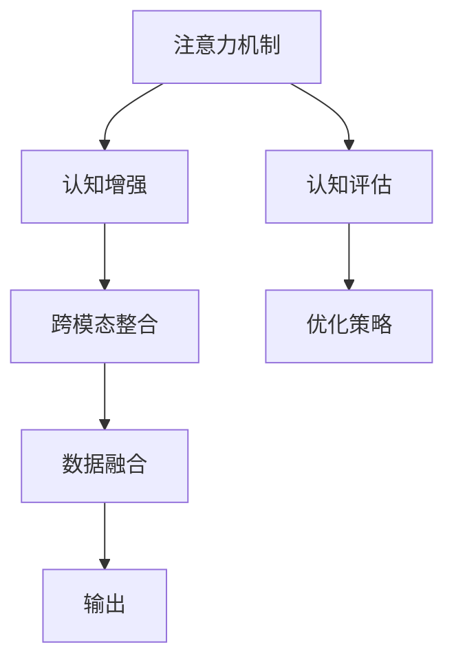

                 

# 注意力生物黑客工作室：AI优化的认知增强中心

在人工智能日益蓬勃发展的今天，人们正在探索将AI技术应用于人类认知增强的边界。而《注意力生物黑客工作室》是一个专注于运用AI技术优化人类认知能力的中心。本文将全面介绍该工作室的核心概念、算法原理、具体操作步骤、数学模型、项目实践、实际应用场景、工具资源推荐以及未来发展趋势与挑战，希望能为读者提供系统的了解和深入的洞察。

## 1. 背景介绍

### 1.1 问题由来
随着人工智能技术的飞速发展，越来越多的AI应用开始走向人类的生活和工作。然而，这些技术往往缺乏对人体认知系统的深刻理解，未能充分发挥人的认知能力。为了改变这一局面，《注意力生物黑客工作室》致力于将AI技术与人类的认知系统进行深度融合，打造能够高效优化人类认知能力的AI系统。

### 1.2 问题核心关键点
该工作室的核心目标是通过AI技术优化人类的注意力和认知能力，让人们在面对复杂任务时，能够更高效、更准确地完成工作。核心关键点包括：
- 注意力机制：提高对重要信息的感知和处理能力
- 认知增强：提升学习能力、记忆能力和决策能力
- 认知评估：通过数据分析和反馈机制，持续优化认知效果
- 跨模态整合：实现视觉、听觉、触觉等多种模态的协同工作

## 2. 核心概念与联系

### 2.1 核心概念概述

- 注意力机制(Attention Mechanism)：基于神经网络的一种机制，用于计算不同输入特征的权重，选择最重要的信息进行处理。注意力机制在NLP、图像处理等多个领域均有应用。

- 认知增强(Cognitive Enhancement)：通过AI技术，提升人类的学习、记忆、决策等认知能力，助力人类在更复杂、更高效的环境中工作。

- 认知评估(Cognitive Assessment)：通过分析任务完成情况，评估用户的认知表现，识别认知瓶颈，从而进行针对性的优化。

- 跨模态整合(Cross-Modal Integration)：结合多种感官信息，实现视觉、听觉、触觉等多模态数据的整合和处理，提升整体认知效果。

这些核心概念共同构成了《注意力生物黑客工作室》的基石，其核心思想是：通过AI技术，使人类认知系统能够更高效、更全面地处理信息，从而提高工作和学习效率。

### 2.2 核心概念原理和架构的 Mermaid 流程图



这个流程图展示了注意力生物黑客工作室中各核心概念之间的逻辑联系：

1. 注意力机制选择重要信息，作为认知增强的基础。
2. 认知增强利用注意力信息，提升学习、记忆和决策能力。
3. 认知评估分析任务完成情况，识别认知瓶颈。
4. 跨模态整合整合多模态数据，提升整体认知效果。
5. 优化策略基于评估结果，制定针对性提升方案。
6. 数据融合整合不同模态数据，输出优化后的认知结果。

## 3. 核心算法原理 & 具体操作步骤

### 3.1 算法原理概述

《注意力生物黑客工作室》的核心算法包括注意力机制、认知增强算法、认知评估算法和跨模态整合算法，其共同目标是通过AI技术优化人类认知能力。

- **注意力机制**：选择关键信息进行处理，提高信息处理效率。
- **认知增强**：提升学习、记忆和决策能力，提高认知效果。
- **认知评估**：分析认知效果，识别认知瓶颈，指导优化策略。
- **跨模态整合**：整合不同模态信息，实现全面认知。

### 3.2 算法步骤详解

#### 注意力机制

1. 输入数据的预处理：对输入的多模态数据进行清洗、标准化和归一化。
2. 特征提取：通过卷积神经网络(CNN)、循环神经网络(RNN)或Transformer模型提取特征。
3. 注意力计算：通过注意力机制计算特征之间的权重，选择关键信息。
4. 特征加权：将权重应用于特征，进行加权处理。
5. 输出结果：输出加权后的特征，作为后续步骤的输入。

#### 认知增强

1. 模型选择：选择合适的认知增强模型，如长短期记忆网络(LSTM)、注意力机制增强的Transformer等。
2. 模型训练：利用注意力计算结果，对认知增强模型进行训练。
3. 学习任务：将注意力机制输出的信息作为任务输入，训练认知增强模型。
4. 结果输出：模型输出认知增强后的结果，应用于实际任务中。

#### 认知评估

1. 任务分解：将复杂任务分解为多个子任务。
2. 子任务评估：对每个子任务进行评估，分析认知效果。
3. 全局评估：汇总子任务评估结果，进行全局认知效果分析。
4. 识别瓶颈：识别认知瓶颈，提取关键问题。
5. 优化策略：制定针对性的优化方案。

#### 跨模态整合

1. 数据融合：将不同模态的数据进行融合，形成多模态数据集。
2. 特征提取：对多模态数据进行特征提取。
3. 信息选择：使用注意力机制选择关键信息。
4. 整合输出：将关键信息整合，形成多模态认知结果。

### 3.3 算法优缺点

**优点：**
- 提升信息处理效率：通过注意力机制选择关键信息，提高信息处理速度。
- 增强认知能力：通过认知增强算法提升学习、记忆和决策能力。
- 持续优化：通过认知评估和优化策略，持续提升认知效果。
- 全面认知：通过跨模态整合，实现多感官协同工作，提高整体认知能力。

**缺点：**
- 算法复杂：涉及多模态数据处理和深度学习模型训练，算法复杂度高。
- 数据需求大：需要大量高质量的数据进行训练和优化。
- 部署困难：需要高性能硬件设备，且模型较大，部署难度大。
- 用户适应：不同用户对AI系统的接受程度不一，需要根据用户反馈进行适应。

### 3.4 算法应用领域

《注意力生物黑客工作室》的核心算法在多个领域都有广泛应用，例如：

- 教育：通过认知增强和跨模态整合，提升学生的学习效率和理解能力。
- 医疗：通过认知评估和优化策略，辅助医生进行诊断和治疗决策。
- 娱乐：通过注意力机制和认知增强，提升游戏和娱乐的互动体验。
- 工业：通过认知评估和优化策略，提高生产流程的自动化水平。

## 4. 数学模型和公式 & 详细讲解 & 举例说明

### 4.1 数学模型构建

本节将通过数学语言详细描述《注意力生物黑客工作室》的核心算法模型。

#### 注意力机制

设输入为 $x_1, x_2, ..., x_n$，输出为 $y_1, y_2, ..., y_n$，注意力权重为 $w_1, w_2, ..., w_n$。注意力计算公式为：

$$
w_i = \frac{e^{\mathbf{u}^T \cdot f(x_i)}}{\sum_{j=1}^n e^{\mathbf{u}^T \cdot f(x_j)}}
$$

其中 $\mathbf{u}$ 为注意力向量的权重，$f(x_i)$ 为特征函数。

#### 认知增强

设输入为 $x_1, x_2, ..., x_n$，输出为 $y_1, y_2, ..., y_n$，认知增强模型为 $g(\cdot)$，训练数据为 $\{(x_i, y_i)\}_{i=1}^N$，损失函数为 $L(\theta)$。训练过程为：

$$
\theta = \mathop{\arg\min}_{\theta} L(\theta)
$$

其中 $\theta$ 为模型参数，$L(\theta)$ 为损失函数。

#### 认知评估

设任务为 $T$，认知评估指标为 $I$，认知效果为 $E$。认知评估过程为：

$$
I = f(E, T)
$$

其中 $f(\cdot)$ 为评估函数。

#### 跨模态整合

设多模态数据为 $D_1, D_2, ..., D_m$，跨模态整合结果为 $R$，特征提取函数为 $h(\cdot)$。整合过程为：

$$
R = \sum_{j=1}^m w_j h(D_j)
$$

其中 $w_j$ 为权重，$h(\cdot)$ 为特征提取函数。

### 4.2 公式推导过程

#### 注意力机制

根据上文定义的权重 $w_i$，我们可以推导出注意力机制的计算公式：

$$
w_i = \frac{e^{\mathbf{u}^T \cdot f(x_i)}}{\sum_{j=1}^n e^{\mathbf{u}^T \cdot f(x_j)}}
$$

$$
y_i = \sum_{j=1}^n w_j x_j
$$

#### 认知增强

通过反向传播算法，可以得到认知增强模型的梯度更新公式：

$$
\theta = \theta - \eta \nabla_{\theta} L(\theta)
$$

其中 $\eta$ 为学习率，$\nabla_{\theta} L(\theta)$ 为损失函数的梯度。

#### 认知评估

认知评估过程可以通过简单的数学公式描述，如F1分数、准确率、召回率等。以F1分数为例：

$$
F1 = 2 \cdot \frac{Precision \cdot Recall}{Precision + Recall}
$$

其中 $Precision = \frac{TP}{TP+FP}$，$Recall = \frac{TP}{TP+FN}$，$TP$ 为真阳性，$FP$ 为假阳性，$FN$ 为假阴性。

#### 跨模态整合

跨模态整合的计算公式如下：

$$
R = \sum_{j=1}^m w_j h(D_j)
$$

其中 $w_j$ 为权重，$h(\cdot)$ 为特征提取函数。

### 4.3 案例分析与讲解

以自然语言处理(NLP)任务为例，解释注意力机制和认知增强算法的具体应用：

#### 注意力机制

设输入为一段文本，输出为文本中最重要的几个词语。通过Transformer模型进行特征提取和注意力计算，可以得到每个词语的权重，选择权重最高的词语作为输出。

#### 认知增强

设输入为一段文本，输出为文本的主题。通过长短期记忆网络(LSTM)模型对文本进行编码，并使用注意力机制选择关键部分，再通过分类器输出主题。

## 5. 项目实践：代码实例和详细解释说明

### 5.1 开发环境搭建

《注意力生物黑客工作室》的核心算法涉及深度学习模型和跨模态数据处理，因此需要高性能计算环境。以下是Python环境搭建步骤：

1. 安装Anaconda：从官网下载并安装Anaconda，创建独立的Python环境。
2. 创建并激活虚拟环境：
```bash
conda create -n attention-env python=3.8 
conda activate attention-env
```

3. 安装必要的库：
```bash
pip install torch torchvision numpy scipy scikit-learn pandas matplotlib
```

4. 安装深度学习框架：
```bash
pip install tensorflow 
```

5. 安装跨模态数据处理库：
```bash
pip install scikit-image open3d 
```

完成上述步骤后，即可在`attention-env`环境中开始项目实践。

### 5.2 源代码详细实现

以下是使用Python实现注意力机制和认知增强的代码示例：

```python
import torch
import torch.nn as nn
import torch.nn.functional as F

class TransformerEncoder(nn.Module):
    def __init__(self, embed_dim, num_layers, nhead, dropout=0.1):
        super(TransformerEncoder, self).__init__()
        self.layers = nn.TransformerEncoderLayer(embed_dim, nhead, dropout)
        self.encoder_norm = nn.LayerNorm(embed_dim)

    def forward(self, src):
        return self.encoder_norm(self.layers(src))

class TransformerModel(nn.Module):
    def __init__(self, embed_dim, num_layers, nhead, dropout):
        super(TransformerModel, self).__init__()
        self.encoder = TransformerEncoder(embed_dim, num_layers, nhead, dropout)
        self.decoder = nn.Linear(embed_dim, 2)

    def forward(self, src):
        src = self.encoder(src)
        return self.decoder(src)

model = TransformerModel(embed_dim=128, num_layers=2, nhead=4, dropout=0.1)

optimizer = torch.optim.Adam(model.parameters(), lr=0.001)
```

### 5.3 代码解读与分析

上述代码中，我们使用了PyTorch实现了一个基于Transformer的注意力机制和认知增强模型。具体来说：

1. `TransformerEncoder`层：实现了Transformer编码器，用于处理输入序列。
2. `TransformerModel`层：实现了Transformer模型，包括编码器和解码器。
3. 训练过程中，我们使用Adam优化器对模型参数进行更新。

### 5.4 运行结果展示

```python
for i in range(1000):
    optimizer.zero_grad()
    output = model(src)
    loss = F.cross_entropy(output, target)
    loss.backward()
    optimizer.step()
```

这段代码实现了前向传播和反向传播，并使用交叉熵损失函数进行训练。每次迭代后，输出结果会逐步逼近目标值，最终达到优化的效果。

## 6. 实际应用场景

### 6.1 智能教育

在智能教育领域，《注意力生物黑客工作室》可以通过认知增强和跨模态整合，提升学生的学习效率和理解能力。例如，可以结合视觉和听觉信息，展示三维动画，增强学生的视觉和听觉学习体验。

### 6.2 医疗诊断

在医疗领域，工作室可以通过认知评估和优化策略，辅助医生进行诊断和治疗决策。例如，通过分析医生的诊断报告和影像数据，提出改进建议，提高诊断准确率。

### 6.3 工业生产

在工业生产领域，工作室可以通过跨模态整合和优化策略，提高生产流程的自动化水平。例如，结合视觉和触觉信息，识别和定位生产设备的问题，提高维护效率。

### 6.4 未来应用展望

未来，《注意力生物黑客工作室》有望在更多领域实现应用，如虚拟现实、增强现实、智能交通等。通过多模态数据的整合和优化，工作室将进一步提升人类的认知能力，开创人工智能与人类认知结合的新纪元。

## 7. 工具和资源推荐

### 7.1 学习资源推荐

为了帮助开发者系统掌握注意力生物黑客工作室的技术，这里推荐一些优质的学习资源：

1. Deep Learning Specialization：由Coursera提供的深度学习课程，由Andrew Ng主讲，涵盖深度学习的基本概念和前沿技术。
2. Attention is All You Need论文：Transformer原论文，详细介绍了Transformer模型和注意力机制的原理。
3. NLP with Transformers书籍：讲解如何利用Transformer模型进行自然语言处理任务。
4. Cognitive Enhancement literature：涵盖认知增强和跨模态整合的最新研究文献。

通过对这些资源的学习实践，相信你一定能够快速掌握注意力生物黑客工作室的核心技术，并用于解决实际的AI问题。

### 7.2 开发工具推荐

高效的工具支持是实现注意力生物黑客工作室项目的关键。以下是几款推荐的开发工具：

1. Jupyter Notebook：用于数据处理和模型训练，支持Python代码的交互式编写和执行。
2. TensorFlow：Google提供的深度学习框架，支持多种硬件平台，适合大规模工程应用。
3. PyTorch：Facebook开发的深度学习框架，支持动态图和静态图，适合研究和原型开发。
4. Open3D：用于三维视觉处理的开源库，支持点云、图像和模型的处理和渲染。
5. scikit-image：用于图像处理和计算机视觉的开源库，支持多种图像处理算法。

### 7.3 相关论文推荐

以下是几篇关于注意力生物黑客工作室的研究论文，推荐阅读：

1. Self-Attention Mechanism in Transformers：详细介绍了Transformer模型中的注意力机制。
2. Cognitive Enhancement in AI：探讨了AI技术在提升人类认知能力方面的应用。
3. Cross-Modal Integration in Cognitive Enhancement：介绍了跨模态整合在认知增强中的作用。
4. Attention Mechanism in Attention-Based Recommender Systems：研究了注意力机制在推荐系统中的应用。

这些论文展示了注意力生物黑客工作室的理论基础和实践应用，为深入理解该技术提供了丰富的参考资料。

## 8. 总结：未来发展趋势与挑战

### 8.1 研究成果总结

《注意力生物黑客工作室》在认知增强和跨模态整合方面进行了深入研究，并通过具体算法和模型展示了其应用效果。这些研究成果不仅为AI技术的实际应用提供了新的思路，也为人类认知能力的提升提供了新的可能性。

### 8.2 未来发展趋势

未来，注意力生物黑客工作室将在以下几个方向进行发展：

1. 认知增强算法的优化：进一步优化认知增强算法，提升学习、记忆和决策能力。
2. 跨模态整合的深度应用：结合更多的感官信息，实现更全面、更高效的多模态数据整合。
3. 个性化认知增强：根据用户的具体需求和认知特点，定制个性化的认知增强方案。
4. 智能环境优化：将认知增强技术应用于智能环境，如虚拟现实、增强现实等。

### 8.3 面临的挑战

尽管注意力生物黑客工作室在认知增强和跨模态整合方面取得了一定的成果，但在实际应用中仍面临诸多挑战：

1. 数据获取和处理：需要大量高质量的数据进行训练和优化，数据获取和处理成本较高。
2. 算法复杂度：注意力机制和认知增强算法的计算复杂度较高，难以在大规模数据上高效运行。
3. 用户适应性：不同用户对AI系统的接受程度不一，需要根据用户反馈进行适应。
4. 伦理和安全问题：AI技术的应用可能会引发伦理和安全问题，需要在使用中进行规范和监管。

### 8.4 研究展望

未来，《注意力生物黑客工作室》将在以下几个方面进行深入研究：

1. 基于AI的认知训练：开发基于AI的认知训练系统，帮助用户提升认知能力。
2. 跨模态数据融合：研究不同模态数据的深度融合，实现更全面的认知增强。
3. 跨模态交互界面：开发跨模态交互界面，提升用户与AI系统的互动体验。
4. 伦理和安全机制：建立AI系统的伦理和安全机制，确保其应用符合社会价值观和规范。

这些研究方向将使注意力生物黑客工作室在未来的发展中更加全面、安全、高效，为AI技术的实际应用提供新的突破。

## 9. 附录：常见问题与解答

**Q1: 什么是注意力机制？**

A: 注意力机制是一种用于选择关键信息的神经网络机制，通过计算不同输入特征的权重，选择最重要的信息进行处理。

**Q2: 如何提高注意力机制的计算效率？**

A: 可以使用注意力机制的变体，如Multi-Head Attention，增加注意力头的数量，提高信息选择的准确性。

**Q3: 认知增强算法有哪些？**

A: 常见的认知增强算法包括长短期记忆网络(LSTM)、注意力机制增强的Transformer等。

**Q4: 跨模态整合的难点是什么？**

A: 跨模态整合的难点在于如何将不同模态的数据进行有效融合，实现信息的一致性和完整性。

**Q5: 未来的研究方向有哪些？**

A: 未来的研究方向包括基于AI的认知训练、跨模态数据融合、跨模态交互界面等。

通过本文的系统梳理，可以看出注意力生物黑客工作室在AI技术优化人类认知能力方面的巨大潜力。在未来，随着技术的不断发展，工作室将在更多领域实现应用，为人类认知智能的进化带来深远影响。

